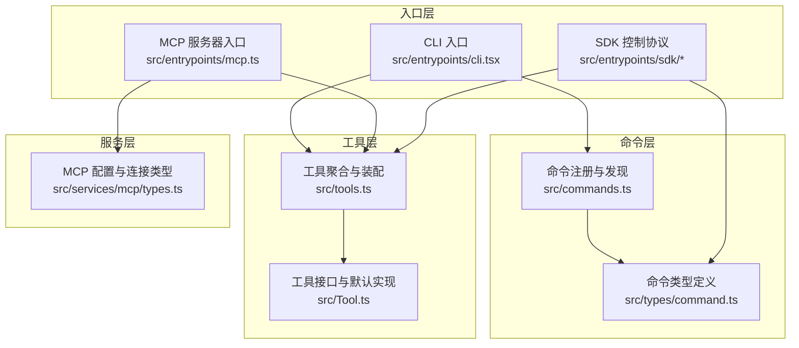
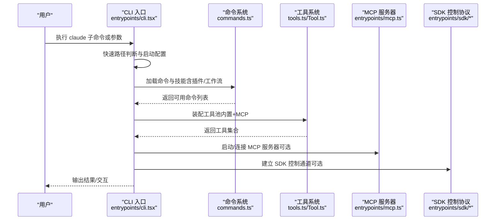
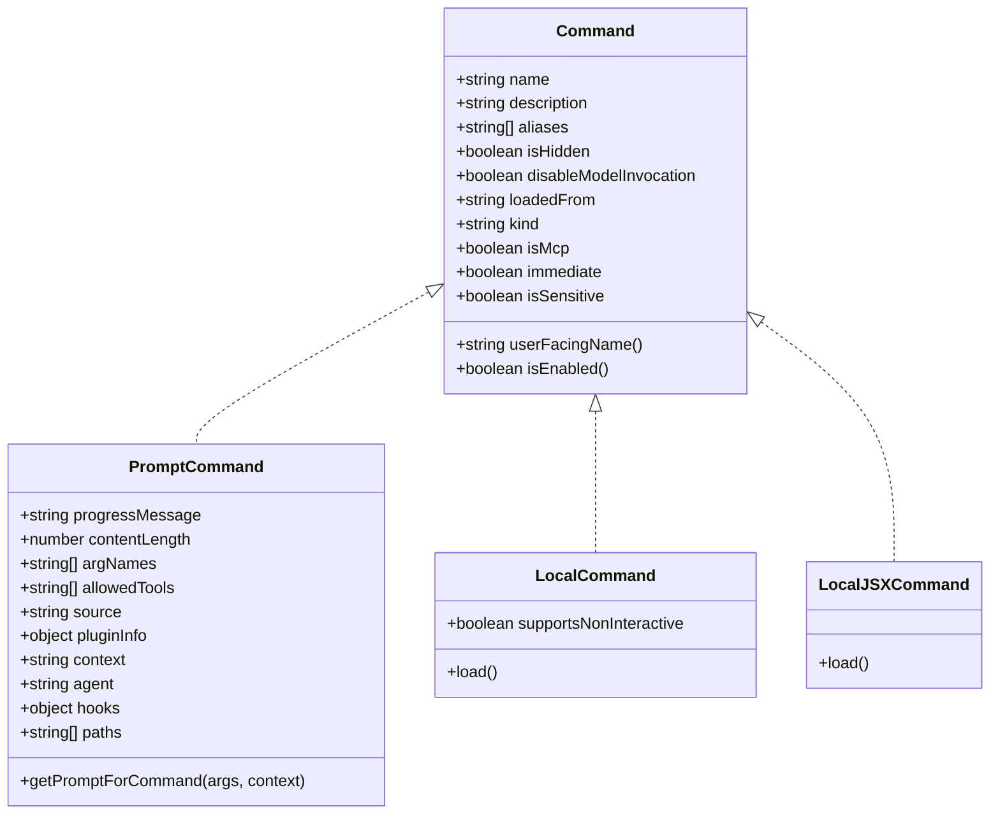
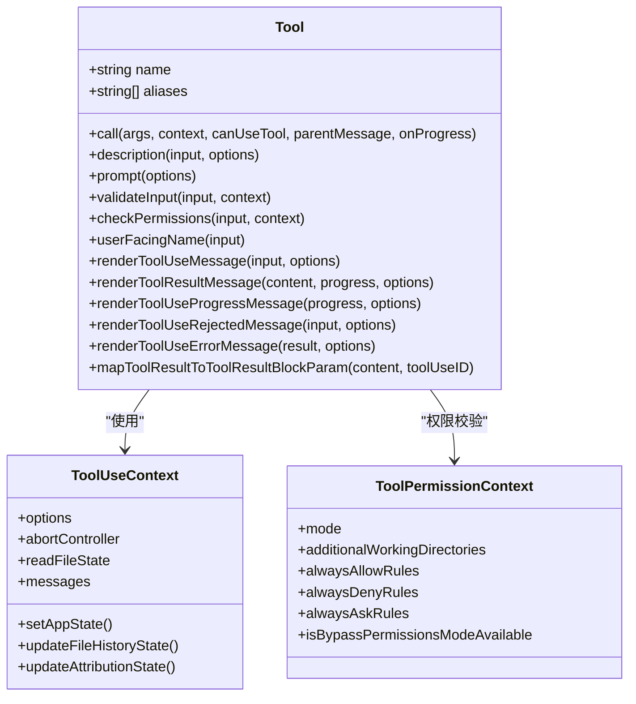
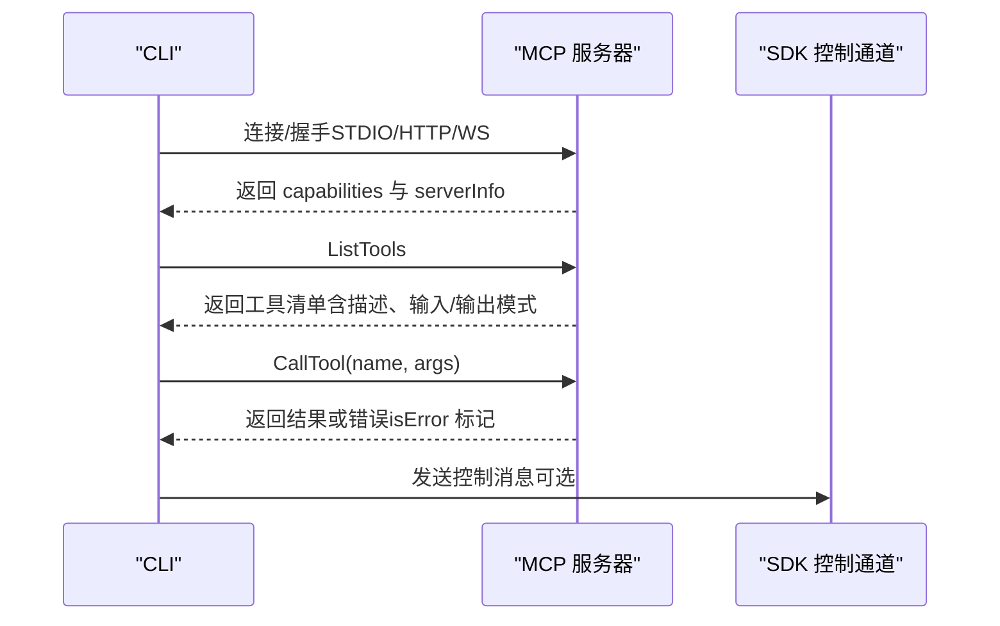
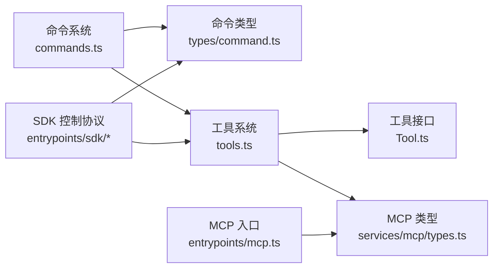

# API 参考

<cite>
**本文引用的文件**
- [README.md](file://README.md)
- [package.json](file://package.json)
- [src/entrypoints/cli.tsx](file://src/entrypoints/cli.tsx)
- [src/commands.ts](file://src/commands.ts)
- [src/types/command.ts](file://src/types/command.ts)
- [src/entrypoints/mcp.ts](file://src/entrypoints/mcp.ts)
- [src/services/mcp/types.ts](file://src/services/mcp/types.ts)
- [src/entrypoints/sdk/coreTypes.ts](file://src/entrypoints/sdk/coreTypes.ts)
- [src/entrypoints/sdk/controlSchemas.ts](file://src/entrypoints/sdk/controlSchemas.ts)
- [src/entrypoints/sdk/coreSchemas.ts](file://src/entrypoints/sdk/coreSchemas.ts)
- [src/tools.ts](file://src/tools.ts)
- [src/Tool.ts](file://src/Tool.ts)
</cite>

## 目录
1. [简介](#简介)
2. [项目结构](#项目结构)
3. [核心组件](#核心组件)
4. [架构总览](#架构总览)
5. [详细组件分析](#详细组件分析)
6. [依赖关系分析](#依赖关系分析)
7. [性能考量](#性能考量)
8. [故障排查指南](#故障排查指南)
9. [结论](#结论)
10. [附录](#附录)

## 简介
本文件为 Claude Code（非官方提取）的 API 参考文档，覆盖命令行 API、工具 API、插件 API、MCP 协议 API、类型定义参考、内部 API 以及使用示例与错误码说明。目标是帮助开发者快速定位并理解各类 API 的用法与行为。

## 项目结构
该项目为终端交互式 AI 助手的 CLI 工具，采用模块化设计，主要目录与职责如下：
- src/entrypoints：入口点与对外协议（CLI、MCP、SDK）
- src/commands：命令实现与注册（内置命令、技能、插件技能等）
- src/tools：工具实现（文件读写、搜索、任务、代理等）
- src/services：服务层（MCP、OAuth、会话记忆、分析等）
- src/types：类型定义（命令、权限、消息、工具等）
- src/cli：CLI 辅助模块（传输、IO、更新等）

图表来源
- [src/entrypoints/cli.tsx](file://src/entrypoints/cli.tsx)
- [src/commands.ts](file://src/commands.ts)
- [src/types/command.ts](file://src/types/command.ts)
- [src/entrypoints/mcp.ts](file://src/entrypoints/mcp.ts)
- [src/tools.ts](file://src/tools.ts)
- [src/Tool.ts](file://src/Tool.ts)
- [src/services/mcp/types.ts](file://src/services/mcp/types.ts)

章节来源
- [README.md](file://README.md)
- [package.json](file://package.json)

## 核心组件
- 命令系统：统一的命令类型与生命周期，支持 prompt/local/local-jsx 三类命令；动态加载技能与插件命令；按可用性与启用状态过滤。
- 工具系统：抽象的 Tool 接口，统一输入输出、权限校验、进度渲染、结果展示；支持 MCP 工具与内置工具合并。
- MCP 协议：基于 Model Context Protocol 的服务器端能力，支持 STDIO/HTTP/WS 等传输，OAuth/XAA 支持，工具清单与调用。
- SDK 协议：控制请求/响应、钩子事件、环境变量更新、上下文使用统计等消息格式。
- 类型系统：通过 Zod 生成的类型与常量（如 HOOK_EVENTS、EXIT_REASONS），保证跨进程通信一致性。

章节来源
- [src/commands.ts](file://src/commands.ts)
- [src/types/command.ts](file://src/types/command.ts)
- [src/tools.ts](file://src/tools.ts)
- [src/Tool.ts](file://src/Tool.ts)
- [src/entrypoints/mcp.ts](file://src/entrypoints/mcp.ts)
- [src/services/mcp/types.ts](file://src/services/mcp/types.ts)
- [src/entrypoints/sdk/coreTypes.ts](file://src/entrypoints/sdk/coreTypes.ts)
- [src/entrypoints/sdk/controlSchemas.ts](file://src/entrypoints/sdk/controlSchemas.ts)
- [src/entrypoints/sdk/coreSchemas.ts](file://src/entrypoints/sdk/coreSchemas.ts)

## 架构总览
下图展示了 CLI 启动到命令执行的关键路径，以及 MCP 与 SDK 的集成方式。

图表来源
- [src/entrypoints/cli.tsx](file://src/entrypoints/cli.tsx)
- [src/commands.ts](file://src/commands.ts)
- [src/tools.ts](file://src/tools.ts)
- [src/Tool.ts](file://src/Tool.ts)
- [src/entrypoints/mcp.ts](file://src/entrypoints/mcp.ts)
- [src/entrypoints/sdk/controlSchemas.ts](file://src/entrypoints/sdk/controlSchemas.ts)

## 详细组件分析

### 命令行 API（CLI）
- 入口与快速路径
  - 版本查询、系统提示导出、远程控制、守护进程、后台会话、模板作业、环境运行器、自托管运行器、工作树 tmux 等快速路径均在 CLI 入口集中处理，避免不必要的模块加载。
  - 支持 --update/--upgrade 自动重定向到 update 子命令。
  - --bare 会提前设置简单模式环境变量。
- 主流程
  - 启动时捕获早期输入，加载主 CLI 并完成初始化。
- 常见子命令与用途
  - 远程控制/同步/桥接：remote-control/rc/remote/sync/bridge（需鉴权与策略限制检查）
  - 守护进程：daemon
  - 后台会话：ps/logs/attach/kill 与 --bg/--background
  - 模板作业：new/list/reply
  - 环境运行器：environment-runner
  - 自托管运行器：self-hosted-runner
  - 工作树：--worktree 与 --tmux 组合
  - 其他：help、version、init、login/logout、config、context、diff、review、task、plugin、mcp 等

章节来源
- [src/entrypoints/cli.tsx](file://src/entrypoints/cli.tsx)

### 命令系统 API（命令类型与生命周期）
- 命令类型
  - prompt：模型可调用的技能命令，支持禁用模型调用、路径匹配、上下文 fork 等。
  - local：本地命令，延迟加载，支持非交互与 JSX 渲染。
  - local-jsx：仅用于 REPL/UI 的本地命令，不直接暴露给模型。
- 关键字段与能力
  - availability：按订阅/控制台 API 用户区分可见性。
  - isEnabled/isHidden：按特性开关与环境变量控制启用/隐藏。
  - userFacingName/argumentHint/whenToUse/version/disableModelInvocation 等元数据。
  - loadedFrom/kind/isMcp/immediate/isSensitive 等扩展属性。
- 命令发现与过滤
  - 内置命令 + 技能目录命令 + 插件技能 + 插件命令 + 工作流命令聚合。
  - 按可用性与启用状态过滤，动态技能去重插入。
  - 远程安全命令与桥接安全命令白名单。

图表来源
- [src/types/command.ts](file://src/types/command.ts)

章节来源
- [src/commands.ts](file://src/commands.ts)
- [src/types/command.ts](file://src/types/command.ts)

### 工具 API（工具接口与装配）
- 工具接口（Tool）
  - 输入/输出模式：Zod Schema 或 JSON Schema；支持等价输入比较、并发安全、只读/破坏性标记。
  - 生命周期：validateInput → checkPermissions → call → 结果渲染/进度回调。
  - 渲染与展示：renderToolUseMessage/renderToolResultMessage/renderToolUseProgressMessage 等。
  - 权限上下文：ToolPermissionContext 包含模式、额外工作目录、规则集、是否允许绕过权限等。
  - 上下文 ToolUseContext：包含命令、工具、MCP 客户端、消息、文件缓存、中断控制器等。
- 工具装配
  - getAllBaseTools：按环境与特性开关收集内置工具。
  - getTools：应用模式过滤（简单模式/REPL）、REPL 隐藏原语、按权限规则过滤。
  - assembleToolPool/getMergedTools：合并内置与 MCP 工具，保持稳定排序与去重。
- 常用工具类别
  - 文件操作：FileRead/FileEdit/FileWrite/NotebookEdit
  - 搜索：Grep/Glob
  - Shell：Bash/PowerShell
  - 任务与团队：Task*、Team*、SendMessage
  - MCP：ListMcpResources/ReadMcpResource
  - 其他：AgentTool、WebSearch/WebFetch、LSP、ToolSearch 等

图表来源
- [src/Tool.ts](file://src/Tool.ts)
- [src/tools.ts](file://src/tools.ts)

章节来源
- [src/tools.ts](file://src/tools.ts)
- [src/Tool.ts](file://src/Tool.ts)

### 插件 API（插件命令与技能）
- 插件命令与技能加载
  - 从插件目录与技能目录动态加载命令与技能，并进行去重与可用性过滤。
  - 插件技能与内置技能共同参与模型可调用技能列表。
- 插件安装与管理
  - 提供插件安装、卸载、重载等命令与工具。
- 插件与命令的元数据
  - pluginInfo、loadedFrom、source 等标识插件来源与类型。

章节来源
- [src/commands.ts](file://src/commands.ts)

### MCP 协议 API（MCP 服务器接口）
- 服务器配置与类型
  - 支持 STDIO、HTTP、WebSocket、SSE、IDE 内部通道、SDK 等传输类型。
  - OAuth/XAA 配置、认证头、元数据等。
  - 连接状态：connected/failed/needs-auth/pending/disabled。
- 工具暴露与调用
  - 列表工具：将内置工具转换为 MCP 工具描述（含输入/输出 JSON Schema）。
  - 调用工具：参数校验、权限检查、执行工具、错误处理与结果封装。
- 服务器状态与动态管理
  - 获取/设置 MCP 服务器、重连、切换启用状态、错误映射。

图表来源
- [src/entrypoints/mcp.ts](file://src/entrypoints/mcp.ts)
- [src/services/mcp/types.ts](file://src/services/mcp/types.ts)

章节来源
- [src/entrypoints/mcp.ts](file://src/entrypoints/mcp.ts)
- [src/services/mcp/types.ts](file://src/services/mcp/types.ts)

### SDK 协议 API（控制协议与消息）
- 控制请求/响应
  - 初始化、中断、权限请求、设置模型/思考令牌上限、MCP 状态、上下文使用统计、回滚文件、取消异步消息、种子读取状态、钩子回调、MCP 消息、设置/重载 MCP 服务器、停止任务、应用标志设置、获取设置、发起用户输入等。
- 消息格式
  - stdout/stdin 消息联合类型，包含用户消息、控制请求/响应、保活消息、环境变量更新等。
- 钩子事件
  - 预工具使用、后工具使用、失败、通知、用户提交、会话开始/结束、停止/失败、子代理开始/结束、压缩前后、权限请求/拒绝、设置变更、指令加载、工作树创建/移除、CWD 变更、文件变更等。
- 常量
  - HOOK_EVENTS、EXIT_REASONS 等运行时常量数组。

```mermaid
flowchart TD
Start(["控制请求到达"]) --> Parse["解析请求类型"]
Parse --> Init["initialize<br/>设置钩子/MCP/代理/输出样式"]
Parse --> Interrupt["interrupt<br/>中断当前轮次"]
Parse --> Perm["can_use_tool<br/>权限请求"]
Parse --> SetModel["set_model<br/>切换模型"]
Parse --> SetThink["set_max_thinking_tokens<br/>设置思考令牌上限"]
Parse --> MCPPing["mcp_status<br/>查询 MCP 状态"]
Parse --> Ctx["get_context_usage<br/>上下文使用统计"]
Parse --> Rewind["rewind_files<br/>回滚文件变更"]
Parse --> Cancel["cancel_async_message<br/>取消异步消息"]
Parse --> Seed["seed_read_state<br/>种子读取状态"]
Parse --> Hook["hook_callback<br/>钩子回调"]
Parse --> MCPPut["mcp_message<br/>发送 JSON-RPC 消息"]
Parse --> MCPSet["mcp_set_servers<br/>设置动态 MCP 服务器"]
Parse --> Reload["reload_plugins<br/>重载插件"]
Parse --> MCPReconnect["mcp_reconnect<br/>重连服务器"]
Parse --> MCToggle["mcp_toggle<br/>启用/禁用服务器"]
Parse --> StopTask["stop_task<br/>停止任务"]
Parse --> ApplyFlags["apply_flag_settings<br/>应用标志设置"]
Parse --> GetSettings["get_settings<br/>获取设置"]
Parse --> Elicit["elicitation<br/>发起用户输入"]
Init --> Resp["返回控制响应"]
Interrupt --> Resp
Perm --> Resp
SetModel --> Resp
SetThink --> Resp
MCPPing --> Resp
Ctx --> Resp
Rewind --> Resp
Cancel --> Resp
Seed --> Resp
Hook --> Resp
MCPPut --> Resp
MCPSet --> Resp
Reload --> Resp
MCPReconnect --> Resp
MCToggle --> Resp
StopTask --> Resp
ApplyFlags --> Resp
GetSettings --> Resp
Elicit --> Resp
Resp --> End(["结束"])
```

图表来源
- [src/entrypoints/sdk/controlSchemas.ts](file://src/entrypoints/sdk/controlSchemas.ts)
- [src/entrypoints/sdk/coreSchemas.ts](file://src/entrypoints/sdk/coreSchemas.ts)
- [src/entrypoints/sdk/coreTypes.ts](file://src/entrypoints/sdk/coreTypes.ts)

章节来源
- [src/entrypoints/sdk/controlSchemas.ts](file://src/entrypoints/sdk/controlSchemas.ts)
- [src/entrypoints/sdk/coreSchemas.ts](file://src/entrypoints/sdk/coreSchemas.ts)
- [src/entrypoints/sdk/coreTypes.ts](file://src/entrypoints/sdk/coreTypes.ts)

### 类型定义参考（TypeScript 类型与接口）
- 命令类型
  - Command/PromptCommand/LocalCommand/LocalJSXCommand 及其扩展字段。
  - CommandBase：name/description/aliases/availability/isHidden/isEnabled 等。
- 工具类型
  - Tool/Tools、ToolUseContext、ToolPermissionContext、ToolResult、ToolProgressData 等。
  - 输入/输出 Schema、只读/破坏性、并发安全、权限校验、渲染回调等。
- MCP 类型
  - 服务器配置（STDIO/HTTP/WS/SSE/SDK/代理）、连接状态、资源类型、CLI 状态序列化等。
- SDK 类型
  - 控制请求/响应、钩子输入、权限规则、MCP 状态、输出格式、模型用量等。
  - HOOK_EVENTS、EXIT_REASONS 常量数组。

章节来源
- [src/types/command.ts](file://src/types/command.ts)
- [src/Tool.ts](file://src/Tool.ts)
- [src/services/mcp/types.ts](file://src/services/mcp/types.ts)
- [src/entrypoints/sdk/coreTypes.ts](file://src/entrypoints/sdk/coreTypes.ts)
- [src/entrypoints/sdk/coreSchemas.ts](file://src/entrypoints/sdk/coreSchemas.ts)

### 内部 API（核心模块公共接口）
- 命令系统
  - getCommands/getSkillToolCommands/getSlashCommandToolSkills/filterCommandsForRemoteMode/isBridgeSafeCommand 等。
- 工具系统
  - getAllBaseTools/getTools/assembleToolPool/getMergedTools/filterToolsByDenyRules 等。
- MCP 系统
  - 服务器配置解析、连接状态管理、OAuth/XAA 支持、工具暴露与调用。
- SDK 系统
  - 控制协议消息编解码、钩子事件路由、权限决策、MCP 状态查询与动态管理。

章节来源
- [src/commands.ts](file://src/commands.ts)
- [src/tools.ts](file://src/tools.ts)
- [src/entrypoints/mcp.ts](file://src/entrypoints/mcp.ts)
- [src/entrypoints/sdk/controlSchemas.ts](file://src/entrypoints/sdk/controlSchemas.ts)

## 依赖关系分析
- 命令系统依赖工具系统与 MCP 服务器状态，以决定模型可调用的技能与工具。
- 工具系统依赖权限上下文与文件状态缓存，保障并发安全与一致性。
- SDK 控制协议与 MCP 服务器通过统一的消息格式进行交互，确保外部 SDK 与 CLI 的一致性。

图表来源
- [src/commands.ts](file://src/commands.ts)
- [src/types/command.ts](file://src/types/command.ts)
- [src/tools.ts](file://src/tools.ts)
- [src/Tool.ts](file://src/Tool.ts)
- [src/services/mcp/types.ts](file://src/services/mcp/types.ts)
- [src/entrypoints/mcp.ts](file://src/entrypoints/mcp.ts)
- [src/entrypoints/sdk/controlSchemas.ts](file://src/entrypoints/sdk/controlSchemas.ts)

章节来源
- [src/commands.ts](file://src/commands.ts)
- [src/tools.ts](file://src/tools.ts)
- [src/entrypoints/mcp.ts](file://src/entrypoints/mcp.ts)
- [src/entrypoints/sdk/controlSchemas.ts](file://src/entrypoints/sdk/controlSchemas.ts)

## 性能考量
- 模块懒加载与快速路径：CLI 入口对版本查询、系统提示导出、远程控制、守护进程、后台会话等场景进行快速路径处理，减少模块加载开销。
- 命令与工具缓存：命令与技能加载采用 memoize 缓存，避免重复 I/O 与动态导入。
- MCP 工具输入/输出 Schema 转换：将 Zod Schema 转换为 JSON Schema 时进行根级对象校验，避免复杂联合类型导致的 SDK 不兼容。
- 文件状态缓存：MCP 服务器使用大小受限的 LRU 缓存读取文件状态，防止内存无限增长。

## 故障排查指南
- 常见错误与定位
  - 工具未找到/未启用：检查工具名称、别名与 isEnabled() 返回值。
  - 权限被拒绝：查看 PermissionResult 行为与拒绝原因，确认权限模式与规则。
  - MCP 服务器连接失败：检查服务器配置、认证头、OAuth/XAA 设置与网络可达性。
  - 控制请求错误：核对请求类型与参数，关注 ControlErrorResponse 中的错误信息与挂起的权限请求。
- 日志与诊断
  - 使用日志记录工具错误与异常堆栈，便于定位问题。
  - 在 SDK 模式下，可通过钩子事件观察工具调用前后的状态变化。

章节来源
- [src/entrypoints/mcp.ts](file://src/entrypoints/mcp.ts)
- [src/entrypoints/sdk/controlSchemas.ts](file://src/entrypoints/sdk/controlSchemas.ts)

## 结论
本参考文档梳理了 Claude Code 的命令行 API、工具 API、插件 API、MCP 协议 API、SDK 控制协议与类型定义，提供了架构视图、组件关系与关键流程的可视化说明。开发者可据此快速定位 API 使用方法、理解内部机制与常见问题的排查路径。

## 附录
- 版本与发布信息
  - 包版本与二进制入口：参见 package.json。
  - 项目说明与免责声明：参见 README.md。
- 常用命令速查（示例）
  - claude --version：查看版本。
  - claude remote-control/rc/remote/sync/bridge：开启远程控制桥接（需鉴权与策略允许）。
  - claude daemon：启动守护进程。
  - claude ps/logs/attach/kill/--bg/--background：后台会话管理。
  - claude new/list/reply：模板作业。
  - claude environment-runner/self-hosted-runner：运行器模式。
  - claude --worktree/--tmux：工作树与 tmux 集成。
  - claude update：更新 CLI。
- 错误码与退出原因
  - 工具输入验证失败：返回包含错误码与消息的验证结果。
  - 工具调用失败：SDK 控制响应中的 error 字段与错误详情。
  - 退出原因：EXIT_REASONS 常量数组中的一种。

章节来源
- [package.json](file://package.json)
- [README.md](file://README.md)
- [src/Tool.ts](file://src/Tool.ts)
- [src/entrypoints/sdk/coreTypes.ts](file://src/entrypoints/sdk/coreTypes.ts)