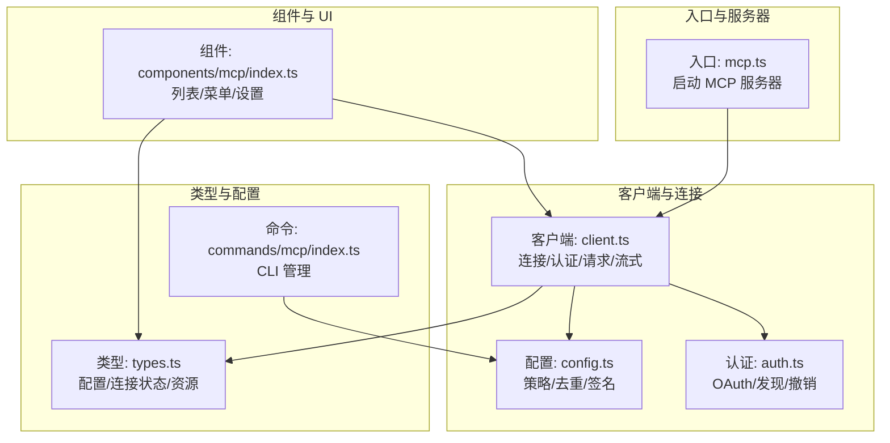
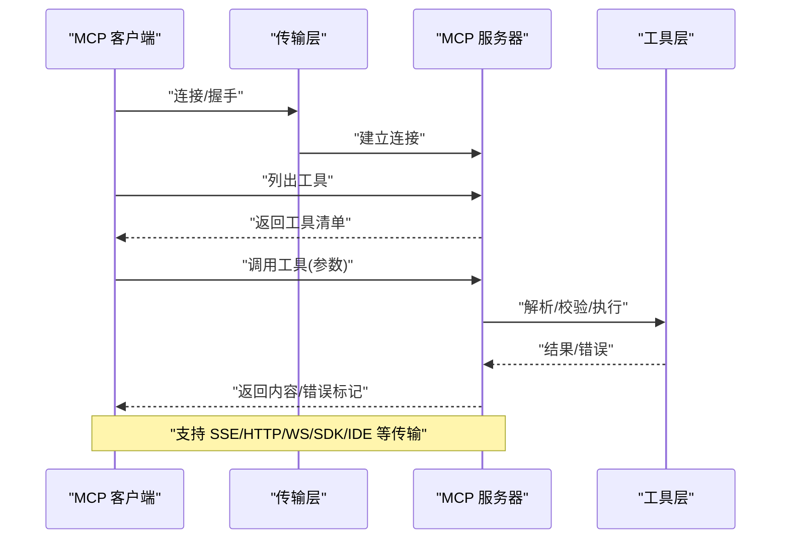
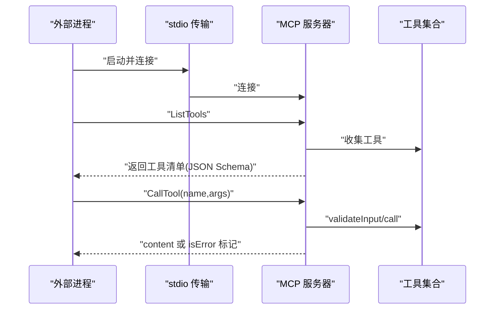
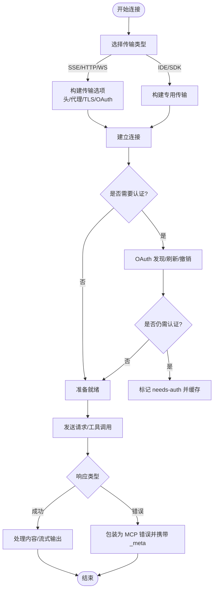
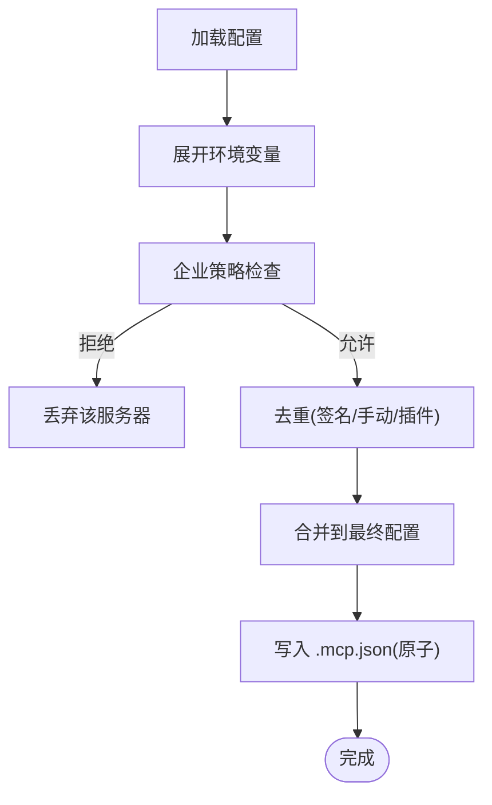
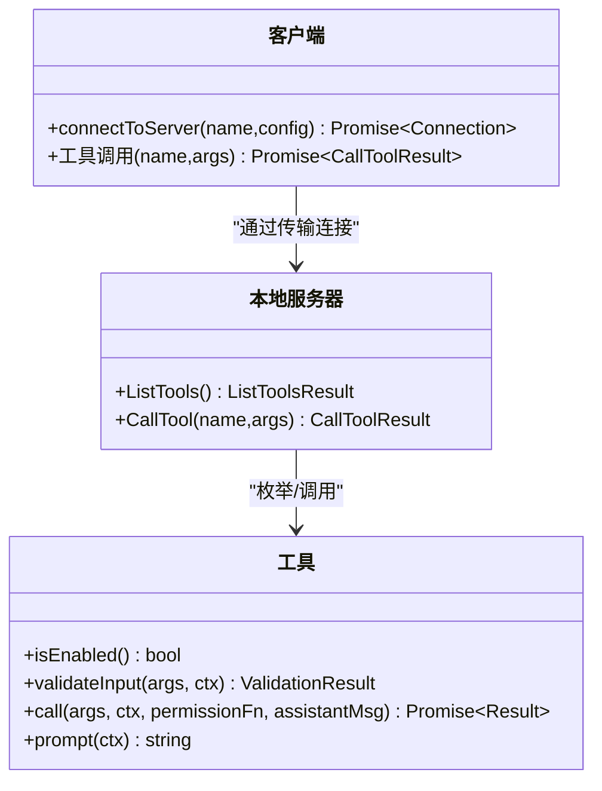
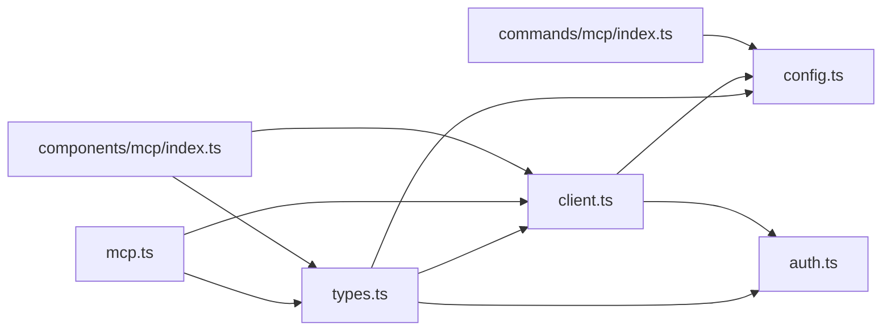

# MCP 协议 API

<cite>
**本文引用的文件**
- [mcp.ts](file://src/entrypoints/mcp.ts)
- [index.ts（命令入口）](file://src/commands/mcp/index.ts)
- [types.ts（服务类型与配置）](file://src/services/mcp/types.ts)
- [client.ts（客户端实现与连接）](file://src/services/mcp/client.ts)
- [config.ts（配置解析与策略）](file://src/services/mcp/config.ts)
- [auth.ts（认证与授权）](file://src/services/mcp/auth.ts)
- [index.ts（组件导出）](file://src/components/mcp/index.ts)
</cite>

## 目录
1. [简介](#简介)
2. [项目结构](#项目结构)
3. [核心组件](#核心组件)
4. [架构总览](#架构总览)
5. [详细组件分析](#详细组件分析)
6. [依赖关系分析](#依赖关系分析)
7. [性能考量](#性能考量)
8. [故障排除指南](#故障排除指南)
9. [结论](#结论)
10. [附录](#附录)

## 简介
本文件面向 Claude Code 的 MCP（Model Context Protocol）实现，系统化阐述 MCP 协议在该项目中的规范落地、消息格式与通信机制；覆盖 MCP 服务器接口（发现、连接、认证、会话管理）、MCP 客户端 API（初始化、资源访问、工具调用、事件处理）、服务器配置（注册、能力声明、权限控制、安全设置）、工具开发指南（接口实现、参数校验、异步处理、错误恢复）、会话管理与状态同步、数据传输与性能优化，以及与外部系统的集成与互操作。

## 项目结构
围绕 MCP 的核心代码分布在以下模块：
- 入口与服务器：提供 MCP 本地服务器启动与工具暴露能力
- 客户端与连接：负责远端/本地 MCP 服务器的连接、认证、请求与流式响应
- 配置与策略：解析与合并多源配置、企业策略过滤、去重与签名
- 认证与授权：OAuth 发现、令牌刷新、跨应用访问（XAA）、令牌撤销
- 组件与 UI：MCP 列表、菜单、设置等前端交互

**图表来源**
- [mcp.ts:35-196](file://src/entrypoints/mcp.ts#L35-L196)
- [client.ts:595-800](file://src/services/mcp/client.ts#L595-L800)
- [config.ts:1-200](file://src/services/mcp/config.ts#L1-L200)
- [auth.ts:1-120](file://src/services/mcp/auth.ts#L1-L120)
- [types.ts:1-120](file://src/services/mcp/types.ts#L1-L120)
- [index.ts（命令入口）:1-13](file://src/commands/mcp/index.ts#L1-L13)
- [index.ts（组件导出）:1-10](file://src/components/mcp/index.ts#L1-L10)

**章节来源**
- [mcp.ts:1-197](file://src/entrypoints/mcp.ts#L1-L197)
- [client.ts:1-200](file://src/services/mcp/client.ts#L1-L200)
- [config.ts:1-200](file://src/services/mcp/config.ts#L1-L200)
- [auth.ts:1-120](file://src/services/mcp/auth.ts#L1-L120)
- [types.ts:1-120](file://src/services/mcp/types.ts#L1-L120)
- [index.ts（命令入口）:1-13](file://src/commands/mcp/index.ts#L1-L13)
- [index.ts（组件导出）:1-10](file://src/components/mcp/index.ts#L1-L10)

## 核心组件
- MCP 本地服务器：通过标准输入输出（stdio）承载 MCP 协议，暴露工具清单与执行能力，支持工具输入/输出模式转换与错误包装。
- MCP 客户端：统一抽象多种传输（stdio、sse、sse-ide、ws、ws-ide、http、sdk、claudeai-proxy），内置超时、代理、头部、OAuth、XAA、会话过期检测与重连策略。
- 配置与策略：多源配置合并、企业策略（允许/拒绝列表）、去重（基于命令/URL/签名）、环境变量展开、写入原子化与权限保留。
- 认证与授权：OAuth 元数据发现、令牌刷新、撤销、跨应用访问（XAA）、步骤提升（step-up）与缓存。
- 类型与状态：统一的服务器连接状态（已连接/失败/需要认证/待连接/禁用）、资源类型、CLI 序列化状态。

**章节来源**
- [mcp.ts:35-196](file://src/entrypoints/mcp.ts#L35-L196)
- [client.ts:595-800](file://src/services/mcp/client.ts#L595-L800)
- [config.ts:536-551](file://src/services/mcp/config.ts#L536-L551)
- [auth.ts:313-470](file://src/services/mcp/auth.ts#L313-L470)
- [types.ts:179-259](file://src/services/mcp/types.ts#L179-L259)

## 架构总览
MCP 在 Claude Code 中分为“本地服务器”和“远程客户端”两部分协同工作：
- 本地服务器：以 MCP 工具形式暴露 Claude Code 内部工具，供外部 MCP 客户端调用。
- 远程客户端：连接远端 MCP 服务器（SSE/HTTP/WS/IDE 等），进行工具枚举、资源列举、提示词与工具调用，处理认证与会话生命周期。

**图表来源**
- [client.ts:595-800](file://src/services/mcp/client.ts#L595-L800)
- [mcp.ts:59-188](file://src/entrypoints/mcp.ts#L59-L188)

**章节来源**
- [client.ts:595-800](file://src/services/mcp/client.ts#L595-L800)
- [mcp.ts:35-196](file://src/entrypoints/mcp.ts#L35-L196)

## 详细组件分析

### MCP 本地服务器（入口）
- 启动流程：创建 Server 实例，声明能力（工具），绑定 ListTools 与 CallTool 请求处理器。
- 工具清单：遍历可用工具，生成 MCP 规范所需的输入/输出 JSON Schema，并按需裁剪输出模式。
- 工具调用：构造工具使用上下文（含命令集、模型、调试开关等），执行前校验输入，捕获异常并标准化为 MCP 错误响应。
- 传输：通过标准输入输出（stdio）承载协议，便于被外部进程或 IDE 插件直接连接。

**图表来源**
- [mcp.ts:35-196](file://src/entrypoints/mcp.ts#L35-L196)

**章节来源**
- [mcp.ts:35-196](file://src/entrypoints/mcp.ts#L35-L196)

### MCP 客户端 API（连接、认证、会话）
- 连接与传输：根据配置选择 SSE、HTTP、WS、IDE 特殊通道或 SDK 通道；为 SSE/WS/HTTP 分别构建传输选项，注入用户代理、代理、TLS、头部与 OAuth。
- 超时与 Accept 头：对非 GET 请求强制设置超时信号与 Streamable HTTP 所需的 Accept 值，避免单次 AbortSignal 超时导致后续请求失败。
- 认证与刷新：封装 OAuth 发现、令牌刷新、撤销；支持跨应用访问（XAA）与步骤提升（step-up）。
- 会话与状态：维护连接状态（已连接/失败/需要认证/待连接/禁用），支持批量连接与缓存键生成；对“会话未找到”（HTTP 404 + JSON-RPC -32001）进行识别与重试策略提示。
- 输出与存储：对大体量输出进行截断与持久化，支持二进制内容保存与尺寸估算。

**图表来源**
- [client.ts:595-800](file://src/services/mcp/client.ts#L595-L800)
- [auth.ts:256-311](file://src/services/mcp/auth.ts#L256-L311)

**章节来源**
- [client.ts:595-800](file://src/services/mcp/client.ts#L595-L800)
- [auth.ts:256-311](file://src/services/mcp/auth.ts#L256-L311)

### MCP 服务器配置（注册、能力声明、权限控制、安全）
- 配置类型：支持 stdio、sse、sse-ide、ws-ide、http、ws、sdk、claudeai-proxy 等传输类型；OAuth 可选字段（clientId、callbackPort、authServerMetadataUrl、XAA 标志）。
- 策略与去重：基于名称、命令数组、URL 模式进行允许/拒绝策略检查；插件与手动配置去重，URL 支持通配符匹配；签名用于检测重复连接。
- 环境变量展开：字符串中占位符自动替换；缺失变量记录以便诊断。
- 写入安全：.mcp.json 原子写入，保留文件权限，失败清理临时文件。
- 企业策略：当存在企业级 MCP 配置时，禁止用户态新增/修改；允许/拒绝列表支持多源合并。

**图表来源**
- [config.ts:536-551](file://src/services/mcp/config.ts#L536-L551)
- [config.ts:195-212](file://src/services/mcp/config.ts#L195-L212)
- [config.ts:88-131](file://src/services/mcp/config.ts#L88-L131)

**章节来源**
- [types.ts:28-135](file://src/services/mcp/types.ts#L28-L135)
- [config.ts:536-551](file://src/services/mcp/config.ts#L536-L551)
- [config.ts:195-212](file://src/services/mcp/config.ts#L195-L212)
- [config.ts:88-131](file://src/services/mcp/config.ts#L88-L131)

### MCP 工具开发指南（接口实现、参数校验、异步处理、错误恢复）
- 工具接口：工具需提供启用状态、输入/输出模式（Zod Schema）、可选 validateInput、call 方法与 prompt 描述生成。
- 参数校验：在本地服务器侧将 Zod Schema 转换为 JSON Schema，确保 MCP SDK 可消费；本地调用前进行输入校验，失败抛出明确错误。
- 异步与中断：工具调用上下文中提供 AbortController，支持取消；工具内部可异步执行并返回结构化结果。
- 错误恢复：本地服务器捕获异常并包装为 isError 标记的 MCP 结果；客户端对 401/404 等进行分类与缓存，必要时触发重新认证或重连。

**图表来源**
- [mcp.ts:59-188](file://src/entrypoints/mcp.ts#L59-L188)
- [client.ts:595-800](file://src/services/mcp/client.ts#L595-L800)

**章节来源**
- [mcp.ts:59-188](file://src/entrypoints/mcp.ts#L59-L188)
- [client.ts:595-800](file://src/services/mcp/client.ts#L595-L800)

### 会话管理、状态同步、数据传输与性能优化
- 会话与过期：识别“会话未找到”错误（HTTP 404 + JSON-RPC -32001），触发重新获取客户端与重试；连接缓存键包含配置快照，避免误判。
- 数据传输：SSE/HTTP/WS 严格遵循 Streamable HTTP Accept 头要求；对长连接（SSE）与短请求（POST）分别施加超时策略。
- 性能优化：批量连接（默认 3），远程批量连接（默认 20）；工具描述长度上限（避免超大 OpenAPI 文档）；LRU 缓存读取状态；超时信号每请求新建，避免单次超时失效问题。
- 输出截断与持久化：对超大输出进行估算与截断，必要时落盘并返回指引信息。

**章节来源**
- [client.ts:193-206](file://src/services/mcp/client.ts#L193-L206)
- [client.ts:456-561](file://src/services/mcp/client.ts#L456-L561)
- [client.ts:800-1200](file://src/services/mcp/client.ts#L800-L1200)

### MCP 集成示例、调试工具与故障排除
- 集成示例：通过命令入口管理 MCP 服务器（启用/禁用/添加/移除），结合 UI 组件展示与操作；CLI 状态序列化用于调试与审计。
- 调试工具：日志级别与调试开关；连接统计与传输细节；URL 敏感参数脱敏；分析事件埋点（如需要认证、代理 401 等）。
- 故障排除：认证失败分类（needs-auth 缓存与提示）、OAuth 刷新失败原因归类、XAA 失败阶段定位、令牌撤销与清理、会话过期重连提示。

**章节来源**
- [index.ts（命令入口）:1-13](file://src/commands/mcp/index.ts#L1-L13)
- [index.ts（组件导出）:1-10](file://src/components/mcp/index.ts#L1-L10)
- [client.ts:335-361](file://src/services/mcp/client.ts#L335-L361)
- [auth.ts:62-93](file://src/services/mcp/auth.ts#L62-L93)

## 依赖关系分析
- 低耦合高内聚：客户端按传输类型解耦，认证与策略独立于连接层；类型定义集中于 types.ts，便于跨模块共享。
- 外部依赖：MCP SDK（client/server/transport/types）、OAuth 客户端、WebSocket、代理与 TLS、安全存储、分析埋点。
- 循环依赖：未见直接循环；各模块通过函数/类型接口交互。

**图表来源**
- [types.ts:1-120](file://src/services/mcp/types.ts#L1-L120)
- [client.ts:1-120](file://src/services/mcp/client.ts#L1-L120)
- [config.ts:1-120](file://src/services/mcp/config.ts#L1-L120)
- [auth.ts:1-120](file://src/services/mcp/auth.ts#L1-L120)
- [mcp.ts:1-40](file://src/entrypoints/mcp.ts#L1-L40)
- [index.ts（命令入口）:1-13](file://src/commands/mcp/index.ts#L1-L13)
- [index.ts（组件导出）:1-10](file://src/components/mcp/index.ts#L1-L10)

**章节来源**
- [types.ts:1-120](file://src/services/mcp/types.ts#L1-L120)
- [client.ts:1-120](file://src/services/mcp/client.ts#L1-L120)
- [config.ts:1-120](file://src/services/mcp/config.ts#L1-L120)
- [auth.ts:1-120](file://src/services/mcp/auth.ts#L1-L120)
- [mcp.ts:1-40](file://src/entrypoints/mcp.ts#L1-L40)
- [index.ts（命令入口）:1-13](file://src/commands/mcp/index.ts#L1-L13)
- [index.ts（组件导出）:1-10](file://src/components/mcp/index.ts#L1-L10)

## 性能考量
- 连接批量化：默认批量连接数可配置，减少并发抖动与资源争用。
- 超时与内存：每请求新建超时信号，避免单次超时导致后续请求立即失败；LRU 缓存限制内存增长。
- 输出与网络：对大输出进行估算与截断，必要时持久化；SSE/HTTP/WS 严格遵循 Accept 头，减少不必要的重试。
- 代理与 TLS：支持代理与 mTLS，降低跨网段延迟与安全风险。

[本节为通用指导，无需特定文件来源]

## 故障排除指南
- 认证相关
  - 需要认证：触发 needs-auth 状态与缓存，建议运行 /mcp 重新认证。
  - OAuth 刷新失败：按原因分类（元数据发现失败、无客户端信息、无效授权、重试耗尽、请求失败）进行定位。
  - XAA 失败：分阶段定位（IdP 登录、发现、令牌交换、JWT Bearer），按阶段提示修复。
- 会话相关
  - 会话未找到：识别 JSON-RPC -32001 与 404，提示重新获取客户端并重试。
- 传输相关
  - SSE/HTTP/WS 连接：检查代理、TLS、头部、Accept 头、超时；确认 URL 与凭据正确。
- 配置相关
  - 企业策略：若存在企业 MCP 配置，用户态不可新增/修改；检查允许/拒绝列表与去重规则。

**章节来源**
- [client.ts:193-206](file://src/services/mcp/client.ts#L193-L206)
- [client.ts:335-361](file://src/services/mcp/client.ts#L335-L361)
- [auth.ts:62-93](file://src/services/mcp/auth.ts#L62-L93)
- [auth.ts:641-791](file://src/services/mcp/auth.ts#L641-L791)

## 结论
Claude Code 的 MCP 实现以 MCP SDK 为基础，结合企业策略、认证与传输抽象，提供了从本地服务器到远程客户端的完整链路。通过严格的配置与策略、完善的认证与会话管理、可观测的调试与故障排除能力，实现了与多类型 MCP 服务器的稳定互操作。开发者可据此快速扩展工具、接入新服务器并优化性能与安全性。

[本节为总结，无需特定文件来源]

## 附录
- 关键配置项与环境变量
  - MCP_TOOL_TIMEOUT：工具调用超时（毫秒，默认约 27.8 小时）
  - MCP_TIMEOUT：连接超时（毫秒，默认 30 秒）
  - MCP_SERVER_CONNECTION_BATCH_SIZE：本地/远程批量连接大小
  - MCP_REMOTE_SERVER_CONNECTION_BATCH_SIZE：远程批量连接大小
  - MCP_REMOTE_SERVER_CONNECTION_BATCH_SIZE：远程批量连接大小
- 常用命令
  - 管理 MCP 服务器：启用/禁用/添加/移除，详见命令入口定义

**章节来源**
- [client.ts:224-229](file://src/services/mcp/client.ts#L224-L229)
- [client.ts:456-561](file://src/services/mcp/client.ts#L456-L561)
- [index.ts（命令入口）:1-13](file://src/commands/mcp/index.ts#L1-L13)