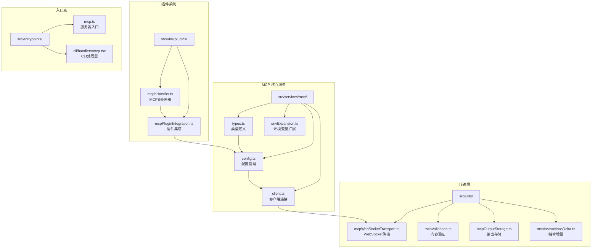
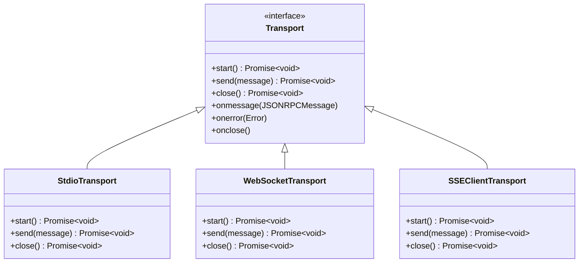
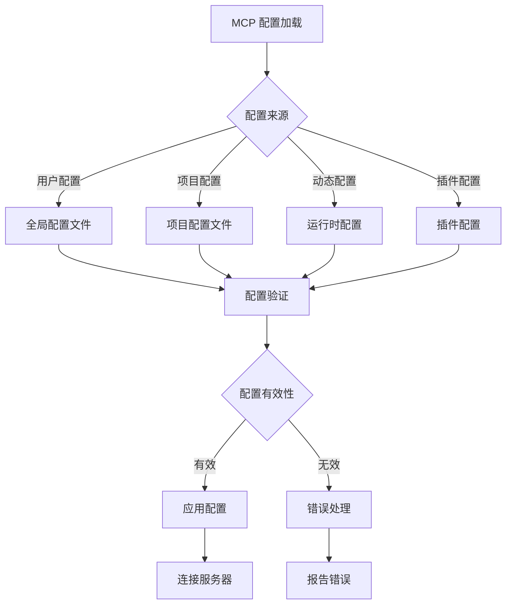
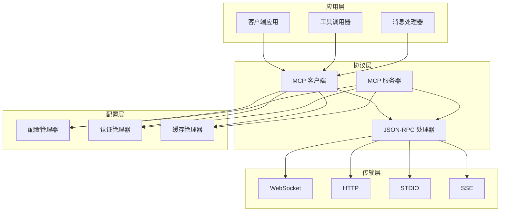
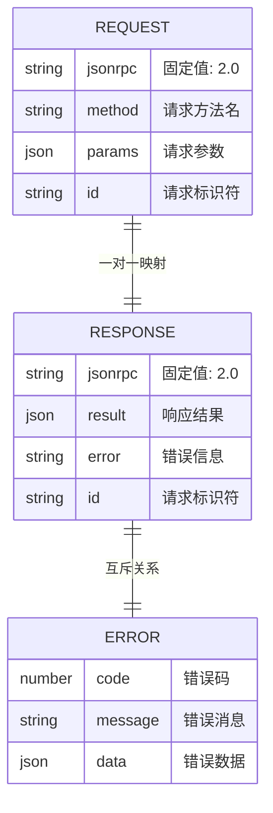
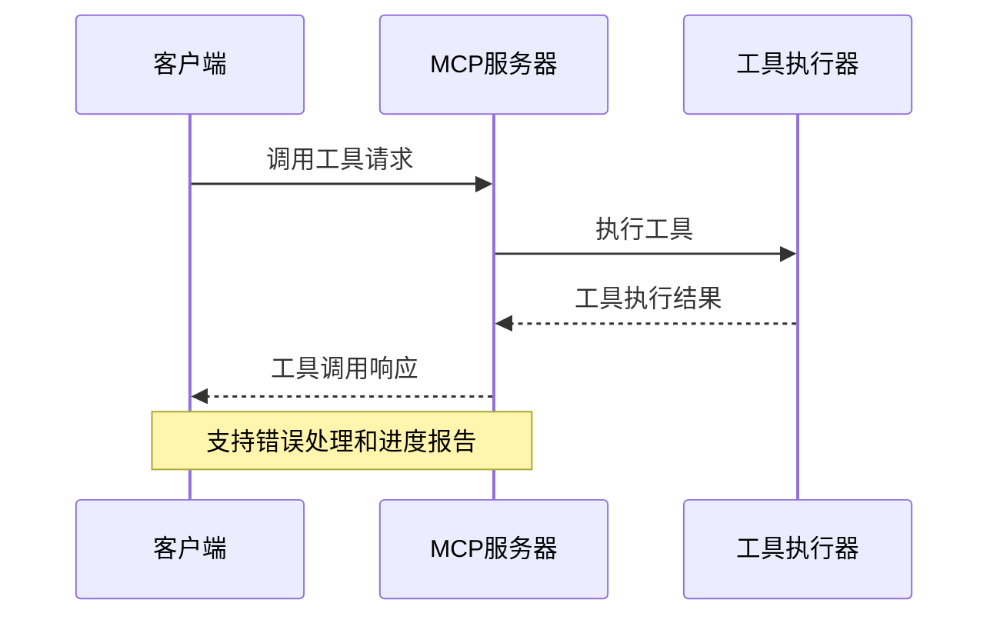
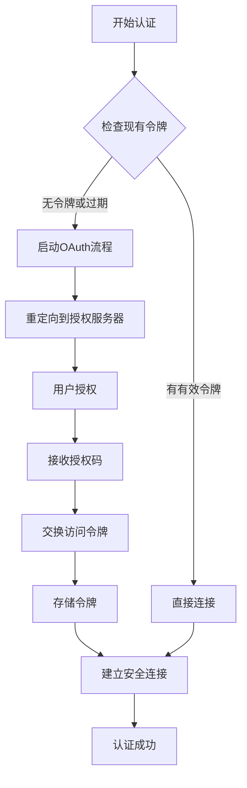
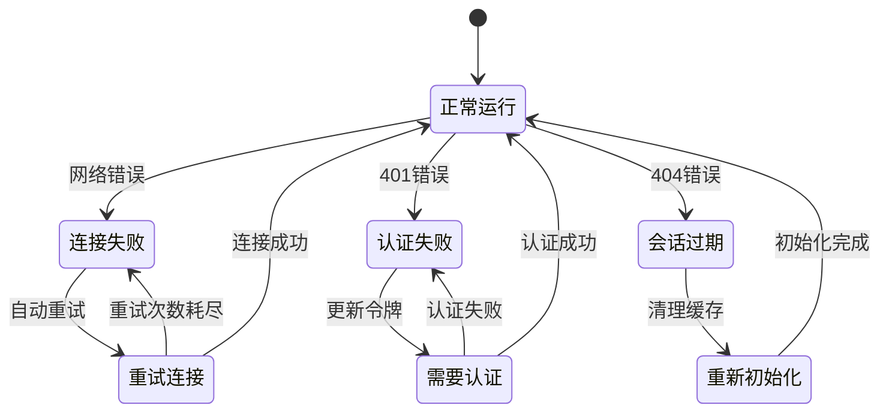
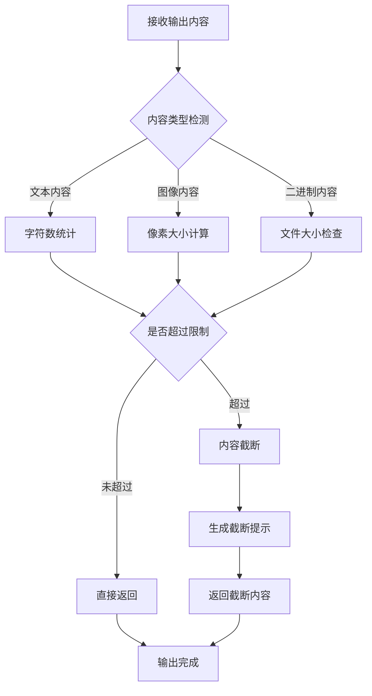

# MCP 协议规范

<cite>
**本文档引用的文件**
- [src/services/mcp/types.ts](file://src/services/mcp/types.ts)
- [src/services/mcp/config.ts](file://src/services/mcp/config.ts)
- [src/services/mcp/client.ts](file://src/services/mcp/client.ts)
- [src/utils/mcpValidation.ts](file://src/utils/mcpValidation.ts)
- [src/utils/mcpWebSocketTransport.ts](file://src/utils/mcpWebSocketTransport.ts)
- [src/utils/mcpInstructionsDelta.ts](file://src/utils/mcpInstructionsDelta.ts)
- [src/utils/mcpOutputStorage.ts](file://src/utils/mcpOutputStorage.ts)
- [src/entrypoints/mcp.ts](file://src/entrypoints/mcp.ts)
- [src/cli/handlers/mcp.tsx](file://src/cli/handlers/mcp.tsx)
- [src/utils/plugins/mcpPluginIntegration.ts](file://src/utils/plugins/mcpPluginIntegration.ts)
- [src/utils/plugins/mcpbHandler.ts](file://src/utils/plugins/mcpbHandler.ts)
- [src/services/mcp/envExpansion.ts](file://src/services/mcp/envExpansion.ts)
</cite>

## 目录
1. [简介](#简介)
2. [项目结构](#项目结构)
3. [核心组件](#核心组件)
4. [架构概览](#架构概览)
5. [详细组件分析](#详细组件分析)
6. [依赖关系分析](#依赖关系分析)
7. [性能考虑](#性能考虑)
8. [故障排除指南](#故障排除指南)
9. [结论](#结论)
10. [附录](#附录)

## 简介

MCP（Model Context Protocol）是一个开放的协议标准，用于在模型驱动的应用程序中建立标准化的上下文交互接口。该协议定义了客户端与服务器之间的通信规范，包括消息格式、数据类型、字段定义和验证规则。

本规范基于 Claude Code 项目中的 MCP 实现，涵盖了协议的核心要素、版本管理策略、安全考虑以及扩展机制。MCP 协议支持多种传输方式，包括本地进程通信、HTTP、WebSocket 和 Server-Sent Events，并提供了完整的认证和授权机制。

## 项目结构

该项目采用模块化架构设计，MCP 功能分布在多个专门的目录中：



**图表来源**
- [src/services/mcp/types.ts:1-259](file://src/services/mcp/types.ts#L1-L259)
- [src/services/mcp/config.ts:1-800](file://src/services/mcp/config.ts#L1-L800)
- [src/utils/mcpWebSocketTransport.ts:1-201](file://src/utils/mcpWebSocketTransport.ts#L1-L201)

**章节来源**
- [src/services/mcp/types.ts:1-259](file://src/services/mcp/types.ts#L1-L259)
- [src/services/mcp/config.ts:1-800](file://src/services/mcp/config.ts#L1-L800)

## 核心组件

### 传输层抽象

MCP 协议支持多种传输方式，每种传输方式都有其特定的配置要求和使用场景：



**图表来源**
- [src/utils/mcpWebSocketTransport.ts:22-201](file://src/utils/mcpWebSocketTransport.ts#L22-L201)
- [src/services/mcp/client.ts:8-21](file://src/services/mcp/client.ts#L8-L21)

### 配置管理系统

MCP 配置系统支持多层级配置管理，包括用户级、项目级和动态配置：



**图表来源**
- [src/services/mcp/config.ts:625-761](file://src/services/mcp/config.ts#L625-L761)
- [src/services/mcp/types.ts:171-178](file://src/services/mcp/types.ts#L171-L178)

**章节来源**
- [src/services/mcp/types.ts:23-135](file://src/services/mcp/types.ts#L23-L135)
- [src/services/mcp/config.ts:625-761](file://src/services/mcp/config.ts#L625-L761)

## 架构概览

MCP 协议采用分层架构设计，确保了良好的可扩展性和维护性：



**图表来源**
- [src/services/mcp/client.ts:1-800](file://src/services/mcp/client.ts#L1-L800)
- [src/entrypoints/mcp.ts:1-197](file://src/entrypoints/mcp.ts#L1-L197)

## 详细组件分析

### 消息格式与数据类型

MCP 协议基于 JSON-RPC 2.0 规范，定义了标准的消息格式和数据类型：

#### 请求消息格式



**图表来源**
- [src/services/mcp/client.ts:23-38](file://src/services/mcp/client.ts#L23-L38)

#### 工具调用消息

MCP 协议支持工具调用功能，允许客户端调用服务器提供的工具：



**图表来源**
- [src/entrypoints/mcp.ts:99-188](file://src/entrypoints/mcp.ts#L99-L188)

**章节来源**
- [src/entrypoints/mcp.ts:35-197](file://src/entrypoints/mcp.ts#L35-L197)

### 认证与安全机制

MCP 协议提供了多层次的安全保障机制：

#### OAuth 认证流程



**图表来源**
- [src/services/mcp/client.ts:372-422](file://src/services/mcp/client.ts#L372-L422)

#### 传输安全

MCP 协议支持多种传输安全选项：

| 安全特性 | HTTP | WebSocket | SSE | STDIO |
|---------|------|-----------|-----|-------|
| TLS 加密 | ✅ | ✅ | ✅ | ❌ |
| 证书验证 | ✅ | ✅ | ✅ | ❌ |
| 代理支持 | ✅ | ✅ | ✅ | ❌ |
| 身份验证 | ✅ | ✅ | ✅ | ❌ |

**章节来源**
- [src/services/mcp/client.ts:372-422](file://src/services/mcp/client.ts#L372-L422)

### 错误处理与恢复

MCP 协议定义了标准的错误处理机制：



**图表来源**
- [src/services/mcp/client.ts:193-206](file://src/services/mcp/client.ts#L193-L206)

**章节来源**
- [src/services/mcp/client.ts:152-206](file://src/services/mcp/client.ts#L152-L206)

### 内容验证与输出管理

MCP 协议提供了严格的内容验证和输出管理机制：



**图表来源**
- [src/utils/mcpValidation.ts:151-209](file://src/utils/mcpValidation.ts#L151-L209)

**章节来源**
- [src/utils/mcpValidation.ts:1-209](file://src/utils/mcpValidation.ts#L1-L209)

## 依赖关系分析

MCP 协议的实现涉及多个相互依赖的组件：

```mermaid
graph LR
subgraph "外部依赖"
A[@modelcontextprotocol/sdk]
B[Zod 类型验证]
C[Lodash 工具库]
D[Axios HTTP客户端]
end
subgraph "内部模块"
E[类型定义]
F[配置管理]
G[传输层]
H[认证管理]
I[工具调用]
end
subgraph "工具函数"
J[内容验证]
K[输出存储]
L[环境变量扩展]
M[插件集成]
end
A --> E
B --> E
C --> F
D --> G
E --> F
F --> G
G --> H
H --> I
E --> J
J --> K
L --> F
M --> F
```

**图表来源**
- [src/services/mcp/types.ts:1-8](file://src/services/mcp/types.ts#L1-L8)
- [src/services/mcp/config.ts:1-57](file://src/services/mcp/config.ts#L1-L57)

**章节来源**
- [src/services/mcp/types.ts:1-8](file://src/services/mcp/types.ts#L1-L8)
- [src/services/mcp/config.ts:1-57](file://src/services/mcp/config.ts#L1-L57)

## 性能考虑

MCP 协议在设计时充分考虑了性能优化：

### 连接池管理

MCP 协议实现了智能的连接池管理机制，支持并发连接和资源复用：

| 参数 | 默认值 | 描述 |
|------|--------|------|
| 连接超时 | 30秒 | 建立连接的最大等待时间 |
| 请求超时 | 60秒 | 单个请求的最大处理时间 |
| 批量大小 | 3 | 并发连接数量限制 |
| 缓存 TTL | 15分钟 | 认证状态缓存时间 |

### 内存管理

协议实现了高效的内存管理策略：

- **LRU 缓存**：用于文件状态缓存，限制最大 100 个文件
- **流式处理**：支持大文件的流式传输，避免内存溢出
- **自动清理**：连接关闭时自动清理相关资源

## 故障排除指南

### 常见问题诊断

#### 连接问题

| 问题症状 | 可能原因 | 解决方案 |
|----------|----------|----------|
| 连接超时 | 网络延迟或服务器响应慢 | 检查网络连接，增加超时设置 |
| 认证失败 | 令牌过期或配置错误 | 重新获取令牌，检查配置文件 |
| 会话过期 | 服务器端会话失效 | 清理缓存，重新初始化连接 |
| 内容过大 | 输出超过限制 | 启用分页查询，调整输出格式 |

#### 性能问题

| 问题症状 | 可能原因 | 解决方案 |
|----------|----------|----------|
| 响应缓慢 | 并发连接过多 | 减少批量大小，优化查询 |
| 内存占用高 | 缓存未清理 | 检查缓存配置，定期清理 |
| CPU 使用率高 | 大量小文件处理 | 合并请求，启用压缩 |

**章节来源**
- [src/services/mcp/client.ts:552-561](file://src/services/mcp/client.ts#L552-L561)

## 结论

MCP 协议规范提供了一个完整、标准化的模型上下文交互框架。通过模块化的架构设计和严格的类型定义，该协议确保了不同组件之间的良好兼容性和可扩展性。

协议的核心优势包括：

1. **标准化接口**：统一的消息格式和数据类型定义
2. **多传输支持**：灵活的传输方式选择
3. **安全机制**：多层次的身份验证和授权
4. **性能优化**：智能的连接管理和资源复用
5. **错误处理**：完善的异常处理和恢复机制

随着技术的发展，MCP 协议将继续演进，为构建更智能、更高效的 AI 应用程序提供坚实的基础。

## 附录

### 版本管理策略

MCP 协议采用语义化版本控制，遵循以下规则：

- **主版本号**：不兼容的 API 变更
- **次版本号**：向后兼容的功能新增
- **修订号**：向后兼容的问题修正

### 扩展机制

协议提供了灵活的扩展点：

1. **自定义传输**：支持新的传输协议
2. **插件系统**：第三方插件集成
3. **工具扩展**：自定义工具定义
4. **认证方式**：支持多种认证机制

### 第三方集成指南

集成 MCP 协议到第三方应用的基本步骤：

1. **安装依赖**：引入 MCP SDK
2. **配置连接**：设置服务器参数
3. **实现认证**：处理身份验证流程
4. **处理消息**：实现消息处理逻辑
5. **错误处理**：实现异常处理机制
6. **性能监控**：添加性能指标收集