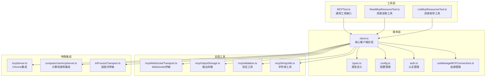
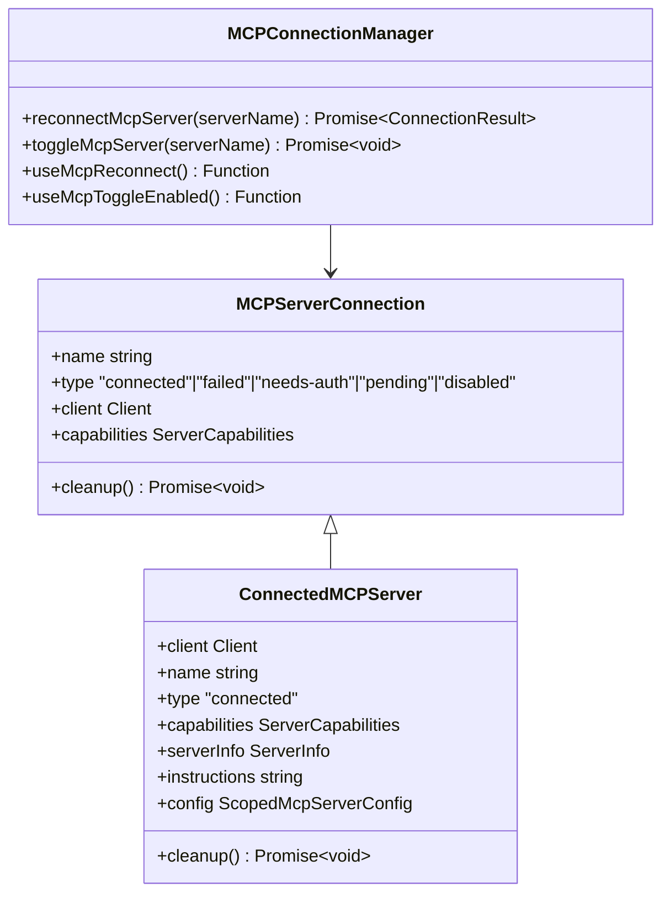
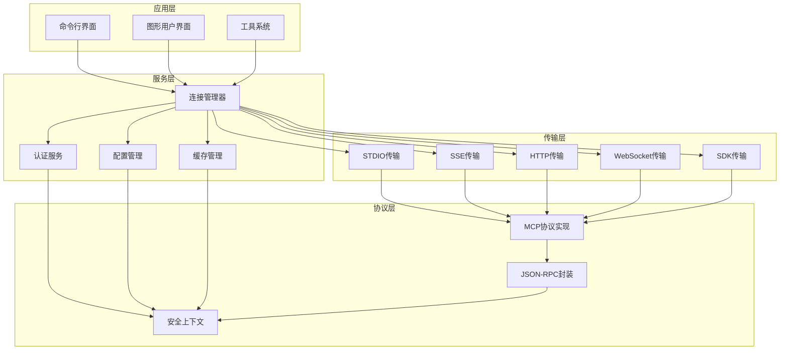
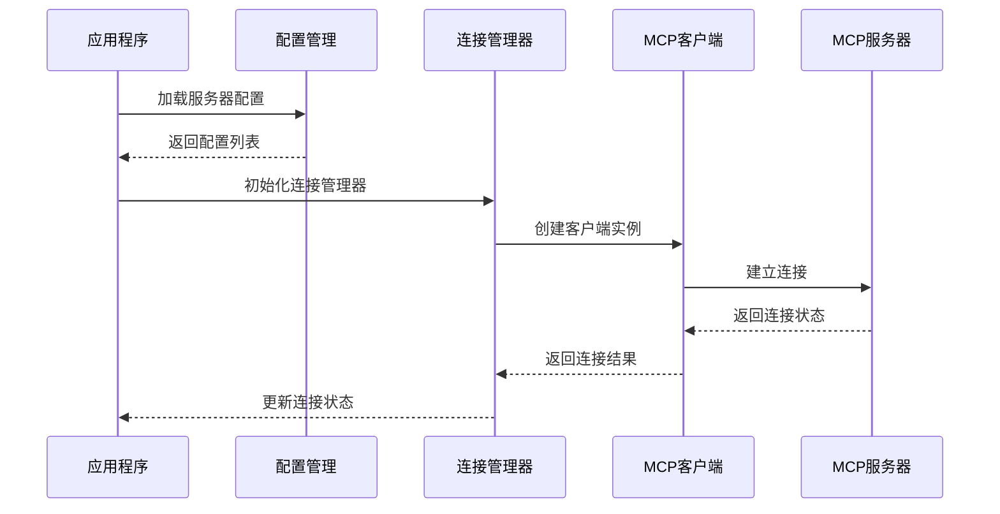
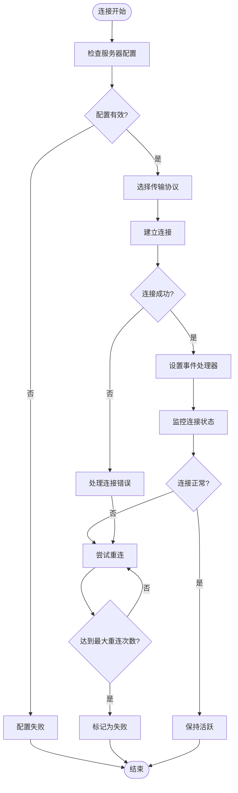
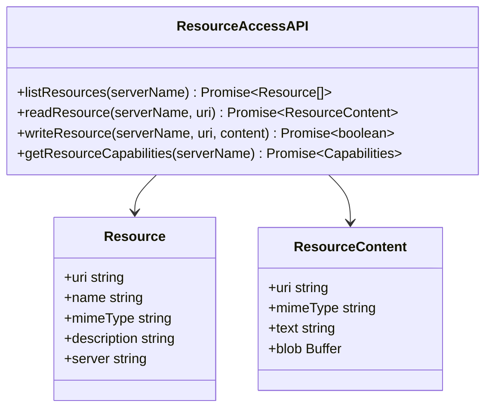
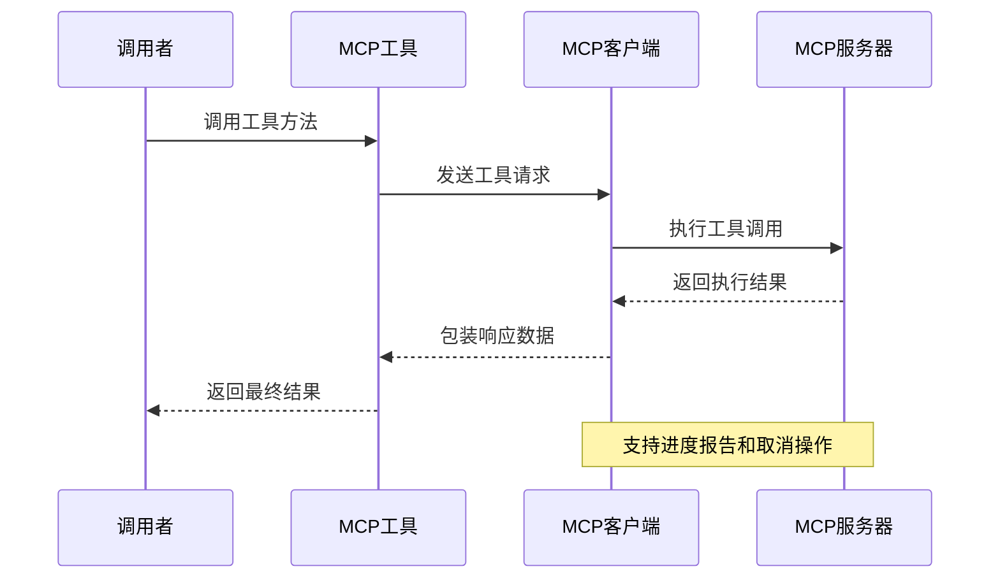
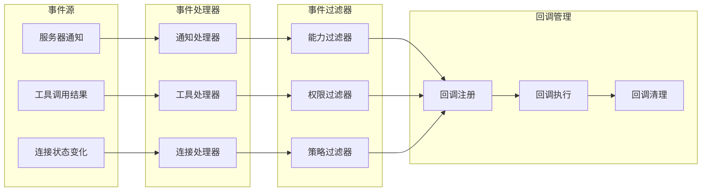
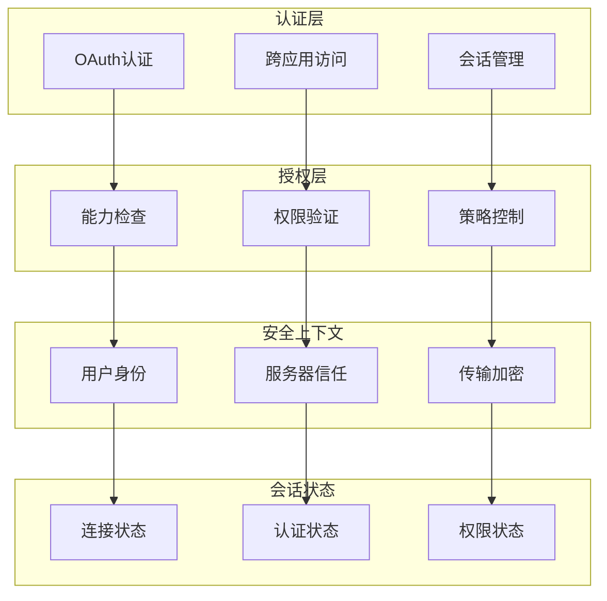

# MCP 客户端 API

<cite>
**本文档引用的文件**
- [client.ts](file://src/services/mcp/client.ts)
- [types.ts](file://src/services/mcp/types.ts)
- [config.ts](file://src/services/mcp/config.ts)
- [auth.ts](file://src/services/mcp/auth.ts)
- [useManageMCPConnections.ts](file://src/services/mcp/useManageMCPConnections.ts)
- [MCPConnectionManager.tsx](file://src/services/mcp/MCPConnectionManager.tsx)
- [ListMcpResourcesTool.ts](file://src/tools/ListMcpResourcesTool/ListMcpResourcesTool.ts)
- [ReadMcpResourceTool.ts](file://src/tools/ReadMcpResourceTool/ReadMcpResourceTool.ts)
- [MCPTool.ts](file://src/tools/MCPTool/MCPTool.ts)
- [mcpServer.ts（Claude in Chrome）](file://src/utils/claudeInChrome/mcpServer.ts)
- [computerUse/mcpServer.ts](file://src/utils/computerUse/mcpServer.ts)
- [InProcessTransport.ts](file://src/services/mcp/InProcessTransport.ts)
- [mcpWebSocketTransport.ts](file://src/utils/mcpWebSocketTransport.ts)
- [mcpOutputStorage.ts](file://src/utils/mcpOutputStorage.ts)
- [mcpValidation.ts](file://src/utils/mcpValidation.ts)
- [mcpStringUtils.ts](file://src/services/mcp/mcpStringUtils.ts)
- [print.ts](file://src/cli/print.ts)
</cite>

## 目录
1. [简介](#简介)
2. [项目结构](#项目结构)
3. [核心组件](#核心组件)
4. [架构概览](#架构概览)
5. [详细组件分析](#详细组件分析)
6. [依赖关系分析](#依赖关系分析)
7. [性能考虑](#性能考虑)
8. [故障排除指南](#故障排除指南)
9. [结论](#结论)
10. [附录](#附录)

## 简介

MCP（Model Context Protocol）客户端 API 是一个功能完整的协议实现，用于与各种 MCP 服务器进行通信。该系统支持多种传输协议（STDIO、SSE、HTTP、WebSocket、SDK），提供自动重连机制、权限管理和安全上下文处理。

该 API 的主要特性包括：
- 多种传输协议支持
- 自动连接管理和重连机制
- 资源枚举、读取和写入操作
- 工具调用接口和异步处理
- 事件处理和通知订阅
- 权限管理和安全上下文
- 企业级策略控制和访问限制

## 项目结构

MCP 客户端 API 的核心组件分布在以下目录中：



**图表来源**
- [client.ts:1-800](file://src/services/mcp/client.ts#L1-800)
- [types.ts:1-259](file://src/services/mcp/types.ts#L1-259)
- [config.ts:1-800](file://src/services/mcp/config.ts#L1-800)

**章节来源**
- [client.ts:1-800](file://src/services/mcp/client.ts#L1-800)
- [types.ts:1-259](file://src/services/mcp/types.ts#L1-259)
- [config.ts:1-800](file://src/services/mcp/config.ts#L1-800)

## 核心组件

### 连接管理器

连接管理器是 MCP 客户端的核心组件，负责管理所有 MCP 服务器的连接状态和生命周期。



**图表来源**
- [MCPConnectionManager.tsx:1-73](file://src/services/mcp/MCPConnectionManager.tsx#L1-73)
- [types.ts:179-227](file://src/services/mcp/types.ts#L179-227)

### 传输层

系统支持多种传输协议，每种都有特定的用途和优势：

| 传输类型 | 描述 | 使用场景 | 特点 |
|---------|------|----------|------|
| STDIO | 标准输入输出流 | 本地进程连接 | 低延迟，适合本地工具 |
| SSE | 服务器发送事件 | 实时数据推送 | 持续连接，双向通信 |
| HTTP | 超文本传输协议 | RESTful API | 广泛兼容，易于调试 |
| WebSocket | 套接字通信 | 高频交互 | 低延迟，全双工 |
| SDK | 软件开发工具包 | 内置功能 | 性能最优，无网络开销 |

**章节来源**
- [client.ts:619-961](file://src/services/mcp/client.ts#L619-961)
- [types.ts:23-135](file://src/services/mcp/types.ts#L23-135)

## 架构概览

MCP 客户端 API 采用分层架构设计，确保了模块化和可扩展性：



**图表来源**
- [client.ts:985-1002](file://src/services/mcp/client.ts#L985-1002)
- [auth.ts:1-800](file://src/services/mcp/auth.ts#L1-800)

## 详细组件分析

### 初始化和配置过程

MCP 客户端的初始化过程涉及多个步骤，确保系统能够正确连接到目标服务器：



**图表来源**
- [useManageMCPConnections.ts:772-780](file://src/services/mcp/useManageMCPConnections.ts#L772-780)
- [client.ts:2324-2326](file://src/services/mcp/client.ts#L2324-2326)

初始化过程的关键步骤包括：

1. **配置加载**：从不同来源（项目、用户、企业）加载 MCP 服务器配置
2. **策略检查**：应用企业级策略和访问控制规则
3. **连接建立**：根据配置选择合适的传输协议
4. **能力检测**：查询服务器功能和支持的能力
5. **状态更新**：将连接状态更新到应用程序状态

**章节来源**
- [config.ts:536-551](file://src/services/mcp/config.ts#L536-551)
- [useManageMCPConnections.ts:2234-2386](file://src/services/mcp/useManageMCPConnections.ts#L2234-2386)

### 连接管理

MCP 客户端实现了完善的连接管理机制，包括自动重连、错误处理和状态监控：



**图表来源**
- [client.ts:1216-1402](file://src/services/mcp/client.ts#L1216-1402)
- [useManageMCPConnections.ts:354-468](file://src/services/mcp/useManageMCPConnections.ts#L354-468)

连接管理的关键特性：

- **自动重连**：支持指数退避算法，最多重试5次
- **错误检测**：识别网络错误、认证失败等不同类型的错误
- **状态监控**：实时监控连接状态变化
- **资源清理**：确保连接关闭时释放所有资源

**章节来源**
- [client.ts:1313-1365](file://src/services/mcp/client.ts#L1313-1365)
- [useManageMCPConnections.ts:370-462](file://src/services/mcp/useManageMCPConnections.ts#L370-462)

### 资源访问 API

MCP 客户端提供了完整的资源访问接口，支持资源的枚举、读取和写入操作：



**图表来源**
- [ListMcpResourcesTool.ts:66-101](file://src/tools/ListMcpResourcesTool/ListMcpResourcesTool.ts#L66-101)
- [ReadMcpResourceTool.ts:75-101](file://src/tools/ReadMcpResourceTool/ReadMcpResourceTool.ts#L75-101)

资源访问 API 的主要功能：

- **资源枚举**：列出指定服务器上的所有可用资源
- **资源读取**：获取单个资源的内容，支持文本和二进制内容
- **资源写入**：向指定 URI 写入资源内容
- **能力查询**：检查服务器是否支持特定的资源操作

**章节来源**
- [ListMcpResourcesTool.ts:1-124](file://src/tools/ListMcpResourcesTool/ListMcpResourcesTool.ts#L1-124)
- [ReadMcpResourceTool.ts:1-159](file://src/tools/ReadMcpResourceTool/ReadMcpResourceTool.ts#L1-159)

### 工具调用接口

MCP 客户端提供了强大的工具调用接口，支持异步处理和结果获取：



**图表来源**
- [MCPTool.ts:51-77](file://src/tools/MCPTool/MCPTool.ts#L51-77)
- [client.ts:1833-1971](file://src/services/mcp/client.ts#L1833-1971)

工具调用接口的关键特性：

- **异步处理**：支持长时间运行的工具调用
- **进度报告**：提供执行进度和状态更新
- **错误处理**：统一的错误处理和重试机制
- **权限检查**：在调用前进行权限验证

**章节来源**
- [MCPTool.ts:1-78](file://src/tools/MCPTool/MCPTool.ts#L1-78)
- [client.ts:1862-1970](file://src/services/mcp/client.ts#L1862-1970)

### 事件处理机制

MCP 客户端实现了完整的事件处理机制，支持通知订阅、事件过滤和回调管理：



**图表来源**
- [useManageMCPConnections.ts:616-751](file://src/services/mcp/useManageMCPConnections.ts#L616-751)
- [client.ts:1188-1197](file://src/services/mcp/client.ts#L1188-1197)

事件处理机制的主要功能：

- **通知订阅**：支持订阅服务器发送的各种通知
- **事件过滤**：基于能力、权限和策略过滤事件
- **回调管理**：管理事件处理器的注册、执行和清理
- **批量处理**：优化大量事件的处理效率

**章节来源**
- [useManageMCPConnections.ts:470-751](file://src/services/mcp/useManageMCPConnections.ts#L470-751)
- [client.ts:1188-1197](file://src/services/mcp/client.ts#L1188-1197)

### 权限管理、安全上下文和会话状态

MCP 客户端实现了多层次的安全管理机制，确保系统的安全性和可靠性：



**图表来源**
- [auth.ts:1-800](file://src/services/mcp/auth.ts#L1-800)
- [client.ts:1688-1704](file://src/services/mcp/client.ts#L1688-1704)

安全管理系统的关键特性：

- **多层认证**：支持 OAuth、跨应用访问等多种认证方式
- **权限验证**：在每次操作前进行权限检查
- **会话管理**：管理用户的认证状态和会话信息
- **安全传输**：确保数据传输的安全性

**章节来源**
- [auth.ts:320-341](file://src/services/mcp/auth.ts#L320-341)
- [client.ts:1688-1704](file://src/services/mcp/client.ts#L1688-1704)

## 依赖关系分析

MCP 客户端 API 的依赖关系体现了清晰的分层架构：

```mermaid
graph TB
subgraph "外部依赖"
A[@modelcontextprotocol/sdk]
B[lodash-es]
C[p-map]
D[axios]
end
subgraph "内部模块"
E[client.ts]
F[types.ts]
G[config.ts]
H[auth.ts]
I[useManageMCPConnections.ts]
end
subgraph "工具模块"
J[ListMcpResourcesTool.ts]
K[ReadMcpResourceTool.ts]
L[MCPTool.ts]
end
subgraph "实用工具"
M[mcpWebSocketTransport.ts]
N[mcpOutputStorage.ts]
O[mcpValidation.ts]
end
A --> E
B --> E
C --> E
D --> H
E --> F
E --> G
E --> H
E --> I
J --> E
K --> E
L --> E
E --> M
E --> N
E --> O
```

**图表来源**
- [client.ts:1-50](file://src/services/mcp/client.ts#L1-50)
- [auth.ts:1-51](file://src/services/mcp/auth.ts#L1-51)

**章节来源**
- [client.ts:1-50](file://src/services/mcp/client.ts#L1-50)
- [auth.ts:1-51](file://src/services/mcp/auth.ts#L1-51)

## 性能考虑

MCP 客户端 API 在设计时充分考虑了性能优化：

### 缓存策略
- **连接缓存**：使用 memoization 缓存连接状态
- **资源缓存**：LRU 缓存工具、资源和命令列表
- **认证缓存**：短期缓存认证状态，减少重复认证

### 并发控制
- **批量处理**：使用 p-map 实现并发控制
- **连接池**：合理管理连接数量
- **背压处理**：防止过多并发请求导致系统过载

### 优化技术
- **懒加载**：按需加载功能模块
- **内存管理**：及时清理不再使用的资源
- **网络优化**：智能超时和重试机制

## 故障排除指南

### 常见问题和解决方案

| 问题类型 | 症状 | 可能原因 | 解决方案 |
|---------|------|----------|----------|
| 连接失败 | 无法连接到 MCP 服务器 | 网络问题、认证失败、服务器不可用 | 检查网络连接、验证认证信息、查看服务器状态 |
| 认证错误 | 返回 401 或 403 错误 | 令牌过期、权限不足、配置错误 | 刷新令牌、检查权限设置、重新配置认证 |
| 超时错误 | 请求超时或连接超时 | 网络延迟、服务器响应慢 | 增加超时时间、优化网络配置、检查服务器负载 |
| 资源访问失败 | 无法读取或写入资源 | 权限不足、资源不存在、格式错误 | 检查资源权限、验证资源 URI、确认数据格式 |

### 调试技巧

1. **启用调试模式**：使用 `--debug` 参数获取详细日志
2. **检查连接状态**：通过状态面板查看连接详情
3. **验证配置**：确保 MCP 服务器配置正确
4. **测试网络**：验证网络连接和防火墙设置

**章节来源**
- [client.ts:1623-1638](file://src/services/mcp/client.ts#L1623-1638)
- [useManageMCPConnections.ts:427-444](file://src/services/mcp/useManageMCPConnections.ts#L427-444)

## 结论

MCP 客户端 API 提供了一个功能完整、设计良好的协议实现，具有以下特点：

1. **模块化设计**：清晰的分层架构，便于维护和扩展
2. **多协议支持**：支持多种传输协议，适应不同的使用场景
3. **完善的错误处理**：全面的错误处理和恢复机制
4. **安全性保障**：多层次的安全管理，确保系统安全
5. **性能优化**：采用多种优化技术，确保高效运行

该 API 为开发者提供了强大而灵活的工具，可以轻松集成各种 MCP 服务器，并充分利用 MCP 协议的优势。

## 附录

### API 使用示例

由于代码示例的复杂性，这里提供一些基本的使用模式：

**连接管理示例**
```typescript
// 初始化连接管理器
const manager = new MCPConnectionManager(configs);

// 获取连接状态
const status = await manager.getConnectionStatus('server-name');

// 触发重连
await manager.reconnectMcpServer('server-name');
```

**资源访问示例**
```typescript
// 枚举资源
const resources = await listMcpResources({ server: 'server-name' });

// 读取资源
const content = await readMcpResource({ 
  server: 'server-name', 
  uri: 'resource-uri' 
});
```

**工具调用示例**
```typescript
// 调用工具
const result = await mcpTool.call({
  toolName: 'tool-name',
  args: { /* 工具参数 */ }
});
```

### 最佳实践

1. **配置管理**：使用企业级策略控制 MCP 服务器的访问
2. **错误处理**：实现完善的错误处理和重试机制
3. **性能监控**：定期监控连接状态和性能指标
4. **安全审计**：记录重要的安全事件和访问日志
5. **版本兼容**：关注 MCP 协议的版本更新和兼容性