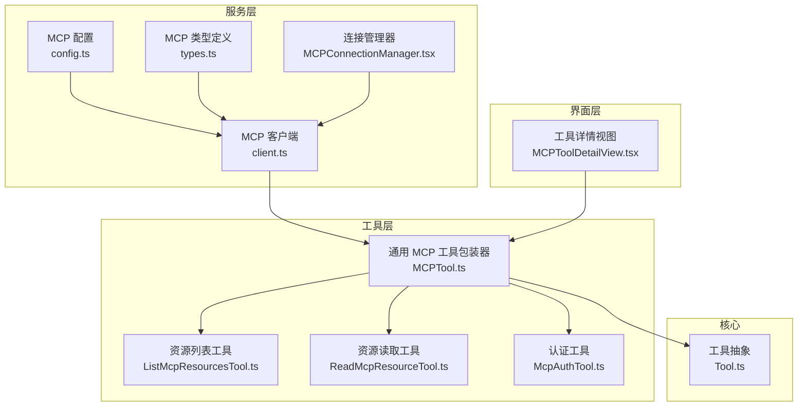
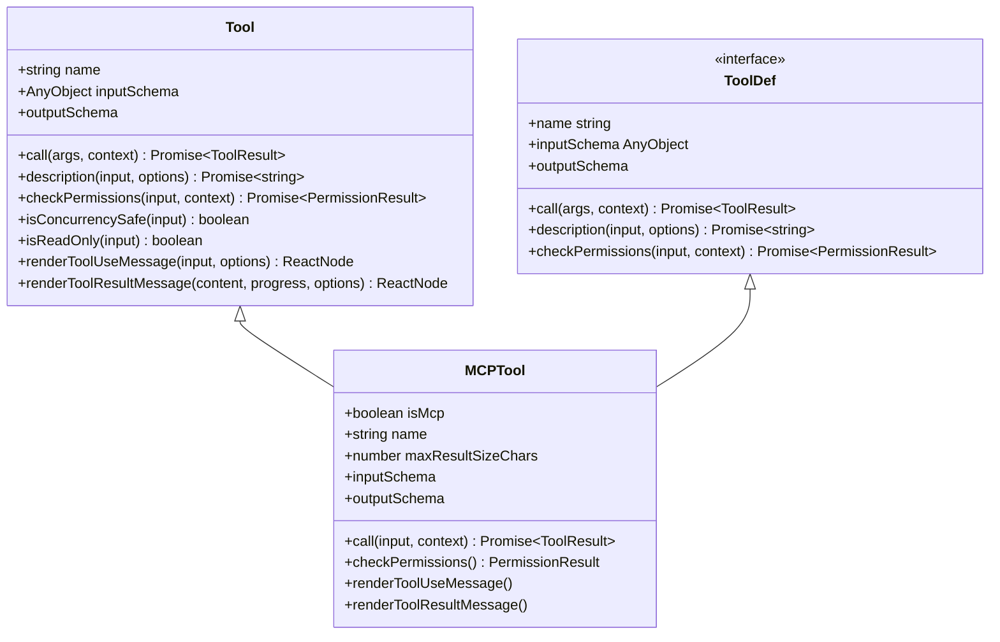
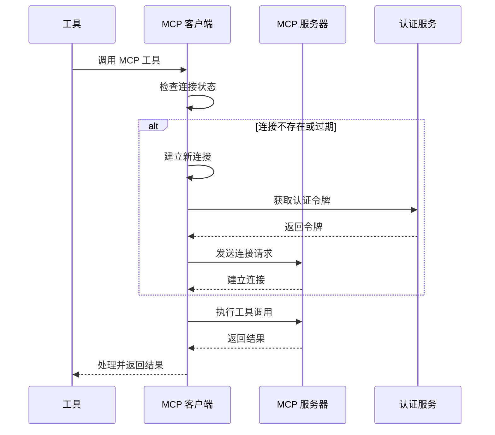
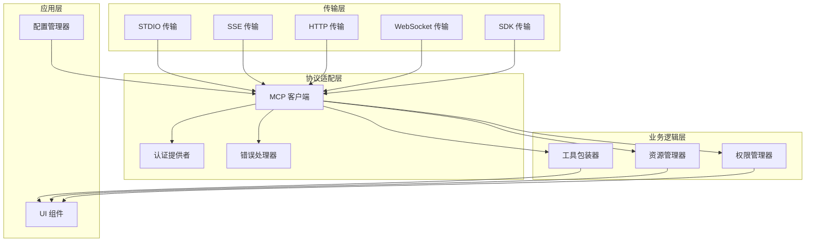
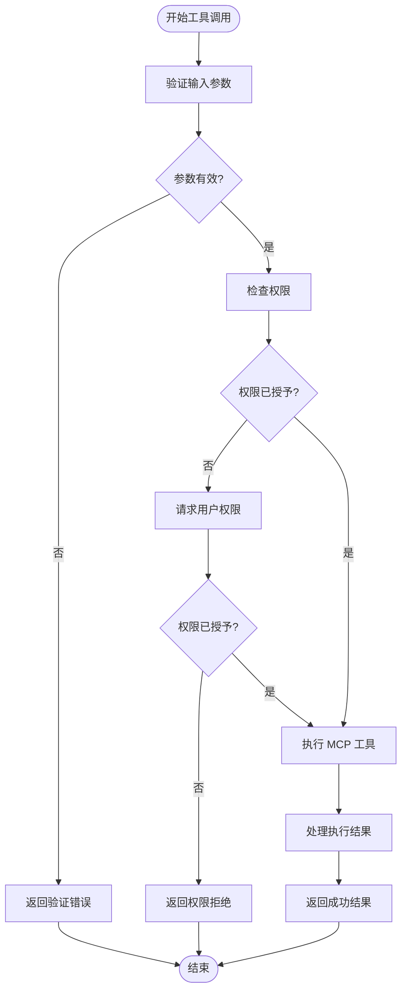
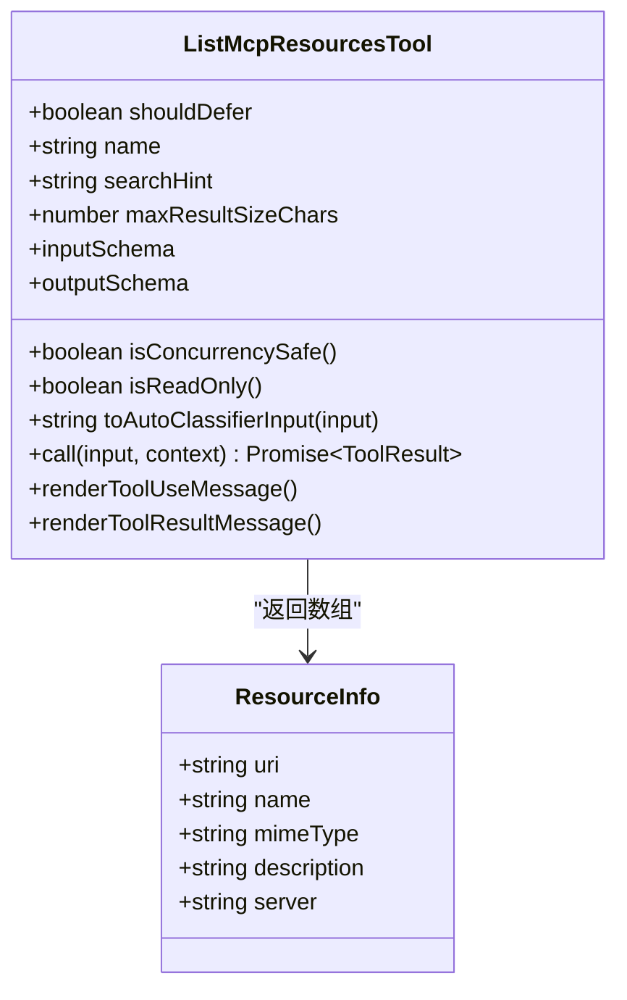
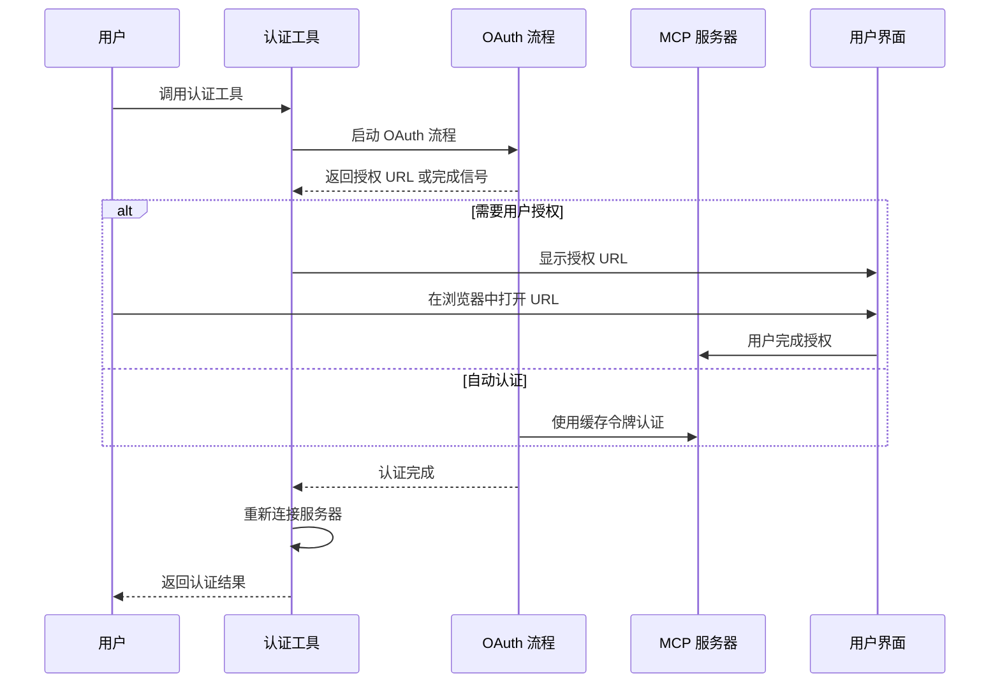
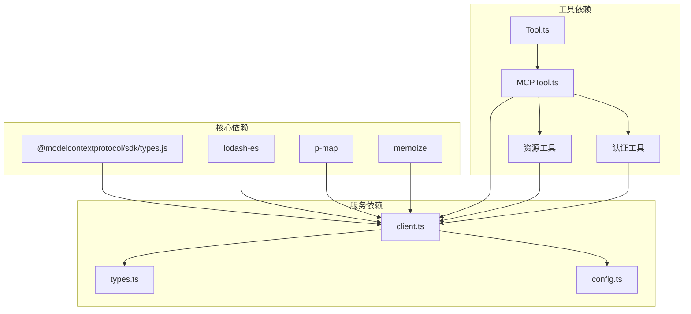
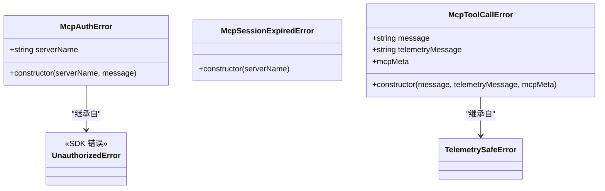

# MCP 工具开发

<cite>
**本文档引用的文件**
- [src/services/mcp/client.ts](file://src/services/mcp/client.ts)
- [src/services/mcp/types.ts](file://src/services/mcp/types.ts)
- [src/services/mcp/config.ts](file://src/services/mcp/config.ts)
- [src/services/mcp/MCPConnectionManager.tsx](file://src/services/mcp/MCPConnectionManager.tsx)
- [src/services/mcp/utils.ts](file://src/services/mcp/utils.ts)
- [src/tools/MCPTool/MCPTool.ts](file://src/tools/MCPTool/MCPTool.ts)
- [src/tools/ListMcpResourcesTool/ListMcpResourcesTool.ts](file://src/tools/ListMcpResourcesTool/ListMcpResourcesTool.ts)
- [src/tools/ReadMcpResourceTool/ReadMcpResourceTool.ts](file://src/tools/ReadMcpResourceTool/ReadMcpResourceTool.ts)
- [src/tools/McpAuthTool/McpAuthTool.ts](file://src/tools/McpAuthTool/McpAuthTool.ts)
- [src/components/mcp/MCPToolDetailView.tsx](file://src/components/mcp/MCPToolDetailView.tsx)
- [src/Tool.ts](file://src/Tool.ts)
</cite>

## 目录
1. [简介](#简介)
2. [项目结构](#项目结构)
3. [核心组件](#核心组件)
4. [架构概览](#架构概览)
5. [详细组件分析](#详细组件分析)
6. [依赖关系分析](#依赖关系分析)
7. [性能考量](#性能考量)
8. [故障排除指南](#故障排除指南)
9. [结论](#结论)
10. [附录](#附录)

## 简介

本指南面向 MCP（Model Context Protocol）工具开发者，系统阐述如何在 Claude Code 代码库中开发、部署和维护 MCP 工具。文档覆盖工具定义规范、参数 Schema、返回值格式、执行机制、权限检查、资源访问、状态同步等关键主题，并提供最佳实践、测试方法、调试技巧和发布流程。

MCP 是一种标准化协议，允许模型代理通过统一接口访问外部工具和服务。在 Claude Code 中，MCP 工具通过统一的工具抽象层集成到系统的工具生态中，支持多种传输方式（stdio、SSE、HTTP、WebSocket、SDK），并具备完善的认证、授权、连接管理和错误处理能力。

## 项目结构

该项目采用模块化组织方式，MCP 相关功能主要分布在以下目录：

- `src/services/mcp/`: MCP 客户端、配置、类型定义和连接管理
- `src/tools/`: 具体的工具实现，包括通用 MCP 工具包装器和特定功能工具
- `src/components/mcp/`: MCP 相关的用户界面组件
- `src/`: 核心工具抽象和类型定义



**图表来源**
- [src/services/mcp/client.ts:1-120](file://src/services/mcp/client.ts#L1-L120)
- [src/tools/MCPTool/MCPTool.ts:1-78](file://src/tools/MCPTool/MCPTool.ts#L1-L78)
- [src/services/mcp/types.ts:1-80](file://src/services/mcp/types.ts#L1-L80)

**章节来源**
- [src/services/mcp/client.ts:1-120](file://src/services/mcp/client.ts#L1-L120)
- [src/tools/MCPTool/MCPTool.ts:1-78](file://src/tools/MCPTool/MCPTool.ts#L1-L78)
- [src/services/mcp/types.ts:1-80](file://src/services/mcp/types.ts#L1-L80)

## 核心组件

### 工具抽象层

工具抽象层定义了所有工具的标准接口，包括输入输出模式、权限检查、并发安全、UI 渲染等功能。对于 MCP 工具，系统提供了专门的包装器来适配 MCP 协议的动态特性。



**图表来源**
- [src/Tool.ts:362-695](file://src/Tool.ts#L362-L695)
- [src/tools/MCPTool/MCPTool.ts:27-77](file://src/tools/MCPTool/MCPTool.ts#L27-L77)

### MCP 客户端

MCP 客户端是系统的核心组件，负责与 MCP 服务器建立连接、管理会话、执行工具调用和处理错误。它支持多种传输方式，并实现了完善的连接生命周期管理。



**图表来源**
- [src/services/mcp/client.ts:595-620](file://src/services/mcp/client.ts#L595-L620)
- [src/services/mcp/client.ts:1048-1080](file://src/services/mcp/client.ts#L1048-L1080)

**章节来源**
- [src/Tool.ts:362-695](file://src/Tool.ts#L362-L695)
- [src/services/mcp/client.ts:595-620](file://src/services/mcp/client.ts#L595-L620)

## 架构概览

Claude Code 的 MCP 架构采用分层设计，从底层传输到上层工具抽象形成清晰的职责分离：



**图表来源**
- [src/services/mcp/client.ts:613-961](file://src/services/mcp/client.ts#L613-L961)
- [src/services/mcp/types.ts:23-135](file://src/services/mcp/types.ts#L23-L135)

## 详细组件分析

### 通用 MCP 工具包装器

通用 MCP 工具包装器为所有 MCP 工具提供统一的基础实现，支持动态参数验证、权限检查和 UI 渲染。

#### 参数验证机制



**图表来源**
- [src/tools/MCPTool/MCPTool.ts:56-61](file://src/tools/MCPTool/MCPTool.ts#L56-L61)
- [src/Tool.ts:489-503](file://src/Tool.ts#L489-L503)

#### 工具执行流程

通用 MCP 工具包装器的执行流程包括连接检查、参数验证、权限确认和工具调用等步骤：

**章节来源**
- [src/tools/MCPTool/MCPTool.ts:27-77](file://src/tools/MCPTool/MCPTool.ts#L27-L77)
- [src/Tool.ts:379-385](file://src/Tool.ts#L379-L385)

### 资源管理工具

系统提供了专门的工具来管理 MCP 服务器的资源，包括资源列表查询和资源内容读取。

#### 资源列表工具

资源列表工具支持按服务器过滤查询，提供统一的资源信息格式：



**图表来源**
- [src/tools/ListMcpResourcesTool/ListMcpResourcesTool.ts:40-123](file://src/tools/ListMcpResourcesTool/ListMcpResourcesTool.ts#L40-L123)

#### 资源读取工具

资源读取工具支持二进制内容的自动处理和持久化存储：

**章节来源**
- [src/tools/ListMcpResourcesTool/ListMcpResourcesTool.ts:15-38](file://src/tools/ListMcpResourcesTool/ListMcpResourcesTool.ts#L15-L38)
- [src/tools/ReadMcpResourceTool/ReadMcpResourceTool.ts:22-47](file://src/tools/ReadMcpResourceTool/ReadMcpResourceTool.ts#L22-L47)

### 认证工具

认证工具为未认证的 MCP 服务器提供一键认证入口，支持 OAuth 流程的自动化启动：



**图表来源**
- [src/tools/McpAuthTool/McpAuthTool.ts:126-132](file://src/tools/McpAuthTool/McpAuthTool.ts#L126-L132)
- [src/tools/McpAuthTool/McpAuthTool.ts:138-166](file://src/tools/McpAuthTool/McpAuthTool.ts#L138-L166)

**章节来源**
- [src/tools/McpAuthTool/McpAuthTool.ts:49-215](file://src/tools/McpAuthTool/McpAuthTool.ts#L49-L215)

### 连接管理器

连接管理器负责 MCP 服务器的生命周期管理，包括连接建立、状态监控和自动重连：

**章节来源**
- [src/services/mcp/MCPConnectionManager.tsx](file://src/services/mcp/MCPConnectionManager.tsx)

## 依赖关系分析

MCP 工具系统中的关键依赖关系如下：



**图表来源**
- [src/services/mcp/client.ts:1-50](file://src/services/mcp/client.ts#L1-L50)
- [src/tools/MCPTool/MCPTool.ts:1-12](file://src/tools/MCPTool/MCPTool.ts#L1-L12)

**章节来源**
- [src/services/mcp/client.ts:1-50](file://src/services/mcp/client.ts#L1-L50)
- [src/tools/MCPTool/MCPTool.ts:1-12](file://src/tools/MCPTool/MCPTool.ts#L1-L12)

## 性能考量

### 连接池和缓存

系统实现了多层缓存机制来优化性能：

1. **连接缓存**: 使用 LRU 缓存存储已建立的连接，避免重复连接开销
2. **工具列表缓存**: 缓存 MCP 服务器的工具列表，减少频繁查询
3. **资源缓存**: 缓存资源元数据，支持增量更新
4. **认证缓存**: 缓存认证状态，避免频繁的认证检查

### 并发控制

系统通过以下机制控制并发访问：

- **连接并发限制**: 通过环境变量控制服务器连接批次大小
- **工具调用并发**: 默认不允许多线程同时执行可能产生副作用的工具
- **资源访问控制**: 对只读操作进行并发安全标记

### 内存管理

- **进程终止**: 对于 stdio 传输，系统使用分级信号（SIGINT → SIGTERM → SIGKILL）确保进程优雅退出
- **内存泄漏防护**: 注册清理函数确保事件监听器正确移除
- **字符串缓存限制**: 限制 stderr 输出的累积长度，防止内存增长

## 故障排除指南

### 常见错误类型

系统定义了多种专用错误类型来精确标识问题：



**图表来源**
- [src/services/mcp/client.ts:152-186](file://src/services/mcp/client.ts#L152-L186)

### 连接问题诊断

1. **连接超时**: 检查网络连接和服务器可达性
2. **认证失败**: 验证 OAuth 令牌有效性
3. **会话过期**: 检测 404 + JSON-RPC -32001 错误组合
4. **传输中断**: 监控连接错误日志和重连机制

### 调试技巧

- **启用详细日志**: 使用 `logMCPDebug` 和 `logMCPError` 函数获取详细的连接和错误信息
- **连接状态监控**: 通过 `MCPConnectionManager` 监控服务器连接状态
- **工具执行跟踪**: 利用进度日志跟踪长时间运行的工具执行情况

**章节来源**
- [src/services/mcp/client.ts:193-206](file://src/services/mcp/client.ts#L193-L206)
- [src/services/mcp/client.ts:1266-1371](file://src/services/mcp/client.ts#L1266-L1371)

## 结论

本指南详细介绍了在 Claude Code 中开发 MCP 工具的方法和最佳实践。通过理解工具抽象层、MCP 客户端架构、资源管理和认证机制，开发者可以构建高质量的 MCP 工具。系统提供的完善错误处理、性能优化和调试支持确保了工具的稳定性和可维护性。

关键要点包括：
- 使用统一的工具抽象层确保工具的一致性
- 实现适当的参数验证和权限检查
- 利用缓存机制提升性能
- 建立完善的错误处理和重试机制
- 提供良好的用户体验和反馈

## 附录

### 开发模板

以下是一个基本的 MCP 工具开发模板：

```typescript
// 工具名称工具类
export const MyMCPTool = buildTool({
  // 工具元数据
  name: 'my_mcp_tool',
  description: async () => '工具描述',
  prompt: async () => '工具提示',
  
  // 参数和返回值 Schema
  get inputSchema() {
    return z.object({
      // 定义输入参数
    })
  },
  
  get outputSchema() {
    return z.object({
      // 定义输出格式
    })
  },
  
  // 并发安全和权限设置
  isConcurrencySafe() {
    return false
  },
  
  isReadOnly() {
    return true
  },
  
  async checkPermissions(input) {
    return { behavior: 'allow', updatedInput: input }
  },
  
  // 工具执行逻辑
  async call(input, context) {
    // 实现工具逻辑
    return { data: result }
  }
})
```

### 最佳实践清单

- **参数验证**: 始终验证输入参数的有效性
- **错误处理**: 提供有意义的错误消息和回退策略
- **性能优化**: 使用缓存和批量操作提升响应速度
- **安全性**: 实施严格的权限检查和输入过滤
- **可维护性**: 保持代码简洁，添加必要的注释和文档
- **测试覆盖**: 编写单元测试和集成测试确保质量

### 发布流程

1. **本地测试**: 在开发环境中验证工具功能
2. **集成测试**: 在完整的 MCP 环境中测试工具
3. **性能测试**: 验证工具在高负载下的表现
4. **安全审计**: 检查潜在的安全漏洞
5. **文档更新**: 更新相关文档和示例代码
6. **版本管理**: 正确标记版本号和变更日志
7. **部署发布**: 将工具集成到生产环境