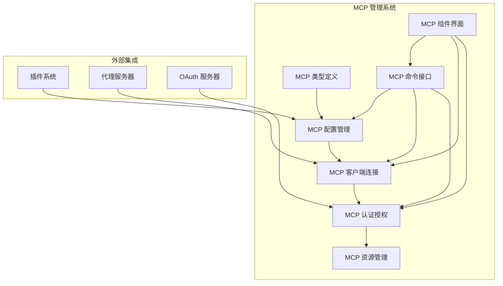
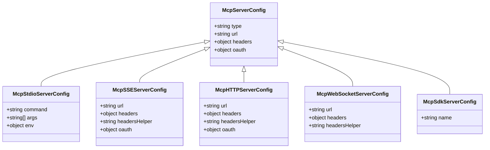
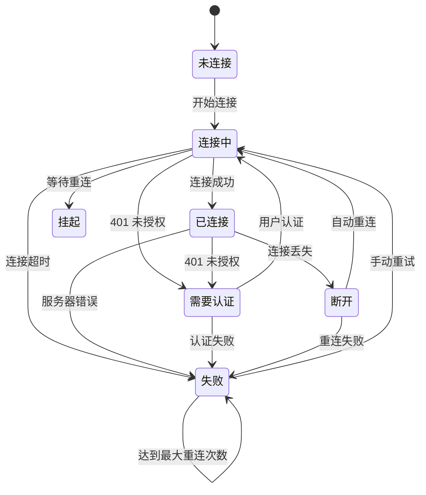
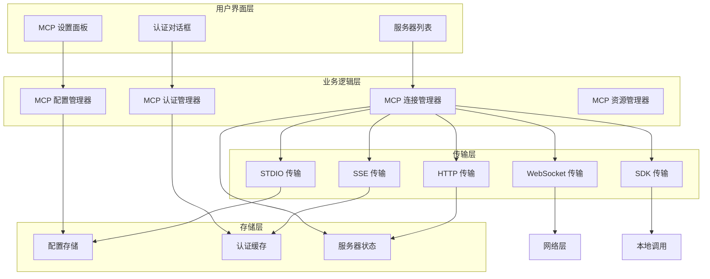
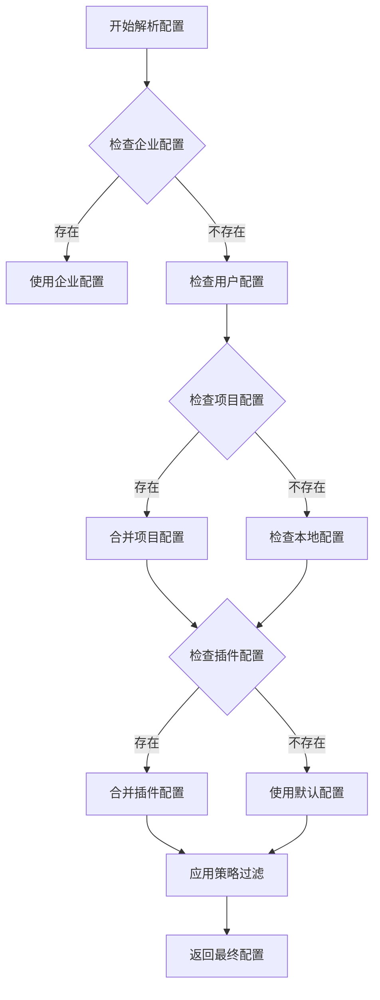
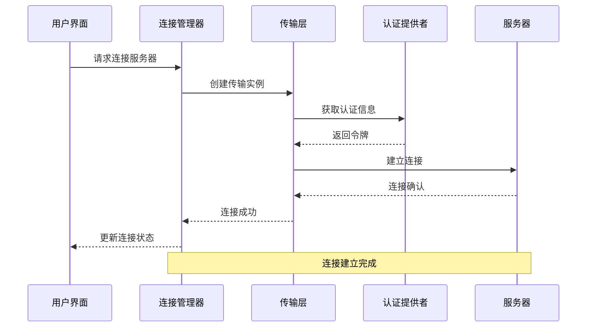
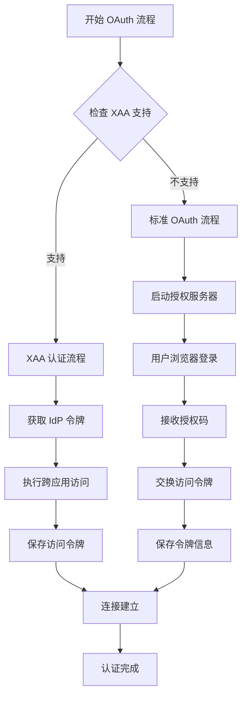
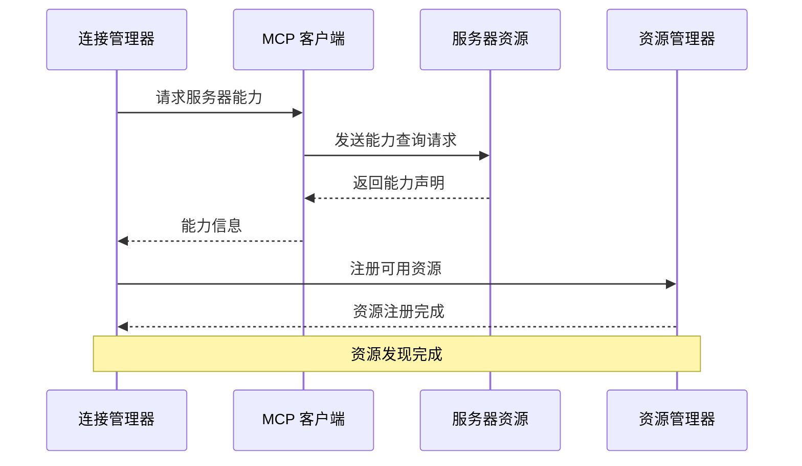
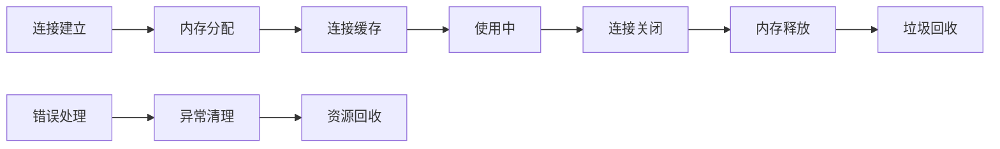

# MCP 服务器管理

<cite>
**本文档引用的文件**
- [src/services/mcp/types.ts](file://src/services/mcp/types.ts)
- [src/services/mcp/config.ts](file://src/services/mcp/config.ts)
- [src/services/mcp/client.ts](file://src/services/mcp/client.ts)
- [src/services/mcp/auth.ts](file://src/services/mcp/auth.ts)
- [src/commands/mcp/mcp.tsx](file://src/commands/mcp/mcp.tsx)
- [src/tools/AgentTool/runAgent.ts](file://src/tools/AgentTool/runAgent.ts)
- [src/tools/ReadMcpResourceTool/ReadMcpResourceTool.ts](file://src/tools/ReadMcpResourceTool/ReadMcpResourceTool.ts)
- [src/services/mcp/useManageMCPConnections.ts](file://src/services/mcp/useManageMCPConnections.ts)
- [src/cli/print.ts](file://src/cli/print.ts)
- [src/components/mcp/MCPRemoteServerMenu.tsx](file://src/components/mcp/MCPRemoteServerMenu.tsx)
</cite>

## 目录
1. [简介](#简介)
2. [项目结构](#项目结构)
3. [核心组件](#核心组件)
4. [架构概览](#架构概览)
5. [详细组件分析](#详细组件分析)
6. [依赖关系分析](#依赖关系分析)
7. [性能考虑](#性能考虑)
8. [故障排除指南](#故障排除指南)
9. [结论](#结论)
10. [附录](#附录)

## 简介

MCP（Model Context Protocol）服务器管理是 Claude Code 平台中用于管理第三方 AI 服务器连接的核心功能模块。该系统支持多种传输协议（STDIO、SSE、HTTP、WebSocket），提供完整的服务器发现、注册、配置、连接管理和认证授权机制。

本系统的主要目标是：
- 提供统一的 MCP 服务器管理界面
- 支持多种传输协议和认证方式
- 实现智能连接管理和自动重连机制
- 提供企业级策略控制和安全防护
- 支持动态服务器配置和插件集成

## 项目结构

MCP 服务器管理系统采用模块化架构设计，主要包含以下核心模块：



**图表来源**
- [src/services/mcp/types.ts:1-259](file://src/services/mcp/types.ts#L1-L259)
- [src/services/mcp/config.ts:1-800](file://src/services/mcp/config.ts#L1-L800)

**章节来源**
- [src/services/mcp/types.ts:1-259](file://src/services/mcp/types.ts#L1-L259)
- [src/services/mcp/config.ts:1-800](file://src/services/mcp/config.ts#L1-L800)

## 核心组件

### MCP 服务器类型系统

系统定义了完整的 MCP 服务器类型体系，支持多种传输协议：



**图表来源**
- [src/services/mcp/types.ts:28-135](file://src/services/mcp/types.ts#L28-L135)

### 连接状态管理

系统提供了完整的连接状态管理机制：



**图表来源**
- [src/services/mcp/types.ts:180-227](file://src/services/mcp/types.ts#L180-L227)

**章节来源**
- [src/services/mcp/types.ts:1-259](file://src/services/mcp/types.ts#L1-L259)

## 架构概览

MCP 服务器管理系统采用分层架构设计，确保各组件间的松耦合和高内聚：



**图表来源**
- [src/services/mcp/config.ts:1071-1251](file://src/services/mcp/config.ts#L1071-L1251)
- [src/services/mcp/client.ts:595-1599](file://src/services/mcp/client.ts#L595-L1599)

## 详细组件分析

### 配置管理系统

配置管理系统负责 MCP 服务器的发现、注册和配置管理：

#### 配置文件解析

系统支持多种配置文件格式和来源：



**图表来源**
- [src/services/mcp/config.ts:1071-1251](file://src/services/mcp/config.ts#L1071-L1251)

#### 服务器发现机制

系统实现了智能的服务器发现和去重机制：

**章节来源**
- [src/services/mcp/config.ts:800-1579](file://src/services/mcp/config.ts#L800-L1579)

### 连接管理组件

连接管理组件负责 MCP 服务器的连接建立、维护和断开：

#### 连接建立流程



**图表来源**
- [src/services/mcp/client.ts:595-1080](file://src/services/mcp/client.ts#L595-L1080)

#### 心跳检测和断线重连

系统实现了智能的心跳检测和断线重连机制：

**章节来源**
- [src/services/mcp/client.ts:1216-1402](file://src/services/mcp/client.ts#L1216-L1402)

### 认证授权系统

认证授权系统支持多种认证方式和安全机制：

#### OAuth 认证流程



**图表来源**
- [src/services/mcp/auth.ts:847-1342](file://src/services/mcp/auth.ts#L847-L1342)

#### 令牌管理机制

系统提供了完整的令牌生命周期管理：

**章节来源**
- [src/services/mcp/auth.ts:1376-1599](file://src/services/mcp/auth.ts#L1376-L1599)

### 资源发现和管理

资源发现系统负责 MCP 服务器能力声明和资源管理：

#### 资源发现流程



**图表来源**
- [src/tools/ReadMcpResourceTool/ReadMcpResourceTool.ts:75-101](file://src/tools/ReadMcpResourceTool/ReadMcpResourceTool.ts#L75-L101)

**章节来源**
- [src/tools/ReadMcpResourceTool/ReadMcpResourceTool.ts:1-101](file://src/tools/ReadMcpResourceTool/ReadMcpResourceTool.ts#L1-L101)

## 依赖关系分析

MCP 服务器管理系统具有清晰的依赖关系和模块划分：

```mermaid
graph TB
subgraph "核心依赖"
A[@modelcontextprotocol/sdk] --> B[MCP 协议实现]
C[lodash-es] --> D[工具函数库]
E[zod] --> F[数据验证]
F --> G[配置模式]
end
subgraph "认证依赖"
H[axios] --> I[HTTP 请求]
J[ws] --> K[WebSocket 支持]
L[http] --> M[回调服务器]
end
subgraph "系统依赖"
N[bun:bundle] --> O[特性检测]
P[react] --> Q[用户界面]
R[typescript] --> S[类型安全]
end
B --> T[MCP 客户端]
D --> U[连接管理]
F --> V[配置验证]
I --> W[认证请求]
K --> X[实时通信]
M --> Y[授权回调]
```

**图表来源**
- [src/services/mcp/client.ts:1-125](file://src/services/mcp/client.ts#L1-L125)
- [src/services/mcp/auth.ts:1-60](file://src/services/mcp/auth.ts#L1-L60)

**章节来源**
- [src/services/mcp/client.ts:1-800](file://src/services/mcp/client.ts#L1-L800)
- [src/services/mcp/auth.ts:1-800](file://src/services/mcp/auth.ts#L1-L800)

## 性能考虑

系统在设计时充分考虑了性能优化和资源管理：

### 连接池管理

系统实现了智能的连接池管理机制：

- **连接复用**: 使用 LRU 缓存机制复用已建立的连接
- **批量连接**: 支持批量服务器连接，提高启动效率
- **资源清理**: 自动清理断开的连接和过期的令牌

### 内存管理



**图表来源**
- [src/services/mcp/client.ts:1383-1402](file://src/services/mcp/client.ts#L1383-L1402)

### 性能监控

系统提供了全面的性能监控和指标收集：

- **连接时间统计**: 记录每次连接的耗时
- **重连次数跟踪**: 监控连接稳定性
- **资源使用监控**: 跟踪内存和 CPU 使用情况

## 故障排除指南

### 常见问题诊断

#### 连接问题

**问题**: 服务器无法连接
**可能原因**:
- 网络连接问题
- 认证信息过期
- 服务器地址配置错误

**解决步骤**:
1. 检查网络连接状态
2. 验证服务器地址和端口
3. 重新进行认证流程
4. 查看详细的错误日志

#### 认证问题

**问题**: 认证失败或频繁需要重新认证
**可能原因**:
- 令牌过期
- 客户端配置错误
- 服务器端策略变更

**解决步骤**:
1. 清除本地认证缓存
2. 重新配置客户端信息
3. 检查服务器端策略设置
4. 重启认证流程

#### 性能问题

**问题**: 连接缓慢或响应延迟
**可能原因**:
- 网络延迟
- 服务器负载过高
- 本地资源不足

**解决步骤**:
1. 检查网络质量
2. 监控服务器状态
3. 优化本地资源配置
4. 调整连接参数

### 调试工具

系统提供了丰富的调试工具和日志记录功能：

**章节来源**
- [src/services/mcp/client.ts:1265-1371](file://src/services/mcp/client.ts#L1265-L1371)
- [src/services/mcp/auth.ts:1265-1341](file://src/services/mcp/auth.ts#L1265-L1341)

## 结论

MCP 服务器管理系统是一个功能完整、架构清晰的现代化连接管理解决方案。系统通过模块化设计实现了高度的可扩展性和可维护性，同时提供了完善的安全机制和性能优化。

### 主要优势

1. **多协议支持**: 全面支持 STDIO、SSE、HTTP、WebSocket 和 SDK 传输协议
2. **智能认证**: 提供 OAuth、XAA 和多种认证方式的灵活组合
3. **连接管理**: 实现自动重连、心跳检测和资源清理机制
4. **企业级安全**: 集成策略控制、权限管理和安全防护
5. **开发友好**: 提供丰富的调试工具和监控指标

### 技术特色

- **类型安全**: 使用 TypeScript 确保代码质量和开发体验
- **异步架构**: 采用异步编程模型提高系统响应性
- **模块化设计**: 清晰的模块边界便于维护和扩展
- **性能优化**: 多层次的性能优化确保系统高效运行

## 附录

### 配置选项参考

系统支持以下环境变量配置：

| 环境变量 | 默认值 | 描述 |
|---------|--------|------|
| MCP_TIMEOUT | 30000 | 连接超时时间（毫秒） |
| MCP_TOOL_TIMEOUT | 100000000 | 工具调用超时时间（毫秒） |
| MCP_SERVER_CONNECTION_BATCH_SIZE | 3 | 服务器连接批处理大小 |
| MCP_REMOTE_SERVER_CONNECTION_BATCH_SIZE | 20 | 远程服务器连接批处理大小 |
| MCP_OAUTH_CLIENT_METADATA_URL | - | OAuth 客户端元数据 URL |

### 最佳实践

1. **配置管理**: 使用企业级配置管理确保一致性
2. **监控告警**: 建立完善的监控和告警机制
3. **安全策略**: 制定严格的访问控制和审计策略
4. **性能优化**: 定期评估和优化系统性能
5. **故障恢复**: 建立快速故障恢复和备份机制