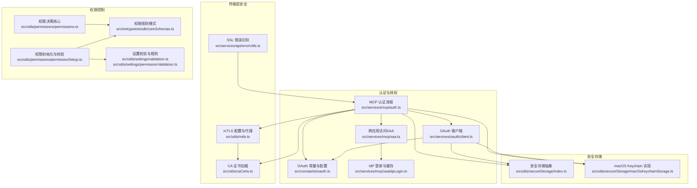
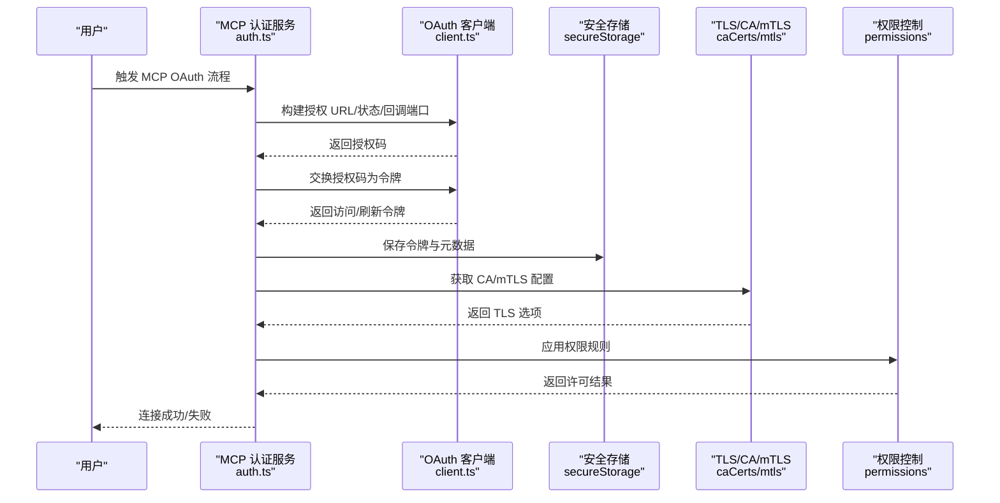
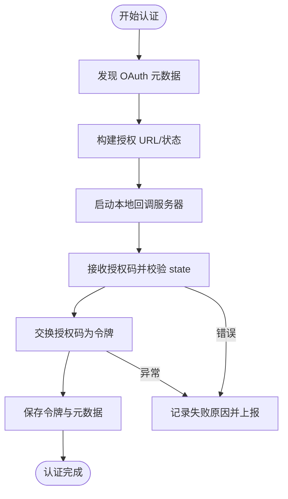
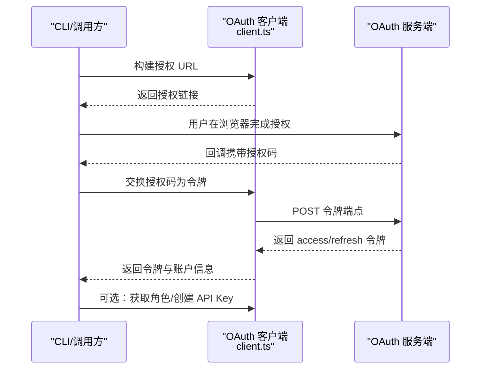
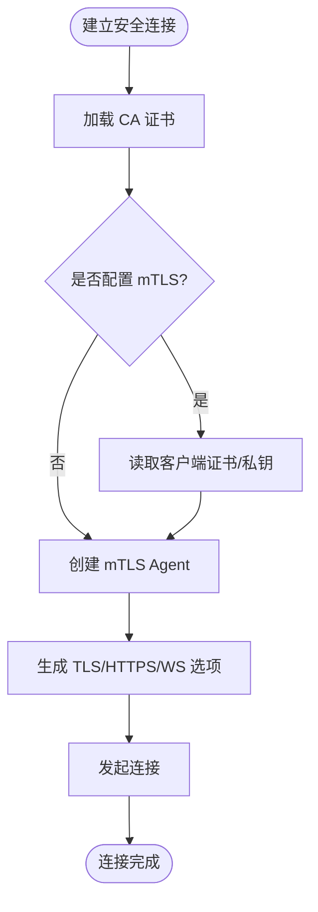
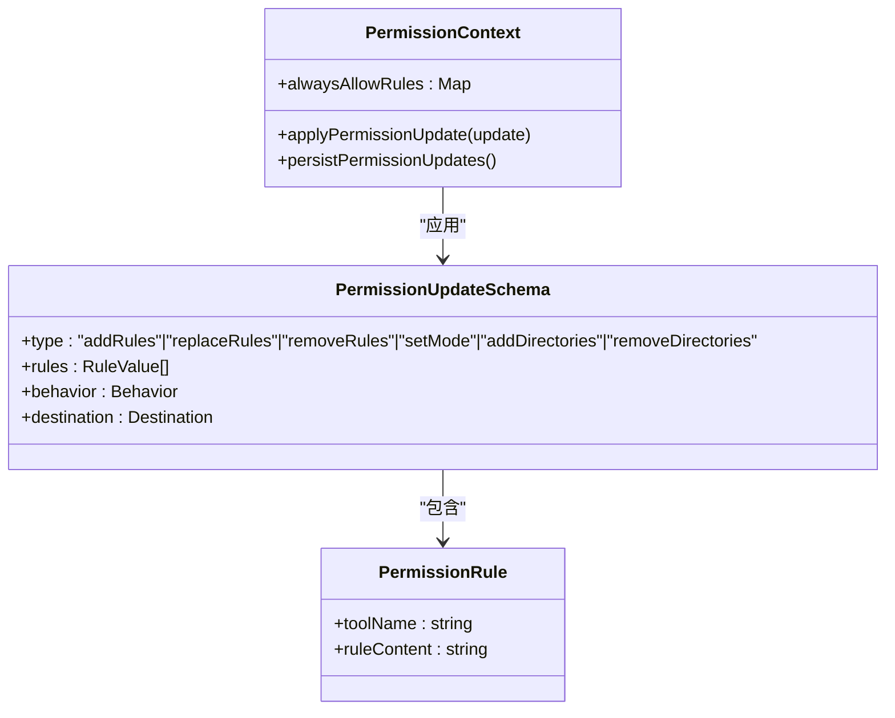
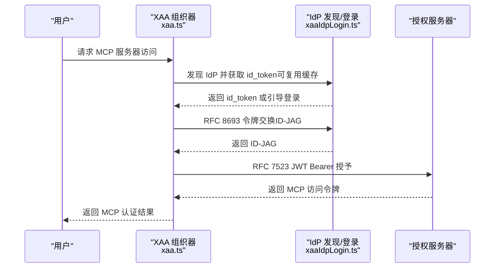
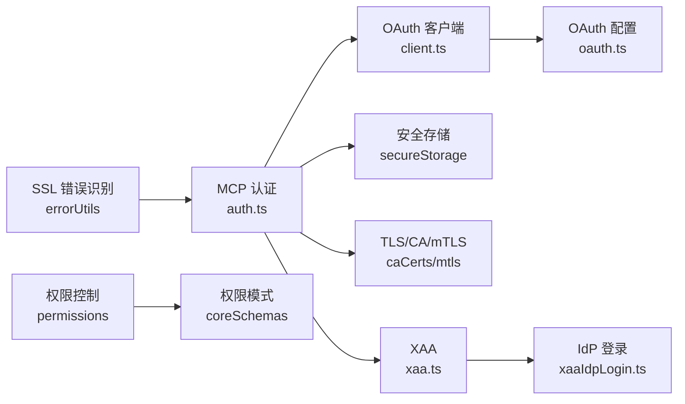

# MCP 认证与安全

<cite>
**本文档引用的文件**
- [auth.ts](file://src/services/mcp/auth.ts)
- [client.ts](file://src/services/oauth/client.ts)
- [oauth.ts](file://src/constants/oauth.ts)
- [index.ts](file://src/utils/secureStorage/index.ts)
- [macOsKeychainStorage.ts](file://src/utils/secureStorage/macOsKeychainStorage.ts)
- [caCerts.ts](file://src/utils/caCerts.ts)
- [mtls.ts](file://src/utils/mtls.ts)
- [permissionSetup.ts](file://src/utils/permissions/permissionSetup.ts)
- [permissions.ts](file://src/utils/permissions/permissions.ts)
- [coreSchemas.ts](file://src/entrypoints/sdk/coreSchemas.ts)
- [validation.ts](file://src/utils/settings/validation.ts)
- [permissionValidation.ts](file://src/utils/settings/permissionValidation.ts)
- [errorUtils.ts](file://src/services/api/errorUtils.ts)
- [xaa.ts](file://src/services/mcp/xaa.ts)
- [xaaIdpLogin.ts](file://src/services/mcp/xaaIdpLogin.ts)
</cite>

## 目录
1. [简介](#简介)
2. [项目结构](#项目结构)
3. [核心组件](#核心组件)
4. [架构总览](#架构总览)
5. [详细组件分析](#详细组件分析)
6. [依赖关系分析](#依赖关系分析)
7. [性能考量](#性能考量)
8. [故障排除指南](#故障排除指南)
9. [结论](#结论)
10. [附录](#附录)

## 简介
本文件面向 MCP（Model Context Protocol）认证与安全，系统性阐述代码库中实现的认证机制与安全模型，覆盖以下主题：
- 多种认证方式：API 密钥认证、OAuth 2.0 集成、证书认证（mTLS）
- 权限控制系统：角色定义、权限矩阵与访问控制列表
- 安全通道建立：TLS 配置、证书验证、中间人攻击防护
- 安全最佳实践：密钥管理、会话安全、数据加密
- 安全审计、日志记录与威胁检测
- 安全配置示例、漏洞防护与应急响应指南

## 项目结构
围绕 MCP 认证与安全的关键模块分布如下：
- OAuth 与 MCP 认证流程：src/services/mcp/auth.ts、src/services/oauth/client.ts、src/constants/oauth.ts
- 安全存储与密钥管理：src/utils/secureStorage/index.ts、src/utils/secureStorage/macOsKeychainStorage.ts
- 传输层安全：src/utils/caCerts.ts、src/utils/mtls.ts、src/services/api/errorUtils.ts
- 权限控制：src/utils/permissions/permissionSetup.ts、src/utils/permissions/permissions.ts、src/entrypoints/sdk/coreSchemas.ts、src/utils/settings/validation.ts、src/utils/settings/permissionValidation.ts
- 企业级认证（XAA）：src/services/mcp/xaa.ts、src/services/mcp/xaaIdpLogin.ts



**图表来源**
- [auth.ts:1-200](file://src/services/mcp/auth.ts#L1-200)
- [client.ts:1-120](file://src/services/oauth/client.ts#L1-120)
- [oauth.ts:186-235](file://src/constants/oauth.ts#L186-235)
- [index.ts:1-18](file://src/utils/secureStorage/index.ts#L1-18)
- [macOsKeychainStorage.ts:1-100](file://src/utils/secureStorage/macOsKeychainStorage.ts#L1-100)
- [caCerts.ts:28-105](file://src/utils/caCerts.ts#L28-105)
- [mtls.ts:23-95](file://src/utils/mtls.ts#L23-95)
- [permissionSetup.ts:1-100](file://src/utils/permissions/permissionSetup.ts#L1-100)
- [permissions.ts:1-120](file://src/utils/permissions/permissions.ts#L1-120)
- [coreSchemas.ts:256-299](file://src/entrypoints/sdk/coreSchemas.ts#L256-299)
- [validation.ts:238-265](file://src/utils/settings/validation.ts#L238-265)
- [permissionValidation.ts:244-262](file://src/utils/settings/permissionValidation.ts#L244-262)
- [errorUtils.ts:49-83](file://src/services/api/errorUtils.ts#L49-83)
- [xaa.ts:1-120](file://src/services/mcp/xaa.ts#L1-120)
- [xaaIdpLogin.ts:1-120](file://src/services/mcp/xaaIdpLogin.ts#L1-120)

**章节来源**
- [auth.ts:1-200](file://src/services/mcp/auth.ts#L1-200)
- [client.ts:1-120](file://src/services/oauth/client.ts#L1-120)
- [oauth.ts:186-235](file://src/constants/oauth.ts#L186-235)

## 核心组件
- MCP OAuth 流程与令牌管理：负责 OAuth 元数据发现、授权码交换、令牌刷新、撤销与清理；支持 XAA（跨应用访问）与标准 OAuth 路径。
- OAuth 客户端工具：构建授权 URL、交换授权码、刷新令牌、获取用户角色与 API Key，并进行配置与作用域管理。
- 安全存储与密钥管理：基于平台选择安全存储实现（macOS 使用 Keychain），提供读写、更新、删除与缓存策略。
- 传输层安全：动态加载系统或自定义 CA 证书，配置 mTLS 客户端证书与私钥，生成 HTTPS/WS/TLS 选项。
- 权限控制系统：规则解析与校验、危险规则检测、权限决策与持久化、目录白名单等。

**章节来源**
- [auth.ts:847-1342](file://src/services/mcp/auth.ts#L847-1342)
- [client.ts:107-274](file://src/services/oauth/client.ts#L107-274)
- [index.ts:1-18](file://src/utils/secureStorage/index.ts#L1-18)
- [macOsKeychainStorage.ts:26-176](file://src/utils/secureStorage/macOsKeychainStorage.ts#L26-176)
- [caCerts.ts:28-105](file://src/utils/caCerts.ts#L28-105)
- [mtls.ts:23-152](file://src/utils/mtls.ts#L23-152)
- [permissionSetup.ts:94-147](file://src/utils/permissions/permissionSetup.ts#L94-147)
- [permissions.ts:122-200](file://src/utils/permissions/permissions.ts#L122-200)

## 架构总览
下图展示 MCP 认证与安全的整体交互：从 OAuth 授权到令牌保存，再到传输层安全与权限控制的闭环。



**图表来源**
- [auth.ts:847-1342](file://src/services/mcp/auth.ts#L847-1342)
- [client.ts:107-274](file://src/services/oauth/client.ts#L107-274)
- [index.ts:1-18](file://src/utils/secureStorage/index.ts#L1-18)
- [caCerts.ts:28-105](file://src/utils/caCerts.ts#L28-105)
- [mtls.ts:100-152](file://src/utils/mtls.ts#L100-152)
- [permissions.ts:122-200](file://src/utils/permissions/permissions.ts#L122-200)

## 详细组件分析

### 组件一：MCP OAuth 认证与令牌管理
- 功能要点
  - OAuth 元数据发现：支持配置的元数据 URL 与 RFC 9728/RFC 8414 自动发现，HTTPS 强制与路径感知回退。
  - 授权码流程：本地回调服务器接收授权码，校验 state 防止 CSRF，支持手动回调输入。
  - 令牌管理：保存/读取/撤销令牌，支持刷新与过期处理，XAA 模式下的静默刷新。
  - 安全遥测：失败原因归因（超时、状态不匹配、提供商拒绝、SDK 失败等）。
- 关键流程图



**图表来源**
- [auth.ts:958-1342](file://src/services/mcp/auth.ts#L958-1342)

**章节来源**
- [auth.ts:256-311](file://src/services/mcp/auth.ts#L256-311)
- [auth.ts:958-1342](file://src/services/mcp/auth.ts#L958-1342)
- [auth.ts:1540-1599](file://src/services/mcp/auth.ts#L1540-1599)

### 组件二：OAuth 客户端工具（API 密钥与角色）
- 功能要点
  - 构建授权 URL：支持 PKCE、state、登录提示、组织参数与登录方式。
  - 令牌交换与刷新：标准化请求体、超时控制、错误映射与分析事件上报。
  - 用户角色与 API Key：拉取角色信息、创建 API Key 并安全存储。
  - 作用域与订阅信息：解析作用域、订阅类型、速率等级与账户信息。
- 序列图



**图表来源**
- [client.ts:46-144](file://src/services/oauth/client.ts#L46-144)
- [client.ts:146-274](file://src/services/oauth/client.ts#L146-274)
- [client.ts:276-342](file://src/services/oauth/client.ts#L276-342)

**章节来源**
- [client.ts:46-144](file://src/services/oauth/client.ts#L46-144)
- [client.ts:146-274](file://src/services/oauth/client.ts#L146-274)
- [client.ts:276-342](file://src/services/oauth/client.ts#L276-342)

### 组件三：安全存储与密钥管理（macOS Keychain）
- 功能要点
  - 平台适配：macOS 使用 Keychain，其他平台使用明文存储作为后备。
  - 读写优化：带 TTL 的缓存、并发读写去重、失败时的“陈旧而可用”策略。
  - 安全写入：优先通过 stdin 写入以降低进程监控可见性；超长载荷回退到命令行参数。
  - 错误处理：锁状态检测、失败返回与警告。
- 类图

```mermaid
classDiagram
class SecureStorage {
+name : string
+read() : SecureStorageData
+readAsync() : Promise<SecureStorageData>
+update(data) : {success : boolean, warning? : string}
+delete() : boolean
}
class macOsKeychainStorage {
+name : "keychain"
+read() : SecureStorageData
+readAsync() : Promise<SecureStorageData>
+update(data) : {success : boolean, warning? : string}
+delete() : boolean
}
SecureStorage <|.. macOsKeychainStorage : "实现"
```

**图表来源**
- [index.ts:1-18](file://src/utils/secureStorage/index.ts#L1-18)
- [macOsKeychainStorage.ts:26-176](file://src/utils/secureStorage/macOsKeychainStorage.ts#L26-176)

**章节来源**
- [index.ts:1-18](file://src/utils/secureStorage/index.ts#L1-18)
- [macOsKeychainStorage.ts:26-176](file://src/utils/secureStorage/macOsKeychainStorage.ts#L26-176)

### 组件四：传输层安全（TLS、CA 证书与 mTLS）
- 功能要点
  - CA 证书：支持系统 CA 与额外证书文件，memo 缓存与失效。
  - mTLS：从环境变量读取客户端证书/私钥/口令，生成 HTTPS Agent 与 WebSocket/TLS 选项。
  - 错误识别：SSL 错误码提取与分类，辅助诊断连接问题。
- 流程图



**图表来源**
- [caCerts.ts:28-105](file://src/utils/caCerts.ts#L28-105)
- [mtls.ts:23-152](file://src/utils/mtls.ts#L23-152)
- [errorUtils.ts:49-83](file://src/services/api/errorUtils.ts#L49-83)

**章节来源**
- [caCerts.ts:28-105](file://src/utils/caCerts.ts#L28-105)
- [mtls.ts:23-152](file://src/utils/mtls.ts#L23-152)
- [errorUtils.ts:49-83](file://src/services/api/errorUtils.ts#L49-83)

### 组件五：权限控制系统（角色、规则与访问控制）
- 功能要点
  - 规则定义与更新：支持添加/替换/移除规则、设置模式、增删目录。
  - 规则校验：Zod 模式校验、非法值警告与建议。
  - 危险规则检测：针对 Bash/PowerShell 的高危模式自动识别与阻断。
  - 权限决策：结合规则源（用户/项目/本地/会话/命令行）与分类器决策。
- 类图



**图表来源**
- [coreSchemas.ts:256-299](file://src/entrypoints/sdk/coreSchemas.ts#L256-299)
- [permissionSetup.ts:42-78](file://src/utils/permissions/permissionSetup.ts#L42-78)
- [permissions.ts:122-200](file://src/utils/permissions/permissions.ts#L122-200)

**章节来源**
- [coreSchemas.ts:256-299](file://src/entrypoints/sdk/coreSchemas.ts#L256-299)
- [permissionSetup.ts:42-78](file://src/utils/permissions/permissionSetup.ts#L42-78)
- [permissions.ts:122-200](file://src/utils/permissions/permissions.ts#L122-200)
- [validation.ts:238-265](file://src/utils/settings/validation.ts#L238-265)
- [permissionValidation.ts:244-262](file://src/utils/settings/permissionValidation.ts#L244-262)

### 组件六：企业级认证（XAA 与 IdP）
- 功能要点
  - XAA：一次 IdP 登录，多 MCP 服务器静默授权；支持 ID-JAG 到 JWT Bearer 的链路。
  - IdP 登录：标准 OIDC 授权码+PKCE，缓存 id_token，按到期时间与环境变量控制。
  - 混淆保护：PRM/AS 元数据发现与 issuer/resource 正规化比较，强制 HTTPS。
- 序列图



**图表来源**
- [xaa.ts:135-200](file://src/services/mcp/xaa.ts#L135-200)
- [xaaIdpLogin.ts:99-150](file://src/services/mcp/xaaIdpLogin.ts#L99-150)

**章节来源**
- [xaa.ts:1-200](file://src/services/mcp/xaa.ts#L1-200)
- [xaaIdpLogin.ts:1-200](file://src/services/mcp/xaaIdpLogin.ts#L1-200)

## 依赖关系分析
- 认证依赖
  - MCP 认证依赖 OAuth 客户端与安全存储；同时依赖 TLS/CA 配置保障传输安全。
  - XAA 依赖 IdP 登录与 AS 元数据发现，确保 HTTPS 与资源/发行者一致性。
- 权限依赖
  - 权限规则由设置校验与模式约束，结合危险规则检测与权限决策模块共同生效。
- 错误与可观测性
  - SSL 错误识别用于区分网络与协议错误；OAuth 失败原因稳定枚举便于分析。



**图表来源**
- [auth.ts:1-200](file://src/services/mcp/auth.ts#L1-200)
- [client.ts:1-120](file://src/services/oauth/client.ts#L1-120)
- [oauth.ts:186-235](file://src/constants/oauth.ts#L186-235)
- [index.ts:1-18](file://src/utils/secureStorage/index.ts#L1-18)
- [caCerts.ts:28-105](file://src/utils/caCerts.ts#L28-105)
- [mtls.ts:23-152](file://src/utils/mtls.ts#L23-152)
- [xaa.ts:1-120](file://src/services/mcp/xaa.ts#L1-120)
- [xaaIdpLogin.ts:1-120](file://src/services/mcp/xaaIdpLogin.ts#L1-120)
- [permissions.ts:1-120](file://src/utils/permissions/permissions.ts#L1-120)
- [coreSchemas.ts:256-299](file://src/entrypoints/sdk/coreSchemas.ts#L256-299)
- [errorUtils.ts:49-83](file://src/services/api/errorUtils.ts#L49-83)

**章节来源**
- [auth.ts:1-200](file://src/services/mcp/auth.ts#L1-200)
- [client.ts:1-120](file://src/services/oauth/client.ts#L1-120)
- [oauth.ts:186-235](file://src/constants/oauth.ts#L186-235)
- [permissions.ts:1-120](file://src/utils/permissions/permissions.ts#L1-120)

## 性能考量
- 令牌读取缓存：macOS Keychain 读取采用 TTL 缓存与“陈旧而可用”策略，避免频繁子进程调用。
- 请求超时与信号组合：OAuth 请求使用独立超时信号并与用户取消信号合并，防止资源泄漏。
- mTLS/CA 加载延迟：仅在需要时加载系统 CA，减少内存占用与启动开销。
- 传输层优化：keep-alive 与 memo 化 Agent/配置，降低重复创建成本。

[本节为通用指导，无需特定文件引用]

## 故障排除指南
- OAuth 失败原因定位
  - 超时、状态不匹配、提供商拒绝、端口不可用、SDK 失败、令牌交换失败等，均有稳定枚举便于追踪。
- SSL 错误识别
  - 通过错误链遍历提取 SSL 错误码，辅助判断证书、握手或协议层面的问题。
- macOS Keychain 问题
  - 检查钥匙串是否锁定、命令执行返回码与缓存状态；必要时清除缓存后重试。
- 权限规则问题
  - 使用设置校验与规则模式，查看非法值警告与修复建议；对危险规则进行拦截与提示。

**章节来源**
- [auth.ts:1265-1341](file://src/services/mcp/auth.ts#L1265-1341)
- [errorUtils.ts:49-83](file://src/services/api/errorUtils.ts#L49-83)
- [macOsKeychainStorage.ts:211-231](file://src/utils/secureStorage/macOsKeychainStorage.ts#L211-231)
- [validation.ts:238-265](file://src/utils/settings/validation.ts#L238-265)
- [permissionValidation.ts:244-262](file://src/utils/settings/permissionValidation.ts#L244-262)

## 结论
该代码库在 MCP 认证与安全方面实现了：
- 完整的 OAuth 2.0 流程与 MCP 元数据发现、令牌管理与撤销；
- 企业级 XAA 认证与 IdP 缓存复用；
- 平台化的安全存储与传输层安全配置；
- 基于规则的权限控制与危险模式检测；
- 详尽的失败原因归因与 SSL 错误识别，便于运维与安全审计。

这些能力共同构成了一套可扩展、可观测且具备强健安全性的 MCP 认证与权限体系。

[本节为总结，无需特定文件引用]

## 附录

### 安全配置示例（环境变量与设置）
- OAuth 配置
  - 客户端 ID 与重定向：通过常量与环境变量覆盖，支持自定义 OAuth 基础地址（仅允许白名单）。
  - 作用域：推理、档案、会话、MCP 服务器、文件上传等。
- mTLS 与 CA
  - 客户端证书/私钥/口令：通过环境变量注入；系统 CA 或额外证书文件通过运行时选项与环境变量控制。
- XAA
  - 启用开关、IdP 发行者与客户端凭据、回调端口与浏览器打开策略。

**章节来源**
- [oauth.ts:186-235](file://src/constants/oauth.ts#L186-235)
- [mtls.ts:23-73](file://src/utils/mtls.ts#L23-73)
- [caCerts.ts:28-105](file://src/utils/caCerts.ts#L28-105)
- [xaaIdpLogin.ts:32-76](file://src/services/mcp/xaaIdpLogin.ts#L32-76)

### 漏洞防护与应急响应
- CSRF 防护：严格校验 state 参数，拒绝不匹配回调。
- 中间人攻击防护：强制 HTTPS 元数据与令牌端点，系统/自定义 CA 验证，mTLS 可选客户端证书。
- 凭据泄露防护：Keychain 写入优先 stdin，敏感参数日志脱敏，令牌字段红名单替换。
- 应急响应：令牌撤销、缓存失效、失败原因归因、SSL 错误码提取与告警。

**章节来源**
- [auth.ts:108-125](file://src/services/mcp/auth.ts#L108-125)
- [auth.ts:1079-1085](file://src/services/mcp/auth.ts#L1079-1085)
- [auth.ts:467-618](file://src/services/mcp/auth.ts#L467-618)
- [macOsKeychainStorage.ts:111-146](file://src/utils/secureStorage/macOsKeychainStorage.ts#L111-146)
- [xaa.ts:94-97](file://src/services/mcp/xaa.ts#L94-97)