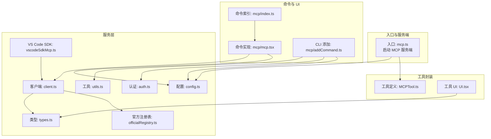
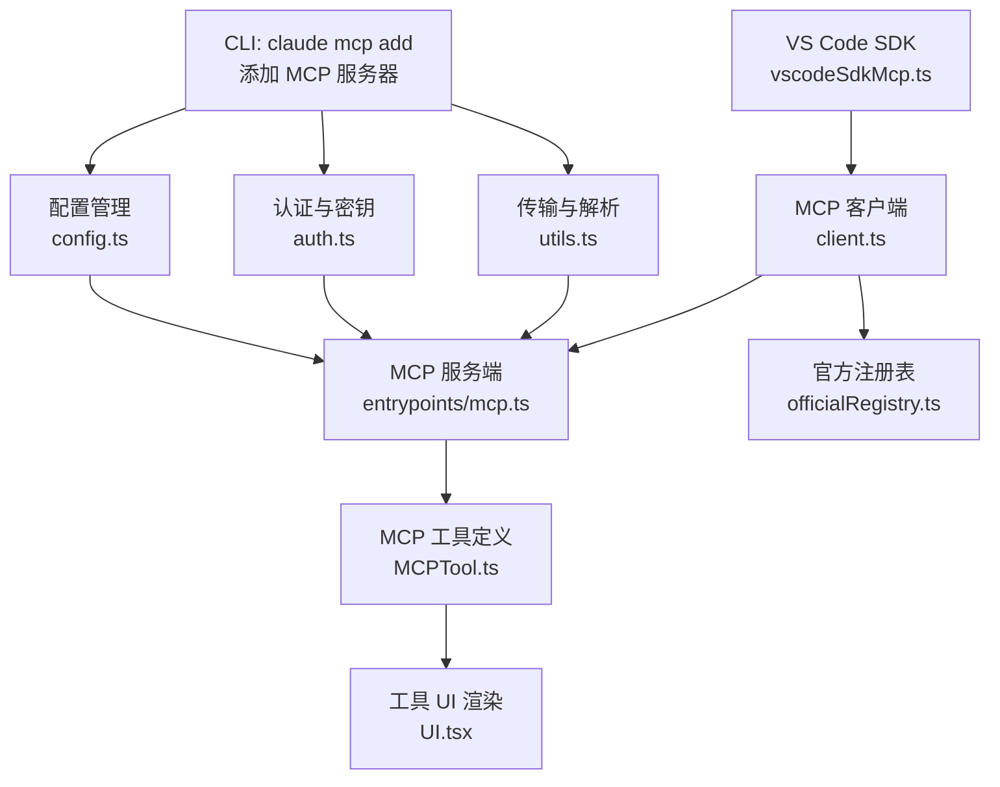
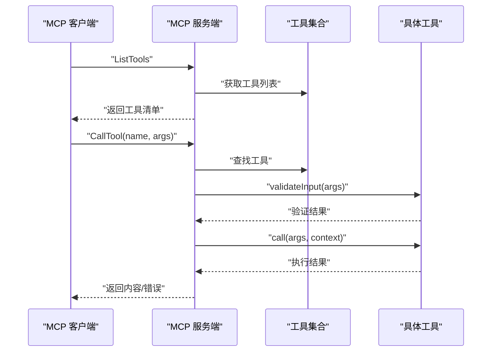
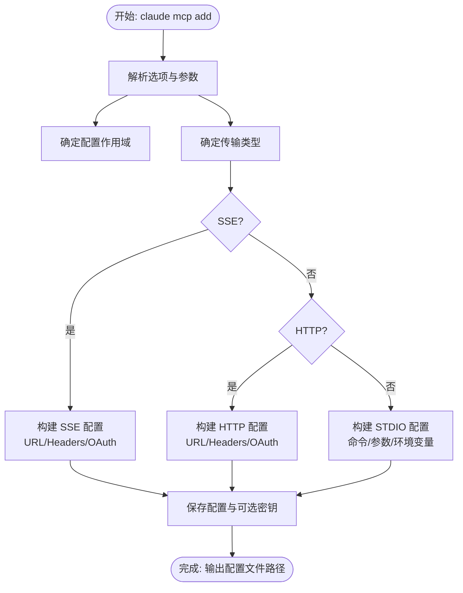
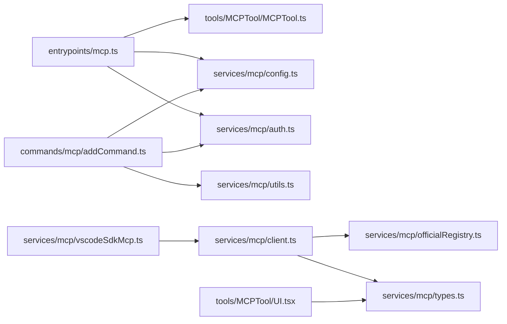

# MCP 集成示例

<cite>
**本文档引用的文件**
- [src/entrypoints/mcp.ts](file://src/entrypoints/mcp.ts)
- [src/commands/mcp/index.ts](file://src/commands/mcp/index.ts)
- [src/commands/mcp/mcp.tsx](file://src/commands/mcp/mcp.tsx)
- [src/commands/mcp/addCommand.ts](file://src/commands/mcp/addCommand.ts)
- [src/tools/MCPTool/MCPTool.ts](file://src/tools/MCPTool/MCPTool.ts)
- [src/tools/MCPTool/UI.tsx](file://src/tools/MCPTool/UI.tsx)
- [src/services/mcp/config.ts](file://src/services/mcp/config.ts)
- [src/services/mcp/auth.ts](file://src/services/mcp/auth.ts)
- [src/services/mcp/utils.ts](file://src/services/mcp/utils.ts)
- [src/services/mcp/officialRegistry.ts](file://src/services/mcp/officialRegistry.ts)
- [src/services/mcp/client.ts](file://src/services/mcp/client.ts)
- [src/services/mcp/vscodeSdkMcp.ts](file://src/services/mcp/vscodeSdkMcp.ts)
- [src/services/mcp/types.ts](file://src/services/mcp/types.ts)
</cite>

## 目录
1. [简介](#简介)
2. [项目结构](#项目结构)
3. [核心组件](#核心组件)
4. [架构总览](#架构总览)
5. [详细组件分析](#详细组件分析)
6. [依赖关系分析](#依赖关系分析)
7. [性能考虑](#性能考虑)
8. [故障排除指南](#故障排除指南)
9. [结论](#结论)
10. [附录](#附录)

## 简介
本指南面向希望在 Claude Code 中集成 MCP（Model Context Protocol）的开发者，提供从平台集成、CLI 配置、VS Code SDK 集成到官方注册表使用的完整实践路径。文档覆盖以下主题：
- 与 Claude AI 平台的集成：API 配置、认证设置、工具调用流程
- 与 VS Code 的 SDK 集成：扩展开发、插件配置、用户界面集成
- 官方注册表使用：服务器发现、能力查询、配置管理
- 常见集成场景：文件系统访问、代码编辑、项目管理
- 集成测试方法、调试技巧、性能优化
- 故障排除、常见问题与社区资源

## 项目结构
MCP 相关代码主要分布在以下模块：
- 入口与服务端：定义 MCP 服务端、工具暴露、请求处理
- 命令与 UI：CLI 子命令、本地 JSX 命令、设置与连接管理
- 工具封装：通用 MCP 工具定义与渲染
- 服务层：配置管理、认证、传输、官方注册表、VS Code SDK



**图表来源**
- [src/entrypoints/mcp.ts:35-196](file://src/entrypoints/mcp.ts#L35-L196)
- [src/commands/mcp/index.ts:1-13](file://src/commands/mcp/index.ts#L1-L13)
- [src/commands/mcp/mcp.tsx:63-84](file://src/commands/mcp/mcp.tsx#L63-L84)
- [src/commands/mcp/addCommand.ts:33-280](file://src/commands/mcp/addCommand.ts#L33-L280)
- [src/tools/MCPTool/MCPTool.ts:27-77](file://src/tools/MCPTool/MCPTool.ts#L27-L77)
- [src/tools/MCPTool/UI.tsx:41-150](file://src/tools/MCPTool/UI.tsx#L41-L150)
- [src/services/mcp/config.ts](file://src/services/mcp/config.ts)
- [src/services/mcp/auth.ts](file://src/services/mcp/auth.ts)
- [src/services/mcp/utils.ts](file://src/services/mcp/utils.ts)
- [src/services/mcp/officialRegistry.ts](file://src/services/mcp/officialRegistry.ts)
- [src/services/mcp/client.ts](file://src/services/mcp/client.ts)
- [src/services/mcp/vscodeSdkMcp.ts](file://src/services/mcp/vscodeSdkMcp.ts)
- [src/services/mcp/types.ts](file://src/services/mcp/types.ts)

**章节来源**
- [src/entrypoints/mcp.ts:1-197](file://src/entrypoints/mcp.ts#L1-L197)
- [src/commands/mcp/index.ts:1-13](file://src/commands/mcp/index.ts#L1-L13)
- [src/commands/mcp/mcp.tsx:1-85](file://src/commands/mcp/mcp.tsx#L1-L85)
- [src/commands/mcp/addCommand.ts:1-281](file://src/commands/mcp/addCommand.ts#L1-L281)
- [src/tools/MCPTool/MCPTool.ts:1-78](file://src/tools/MCPTool/MCPTool.ts#L1-L78)
- [src/tools/MCPTool/UI.tsx:1-403](file://src/tools/MCPTool/UI.tsx#L1-L403)

## 核心组件
- MCP 服务端入口：负责初始化 Server、注册 ListTools 与 CallTool 请求处理器、Stdio 传输连接
- MCP 工具定义：统一的工具接口、权限检查、输出截断策略、UI 渲染
- CLI 子命令：添加 MCP 服务器、解析传输类型、环境变量、认证参数
- 配置与认证：配置文件管理、OAuth 客户端密钥、传输工具
- 官方注册表与客户端：服务器发现、能力查询、连接管理
- VS Code SDK 集成：通过 SDK 提供 MCP 能力的扩展与插件化

**章节来源**
- [src/entrypoints/mcp.ts:35-196](file://src/entrypoints/mcp.ts#L35-L196)
- [src/tools/MCPTool/MCPTool.ts:27-77](file://src/tools/MCPTool/MCPTool.ts#L27-L77)
- [src/commands/mcp/addCommand.ts:33-280](file://src/commands/mcp/addCommand.ts#L33-L280)
- [src/services/mcp/config.ts](file://src/services/mcp/config.ts)
- [src/services/mcp/auth.ts](file://src/services/mcp/auth.ts)
- [src/services/mcp/officialRegistry.ts](file://src/services/mcp/officialRegistry.ts)
- [src/services/mcp/client.ts](file://src/services/mcp/client.ts)
- [src/services/mcp/vscodeSdkMcp.ts](file://src/services/mcp/vscodeSdkMcp.ts)

## 架构总览
下图展示 MCP 在 Claude Code 中的整体架构：从 CLI 添加服务器，到服务端暴露工具，再到 VS Code 扩展与官方注册表的协作。



**图表来源**
- [src/commands/mcp/addCommand.ts:33-280](file://src/commands/mcp/addCommand.ts#L33-L280)
- [src/services/mcp/config.ts](file://src/services/mcp/config.ts)
- [src/services/mcp/auth.ts](file://src/services/mcp/auth.ts)
- [src/services/mcp/utils.ts](file://src/services/mcp/utils.ts)
- [src/entrypoints/mcp.ts:35-196](file://src/entrypoints/mcp.ts#L35-L196)
- [src/tools/MCPTool/MCPTool.ts:27-77](file://src/tools/MCPTool/MCPTool.ts#L27-L77)
- [src/tools/MCPTool/UI.tsx:41-150](file://src/tools/MCPTool/UI.tsx#L41-L150)
- [src/services/mcp/officialRegistry.ts](file://src/services/mcp/officialRegistry.ts)
- [src/services/mcp/client.ts](file://src/services/mcp/client.ts)
- [src/services/mcp/vscodeSdkMcp.ts](file://src/services/mcp/vscodeSdkMcp.ts)

## 详细组件分析

### MCP 服务端入口（entrypoints/mcp.ts）
- 初始化 Server，声明 capabilities 为 tools
- 注册 ListTools 请求处理器：动态获取工具列表，转换输入/输出 Schema，生成描述
- 注册 CallTool 请求处理器：根据名称查找工具、校验输入、执行工具、返回结果或错误
- 使用 StdioServerTransport 连接，支持调试与 verbose 模式



**图表来源**
- [src/entrypoints/mcp.ts:59-187](file://src/entrypoints/mcp.ts#L59-L187)

**章节来源**
- [src/entrypoints/mcp.ts:35-196](file://src/entrypoints/mcp.ts#L35-L196)

### MCP 工具定义与 UI（tools/MCPTool）
- 工具定义：统一的工具接口、权限检查、最大结果大小限制、输出截断判断
- 输入/输出 Schema：允许任意对象作为输入，输出为字符串
- UI 渲染：工具使用消息、进度消息、结果消息；支持富文本输出、大响应警告、Slack 发送紧凑显示

```mermaid
classDiagram
class MCPTool {
+isMcp : boolean
+name : string
+maxResultSizeChars : number
+description() : string
+prompt() : string
+inputSchema
+outputSchema
+call()
+checkPermissions() : PermissionResult
+renderToolUseMessage()
+renderToolUseProgressMessage()
+renderToolResultMessage()
+isResultTruncated(output) : boolean
}
class UI {
+renderToolUseMessage(input, {verbose})
+renderToolUseProgressMessage(messages)
+renderToolResultMessage(output, messages, {verbose, input})
}
MCPTool --> UI : "使用"
```

**图表来源**
- [src/tools/MCPTool/MCPTool.ts:27-77](file://src/tools/MCPTool/MCPTool.ts#L27-L77)
- [src/tools/MCPTool/UI.tsx:41-150](file://src/tools/MCPTool/UI.tsx#L41-L150)

**章节来源**
- [src/tools/MCPTool/MCPTool.ts:1-78](file://src/tools/MCPTool/MCPTool.ts#L1-L78)
- [src/tools/MCPTool/UI.tsx:1-403](file://src/tools/MCPTool/UI.tsx#L1-L403)

### CLI 添加 MCP 服务器（commands/mcp/addCommand.ts）
- 支持三种传输：stdio、sse、http
- 解析环境变量、请求头、OAuth 参数（client-id、client-secret、callback-port）、XAA（SEP-990）
- 将配置写入本地/用户/项目作用域，记录分析事件
- 对疑似 URL 的命令进行提示与纠正



**图表来源**
- [src/commands/mcp/addCommand.ts:33-280](file://src/commands/mcp/addCommand.ts#L33-L280)

**章节来源**
- [src/commands/mcp/addCommand.ts:1-281](file://src/commands/mcp/addCommand.ts#L1-L281)

### 命令与 UI（commands/mcp/mcp.tsx 与 index.ts）
- 本地 JSX 命令：提供 /mcp 基础命令、启用/禁用、重连、设置跳转等
- 通过 useMcpToggleEnabled 与全局状态交互，支持批量切换与目标选择
- 与 MCP 设置组件、重连组件配合，简化用户操作

**章节来源**
- [src/commands/mcp/index.ts:1-13](file://src/commands/mcp/index.ts#L1-L13)
- [src/commands/mcp/mcp.tsx:1-85](file://src/commands/mcp/mcp.tsx#L1-L85)

### 官方注册表与客户端（services/mcp/officialRegistry.ts 与 client.ts）
- 官方注册表：提供服务器发现、能力查询、元数据管理
- 客户端：封装连接、认证、传输、错误处理，支持 SSE/HTTP/STDIO
- 类型定义：统一的配置、能力、传输类型

**章节来源**
- [src/services/mcp/officialRegistry.ts](file://src/services/mcp/officialRegistry.ts)
- [src/services/mcp/client.ts](file://src/services/mcp/client.ts)
- [src/services/mcp/types.ts](file://src/services/mcp/types.ts)

### VS Code SDK 集成（services/mcp/vscodeSdkMcp.ts）
- 通过 VS Code SDK 提供 MCP 能力，便于在 IDE 内集成 MCP 服务器
- 与客户端和服务端协同工作，实现插件化与用户界面集成

**章节来源**
- [src/services/mcp/vscodeSdkMcp.ts](file://src/services/mcp/vscodeSdkMcp.ts)

## 依赖关系分析
- 入口依赖工具集合与权限检查，工具依赖 UI 渲染与输出截断策略
- CLI 依赖配置、认证与传输工具，服务端依赖配置与认证
- 客户端依赖官方注册表与类型定义，VS Code SDK 依赖客户端



**图表来源**
- [src/entrypoints/mcp.ts:35-196](file://src/entrypoints/mcp.ts#L35-L196)
- [src/tools/MCPTool/MCPTool.ts:27-77](file://src/tools/MCPTool/MCPTool.ts#L27-L77)
- [src/tools/MCPTool/UI.tsx:41-150](file://src/tools/MCPTool/UI.tsx#L41-L150)
- [src/commands/mcp/addCommand.ts:33-280](file://src/commands/mcp/addCommand.ts#L33-L280)
- [src/services/mcp/config.ts](file://src/services/mcp/config.ts)
- [src/services/mcp/auth.ts](file://src/services/mcp/auth.ts)
- [src/services/mcp/utils.ts](file://src/services/mcp/utils.ts)
- [src/services/mcp/client.ts](file://src/services/mcp/client.ts)
- [src/services/mcp/officialRegistry.ts](file://src/services/mcp/officialRegistry.ts)
- [src/services/mcp/types.ts](file://src/services/mcp/types.ts)
- [src/services/mcp/vscodeSdkMcp.ts](file://src/services/mcp/vscodeSdkMcp.ts)

**章节来源**
- [src/entrypoints/mcp.ts:35-196](file://src/entrypoints/mcp.ts#L35-L196)
- [src/commands/mcp/addCommand.ts:33-280](file://src/commands/mcp/addCommand.ts#L33-L280)
- [src/tools/MCPTool/MCPTool.ts:27-77](file://src/tools/MCPTool/MCPTool.ts#L27-L77)
- [src/tools/MCPTool/UI.tsx:41-150](file://src/tools/MCPTool/UI.tsx#L41-L150)
- [src/services/mcp/client.ts](file://src/services/mcp/client.ts)
- [src/services/mcp/officialRegistry.ts](file://src/services/mcp/officialRegistry.ts)
- [src/services/mcp/vscodeSdkMcp.ts](file://src/services/mcp/vscodeSdkMcp.ts)

## 性能考虑
- 工具输入/输出 Schema 转换：避免根级 anyOf/oneOf，确保 MCP SDK 可接受的 object 类型
- 缓存策略：文件状态缓存限制大小，防止内存增长
- 大响应警告：估算内容 token 数量，超过阈值给出警告
- 截断与富文本：在非 verbose 模式下截断长输入，富文本输出提升可读性
- 传输选择：根据场景选择 SSE/HTTP/STDIO，合理设置 headers 与回调端口

[本节为通用指导，无需特定文件来源]

## 故障排除指南
- 服务器未找到：确认工具名称与已暴露工具一致
- 输入无效：检查 validateInput 返回的错误信息
- 认证失败：核对 client-id、client-secret、callback-port、XAA 设置
- 传输类型误用：stdio 与 http/sse 的区别，URL 误判提示
- 大响应导致上下文溢出：关注输出警告，必要时调整 verbose 或分页处理
- VS Code 集成异常：检查 SDK 插件是否正确加载，客户端连接状态

**章节来源**
- [src/entrypoints/mcp.ts:170-186](file://src/entrypoints/mcp.ts#L170-L186)
- [src/commands/mcp/addCommand.ts:104-122](file://src/commands/mcp/addCommand.ts#L104-L122)
- [src/tools/MCPTool/UI.tsx:110-113](file://src/tools/MCPTool/UI.tsx#L110-L113)

## 结论
本指南提供了 Claude Code 中 MCP 集成的完整路径：从服务端入口、工具定义，到 CLI 添加、配置与认证，再到官方注册表与 VS Code SDK 的协同工作。通过合理的性能优化与故障排除策略，开发者可以稳定地在 Claude AI 平台与 VS Code 生态中集成 MCP 能力，满足文件系统访问、代码编辑与项目管理等常见场景。

## 附录
- 常见集成场景示例
  - 文件系统访问：通过工具封装与 UI 渲染，实现安全的文件读写与状态缓存
  - 代码编辑：结合 Claude AI 的模型能力，提供智能补全与重构建议
  - 项目管理：利用官方注册表发现服务器，统一管理多源 MCP 能力
- 集成测试与调试
  - 使用调试模式与 verbose 输出定位问题
  - 通过 CLI 验证传输与认证配置
  - 在 VS Code 中验证扩展加载与连接状态
- 社区资源
  - 官方注册表与文档
  - VS Code 扩展市场与 SDK 文档
  - 社区论坛与问题反馈渠道

[本节为概念性总结，无需特定文件来源]