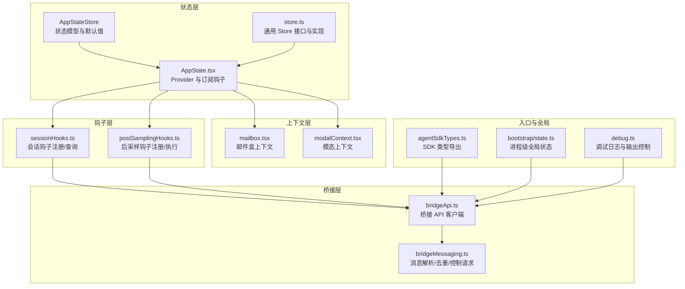
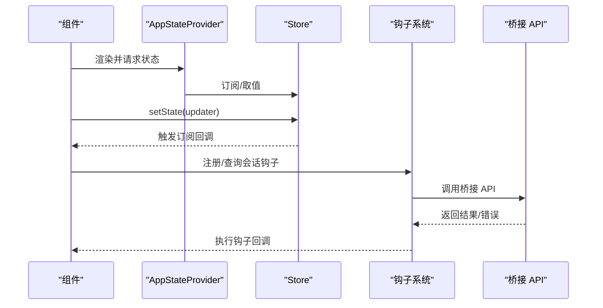
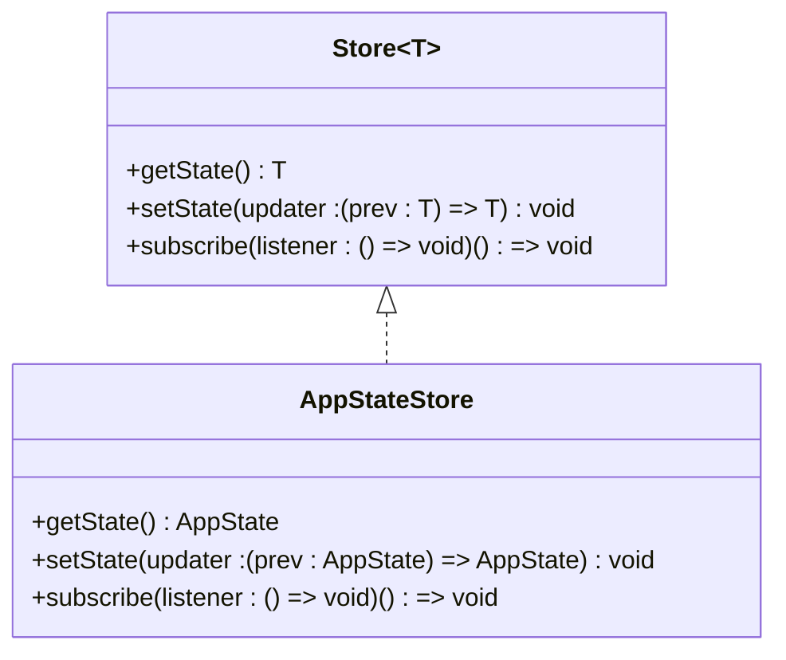
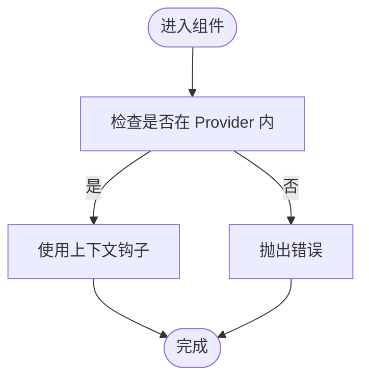
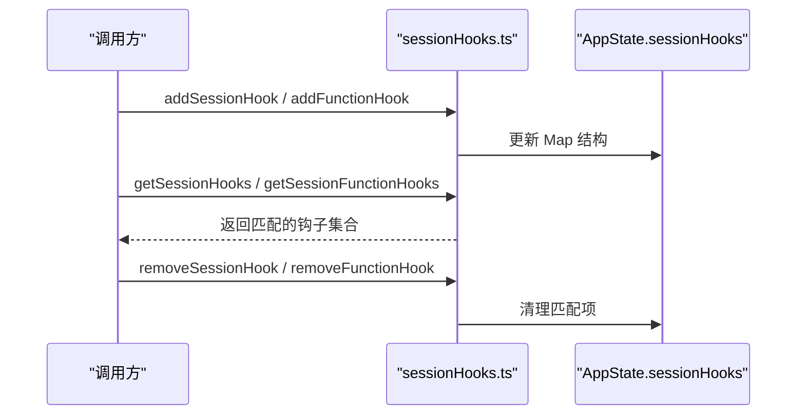
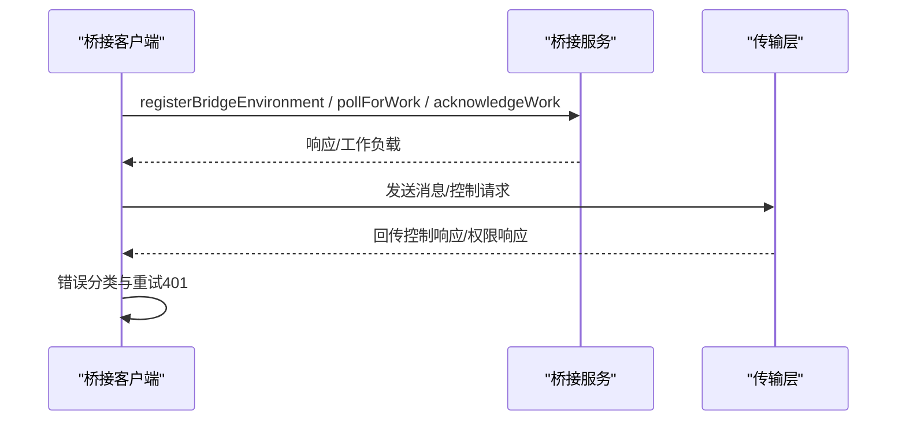
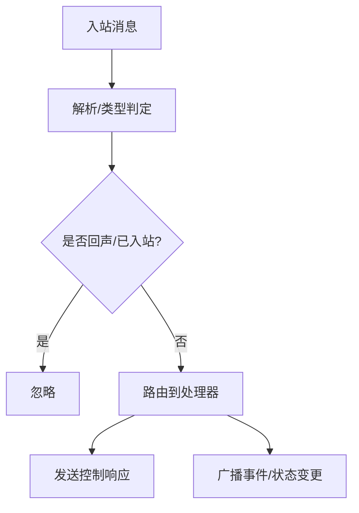
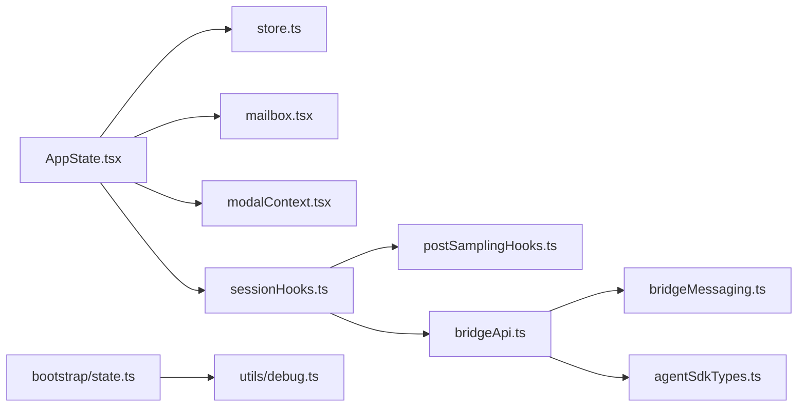

# 内部 API

<cite>
**本文引用的文件**
- [src/state/AppStateStore.ts](file://src/state/AppStateStore.ts)
- [src/state/AppState.tsx](file://src/state/AppState.tsx)
- [src/state/store.ts](file://src/state/store.ts)
- [src/context/mailbox.tsx](file://src/context/mailbox.tsx)
- [src/context/modalContext.tsx](file://src/context/modalContext.tsx)
- [src/utils/hooks/sessionHooks.ts](file://src/utils/hooks/sessionHooks.ts)
- [src/utils/hooks/postSamplingHooks.ts](file://src/utils/hooks/postSamplingHooks.ts)
- [src/bridge/bridgeApi.ts](file://src/bridge/bridgeApi.ts)
- [src/bridge/bridgeMessaging.ts](file://src/bridge/bridgeMessaging.ts)
- [src/entrypoints/agentSdkTypes.ts](file://src/entrypoints/agentSdkTypes.ts)
- [src/bootstrap/state.ts](file://src/bootstrap/state.ts)
- [src/utils/debug.ts](file://src/utils/debug.ts)
</cite>

## 目录
1. [简介](#简介)
2. [项目结构](#项目结构)
3. [核心组件](#核心组件)
4. [架构总览](#架构总览)
5. [详细组件分析](#详细组件分析)
6. [依赖关系分析](#依赖关系分析)
7. [性能考量](#性能考量)
8. [故障排查指南](#故障排查指南)
9. [结论](#结论)
10. [附录](#附录)

## 简介
本技术参考文档面向 Claude Code 内部开发者与集成方，系统梳理内部 API 的设计与实现，重点覆盖以下方面：
- 状态管理 API：AppStateStore 的状态模型、操作接口、订阅与响应式更新机制
- 上下文 API：上下文提供者、上下文消费者与上下文状态管理
- 钩子系统 API：会话级钩子（命令/函数钩子）的注册、匹配与执行；后采样钩子的注册与执行
- 服务层 API：桥接服务的客户端封装、消息处理与控制请求路由
- 内部通信机制：消息传递、事件广播与去重
- 内存管理、性能监控与调试接口
- 使用示例、最佳实践与注意事项
- 稳定性保证与版本兼容策略

## 项目结构
本仓库采用“按功能域分层”的组织方式：
- state：应用状态模型与存储，提供全局状态的读写与订阅
- context：React 上下文提供者，承载跨组件共享的状态与工具
- utils/hooks：会话级与后采样钩子的注册与执行机制
- bridge：桥接服务 API 客户端与消息传输层
- entrypoints：对外 SDK 类型导出入口
- bootstrap：进程级全局状态与指标采集
- utils/debug：调试日志与输出控制

图示来源
- [src/state/AppStateStore.ts:89-452](file://src/state/AppStateStore.ts#L89-L452)
- [src/state/store.ts:4-8](file://src/state/store.ts#L4-L8)
- [src/state/AppState.tsx:27-110](file://src/state/AppState.tsx#L27-L110)
- [src/context/mailbox.tsx:1-38](file://src/context/mailbox.tsx#L1-L38)
- [src/context/modalContext.tsx:22-27](file://src/context/modalContext.tsx#L22-L27)
- [src/utils/hooks/sessionHooks.ts:42-62](file://src/utils/hooks/sessionHooks.ts#L42-L62)
- [src/utils/hooks/postSamplingHooks.ts:10-18](file://src/utils/hooks/postSamplingHooks.ts#L10-L18)
- [src/bridge/bridgeApi.ts:68-139](file://src/bridge/bridgeApi.ts#L68-L139)
- [src/bridge/bridgeMessaging.ts:132-208](file://src/bridge/bridgeMessaging.ts#L132-L208)
- [src/entrypoints/agentSdkTypes.ts:12-31](file://src/entrypoints/agentSdkTypes.ts#L12-L31)
- [src/bootstrap/state.ts:45-257](file://src/bootstrap/state.ts#L45-L257)
- [src/utils/debug.ts:203-228](file://src/utils/debug.ts#L203-L228)

章节来源
- [src/state/AppStateStore.ts:89-452](file://src/state/AppStateStore.ts#L89-L452)
- [src/state/store.ts:4-8](file://src/state/store.ts#L4-L8)
- [src/state/AppState.tsx:27-110](file://src/state/AppState.tsx#L27-L110)
- [src/context/mailbox.tsx:1-38](file://src/context/mailbox.tsx#L1-L38)
- [src/context/modalContext.tsx:22-27](file://src/context/modalContext.tsx#L22-L27)
- [src/utils/hooks/sessionHooks.ts:42-62](file://src/utils/hooks/sessionHooks.ts#L42-L62)
- [src/utils/hooks/postSamplingHooks.ts:10-18](file://src/utils/hooks/postSamplingHooks.ts#L10-L18)
- [src/bridge/bridgeApi.ts:68-139](file://src/bridge/bridgeApi.ts#L68-L139)
- [src/bridge/bridgeMessaging.ts:132-208](file://src/bridge/bridgeMessaging.ts#L132-L208)
- [src/entrypoints/agentSdkTypes.ts:12-31](file://src/entrypoints/agentSdkTypes.ts#L12-L31)
- [src/bootstrap/state.ts:45-257](file://src/bootstrap/state.ts#L45-L257)
- [src/utils/debug.ts:203-228](file://src/utils/debug.ts#L203-L228)

## 核心组件
- 状态模型与默认值
  - AppStateStore 定义了完整的应用状态结构，包含设置、任务、插件、通知、权限、提示建议、推测、技能改进、桥接状态等字段，并通过 getDefaultAppState 提供初始值。
- 通用 Store
  - Store 接口提供 getState、setState、subscribe 三类能力，支持变更监听与对象引用相等性短路优化。
- AppStateProvider 与订阅钩子
  - AppStateProvider 将 Store 注入到 React 上下文中，提供 useAppState、useSetAppState、useAppStateStore 等钩子，支持选择性订阅与安全访问。

章节来源
- [src/state/AppStateStore.ts:89-452](file://src/state/AppStateStore.ts#L89-L452)
- [src/state/store.ts:4-8](file://src/state/store.ts#L4-L8)
- [src/state/AppState.tsx:27-110](file://src/state/AppState.tsx#L27-L110)

## 架构总览
内部 API 的运行时由“状态层 + 上下文层 + 钩子层 + 桥接层”构成，状态层负责数据与变更通知，上下文层提供跨组件共享，钩子层提供扩展点，桥接层负责与外部服务通信。

图示来源
- [src/state/AppState.tsx:142-163](file://src/state/AppState.tsx#L142-L163)
- [src/state/store.ts:20-27](file://src/state/store.ts#L20-L27)
- [src/utils/hooks/sessionHooks.ts:68-86](file://src/utils/hooks/sessionHooks.ts#L68-L86)
- [src/bridge/bridgeApi.ts:142-197](file://src/bridge/bridgeApi.ts#L142-L197)

## 详细组件分析

### 状态管理 API（AppStateStore 与 Store）
- 状态模型
  - AppState 定义了丰富的领域状态，如设置、任务、插件、通知、权限、提示建议、桥接状态、计算机使用 MCP 状态、REPL VM 上下文、团队上下文、inbox、权限请求队列、提示建议、推测状态、技能改进、鉴权版本、初始消息、计划验证、拒绝跟踪、活动覆盖层、快速模式、顾问模型、工作量、UltraPlan 状态、桥接权限回调、通道权限回调等。
  - 默认值由 getDefaultAppState 提供，确保首次渲染与初始化的一致性。
- Store 接口
  - getState：返回当前状态快照
  - setState：接收更新器函数，避免不必要的重渲染（Object.is 对比）
  - subscribe：注册监听器，返回取消订阅函数
- 响应式更新
  - AppStateProvider 内部使用 useSyncExternalStore 将 Store 的订阅与 React 渲染周期对齐，仅在选择器返回值变化时触发重渲染。

图示来源
- [src/state/store.ts:4-8](file://src/state/store.ts#L4-L8)
- [src/state/AppStateStore.ts:454-454](file://src/state/AppStateStore.ts#L454-L454)

章节来源
- [src/state/AppStateStore.ts:89-452](file://src/state/AppStateStore.ts#L89-L452)
- [src/state/store.ts:4-8](file://src/state/store.ts#L4-L8)
- [src/state/AppState.tsx:142-163](file://src/state/AppState.tsx#L142-L163)

### 上下文 API（上下文提供者、消费者与状态管理）
- MailboxProvider
  - 在 AppStateProvider 内部嵌套，为组件提供 Mailbox 实例，要求在 MailboxProvider 内使用 useMailbox。
- ModalContext
  - 提供模态框内的行/列信息与滚动引用，用于调整 UI 行为与尺寸。
- 安全访问
  - 若在 Provider 外使用相关钩子，将抛出错误，确保上下文使用边界清晰。

图示来源
- [src/context/mailbox.tsx:31-37](file://src/context/mailbox.tsx#L31-L37)
- [src/context/modalContext.tsx:28-30](file://src/context/modalContext.tsx#L28-L30)

章节来源
- [src/context/mailbox.tsx:1-38](file://src/context/mailbox.tsx#L1-L38)
- [src/context/modalContext.tsx:22-27](file://src/context/modalContext.tsx#L22-L27)

### 钩子系统 API（会话钩子与后采样钩子）
- 会话钩子（Session Hooks）
  - 支持两类：命令钩子（HookCommand）与函数钩子（FunctionHook）。函数钩子为内存态、会话级、不可持久化。
  - 提供添加、移除、查询接口，支持按事件类型与匹配器过滤，支持按会话 ID 维度管理。
  - 使用 Map 存储以避免高并发场景下的复制开销与监听器风暴。
- 后采样钩子（Post-Sampling Hooks）
  - 仅在程序内部使用，不暴露至配置。提供注册、清空与执行接口，执行时捕获异常并记录，不影响主流程。

图示来源
- [src/utils/hooks/sessionHooks.ts:68-115](file://src/utils/hooks/sessionHooks.ts#L68-L115)
- [src/utils/hooks/sessionHooks.ts:302-330](file://src/utils/hooks/sessionHooks.ts#L302-L330)
- [src/utils/hooks/sessionHooks.ts:437-447](file://src/utils/hooks/sessionHooks.ts#L437-L447)

章节来源
- [src/utils/hooks/sessionHooks.ts:42-62](file://src/utils/hooks/sessionHooks.ts#L42-L62)
- [src/utils/hooks/sessionHooks.ts:68-115](file://src/utils/hooks/sessionHooks.ts#L68-L115)
- [src/utils/hooks/sessionHooks.ts:302-330](file://src/utils/hooks/sessionHooks.ts#L302-L330)
- [src/utils/hooks/sessionHooks.ts:437-447](file://src/utils/hooks/sessionHooks.ts#L437-L447)
- [src/utils/hooks/postSamplingHooks.ts:10-18](file://src/utils/hooks/postSamplingHooks.ts#L10-L18)
- [src/utils/hooks/postSamplingHooks.ts:31-40](file://src/utils/hooks/postSamplingHooks.ts#L31-L40)
- [src/utils/hooks/postSamplingHooks.ts:45-70](file://src/utils/hooks/postSamplingHooks.ts#L45-L70)

### 服务层 API（桥接 API 客户端与消息处理）
- 桥接 API 客户端
  - 提供环境注册、轮询工作、确认工作、停止工作、注销环境、归档会话、重连会话、心跳、发送权限响应事件等方法。
  - 内置 OAuth 401 自动重试与错误分类，区分致命错误与可抑制错误。
- 消息处理与控制请求
  - 解析入站消息，进行类型判定与去重（基于 UUID 集合），过滤非用户消息，识别控制请求与响应。
  - 响应服务器控制请求（initialize、set_model、set_max_thinking_tokens、set_permission_mode、interrupt 等），支持“仅出站”模式下的拒绝策略。

图示来源
- [src/bridge/bridgeApi.ts:142-197](file://src/bridge/bridgeApi.ts#L142-L197)
- [src/bridge/bridgeApi.ts:199-247](file://src/bridge/bridgeApi.ts#L199-L247)
- [src/bridge/bridgeApi.ts:419-450](file://src/bridge/bridgeApi.ts#L419-L450)
- [src/bridge/bridgeMessaging.ts:132-208](file://src/bridge/bridgeMessaging.ts#L132-L208)
- [src/bridge/bridgeMessaging.ts:243-391](file://src/bridge/bridgeMessaging.ts#L243-L391)

章节来源
- [src/bridge/bridgeApi.ts:68-139](file://src/bridge/bridgeApi.ts#L68-L139)
- [src/bridge/bridgeApi.ts:142-197](file://src/bridge/bridgeApi.ts#L142-L197)
- [src/bridge/bridgeApi.ts:199-247](file://src/bridge/bridgeApi.ts#L199-L247)
- [src/bridge/bridgeApi.ts:419-450](file://src/bridge/bridgeApi.ts#L419-L450)
- [src/bridge/bridgeMessaging.ts:132-208](file://src/bridge/bridgeMessaging.ts#L132-L208)
- [src/bridge/bridgeMessaging.ts:243-391](file://src/bridge/bridgeMessaging.ts#L243-L391)

### 内部通信机制、消息传递与事件广播
- 消息解析与去重
  - 使用 BoundedUUIDSet 维护最近发送与入站消息的 UUID，避免回声与重复处理。
- 控制请求路由
  - 对服务器下发的 control_request 进行快速响应，确保连接不被挂起。
- 事件广播
  - 通过 Store 的订阅机制与钩子系统，将状态变更与事件传播给订阅者。

图示来源
- [src/bridge/bridgeMessaging.ts:132-208](file://src/bridge/bridgeMessaging.ts#L132-L208)
- [src/bridge/bridgeMessaging.ts:419-461](file://src/bridge/bridgeMessaging.ts#L419-L461)
- [src/state/store.ts:20-27](file://src/state/store.ts#L20-L27)

章节来源
- [src/bridge/bridgeMessaging.ts:132-208](file://src/bridge/bridgeMessaging.ts#L132-L208)
- [src/bridge/bridgeMessaging.ts:419-461](file://src/bridge/bridgeMessaging.ts#L419-L461)
- [src/state/store.ts:20-27](file://src/state/store.ts#L20-L27)

### 内存管理、性能监控与调试接口
- 内存管理
  - 会话钩子使用 Map 存储，避免每次更新产生新对象导致监听器风暴；BoundedUUIDSet 使用环形缓冲实现常数空间去重。
- 性能监控
  - bootstrap/state.ts 中维护多种计数器与耗时统计（API 调用、工具调用、分类器、令牌用量等），支持会话维度的指标观测。
- 调试接口
  - 提供调试日志级别、过滤器、输出目标（stderr 或文件）、符号链接指向最新日志等功能，支持运行期启用与刷新。

章节来源
- [src/utils/hooks/sessionHooks.ts:48-62](file://src/utils/hooks/sessionHooks.ts#L48-L62)
- [src/bridge/bridgeMessaging.ts:419-461](file://src/bridge/bridgeMessaging.ts#L419-L461)
- [src/bootstrap/state.ts:45-257](file://src/bootstrap/state.ts#L45-L257)
- [src/utils/debug.ts:20-57](file://src/utils/debug.ts#L20-L57)
- [src/utils/debug.ts:203-228](file://src/utils/debug.ts#L203-L228)

### 使用示例、最佳实践与注意事项
- 状态订阅
  - 使用 useAppState 选择性订阅字段，避免返回新对象导致频繁重渲染。
  - 使用 useSetAppState 获取稳定引用的 setState，避免组件因状态变化而重渲染。
- 上下文使用
  - Mailbox 与模态上下文必须在对应 Provider 内使用，否则抛错。
- 钩子使用
  - 函数钩子为内存态，适合临时校验；命令钩子可持久化，适合长期规则。
  - 高并发场景下优先使用 Map 结构更新，减少复制成本。
- 桥接通信
  - 对 401 错误使用内置重试逻辑；对仅出站模式的控制请求进行显式拒绝。
- 调试
  - 使用 --debug/--debug-file 控制输出；必要时启用 --debug-to-stderr 快速定位问题。

章节来源
- [src/state/AppState.tsx:126-179](file://src/state/AppState.tsx#L126-L179)
- [src/context/mailbox.tsx:31-37](file://src/context/mailbox.tsx#L31-L37)
- [src/context/modalContext.tsx:28-30](file://src/context/modalContext.tsx#L28-L30)
- [src/utils/hooks/sessionHooks.ts:48-62](file://src/utils/hooks/sessionHooks.ts#L48-L62)
- [src/bridge/bridgeApi.ts:106-139](file://src/bridge/bridgeApi.ts#L106-L139)
- [src/bridge/bridgeMessaging.ts:268-283](file://src/bridge/bridgeMessaging.ts#L268-L283)
- [src/utils/debug.ts:20-57](file://src/utils/debug.ts#L20-L57)

### 稳定性保证与版本兼容策略
- 类型导出
  - agentSdkTypes.ts 作为 SDK 类型导出入口，区分核心可序列化类型与运行时回调类型，便于外部构建。
- 版本兼容
  - 桥接 API 客户端通过固定版本头与错误分类，尽量保持向后兼容；对过期或不可恢复错误抛出明确异常。
- 内部 API 稳定性
  - 钩子系统提供内存态函数钩子与持久化命令钩子两种路径，满足不同稳定性需求。
  - 状态模型通过默认值与选择性字段设计，降低迁移成本。

章节来源
- [src/entrypoints/agentSdkTypes.ts:12-31](file://src/entrypoints/agentSdkTypes.ts#L12-L31)
- [src/bridge/bridgeApi.ts:38-53](file://src/bridge/bridgeApi.ts#L38-L53)
- [src/bridge/bridgeApi.ts:454-500](file://src/bridge/bridgeApi.ts#L454-L500)
- [src/utils/hooks/sessionHooks.ts:20-31](file://src/utils/hooks/sessionHooks.ts#L20-L31)

## 依赖关系分析
- 组件耦合
  - AppStateProvider 依赖 Store 与上下文；钩子系统依赖 AppState 的 sessionHooks 字段；桥接层依赖 SDK 类型与消息处理工具。
- 外部依赖
  - axios 用于桥接 API 请求；crypto.randomUUID 用于消息去重；OpenTelemetry 类型用于指标与日志。
- 循环依赖规避
  - 通过延迟导入与模块拆分，避免状态层与桥接层之间的直接循环。

图示来源
- [src/state/AppState.tsx:1-20](file://src/state/AppState.tsx#L1-L20)
- [src/state/store.ts:1-8](file://src/state/store.ts#L1-L8)
- [src/context/mailbox.tsx:1-4](file://src/context/mailbox.tsx#L1-L4)
- [src/context/modalContext.tsx:1-4](file://src/context/modalContext.tsx#L1-L4)
- [src/utils/hooks/sessionHooks.ts:1-7](file://src/utils/hooks/sessionHooks.ts#L1-L7)
- [src/utils/hooks/postSamplingHooks.ts:1-7](file://src/utils/hooks/postSamplingHooks.ts#L1-L7)
- [src/bridge/bridgeApi.ts:1-10](file://src/bridge/bridgeApi.ts#L1-L10)
- [src/bridge/bridgeMessaging.ts:1-29](file://src/bridge/bridgeMessaging.ts#L1-L29)
- [src/entrypoints/agentSdkTypes.ts:1-31](file://src/entrypoints/agentSdkTypes.ts#L1-L31)
- [src/bootstrap/state.ts:1-25](file://src/bootstrap/state.ts#L1-L25)
- [src/utils/debug.ts:1-16](file://src/utils/debug.ts#L1-L16)

章节来源
- [src/state/AppState.tsx:1-20](file://src/state/AppState.tsx#L1-L20)
- [src/state/store.ts:1-8](file://src/state/store.ts#L1-L8)
- [src/context/mailbox.tsx:1-4](file://src/context/mailbox.tsx#L1-L4)
- [src/context/modalContext.tsx:1-4](file://src/context/modalContext.tsx#L1-L4)
- [src/utils/hooks/sessionHooks.ts:1-7](file://src/utils/hooks/sessionHooks.ts#L1-L7)
- [src/utils/hooks/postSamplingHooks.ts:1-7](file://src/utils/hooks/postSamplingHooks.ts#L1-L7)
- [src/bridge/bridgeApi.ts:1-10](file://src/bridge/bridgeApi.ts#L1-L10)
- [src/bridge/bridgeMessaging.ts:1-29](file://src/bridge/bridgeMessaging.ts#L1-L29)
- [src/entrypoints/agentSdkTypes.ts:1-31](file://src/entrypoints/agentSdkTypes.ts#L1-L31)
- [src/bootstrap/state.ts:1-25](file://src/bootstrap/state.ts#L1-L25)
- [src/utils/debug.ts:1-16](file://src/utils/debug.ts#L1-L16)

## 性能考量
- 状态更新
  - 使用 Object.is 对比避免浅拷贝与不必要渲染；Store 的订阅粒度越细，重渲染次数越少。
- 钩子执行
  - 会话钩子使用 Map 结构，单次更新 O(1)，避免 N² 复制成本；后采样钩子捕获异常，不影响主流程。
- 消息去重
  - BoundedUUIDSet 使用环形缓冲，常数空间与时间复杂度，适合高频消息场景。
- 指标采集
  - bootstrap/state.ts 提供多维计数器与耗时统计，便于定位热点与瓶颈。

## 故障排查指南
- 调试日志
  - 使用 --debug/--debug-file 指定输出；必要时启用 --debug-to-stderr；查看最新日志符号链接。
- 桥接错误
  - 401：尝试 OAuth 刷新；403：检查权限与作用域；404/410：检查资源是否存在或是否过期；429：降低轮询频率。
- 钩子问题
  - 函数钩子异常会被吞并并记录；检查匹配器与事件类型是否正确。
- 上下文问题
  - 在 Provider 外使用上下文钩子会抛错，需确保在正确的 Provider 树内使用。

章节来源
- [src/utils/debug.ts:20-57](file://src/utils/debug.ts#L20-L57)
- [src/utils/debug.ts:230-253](file://src/utils/debug.ts#L230-L253)
- [src/bridge/bridgeApi.ts:454-500](file://src/bridge/bridgeApi.ts#L454-L500)
- [src/utils/hooks/postSamplingHooks.ts:63-69](file://src/utils/hooks/postSamplingHooks.ts#L63-L69)
- [src/context/mailbox.tsx:31-37](file://src/context/mailbox.tsx#L31-L37)

## 结论
本内部 API 体系以 AppStateStore 为核心，结合 Store 的响应式机制、上下文层的共享能力、钩子系统的扩展能力以及桥接层的通信能力，形成一套稳定、可扩展且具备可观测性的内部基础设施。通过合理的数据结构与去重策略、严格的错误分类与调试接口，能够在复杂场景中保持高性能与可维护性。

## 附录
- 关键类型与导出
  - agentSdkTypes.ts 提供 SDK 类型导出，区分核心类型与运行时类型。
- 全局状态
  - bootstrap/state.ts 提供进程级全局状态与指标采集，便于跨模块共享与观测。

章节来源
- [src/entrypoints/agentSdkTypes.ts:12-31](file://src/entrypoints/agentSdkTypes.ts#L12-L31)
- [src/bootstrap/state.ts:45-257](file://src/bootstrap/state.ts#L45-L257)