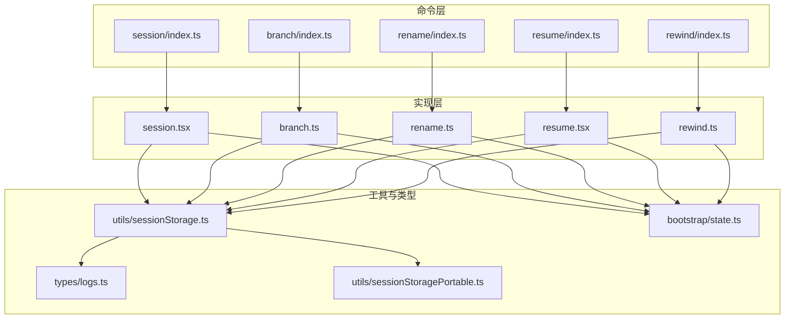
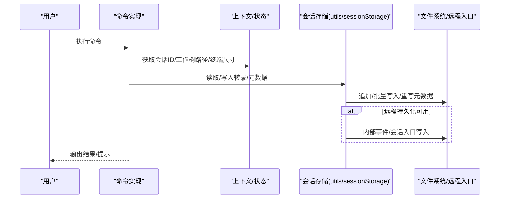
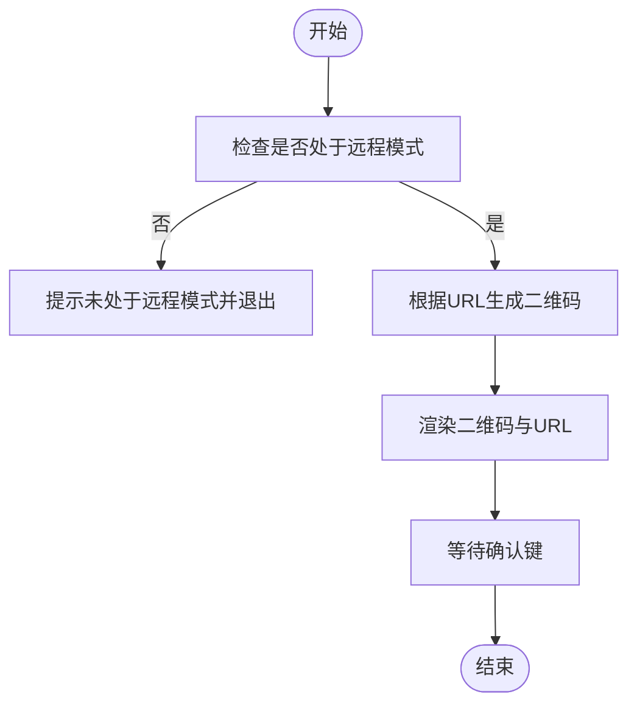
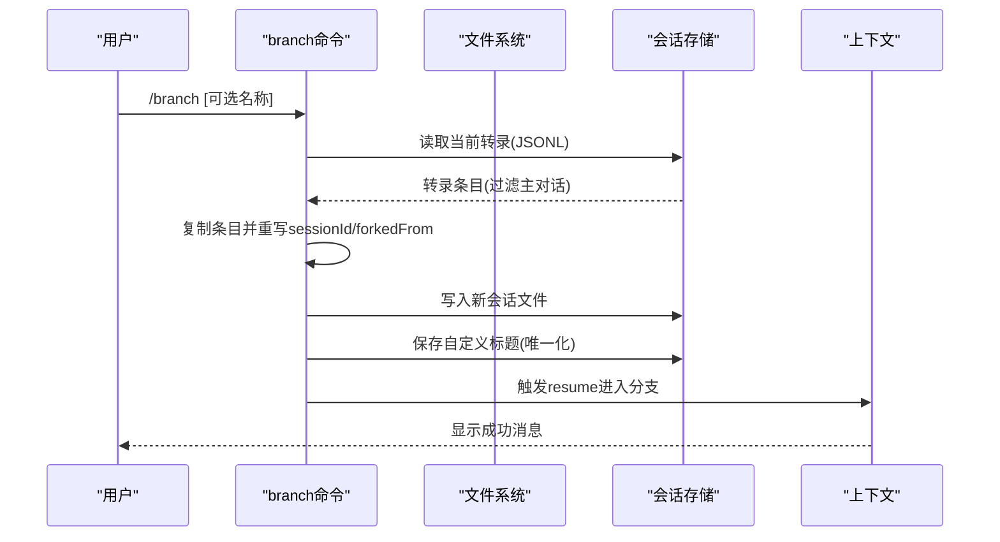
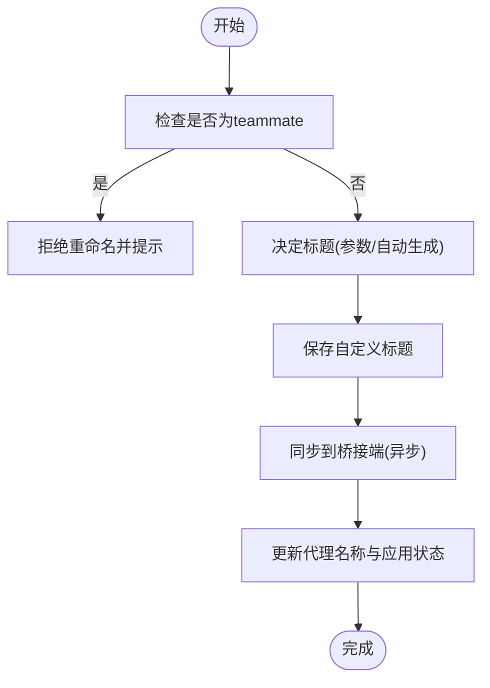
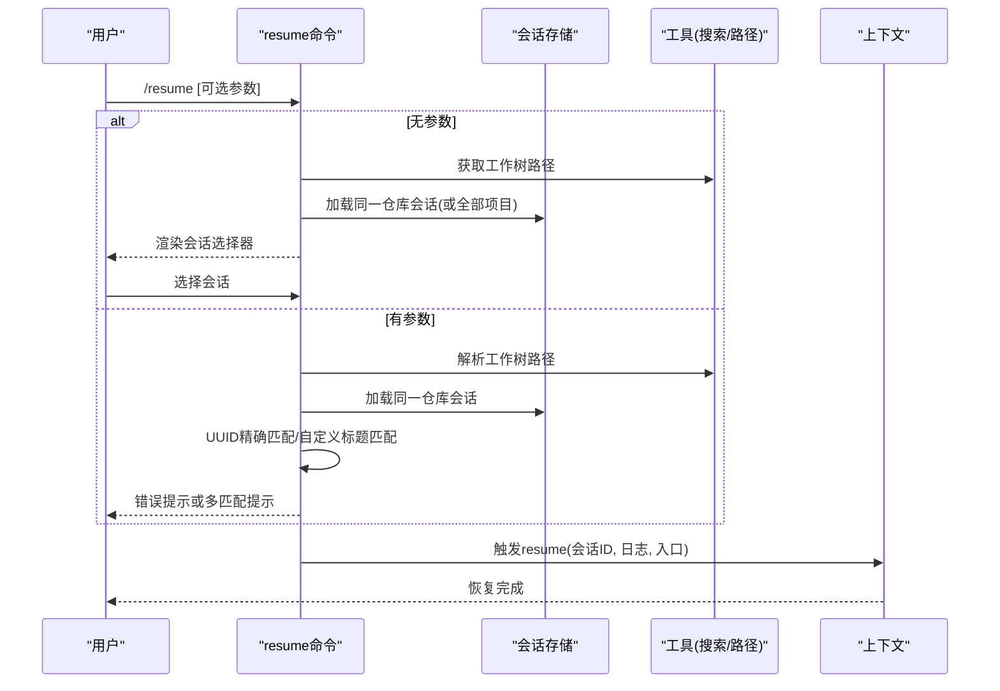
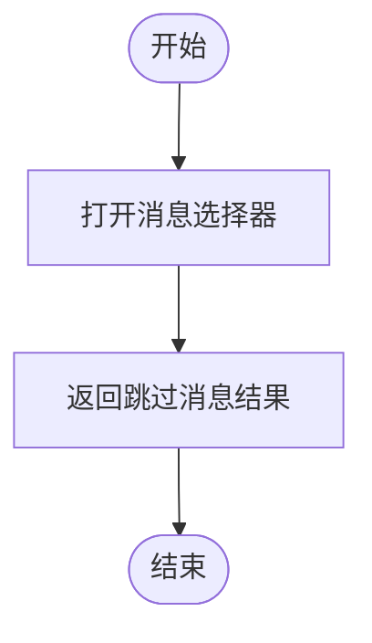
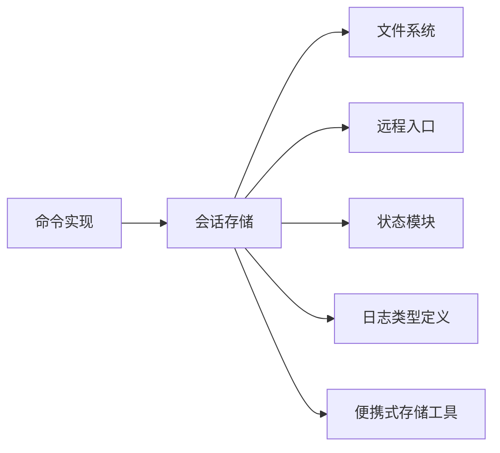

# 会话管理

<cite>
**本文引用的文件**
- [src/commands/session/index.ts](file://src/commands/session/index.ts)
- [src/commands/session/session.tsx](file://src/commands/session/session.tsx)
- [src/commands/branch/index.ts](file://src/commands/branch/index.ts)
- [src/commands/branch/branch.ts](file://src/commands/branch/branch.ts)
- [src/commands/rename/index.ts](file://src/commands/rename/index.ts)
- [src/commands/rename/rename.ts](file://src/commands/rename/rename.ts)
- [src/commands/resume/index.ts](file://src/commands/resume/index.ts)
- [src/commands/resume/resume.tsx](file://src/commands/resume/resume.tsx)
- [src/commands/rewind/index.ts](file://src/commands/rewind/index.ts)
- [src/commands/rewind/rewind.ts](file://src/commands/rewind/rewind.ts)
- [src/utils/sessionStorage.ts](file://src/utils/sessionStorage.ts)
- [src/bootstrap/state.ts](file://src/bootstrap/state.ts)
- [src/types/logs.ts](file://src/types/logs.ts)
- [src/utils/sessionStoragePortable.ts](file://src/utils/sessionStoragePortable.ts)
- [src/services/analytics/index.ts](file://src/services/analytics/index.ts)
- [src/utils/getWorktreePaths.ts](file://src/utils/getWorktreePaths.ts)
- [src/utils/crossProjectResume.ts](file://src/utils/crossProjectResume.ts)
- [src/utils/agenticSessionSearch.ts](file://src/utils/agenticSessionSearch.ts)
- [src/components/LogSelector.ts](file://src/components/LogSelector.ts)
- [src/components/MessageResponse.ts](file://src/components/MessageResponse.ts)
- [src/components/Spinner.ts](file://src/components/Spinner.ts)
- [src/hooks/useTerminalSize.ts](file://src/hooks/useTerminalSize.ts)
- [src/context/modalContext.ts](file://src/context/modalContext.ts)
- [src/ink/termio/osc.ts](file://src/ink/termio/osc.ts)
- [src/bridge/createSession.ts](file://src/bridge/createSession.ts)
- [src/bridge/bridgeConfig.ts](file://src/bridge/bridgeConfig.ts)
- [src/utils/teammate.ts](file://src/utils/teammate.ts)
- [src/utils/messages.ts](file://src/utils/messages.ts)
- [src/utils/uuid.ts](file://src/utils/uuid.ts)
- [src/utils/debug.ts](file://src/utils/debug.ts)
- [src/utils/log.ts](file://src/utils/log.ts)
- [src/commands.ts](file://src/commands.ts)
- [src/types/command.ts](file://src/types/command.ts)
- [src/bridge/bridgeMain.ts](file://src/bridge/bridgeMain.ts)
</cite>

## 目录
1. [简介](#简介)
2. [项目结构](#项目结构)
3. [核心组件](#核心组件)
4. [架构总览](#架构总览)
5. [详细组件分析](#详细组件分析)
6. [依赖关系分析](#依赖关系分析)
7. [性能考量](#性能考量)
8. [故障排除指南](#故障排除指南)
9. [结论](#结论)
10. [附录](#附录)

## 简介
本文件系统性梳理 Claude Code 的会话管理命令族，覆盖以下命令：
- 会话展示：session（远程模式下显示远程会话链接与二维码）
- 分支管理：branch（在当前对话点创建分支，支持自定义标题）
- 重命名：rename（重命名当前会话，支持自动生成标题并同步到桥接端）
- 恢复：resume（恢复之前的对话，支持按 ID、自定义标题或搜索）
- 回溯：rewind（打开消息选择器以回溯到历史节点）

文档将从命令入口、实现细节、数据持久化、并发与隔离、生命周期管理、性能优化与故障排除等方面进行深入说明，并提供可视化图示帮助理解。

## 项目结构
会话相关命令位于 src/commands 下的对应子目录中，每个命令由一个 index.ts 定义命令元信息，具体实现位于同名文件（如 branch.ts、resume.tsx 等）。会话数据持久化与读取主要通过 src/utils/sessionStorage.ts 提供的工具函数完成；状态切换与会话标识由 src/bootstrap/state.ts 管理；UI 层使用 Ink 组件与 hooks 进行交互。

图表来源
- [src/commands/session/index.ts:1-17](file://src/commands/session/index.ts#L1-L17)
- [src/commands/branch/index.ts:1-15](file://src/commands/branch/index.ts#L1-L15)
- [src/commands/rename/index.ts:1-13](file://src/commands/rename/index.ts#L1-L13)
- [src/commands/resume/index.ts:1-13](file://src/commands/resume/index.ts#L1-L13)
- [src/commands/rewind/index.ts:1-14](file://src/commands/rewind/index.ts#L1-L14)
- [src/commands/session/session.tsx:1-140](file://src/commands/session/session.tsx#L1-L140)
- [src/commands/branch/branch.ts:1-297](file://src/commands/branch/branch.ts#L1-L297)
- [src/commands/rename/rename.ts:1-88](file://src/commands/rename/rename.ts#L1-L88)
- [src/commands/resume/resume.tsx:1-275](file://src/commands/resume/resume.tsx#L1-L275)
- [src/commands/rewind/rewind.ts:1-14](file://src/commands/rewind/rewind.ts#L1-L14)
- [src/utils/sessionStorage.ts:1-800](file://src/utils/sessionStorage.ts#L1-L800)
- [src/bootstrap/state.ts:1-200](file://src/bootstrap/state.ts#L1-L200)
- [src/types/logs.ts:1-200](file://src/types/logs.ts#L1-L200)
- [src/utils/sessionStoragePortable.ts:1-200](file://src/utils/sessionStoragePortable.ts#L1-L200)

章节来源
- [src/commands/session/index.ts:1-17](file://src/commands/session/index.ts#L1-L17)
- [src/commands/branch/index.ts:1-15](file://src/commands/branch/index.ts#L1-L15)
- [src/commands/rename/index.ts:1-13](file://src/commands/rename/index.ts#L1-L13)
- [src/commands/resume/index.ts:1-13](file://src/commands/resume/index.ts#L1-L13)
- [src/commands/rewind/index.ts:1-14](file://src/commands/rewind/index.ts#L1-L14)

## 核心组件
- 会话展示（session）：仅在远程模式启用，用于显示远程会话 URL 并生成二维码，便于在浏览器中打开。
- 分支管理（branch）：基于当前会话的转录文件复制创建新会话，保留元数据并记录 forkedFrom 关联，支持自定义标题与唯一化命名。
- 重命名（rename）：为当前会话设置自定义标题，支持自动推导标题；同时尝试同步到桥接端（claude.ai/code），并更新本地代理名称。
- 恢复（resume）：列出可恢复的会话，支持按 ID、自定义标题或搜索；处理跨工程/工作树场景，必要时给出命令提示。
- 回溯（rewind）：打开消息选择器以回溯到历史节点，不追加额外消息。

章节来源
- [src/commands/session/session.tsx:1-140](file://src/commands/session/session.tsx#L1-L140)
- [src/commands/branch/branch.ts:1-297](file://src/commands/branch/branch.ts#L1-L297)
- [src/commands/rename/rename.ts:1-88](file://src/commands/rename/rename.ts#L1-L88)
- [src/commands/resume/resume.tsx:1-275](file://src/commands/resume/resume.tsx#L1-L275)
- [src/commands/rewind/rewind.ts:1-14](file://src/commands/rewind/rewind.ts#L1-L14)

## 架构总览
会话管理命令围绕“命令入口 -> 实现 -> 数据持久化/读取 -> 状态切换”的链路工作。命令通过上下文调用会话存储工具，后者负责：
- 写入/追加 JSONL 转录条目
- 缓冲与批量化写入
- 元数据（标题、标签、代理名、模式、PR 链接、工作树状态等）的尾部重写与读取
- 远程持久化（内部事件或会话入口 API）
- 会话文件路径解析与多会话并发写入去重

图表来源
- [src/commands/branch/branch.ts:61-173](file://src/commands/branch/branch.ts#L61-L173)
- [src/commands/rename/rename.ts:52-87](file://src/commands/rename/rename.ts#L52-L87)
- [src/commands/resume/resume.tsx:107-171](file://src/commands/resume/resume.tsx#L107-L171)
- [src/utils/sessionStorage.ts:1128-1265](file://src/utils/sessionStorage.ts#L1128-L1265)
- [src/utils/sessionStorage.ts:1302-1343](file://src/utils/sessionStorage.ts#L1302-L1343)

## 详细组件分析

### 命令：session（远程会话展示）
- 类型与可见性：本地 JSX 命令，仅在远程模式启用；当未处于远程模式时隐藏。
- 行为：获取远程会话 URL，生成二维码并在终端中渲染；支持键盘确认关闭。
- 参数与标志：无参数；非交互式。
- 使用场景：在远程模式下快速获取浏览器访问地址并扫码登录。
- 最佳实践：确保已通过 --remote 启动远程模式；网络稳定以保证二维码生成。

图表来源
- [src/commands/session/index.ts:1-17](file://src/commands/session/index.ts#L1-L17)
- [src/commands/session/session.tsx:14-124](file://src/commands/session/session.tsx#L14-L124)

章节来源
- [src/commands/session/index.ts:1-17](file://src/commands/session/index.ts#L1-L17)
- [src/commands/session/session.tsx:1-140](file://src/commands/session/session.tsx#L1-L140)

### 命令：branch（分支管理）
- 类型与可见性：本地 JSX 命令；支持别名（在特定特性开关下）。
- 行为：复制当前会话转录文件，构建分支会话，保留元数据与内容替换记录，写入新会话文件，生成唯一标题并保存，随后进入分支会话。
- 参数与标志：可选名称参数；立即执行。
- 使用场景：需要在当前对话点创建独立分支进行实验或并行探索。
- 最佳实践：分支会话会继承原始会话的内容替换记录，确保回溯一致性；若未提供标题，将从第一条用户消息派生标题并进行唯一化处理。

图表来源
- [src/commands/branch/index.ts:1-15](file://src/commands/branch/index.ts#L1-L15)
- [src/commands/branch/branch.ts:61-173](file://src/commands/branch/branch.ts#L61-L173)
- [src/commands/branch/branch.ts:179-220](file://src/commands/branch/branch.ts#L179-L220)
- [src/commands/branch/branch.ts:222-296](file://src/commands/branch/branch.ts#L222-L296)

章节来源
- [src/commands/branch/index.ts:1-15](file://src/commands/branch/index.ts#L1-L15)
- [src/commands/branch/branch.ts:1-297](file://src/commands/branch/branch.ts#L1-L297)

### 命令：rename（重命名）
- 类型与可见性：本地 JSX 命令；立即执行。
- 行为：为当前会话设置自定义标题；若未提供标题则自动生成；同步到桥接端（best-effort）；更新本地代理名称与应用状态。
- 参数与标志：可选名称参数；立即执行。
- 使用场景：改善会话可读性与检索体验；在团队协作中保持一致的会话命名。
- 最佳实践：避免空标题；若为团队成员（teammate）则不可重命名，需由团队领导统一设定。

图表来源
- [src/commands/rename/index.ts:1-13](file://src/commands/rename/index.ts#L1-L13)
- [src/commands/rename/rename.ts:21-87](file://src/commands/rename/rename.ts#L21-L87)
- [src/bridge/createSession.ts:1-200](file://src/bridge/createSession.ts#L1-L200)
- [src/bridge/bridgeConfig.ts:1-200](file://src/bridge/bridgeConfig.ts#L1-L200)

章节来源
- [src/commands/rename/index.ts:1-13](file://src/commands/rename/index.ts#L1-L13)
- [src/commands/rename/rename.ts:1-88](file://src/commands/rename/rename.ts#L1-L88)

### 命令：resume（会话恢复）
- 类型与可见性：本地 JSX 命令；支持别名 continue。
- 行为：加载同一仓库或所有项目的会话日志，过滤侧链与当前会话，支持按 ID、自定义标题精确匹配或模糊搜索；处理跨工程/工作树场景，必要时给出命令提示；最终触发上下文 resume。
- 参数与标志：可选参数（会话ID或搜索词）；非交互式支持有限。
- 使用场景：快速回到之前的对话；在不同工作树或项目间恢复会话。
- 最佳实践：优先使用 UUID 或明确的自定义标题；在跨工程场景下遵循提示命令进行恢复。

图表来源
- [src/commands/resume/index.ts:1-13](file://src/commands/resume/index.ts#L1-L13)
- [src/commands/resume/resume.tsx:194-274](file://src/commands/resume/resume.tsx#L194-L274)
- [src/commands/resume/resume.tsx:107-171](file://src/commands/resume/resume.tsx#L107-L171)
- [src/utils/getWorktreePaths.ts:1-200](file://src/utils/getWorktreePaths.ts#L1-L200)
- [src/utils/crossProjectResume.ts:1-200](file://src/utils/crossProjectResume.ts#L1-L200)
- [src/utils/agenticSessionSearch.ts:1-200](file://src/utils/agenticSessionSearch.ts#L1-L200)
- [src/components/LogSelector.ts:1-200](file://src/components/LogSelector.ts#L1-L200)
- [src/components/MessageResponse.ts:1-200](file://src/components/MessageResponse.ts#L1-L200)
- [src/components/Spinner.ts:1-200](file://src/components/Spinner.ts#L1-L200)
- [src/hooks/useTerminalSize.ts:1-200](file://src/hooks/useTerminalSize.ts#L1-L200)
- [src/context/modalContext.ts:1-200](file://src/context/modalContext.ts#L1-L200)

章节来源
- [src/commands/resume/index.ts:1-13](file://src/commands/resume/index.ts#L1-L13)
- [src/commands/resume/resume.tsx:1-275](file://src/commands/resume/resume.tsx#L1-L275)

### 命令：rewind（回溯）
- 类型与可见性：本地命令；非交互式。
- 行为：打开消息选择器以回溯到历史节点；返回跳过消息的结果，不追加任何消息。
- 参数与标志：无参数；非交互式。
- 使用场景：在当前会话中回退到某个历史时刻，重新开始后续交互。
- 最佳实践：谨慎使用，避免破坏后续消息链的完整性。

图表来源
- [src/commands/rewind/index.ts:1-14](file://src/commands/rewind/index.ts#L1-L14)
- [src/commands/rewind/rewind.ts:1-14](file://src/commands/rewind/rewind.ts#L1-L14)

章节来源
- [src/commands/rewind/index.ts:1-14](file://src/commands/rewind/index.ts#L1-L14)
- [src/commands/rewind/rewind.ts:1-14](file://src/commands/rewind/rewind.ts#L1-L14)

## 依赖关系分析
- 命令到实现：各命令 index.ts 仅声明元信息，实际逻辑在同名实现文件中。
- 实现到存储：分支、重命名、恢复、回溯均依赖会话存储工具进行读写与元数据维护。
- 存储到文件系统：采用 JSONL 追加写入，配合缓冲队列与批量化写入；对大文件采用尾部扫描与定位写入策略。
- 远程持久化：支持内部事件写入与会话入口 API 写入，失败时记录事件并优雅降级。
- 状态与路径：通过状态模块获取会话 ID、工作树路径、项目目录等，确保路径一致性与跨会话切换安全。

图表来源
- [src/commands/branch/branch.ts:1-297](file://src/commands/branch/branch.ts#L1-L297)
- [src/commands/rename/rename.ts:1-88](file://src/commands/rename/rename.ts#L1-L88)
- [src/commands/resume/resume.tsx:1-275](file://src/commands/resume/resume.tsx#L1-L275)
- [src/commands/rewind/rewind.ts:1-14](file://src/commands/rewind/rewind.ts#L1-L14)
- [src/utils/sessionStorage.ts:1128-1265](file://src/utils/sessionStorage.ts#L1128-L1265)
- [src/bootstrap/state.ts:1-200](file://src/bootstrap/state.ts#L1-L200)
- [src/types/logs.ts:1-200](file://src/types/logs.ts#L1-L200)
- [src/utils/sessionStoragePortable.ts:1-200](file://src/utils/sessionStoragePortable.ts#L1-L200)

章节来源
- [src/utils/sessionStorage.ts:1-800](file://src/utils/sessionStorage.ts#L1-L800)
- [src/utils/sessionStorage.ts:800-1599](file://src/utils/sessionStorage.ts#L800-L1599)

## 性能考量
- 写入批量化与缓冲：会话存储使用写入队列与定时器合并写入，限制单批次大小，减少磁盘写放大。
- 尾部扫描与定位写入：针对元数据与消息移除等场景，优先采用尾部窗口扫描与定位写入，避免全量重写。
- 大文件保护：对超大文件（超过阈值）的全量重写进行保护，避免内存与性能问题。
- 远程持久化：在 CCR v2 场景下采用内部事件写入，降低延迟；在 v1 场景下通过会话入口 API 写入，失败时触发优雅停机。
- 读取优化：会话列表加载时区分同一仓库与跨项目场景，减少不必要的文件扫描；自定义标题搜索采用精确匹配与模式匹配结合。

章节来源
- [src/utils/sessionStorage.ts:618-686](file://src/utils/sessionStorage.ts#L618-L686)
- [src/utils/sessionStorage.ts:871-951](file://src/utils/sessionStorage.ts#L871-L951)
- [src/utils/sessionStorage.ts:126-127](file://src/utils/sessionStorage.ts#L126-L127)
- [src/utils/sessionStorage.ts:1302-1343](file://src/utils/sessionStorage.ts#L1302-L1343)
- [src/commands/resume/resume.tsx:107-122](file://src/commands/resume/resume.tsx#L107-L122)

## 故障排除指南
- 无法分支：当前会话无转录或转录为空；检查是否已产生有效消息。
  - 参考：[src/commands/branch/branch.ts:77-87](file://src/commands/branch/branch.ts#L77-L87)
- 分支标题冲突：自动派生标题与现有标题冲突；系统会自动添加序号后缀。
  - 参考：[src/commands/branch/branch.ts:179-220](file://src/commands/branch/branch.ts#L179-L220)
- 重命名失败：teammate 不允许重命名；或生成标题失败。
  - 参考：[src/commands/rename/rename.ts:26-47](file://src/commands/rename/rename.ts#L26-L47)
- 恢复失败：未找到匹配会话或多个匹配；检查参数或使用更精确的搜索。
  - 参考：[src/commands/resume/resume.tsx:206-274](file://src/commands/resume/resume.tsx#L206-L274)
- 二维码生成失败：远程 URL 未就绪或生成异常；检查远程模式与网络。
  - 参考：[src/commands/session/session.tsx:125-133](file://src/commands/session/session.tsx#L125-L133)
- 远程持久化失败：内部事件写入或会话入口写入失败；记录事件并触发优雅停机。
  - 参考：[src/utils/sessionStorage.ts:1318-1343](file://src/utils/sessionStorage.ts#L1318-L1343)
- 跨工程恢复：检测到跨工程会话，给出命令提示并复制到剪贴板。
  - 参考：[src/commands/resume/resume.tsx:146-166](file://src/commands/resume/resume.tsx#L146-L166)

章节来源
- [src/commands/branch/branch.ts:77-87](file://src/commands/branch/branch.ts#L77-L87)
- [src/commands/branch/branch.ts:179-220](file://src/commands/branch/branch.ts#L179-L220)
- [src/commands/rename/rename.ts:26-47](file://src/commands/rename/rename.ts#L26-L47)
- [src/commands/resume/resume.tsx:206-274](file://src/commands/resume/resume.tsx#L206-L274)
- [src/commands/session/session.tsx:125-133](file://src/commands/session/session.tsx#L125-L133)
- [src/utils/sessionStorage.ts:1318-1343](file://src/utils/sessionStorage.ts#L1318-L1343)
- [src/commands/resume/resume.tsx:146-166](file://src/commands/resume/resume.tsx#L146-L166)

## 结论
会话管理命令族围绕“分支、重命名、恢复、回溯”四大能力构建，配合强大的会话存储与状态管理，实现了高可靠、高性能、可扩展的会话生命周期管理。通过 JSONL 持久化、元数据尾部重写、远程入口写入与缓冲批量化等技术手段，既保证了数据一致性，又兼顾了性能与可维护性。建议在团队协作与跨工程场景下，充分利用分支与自定义标题功能，并遵循最佳实践以获得更好的使用体验。

## 附录
- 会话状态管理要点
  - 会话标识：通过状态模块获取当前会话 ID，确保路径与文件解析一致。
  - 工作树路径：在不同工作树之间切换时，确保会话文件路径正确。
  - 会话文件：首次用户/助手消息到达时才创建文件，避免空文件。
- 数据持久化与并发
  - 写入队列与定时器：合并写入，限制单批次大小。
  - 去重与链路：基于消息 UUID 去重，维护 parentUuid 链路。
  - 远程持久化：内部事件写入优先，失败时记录事件并优雅降级。
- 会话生命周期管理
  - 创建：首次消息触发会话文件创建与元数据写入。
  - 暂停：通过退出清理流程重写元数据，确保恢复时可见。
  - 恢复：按 ID/标题/搜索恢复，处理跨工程与工作树场景。
  - 删除：通过文件系统直接删除会话文件；注意备份与权限。

章节来源
- [src/bootstrap/state.ts:1-200](file://src/bootstrap/state.ts#L1-L200)
- [src/utils/sessionStorage.ts:976-991](file://src/utils/sessionStorage.ts#L976-L991)
- [src/utils/sessionStorage.ts:1128-1265](file://src/utils/sessionStorage.ts#L1128-L1265)
- [src/utils/sessionStorage.ts:1302-1343](file://src/utils/sessionStorage.ts#L1302-L1343)
- [src/utils/sessionStorage.ts:1510-1534](file://src/utils/sessionStorage.ts#L1510-L1534)