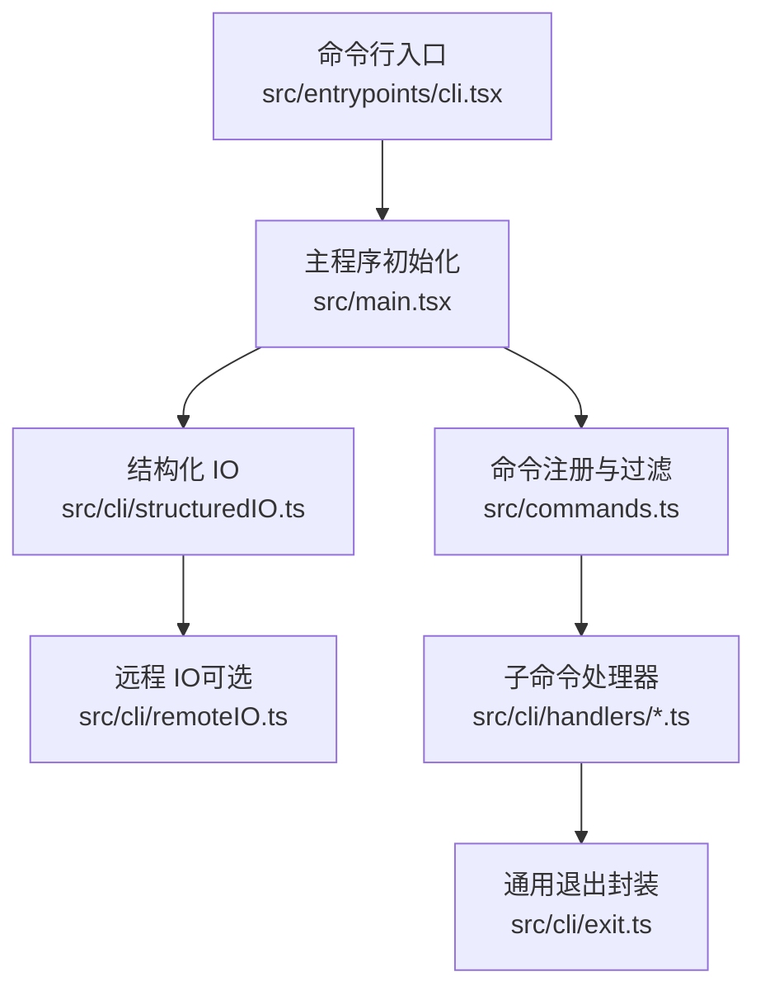
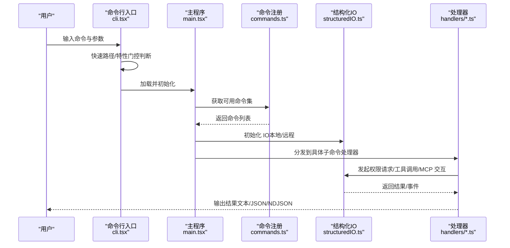
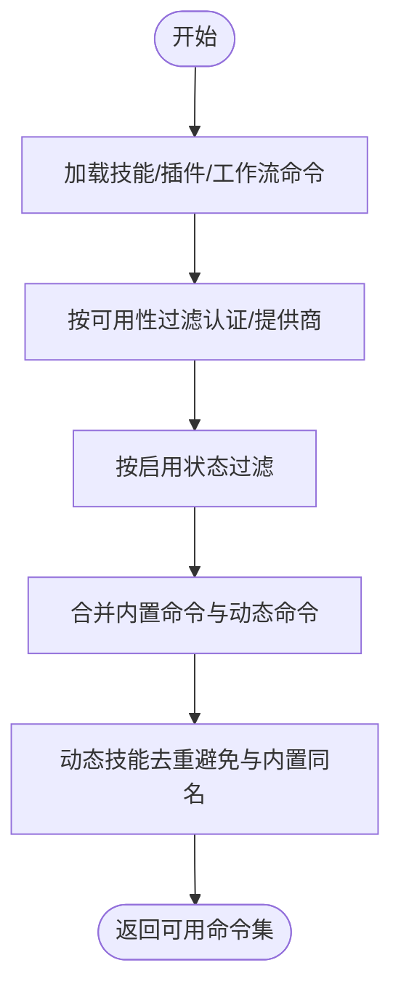
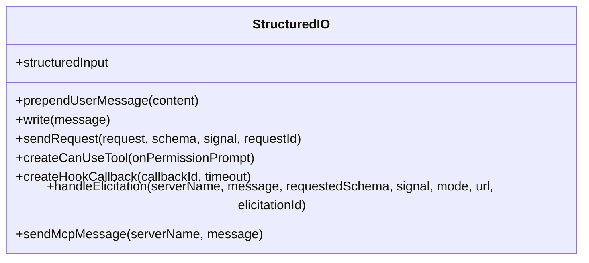
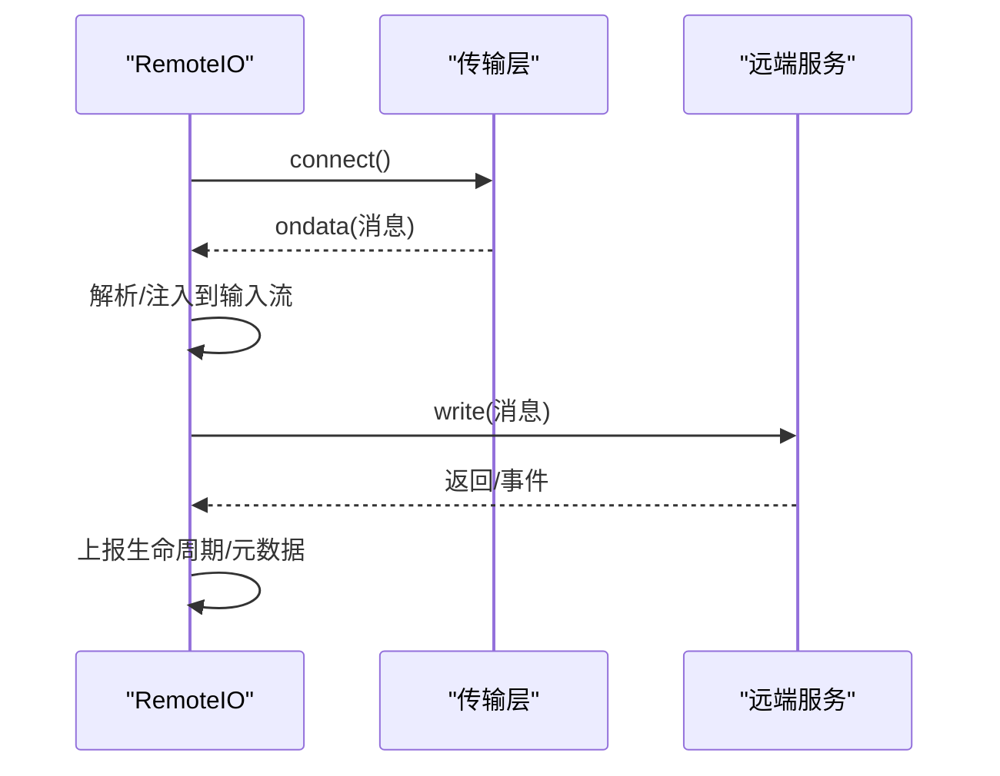
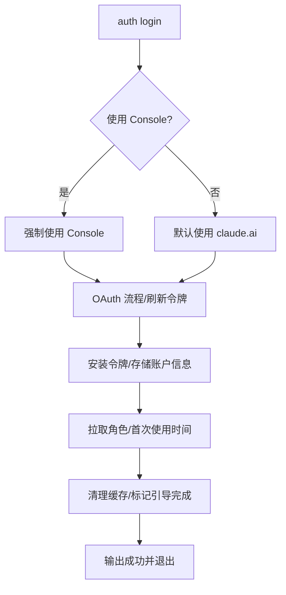
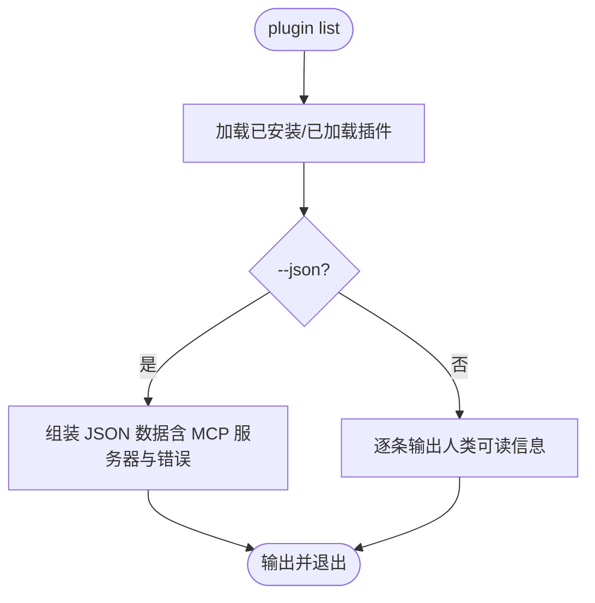
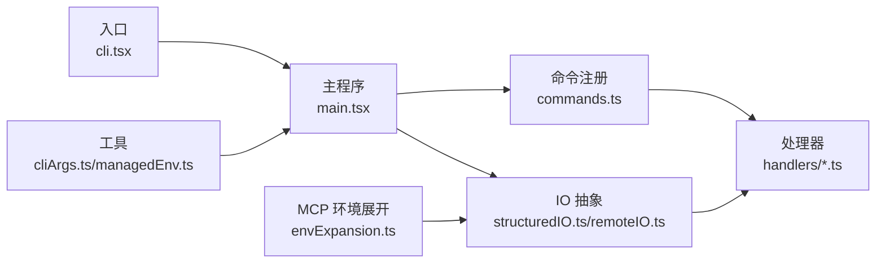

# 命令行 API

<cite>
**本文引用的文件**
- [src/entrypoints/cli.tsx](file://src/entrypoints/cli.tsx)
- [src/main.tsx](file://src/main.tsx)
- [src/commands.ts](file://src/commands.ts)
- [src/cli/structuredIO.ts](file://src/cli/structuredIO.ts)
- [src/cli/remoteIO.ts](file://src/cli/remoteIO.ts)
- [src/cli/exit.ts](file://src/cli/exit.ts)
- [src/cli/handlers/auth.ts](file://src/cli/handlers/auth.ts)
- [src/cli/handlers/plugins.ts](file://src/cli/handlers/plugins.ts)
- [src/cli/handlers/autoMode.ts](file://src/cli/handlers/autoMode.ts)
- [src/utils/cliArgs.ts](file://src/utils/cliArgs.ts)
- [src/utils/managedEnv.ts](file://src/utils/managedEnv.ts)
- [src/services/mcp/envExpansion.ts](file://src/services/mcp/envExpansion.ts)
</cite>

## 目录
1. [简介](#简介)
2. [项目结构](#项目结构)
3. [核心组件](#核心组件)
4. [架构总览](#架构总览)
5. [详细组件分析](#详细组件分析)
6. [依赖关系分析](#依赖关系分析)
7. [性能考量](#性能考量)
8. [故障排查指南](#故障排查指南)
9. [结论](#结论)
10. [附录](#附录)

## 简介
本文件系统化梳理 Claude Code 命令行 API 的全部能力与实现细节，覆盖以下方面：
- 全部可用 CLI 子命令（含基础命令、会话管理、配置设置、插件与市场、自动模式、远程控制、守护进程、模板作业等）
- 每个命令的参数、标志位、使用示例与返回值格式
- 参数解析机制、快捷方式与别名
- 命令执行流程、错误处理与调试选项
- 实际使用场景与最佳实践
- 环境变量配置、配置文件格式与优先级规则
- 高级功能：远程控制、守护进程、模板作业等

目标是帮助开发者快速理解并高效使用所有命令行接口。

## 项目结构
命令行入口与命令发现、分发、执行的关键路径如下：
- 入口层：负责快速路径与特性门控，按子命令分派到具体处理器
- 命令注册层：集中声明与过滤可用命令，支持动态技能与插件命令
- 执行层：结构化 IO（StructuredIO/RemoteIO）与权限决策、工具调用、会话状态管理
- 处理器层：各子命令的具体实现（认证、插件、自动模式等）

图示来源
- [src/entrypoints/cli.tsx:33-299](file://src/entrypoints/cli.tsx#L33-L299)
- [src/main.tsx:88-120](file://src/main.tsx#L88-L120)
- [src/commands.ts:258-346](file://src/commands.ts#L258-L346)
- [src/cli/structuredIO.ts:135-170](file://src/cli/structuredIO.ts#L135-L170)
- [src/cli/remoteIO.ts:35-50](file://src/cli/remoteIO.ts#L35-L50)

章节来源
- [src/entrypoints/cli.tsx:33-299](file://src/entrypoints/cli.tsx#L33-L299)
- [src/main.tsx:88-120](file://src/main.tsx#L88-L120)
- [src/commands.ts:258-346](file://src/commands.ts#L258-L346)

## 核心组件
- 命令注册与过滤
  - 统一导出 Command 类型与工具函数，内置命令集合通过条件导入与特性门控组合生成
  - 支持动态技能、插件技能、工作流命令的合并与去重
- 结构化 IO（StructuredIO）
  - 负责从标准输入读取 SDK 控制消息，向标准输出写出结构化消息
  - 提供 can_use_tool 权限请求、Hook 回调、MCP 消息转发等能力
- 远程 IO（RemoteIO）
  - 在远程模式下通过传输层（SSE/WebSocket）双向流式通信，支持 CCR v2 生命周期上报与事件写入
- 子命令处理器
  - 认证（登录/登出/状态）、插件（安装/卸载/启用/禁用/列表/校验/市场增删改查）、自动模式（默认规则/配置/评审）

章节来源
- [src/commands.ts:476-517](file://src/commands.ts#L476-L517)
- [src/cli/structuredIO.ts:135-170](file://src/cli/structuredIO.ts#L135-L170)
- [src/cli/remoteIO.ts:35-50](file://src/cli/remoteIO.ts#L35-L50)
- [src/cli/handlers/auth.ts:112-230](file://src/cli/handlers/auth.ts#L112-L230)
- [src/cli/handlers/plugins.ts:101-154](file://src/cli/handlers/plugins.ts#L101-L154)
- [src/cli/handlers/autoMode.ts:24-47](file://src/cli/handlers/autoMode.ts#L24-L47)

## 架构总览
命令行执行链路（以“claude”为主命令）：
- 解析阶段：入口根据特性门控与快速路径决定是否直接进入特定子命令或加载完整 CLI
- 初始化阶段：主程序完成配置、策略、权限、MCP、插件、技能等资源准备
- 命令分发：根据命令名称与别名查找命令定义，执行前可用性与启用检查
- 执行阶段：StructuredIO/RemoteIO 作为统一 IO 层，处理权限请求、钩子回调、MCP 交互
- 输出阶段：按输出格式（文本/JSON/NDJSON）打印结果；错误通过 exit 封装统一处理

图示来源
- [src/entrypoints/cli.tsx:33-299](file://src/entrypoints/cli.tsx#L33-L299)
- [src/main.tsx:88-120](file://src/main.tsx#L88-L120)
- [src/commands.ts:476-517](file://src/commands.ts#L476-L517)
- [src/cli/structuredIO.ts:465-531](file://src/cli/structuredIO.ts#L465-L531)

## 详细组件分析

### 命令注册与发现（commands.ts）
- 内置命令集合通过条件导入与特性门控组合生成，支持动态技能与插件命令注入
- 可用性过滤：按认证/提供商要求过滤命令
- 动态技能去重：在不与内置命令冲突的前提下插入动态技能
- 安全命令集合：REMOTE_SAFE_COMMANDS/BRIDGE_SAFE_COMMANDS 用于远程模式与桥接模式的安全限制

图示来源
- [src/commands.ts:449-469](file://src/commands.ts#L449-L469)
- [src/commands.ts:476-517](file://src/commands.ts#L476-L517)

章节来源
- [src/commands.ts:417-443](file://src/commands.ts#L417-L443)
- [src/commands.ts:449-469](file://src/commands.ts#L449-L469)
- [src/commands.ts:476-517](file://src/commands.ts#L476-L517)
- [src/commands.ts:619-637](file://src/commands.ts#L619-L637)
- [src/commands.ts:651-676](file://src/commands.ts#L651-L676)

### 结构化 IO（structuredIO.ts）
- 作用：统一读取/写出 SDK 控制消息，屏蔽底层协议细节
- 能力：
  - 读取 stdin 流，解析为结构化消息，过滤 keep_alive
  - 发送 control_request 并等待 control_response，支持超时与取消
  - 权限请求（can_use_tool）：与钩子并发竞速，先到先决
  - Hook 回调：通过 hook_callback subtype 与宿主交互
  - MCP 消息转发：通过 mcp_message subtype
- 关键数据结构：StdinMessage/StdoutMessage、SDKControlRequest/Response

图示来源
- [src/cli/structuredIO.ts:135-170](file://src/cli/structuredIO.ts#L135-L170)
- [src/cli/structuredIO.ts:465-531](file://src/cli/structuredIO.ts#L465-L531)
- [src/cli/structuredIO.ts:533-659](file://src/cli/structuredIO.ts#L533-L659)
- [src/cli/structuredIO.ts:694-721](file://src/cli/structuredIO.ts#L694-L721)
- [src/cli/structuredIO.ts:758-773](file://src/cli/structuredIO.ts#L758-L773)

章节来源
- [src/cli/structuredIO.ts:135-170](file://src/cli/structuredIO.ts#L135-L170)
- [src/cli/structuredIO.ts:465-531](file://src/cli/structuredIO.ts#L465-L531)
- [src/cli/structuredIO.ts:533-659](file://src/cli/structuredIO.ts#L533-L659)
- [src/cli/structuredIO.ts:694-721](file://src/cli/structuredIO.ts#L694-L721)
- [src/cli/structuredIO.ts:758-773](file://src/cli/structuredIO.ts#L758-L773)

### 远程 IO（remoteIO.ts）
- 作用：在远程模式下通过传输层（SSE/WebSocket）与远端建立双向流，支持 CCR v2 生命周期上报
- 特性：
  - 自动刷新会话令牌头信息
  - 桥接模式下将 control_request 等消息回显到 stdout 便于桥接父进程感知
  - keep_alive 心跳维持空闲会话

图示来源
- [src/cli/remoteIO.ts:35-50](file://src/cli/remoteIO.ts#L35-L50)
- [src/cli/remoteIO.ts:87-93](file://src/cli/remoteIO.ts#L87-L93)
- [src/cli/remoteIO.ts:111-138](file://src/cli/remoteIO.ts#L111-L138)
- [src/cli/remoteIO.ts:231-242](file://src/cli/remoteIO.ts#L231-L242)

章节来源
- [src/cli/remoteIO.ts:35-50](file://src/cli/remoteIO.ts#L35-L50)
- [src/cli/remoteIO.ts:87-93](file://src/cli/remoteIO.ts#L87-L93)
- [src/cli/remoteIO.ts:111-138](file://src/cli/remoteIO.ts#L111-L138)
- [src/cli/remoteIO.ts:231-242](file://src/cli/remoteIO.ts#L231-L242)

### 认证命令（auth）
- 登录（login）
  - 支持 claude.ai 与 Console 两种登录方式选择
  - 支持环境变量刷新令牌直连换取
  - 登录成功后安装令牌、拉取角色与首次使用时间、清理缓存
- 状态（status）
  - 支持文本与 JSON 输出，显示登录状态、认证方式、API 提供方、订阅类型等
- 登出（logout）
  - 清理认证相关缓存并提示成功

图示来源
- [src/cli/handlers/auth.ts:112-230](file://src/cli/handlers/auth.ts#L112-L230)
- [src/cli/handlers/auth.ts:232-319](file://src/cli/handlers/auth.ts#L232-L319)
- [src/cli/handlers/auth.ts:321-330](file://src/cli/handlers/auth.ts#L321-L330)

章节来源
- [src/cli/handlers/auth.ts:112-230](file://src/cli/handlers/auth.ts#L112-L230)
- [src/cli/handlers/auth.ts:232-319](file://src/cli/handlers/auth.ts#L232-L319)
- [src/cli/handlers/auth.ts:321-330](file://src/cli/handlers/auth.ts#L321-L330)

### 插件与市场命令（plugins）
- 验证（plugin validate）
  - 校验插件清单与内容文件，输出错误/警告
- 列表（plugin list）
  - 支持 JSON 与人类可读两种输出；区分已安装与会话内联插件
- 市场（marketplace）
  - 添加/列出/移除/更新市场源，支持稀疏路径与作用域
- 安装/卸载/启用/禁用/更新（plugin install/uninstall/enable/disable/update）
  - 支持作用域（user/project/local），并进行有效性校验

图示来源
- [src/cli/handlers/plugins.ts:157-444](file://src/cli/handlers/plugins.ts#L157-L444)
- [src/cli/handlers/plugins.ts:447-524](file://src/cli/handlers/plugins.ts#L447-L524)
- [src/cli/handlers/plugins.ts:527-592](file://src/cli/handlers/plugins.ts#L527-L592)
- [src/cli/handlers/plugins.ts:595-665](file://src/cli/handlers/plugins.ts#L595-L665)
- [src/cli/handlers/plugins.ts:668-737](file://src/cli/handlers/plugins.ts#L668-L737)

章节来源
- [src/cli/handlers/plugins.ts:101-154](file://src/cli/handlers/plugins.ts#L101-L154)
- [src/cli/handlers/plugins.ts:157-444](file://src/cli/handlers/plugins.ts#L157-L444)
- [src/cli/handlers/plugins.ts:447-524](file://src/cli/handlers/plugins.ts#L447-L524)
- [src/cli/handlers/plugins.ts:527-592](file://src/cli/handlers/plugins.ts#L527-L592)
- [src/cli/handlers/plugins.ts:595-665](file://src/cli/handlers/plugins.ts#L595-L665)
- [src/cli/handlers/plugins.ts:668-737](file://src/cli/handlers/plugins.ts#L668-L737)

### 自动模式命令（auto-mode）
- 默认规则（defaults）
  - 输出外部默认自动模式规则
- 配置（config）
  - 输出生效的自动模式配置（用户设置优先，其余采用外部默认）
- 评审（critique）
  - 基于用户自定义规则与默认规则构建系统提示词，调用侧查询生成评审意见

章节来源
- [src/cli/handlers/autoMode.ts:24-47](file://src/cli/handlers/autoMode.ts#L24-L47)
- [src/cli/handlers/autoMode.ts:73-149](file://src/cli/handlers/autoMode.ts#L73-L149)

### 通用退出封装（exit）
- 提供 cliError/cliOk 两个出口封装，分别向 stderr/stdout 写入并以相应退出码退出
- 便于测试中对 process.exit/console.* 进行桩

章节来源
- [src/cli/exit.ts:18-31](file://src/cli/exit.ts#L18-L31)

## 依赖关系分析
- 入口与主程序
  - 入口层根据特性门控与快速路径决定是否直接进入特定子命令（如远程控制、守护进程、模板作业等）
  - 主程序负责初始化配置、策略、MCP、插件、技能等，并加载命令集
- 命令与处理器
  - 命令注册层集中声明命令，处理器层按需动态导入
  - 结构化 IO/远程 IO 作为跨模块共享的 IO 抽象
- 环境变量与配置
  - 管理环境变量应用顺序与安全范围，支持 MCP 配置中的环境变量展开

图示来源
- [src/entrypoints/cli.tsx:33-299](file://src/entrypoints/cli.tsx#L33-L299)
- [src/main.tsx:88-120](file://src/main.tsx#L88-L120)
- [src/commands.ts:258-346](file://src/commands.ts#L258-L346)
- [src/cli/structuredIO.ts:135-170](file://src/cli/structuredIO.ts#L135-L170)
- [src/cli/remoteIO.ts:35-50](file://src/cli/remoteIO.ts#L35-L50)
- [src/utils/cliArgs.ts:13-29](file://src/utils/cliArgs.ts#L13-L29)
- [src/utils/managedEnv.ts:124-178](file://src/utils/managedEnv.ts#L124-L178)
- [src/services/mcp/envExpansion.ts:10-38](file://src/services/mcp/envExpansion.ts#L10-L38)

章节来源
- [src/entrypoints/cli.tsx:33-299](file://src/entrypoints/cli.tsx#L33-L299)
- [src/main.tsx:88-120](file://src/main.tsx#L88-L120)
- [src/commands.ts:258-346](file://src/commands.ts#L258-L346)
- [src/utils/cliArgs.ts:13-29](file://src/utils/cliArgs.ts#L13-L29)
- [src/utils/managedEnv.ts:124-178](file://src/utils/managedEnv.ts#L124-L178)
- [src/services/mcp/envExpansion.ts:10-38](file://src/services/mcp/envExpansion.ts#L10-L38)

## 性能考量
- 启动性能
  - 入口层对 --version/--dump-system-prompt 等常见快速路径零模块加载
  - 主程序早期启动剖析与并行预取（如 MDM、Keychain）减少冷启动时间
- 命令加载
  - 命令集与技能/插件加载采用记忆化，避免重复磁盘 I/O 与动态导入
- IO 性能
  - StructuredIO 使用流队列与去重工具 use ID 机制，防止重复消息导致 API 错误
  - RemoteIO 在桥接模式下仅在需要时回显消息，降低冗余输出

章节来源
- [src/entrypoints/cli.tsx:37-71](file://src/entrypoints/cli.tsx#L37-L71)
- [src/main.tsx:11-21](file://src/main.tsx#L11-L21)
- [src/commands.ts:449-469](file://src/commands.ts#L449-L469)
- [src/cli/structuredIO.ts:135-170](file://src/cli/structuredIO.ts#L135-L170)
- [src/cli/remoteIO.ts:231-242](file://src/cli/remoteIO.ts#L231-L242)

## 故障排查指南
- 通用错误处理
  - 子命令处理器统一使用 cliError/cliOk 输出并退出，便于定位失败原因
- 权限与钩子
  - StructuredIO 中权限请求与钩子并发竞速，若出现权限弹窗未响应，检查钩子回调与 SDK 主机交互
- 远程模式
  - RemoteIO 在桥接模式下会将控制请求回显到 stdout，若无响应，检查网络与心跳配置
- 环境变量
  - applySafeConfigEnvironmentVariables 与 applyConfigEnvironmentVariables 区分可信与非可信来源，确保仅应用安全变量

章节来源
- [src/cli/exit.ts:18-31](file://src/cli/exit.ts#L18-L31)
- [src/cli/structuredIO.ts:575-659](file://src/cli/structuredIO.ts#L575-L659)
- [src/cli/remoteIO.ts:96-103](file://src/cli/remoteIO.ts#L96-L103)
- [src/utils/managedEnv.ts:124-178](file://src/utils/managedEnv.ts#L124-L178)

## 结论
本文件系统化梳理了 Claude Code 命令行 API 的命令体系、参数与标志位、执行流程、错误处理与调试选项，并给出了环境变量与配置的优先级规则。通过命令注册与过滤、结构化 IO 与远程 IO 的抽象，以及处理器层的模块化设计，CLI 能够在本地与远程模式下稳定地提供一致的用户体验。建议在生产环境中结合自动模式规则与插件生态，提升自动化与可扩展性。

## 附录

### 常用命令与参数速览（示例）
- 认证
  - claude auth login [--console | --claudeai] [--email EMAIL]
  - claude auth status [--json | --text]
  - claude auth logout
- 插件
  - claude plugin validate <manifest-path> [--cowork]
  - claude plugin list [--json | --available | --cowork]
  - claude plugin marketplace add <source> [--scope user|project|local] [--sparse PATH...]
  - claude plugin marketplace list [--json | --cowork]
  - claude plugin marketplace remove <name> [--cowork]
  - claude plugin marketplace update [<name>] [--cowork]
  - claude plugin install <plugin> [--scope user|project|local] [--cowork]
  - claude plugin uninstall <plugin> [--scope user|project|local] [--cowork] [--keep-data]
  - claude plugin enable <plugin> [--scope user|project|local] [--cowork]
  - claude plugin disable <plugin|all> [--scope user|project|local] [--cowork] [--all]
  - claude plugin update <plugin> [--scope user|project|local] [--cowork]
- 自动模式
  - claude auto-mode defaults
  - claude auto-mode config
  - claude auto-mode critique [--model MODEL]
- 远程控制/守护进程/模板作业（入口快速路径）
  - claude remote-control/rc/remote/sync/bridge ...
  - claude daemon ...
  - claude new/list/reply ...

章节来源
- [src/cli/handlers/auth.ts:112-230](file://src/cli/handlers/auth.ts#L112-L230)
- [src/cli/handlers/auth.ts:232-319](file://src/cli/handlers/auth.ts#L232-L319)
- [src/cli/handlers/auth.ts:321-330](file://src/cli/handlers/auth.ts#L321-L330)
- [src/cli/handlers/plugins.ts:101-154](file://src/cli/handlers/plugins.ts#L101-L154)
- [src/cli/handlers/plugins.ts:157-444](file://src/cli/handlers/plugins.ts#L157-L444)
- [src/cli/handlers/plugins.ts:447-524](file://src/cli/handlers/plugins.ts#L447-L524)
- [src/cli/handlers/plugins.ts:527-592](file://src/cli/handlers/plugins.ts#L527-L592)
- [src/cli/handlers/plugins.ts:595-665](file://src/cli/handlers/plugins.ts#L595-L665)
- [src/cli/handlers/plugins.ts:668-737](file://src/cli/handlers/plugins.ts#L668-L737)
- [src/cli/handlers/autoMode.ts:24-47](file://src/cli/handlers/autoMode.ts#L24-L47)
- [src/cli/handlers/autoMode.ts:73-149](file://src/cli/handlers/autoMode.ts#L73-L149)
- [src/entrypoints/cli.tsx:108-162](file://src/entrypoints/cli.tsx#L108-L162)
- [src/entrypoints/cli.tsx:164-180](file://src/entrypoints/cli.tsx#L164-L180)
- [src/entrypoints/cli.tsx:211-222](file://src/entrypoints/cli.tsx#L211-L222)

### 参数解析与快捷方式
- 延迟解析
  - 对必须在初始化前解析的标志（如 --settings），使用 eagerParseCliFlag 支持 --flag=value 与 --flag value 两种语法
- 快捷方式与别名
  - 命令注册层支持别名与名称映射，查找命令时同时匹配名称与别名

章节来源
- [src/utils/cliArgs.ts:13-29](file://src/utils/cliArgs.ts#L13-L29)
- [src/commands.ts:688-719](file://src/commands.ts#L688-L719)

### 环境变量与配置优先级
- 管理环境变量应用
  - applySafeConfigEnvironmentVariables：在信任建立前应用可信来源（全局/策略/CLI 标志）的环境变量
  - applyConfigEnvironmentVariables：在信任建立后应用全部环境变量（可能包含危险项），并重新配置代理与 mTLS
- MCP 环境变量展开
  - 支持 ${VAR} 与 ${VAR:-default} 语法，缺失变量记录以便诊断

章节来源
- [src/utils/managedEnv.ts:124-178](file://src/utils/managedEnv.ts#L124-L178)
- [src/utils/managedEnv.ts:187-199](file://src/utils/managedEnv.ts#L187-L199)
- [src/services/mcp/envExpansion.ts:10-38](file://src/services/mcp/envExpansion.ts#L10-L38)