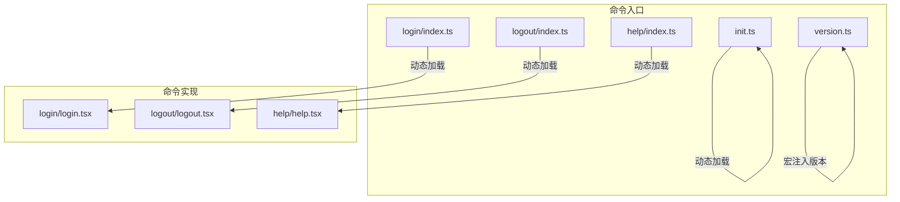
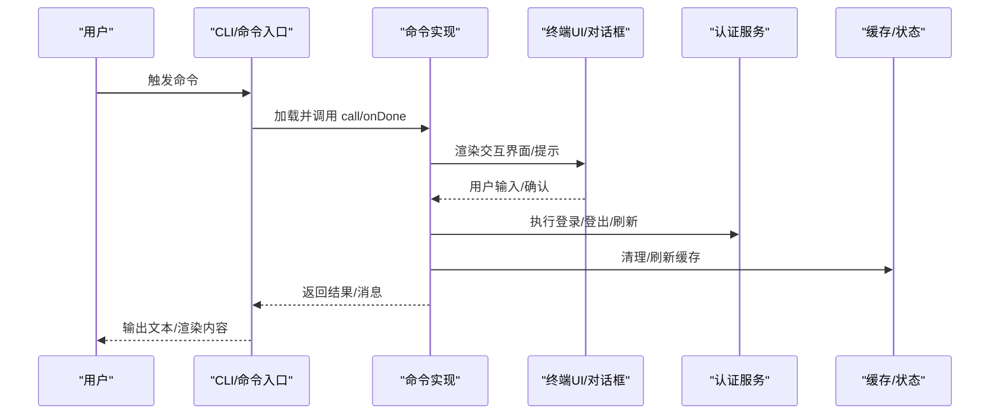
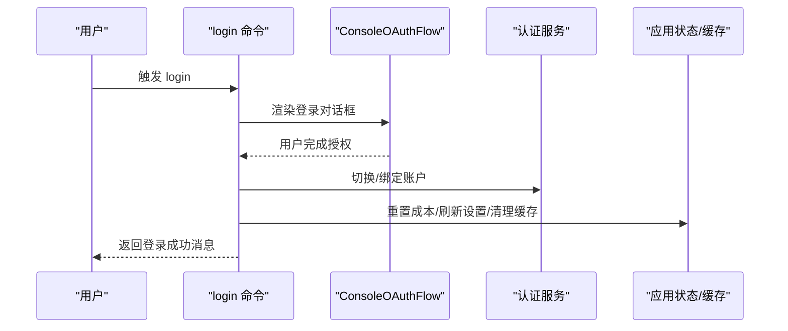
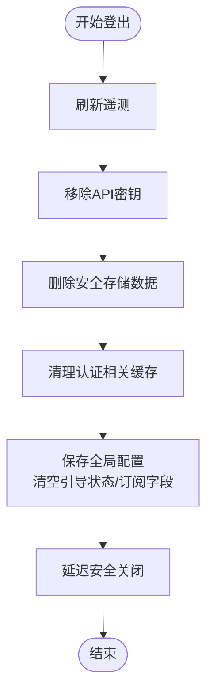
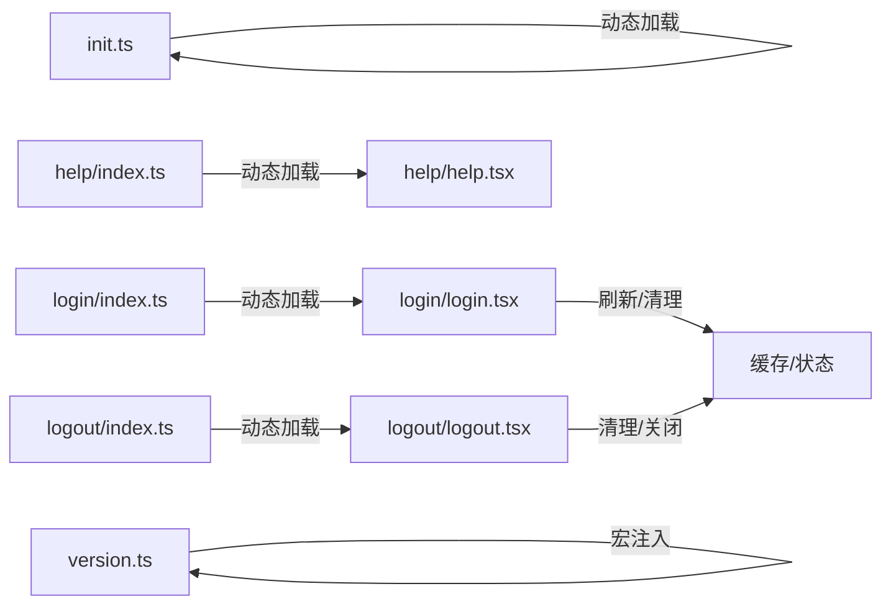

# 基础命令

<cite>
**本文引用的文件**
- [src/commands/init.ts](file://src/commands/init.ts)
- [src/commands/login/index.ts](file://src/commands/login/index.ts)
- [src/commands/login/login.tsx](file://src/commands/login/login.tsx)
- [src/commands/logout/index.ts](file://src/commands/logout/index.ts)
- [src/commands/logout/logout.tsx](file://src/commands/logout/logout.tsx)
- [src/commands/help/index.ts](file://src/commands/help/index.ts)
- [src/commands/help/help.tsx](file://src/commands/help/help.tsx)
- [src/commands/version.ts](file://src/commands/version.ts)
</cite>

## 目录
1. [简介](#简介)
2. [项目结构](#项目结构)
3. [核心组件](#核心组件)
4. [架构总览](#架构总览)
5. [详细组件分析](#详细组件分析)
6. [依赖分析](#依赖分析)
7. [性能考虑](#性能考虑)
8. [故障排除指南](#故障排除指南)
9. [结论](#结论)

## 简介
本章节面向首次接触 Claude Code CLI 的用户，系统性介绍四个最基础的命令：初始化与引导、用户认证（登录/登出）、帮助系统以及版本查询。文档覆盖命令语法、参数与标志位、执行流程、错误处理与返回值、权限与环境依赖、配置需求、典型使用场景与最佳实践，并提供常见问题排查建议。

## 项目结构
基础命令均位于 src/commands 下，采用“命令入口 + 动态加载实现”的分层设计：
- 入口文件负责声明命令元信息（名称、类型、描述、启用条件、动态加载器等）
- 实际逻辑在独立的实现文件中按需加载，以减少启动时的包体与冷启动时间
- 版本命令通过宏注入版本号与构建时间信息，无需运行时网络请求

**图示来源**
- [src/commands/init.ts:226-257](file://src/commands/init.ts#L226-L257)
- [src/commands/login/index.ts:5-14](file://src/commands/login/index.ts#L5-L14)
- [src/commands/login/login.tsx:19-59](file://src/commands/login/login.tsx#L19-L59)
- [src/commands/logout/index.ts:4-10](file://src/commands/logout/index.ts#L4-L10)
- [src/commands/logout/logout.tsx:72-81](file://src/commands/logout/logout.tsx#L72-L81)
- [src/commands/help/index.ts:3-8](file://src/commands/help/index.ts#L3-L8)
- [src/commands/help/help.tsx:4-10](file://src/commands/help/help.tsx#L4-L10)
- [src/commands/version.ts:3-10](file://src/commands/version.ts#L3-L10)

**章节来源**
- [src/commands/init.ts:226-257](file://src/commands/init.ts#L226-L257)
- [src/commands/login/index.ts:5-14](file://src/commands/login/index.ts#L5-L14)
- [src/commands/logout/index.ts:4-10](file://src/commands/logout/index.ts#L4-L10)
- [src/commands/help/index.ts:3-8](file://src/commands/help/index.ts#L3-L8)
- [src/commands/version.ts:3-10](file://src/commands/version.ts#L3-L10)

## 核心组件
- init：用于生成或更新项目级 CLAUDE.md 与可选技能/钩子，支持新旧两种引导流程
- login：本地 JSX 命令，触发控制台 OAuth 登录流程，切换或绑定 Anthropic 账户
- logout：本地 JSX 命令，清理凭据与缓存，安全退出当前账户
- help：本地 JSX 命令，展示可用命令列表与帮助界面
- version：本地命令，打印当前会话运行的版本号（含构建时间）

**章节来源**
- [src/commands/init.ts:226-257](file://src/commands/init.ts#L226-L257)
- [src/commands/login/index.ts:5-14](file://src/commands/login/index.ts#L5-L14)
- [src/commands/logout/index.ts:4-10](file://src/commands/logout/index.ts#L4-L10)
- [src/commands/help/index.ts:3-8](file://src/commands/help/index.ts#L3-L8)
- [src/commands/version.ts:12-20](file://src/commands/version.ts#L12-L20)

## 架构总览
下图展示了基础命令的调用链与关键副作用：

**图示来源**
- [src/commands/login/login.tsx:19-59](file://src/commands/login/login.tsx#L19-L59)
- [src/commands/logout/logout.tsx:16-48](file://src/commands/logout/logout.tsx#L16-L48)
- [src/commands/help/help.tsx:4-10](file://src/commands/help/help.tsx#L4-L10)
- [src/commands/version.ts:3-10](file://src/commands/version.ts#L3-L10)

## 详细组件分析

### init 初始化命令
- 命令类型：prompt
- 描述：根据特性开关与环境变量决定是否启用新版引导；描述会随特性与用户类型变化
- 关键行为：
  - 运行前标记项目引导完成状态
  - 根据特性与环境变量选择新旧引导提示词
  - 返回动态提示内容，供后续会话继续引导
- 参数与标志位：无命令行参数；通过特性开关与环境变量控制行为
- 执行流程：
  - 标记引导完成
  - 选择提示词模板
  - 返回提示内容
- 错误处理：作为提示类命令，不直接抛出错误；若环境不满足特性开关，将回退到旧版提示词
- 返回值：提示内容对象（供会话继续）
- 权限与环境依赖：
  - 受特性开关与环境变量控制
  - 需要可写入项目根目录以生成/更新 CLAUDE.md 与相关文件
- 最佳实践：
  - 在团队共享仓库中优先使用新版引导，以便生成技能与钩子
  - 个人偏好可单独生成本地说明文件
- 使用示例：
  - 在项目根目录运行，按提示逐步生成 CLAUDE.md、技能与钩子

**章节来源**
- [src/commands/init.ts:226-257](file://src/commands/init.ts#L226-L257)

### login 登录命令
- 命令类型：local-jsx
- 描述：登录或切换 Anthropic 账户；受禁用开关控制
- 关键行为：
  - 渲染控制台 OAuth 登录对话框
  - 成功后重置成本状态、刷新远程设置与策略限制、清理可信设备令牌、重新注册可信设备、重置权限开关检查、递增认证版本号等
  - 清除签名块以避免旧密钥导致的签名失败
- 参数与标志位：无命令行参数
- 执行流程：
  - 调用 call，渲染登录对话框
  - 用户确认后回调 onDone，传递成功/中断状态
  - 成功后执行一系列副作用刷新与安全清理
- 错误处理：登录中断时返回中断提示；登录成功后进行幂等的刷新与清理
- 返回值：字符串消息（成功/中断）
- 权限与环境依赖：
  - 可通过环境变量禁用命令
  - 需要网络访问以完成 OAuth 流程
- 最佳实践：
  - 登录后会自动刷新多项配置，无需手动干预
  - 若需要切换账户，请先 logout 再 login
- 使用示例：
  - 在终端输入命令后，按提示完成浏览器授权登录

**图示来源**
- [src/commands/login/index.ts:5-14](file://src/commands/login/index.ts#L5-L14)
- [src/commands/login/login.tsx:19-59](file://src/commands/login/login.tsx#L19-L59)

**章节来源**
- [src/commands/login/index.ts:5-14](file://src/commands/login/index.ts#L5-L14)
- [src/commands/login/login.tsx:19-59](file://src/commands/login/login.tsx#L19-L59)

### logout 登出命令
- 命令类型：local-jsx
- 描述：从当前 Anthropic 账户登出
- 关键行为：
  - 先刷新遥测再清除凭据，防止组织数据泄露
  - 删除安全存储中的所有数据
  - 清理与认证相关的各类缓存（OAuth、可信设备、Beta、工具模式、用户、Grove、远程设置、策略限制等）
  - 保存全局配置，清空引导状态与订阅相关字段
  - 延迟安全关闭进程
- 参数与标志位：无命令行参数
- 执行流程：
  - 调用 performLogout，按需清空引导状态
  - 清理缓存与安全存储
  - 保存配置并输出成功消息
  - 延迟触发安全关闭
- 错误处理：登出过程为幂等清理，失败不影响已登出状态
- 返回值：渲染文本消息
- 权限与环境依赖：无特殊权限要求
- 最佳实践：
  - 在公共设备上登出后，确保终端会话结束
  - 如需重新开始引导流程，可再次运行 login
- 使用示例：
  - 在终端输入命令后，确认登出并等待安全关闭

**图示来源**
- [src/commands/logout/logout.tsx:16-48](file://src/commands/logout/logout.tsx#L16-L48)
- [src/commands/logout/logout.tsx:51-71](file://src/commands/logout/logout.tsx#L51-L71)
- [src/commands/logout/logout.tsx:72-81](file://src/commands/logout/logout.tsx#L72-L81)

**章节来源**
- [src/commands/logout/index.ts:4-10](file://src/commands/logout/index.ts#L4-L10)
- [src/commands/logout/logout.tsx:16-48](file://src/commands/logout/logout.tsx#L16-L48)
- [src/commands/logout/logout.tsx:51-71](file://src/commands/logout/logout.tsx#L51-L71)
- [src/commands/logout/logout.tsx:72-81](file://src/commands/logout/logout.tsx#L72-L81)

### help 帮助命令
- 命令类型：local-jsx
- 描述：显示帮助与可用命令
- 关键行为：
  - 接收命令列表作为选项
  - 渲染帮助界面，支持关闭回调
- 参数与标志位：接收 commands 选项
- 执行流程：
  - 调用 call，传入命令列表与关闭回调
  - 渲染帮助界面
- 错误处理：渲染异常时由上层 UI 捕获
- 返回值：渲染节点
- 权限与环境依赖：无特殊依赖
- 最佳实践：在不记得具体命令时使用此命令快速查阅
- 使用示例：
  - 在终端输入命令后，查看命令列表与简要说明

**章节来源**
- [src/commands/help/index.ts:3-8](file://src/commands/help/index.ts#L3-L8)
- [src/commands/help/help.tsx:4-10](file://src/commands/help/help.tsx#L4-L10)

### version 版本命令
- 命令类型：local
- 描述：打印当前会话运行的版本号（非自动更新下载的版本）
- 关键行为：
  - 通过宏注入版本号与构建时间信息
  - 支持非交互式调用
- 参数与标志位：无命令行参数
- 执行流程：
  - 读取宏注入的版本信息
  - 组装并返回文本
- 错误处理：宏缺失时仅返回版本号
- 返回值：文本对象
- 权限与环境依赖：无
- 最佳实践：在报告问题时附带版本信息
- 使用示例：
  - 在终端输入命令后，查看版本号与构建时间

**章节来源**
- [src/commands/version.ts:3-10](file://src/commands/version.ts#L3-L10)
- [src/commands/version.ts:12-20](file://src/commands/version.ts#L12-L20)

## 依赖分析
- 命令入口与实现解耦：入口仅声明元信息与动态加载器，实现按需加载，降低启动开销
- 认证相关副作用：登录/登出涉及多处缓存与配置刷新，确保状态一致性与安全性
- 环境变量与特性开关：init 与 login/logout 的行为受环境变量与特性开关影响

**图示来源**
- [src/commands/init.ts:226-257](file://src/commands/init.ts#L226-L257)
- [src/commands/login/index.ts:5-14](file://src/commands/login/index.ts#L5-L14)
- [src/commands/login/login.tsx:19-59](file://src/commands/login/login.tsx#L19-L59)
- [src/commands/logout/index.ts:4-10](file://src/commands/logout/index.ts#L4-L10)
- [src/commands/logout/logout.tsx:16-48](file://src/commands/logout/logout.tsx#L16-L48)
- [src/commands/help/index.ts:3-8](file://src/commands/help/index.ts#L3-L8)
- [src/commands/help/help.tsx:4-10](file://src/commands/help/help.tsx#L4-L10)
- [src/commands/version.ts:3-10](file://src/commands/version.ts#L3-L10)

**章节来源**
- [src/commands/init.ts:226-257](file://src/commands/init.ts#L226-L257)
- [src/commands/login/index.ts:5-14](file://src/commands/login/index.ts#L5-L14)
- [src/commands/login/login.tsx:19-59](file://src/commands/login/login.tsx#L19-L59)
- [src/commands/logout/index.ts:4-10](file://src/commands/logout/index.ts#L4-L10)
- [src/commands/logout/logout.tsx:16-48](file://src/commands/logout/logout.tsx#L16-L48)
- [src/commands/help/index.ts:3-8](file://src/commands/help/index.ts#L3-L8)
- [src/commands/help/help.tsx:4-10](file://src/commands/help/help.tsx#L4-L10)
- [src/commands/version.ts:3-10](file://src/commands/version.ts#L3-L10)

## 性能考虑
- 按需加载：命令入口仅声明元信息，实现文件按需加载，有助于缩短启动时间
- 缓存清理：登录/登出会批量清理与认证相关的缓存，避免陈旧数据影响后续操作
- 非交互式输出：version 支持非交互式调用，适合脚本化集成

## 故障排除指南
- 登录无法完成
  - 检查网络连通性与浏览器授权页面是否正常打开
  - 确认未被禁用登录命令（可通过环境变量控制）
  - 登录成功后若出现旧签名块导致的错误，系统会自动清理签名块，重新尝试即可
- 登出后仍保留敏感信息
  - 确认登出流程已完成遥测刷新与凭据清除
  - 检查安全存储是否被正确清空
  - 如需彻底清理，可在登出后重启终端会话
- 查看版本信息无效
  - 确认运行的是当前会话版本而非自动更新下载的版本
  - 若宏未注入构建时间，仅显示版本号属正常行为
- 帮助界面显示异常
  - 检查命令列表参数是否正确传入
  - 重新运行 help 命令以刷新界面

**章节来源**
- [src/commands/login/login.tsx:19-59](file://src/commands/login/login.tsx#L19-L59)
- [src/commands/logout/logout.tsx:16-48](file://src/commands/logout/logout.tsx#L16-L48)
- [src/commands/logout/logout.tsx:51-71](file://src/commands/logout/logout.tsx#L51-L71)
- [src/commands/version.ts:3-10](file://src/commands/version.ts#L3-L10)
- [src/commands/help/help.tsx:4-10](file://src/commands/help/help.tsx#L4-L10)

## 结论
四个基础命令构成了 Claude Code CLI 的使用入口：init 提供项目引导与知识沉淀，login/logout 确保认证安全与状态一致，help 提供即时帮助，version 提供版本信息。通过特性开关与环境变量，系统实现了灵活的行为控制；通过按需加载与缓存管理，兼顾了性能与安全性。建议在团队协作中优先使用 init 生成团队共享的 CLAUDE.md，并结合 login/logout 管理账户生命周期，借助 help 与 version 快速定位问题与确认环境。