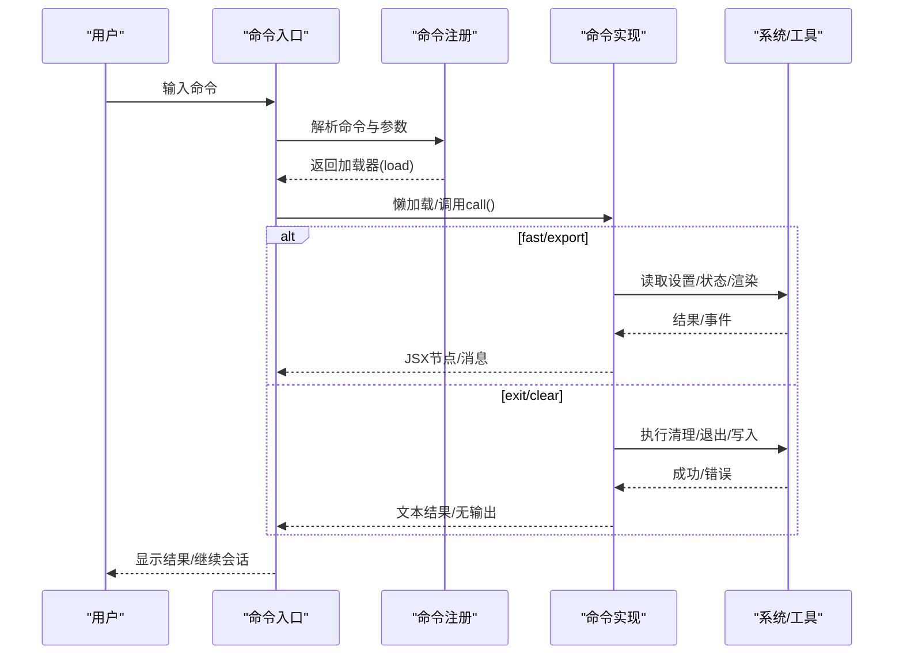
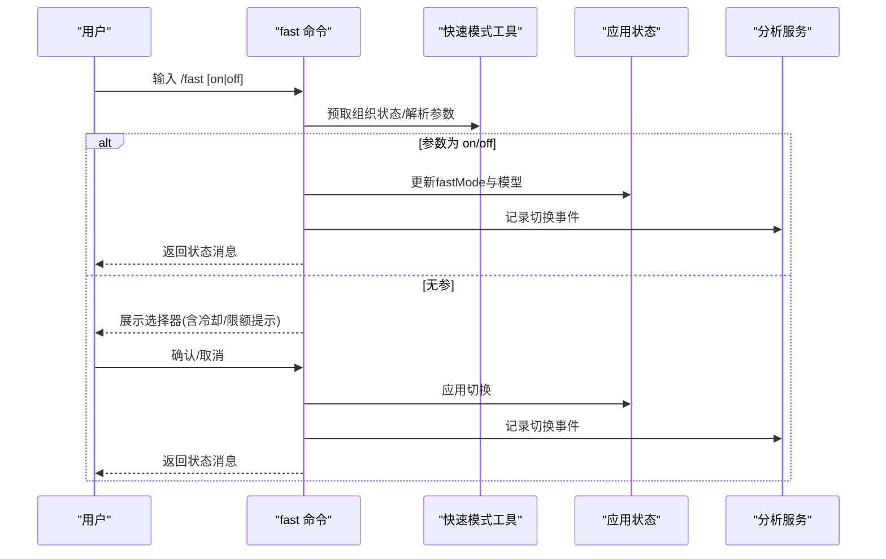
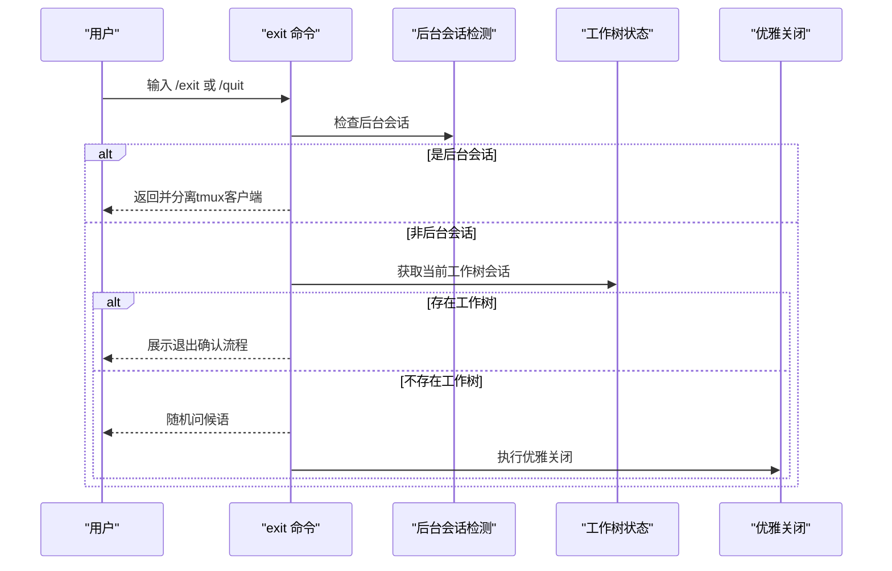
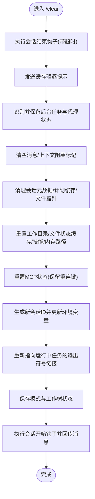
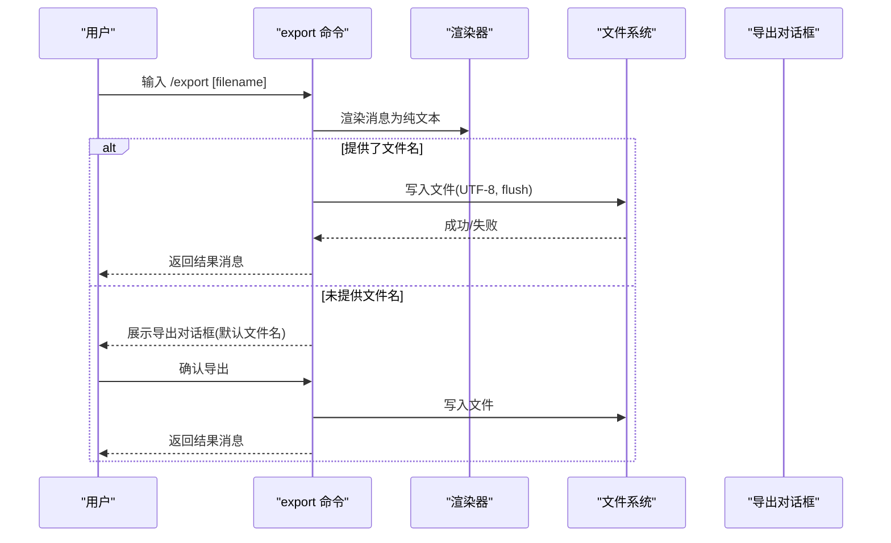
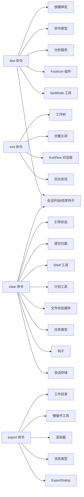

# 实用工具

<cite>
**本文引用的文件**
- [src/commands/fast/index.ts](file://src/commands/fast/index.ts)
- [src/commands/fast/fast.tsx](file://src/commands/fast/fast.tsx)
- [src/utils/fastMode.js](file://src/utils/fastMode.js)
- [src/utils/immediateCommand.js](file://src/utils/immediateCommand.js)
- [src/components/FastIcon.tsx](file://src/components/FastIcon.tsx)
- [src/services/analytics/index.ts](file://src/services/analytics/index.ts)
- [src/state/AppState.tsx](file://src/state/AppState.tsx)
- [src/types/command.ts](file://src/types/command.ts)
- [src/keybindings/useKeybinding.ts](file://src/keybindings/useKeybinding.ts)
- [src/commands/exit/index.ts](file://src/commands/exit/index.ts)
- [src/commands/exit/exit.tsx](file://src/commands/exit/exit.tsx)
- [src/components/ExitFlow.tsx](file://src/components/ExitFlow.tsx)
- [src/utils/concurrentSessions.js](file://src/utils/concurrentSessions.js)
- [src/utils/gracefulShutdown.js](file://src/utils/gracefulShutdown.js)
- [src/utils/worktree.js](file://src/utils/worktree.js)
- [src/commands/clear/index.ts](file://src/commands/clear/index.ts)
- [src/commands/clear/clear.ts](file://src/commands/clear/clear.ts)
- [src/commands/clear/conversation.ts](file://src/commands/clear/conversation.ts)
- [src/bootstrap/state.ts](file://src/bootstrap/state.ts)
- [src/utils/sessionStorage.js](file://src/utils/sessionStorage.js)
- [src/utils/hooks.js](file://src/utils/hooks.js)
- [src/utils/sessionStart.js](file://src/utils/sessionStart.js)
- [src/utils/worktree.js](file://src/utils/worktree.js)
- [src/utils/plans.js](file://src/utils/plans.js)
- [src/utils/Shell.js](file://src/utils/Shell.js)
- [src/utils/fileStateCache.js](file://src/utils/fileStateCache.js)
- [src/utils/task/diskOutput.js](file://src/utils/task/diskOutput.js)
- [src/utils/commitAttribution.js](file://src/utils/commitAttribution.js)
- [src/tasks/LocalAgentTask/LocalAgentTask.js](file://src/tasks/LocalAgentTask/LocalAgentTask.js)
- [src/tasks/InProcessTeammateTask/types.js](file://src/tasks/InProcessTeammateTask/types.js)
- [src/tasks/LocalShellTask/guards.js](file://src/tasks/LocalShellTask/guards.js)
- [src/types/ids.ts](file://src/types/ids.ts)
- [src/commands/export/index.ts](file://src/commands/export/index.ts)
- [src/commands/export/export.tsx](file://src/commands/export/export.tsx)
- [src/components/ExportDialog.tsx](file://src/components/ExportDialog.tsx)
- [src/utils/exportRenderer.js](file://src/utils/exportRenderer.js)
- [src/utils/slowOperations.js](file://src/utils/slowOperations.js)
- [src/utils/cwd.js](file://src/utils/cwd.js)
- [src/types/message.js](file://src/types/message.js)
</cite>

## 目录
1. [简介](#简介)
2. [项目结构](#项目结构)
3. [核心组件](#核心组件)
4. [架构总览](#架构总览)
5. [详细组件分析](#详细组件分析)
6. [依赖关系分析](#依赖关系分析)
7. [性能考量](#性能考量)
8. [故障排查指南](#故障排查指南)
9. [结论](#结论)
10. [附录](#附录)

## 简介
本文件面向 Claude Code 的“实用工具”命令集合，系统化梳理以下命令的定义、行为与使用方式：快速模式 fast、退出控制 exit、清理操作 clear、数据导出 export。内容涵盖：
- 使用场景与参数配置
- 安全性、数据保护与确认机制
- 批量与自动化脚本集成思路
- 性能影响、资源消耗与最佳使用时机
- 组合使用与工作流优化建议

## 项目结构
实用工具命令在命令注册层以统一接口声明，具体实现按类型懒加载或直接导入，确保启动时延与内存占用最小化。

```mermaid
graph TB
subgraph "命令注册层"
fast_index["fast/index.ts"]
exit_index["exit/index.ts"]
clear_index["clear/index.ts"]
export_index["export/index.ts"]
end
subgraph "fast 实现"
fast_impl["fast/fast.tsx"]
fast_utils["utils/fastMode.js"]
fast_icon["components/FastIcon.tsx"]
fast_analytics["services/analytics/index.ts"]
fast_state["state/AppState.tsx"]
fast_cmdtype["types/command.ts"]
fast_keys["keybindings/useKeybinding.ts"]
end
subgraph "exit 实现"
exit_impl["exit/exit.tsx"]
exit_dialog["components/ExitFlow.tsx"]
exit_sess["utils/concurrentSessions.js"]
exit_shutdown["utils/gracefulShutdown.js"]
exit_worktree["utils/worktree.js"]
end
subgraph "clear 实现"
clear_call["clear/clear.ts"]
clear_conv["clear/conversation.ts"]
clear_boot["bootstrap/state.ts"]
clear_storage["utils/sessionStorage.js"]
clear_hooks["utils/hooks.js"]
clear_start["utils/sessionStart.js"]
clear_tasks["tasks/*"]
clear_utils["utils/*.js"]
end
subgraph "export 实现"
export_impl["export/export.tsx"]
export_dialog["components/ExportDialog.tsx"]
export_renderer["utils/exportRenderer.js"]
export_io["utils/slowOperations.js"]
export_cwd["utils/cwd.js"]
export_msg["types/message.js"]
end
fast_index --> fast_impl
fast_impl --> fast_utils
fast_impl --> fast_icon
fast_impl --> fast_analytics
fast_impl --> fast_state
fast_impl --> fast_cmdtype
fast_impl --> fast_keys
exit_index --> exit_impl
exit_impl --> exit_dialog
exit_impl --> exit_sess
exit_impl --> exit_shutdown
exit_impl --> exit_worktree
clear_index --> clear_call
clear_call --> clear_conv
clear_conv --> clear_boot
clear_conv --> clear_storage
clear_conv --> clear_hooks
clear_conv --> clear_start
clear_conv --> clear_tasks
clear_conv --> clear_utils
export_index --> export_impl
export_impl --> export_dialog
export_impl --> export_renderer
export_impl --> export_io
export_impl --> export_cwd
export_impl --> export_msg
```

**图表来源**
- [src/commands/fast/index.ts:1-27](file://src/commands/fast/index.ts#L1-L27)
- [src/commands/fast/fast.tsx:1-269](file://src/commands/fast/fast.tsx#L1-L269)
- [src/commands/exit/index.ts:1-13](file://src/commands/exit/index.ts#L1-L13)
- [src/commands/exit/exit.tsx:1-33](file://src/commands/exit/exit.tsx#L1-L33)
- [src/commands/clear/index.ts:1-20](file://src/commands/clear/index.ts#L1-L20)
- [src/commands/clear/clear.ts:1-8](file://src/commands/clear/clear.ts#L1-L8)
- [src/commands/clear/conversation.ts:1-252](file://src/commands/clear/conversation.ts#L1-L252)
- [src/commands/export/index.ts:1-12](file://src/commands/export/index.ts#L1-L12)
- [src/commands/export/export.tsx:1-91](file://src/commands/export/export.tsx#L1-L91)

**章节来源**
- [src/commands/fast/index.ts:1-27](file://src/commands/fast/index.ts#L1-L27)
- [src/commands/exit/index.ts:1-13](file://src/commands/exit/index.ts#L1-L13)
- [src/commands/clear/index.ts:1-20](file://src/commands/clear/index.ts#L1-L20)
- [src/commands/export/index.ts:1-12](file://src/commands/export/index.ts#L1-L12)

## 核心组件
- 快速模式 fast：切换快速模式（研究预览），支持 on/off 参数或交互式选择器；与模型切换、限流冷却、计费提示联动。
- 退出控制 exit：退出 REPL 或后台会话分离；支持工作树状态提示与优雅关闭流程。
- 清理操作 clear：清空对话历史、重置上下文、清理缓存与任务状态，保留后台任务与必要元数据。
- 数据导出 export：将当前对话渲染为纯文本并导出到文件或剪贴板，支持默认文件名生成与确认对话框。

**章节来源**
- [src/commands/fast/fast.tsx:248-269](file://src/commands/fast/fast.tsx#L248-L269)
- [src/commands/exit/exit.tsx:14-33](file://src/commands/exit/exit.tsx#L14-L33)
- [src/commands/clear/clear.ts:4-7](file://src/commands/clear/clear.ts#L4-L7)
- [src/commands/export/export.tsx:53-91](file://src/commands/export/export.tsx#L53-L91)

## 架构总览
四类命令均通过命令注册对象声明能力与加载策略，运行时根据需要懒加载实现模块，避免不必要的初始化成本。fast 与 export 采用 JSX 命令类型，提供交互式 UI；exit 与 clear 采用本地命令类型，直接执行逻辑。

**图表来源**
- [src/commands/fast/index.ts:8-24](file://src/commands/fast/index.ts#L8-L24)
- [src/commands/export/index.ts:3-9](file://src/commands/export/index.ts#L3-L9)
- [src/commands/exit/index.ts:3-10](file://src/commands/exit/index.ts#L3-L10)
- [src/commands/clear/index.ts:10-17](file://src/commands/clear/index.ts#L10-L17)

## 详细组件分析

### 快速模式 fast
- 命令特性
  - 类型：本地 JSX 命令
  - 可用平台：claude-ai/console
  - 是否隐藏：仅在启用快速模式时显示
  - 即时性：根据推理配置是否立即执行
  - 参数：可选 on/off 切换；省略时弹出选择器
- 行为流程
  - 首次进入时预取组织快速模式状态；若参数为 on/off，则直接切换；否则展示选择器，支持键盘快捷键确认/取消。
  - 切换时若当前模型不支持快速模式则自动切换至快速模式专属模型；记录分析事件；返回状态消息。
- 安全与确认
  - 未启用快速模式时不展示命令入口，避免误触。
  - 选择器提供明确的“研究预览”说明与链接，冷却/限额提示清晰。
- 性能与计费
  - 快速模式专属计价与独立配额；切换时会提示计费信息。
- 最佳实践
  - 在需要快速迭代或探索时开启；注意冷却与限额提示，避免频繁切换造成体验降级。

**图表来源**
- [src/commands/fast/fast.tsx:248-269](file://src/commands/fast/fast.tsx#L248-L269)
- [src/utils/fastMode.js](file://src/utils/fastMode.js)
- [src/state/AppState.tsx](file://src/state/AppState.tsx)
- [src/services/analytics/index.ts](file://src/services/analytics/index.ts)

**章节来源**
- [src/commands/fast/index.ts:8-24](file://src/commands/fast/index.ts#L8-L24)
- [src/commands/fast/fast.tsx:16-40](file://src/commands/fast/fast.tsx#L16-L40)
- [src/commands/fast/fast.tsx:226-247](file://src/commands/fast/fast.tsx#L226-L247)
- [src/commands/fast/fast.tsx:248-269](file://src/commands/fast/fast.tsx#L248-L269)
- [src/utils/fastMode.js](file://src/utils/fastMode.js)
- [src/utils/immediateCommand.js](file://src/utils/immediateCommand.js)
- [src/components/FastIcon.tsx](file://src/components/FastIcon.tsx)
- [src/services/analytics/index.ts](file://src/services/analytics/index.ts)
- [src/state/AppState.tsx](file://src/state/AppState.tsx)
- [src/types/command.ts](file://src/types/command.ts)
- [src/keybindings/useKeybinding.ts](file://src/keybindings/useKeybinding.ts)

### 退出控制 exit
- 命令特性
  - 类型：本地 JSX 命令
  - 别名：quit
  - 行为：在后台 tmux 会话中分离而非终止；否则显示工作树提示或直接优雅关闭
- 行为流程
  - 若处于后台会话：直接返回并调用 tmux 分离客户端
  - 否则：若存在工作树会话，展示退出确认流程；否则随机问候语后执行优雅关闭
- 安全与确认
  - 工作树存在时强制确认，避免误关导致状态丢失
  - 后台会话分离保证 REPL 可重新连接
- 自动化集成
  - 可用于脚本中触发退出，配合后台会话管理

**图表来源**
- [src/commands/exit/exit.tsx:14-33](file://src/commands/exit/exit.tsx#L14-L33)
- [src/utils/concurrentSessions.js](file://src/utils/concurrentSessions.js)
- [src/utils/worktree.js](file://src/utils/worktree.js)
- [src/utils/gracefulShutdown.js](file://src/utils/gracefulShutdown.js)
- [src/components/ExitFlow.tsx](file://src/components/ExitFlow.tsx)

**章节来源**
- [src/commands/exit/index.ts:3-10](file://src/commands/exit/index.ts#L3-L10)
- [src/commands/exit/exit.tsx:14-33](file://src/commands/exit/exit.tsx#L14-L33)
- [src/utils/concurrentSessions.js](file://src/utils/concurrentSessions.js)
- [src/utils/worktree.js](file://src/utils/worktree.js)
- [src/utils/gracefulShutdown.js](file://src/utils/gracefulShutdown.js)
- [src/components/ExitFlow.tsx](file://src/components/ExitFlow.tsx)

### 清理操作 clear
- 命令特性
  - 类型：本地命令
  - 别名：reset/new
  - 行为：清空对话历史、重置上下文、清理缓存与任务状态，保留后台任务与必要元数据
- 行为流程
  - 执行会话结束钩子（带超时）
  - 发送缓存驱逐提示
  - 识别并保留后台任务与相关代理状态
  - 清空消息、上下文阻塞标记、会话元数据、计划缓存、会话文件指针等
  - 重置工作目录与文件状态缓存，清理技能与内存路径集合
  - 重置 MCP 状态（保留插件重连键）
  - 生成新会话 ID 并更新环境变量
  - 重新指向任务输出符号链接（针对运行中的本地代理任务）
  - 保存模式与工作树状态，执行会话开始钩子并回传消息
- 安全与数据保护
  - 会话结束钩子与开始钩子确保清理前后状态一致性
  - 保留后台任务避免中断关键流程
  - 会话元数据与计划缓存清理防止旧状态污染新会话
- 性能与资源
  - 清理缓存与重置状态减少上下文膨胀
  - 重新指向任务输出避免冻结快照导致的 IO 异常

**图表来源**
- [src/commands/clear/conversation.ts:66-251](file://src/commands/clear/conversation.ts#L66-L251)
- [src/utils/hooks.js](file://src/utils/hooks.js)
- [src/utils/sessionStorage.js](file://src/utils/sessionStorage.js)
- [src/utils/sessionStart.js](file://src/utils/sessionStart.js)
- [src/utils/plans.js](file://src/utils/plans.js)
- [src/utils/Shell.js](file://src/utils/Shell.js)
- [src/utils/fileStateCache.js](file://src/utils/fileStateCache.js)
- [src/utils/task/diskOutput.js](file://src/utils/task/diskOutput.js)
- [src/utils/commitAttribution.js](file://src/utils/commitAttribution.js)
- [src/tasks/LocalAgentTask/LocalAgentTask.js](file://src/tasks/LocalAgentTask/LocalAgentTask.js)
- [src/tasks/InProcessTeammateTask/types.js](file://src/tasks/InProcessTeammateTask/types.js)
- [src/tasks/LocalShellTask/guards.js](file://src/tasks/LocalShellTask/guards.js)
- [src/types/ids.ts](file://src/types/ids.ts)
- [src/bootstrap/state.ts](file://src/bootstrap/state.ts)

**章节来源**
- [src/commands/clear/index.ts:10-17](file://src/commands/clear/index.ts#L10-L17)
- [src/commands/clear/clear.ts:4-7](file://src/commands/clear/clear.ts#L4-L7)
- [src/commands/clear/conversation.ts:49-251](file://src/commands/clear/conversation.ts#L49-L251)

### 数据导出 export
- 命令特性
  - 类型：本地 JSX 命令
  - 参数：可选目标文件名（若提供则直接写入，跳过对话框）
- 行为流程
  - 渲染当前消息为纯文本
  - 若提供文件名：标准化扩展名为 .txt，拼接当前工作目录，同步写入并返回成功消息；失败时返回错误消息
  - 若未提供文件名：从第一条用户消息提取首行作为标题，生成时间戳前缀的默认文件名，展示导出对话框供确认
- 安全与数据保护
  - 写入操作使用同步 I/O，确保落盘一致性
  - 导出对话框允许用户确认后再写入，避免误操作
- 自动化与批量化
  - 支持直接传入文件名进行无人值守导出
  - 默认文件名基于首条提示与时间戳，便于归档与检索

**图表来源**
- [src/commands/export/export.tsx:49-91](file://src/commands/export/export.tsx#L49-L91)
- [src/utils/exportRenderer.js](file://src/utils/exportRenderer.js)
- [src/utils/slowOperations.js](file://src/utils/slowOperations.js)
- [src/utils/cwd.js](file://src/utils/cwd.js)
- [src/components/ExportDialog.tsx](file://src/components/ExportDialog.tsx)

**章节来源**
- [src/commands/export/index.ts:3-9](file://src/commands/export/index.ts#L3-L9)
- [src/commands/export/export.tsx:49-91](file://src/commands/export/export.tsx#L49-L91)
- [src/utils/exportRenderer.js](file://src/utils/exportRenderer.js)
- [src/utils/slowOperations.js](file://src/utils/slowOperations.js)
- [src/utils/cwd.js](file://src/utils/cwd.js)
- [src/types/message.js](file://src/types/message.js)
- [src/components/ExportDialog.tsx](file://src/components/ExportDialog.tsx)

## 依赖关系分析
- fast
  - 依赖快速模式工具、图标组件、分析服务、应用状态、命令类型、按键绑定
- exit
  - 依赖后台会话检测、退出流程组件、优雅关闭工具、工作树工具
- clear
  - 依赖会话存储、钩子、会话开始/结束钩子、任务类型、文件状态缓存、计划工具、Shell 工具、提交归属工具、引导状态
- export
  - 依赖导出对话框、消息类型、渲染器、慢操作工具、工作目录工具

**图表来源**
- [src/commands/fast/fast.tsx:1-269](file://src/commands/fast/fast.tsx#L1-L269)
- [src/commands/exit/exit.tsx:1-33](file://src/commands/exit/exit.tsx#L1-L33)
- [src/commands/clear/conversation.ts:1-252](file://src/commands/clear/conversation.ts#L1-L252)
- [src/commands/export/export.tsx:1-91](file://src/commands/export/export.tsx#L1-L91)

**章节来源**
- [src/commands/fast/fast.tsx:1-269](file://src/commands/fast/fast.tsx#L1-L269)
- [src/commands/exit/exit.tsx:1-33](file://src/commands/exit/exit.tsx#L1-L33)
- [src/commands/clear/conversation.ts:1-252](file://src/commands/clear/conversation.ts#L1-L252)
- [src/commands/export/export.tsx:1-91](file://src/commands/export/export.tsx#L1-L91)

## 性能考量
- fast
  - 研究预览模式下计价与配额独立，频繁切换可能触发冷却与限额提示，建议在需要快速迭代时集中使用。
  - 切换模型时会更新主循环模型，注意与当前模型支持性的匹配。
- exit
  - 后台会话分离避免进程终止，降低重启开销；非后台会话的优雅关闭确保资源释放与状态持久化。
- clear
  - 清理缓存与会话元数据可显著降低上下文膨胀；重新指向任务输出符号链接避免后续 IO 异常。
  - 会话结束/开始钩子带超时，避免长时间阻塞。
- export
  - 同步写入确保一致性但可能阻塞 UI；建议在无人值守场景直接传入文件名以减少交互等待。

[本节为通用指导，无需特定文件来源]

## 故障排查指南
- fast
  - 若提示不可用：检查组织快速模式状态与限额/过载冷却；确认当前模型是否支持快速模式。
  - 切换后模型未更新：确认是否需要手动切换模型，查看返回消息中的模型更新提示。
- exit
  - 后台会话无法分离：检查 tmux 客户端是否存在；确认后台会话功能开关。
  - 退出后状态异常：确认是否正确执行优雅关闭流程，检查工作树状态。
- clear
  - 清理后任务中断：确认任务是否被标记为前台任务（会被终止）；后台任务应被保留。
  - 会话元数据未清理：检查会话结束钩子是否执行成功，确认会话 ID 是否已更新。
- export
  - 导出失败：检查目标路径权限与磁盘空间；查看错误消息中的具体原因；尝试更换文件名或目录。

**章节来源**
- [src/commands/fast/fast.tsx:226-247](file://src/commands/fast/fast.tsx#L226-L247)
- [src/commands/exit/exit.tsx:18-24](file://src/commands/exit/exit.tsx#L18-L24)
- [src/commands/clear/conversation.ts:66-74](file://src/commands/clear/conversation.ts#L66-L74)
- [src/commands/export/export.tsx:62-72](file://src/commands/export/export.tsx#L62-L72)

## 结论
- fast：适合探索与快速迭代，需关注限额与冷却提示，合理安排切换频率。
- exit：区分后台与前台会话，后台会话分离提升可维护性，前台会话优雅关闭保障稳定性。
- clear：全面清理上下文与缓存，保留后台任务，适合重置会话状态与释放资源。
- export：支持直接导出与对话框确认两种方式，便于自动化与人工审阅结合。

[本节为总结，无需特定文件来源]

## 附录
- 组合使用建议
  - 快速模式 + 清理：在探索阶段使用快速模式，完成后执行清理以重置上下文。
  - 退出前导出：在退出前先导出当前对话，避免数据丢失。
  - 后台会话 + 清理：在后台会话中定期清理，保持会话轻量。
- 自动化脚本
  - 直接导出：/export [文件名] 无人值守导出。
  - 退出流程：/exit 或 /quit 触发优雅关闭或 tmux 分离。
  - 清理重置：/clear 清空历史并重置上下文。

[本节为概念性建议，无需特定文件来源]