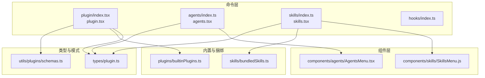
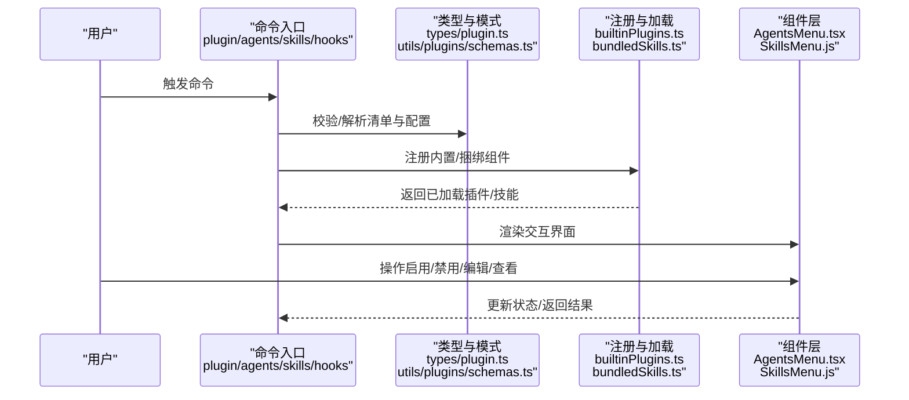
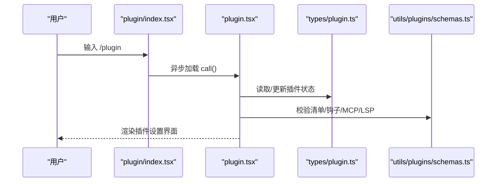
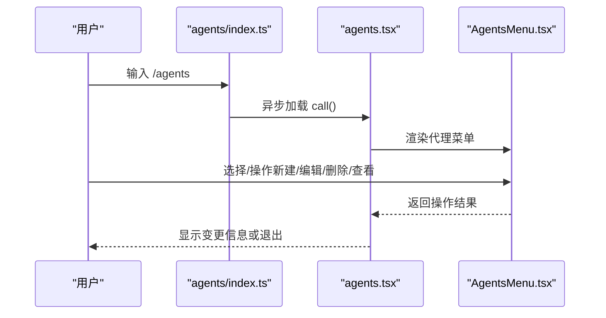
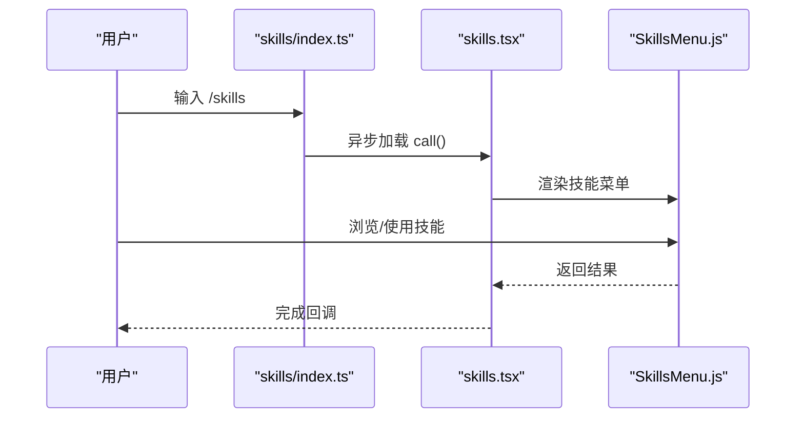
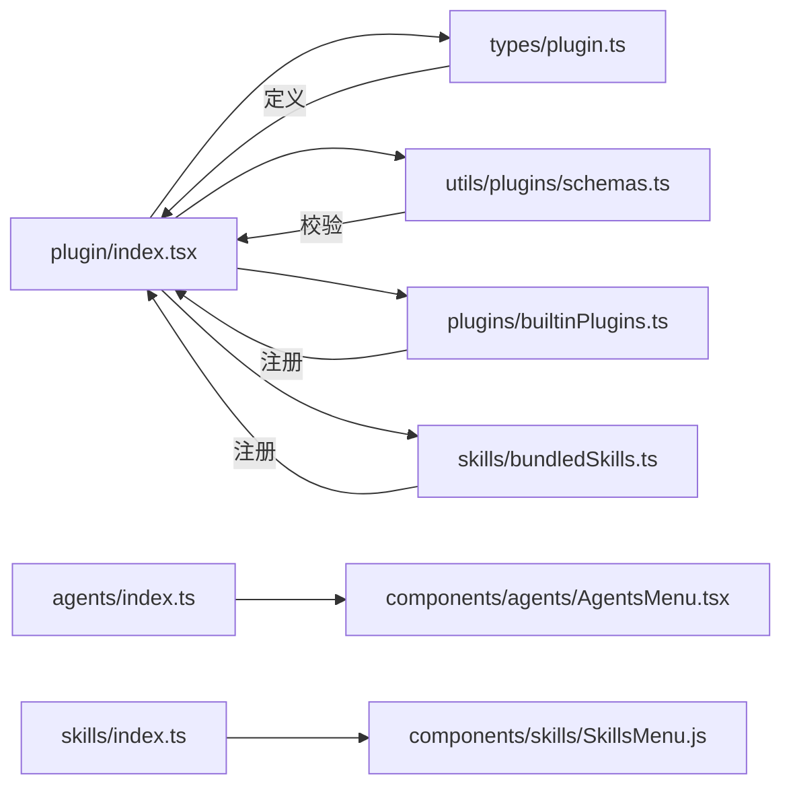

# 插件开发

<cite>
**本文引用的文件**
- [src/commands/plugin/index.tsx](file://src/commands/plugin/index.tsx)
- [src/commands/plugin/plugin.tsx](file://src/commands/plugin/plugin.tsx)
- [src/commands/agents/index.ts](file://src/commands/agents/index.ts)
- [src/commands/agents/agents.tsx](file://src/commands/agents/agents.tsx)
- [src/commands/skills/index.ts](file://src/commands/skills/index.ts)
- [src/commands/skills/skills.tsx](file://src/commands/skills/skills.tsx)
- [src/commands/hooks/index.ts](file://src/commands/hooks/index.ts)
- [src/plugins/builtinPlugins.ts](file://src/plugins/builtinPlugins.ts)
- [src/skills/bundledSkills.ts](file://src/skills/bundledSkills.ts)
- [src/types/plugin.ts](file://src/types/plugin.ts)
- [src/utils/plugins/schemas.ts](file://src/utils/plugins/schemas.ts)
- [src/components/agents/AgentsMenu.tsx](file://src/components/agents/AgentsMenu.tsx)
- [src/components/skills/SkillsMenu.js](file://src/components/skills/SkillsMenu.js)
</cite>

## 目录
1. [简介](#简介)
2. [项目结构](#项目结构)
3. [核心组件](#核心组件)
4. [架构总览](#架构总览)
5. [详细组件分析](#详细组件分析)
6. [依赖关系分析](#依赖关系分析)
7. [性能考虑](#性能考虑)
8. [故障排查指南](#故障排查指南)
9. [结论](#结论)
10. [附录](#附录)

## 简介
本文件面向 Claude Code 插件开发者与维护者，系统化梳理插件体系：插件安装与管理（plugin 命令）、智能代理（agents 命令）、技能开发（skills 命令）与钩子系统（hooks 命令）。文档覆盖插件架构、开发规范、部署流程、生命周期、依赖管理与版本兼容性、模板与工具、调试方法、插件市场与发布流程、质量保障以及安全、性能与用户体验最佳实践。

## 项目结构
围绕插件体系的关键目录与文件：
- 命令层：commands/plugin、commands/agents、commands/skills、commands/hooks
- 类型与模式：types/plugin.ts、utils/plugins/schemas.ts
- 内置与捆绑：plugins/builtinPlugins.ts、skills/bundledSkills.ts
- 组件层：components/agents/AgentsMenu.tsx、components/skills/SkillsMenu.js
- UI 命令入口：各 index.ts(x) 文件导出本地 JSX 命令

**图表来源**
- [src/commands/plugin/index.tsx:1-11](file://src/commands/plugin/index.tsx#L1-L11)
- [src/commands/plugin/plugin.tsx:1-7](file://src/commands/plugin/plugin.tsx#L1-L7)
- [src/commands/agents/index.ts:1-11](file://src/commands/agents/index.ts#L1-L11)
- [src/commands/agents/agents.tsx:1-12](file://src/commands/agents/agents.tsx#L1-L12)
- [src/commands/skills/index.ts:1-11](file://src/commands/skills/index.ts#L1-L11)
- [src/commands/skills/skills.tsx:1-8](file://src/commands/skills/skills.tsx#L1-L8)
- [src/commands/hooks/index.ts:1-12](file://src/commands/hooks/index.ts#L1-L12)
- [src/plugins/builtinPlugins.ts:1-160](file://src/plugins/builtinPlugins.ts#L1-L160)
- [src/skills/bundledSkills.ts:1-221](file://src/skills/bundledSkills.ts#L1-L221)
- [src/types/plugin.ts:1-364](file://src/types/plugin.ts#L1-L364)
- [src/utils/plugins/schemas.ts:1-800](file://src/utils/plugins/schemas.ts#L1-L800)
- [src/components/agents/AgentsMenu.tsx:1-800](file://src/components/agents/AgentsMenu.tsx#L1-L800)
- [src/components/skills/SkillsMenu.js](file://src/components/skills/SkillsMenu.js)

**章节来源**
- [src/commands/plugin/index.tsx:1-11](file://src/commands/plugin/index.tsx#L1-L11)
- [src/commands/agents/index.ts:1-11](file://src/commands/agents/index.ts#L1-L11)
- [src/commands/skills/index.ts:1-11](file://src/commands/skills/index.ts#L1-L11)
- [src/commands/hooks/index.ts:1-12](file://src/commands/hooks/index.ts#L1-L12)

## 核心组件
- 插件命令（plugin）
  - 入口定义：本地 JSX 命令，立即执行，加载 UI 设置面板
  - 能力：管理内置与市场插件、启用/禁用、查看配置、集成 MCP/LSP/钩子等
- 智能代理命令（agents）
  - 入口定义：本地 JSX 命令，加载代理菜单
  - 能力：列出/编辑/删除代理，支持多来源（内置、用户设置、项目设置、策略、本地、标志、插件）
- 技能命令（skills）
  - 入口定义：本地 JSX 命令，加载技能菜单
  - 能力：展示可用技能、按来源过滤、与工具权限集成
- 钩子命令（hooks）
  - 入口定义：本地 JSX 命令，立即执行，显示钩子配置
  - 能力：查看工具事件钩子配置，便于调试与审计

**章节来源**
- [src/commands/plugin/index.tsx:1-11](file://src/commands/plugin/index.tsx#L1-L11)
- [src/commands/plugin/plugin.tsx:1-7](file://src/commands/plugin/plugin.tsx#L1-L7)
- [src/commands/agents/index.ts:1-11](file://src/commands/agents/index.ts#L1-L11)
- [src/commands/agents/agents.tsx:1-12](file://src/commands/agents/agents.tsx#L1-L12)
- [src/commands/skills/index.ts:1-11](file://src/commands/skills/index.ts#L1-L11)
- [src/commands/skills/skills.tsx:1-8](file://src/commands/skills/skills.tsx#L1-L8)
- [src/commands/hooks/index.ts:1-12](file://src/commands/hooks/index.ts#L1-L12)

## 架构总览
插件体系由“命令入口 -> 类型与模式 -> 加载与注册 -> 组件渲染”构成闭环。命令通过本地 JSX 渲染 UI，类型与模式确保清单、钩子、MCP/LSP 等结构化与可验证；内置与捆绑机制提供默认能力与扩展点；组件层负责交互与状态管理。

**图表来源**
- [src/commands/plugin/index.tsx:1-11](file://src/commands/plugin/index.tsx#L1-L11)
- [src/commands/plugin/plugin.tsx:1-7](file://src/commands/plugin/plugin.tsx#L1-L7)
- [src/commands/agents/agents.tsx:1-12](file://src/commands/agents/agents.tsx#L1-L12)
- [src/commands/skills/skills.tsx:1-8](file://src/commands/skills/skills.tsx#L1-L8)
- [src/commands/hooks/index.ts:1-12](file://src/commands/hooks/index.ts#L1-L12)
- [src/types/plugin.ts:1-364](file://src/types/plugin.ts#L1-L364)
- [src/utils/plugins/schemas.ts:1-800](file://src/utils/plugins/schemas.ts#L1-L800)
- [src/plugins/builtinPlugins.ts:1-160](file://src/plugins/builtinPlugins.ts#L1-L160)
- [src/skills/bundledSkills.ts:1-221](file://src/skills/bundledSkills.ts#L1-L221)
- [src/components/agents/AgentsMenu.tsx:1-800](file://src/components/agents/AgentsMenu.tsx#L1-L800)
- [src/components/skills/SkillsMenu.js](file://src/components/skills/SkillsMenu.js)

## 详细组件分析

### 插件命令（plugin）
- 命令定义
  - 类型：本地 JSX
  - 名称/别名：plugin、plugins、marketplace
  - 行为：立即执行，加载插件设置 UI
  - 动态加载：通过异步 import 加载实现
- UI 与交互
  - 通过 React 组件渲染插件设置面板，支持完成回调
- 与类型/模式的关系
  - 使用 LoadedPlugin、PluginComponent、PluginError 等类型
  - 依赖插件清单与钩子/服务器配置的校验与解析

**图表来源**
- [src/commands/plugin/index.tsx:1-11](file://src/commands/plugin/index.tsx#L1-L11)
- [src/commands/plugin/plugin.tsx:1-7](file://src/commands/plugin/plugin.tsx#L1-L7)
- [src/types/plugin.ts:1-364](file://src/types/plugin.ts#L1-L364)
- [src/utils/plugins/schemas.ts:1-800](file://src/utils/plugins/schemas.ts#L1-L800)

**章节来源**
- [src/commands/plugin/index.tsx:1-11](file://src/commands/plugin/index.tsx#L1-L11)
- [src/commands/plugin/plugin.tsx:1-7](file://src/commands/plugin/plugin.tsx#L1-L7)
- [src/types/plugin.ts:48-70](file://src/types/plugin.ts#L48-L70)
- [src/utils/plugins/schemas.ts:248-320](file://src/utils/plugins/schemas.ts#L248-L320)

### 智能代理命令（agents）
- 命令定义
  - 类型：本地 JSX
  - 名称：agents
  - 行为：加载代理菜单，支持工具权限上下文
- UI 与交互
  - AgentsMenu 支持多模式：列表、新建、详情、编辑、删除确认
  - 多来源聚合：内置、用户设置、项目设置、策略、本地、标志、插件
- 生命周期
  - 列表 -> 选择 -> 查看/编辑/删除 -> 返回

**图表来源**
- [src/commands/agents/index.ts:1-11](file://src/commands/agents/index.ts#L1-L11)
- [src/commands/agents/agents.tsx:1-12](file://src/commands/agents/agents.tsx#L1-L12)
- [src/components/agents/AgentsMenu.tsx:1-800](file://src/components/agents/AgentsMenu.tsx#L1-L800)

**章节来源**
- [src/commands/agents/index.ts:1-11](file://src/commands/agents/index.ts#L1-L11)
- [src/commands/agents/agents.tsx:1-12](file://src/commands/agents/agents.tsx#L1-L12)
- [src/components/agents/AgentsMenu.tsx:194-768](file://src/components/agents/AgentsMenu.tsx#L194-L768)

### 技能命令（skills）
- 命令定义
  - 类型：本地 JSX
  - 名称：skills
  - 行为：加载技能菜单，传入命令上下文
- UI 与交互
  - SkillsMenu 展示技能列表，支持过滤与导航
  - 与工具权限集成，限制可用技能范围

**图表来源**
- [src/commands/skills/index.ts:1-11](file://src/commands/skills/index.ts#L1-L11)
- [src/commands/skills/skills.tsx:1-8](file://src/commands/skills/skills.tsx#L1-L8)
- [src/components/skills/SkillsMenu.js](file://src/components/skills/SkillsMenu.js)

**章节来源**
- [src/commands/skills/index.ts:1-11](file://src/commands/skills/index.ts#L1-L11)
- [src/commands/skills/skills.tsx:1-8](file://src/commands/skills/skills.tsx#L1-L8)
- [src/components/skills/SkillsMenu.js](file://src/components/skills/SkillsMenu.js)

### 钩子命令（hooks）
- 命令定义
  - 类型：本地 JSX
  - 名称：hooks
  - 行为：立即执行，显示钩子配置
- 用途
  - 查看工具事件钩子配置，辅助调试与审计

**章节来源**
- [src/commands/hooks/index.ts:1-12](file://src/commands/hooks/index.ts#L1-L12)

### 内置插件与捆绑技能
- 内置插件（builtinPlugins）
  - 提供注册、查询、启用/禁用逻辑
  - 以 @builtin 标识，区分于市场插件
  - 可提供技能、钩子、MCP 服务器
- 捆绑技能（bundledSkills）
  - 编译到 CLI 的技能集合
  - 支持首次调用时提取参考文件到磁盘
  - 与工具权限、上下文、代理等集成

```mermaid
classDiagram
class BuiltinPluginDefinition {
+string name
+string description
+string version
+BundledSkillDefinition[] skills
+HooksSettings hooks
+Record~string, McpServerConfig~ mcpServers
+() isAvailable()
+boolean defaultEnabled
}
class LoadedPlugin {
+string name
+PluginManifest manifest
+string path
+string source
+string repository
+boolean enabled
+boolean isBuiltin
+string sha
+string[] commandsPaths
+Record~string, CommandMetadata~ commandsMetadata
+string[] agentsPaths
+string[] skillsPaths
+string[] outputStylesPaths
+HooksSettings hooksConfig
+Record~string, McpServerConfig~ mcpServers
+Record~string, LspServerConfig~ lspServers
+Record~string, unknown~ settings
}
class BundledSkillDefinition {
+string name
+string description
+string[] aliases
+string whenToUse
+string argumentHint
+string[] allowedTools
+string model
+boolean disableModelInvocation
+boolean userInvocable
+() isEnabled()
+HooksSettings hooks
+string context
+string agent
+Record~string, string~ files
+(args, context) getPromptForCommand()
}
BuiltinPluginDefinition --> LoadedPlugin : "注册后生成"
BundledSkillDefinition --> LoadedPlugin : "转换为命令"
```

**图表来源**
- [src/plugins/builtinPlugins.ts:18-35](file://src/plugins/builtinPlugins.ts#L18-L35)
- [src/plugins/builtinPlugins.ts:48-92](file://src/plugins/builtinPlugins.ts#L48-L92)
- [src/skills/bundledSkills.ts:15-41](file://src/skills/bundledSkills.ts#L15-L41)
- [src/types/plugin.ts:18-35](file://src/types/plugin.ts#L18-L35)
- [src/types/plugin.ts:48-70](file://src/types/plugin.ts#L48-L70)

**章节来源**
- [src/plugins/builtinPlugins.ts:1-160](file://src/plugins/builtinPlugins.ts#L1-L160)
- [src/skills/bundledSkills.ts:1-221](file://src/skills/bundledSkills.ts#L1-L221)
- [src/types/plugin.ts:1-364](file://src/types/plugin.ts#L1-L364)

## 依赖关系分析
- 命令到类型/模式
  - plugin/agents/skills/hooks 依赖 types/plugin.ts 与 utils/plugins/schemas.ts 进行结构化校验
- 命令到注册/加载
  - plugin 依赖 builtinPlugins.ts 与 bundledSkills.ts 管理插件与技能
- 命令到组件
  - agents/skills 依赖对应 UI 组件进行渲染与交互
- 错误处理
  - types/plugin.ts 中定义了丰富的 PluginError 类型，用于统一错误表达与提示

**图表来源**
- [src/commands/plugin/index.tsx:1-11](file://src/commands/plugin/index.tsx#L1-L11)
- [src/types/plugin.ts:1-364](file://src/types/plugin.ts#L1-L364)
- [src/utils/plugins/schemas.ts:1-800](file://src/utils/plugins/schemas.ts#L1-L800)
- [src/plugins/builtinPlugins.ts:1-160](file://src/plugins/builtinPlugins.ts#L1-L160)
- [src/skills/bundledSkills.ts:1-221](file://src/skills/bundledSkills.ts#L1-L221)
- [src/commands/agents/index.ts:1-11](file://src/commands/agents/index.ts#L1-L11)
- [src/commands/skills/index.ts:1-11](file://src/commands/skills/index.ts#L1-L11)
- [src/components/agents/AgentsMenu.tsx:1-800](file://src/components/agents/AgentsMenu.tsx#L1-L800)
- [src/components/skills/SkillsMenu.js](file://src/components/skills/SkillsMenu.js)

**章节来源**
- [src/types/plugin.ts:101-289](file://src/types/plugin.ts#L101-L289)
- [src/utils/plugins/schemas.ts:248-320](file://src/utils/plugins/schemas.ts#L248-L320)

## 性能考虑
- 插件加载
  - 延迟加载：命令通过异步 import 实现按需加载，降低启动开销
  - 缓存与复用：内置插件与捆绑技能在进程内缓存，避免重复解析
- UI 渲染
  - React 组件采用 memo 化与状态最小化，减少重渲染
- 服务器启动
  - LSP/MCP 启动超时与重启策略，防止阻塞主线程
- I/O 与安全
  - 捆绑技能文件写入使用安全标志与路径校验，避免符号链接与路径穿越

[本节为通用指导，无需特定文件引用]

## 故障排查指南
- 常见错误类型
  - 路径不存在、Git 认证失败、网络错误、清单解析/校验失败、插件未找到、市场不可用、MCP/LSP 配置无效、服务器启动/崩溃/超时、依赖不满足、插件缓存缺失等
- 错误消息映射
  - 通过 getPluginErrorMessage 将具体错误类型映射为用户可读提示
- 排查步骤
  - 检查插件清单与钩子配置是否符合 schemas 校验
  - 确认网络与认证设置（Git/HTTPS/SSH）
  - 查看 LSP/MCP 日志与超时配置
  - 核对依赖是否启用且存在于配置的市场中

**章节来源**
- [src/types/plugin.ts:101-289](file://src/types/plugin.ts#L101-L289)
- [src/types/plugin.ts:295-363](file://src/types/plugin.ts#L295-L363)
- [src/utils/plugins/schemas.ts:248-320](file://src/utils/plugins/schemas.ts#L248-L320)

## 结论
本文件系统化梳理了 Claude Code 插件体系：从命令入口、类型与模式、注册与加载，到组件渲染与错误处理。内置与捆绑机制提供了稳定扩展点，而严格的模式校验与错误类型化提升了可靠性与可观测性。建议开发者遵循本文档的开发规范与最佳实践，在保证安全与性能的前提下高效构建高质量插件。

## 附录

### 开发规范与最佳实践
- 清单与模式
  - 使用 utils/plugins/schemas.ts 中的模式校验清单、钩子、MCP/LSP 配置
  - 严格遵守 marketplace 命名规则与来源校验
- 插件生命周期
  - 注册：通过 plugins/builtinPlugins.ts 或捆绑技能注册
  - 加载：命令异步加载，UI 渲染
  - 运行：工具权限、钩子拦截、MCP/LSP 协作
  - 卸载/禁用：通过设置持久化控制
- 依赖管理与版本兼容
  - 依赖声明与解析：在清单中声明依赖，运行时检查启用状态
  - 版本与分支：通过仓库配置与 SHA 固定版本
- 安全
  - 市场名称与来源校验，阻止冒名与非 ASCII 混淆
  - 捆绑技能文件写入安全策略，路径校验与权限控制
- 性能
  - 延迟加载、缓存、最小化渲染、合理超时与重启策略
- 用户体验
  - 清晰的错误提示与回退行为
  - 一致的 UI 交互与键盘快捷键支持

**章节来源**
- [src/utils/plugins/schemas.ts:1-800](file://src/utils/plugins/schemas.ts#L1-L800)
- [src/plugins/builtinPlugins.ts:1-160](file://src/plugins/builtinPlugins.ts#L1-L160)
- [src/skills/bundledSkills.ts:1-221](file://src/skills/bundledSkills.ts#L1-L221)
- [src/types/plugin.ts:1-364](file://src/types/plugin.ts#L1-L364)