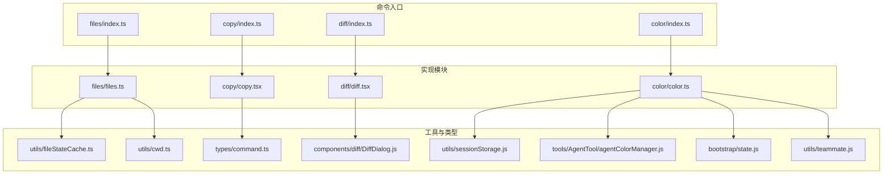
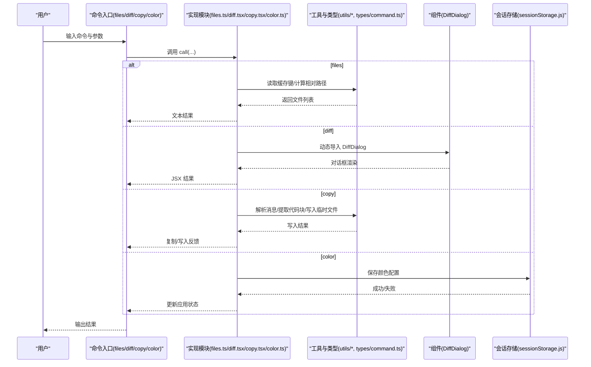
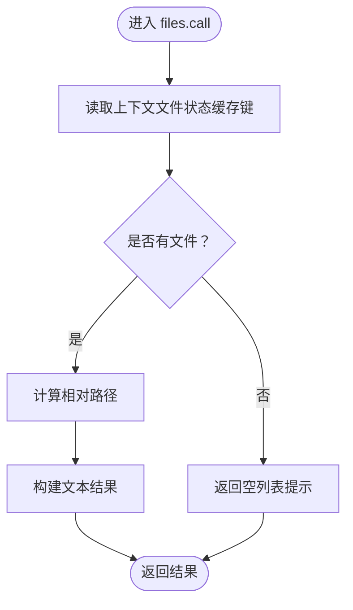
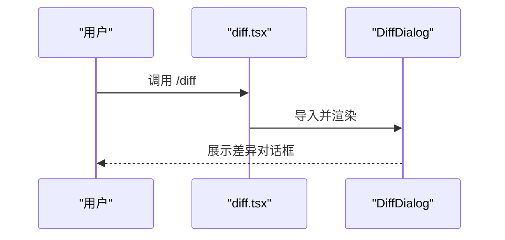
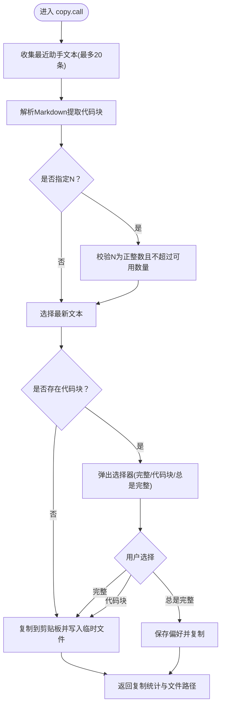
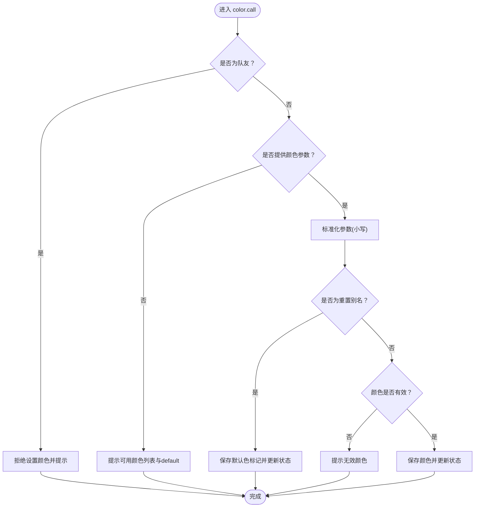
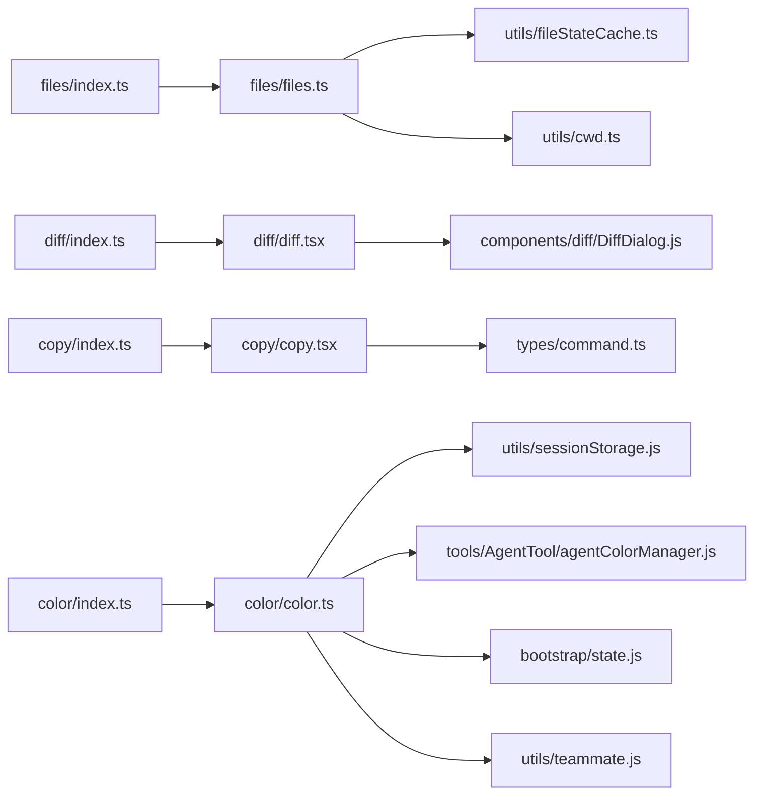

# 文件操作

<cite>
**本文引用的文件**
- [src/commands/files/index.ts](file://src/commands/files/index.ts)
- [src/commands/files/files.ts](file://src/commands/files/files.ts)
- [src/commands/diff/index.ts](file://src/commands/diff/index.ts)
- [src/commands/diff/diff.tsx](file://src/commands/diff/diff.tsx)
- [src/commands/copy/index.ts](file://src/commands/copy/index.ts)
- [src/commands/copy/copy.tsx](file://src/commands/copy/copy.tsx)
- [src/commands/color/index.ts](file://src/commands/color/index.ts)
- [src/commands/color/color.ts](file://src/commands/color/color.ts)
- [src/utils/fileStateCache.ts](file://src/utils/fileStateCache.ts)
- [src/utils/cwd.ts](file://src/utils/cwd.ts)
- [src/types/command.ts](file://src/types/command.ts)
- [src/components/diff/DiffDialog.js](file://src/components/diff/DiffDialog.js)
- [src/utils/sessionStorage.js](file://src/utils/sessionStorage.js)
- [src/tools/AgentTool/agentColorManager.js](file://src/tools/AgentTool/agentColorManager.js)
- [src/bootstrap/state.js](file://src/bootstrap/state.js)
- [src/utils/teammate.js](file://src/utils/teammate.js)
</cite>

## 目录
1. [简介](#简介)
2. [项目结构](#项目结构)
3. [核心组件](#核心组件)
4. [架构总览](#架构总览)
5. [详细组件分析](#详细组件分析)
6. [依赖关系分析](#依赖关系分析)
7. [性能考量](#性能考量)
8. [故障排查指南](#故障排查指南)
9. [结论](#结论)
10. [附录](#附录)

## 简介
本文件面向 Claude Code 的“文件操作”命令集合，聚焦以下四个命令：
- files：列出当前会话上下文中已加载的文件清单
- diff：查看未提交变更与按轮次的差异（以对话框形式展示）
- copy：将 Claude 最近一次回复内容复制到剪贴板或写入临时文件；支持选择性复制代码块
- color：设置当前会话提示栏的颜色（支持重置为默认）

文档将从命令入口、实现逻辑、参数与过滤、输出格式、路径与权限、安全限制、批量与正则匹配、编码与二进制处理、大文件策略、安全与最佳实践等维度进行系统化说明。

## 项目结构
围绕文件操作的命令入口与实现分布于 commands 子目录中，采用“延迟加载”的方式减少启动时的模块开销。files 与 color 为本地命令，diff 与 copy 为本地 JSX 命令，分别通过各自的 index.ts 暴露元信息并在运行时动态导入实现模块。

**图表来源**
- [src/commands/files/index.ts:1-13](file://src/commands/files/index.ts#L1-L13)
- [src/commands/files/files.ts:1-20](file://src/commands/files/files.ts#L1-L20)
- [src/commands/diff/index.ts:1-9](file://src/commands/diff/index.ts#L1-L9)
- [src/commands/diff/diff.tsx:1-9](file://src/commands/diff/diff.tsx#L1-L9)
- [src/commands/copy/index.ts:1-16](file://src/commands/copy/index.ts#L1-L16)
- [src/commands/copy/copy.tsx:1-371](file://src/commands/copy/copy.tsx#L1-L371)
- [src/commands/color/index.ts:1-17](file://src/commands/color/index.ts#L1-L17)
- [src/commands/color/color.ts:1-94](file://src/commands/color/color.ts#L1-L94)
- [src/utils/fileStateCache.ts](file://src/utils/fileStateCache.ts)
- [src/utils/cwd.ts](file://src/utils/cwd.ts)
- [src/types/command.ts](file://src/types/command.ts)
- [src/components/diff/DiffDialog.js](file://src/components/diff/DiffDialog.js)
- [src/utils/sessionStorage.js](file://src/utils/sessionStorage.js)
- [src/tools/AgentTool/agentColorManager.js](file://src/tools/AgentTool/agentColorManager.js)
- [src/bootstrap/state.js](file://src/bootstrap/state.js)
- [src/utils/teammate.js](file://src/utils/teammate.js)

**章节来源**
- [src/commands/files/index.ts:1-13](file://src/commands/files/index.ts#L1-L13)
- [src/commands/diff/index.ts:1-9](file://src/commands/diff/index.ts#L1-L9)
- [src/commands/copy/index.ts:1-16](file://src/commands/copy/index.ts#L1-L16)
- [src/commands/color/index.ts:1-17](file://src/commands/color/index.ts#L1-L17)

## 核心组件
- files 命令
  - 类型：本地命令
  - 功能：列出当前上下文中的文件路径
  - 关键实现：从上下文读取文件状态缓存键，计算相对路径并返回文本结果
  - 参考路径：[src/commands/files/files.ts:1-20](file://src/commands/files/files.ts#L1-L20)
- diff 命令
  - 类型：本地 JSX 命令
  - 功能：以对话框形式展示未提交变更与按轮次的差异
  - 关键实现：动态导入 DiffDialog 并传入消息上下文
  - 参考路径：[src/commands/diff/diff.tsx:1-9](file://src/commands/diff/diff.tsx#L1-L9)
- copy 命令
  - 类型：本地 JSX 命令
  - 功能：复制最近回复到剪贴板，或写入临时文件；可选择完整回复或代码块
  - 关键实现：解析消息、提取代码块、生成文件名、优先写剪贴板，失败时回退写临时文件
  - 参考路径：[src/commands/copy/copy.tsx:1-371](file://src/commands/copy/copy.tsx#L1-L371)
- color 命令
  - 类型：本地 JSX 命令（立即执行）
  - 功能：设置当前会话提示栏颜色，支持重置为默认
  - 关键实现：校验颜色是否在可用列表、保存到会话存储、更新应用状态
  - 参考路径：[src/commands/color/color.ts:1-94](file://src/commands/color/color.ts#L1-L94)

**章节来源**
- [src/commands/files/files.ts:1-20](file://src/commands/files/files.ts#L1-L20)
- [src/commands/diff/diff.tsx:1-9](file://src/commands/diff/diff.tsx#L1-L9)
- [src/commands/copy/copy.tsx:1-371](file://src/commands/copy/copy.tsx#L1-L371)
- [src/commands/color/color.ts:1-94](file://src/commands/color/color.ts#L1-L94)

## 架构总览
下图展示了文件相关命令的调用链路与关键依赖：

**图表来源**
- [src/commands/files/files.ts:1-20](file://src/commands/files/files.ts#L1-L20)
- [src/commands/diff/diff.tsx:1-9](file://src/commands/diff/diff.tsx#L1-L9)
- [src/commands/copy/copy.tsx:1-371](file://src/commands/copy/copy.tsx#L1-L371)
- [src/commands/color/color.ts:1-94](file://src/commands/color/color.ts#L1-L94)
- [src/types/command.ts](file://src/types/command.ts)
- [src/utils/fileStateCache.ts](file://src/utils/fileStateCache.ts)
- [src/utils/cwd.ts](file://src/utils/cwd.ts)
- [src/utils/sessionStorage.js](file://src/utils/sessionStorage.js)
- [src/components/diff/DiffDialog.js](file://src/components/diff/DiffDialog.js)

## 详细组件分析

### files 命令
- 命令入口与元数据
  - 入口文件：[src/commands/files/index.ts:1-13](file://src/commands/files/index.ts#L1-L13)
  - 类型：本地命令；支持非交互模式；启用条件：环境变量 USER_TYPE 为 ant
- 实现要点
  - 从上下文读取文件状态缓存键，映射为相对路径列表，拼接后返回文本结果
  - 若无文件，返回提示信息
  - 参考实现：[src/commands/files/files.ts:1-20](file://src/commands/files/files.ts#L1-L20)
- 参数与过滤
  - 无显式参数；过滤由上下文文件状态决定
- 输出格式
  - 文本：包含“Files in context:”前缀与换行分隔的文件列表
- 使用示例
  - 在支持的环境中直接输入 /files 查看当前上下文文件
- 路径处理
  - 使用相对路径展示，基于当前工作目录计算
  - 参考：[src/utils/cwd.ts](file://src/utils/cwd.ts)
- 权限与安全
  - 仅访问上下文内已加载文件，不进行外部文件系统操作
- 批量与筛选
  - 无内置批量/筛选能力；可通过上下文控制文件集合
- 编码与二进制
  - 仅输出路径字符串，不涉及内容读取
- 大文件处理
  - 列表输出，不受单文件大小影响

**图表来源**
- [src/commands/files/files.ts:1-20](file://src/commands/files/files.ts#L1-L20)
- [src/utils/fileStateCache.ts](file://src/utils/fileStateCache.ts)
- [src/utils/cwd.ts](file://src/utils/cwd.ts)

**章节来源**
- [src/commands/files/index.ts:1-13](file://src/commands/files/index.ts#L1-L13)
- [src/commands/files/files.ts:1-20](file://src/commands/files/files.ts#L1-L20)

### diff 命令
- 命令入口与元数据
  - 入口文件：[src/commands/diff/index.ts:1-9](file://src/commands/diff/index.ts#L1-L9)
  - 类型：本地 JSX 命令；动态导入实现
- 实现要点
  - 动态导入 DiffDialog 组件，传入消息上下文与完成回调
  - 参考实现：[src/commands/diff/diff.tsx:1-9](file://src/commands/diff/diff.tsx#L1-L9)
- 参数与过滤
  - 无显式参数；过滤由消息上下文决定
- 输出格式
  - JSX 组件，用于渲染差异对话框
- 使用示例
  - 输入 /diff 打开差异对话框
- 路径处理
  - 通过消息上下文间接关联文件变更
- 权限与安全
  - 仅渲染差异视图，不执行文件系统操作
- 批量与筛选
  - 无内置批量/筛选能力；由对话框内部逻辑呈现
- 编码与二进制
  - 无文件内容读取
- 大文件处理
  - 仅展示差异概览，不加载文件内容

**图表来源**
- [src/commands/diff/diff.tsx:1-9](file://src/commands/diff/diff.tsx#L1-L9)
- [src/components/diff/DiffDialog.js](file://src/components/diff/DiffDialog.js)

**章节来源**
- [src/commands/diff/index.ts:1-9](file://src/commands/diff/index.ts#L1-L9)
- [src/commands/diff/diff.tsx:1-9](file://src/commands/diff/diff.tsx#L1-L9)

### copy 命令
- 命令入口与元数据
  - 入口文件：[src/commands/copy/index.ts:1-16](file://src/commands/copy/index.ts#L1-L16)
  - 类型：本地 JSX 命令；延迟加载
- 实现要点
  - 收集最近的助手文本（最多 20 条），解析 Markdown 提取代码块
  - 支持 /copy 或 /copy N（N 为 1 表示最新，2 表示倒数第二条，依此类推）
  - 优先尝试写入剪贴板，失败时回退写入临时目录
  - 参考实现：[src/commands/copy/copy.tsx:1-371](file://src/commands/copy/copy.tsx#L1-L371)
- 参数与过滤
  - 可选参数 N：回溯消息序号
  - 过滤：仅对包含代码块的消息进行选择性复制
- 输出格式
  - 文本反馈：复制字符数与行数统计，以及临时文件路径
- 使用示例
  - /copy：复制最新回复（若包含代码块则弹出选择器）
  - /copy 2：复制倒数第二条回复
- 路径处理
  - 临时文件写入系统临时目录下的 claude 子目录
  - 文件名：response.md 或 copy.<语言后缀>
- 权限与安全
  - 仅写入临时目录；对语言标识进行清洗，防止路径穿越
- 批量与筛选
  - 无内置批量复制；可通过选择器逐个复制代码块
- 编码与二进制
  - 以 UTF-8 写入文本文件；不处理二进制文件
- 大文件处理
  - 通过剪贴板优先策略与临时文件回退，避免阻塞；对超长文本有截断显示

**图表来源**
- [src/commands/copy/copy.tsx:1-371](file://src/commands/copy/copy.tsx#L1-L371)

**章节来源**
- [src/commands/copy/index.ts:1-16](file://src/commands/copy/index.ts#L1-L16)
- [src/commands/copy/copy.tsx:1-371](file://src/commands/copy/copy.tsx#L1-L371)

### color 命令
- 命令入口与元数据
  - 入口文件：[src/commands/color/index.ts:1-17](file://src/commands/color/index.ts#L1-L17)
  - 类型：本地 JSX 命令（immediate=true）；延迟加载
- 实现要点
  - 校验是否为队友身份（队友不可自行设置颜色）
  - 支持颜色名称或重置别名（default/reset/none/gray/grey）
  - 将颜色持久化到会话存储，并更新应用状态
  - 参考实现：[src/commands/color/color.ts:1-94](file://src/commands/color/color.ts#L1-L94)
- 参数与过滤
  - 必填参数：颜色名称或重置别名
  - 过滤：颜色必须在可用列表中
- 输出格式
  - 文本反馈：成功或错误提示
- 使用示例
  - /color blue：设置为蓝色
  - /color default：重置为默认色
- 路径处理
  - 通过会话存储路径定位当前会话记录
- 权限与安全
  - 队友身份限制；颜色值来自受控列表
- 批量与筛选
  - 单会话颜色设置，无批量能力
- 编码与二进制
  - 无文件操作
- 大文件处理
  - 无适用场景

**图表来源**
- [src/commands/color/color.ts:1-94](file://src/commands/color/color.ts#L1-L94)
- [src/utils/sessionStorage.js](file://src/utils/sessionStorage.js)
- [src/tools/AgentTool/agentColorManager.js](file://src/tools/AgentTool/agentColorManager.js)
- [src/bootstrap/state.js](file://src/bootstrap/state.js)
- [src/utils/teammate.js](file://src/utils/teammate.js)

**章节来源**
- [src/commands/color/index.ts:1-17](file://src/commands/color/index.ts#L1-L17)
- [src/commands/color/color.ts:1-94](file://src/commands/color/color.ts#L1-L94)

## 依赖关系分析
- 命令入口与实现解耦：index.ts 仅定义元信息，call 函数在运行时动态导入
- 工具与类型：文件列表依赖文件状态缓存与当前工作目录；颜色命令依赖会话存储与颜色管理器
- UI 组件：diff 命令依赖 DiffDialog 组件

**图表来源**
- [src/commands/files/index.ts:1-13](file://src/commands/files/index.ts#L1-L13)
- [src/commands/files/files.ts:1-20](file://src/commands/files/files.ts#L1-L20)
- [src/commands/diff/index.ts:1-9](file://src/commands/diff/index.ts#L1-L9)
- [src/commands/diff/diff.tsx:1-9](file://src/commands/diff/diff.tsx#L1-L9)
- [src/commands/copy/index.ts:1-16](file://src/commands/copy/index.ts#L1-L16)
- [src/commands/copy/copy.tsx:1-371](file://src/commands/copy/copy.tsx#L1-L371)
- [src/commands/color/index.ts:1-17](file://src/commands/color/index.ts#L1-L17)
- [src/commands/color/color.ts:1-94](file://src/commands/color/color.ts#L1-L94)
- [src/utils/fileStateCache.ts](file://src/utils/fileStateCache.ts)
- [src/utils/cwd.ts](file://src/utils/cwd.ts)
- [src/types/command.ts](file://src/types/command.ts)
- [src/components/diff/DiffDialog.js](file://src/components/diff/DiffDialog.js)
- [src/utils/sessionStorage.js](file://src/utils/sessionStorage.js)
- [src/tools/AgentTool/agentColorManager.js](file://src/tools/AgentTool/agentColorManager.js)
- [src/bootstrap/state.js](file://src/bootstrap/state.js)
- [src/utils/teammate.js](file://src/utils/teammate.js)

**章节来源**
- [src/commands/files/index.ts:1-13](file://src/commands/files/index.ts#L1-L13)
- [src/commands/diff/index.ts:1-9](file://src/commands/diff/index.ts#L1-L9)
- [src/commands/copy/index.ts:1-16](file://src/commands/copy/index.ts#L1-L16)
- [src/commands/color/index.ts:1-17](file://src/commands/color/index.ts#L1-L17)

## 性能考量
- files：仅遍历上下文缓存键，时间复杂度 O(n)，空间复杂度 O(n)
- diff：渲染对话框，性能取决于消息数量与差异规模
- copy：优先写剪贴板，失败回退写文件；对超长文本有截断显示，避免阻塞
- color：纯内存操作，无 I/O 开销

## 故障排查指南
- files
  - 现象：返回“上下文无文件”
  - 排查：确认上下文是否已加载文件；检查 USER_TYPE 环境变量
  - 参考：[src/commands/files/files.ts:1-20](file://src/commands/files/files.ts#L1-L20)
- diff
  - 现象：无法打开差异对话框
  - 排查：确认消息上下文存在；检查组件导入路径
  - 参考：[src/commands/diff/diff.tsx:1-9](file://src/commands/diff/diff.tsx#L1-L9)
- copy
  - 现象：剪贴板失败但未写入文件
  - 排查：终端是否支持 OSC 52；临时目录权限；日志事件记录
  - 参考：[src/commands/copy/copy.tsx:1-371](file://src/commands/copy/copy.tsx#L1-L371)
- color
  - 现象：提示“此会话为群蜂队友，颜色由队长分配”
  - 排查：确认当前会话身份；仅独立代理可设置颜色
  - 参考：[src/commands/color/color.ts:1-94](file://src/commands/color/color.ts#L1-L94)

**章节来源**
- [src/commands/files/files.ts:1-20](file://src/commands/files/files.ts#L1-L20)
- [src/commands/diff/diff.tsx:1-9](file://src/commands/diff/diff.tsx#L1-L9)
- [src/commands/copy/copy.tsx:1-371](file://src/commands/copy/copy.tsx#L1-L371)
- [src/commands/color/color.ts:1-94](file://src/commands/color/color.ts#L1-L94)

## 结论
本文档系统梳理了 Claude Code 中与文件相关的四个命令：files、diff、copy、color。它们通过延迟加载与上下文驱动的方式实现最小化启动成本与高安全性。files 用于快速查看上下文文件；diff 以可视化方式呈现变更；copy 提供便捷的复制与落盘能力；color 则支持会话级外观定制。建议在实际使用中结合上下文与权限约束，遵循安全与最佳实践，确保操作稳定与可追溯。

## 附录
- 正则表达式与匹配
  - copy 命令在生成文件扩展名时对语言标识进行清洗，避免非法字符与路径穿越
  - 参考：[src/commands/copy/copy.tsx:62-72](file://src/commands/copy/copy.tsx#L62-L72)
- 文件类型筛选
  - 通过代码块解析与语言标识判断，仅对包含代码块的消息提供选择性复制
  - 参考：[src/commands/copy/copy.tsx:30-43](file://src/commands/copy/copy.tsx#L30-L43)
- 编码与二进制
  - 以 UTF-8 写入文本文件；未实现二进制文件处理
  - 参考：[src/commands/copy/copy.tsx:73-80](file://src/commands/copy/copy.tsx#L73-L80)
- 大文件处理策略
  - 优先剪贴板写入，失败回退临时文件；对超长文本进行截断显示
  - 参考：[src/commands/copy/copy.tsx:95-110](file://src/commands/copy/copy.tsx#L95-L110)