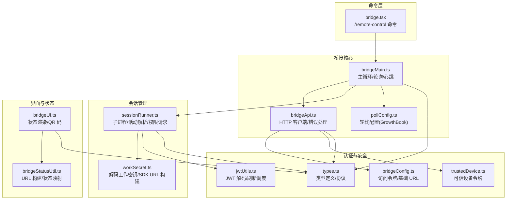
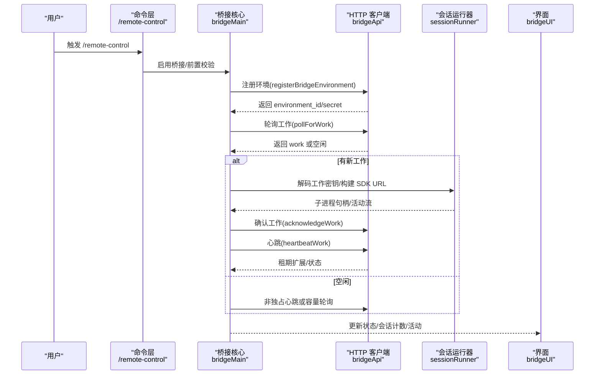
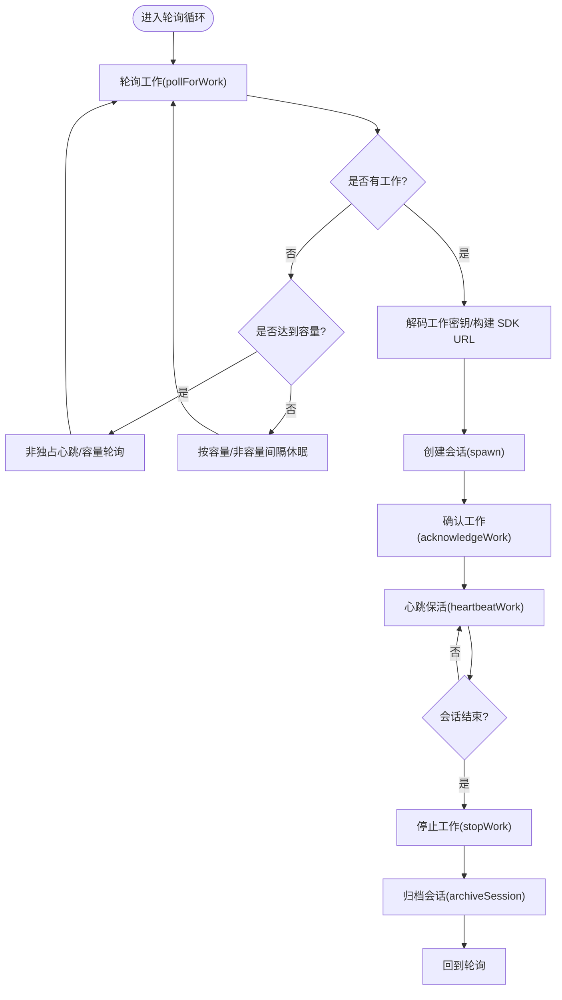
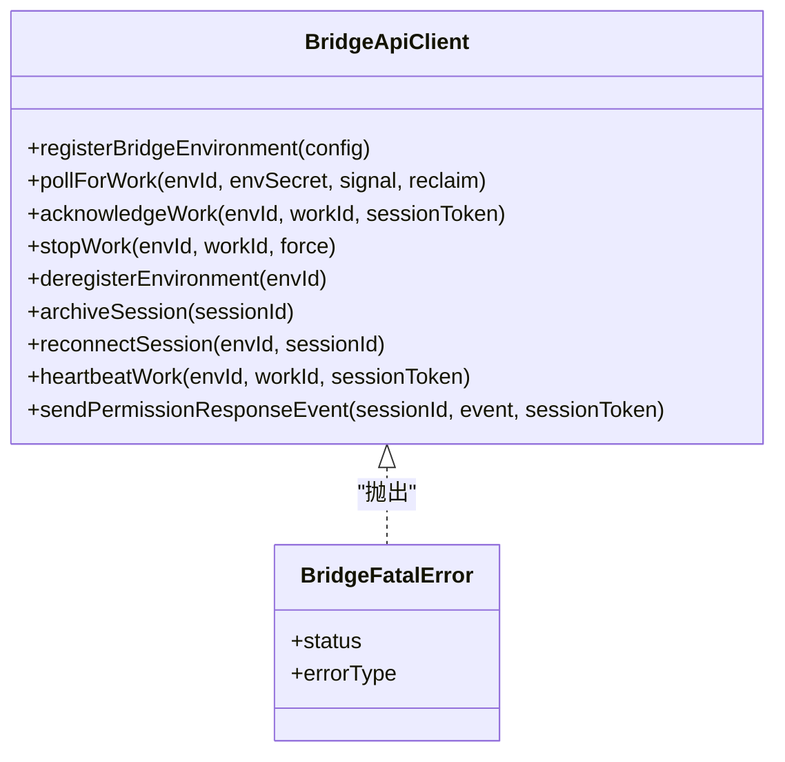
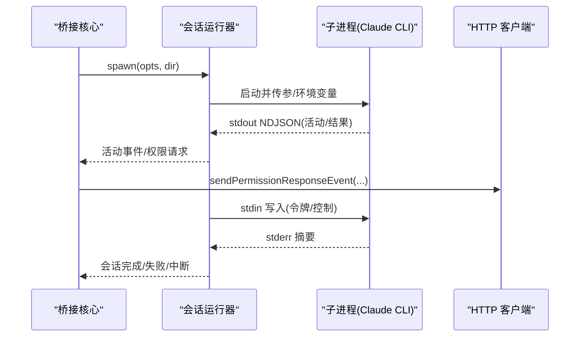
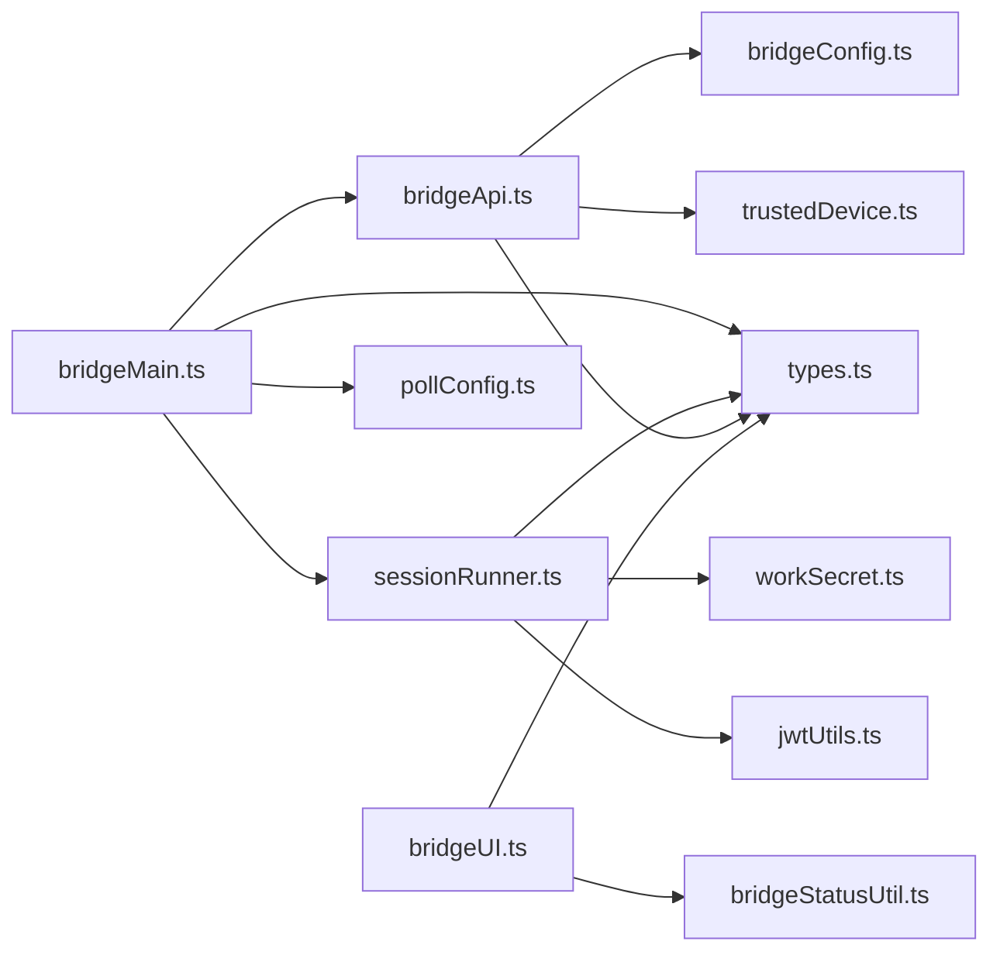

# 远程桥接

<cite>
**本文引用的文件**
- [bridgeMain.ts](file://src/bridge/bridgeMain.ts)
- [bridgeApi.ts](file://src/bridge/bridgeApi.ts)
- [bridgeUI.ts](file://src/bridge/bridgeUI.ts)
- [sessionRunner.ts](file://src/bridge/sessionRunner.ts)
- [workSecret.ts](file://src/bridge/workSecret.ts)
- [bridgeConfig.ts](file://src/bridge/bridgeConfig.ts)
- [types.ts](file://src/bridge/types.ts)
- [pollConfig.ts](file://src/bridge/pollConfig.ts)
- [bridgeStatusUtil.ts](file://src/bridge/bridgeStatusUtil.ts)
- [trustedDevice.ts](file://src/bridge/trustedDevice.ts)
- [jwtUtils.ts](file://src/bridge/jwtUtils.ts)
- [bridge.tsx](file://src/commands/bridge/bridge.tsx)
</cite>

## 目录
1. [简介](#简介)
2. [项目结构](#项目结构)
3. [核心组件](#核心组件)
4. [架构总览](#架构总览)
5. [详细组件分析](#详细组件分析)
6. [依赖关系分析](#依赖关系分析)
7. [性能考量](#性能考量)
8. [故障排除指南](#故障排除指南)
9. [结论](#结论)
10. [附录](#附录)

## 简介
本文件系统性阐述 Claude Code 的“远程桥接”能力，围绕 bridge 命令、桥接状态检查、远程会话管理与桥接配置展开，详细说明桥接协议、连接建立与会话同步机制，解释远程控制权限、安全认证与访问控制，提供部署、网络配置与故障排除指南，并总结性能优化、连接稳定性与数据传输安全的最佳实践。

## 项目结构
远程桥接相关代码集中在 src/bridge 目录，命令入口位于 src/commands/bridge/bridge.tsx。整体采用分层设计：命令层负责用户交互与前置校验；桥接核心负责环境注册、工作轮询、心跳与会话生命周期管理；会话运行器负责子进程启动、活动解析与权限请求转发；UI 层负责状态展示与 QR 码生成；配置与工具模块提供认证、JWT 解析、可信设备令牌等支撑能力。

图表来源
- [bridgeMain.ts:141-800](file://src/bridge/bridgeMain.ts#L141-L800)
- [bridgeApi.ts:68-452](file://src/bridge/bridgeApi.ts#L68-L452)
- [sessionRunner.ts:248-547](file://src/bridge/sessionRunner.ts#L248-L547)
- [workSecret.ts:6-87](file://src/bridge/workSecret.ts#L6-L87)
- [bridgeUI.ts:42-531](file://src/bridge/bridgeUI.ts#L42-L531)
- [bridgeStatusUtil.ts:38-58](file://src/bridge/bridgeStatusUtil.ts#L38-L58)
- [pollConfig.ts:102-111](file://src/bridge/pollConfig.ts#L102-L111)
- [bridgeConfig.ts:38-48](file://src/bridge/bridgeConfig.ts#L38-L48)
- [trustedDevice.ts:54-87](file://src/bridge/trustedDevice.ts#L54-L87)
- [jwtUtils.ts:72-256](file://src/bridge/jwtUtils.ts#L72-L256)
- [types.ts:133-262](file://src/bridge/types.ts#L133-L262)
- [bridge.tsx:38-140](file://src/commands/bridge/bridge.tsx#L38-L140)

章节来源
- [bridge.tsx:38-140](file://src/commands/bridge/bridge.tsx#L38-L140)
- [bridgeMain.ts:141-800](file://src/bridge/bridgeMain.ts#L141-L800)
- [bridgeApi.ts:68-452](file://src/bridge/bridgeApi.ts#L68-L452)
- [sessionRunner.ts:248-547](file://src/bridge/sessionRunner.ts#L248-L547)
- [workSecret.ts:6-87](file://src/bridge/workSecret.ts#L6-L87)
- [bridgeUI.ts:42-531](file://src/bridge/bridgeUI.ts#L42-L531)
- [bridgeStatusUtil.ts:38-58](file://src/bridge/bridgeStatusUtil.ts#L38-L58)
- [pollConfig.ts:102-111](file://src/bridge/pollConfig.ts#L102-L111)
- [bridgeConfig.ts:38-48](file://src/bridge/bridgeConfig.ts#L38-L48)
- [trustedDevice.ts:54-87](file://src/bridge/trustedDevice.ts#L54-L87)
- [jwtUtils.ts:72-256](file://src/bridge/jwtUtils.ts#L72-L256)
- [types.ts:133-262](file://src/bridge/types.ts#L133-L262)

## 核心组件
- 桥接主循环与轮询：负责环境注册、工作轮询、心跳保活、容量模式下的非独占心跳与按需轮询、会话完成清理与归档。
- HTTP 客户端：封装 OAuth 认证、重试与 401 刷新、统一错误处理、ID 校验与安全路径拼接。
- 会话运行器：子进程启动、NDJSON 输出解析、活动追踪、权限请求转发、stdin 控制与令牌热更新。
- 工作密钥与 SDK URL：解码工作密钥、构建 WebSocket/SSE 入口 URL、兼容不同 ID 前缀。
- UI 与状态：状态机渲染、QR 码生成、会话计数与活动列表、失败/重连提示。
- 配置与工具：访问令牌与基础 URL 解析、GrowthBook 轮询配置、JWT 解码与刷新调度、可信设备令牌。
- 命令入口：/remote-control 命令前置校验（策略、版本、登录态）、触发桥接启用与断开。

章节来源
- [bridgeMain.ts:141-800](file://src/bridge/bridgeMain.ts#L141-L800)
- [bridgeApi.ts:68-452](file://src/bridge/bridgeApi.ts#L68-L452)
- [sessionRunner.ts:248-547](file://src/bridge/sessionRunner.ts#L248-L547)
- [workSecret.ts:6-87](file://src/bridge/workSecret.ts#L6-L87)
- [bridgeUI.ts:42-531](file://src/bridge/bridgeUI.ts#L42-L531)
- [pollConfig.ts:102-111](file://src/bridge/pollConfig.ts#L102-L111)
- [bridgeConfig.ts:38-48](file://src/bridge/bridgeConfig.ts#L38-L48)
- [jwtUtils.ts:72-256](file://src/bridge/jwtUtils.ts#L72-L256)
- [trustedDevice.ts:54-87](file://src/bridge/trustedDevice.ts#L54-L87)
- [bridge.tsx:467-504](file://src/commands/bridge/bridge.tsx#L467-L504)

## 架构总览
远程桥接通过“命令层 → 桥接核心 → 会话管理 → 界面与状态”的链路实现双向通信与会话生命周期管理。桥接核心以可配置的轮询与心跳策略维持长连接，会话运行器在本地子进程中执行工具调用并上报活动，UI 层实时反馈状态与交互入口。

图表来源
- [bridge.tsx:467-504](file://src/commands/bridge/bridge.tsx#L467-L504)
- [bridgeMain.ts:141-800](file://src/bridge/bridgeMain.ts#L141-L800)
- [bridgeApi.ts:141-451](file://src/bridge/bridgeApi.ts#L141-L451)
- [sessionRunner.ts:248-547](file://src/bridge/sessionRunner.ts#L248-L547)
- [bridgeUI.ts:294-531](file://src/bridge/bridgeUI.ts#L294-L531)

## 详细组件分析

### 组件 A：桥接主循环与轮询（bridgeMain）
- 环境注册与重连：使用 OAuth 令牌注册环境，支持复用旧的 environment_id 以实现断线重连。
- 工作轮询与去重：轮询返回的工作若已停止则跳过重复创建；支持 reclaim_older_than_ms 参数避免重复投递。
- 心跳与鉴权：对活跃会话进行心跳保活；当会话 JWT 过期时触发服务端重新派发工作。
- 容量模式：多会话模式下，空闲时进入非独占心跳或容量轮询，避免过度轮询；容量变化时及时退出休眠。
- 会话生命周期：记录会话开始时间、活动轨迹、stderr 摘要；会话结束时停止工作、清理工作树、归档会话。
- 令牌刷新：为 v1 会话直接更新子进程 access token；为 v2 会话通过 reconnectSession 触发服务端重新派发。
- 错误预算与睡眠检测：基于最大退避上限两倍阈值检测系统休眠，防止误判导致的无限重试。

图表来源
- [bridgeMain.ts:141-800](file://src/bridge/bridgeMain.ts#L141-L800)
- [bridgeApi.ts:199-417](file://src/bridge/bridgeApi.ts#L199-L417)

章节来源
- [bridgeMain.ts:141-800](file://src/bridge/bridgeMain.ts#L141-L800)
- [bridgeApi.ts:199-417](file://src/bridge/bridgeApi.ts#L199-L417)

### 组件 B：HTTP 客户端与错误处理（bridgeApi）
- 认证与重试：统一携带 OAuth 令牌与 Anthropic 版本头；401 时尝试刷新并重试一次。
- 错误分类：区分 401/403/404/410 等错误类型，抛出 BridgeFatalError 并附带错误类型；429 限流明确提示。
- 安全校验：对服务端返回的 ID 进行安全字符集校验，防止路径注入。
- 接口覆盖：注册环境、轮询工作、确认工作、停止工作、注销环境、归档会话、重新连接会话、心跳保活、发送权限响应事件。

图表来源
- [bridgeApi.ts:68-452](file://src/bridge/bridgeApi.ts#L68-L452)
- [types.ts:133-176](file://src/bridge/types.ts#L133-L176)

章节来源
- [bridgeApi.ts:68-452](file://src/bridge/bridgeApi.ts#L68-L452)
- [types.ts:133-176](file://src/bridge/types.ts#L133-L176)

### 组件 C：会话运行器（sessionRunner）
- 子进程启动：根据参数与环境变量启动子进程，剥离父进程 OAuth 令牌，注入会话访问令牌。
- NDJSON 解析：从 stdout 流解析 assistant/text/result 等消息，提取工具调用活动摘要。
- 权限请求：识别 control_request 并转发到服务器等待决策；支持 replay 用户消息首条文本用于标题推断。
- 令牌热更新：通过 stdin 发送 update_environment_variables 消息，动态替换会话访问令牌。
- 日志与转录：可选写入转录文件与调试日志，便于问题排查。

图表来源
- [sessionRunner.ts:248-547](file://src/bridge/sessionRunner.ts#L248-L547)
- [bridgeApi.ts:419-451](file://src/bridge/bridgeApi.ts#L419-L451)

章节来源
- [sessionRunner.ts:248-547](file://src/bridge/sessionRunner.ts#L248-L547)
- [bridgeApi.ts:419-451](file://src/bridge/bridgeApi.ts#L419-L451)

### 组件 D：工作密钥与 SDK URL（workSecret）
- 工作密钥解码：校验版本与必要字段，提取会话入口令牌、API 基础 URL、源信息与认证信息。
- SDK URL 构建：根据是否本地环境选择 ws/wss 与 v1/v2 路径；v2 使用 HTTP(S) URL 指向 /v1/code/sessions/{id}。
- ID 兼容：比较 session_id 时忽略前缀差异，确保 v1/v2 兼容。

章节来源
- [workSecret.ts:6-87](file://src/bridge/workSecret.ts#L6-L87)

### 组件 E：UI 与状态（bridgeUI）
- 状态机：idle/attached/titled/reconnecting/failed，结合工具活动显示与闪烁动画。
- QR 码：根据当前 URL 动态生成二维码，支持切换显示。
- 会话计数：多会话模式下显示容量与活动列表；单会话模式下显示标题与模式提示。
- 日志输出：支持详细日志打印与错误提示，便于诊断。

章节来源
- [bridgeUI.ts:42-531](file://src/bridge/bridgeUI.ts#L42-L531)
- [bridgeStatusUtil.ts:38-58](file://src/bridge/bridgeStatusUtil.ts#L38-L58)

### 组件 F：轮询配置（pollConfig）
- GrowthBook 配置：定义轮询间隔、容量模式间隔、非独占心跳间隔、回收窗口、会话保活间隔等，含最小值约束与对象级互斥校验。
- 默认回退：配置不合法或缺失时回退到默认值，保证系统稳定。

章节来源
- [pollConfig.ts:28-92](file://src/bridge/pollConfig.ts#L28-L92)
- [pollConfig.ts:102-111](file://src/bridge/pollConfig.ts#L102-L111)

### 组件 G：认证与安全（bridgeConfig、trustedDevice、jwtUtils）
- 访问令牌：优先使用开发覆盖变量，否则从 OAuth 存储中读取；提供基础 URL 解析。
- 可信设备令牌：在门控开启时从安全存储读取持久化令牌，用于 Elevated Security Tier 的桥接请求头。
- JWT 解码与刷新：解码 JWT payload/exp，创建刷新调度器，定时在到期前刷新 OAuth 令牌并通知会话运行器。

章节来源
- [bridgeConfig.ts:38-48](file://src/bridge/bridgeConfig.ts#L38-L48)
- [trustedDevice.ts:54-87](file://src/bridge/trustedDevice.ts#L54-L87)
- [jwtUtils.ts:72-256](file://src/bridge/jwtUtils.ts#L72-L256)

### 组件 H：命令入口（bridge.tsx）
- 前置校验：组织策略限制、桥接禁用原因、版本要求、登录态检查；支持 KAIROS 助手模式强制走 v1。
- 启用/断开：设置 AppState 中的桥接标志位，触发 REPL 桥接初始化；断开时清理状态并提示。

章节来源
- [bridge.tsx:467-504](file://src/commands/bridge/bridge.tsx#L467-L504)

## 依赖关系分析
- 模块内聚：bridgeMain 依赖 bridgeApi、sessionRunner、pollConfig、types；sessionRunner 依赖 workSecret、types；bridgeUI 依赖 bridgeStatusUtil、types。
- 外部依赖：axios（HTTP）、qrcode（QR 码）、lodash-es（memoize）、chalk（终端渲染）。
- 低耦合：通过接口类型（BridgeApiClient、SessionSpawner、BridgeLogger）隔离具体实现，便于测试与替换。

图表来源
- [bridgeMain.ts:141-800](file://src/bridge/bridgeMain.ts#L141-L800)
- [bridgeApi.ts:68-452](file://src/bridge/bridgeApi.ts#L68-L452)
- [sessionRunner.ts:248-547](file://src/bridge/sessionRunner.ts#L248-L547)
- [workSecret.ts:6-87](file://src/bridge/workSecret.ts#L6-L87)
- [bridgeUI.ts:42-531](file://src/bridge/bridgeUI.ts#L42-L531)
- [bridgeStatusUtil.ts:38-58](file://src/bridge/bridgeStatusUtil.ts#L38-L58)
- [pollConfig.ts:102-111](file://src/bridge/pollConfig.ts#L102-L111)
- [bridgeConfig.ts:38-48](file://src/bridge/bridgeConfig.ts#L38-L48)
- [trustedDevice.ts:54-87](file://src/bridge/trustedDevice.ts#L54-L87)
- [jwtUtils.ts:72-256](file://src/bridge/jwtUtils.ts#L72-L256)
- [types.ts:133-262](file://src/bridge/types.ts#L133-L262)

## 性能考量
- 轮询与心跳：通过非独占心跳与容量轮询减少不必要的 HTTP 请求；GrowthBook 配置支持动态调整，避免过载。
- 令牌刷新：提前 5 分钟刷新 OAuth 令牌，避免会话中断；长时会话设置 30 分钟回退刷新，确保稳定性。
- 会话超时：默认 24 小时超时，超时后自动终止并清理资源，防止僵尸进程。
- 日志与转录：仅在需要时启用调试文件与转录，降低 IO 压力。

## 故障排除指南
- 登录态缺失：出现“必须登录”提示时，先执行登录命令再重试。
- 权限不足：403 错误可能由角色缺少 environments:manage 或外部轮询权限导致，检查组织策略与角色。
- 会话过期：404/410 表示环境或会话过期，需重启 /remote-control 或重新连接。
- 限流：429 提示轮询过于频繁，适当增大轮询间隔。
- 令牌刷新失败：检查 OAuth 令牌可用性与网络连通性；查看刷新失败次数与重试逻辑。
- 可信设备：在门控开启时，确保已成功注册可信设备令牌并在安全存储中。

章节来源
- [bridgeApi.ts:454-500](file://src/bridge/bridgeApi.ts#L454-L500)
- [jwtUtils.ts:165-230](file://src/bridge/jwtUtils.ts#L165-L230)
- [trustedDevice.ts:98-211](file://src/bridge/trustedDevice.ts#L98-L211)

## 结论
远程桥接通过严格的认证与安全机制、灵活的轮询与心跳策略、完善的会话生命周期管理与 UI 反馈，实现了稳定可靠的远程控制体验。建议在生产环境中启用可信设备令牌、合理配置轮询参数、关注令牌刷新与会话超时，以获得最佳性能与安全性。

## 附录

### 命令与功能速查
- /remote-control：启用/断开远程桥接，前置校验组织策略、版本与登录态。
- 环境注册：registerBridgeEnvironment，支持复用旧环境 ID。
- 工作轮询：pollForWork，支持 reclaim_older_than_ms。
- 会话确认：acknowledgeWork，心跳保活：heartbeatWork。
- 会话管理：stopWork、archiveSession、reconnectSession。
- 会话运行：spawn、活动解析、权限请求转发、令牌热更新。

章节来源
- [bridge.tsx:467-504](file://src/commands/bridge/bridge.tsx#L467-L504)
- [bridgeApi.ts:141-451](file://src/bridge/bridgeApi.ts#L141-L451)
- [sessionRunner.ts:248-547](file://src/bridge/sessionRunner.ts#L248-L547)