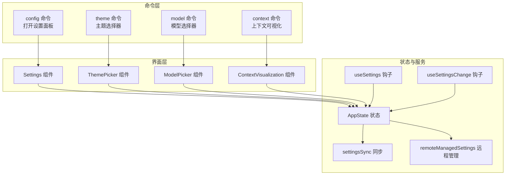
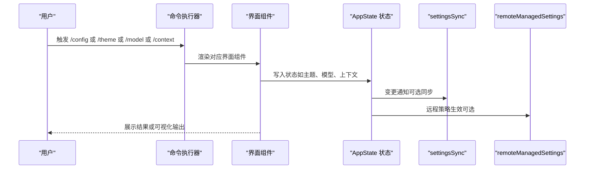
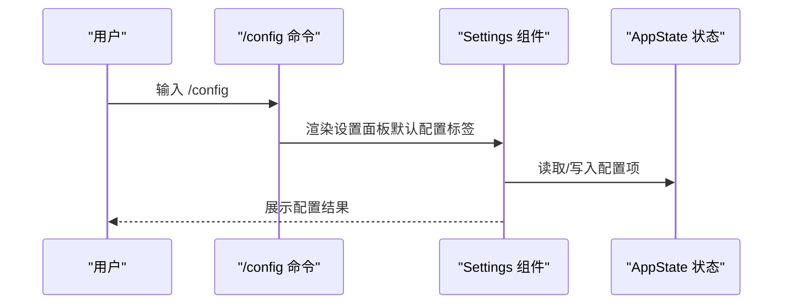
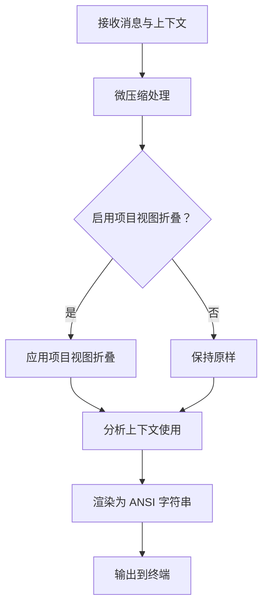
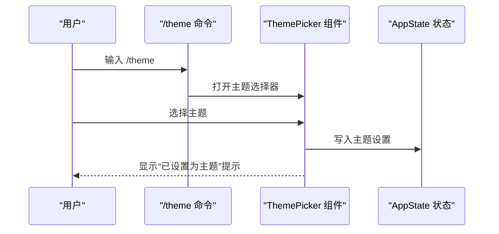
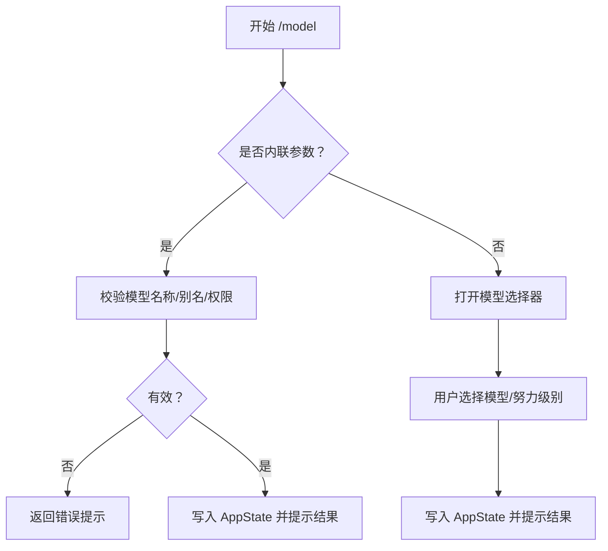
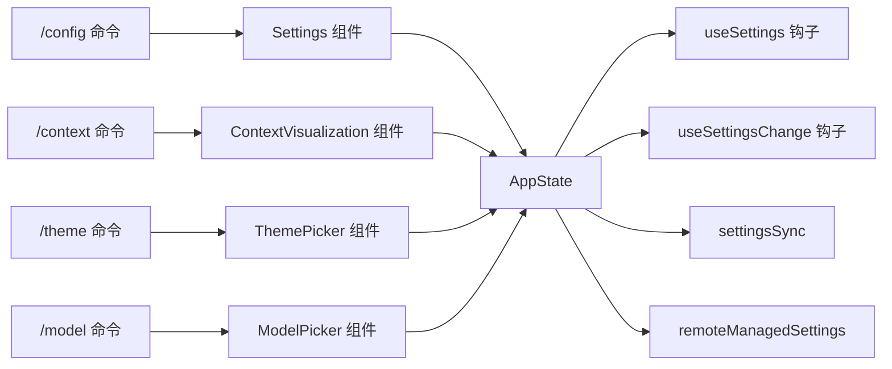

# 配置管理

<cite>
**本文引用的文件**
- [src/commands/config/index.ts](file://src/commands/config/index.ts)
- [src/commands/config/config.tsx](file://src/commands/config/config.tsx)
- [src/commands/context/index.ts](file://src/commands/context/index.ts)
- [src/commands/context/context.tsx](file://src/commands/context/context.tsx)
- [src/commands/theme/index.ts](file://src/commands/theme/index.ts)
- [src/commands/theme/theme.tsx](file://src/commands/theme/theme.tsx)
- [src/commands/model/model.tsx](file://src/commands/model/model.tsx)
- [src/components/Settings/Settings.tsx](file://src/components/Settings/Settings.tsx)
- [src/components/ThemePicker.tsx](file://src/components/ThemePicker.tsx)
- [src/components/ModelPicker.tsx](file://src/components/ModelPicker.tsx)
- [src/state/AppState.tsx](file://src/state/AppState.tsx)
- [src/hooks/useSettings.ts](file://src/hooks/useSettings.ts)
- [src/hooks/useSettingsChange.ts](file://src/hooks/useSettingsChange.ts)
- [src/services/settingsSync/settingsSync.ts](file://src/services/settingsSync/settingsSync.ts)
- [src/services/remoteManagedSettings/remoteManagedSettings.ts](file://src/services/remoteManagedSettings/remoteManagedSettings.ts)
- [src/migrations/migrateLegacyOpusToCurrent.ts](file://src/migrations/migrateLegacyOpusToCurrent.ts)
- [src/migrations/migrateSonnet45ToSonnet46.ts](file://src/migrations/migrateSonnet45ToSonnet46.ts)
- [src/utils/model/model.ts](file://src/utils/model/model.ts)
- [src/utils/model/validateModel.ts](file://src/utils/model/validateModel.ts)
- [src/utils/model/modelAllowlist.ts](file://src/utils/model/modelAllowlist.ts)
- [src/utils/model/check1mAccess.ts](file://src/utils/model/check1mAccess.ts)
- [src/utils/fastMode.ts](file://src/utils/fastMode.ts)
- [src/utils/effort.ts](file://src/utils/effort.ts)
- [src/utils/extraUsage.ts](file://src/utils/extraUsage.ts)
- [src/constants/xml.ts](file://src/constants/xml.ts)
- [src/services/analytics/index.ts](file://src/services/analytics/index.ts)
- [src/bootstrap/state.ts](file://src/bootstrap/state.ts)
- [src/utils/analyzeContext.ts](file://src/utils/analyzeContext.ts)
- [src/utils/messages.ts](file://src/utils/messages.ts)
- [src/utils/staticRender.ts](file://src/utils/staticRender.ts)
- [src/components/ContextVisualization.tsx](file://src/components/ContextVisualization.tsx)
- [src/services/contextCollapse/operations.ts](file://src/services/contextCollapse/operations.ts)
- [src/services/compact/microCompact.ts](file://src/services/compact/microCompact.ts)
</cite>

## 目录
1. [简介](#简介)
2. [项目结构](#项目结构)
3. [核心组件](#核心组件)
4. [架构总览](#架构总览)
5. [详细组件分析](#详细组件分析)
6. [依赖分析](#依赖分析)
7. [性能考虑](#性能考虑)
8. [故障排查指南](#故障排查指南)
9. [结论](#结论)
10. [附录](#附录)

## 简介
本文件系统性梳理 Claude Code 的配置管理命令与机制，重点覆盖以下命令族：
- 配置查看与修改：config 命令（别名 settings）
- 上下文可视化：context 命令
- 主题设置：theme 命令
- 模型选择：model 命令

文档将从配置层次结构、优先级与继承关系入手，解释配置文件格式、环境变量覆盖与动态更新机制；并提供备份、迁移与版本管理方法，以及配置验证、错误检测与回滚策略；最后总结安全与权限控制的最佳实践。

## 项目结构
围绕配置管理的关键目录与文件如下：
- 命令入口与实现：src/commands/config、src/commands/context、src/commands/theme、src/commands/model
- 设置界面与交互：src/components/Settings、src/components/ThemePicker、src/components/ModelPicker
- 应用状态与钩子：src/state/AppState.tsx、src/hooks/useSettings.ts、src/hooks/useSettingsChange.ts
- 同步与远程管理：src/services/settingsSync、src/services/remoteManagedSettings
- 迁移与兼容：src/migrations
- 模型与上下文工具：src/utils/model、src/utils/fastMode、src/utils/analyzeContext 等

图表来源
- [src/commands/config/config.tsx:1-7](file://src/commands/config/config.tsx#L1-L7)
- [src/commands/context/context.tsx:1-64](file://src/commands/context/context.tsx#L1-L64)
- [src/commands/theme/theme.tsx:1-57](file://src/commands/theme/theme.tsx#L1-L57)
- [src/commands/model/model.tsx:1-297](file://src/commands/model/model.tsx#L1-L297)
- [src/components/Settings/Settings.tsx](file://src/components/Settings/Settings.tsx)
- [src/components/ThemePicker.tsx](file://src/components/ThemePicker.tsx)
- [src/components/ModelPicker.tsx](file://src/components/ModelPicker.tsx)
- [src/components/ContextVisualization.tsx](file://src/components/ContextVisualization.tsx)
- [src/state/AppState.tsx](file://src/state/AppState.tsx)
- [src/hooks/useSettings.ts](file://src/hooks/useSettings.ts)
- [src/hooks/useSettingsChange.ts](file://src/hooks/useSettingsChange.ts)
- [src/services/settingsSync/settingsSync.ts](file://src/services/settingsSync/settingsSync.ts)
- [src/services/remoteManagedSettings/remoteManagedSettings.ts](file://src/services/remoteManagedSettings/remoteManagedSettings.ts)

章节来源
- [src/commands/config/index.ts:1-11](file://src/commands/config/index.ts#L1-L11)
- [src/commands/context/index.ts:1-24](file://src/commands/context/index.ts#L1-L24)
- [src/commands/theme/index.ts:1-10](file://src/commands/theme/index.ts#L1-L10)
- [src/commands/model/model.tsx:1-297](file://src/commands/model/model.tsx#L1-L297)

## 核心组件
- config 命令：通过本地 JSX 命令加载设置面板，默认选中“配置”标签页，便于统一查看与修改各类设置。
- context 命令：在终端内渲染当前对话上下文的可视化网格，帮助用户理解模型实际看到的内容与令牌使用情况。
- theme 命令：调用主题选择器，支持多种主题模式（含自动匹配终端、色弱友好、纯 ANSI），即时应用并持久化。
- model 命令：提供模型选择菜单与内联设置能力，支持快速切换、会话覆盖、努力级别与快模式联动提示。

章节来源
- [src/commands/config/config.tsx:1-7](file://src/commands/config/config.tsx#L1-L7)
- [src/commands/context/context.tsx:1-64](file://src/commands/context/context.tsx#L1-L64)
- [src/commands/theme/theme.tsx:1-57](file://src/commands/theme/theme.tsx#L1-L57)
- [src/commands/model/model.tsx:1-297](file://src/commands/model/model.tsx#L1-L297)

## 架构总览
配置管理采用“命令层 → 界面层 → 状态与服务”的分层设计：
- 命令层负责入口与参数解析，触发对应界面组件。
- 界面层封装交互逻辑，直接或间接写入应用状态。
- 状态与服务层维护全局状态、同步与远程策略，并提供钩子以响应变更。

图表来源
- [src/commands/config/config.tsx:1-7](file://src/commands/config/config.tsx#L1-L7)
- [src/commands/theme/theme.tsx:1-57](file://src/commands/theme/theme.tsx#L1-L57)
- [src/commands/model/model.tsx:1-297](file://src/commands/model/model.tsx#L1-L297)
- [src/commands/context/context.tsx:1-64](file://src/commands/context/context.tsx#L1-L64)
- [src/state/AppState.tsx](file://src/state/AppState.tsx)
- [src/services/settingsSync/settingsSync.ts](file://src/services/settingsSync/settingsSync.ts)
- [src/services/remoteManagedSettings/remoteManagedSettings.ts](file://src/services/remoteManagedSettings/remoteManagedSettings.ts)

## 详细组件分析

### config 命令：设置面板
- 入口定义：命令类型为本地 JSX，加载设置组件并将默认标签设为“配置”，便于集中管理。
- 交互行为：通过 onDone 回调关闭命令并返回状态摘要。
- 关联组件：Settings 组件承载具体设置项与子面板。

图表来源
- [src/commands/config/index.ts:1-11](file://src/commands/config/index.ts#L1-L11)
- [src/commands/config/config.tsx:1-7](file://src/commands/config/config.tsx#L1-L7)
- [src/components/Settings/Settings.tsx](file://src/components/Settings/Settings.tsx)

章节来源
- [src/commands/config/index.ts:1-11](file://src/commands/config/index.ts#L1-L11)
- [src/commands/config/config.tsx:1-7](file://src/commands/config/config.tsx#L1-L7)

### context 命令：上下文可视化
- 数据准备：对消息进行微压缩与项目视图折叠，确保与 API 实际输入一致。
- 分析与渲染：计算上下文使用情况，生成 ANSI 字符串并在非交互环境中输出。
- 交互体验：在交互式终端中以彩色网格直观展示令牌分布与折叠信息。

图表来源
- [src/commands/context/context.tsx:1-64](file://src/commands/context/context.tsx#L1-L64)
- [src/utils/analyzeContext.ts](file://src/utils/analyzeContext.ts)
- [src/utils/messages.ts](file://src/utils/messages.ts)
- [src/utils/staticRender.ts](file://src/utils/staticRender.ts)
- [src/services/contextCollapse/operations.ts](file://src/services/contextCollapse/operations.ts)
- [src/services/compact/microCompact.ts](file://src/services/compact/microCompact.ts)

章节来源
- [src/commands/context/index.ts:1-24](file://src/commands/context/index.ts#L1-L24)
- [src/commands/context/context.tsx:1-64](file://src/commands/context/context.tsx#L1-L64)

### theme 命令：主题设置
- 交互流程：调用主题选择器，用户选择后立即应用并回调确认消息。
- 主题持久化：通过主题提供者与状态写入，保存当前主题设置。
- 支持模式：自动（匹配终端）、深色、浅色、色弱友好、纯 ANSI 等。

图表来源
- [src/commands/theme/index.ts:1-10](file://src/commands/theme/index.ts#L1-L10)
- [src/commands/theme/theme.tsx:1-57](file://src/commands/theme/theme.tsx#L1-L57)
- [src/components/ThemePicker.tsx](file://src/components/ThemePicker.tsx)
- [src/state/AppState.tsx](file://src/state/AppState.tsx)

章节来源
- [src/commands/theme/index.ts:1-10](file://src/commands/theme/index.ts#L1-L10)
- [src/commands/theme/theme.tsx:1-57](file://src/commands/theme/theme.tsx#L1-L57)

### model 命令：模型选择与会话覆盖
- 菜单与内联：支持打开模型选择器或直接设置模型名称。
- 权限与可用性：检查组织限制、1M 上下文访问权限与模型别名有效性。
- 快模式联动：根据所选模型自动调整快模式状态，并提示额外计费标记。
- 会话覆盖：在计划模式等场景下，支持会话级覆盖并显示基础模型。

图表来源
- [src/commands/model/model.tsx:1-297](file://src/commands/model/model.tsx#L1-L297)
- [src/utils/model/model.ts](file://src/utils/model/model.ts)
- [src/utils/model/validateModel.ts](file://src/utils/model/validateModel.ts)
- [src/utils/model/modelAllowlist.ts](file://src/utils/model/modelAllowlist.ts)
- [src/utils/model/check1mAccess.ts](file://src/utils/model/check1mAccess.ts)
- [src/utils/fastMode.ts](file://src/utils/fastMode.ts)
- [src/utils/effort.ts](file://src/utils/effort.ts)
- [src/utils/extraUsage.ts](file://src/utils/extraUsage.ts)
- [src/constants/xml.ts](file://src/constants/xml.ts)
- [src/services/analytics/index.ts](file://src/services/analytics/index.ts)

章节来源
- [src/commands/model/model.tsx:1-297](file://src/commands/model/model.tsx#L1-L297)

## 依赖分析
- 命令与界面：各命令通过本地 JSX 加载对应组件，组件再与 AppState 钩子协作。
- 状态与同步：AppState 提供全局状态，useSettings/useSettingsChange 钩子监听变更，settingsSync 与 remoteManagedSettings 负责跨设备与远程策略同步。
- 工具与验证：模型相关依赖模型工具链（别名、权限、1M 访问、快模式、努力级别、额外计费）与上下文分析工具。

图表来源
- [src/commands/config/config.tsx:1-7](file://src/commands/config/config.tsx#L1-L7)
- [src/commands/context/context.tsx:1-64](file://src/commands/context/context.tsx#L1-L64)
- [src/commands/theme/theme.tsx:1-57](file://src/commands/theme/theme.tsx#L1-L57)
- [src/commands/model/model.tsx:1-297](file://src/commands/model/model.tsx#L1-L297)
- [src/state/AppState.tsx](file://src/state/AppState.tsx)
- [src/hooks/useSettings.ts](file://src/hooks/useSettings.ts)
- [src/hooks/useSettingsChange.ts](file://src/hooks/useSettingsChange.ts)
- [src/services/settingsSync/settingsSync.ts](file://src/services/settingsSync/settingsSync.ts)
- [src/services/remoteManagedSettings/remoteManagedSettings.ts](file://src/services/remoteManagedSettings/remoteManagedSettings.ts)

章节来源
- [src/state/AppState.tsx](file://src/state/AppState.tsx)
- [src/hooks/useSettings.ts](file://src/hooks/useSettings.ts)
- [src/hooks/useSettingsChange.ts](file://src/hooks/useSettingsChange.ts)

## 性能考虑
- 上下文可视化：在渲染前先进行微压缩与项目视图折叠，减少后续分析与渲染负担，避免重复统计误差。
- 模型切换：仅在必要时进行模型验证与权限检查，避免频繁 IO 与网络请求。
- 主题切换：即时应用并缓存主题设置，降低重复渲染成本。
- 状态更新：通过 AppState 钩子批量更新，减少不必要的重渲染。

## 故障排查指南
- 模型不可用
  - 现象：设置模型时报错“组织限制/不可用”。
  - 排查：检查模型白名单与 1M 访问权限，确认别名是否正确。
  - 处理：退回默认模型或联系管理员。
- 快模式异常
  - 现象：切换模型后快模式未按预期开启/关闭。
  - 排查：确认模型是否支持快模式、快模式可用性与冷却状态。
  - 处理：手动切换快模式或等待冷却结束。
- 上下文显示异常
  - 现象：可视化网格与预期不符。
  - 排查：确认是否启用项目视图折叠、微压缩是否成功。
  - 处理：重新运行 /context 或检查消息边界。
- 主题不生效
  - 现象：主题选择后未持久化。
  - 排查：检查主题提供者与状态写入流程。
  - 处理：重启命令或检查主题提供者初始化。

章节来源
- [src/commands/model/model.tsx:130-232](file://src/commands/model/model.tsx#L130-L232)
- [src/utils/model/modelAllowlist.ts](file://src/utils/model/modelAllowlist.ts)
- [src/utils/model/check1mAccess.ts](file://src/utils/model/check1mAccess.ts)
- [src/utils/fastMode.ts](file://src/utils/fastMode.ts)
- [src/commands/context/context.tsx:18-29](file://src/commands/context/context.tsx#L18-L29)

## 结论
本配置管理方案通过命令层、界面层与状态服务层的清晰分工，实现了配置查看、修改、可视化与动态更新的闭环。结合权限控制、1M 上下文访问检查与快模式联动提示，既保证了灵活性，也提升了用户体验与安全性。建议在团队内统一配置策略，配合迁移与同步机制，确保一致性与可追溯性。

## 附录

### 配置层次结构、优先级与继承
- 层次结构
  - 用户态配置：通过 /config 与 /theme、/model 命令直接修改，影响当前会话与持久化设置。
  - 会话态配置：如模型会话覆盖（计划模式），仅在当前会话有效。
  - 远程策略：由 remoteManagedSettings 控制，可能覆盖用户态配置。
- 优先级
  - 会话态 > 用户态 > 远程策略（受控于远程管理）。
- 继承关系
  - 默认模型与主题来自全局设置，可在会话中覆盖。

章节来源
- [src/commands/model/model.tsx:246-261](file://src/commands/model/model.tsx#L246-L261)
- [src/services/remoteManagedSettings/remoteManagedSettings.ts](file://src/services/remoteManagedSettings/remoteManagedSettings.ts)

### 配置文件格式与环境变量覆盖
- 配置文件格式：由设置面板与状态写入共同决定，通常为键值对形式，支持布尔、字符串、枚举等类型。
- 环境变量覆盖：远程管理与同步服务可注入覆盖项，需遵循远程策略与权限控制。

章节来源
- [src/services/settingsSync/settingsSync.ts](file://src/services/settingsSync/settingsSync.ts)
- [src/services/remoteManagedSettings/remoteManagedSettings.ts](file://src/services/remoteManagedSettings/remoteManagedSettings.ts)

### 动态配置更新机制
- 响应式更新：useSettings/useSettingsChange 钩子监听 AppState 变更，触发界面与服务层更新。
- 即时反馈：命令执行后通过 onDone 返回结果，确保用户感知。

章节来源
- [src/hooks/useSettings.ts](file://src/hooks/useSettings.ts)
- [src/hooks/useSettingsChange.ts](file://src/hooks/useSettingsChange.ts)
- [src/state/AppState.tsx](file://src/state/AppState.tsx)

### 配置备份、迁移与版本管理
- 备份：通过 settingsSync 将当前配置导出至远端或本地存储。
- 迁移：针对模型版本（如 Opus/Sonnet 4.5→4.6）与 1M 上下文访问进行迁移脚本处理。
- 版本管理：结合远程策略与本地设置，确保跨设备一致性。

章节来源
- [src/services/settingsSync/settingsSync.ts](file://src/services/settingsSync/settingsSync.ts)
- [src/migrations/migrateLegacyOpusToCurrent.ts](file://src/migrations/migrateLegacyOpusToCurrent.ts)
- [src/migrations/migrateSonnet45ToSonnet46.ts](file://src/migrations/migrateSonnet45ToSonnet46.ts)

### 配置验证、错误检测与回滚
- 验证：模型名称合法性、别名存在性、权限与 1M 访问检查。
- 错误检测：在命令执行阶段提前校验，失败时返回系统提示。
- 回滚：若切换导致快模式不兼容，自动降级并提示；用户态可退回默认模型。

章节来源
- [src/commands/model/model.tsx:130-232](file://src/commands/model/model.tsx#L130-L232)
- [src/utils/model/validateModel.ts](file://src/utils/model/validateModel.ts)
- [src/utils/model/modelAllowlist.ts](file://src/utils/model/modelAllowlist.ts)
- [src/utils/model/check1mAccess.ts](file://src/utils/model/check1mAccess.ts)

### 安全、权限控制与敏感信息保护
- 权限控制：组织白名单限制模型选择；远程策略可强制覆盖。
- 敏感信息：主题与模型等配置不涉及敏感数据；如需加密存储，建议结合远程策略与密钥管理。
- 最佳实践：定期审查远程策略与同步范围；对关键配置变更记录审计日志。

章节来源
- [src/utils/model/modelAllowlist.ts](file://src/utils/model/modelAllowlist.ts)
- [src/services/remoteManagedSettings/remoteManagedSettings.ts](file://src/services/remoteManagedSettings/remoteManagedSettings.ts)