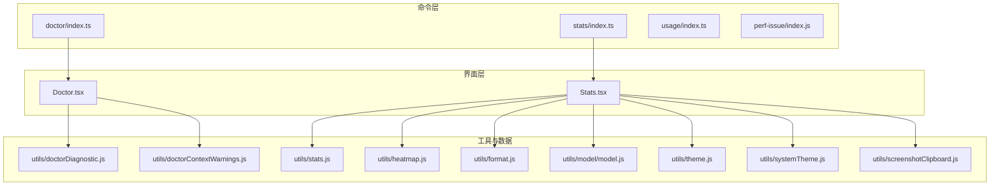
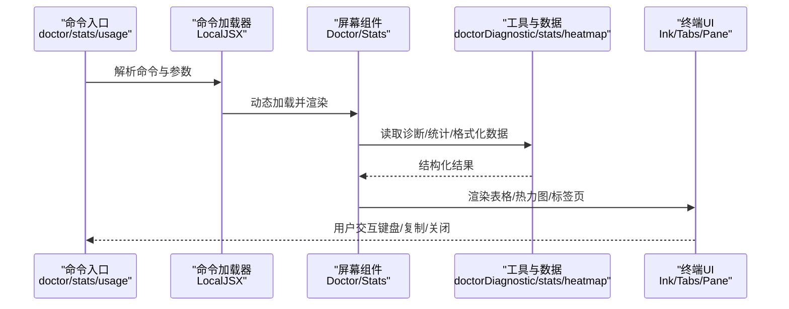
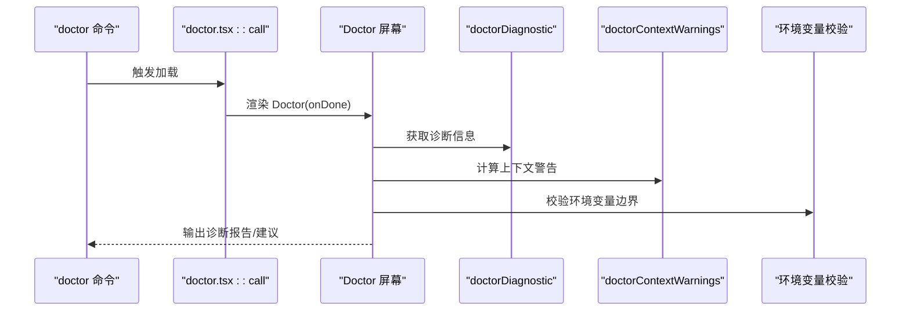
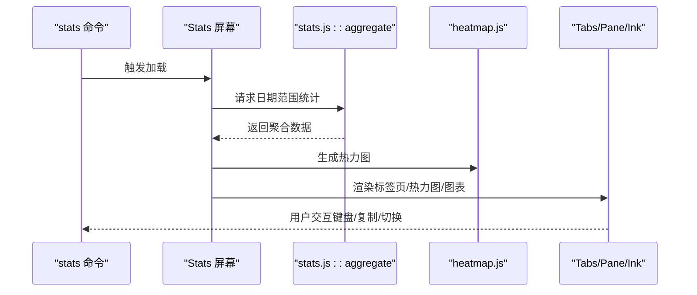
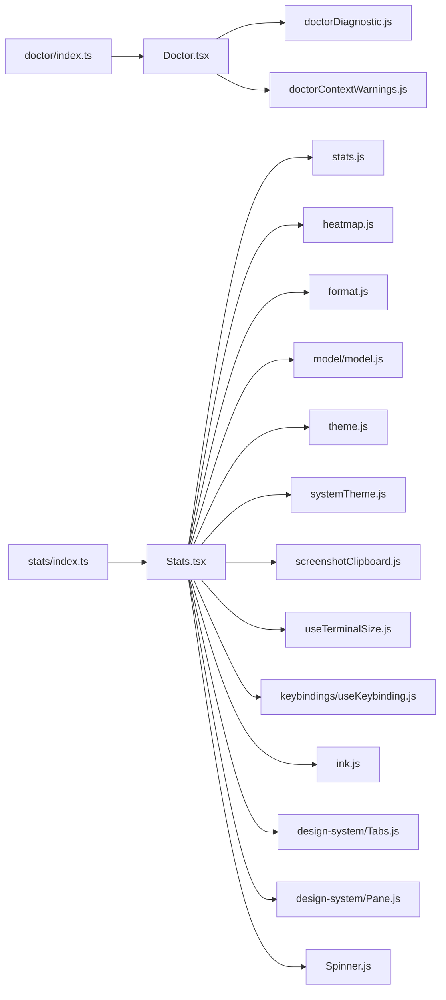

# 高级功能

<cite>
**本文引用的文件**
- [src/commands/doctor/index.ts](file://src/commands/doctor/index.ts)
- [src/commands/doctor/doctor.tsx](file://src/commands/doctor/doctor.tsx)
- [src/screens/Doctor.tsx](file://src/screens/Doctor.tsx)
- [src/commands/stats/index.ts](file://src/commands/stats/index.ts)
- [src/components/Stats.tsx](file://src/components/Stats.tsx)
- [src/commands/usage/index.ts](file://src/commands/usage/index.ts)
- [src/commands/perf-issue/index.js](file://src/commands/perf-issue/index.js)
- [src/utils/doctorDiagnostic.js](file://src/utils/doctorDiagnostic.js)
- [src/utils/doctorContextWarnings.js](file://src/utils/doctorContextWarnings.js)
- [src/utils/stats.js](file://src/utils/stats.js)
- [src/utils/heatmap.js](file://src/utils/heatmap.js)
- [src/utils/format.js](file://src/utils/format.js)
- [src/utils/model/model.js](file://src/utils/model/model.js)
- [src/utils/theme.js](file://src/utils/theme.js)
- [src/utils/systemTheme.js](file://src/utils/systemTheme.js)
- [src/utils/screenshotClipboard.js](file://src/utils/screenshotClipboard.js)
- [src/hooks/useTerminalSize.js](file://src/hooks/useTerminalSize.js)
- [src/keybindings/useKeybinding.js](file://src/keybindings/useKeybinding.js)
- [src/ink.js](file://src/ink.js)
- [src/components/design-system/Tabs.js](file://src/components/design-system/Tabs.js)
- [src/components/design-system/Pane.js](file://src/components/design-system/Pane.js)
- [src/components/Spinner.js](file://src/components/Spinner.js)
- [src/services/diagnosticTracking.ts](file://src/services/diagnosticTracking.ts)
- [src/utils/settings/mdm/rawRead.ts](file://src/utils/settings/mdm/rawRead.ts)
- [src/utils/settings/mdm/settings.ts](file://src/utils/settings/mdm/settings.ts)
- [src/services/analytics/sink.ts](file://src/services/analytics/sink.ts)
</cite>

## 目录
1. [简介](#简介)
2. [项目结构](#项目结构)
3. [核心组件](#核心组件)
4. [架构总览](#架构总览)
5. [详细组件分析](#详细组件分析)
6. [依赖关系分析](#依赖关系分析)
7. [性能考量](#性能考量)
8. [故障排除指南](#故障排除指南)
9. [结论](#结论)
10. [附录](#附录)

## 简介
本文件面向高级用户与专家，系统化梳理 Claude Code 的高级功能命令：系统诊断 doctor、统计信息 stats、使用情况 usage 以及性能问题诊断 perf-issue。内容涵盖命令入口、界面实现、数据采集与展示、性能监控与瓶颈识别、故障排除流程与优化建议，并提供可操作的使用技巧与专家级排障方法。

## 项目结构
- 命令入口位于 src/commands 下，每个命令以独立目录组织，包含 index.ts（声明命令）与具体实现（如 doctor.js/tsx）。
- 界面组件位于 src/screens 与 src/components，采用 Ink 终端 UI 框架渲染。
- 数据与工具位于 src/utils，包含统计数据聚合、热力图生成、格式化、模型名称渲染等。
- 性能与诊断相关服务位于 src/services，如诊断跟踪与分析埋点。

**图表来源**
- [src/commands/doctor/index.ts:1-12](file://src/commands/doctor/index.ts#L1-L12)
- [src/commands/stats/index.ts:1-11](file://src/commands/stats/index.ts#L1-L11)
- [src/commands/usage/index.ts:1-10](file://src/commands/usage/index.ts#L1-L10)
- [src/commands/perf-issue/index.js:1-2](file://src/commands/perf-issue/index.js#L1-L2)
- [src/screens/Doctor.tsx:1-575](file://src/screens/Doctor.tsx#L1-L575)
- [src/components/Stats.tsx:1-800](file://src/components/Stats.tsx#L1-L800)
- [src/utils/doctorDiagnostic.js](file://src/utils/doctorDiagnostic.js)
- [src/utils/doctorContextWarnings.js](file://src/utils/doctorContextWarnings.js)
- [src/utils/stats.js](file://src/utils/stats.js)
- [src/utils/heatmap.js](file://src/utils/heatmap.js)
- [src/utils/format.js](file://src/utils/format.js)
- [src/utils/model/model.js](file://src/utils/model/model.js)
- [src/utils/theme.js](file://src/utils/theme.js)
- [src/utils/systemTheme.js](file://src/utils/systemTheme.js)
- [src/utils/screenshotClipboard.js](file://src/utils/screenshotClipboard.js)

**章节来源**
- [src/commands/doctor/index.ts:1-12](file://src/commands/doctor/index.ts#L1-L12)
- [src/commands/stats/index.ts:1-11](file://src/commands/stats/index.ts#L1-L11)
- [src/commands/usage/index.ts:1-10](file://src/commands/usage/index.ts#L1-L10)
- [src/commands/perf-issue/index.js:1-2](file://src/commands/perf-issue/index.js#L1-L2)

## 核心组件
- doctor 命令：系统诊断与验证，输出安装状态、包管理器、版本更新、环境变量、上下文警告、插件错误、代理/沙箱状态、版本锁等诊断信息。
- stats 命令：统计面板，支持“全部时间/最近7天/最近30天”切换，展示会话数、最长会话、活跃天数、最长/当前连续天数、每日活动热力图、模型使用分布、令牌总量、书本/时长类比趣味事实等；支持复制截图到剪贴板。
- usage 命令：显示计划配额与用量限制（面向特定可用性）。
- perf-issue 命令：当前为占位禁用状态，未来用于性能问题诊断。

**章节来源**
- [src/commands/doctor/index.ts:1-12](file://src/commands/doctor/index.ts#L1-L12)
- [src/commands/doctor/doctor.tsx:1-7](file://src/commands/doctor/doctor.tsx#L1-L7)
- [src/screens/Doctor.tsx:1-575](file://src/screens/Doctor.tsx#L1-L575)
- [src/commands/stats/index.ts:1-11](file://src/commands/stats/index.ts#L1-L11)
- [src/components/Stats.tsx:1-800](file://src/components/Stats.tsx#L1-L800)
- [src/commands/usage/index.ts:1-10](file://src/commands/usage/index.ts#L1-L10)
- [src/commands/perf-issue/index.js:1-2](file://src/commands/perf-issue/index.js#L1-L2)

## 架构总览
doctor 与 stats 均通过本地 JSX 命令加载对应屏幕组件，Doctor 负责系统健康检查与环境诊断，Stats 负责统计聚合与可视化。两者均依赖 Ink 终端 UI 渲染、主题与终端尺寸钩子、键盘绑定与输入处理。

**图表来源**
- [src/commands/doctor/index.ts:1-12](file://src/commands/doctor/index.ts#L1-L12)
- [src/commands/doctor/doctor.tsx:1-7](file://src/commands/doctor/doctor.tsx#L1-L7)
- [src/screens/Doctor.tsx:1-575](file://src/screens/Doctor.tsx#L1-L575)
- [src/commands/stats/index.ts:1-11](file://src/commands/stats/index.ts#L1-L11)
- [src/components/Stats.tsx:1-800](file://src/components/Stats.tsx#L1-L800)
- [src/commands/usage/index.ts:1-10](file://src/commands/usage/index.ts#L1-L10)
- [src/commands/perf-issue/index.js:1-2](file://src/commands/perf-issue/index.js#L1-L2)

## 详细组件分析

### doctor 命令
- 命令定义：在 doctor/index.ts 中声明，类型为 local-jsx，启用条件受环境变量控制。
- 加载与调用：通过 doctor/doctor.tsx 的 call 导出，动态渲染 Doctor 屏幕组件。
- Doctor 屏幕职责：
  - 诊断安装状态、包管理器、路径、调用二进制、配置安装方式、搜索工具状态与推荐。
  - 显示多实例安装警告、无效设置错误列表、更新权限与渠道、版本锁清理与状态。
  - 上下文使用警告（不可达规则、claude.md 文件、Agent、MCP 服务器）。
  - 环境变量边界校验与告警。
  - 插件错误与解析失败文件列表。
  - 沙箱与 MCP 解析警告、键位提示等。

**图表来源**
- [src/commands/doctor/index.ts:1-12](file://src/commands/doctor/index.ts#L1-L12)
- [src/commands/doctor/doctor.tsx:1-7](file://src/commands/doctor/doctor.tsx#L1-L7)
- [src/screens/Doctor.tsx:1-575](file://src/screens/Doctor.tsx#L1-L575)
- [src/utils/doctorDiagnostic.js](file://src/utils/doctorDiagnostic.js)
- [src/utils/doctorContextWarnings.js](file://src/utils/doctorContextWarnings.js)

**章节来源**
- [src/commands/doctor/index.ts:1-12](file://src/commands/doctor/index.ts#L1-L12)
- [src/commands/doctor/doctor.tsx:1-7](file://src/commands/doctor/doctor.tsx#L1-L7)
- [src/screens/Doctor.tsx:1-575](file://src/screens/Doctor.tsx#L1-L575)

### stats 命令
- 命令定义：在 stats/index.ts 中声明，类型为 local-jsx。
- Stats 屏幕职责：
  - 默认加载“全部时间”统计数据，支持“全部时间/最近7天/最近30天”切换。
  - 使用 Suspense 与 React 19 的 use() 机制异步加载数据，避免阻塞。
  - 提供“概览/模型”两个标签页：
    - 概览：每日活动热力图、日期范围选择、会话数、最长会话、活跃天数、最长/当前连续天数、最活跃日、书本/时长类比趣味事实、（可选）对话轮次分布。
    - 模型：按令牌量排序的模型使用柱状图与明细，支持上下方向键滚动查看。
  - 支持键盘快捷键：Esc 关闭、r 切换日期范围、Ctrl+S 复制截图到剪贴板。
  - 主题与终端宽度适配，ANSI 渲染与颜色映射。

**图表来源**
- [src/commands/stats/index.ts:1-11](file://src/commands/stats/index.ts#L1-L11)
- [src/components/Stats.tsx:1-800](file://src/components/Stats.tsx#L1-L800)
- [src/utils/stats.js](file://src/utils/stats.js)
- [src/utils/heatmap.js](file://src/utils/heatmap.js)
- [src/hooks/useTerminalSize.js](file://src/hooks/useTerminalSize.js)
- [src/components/design-system/Tabs.js](file://src/components/design-system/Tabs.js)
- [src/components/design-system/Pane.js](file://src/components/design-system/Pane.js)
- [src/ink.js](file://src/ink.js)

**章节来源**
- [src/commands/stats/index.ts:1-11](file://src/commands/stats/index.ts#L1-L11)
- [src/components/Stats.tsx:1-800](file://src/components/Stats.tsx#L1-L800)

### usage 命令
- 命令定义：在 usage/index.ts 中声明，类型为 local-jsx，标注可用性为特定平台。
- 用途：显示计划配额与用量限制，帮助用户了解当前资源上限与剩余情况。

**章节来源**
- [src/commands/usage/index.ts:1-10](file://src/commands/usage/index.ts#L1-L10)

### perf-issue 命令
- 当前状态：在 perf-issue/index.js 中返回禁用的占位对象（isEnabled 为 false），未提供实际功能。
- 建议：未来可扩展为收集 CPU/内存/网络/磁盘 I/O、慢查询、超时事件、日志采样与火焰图等能力，结合诊断追踪服务进行问题定位。

**章节来源**
- [src/commands/perf-issue/index.js:1-2](file://src/commands/perf-issue/index.js#L1-L2)

## 依赖关系分析
- doctor 依赖 doctorDiagnostic 与 doctorContextWarnings 进行系统与上下文诊断；依赖 pidLock 与 XDG 状态目录进行版本锁清理与状态读取；依赖设置与环境校验模块进行边界检查。
- stats 依赖 stats.js 进行聚合，heatmap.js 生成热力图，format.js 与 model/model.js 提供格式化与模型名渲染，theme 与 systemTheme 提供主题适配，screenshotClipboard 提供截图复制能力。
- 键盘绑定与终端 UI 由 Ink 与自定义 hooks 提供，Tabs/Pane/Spinner 等组件负责布局与交互反馈。

**图表来源**
- [src/commands/doctor/index.ts:1-12](file://src/commands/doctor/index.ts#L1-L12)
- [src/screens/Doctor.tsx:1-575](file://src/screens/Doctor.tsx#L1-L575)
- [src/commands/stats/index.ts:1-11](file://src/commands/stats/index.ts#L1-L11)
- [src/components/Stats.tsx:1-800](file://src/components/Stats.tsx#L1-L800)
- [src/utils/doctorDiagnostic.js](file://src/utils/doctorDiagnostic.js)
- [src/utils/doctorContextWarnings.js](file://src/utils/doctorContextWarnings.js)
- [src/utils/stats.js](file://src/utils/stats.js)
- [src/utils/heatmap.js](file://src/utils/heatmap.js)
- [src/utils/format.js](file://src/utils/format.js)
- [src/utils/model/model.js](file://src/utils/model/model.js)
- [src/utils/theme.js](file://src/utils/theme.js)
- [src/utils/systemTheme.js](file://src/utils/systemTheme.js)
- [src/utils/screenshotClipboard.js](file://src/utils/screenshotClipboard.js)
- [src/hooks/useTerminalSize.js](file://src/hooks/useTerminalSize.js)
- [src/keybindings/useKeybinding.js](file://src/keybindings/useKeybinding.js)
- [src/ink.js](file://src/ink.js)
- [src/components/design-system/Tabs.js](file://src/components/design-system/Tabs.js)
- [src/components/design-system/Pane.js](file://src/components/design-system/Pane.js)
- [src/components/Spinner.js](file://src/components/Spinner.js)

**章节来源**
- [src/commands/doctor/index.ts:1-12](file://src/commands/doctor/index.ts#L1-L12)
- [src/commands/stats/index.ts:1-11](file://src/commands/stats/index.ts#L1-L11)
- [src/commands/usage/index.ts:1-10](file://src/commands/usage/index.ts#L1-L10)
- [src/commands/perf-issue/index.js:1-2](file://src/commands/perf-issue/index.js#L1-L2)

## 性能考量
- 异步加载与缓存
  - stats 使用 Suspense 与 use() 在后台加载全量数据，按需加载其他日期范围，减少首屏等待。
  - 通过 statsCache 缓存已加载的日期范围结果，避免重复请求。
- 终端渲染优化
  - 使用 ANSI 图表与紧凑布局，结合终端宽度计算，避免过宽导致换行卡顿。
  - 仅在需要时生成热力图与图表，降低 CPU 占用。
- 诊断与追踪
  - 诊断追踪服务在查询开始时初始化或重置，避免跨查询污染。
  - 分析埋点模块支持门控与异步初始化，保证启动阶段不阻塞。
- 环境与系统资源
  - doctor 对环境变量进行边界校验，防止异常配置导致性能退化。
  - 版本锁清理与 stale lock 清理减少系统资源占用与潜在冲突。

**章节来源**
- [src/components/Stats.tsx:1-800](file://src/components/Stats.tsx#L1-L800)
- [src/services/diagnosticTracking.ts:309-343](file://src/services/diagnosticTracking.ts#L309-L343)
- [src/services/analytics/sink.ts:1-114](file://src/services/analytics/sink.ts#L1-L114)
- [src/screens/Doctor.tsx:1-575](file://src/screens/Doctor.tsx#L1-L575)

## 故障排除指南
- doctor 常见问题
  - 多实例安装：若发现多个安装实例，优先确认当前运行路径与 invoked binary 是否符合预期。
  - 更新权限不足：当 hasUpdatePermissions 为否时，可能需要管理员权限或调整包管理器策略。
  - 环境变量越界：对 BASH_MAX_OUTPUT_LENGTH、TASK_MAX_OUTPUT_LENGTH、CLAUDE_CODE_MAX_OUTPUT_TOKENS 等进行边界校验，修正后重新诊断。
  - 上下文警告：针对不可达规则、claude.md 文件、Agent、MCP 服务器的警告逐项排查。
  - 版本锁：清理 stale locks 后重试，确保无进程残留锁。
  - 插件与解析错误：查看插件错误列表与 Agent 解析失败文件，修复配置或权限。
- stats 常见问题
  - 无数据：首次使用或清空数据后会出现“暂无统计”，正常现象。
  - 加载失败：查看错误消息，确认网络与存储权限；必要时切换日期范围或稍后重试。
  - 截图复制：使用 Ctrl+S 将当前视图复制到剪贴板，便于分享与记录。
- usage 常见问题
  - 可用性限制：部分平台/账户类型可能不支持显示用量详情，请确认可用性标注。
- perf-issue 常见问题
  - 当前禁用：该命令为占位实现，未来将提供性能问题诊断能力。

**章节来源**
- [src/screens/Doctor.tsx:1-575](file://src/screens/Doctor.tsx#L1-L575)
- [src/components/Stats.tsx:1-800](file://src/components/Stats.tsx#L1-L800)
- [src/commands/usage/index.ts:1-10](file://src/commands/usage/index.ts#L1-L10)
- [src/commands/perf-issue/index.js:1-2](file://src/commands/perf-issue/index.js#L1-L2)

## 结论
doctor、stats、usage 与 perf-issue 共同构成 Claude Code 的高级诊断与统计体系。doctor 提供系统健康快照与修复建议，stats 提供多维度使用画像与可视化，usage 提供配额概览，perf-issue 为未来的性能诊断预留扩展空间。通过合理的异步加载、终端渲染优化与诊断追踪，系统在复杂场景下仍能保持稳定与高效。

## 附录
- 使用技巧
  - doctor：关注“Recommendation”“上下文使用警告”“环境变量”“版本锁”等关键区块，逐项修复。
  - stats：使用 r 快速切换时间范围，Ctrl+S 复制截图，结合“模型”标签页定位高消耗模型。
  - usage：定期查看配额变化，提前规划任务规模。
- 专家级排障
  - 结合诊断追踪服务与分析埋点，定位慢查询与异常事件。
  - 利用 MDM/HKCU 设置读取模块，排查企业策略对性能的影响。
  - 使用 perf-issue（未来）进行火焰图与资源采样，识别热点函数与阻塞点。