# 专用工具

<cite>
**本文引用的文件**
- [AskUserQuestionTool](file://src/tools/AskUserQuestionTool)
- [BriefTool](file://src/tools/BriefTool)
- [LSPTool](file://src/tools/LSPTool)
- [NotebookEditTool](file://src/tools/NotebookEditTool)
- [REPLTool](file://src/tools/REPLTool)
- [SkillTool](file://src/tools/SkillTool)
- [SleepTool](file://src/tools/SleepTool)
- [SyntheticOutputTool](file://src/tools/SyntheticOutputTool)
- [TeamCreateTool](file://src/tools/TeamCreateTool)
- [TeamDeleteTool](file://src/tools/TeamDeleteTool)
- [TodoWriteTool](file://src/tools/TodoWriteTool)
- [ToolSearchTool](file://src/tools/ToolSearchTool)
</cite>

## 目录
1. [简介](#简介)
2. [项目结构](#项目结构)
3. [核心组件](#核心组件)
4. [架构总览](#架构总览)
5. [详细组件分析](#详细组件分析)
6. [依赖分析](#依赖分析)
7. [性能考虑](#性能考虑)
8. [故障排查指南](#故障排查指南)
9. [结论](#结论)

## 简介
本文件系统性梳理 Claude Code 中的专用工具集，聚焦以下工具的功能定位、使用场景与实现要点：AskUserQuestionTool（用户问答）、BriefTool（摘要生成）、LSPTool（语言服务器协议支持）、NotebookEditTool（笔记本编辑）、REPLTool（交互式编程环境）、SkillTool（技能调用）、SleepTool（延迟功能）、SyntheticOutputTool（合成输出）、TeamCreateTool 与 TeamDeleteTool（团队管理）、TodoWriteTool（待办事项处理）以及 ToolSearchTool（工具搜索）。文档以“概念—架构—流程—实践”的方式组织，既便于非技术读者理解，也为开发者提供可追溯的源码参考。

## 项目结构
这些工具均位于 src/tools 目录下，采用按功能分组的模块化组织方式。每个工具通常包含一个主实现文件与其配套的类型定义、错误消息、权限声明或内部状态管理等辅助文件。整体结构清晰，便于扩展与维护。

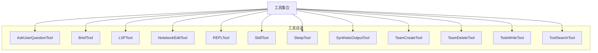

## 核心组件
- 用户问答 AskUserQuestionTool：用于在工具调用过程中向用户提问，收集必要上下文信息，支撑后续决策或执行。
- 摘要生成 BriefTool：对输入内容进行摘要提取，帮助快速把握关键信息。
- 语言服务器协议 LSPTool：对接语言服务器，提供智能提示、跳转、诊断等能力。
- 笔记本编辑 NotebookEditTool：在 Jupyter 等笔记本环境中进行单元格编辑与执行。
- 交互式编程 REPLTool：提供交互式命令行环境，支持持续输入与即时反馈。
- 技能调用 SkillTool：封装可复用的技能逻辑，统一对外暴露接口。
- 延迟 SleepTool：在工具链中插入延时，控制节奏或等待外部资源就绪。
- 合成输出 SyntheticOutputTool：生成结构化或格式化的输出，便于下游消费。
- 团队管理 TeamCreateTool/TeamDeleteTool：创建与删除团队，管理成员与权限。
- 待办事项 TodoWriteTool：写入或更新待办事项，支持任务生命周期管理。
- 工具搜索 ToolSearchTool：在可用工具集中检索匹配项，辅助选择合适工具。

**章节来源**
- [AskUserQuestionTool](file://src/tools/AskUserQuestionTool)
- [BriefTool](file://src/tools/BriefTool)
- [LSPTool](file://src/tools/LSPTool)
- [NotebookEditTool](file://src/tools/NotebookEditTool)
- [REPLTool](file://src/tools/REPLTool)
- [SkillTool](file://src/tools/SkillTool)
- [SleepTool](file://src/tools/SleepTool)
- [SyntheticOutputTool](file://src/tools/SyntheticOutputTool)
- [TeamCreateTool](file://src/tools/TeamCreateTool)
- [TeamDeleteTool](file://src/tools/TeamDeleteTool)
- [TodoWriteTool](file://src/tools/TodoWriteTool)
- [ToolSearchTool](file://src/tools/ToolSearchTool)

## 架构总览
从系统视角看，工具层通过统一的工具基类或接口实现，遵循一致的输入/输出契约与权限模型；部分工具依赖服务层（如 LSP、REPL、技能系统），并通过桥接层与 IDE 或远程环境交互；团队与待办工具则与会话与任务系统耦合，形成端到端的工作流闭环。

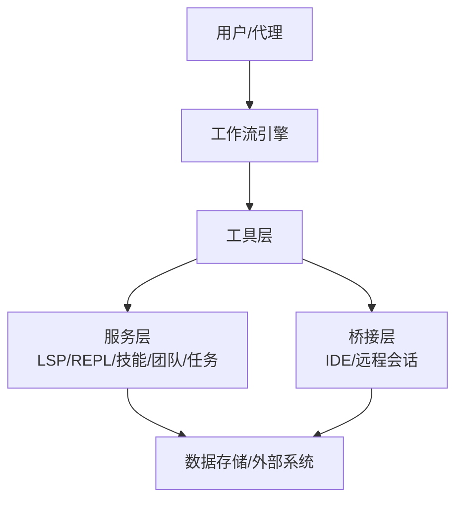

## 详细组件分析

### AskUserQuestionTool：用户问答
- 功能概述：在工具调用过程中触发一次性的用户提问，收集必要的上下文信息，以便继续执行或调整策略。
- 典型场景：
  - 需要明确参数取值范围或默认选项时；
  - 面临多分支决策但缺少用户偏好时；
  - 需要确认操作风险或副作用时。
- 关键行为：
  - 发起问题后等待用户响应；
  - 将回答作为工具输入的一部分继续推进；
  - 支持取消或重试机制。
- 交互流程示意：

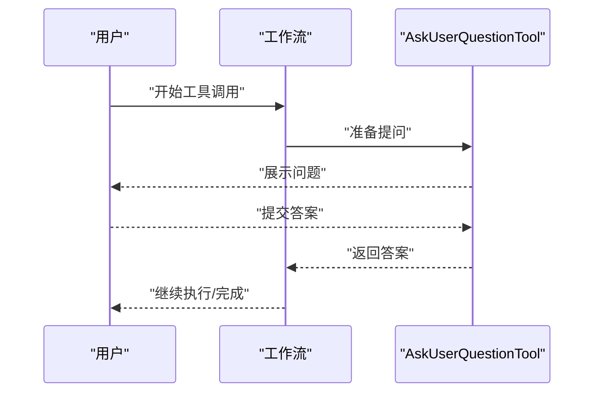

**章节来源**
- [AskUserQuestionTool](file://src/tools/AskUserQuestionTool)

### BriefTool：摘要生成
- 功能概述：对长文本或复杂输入进行摘要提取，提炼关键要点，降低后续处理成本。
- 典型场景：
  - 文档/代码片段过长，需要快速理解；
  - 多来源信息聚合后的精简输出；
  - 为其他工具提供“轻量”输入。
- 关键行为：
  - 识别输入类型（文本/代码/日志等）；
  - 应用合适的摘要策略；
  - 输出结构化摘要结果。
- 流程示意：

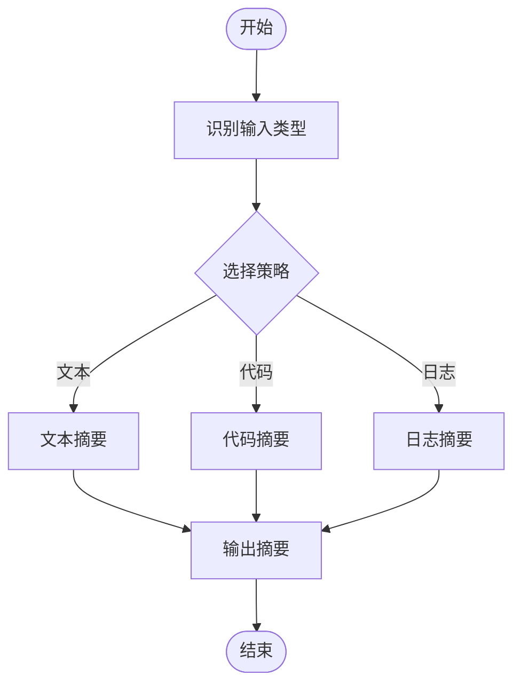

**章节来源**
- [BriefTool](file://src/tools/BriefTool)

### LSPTool：语言服务器协议支持
- 功能概述：对接语言服务器，提供跳转、查找引用、符号、诊断、自动补全等能力。
- 典型场景：
  - 编辑器内快速定位定义或引用；
  - 代码重构前的依赖分析；
  - 诊断与修复建议。
- 关键行为：
  - 初始化/连接语言服务器；
  - 发送请求并解析响应；
  - 将结果转换为可读的摘要或列表。
- 交互序列示意：

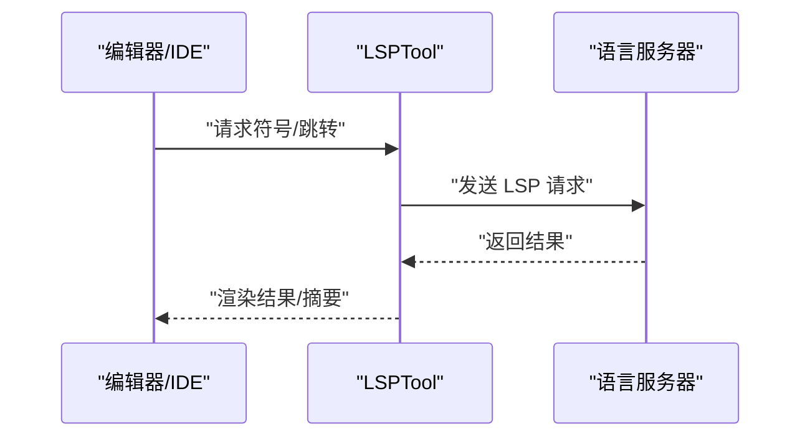

**章节来源**
- [LSPTool](file://src/tools/LSPTool)

### NotebookEditTool：笔记本编辑
- 功能概述：在 Jupyter 等笔记本环境中进行单元格编辑、执行与输出管理。
- 典型场景：
  - 数据探索与可视化脚本的迭代；
  - 实验性代码的快速验证；
  - 结果导出与分享。
- 关键行为：
  - 选择目标单元格；
  - 更新单元格内容；
  - 触发执行并捕获输出。
- 流程示意：

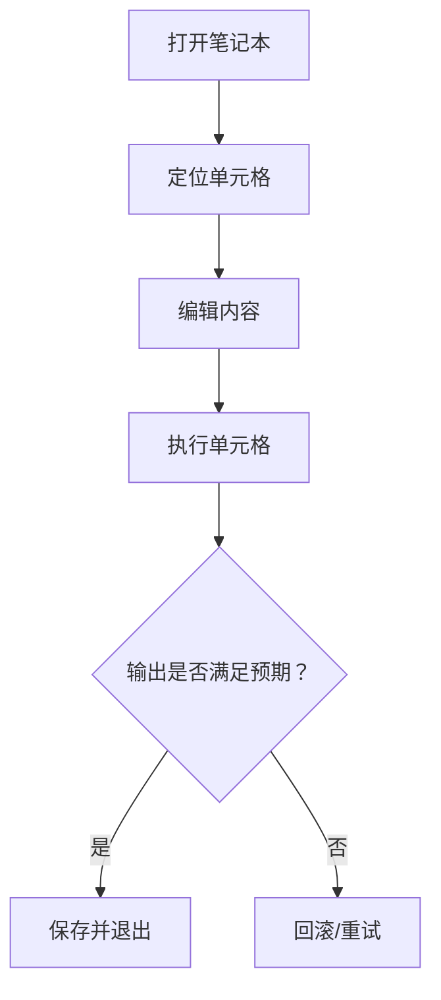

**章节来源**
- [NotebookEditTool](file://src/tools/NotebookEditTool)

### REPLTool：交互式编程环境
- 功能概述：提供交互式命令行环境，支持持续输入与即时反馈，适合调试与探索。
- 典型场景：
  - 快速验证表达式或函数；
  - 调试中间状态；
  - 学习新 API 或库。
- 关键行为：
  - 维持会话状态；
  - 解析与执行命令；
  - 格式化输出结果。
- 交互序列示意：

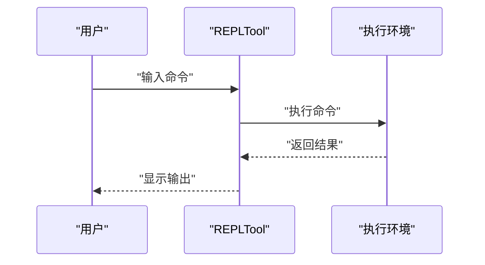

**章节来源**
- [REPLTool](file://src/tools/REPLTool)

### SkillTool：技能调用
- 功能概述：封装可复用的技能逻辑，统一对外暴露接口，便于组合与复用。
- 典型场景：
  - 重复性任务的自动化；
  - 多工具协作的编排；
  - 技能版本演进与替换。
- 关键行为：
  - 参数校验与预处理；
  - 调用具体技能实现；
  - 结果归一化输出。
- 类关系示意：

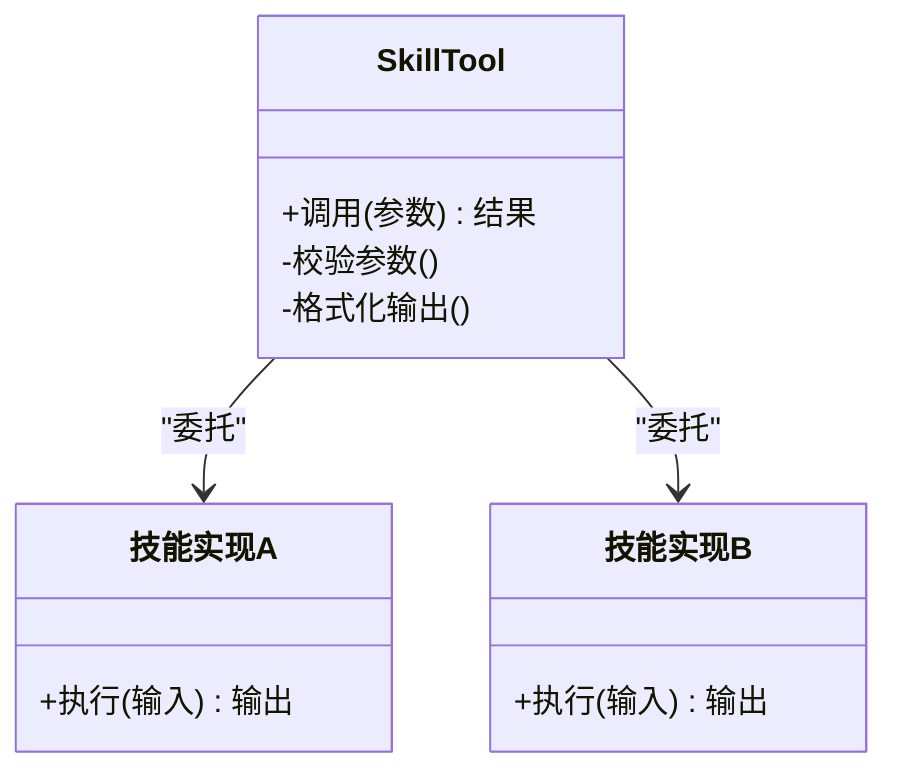

**章节来源**
- [SkillTool](file://src/tools/SkillTool)

### SleepTool：延迟功能
- 功能概述：在工具链中插入固定或随机延时，控制节奏或等待外部资源就绪。
- 典型场景：
  - 避免频繁请求触发限流；
  - 等待异步任务完成；
  - 平滑工具间切换。
- 关键行为：
  - 接收时长参数；
  - 执行定时等待；
  - 返回完成信号。
- 流程示意：

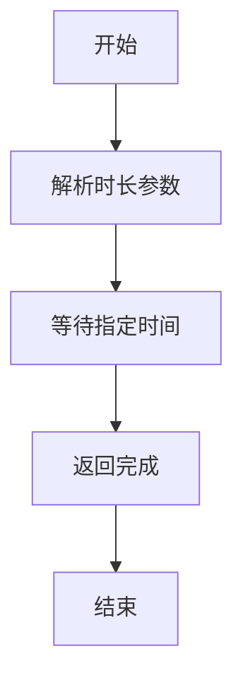

**章节来源**
- [SleepTool](file://src/tools/SleepTool)

### SyntheticOutputTool：合成输出
- 功能概述：生成结构化或格式化的输出，便于下游消费与展示。
- 典型场景：
  - 将原始结果转换为报告；
  - 生成表格/图表描述；
  - 统一输出风格。
- 关键行为：
  - 识别输入数据结构；
  - 应用模板或规则生成输出；
  - 校验输出完整性。
- 流程示意：

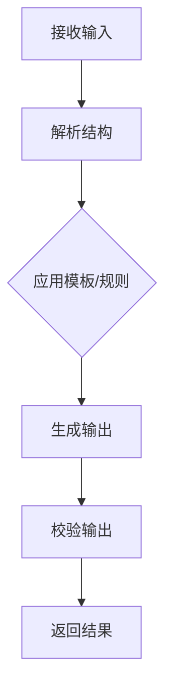

**章节来源**
- [SyntheticOutputTool](file://src/tools/SyntheticOutputTool)

### TeamCreateTool 与 TeamDeleteTool：团队管理
- 功能概述：创建与删除团队，管理成员与权限，支撑多人协作与资源隔离。
- 典型场景：
  - 新项目启动时建立团队；
  - 项目结束或人员变动时清理团队；
  - 权限变更与审计。
- 关键行为：
  - 创建团队并初始化成员；
  - 删除团队并回收资源；
  - 记录变更日志。
- 交互序列示意：

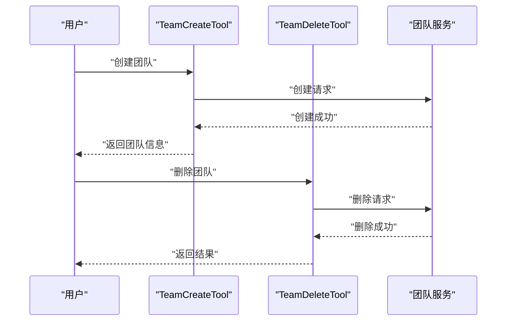

**章节来源**
- [TeamCreateTool](file://src/tools/TeamCreateTool)
- [TeamDeleteTool](file://src/tools/TeamDeleteTool)

### TodoWriteTool：待办事项处理
- 功能概述：写入或更新待办事项，支持任务生命周期管理（创建、更新、完成、删除）。
- 典型场景：
  - 将任务分解为子项；
  - 追加备注与截止时间；
  - 完成标记与归档。
- 关键行为：
  - 解析任务描述与元数据；
  - 写入任务系统；
  - 返回任务标识与状态。
- 流程示意：

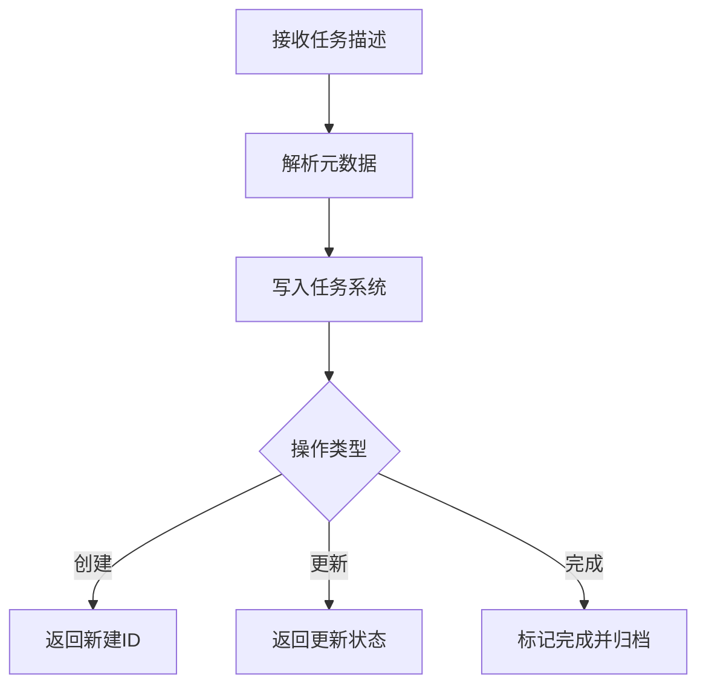

**章节来源**
- [TodoWriteTool](file://src/tools/TodoWriteTool)

### ToolSearchTool：工具搜索
- 功能概述：在可用工具集中检索匹配项，辅助选择合适工具，提升工作流自适应能力。
- 典型场景：
  - 根据任务描述自动推荐工具；
  - 在工具集变更后进行动态适配；
  - 与自然语言理解结合实现意图识别。
- 关键行为：
  - 解析查询语义；
  - 匹配工具签名与能力；
  - 返回候选工具列表与置信度。
- 流程示意：

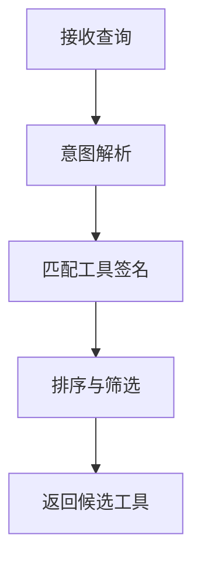

**章节来源**
- [ToolSearchTool](file://src/tools/ToolSearchTool)

## 依赖分析
- 内聚性：各工具围绕单一职责设计，内部逻辑相对独立，便于测试与演进。
- 耦合点：
  - LSPTool、REPLTool、SkillTool 等依赖服务层；
  - TeamCreateTool/TeamDeleteTool 与任务/会话系统耦合；
  - ToolSearchTool 与工具注册表/签名系统耦合。
- 潜在循环依赖：当前结构以“工具层→服务层→外部系统”单向依赖为主，未见明显循环。

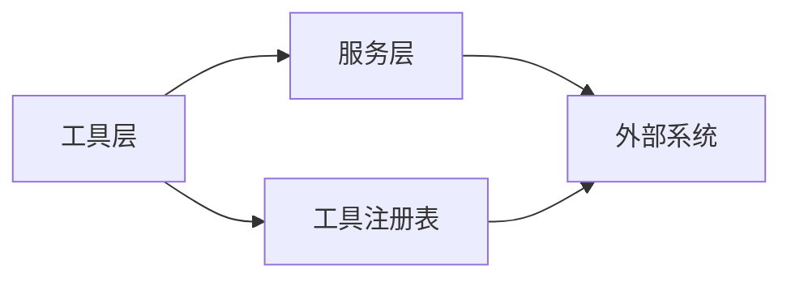

## 性能考虑
- I/O 密集：LSPTool、REPLTool、NotebookEditTool 等涉及外部进程或网络通信，应关注超时与重试策略。
- 计算密集：BriefTool、SyntheticOutputTool 可能涉及大文本处理，需注意内存占用与分块处理。
- 并发与节流：SleepTool 可用于缓解限流压力；ToolSearchTool 的匹配应避免高复杂度遍历。
- 缓存与复用：对重复的 LSP 查询或技能调用结果进行缓存，减少重复开销。

## 故障排查指南
- 无响应或超时：
  - 检查 LSPTool 的连接状态与服务器健康；
  - 评估 REPLTool 的执行环境与资源限制。
- 输出异常：
  - 核对 BriefTool 的输入类型与摘要策略；
  - 检查 SyntheticOutputTool 的模板与字段映射。
- 权限不足：
  - 确认 TeamCreateTool/TeamDeleteTool 的角色与授权；
  - 校验 NotebookEditTool 的笔记本访问权限。
- 工具不可用：
  - 使用 ToolSearchTool 自检可用工具集；
  - 检查工具注册表与签名一致性。

## 结论
上述专用工具覆盖了从用户交互、内容处理、语言智能、交互式开发到团队与任务管理的完整工作流。它们以统一的接口与契约协同工作，既能独立完成特定任务，也能在更复杂的流程中扮演关键节点。建议在实际部署中结合业务场景选择合适的工具组合，并关注性能与稳定性保障。