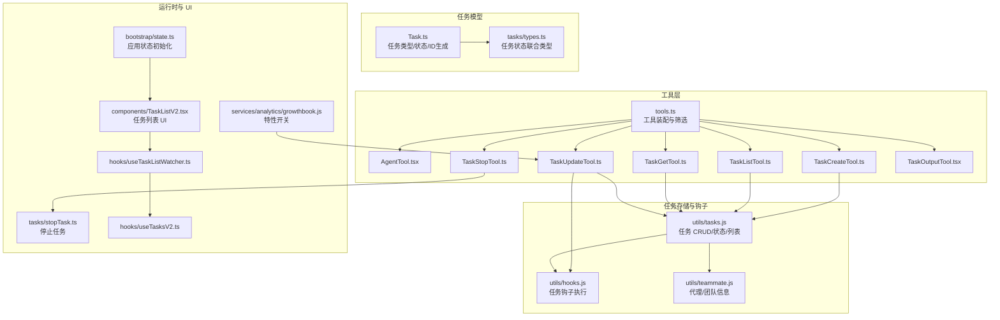
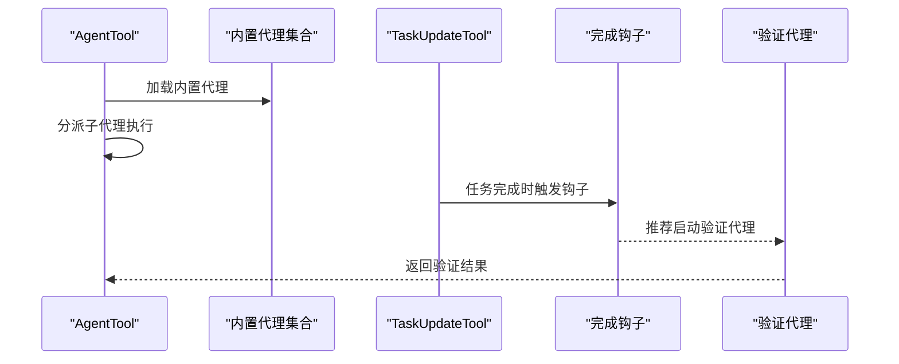
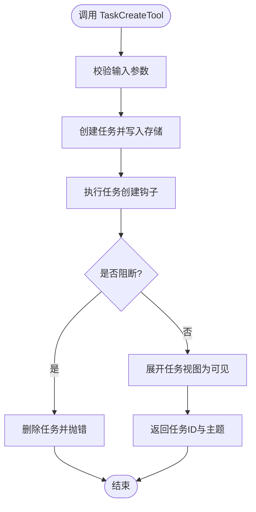
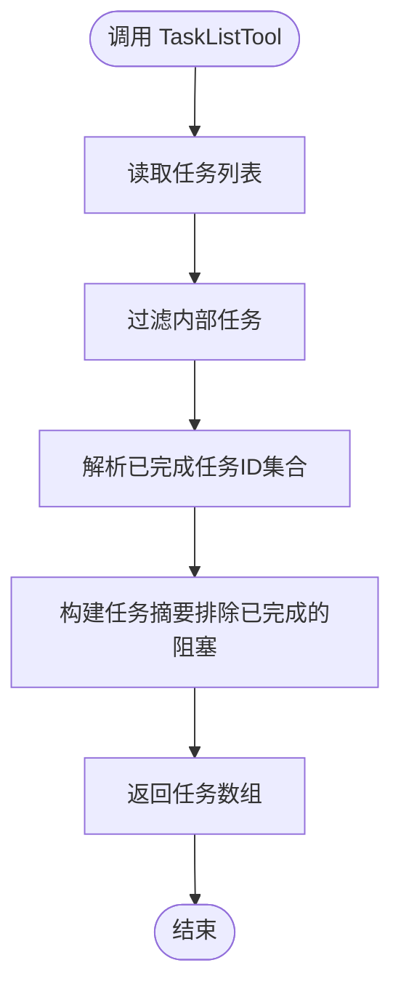
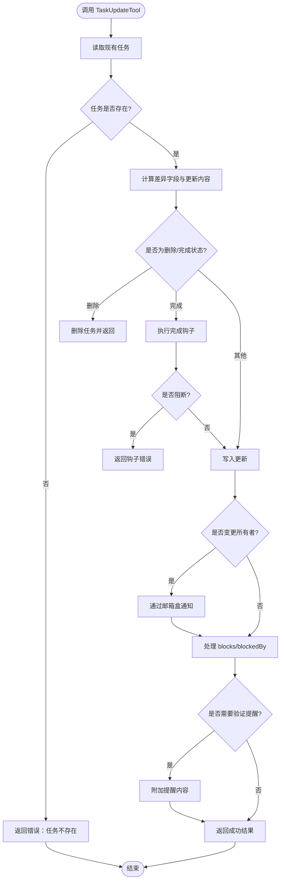
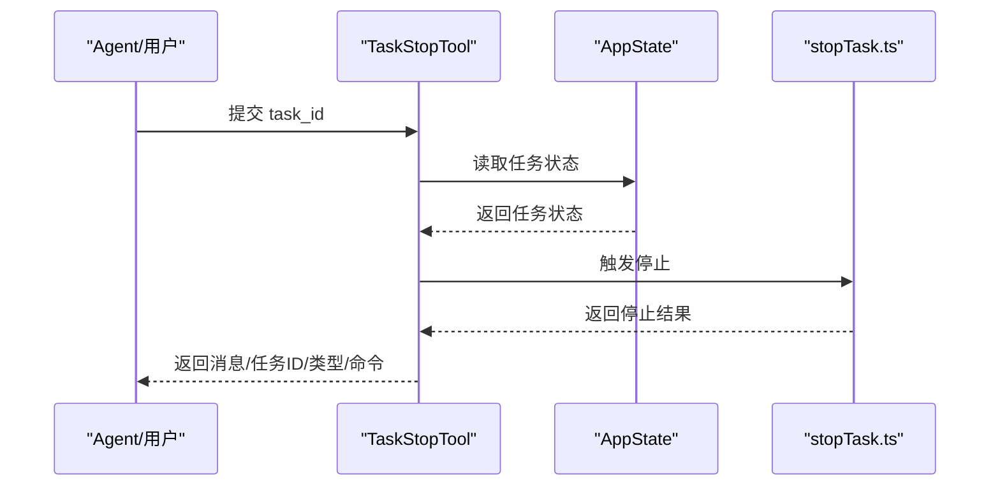
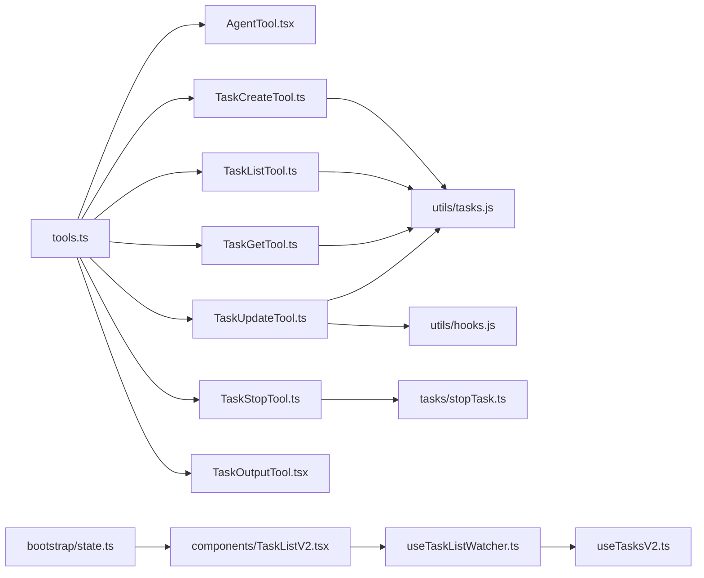

# 代理与任务工具

<cite>
**本文引用的文件**
- [src/Task.ts](file://src/Task.ts)
- [src/tasks/types.ts](file://src/tasks/types.ts)
- [src/tools.ts](file://src/tools.ts)
- [src/tools/AgentTool/AgentTool.tsx](file://src/tools/AgentTool/AgentTool.tsx)
- [src/tools/TaskCreateTool/TaskCreateTool.ts](file://src/tools/TaskCreateTool/TaskCreateTool.ts)
- [src/tools/TaskListTool/TaskListTool.ts](file://src/tools/TaskListTool/TaskListTool.ts)
- [src/tools/TaskGetTool/TaskGetTool.ts](file://src/tools/TaskGetTool/TaskGetTool.ts)
- [src/tools/TaskUpdateTool/TaskUpdateTool.ts](file://src/tools/TaskUpdateTool/TaskUpdateTool.ts)
- [src/tools/TaskStopTool/TaskStopTool.ts](file://src/tools/TaskStopTool/TaskStopTool.ts)
- [src/tools/TaskOutputTool/TaskOutputTool.tsx](file://src/tools/TaskOutputTool/TaskOutputTool.tsx)
- [src/utils/tasks.js](file://src/utils/tasks.js)
- [src/utils/hooks.js](file://src/utils/hooks.js)
- [src/utils/teammate.js](file://src/utils/teammate.js)
- [src/tasks/stopTask.ts](file://src/tasks/stopTask.ts)
- [src/components/TaskListV2.tsx](file://src/components/TaskListV2.tsx)
- [src/hooks/useTaskListWatcher.ts](file://src/hooks/useTaskListWatcher.ts)
- [src/hooks/useTasksV2.ts](file://src/hooks/useTasksV2.ts)
- [src/bootstrap/state.ts](file://src/bootstrap/state.ts)
- [src/services/analytics/growthbook.js](file://src/services/analytics/growthbook.js)
</cite>

## 目录
1. [简介](#简介)
2. [项目结构](#项目结构)
3. [核心组件](#核心组件)
4. [架构总览](#架构总览)
5. [详细组件分析](#详细组件分析)
6. [依赖关系分析](#依赖关系分析)
7. [性能考量](#性能考量)
8. [故障排查指南](#故障排查指南)
9. [结论](#结论)
10. [附录](#附录)

## 简介
本指南围绕 Claude Code 的代理与任务工具体系，系统讲解以下能力：
- 代理工具（AgentTool）：多智能体协作、子代理分派、内置代理集合与运行时调度。
- 任务工具：TaskCreateTool（创建）、TaskListTool（列表）、TaskGetTool（查询）、TaskUpdateTool（更新）、TaskStopTool（停止）、TaskOutputTool（输出处理）。
- 任务生命周期：创建、调度、状态管理、并发控制、错误恢复与钩子执行。
- 配置与集成：工具装配、权限过滤、MCP 工具合并、UI 渲染与状态持久化。

本指南兼顾非技术读者，提供可视化图示与流程说明，帮助快速上手并深入理解实现细节。

## 项目结构
与“代理与任务工具”直接相关的核心目录与文件：
- 工具层：src/tools 下的各工具实现与工具装配入口 src/tools.ts
- 任务模型与类型：src/Task.ts、src/tasks/types.ts
- 任务工具实现：TaskCreateTool、TaskListTool、TaskGetTool、TaskUpdateTool、TaskStopTool、TaskOutputTool
- 任务状态与存储：src/utils/tasks.js
- 钩子与事件：src/utils/hooks.js
- 团队与代理上下文：src/utils/teammate.js
- 停止任务逻辑：src/tasks/stopTask.ts
- UI 与状态监听：src/components/TaskListV2.tsx、src/hooks/useTaskListWatcher.ts、src/hooks/useTasksV2.ts
- 应用状态初始化：src/bootstrap/state.ts
- 特性开关与分析：src/services/analytics/growthbook.js



**图表来源**
- [src/tools.ts:193-251](file://src/tools.ts#L193-L251)
- [src/Task.ts:69-106](file://src/Task.ts#L69-L106)
- [src/tasks/types.ts:12-46](file://src/tasks/types.ts#L12-L46)
- [src/utils/tasks.js](file://src/utils/tasks.js)
- [src/utils/hooks.js](file://src/utils/hooks.js)
- [src/utils/teammate.js](file://src/utils/teammate.js)
- [src/tasks/stopTask.ts](file://src/tasks/stopTask.ts)
- [src/components/TaskListV2.tsx](file://src/components/TaskListV2.tsx)
- [src/hooks/useTaskListWatcher.ts](file://src/hooks/useTaskListWatcher.ts)
- [src/hooks/useTasksV2.ts](file://src/hooks/useTasksV2.ts)
- [src/bootstrap/state.ts](file://src/bootstrap/state.ts)
- [src/services/analytics/growthbook.js](file://src/services/analytics/growthbook.js)

**章节来源**
- [src/tools.ts:193-251](file://src/tools.ts#L193-L251)
- [src/Task.ts:69-106](file://src/Task.ts#L69-L106)
- [src/tasks/types.ts:12-46](file://src/tasks/types.ts#L12-L46)

## 核心组件
- 任务模型与状态
  - 任务类型与状态枚举、终端状态判断、任务 ID 生成、基础状态字段等定义见 [src/Task.ts:6-126](file://src/Task.ts#L6-L126)。
  - 任务状态联合类型与后台任务判定见 [src/tasks/types.ts:12-46](file://src/tasks/types.ts#L12-L46)。
- 工具装配与筛选
  - 工具全集、按权限与特性开关过滤、REPL 模式隐藏、MCP 工具合并等逻辑见 [src/tools.ts:193-390](file://src/tools.ts#L193-L390)。
- 任务工具族
  - 创建、列表、查询、更新、停止、输出处理等工具实现分别位于 [src/tools/TaskCreateTool/TaskCreateTool.ts](file://src/tools/TaskCreateTool/TaskCreateTool.ts)、[src/tools/TaskListTool/TaskListTool.ts](file://src/tools/TaskListTool/TaskListTool.ts)、[src/tools/TaskGetTool/TaskGetTool.ts](file://src/tools/TaskGetTool/TaskGetTool.ts)、[src/tools/TaskUpdateTool/TaskUpdateTool.ts](file://src/tools/TaskUpdateTool/TaskUpdateTool.ts)、[src/tools/TaskStopTool/TaskStopTool.ts](file://src/tools/TaskStopTool/TaskStopTool.ts)、[src/tools/TaskOutputTool/TaskOutputTool.tsx](file://src/tools/TaskOutputTool/TaskOutputTool.tsx)。
- 代理工具
  - 多智能体、内置代理、运行与提示词管理等见 [src/tools/AgentTool/AgentTool.tsx](file://src/tools/AgentTool/AgentTool.tsx)。

**章节来源**
- [src/Task.ts:6-126](file://src/Task.ts#L6-L126)
- [src/tasks/types.ts:12-46](file://src/tasks/types.ts#L12-L46)
- [src/tools.ts:193-390](file://src/tools.ts#L193-L390)
- [src/tools/TaskCreateTool/TaskCreateTool.ts:48-139](file://src/tools/TaskCreateTool/TaskCreateTool.ts#L48-L139)
- [src/tools/TaskListTool/TaskListTool.ts:33-117](file://src/tools/TaskListTool/TaskListTool.ts#L33-L117)
- [src/tools/TaskGetTool/TaskGetTool.ts:38-129](file://src/tools/TaskGetTool/TaskGetTool.ts#L38-L129)
- [src/tools/TaskUpdateTool/TaskUpdateTool.ts:88-407](file://src/tools/TaskUpdateTool/TaskUpdateTool.ts#L88-L407)
- [src/tools/TaskStopTool/TaskStopTool.ts:39-132](file://src/tools/TaskStopTool/TaskStopTool.ts#L39-L132)
- [src/tools/TaskOutputTool/TaskOutputTool.tsx](file://src/tools/TaskOutputTool/TaskOutputTool.tsx)
- [src/tools/AgentTool/AgentTool.tsx](file://src/tools/AgentTool/AgentTool.tsx)

## 架构总览
下图展示“代理与任务工具”的端到端交互：工具装配 → 代理调用 → 任务创建/更新/查询/停止 → 钩子与通知 → UI 同步。

```mermaid
sequenceDiagram
participant Agent as "AgentTool"
participant Tools as "工具装配<br/>tools.ts"
participant Create as "TaskCreateTool"
participant Update as "TaskUpdateTool"
participant List as "TaskListTool"
participant Get as "TaskGetTool"
participant Stop as "TaskStopTool"
participant Store as "utils/tasks.js"
participant Hooks as "utils/hooks.js"
participant UI as "TaskListV2.tsx"
Agent->>Tools : 请求可用工具
Tools-->>Agent : 返回允许工具集
Agent->>Create : 调用创建任务
Create->>Store : 写入任务并返回ID
Create->>Hooks : 执行任务创建钩子
Hooks-->>Create : 返回阻断错误或通过
Create-->>Agent : 返回任务ID与主题
Agent->>Update : 更新任务状态/元数据
Update->>Store : 写入变更
Update->>Hooks : 完成时执行完成钩子
Hooks-->>Update : 返回阻断错误或通过
Update-->>Agent : 返回更新字段与状态变化
Agent->>List : 列出任务过滤内部任务
List->>Store : 读取任务列表
List-->>Agent : 返回任务摘要
Agent->>Get : 查询单个任务详情
Get->>Store : 读取任务
Get-->>Agent : 返回任务详情
Agent->>Stop : 停止后台任务
Stop->>Store : 校验任务存在且运行中
Stop->>StopTask : 触发停止逻辑
Stop-->>Agent : 返回停止结果
Store-->>UI : 状态变更触发UI刷新
```

**图表来源**
- [src/tools.ts:193-390](file://src/tools.ts#L193-L390)
- [src/tools/TaskCreateTool/TaskCreateTool.ts:80-129](file://src/tools/TaskCreateTool/TaskCreateTool.ts#L80-L129)
- [src/tools/TaskUpdateTool/TaskUpdateTool.ts:123-363](file://src/tools/TaskUpdateTool/TaskUpdateTool.ts#L123-L363)
- [src/tools/TaskListTool/TaskListTool.ts:65-90](file://src/tools/TaskListTool/TaskListTool.ts#L65-L90)
- [src/tools/TaskGetTool/TaskGetTool.ts:73-98](file://src/tools/TaskGetTool/TaskGetTool.ts#L73-L98)
- [src/tools/TaskStopTool/TaskStopTool.ts:107-130](file://src/tools/TaskStopTool/TaskStopTool.ts#L107-L130)
- [src/utils/tasks.js](file://src/utils/tasks.js)
- [src/utils/hooks.js](file://src/utils/hooks.js)
- [src/tasks/stopTask.ts](file://src/tasks/stopTask.ts)
- [src/components/TaskListV2.tsx](file://src/components/TaskListV2.tsx)

## 详细组件分析

### 任务模型与状态管理
- 任务类型与状态
  - 类型包括本地/远程代理、工作流、监控、梦境等；状态包括待定、运行、完成、失败、被杀；终端状态用于防止消息注入与清理。
- 任务 ID 生成
  - 基于类型前缀与随机字节生成唯一 ID，兼顾向后兼容与安全。
- 基础状态字段
  - 包含描述、开始时间、输出文件路径与偏移、通知标记等，支撑 UI 与输出追踪。

```mermaid
classDiagram
class TaskStateBase {
+string id
+TaskType type
+TaskStatus status
+string description
+string? toolUseId
+number startTime
+number? endTime
+number? totalPausedMs
+string outputFile
+number outputOffset
+boolean notified
}
class Task {
+string name
+TaskType type
+kill(taskId, setAppState) Promise~void~
}
class TaskType {
<<enum>>
"local_bash"
"local_agent"
"remote_agent"
"in_process_teammate"
"local_workflow"
"monitor_mcp"
"dream"
}
class TaskStatus {
<<enum>>
"pending"
"running"
"completed"
"failed"
"killed"
}
Task --> TaskStateBase : "使用"
TaskStateBase --> TaskType : "类型"
TaskStateBase --> TaskStatus : "状态"
```

**图表来源**
- [src/Task.ts:44-126](file://src/Task.ts#L44-L126)

**章节来源**
- [src/Task.ts:6-126](file://src/Task.ts#L6-L126)
- [src/tasks/types.ts:12-46](file://src/tasks/types.ts#L12-L46)

### 代理工具（AgentTool）
- 功能要点
  - 支持内置代理（如通用、探索、验证等）与子代理分派，具备提示词与内存管理能力。
  - 运行时可加载外部代理目录，支持颜色管理与状态栏初始化。
- 与任务协作
  - 在任务完成钩子阶段可触发验证代理，提升闭环质量。
- 关键路径
  - 代理运行与提示词构建、子代理分派、内置代理注册与加载。



**图表来源**
- [src/tools/AgentTool/AgentTool.tsx](file://src/tools/AgentTool/AgentTool.tsx)
- [src/tools/TaskUpdateTool/TaskUpdateTool.ts:232-265](file://src/tools/TaskUpdateTool/TaskUpdateTool.ts#L232-L265)

**章节来源**
- [src/tools/AgentTool/AgentTool.tsx](file://src/tools/AgentTool/AgentTool.tsx)
- [src/tools/TaskUpdateTool/TaskUpdateTool.ts:232-265](file://src/tools/TaskUpdateTool/TaskUpdateTool.ts#L232-L265)

### 任务创建（TaskCreateTool）
- 输入与输出
  - 输入包含主题、描述、活动形态、元数据；输出包含任务 ID 与主题。
- 行为流程
  - 通过任务存储创建任务，执行创建钩子（若阻断则回滚删除），自动展开任务视图。
- 并发与启用条件
  - 并发安全，仅在任务 V2 开启时可用。



**图表来源**
- [src/tools/TaskCreateTool/TaskCreateTool.ts:80-129](file://src/tools/TaskCreateTool/TaskCreateTool.ts#L80-L129)
- [src/utils/tasks.js](file://src/utils/tasks.js)
- [src/utils/hooks.js](file://src/utils/hooks.js)

**章节来源**
- [src/tools/TaskCreateTool/TaskCreateTool.ts:48-139](file://src/tools/TaskCreateTool/TaskCreateTool.ts#L48-L139)

### 任务列表（TaskListTool）
- 功能要点
  - 列出所有任务，过滤内部任务，计算“未解决”阻塞关系（已完成任务不计入阻塞）。
- 输出格式
  - 返回任务 ID、主题、状态、所有者、阻塞关系等摘要信息。
- 只读与并发
  - 只读工具，支持并发安全。



**图表来源**
- [src/tools/TaskListTool/TaskListTool.ts:65-90](file://src/tools/TaskListTool/TaskListTool.ts#L65-L90)
- [src/utils/tasks.js](file://src/utils/tasks.js)

**章节来源**
- [src/tools/TaskListTool/TaskListTool.ts:33-117](file://src/tools/TaskListTool/TaskListTool.ts#L33-L117)

### 任务查询（TaskGetTool）
- 功能要点
  - 根据任务 ID 获取任务详情（包含阻塞/被阻塞关系）。
- 输出与回退
  - 未找到返回空值；UI 层可渲染友好提示。

**章节来源**
- [src/tools/TaskGetTool/TaskGetTool.ts:38-129](file://src/tools/TaskGetTool/TaskGetTool.ts#L38-L129)
- [src/utils/tasks.js](file://src/utils/tasks.js)

### 任务更新（TaskUpdateTool）
- 字段与状态
  - 支持更新主题、描述、活动形态、所有者、元数据；支持状态变更（含删除）。
- 阻塞关系
  - 新增 blocks 与 blockedBy，自动去重并建立双向关系。
- 钩子与通知
  - 完成时执行完成钩子；所有权变更通过邮箱盒通知目标代理。
- 结构化验证提醒
  - 当主代理关闭多个任务且无验证步骤时，附加提醒以引导验证代理。



**图表来源**
- [src/tools/TaskUpdateTool/TaskUpdateTool.ts:123-363](file://src/tools/TaskUpdateTool/TaskUpdateTool.ts#L123-L363)
- [src/utils/tasks.js](file://src/utils/tasks.js)
- [src/utils/hooks.js](file://src/utils/hooks.js)
- [src/utils/teammate.js](file://src/utils/teammate.js)
- [src/services/analytics/growthbook.js](file://src/services/analytics/growthbook.js)

**章节来源**
- [src/tools/TaskUpdateTool/TaskUpdateTool.ts:88-407](file://src/tools/TaskUpdateTool/TaskUpdateTool.ts#L88-L407)

### 任务停止（TaskStopTool）
- 参数与校验
  - 支持 task_id 或已废弃的 shell_id；校验任务存在且当前运行中。
- 停止流程
  - 调用停止任务逻辑，返回停止后的任务 ID、类型与命令描述。
- UI 与回放
  - 工具输出可持久化至会话记录，便于重放。



**图表来源**
- [src/tools/TaskStopTool/TaskStopTool.ts:60-91](file://src/tools/TaskStopTool/TaskStopTool.ts#L60-L91)
- [src/tools/TaskStopTool/TaskStopTool.ts:107-130](file://src/tools/TaskStopTool/TaskStopTool.ts#L107-L130)
- [src/tasks/stopTask.ts](file://src/tasks/stopTask.ts)

**章节来源**
- [src/tools/TaskStopTool/TaskStopTool.ts:39-132](file://src/tools/TaskStopTool/TaskStopTool.ts#L39-L132)

### 任务输出处理（TaskOutputTool）
- 职责
  - 将任务输出（文本/附件等）整合为工具结果块，供对话与 UI 使用。
- 集成点
  - 与任务输出文件路径与偏移配合，确保增量输出与重放一致性。

**章节来源**
- [src/tools/TaskOutputTool/TaskOutputTool.tsx](file://src/tools/TaskOutputTool/TaskOutputTool.tsx)
- [src/Task.ts:108-125](file://src/Task.ts#L108-L125)

## 依赖关系分析
- 工具装配与筛选
  - 工具全集由工具装配函数生成，并根据权限规则与特性开关进行过滤；REPL 模式下隐藏部分原语工具；MCP 工具与内置工具合并时保持内置工具优先顺序。
- 任务工具依赖
  - 任务工具均依赖任务存储模块进行 CRUD；更新工具在完成时依赖钩子模块；停止工具依赖停止任务逻辑。
- UI 与状态
  - 任务列表 UI 通过监听器与状态钩子感知任务变更；应用状态初始化负责任务视图扩展等行为。



**图表来源**
- [src/tools.ts:193-390](file://src/tools.ts#L193-L390)
- [src/utils/tasks.js](file://src/utils/tasks.js)
- [src/utils/hooks.js](file://src/utils/hooks.js)
- [src/tasks/stopTask.ts](file://src/tasks/stopTask.ts)
- [src/components/TaskListV2.tsx](file://src/components/TaskListV2.tsx)
- [src/hooks/useTaskListWatcher.ts](file://src/hooks/useTaskListWatcher.ts)
- [src/hooks/useTasksV2.ts](file://src/hooks/useTasksV2.ts)
- [src/bootstrap/state.ts](file://src/bootstrap/state.ts)

**章节来源**
- [src/tools.ts:193-390](file://src/tools.ts#L193-L390)

## 性能考量
- 并发控制
  - 任务工具普遍声明并发安全，避免重复执行导致的状态竞争。
- I/O 与磁盘
  - 任务输出采用文件与偏移量追踪，减少内存占用；输出路径与偏移在任务基础状态中维护。
- 钩子与通知
  - 钩子执行可能引入延迟，建议在完成钩子中避免长耗时操作；必要时异步化。
- UI 刷新
  - 任务状态变更通过监听器与状态钩子触发，避免不必要的全量重绘。

[本节为通用指导，无需特定文件来源]

## 故障排查指南
- 任务创建失败
  - 检查创建钩子是否返回阻断错误；确认任务 V2 是否启用；查看回滚删除逻辑是否执行。
- 任务更新失败
  - 核对任务是否存在；检查完成钩子是否阻断；关注所有权变更通知是否发送。
- 任务停止无效
  - 确认任务 ID 正确且当前处于运行中；检查停止逻辑返回的任务类型与命令描述。
- 任务列表为空
  - 确认未过滤掉内部任务；检查已完成任务是否被正确排除阻塞关系。
- UI 不刷新
  - 检查任务列表监听器与状态钩子是否生效；确认应用状态初始化是否触发视图扩展。

**章节来源**
- [src/tools/TaskCreateTool/TaskCreateTool.ts:110-113](file://src/tools/TaskCreateTool/TaskCreateTool.ts#L110-L113)
- [src/tools/TaskUpdateTool/TaskUpdateTool.ts:255-264](file://src/tools/TaskUpdateTool/TaskUpdateTool.ts#L255-L264)
- [src/tools/TaskStopTool/TaskStopTool.ts:74-88](file://src/tools/TaskStopTool/TaskStopTool.ts#L74-L88)
- [src/tools/TaskListTool/TaskListTool.ts:68-83](file://src/tools/TaskListTool/TaskListTool.ts#L68-L83)
- [src/components/TaskListV2.tsx](file://src/components/TaskListV2.tsx)
- [src/hooks/useTaskListWatcher.ts](file://src/hooks/useTaskListWatcher.ts)
- [src/bootstrap/state.ts](file://src/bootstrap/state.ts)

## 结论
本指南梳理了 Claude Code 中“代理与任务工具”的核心实现与交互路径。通过统一的任务模型、严谨的工具装配与权限过滤、完善的钩子与通知机制，以及稳定的 UI 同步与状态管理，系统实现了从任务创建、更新、查询到停止的完整闭环。建议在实际使用中结合并发安全、I/O 优化与钩子异步化策略，进一步提升稳定性与性能。

[本节为总结，无需特定文件来源]

## 附录
- 任务优先级与并发控制
  - 任务工具声明并发安全；可通过任务状态与阻塞关系间接实现优先级排序（例如先完成被阻塞的任务）。
- 错误恢复策略
  - 创建失败自动回滚；完成钩子阻断时拒绝更新；停止工具严格校验任务状态。
- 配置与特性开关
  - 工具装配与启用条件受特性开关与权限规则影响；REPL 模式下工具集合动态调整。

[本节为概念性补充，无需特定文件来源]