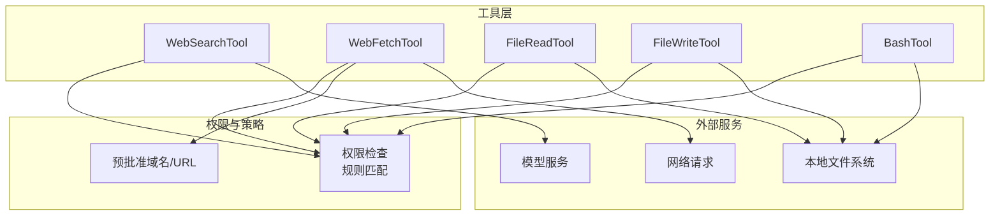
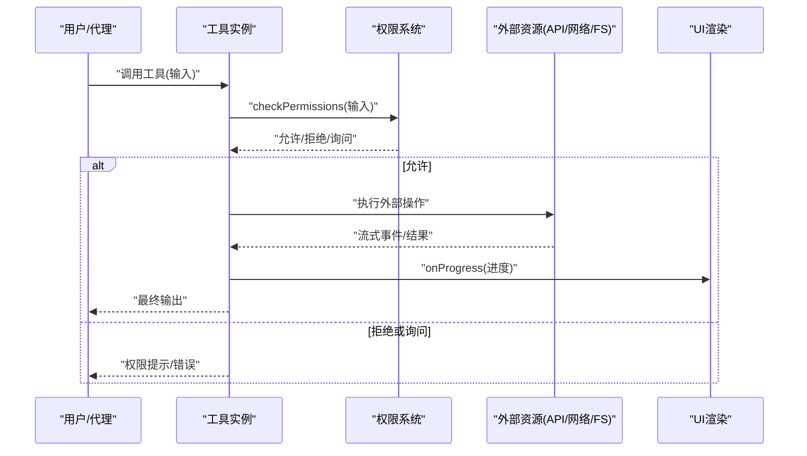
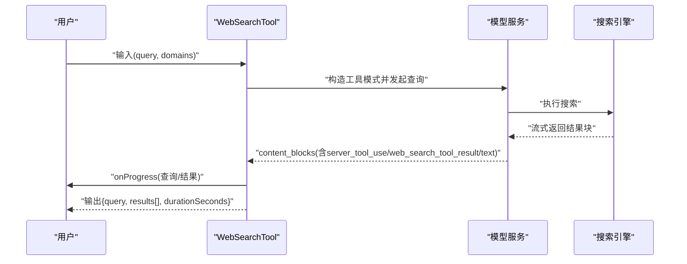
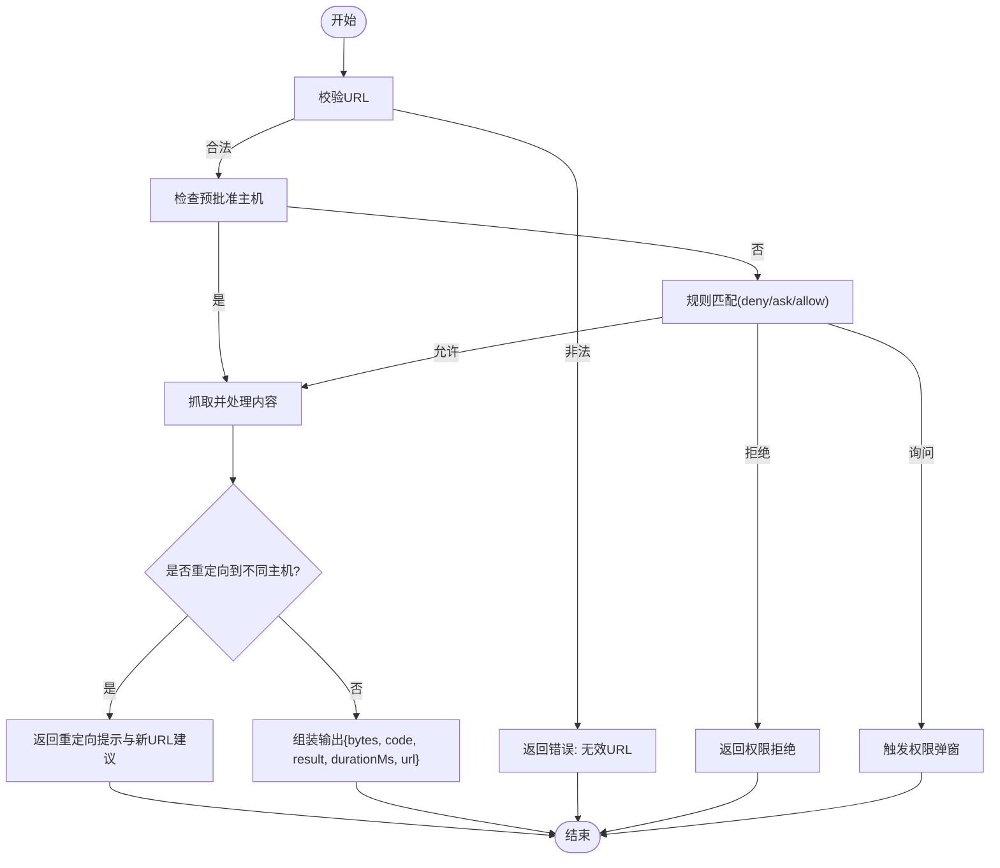
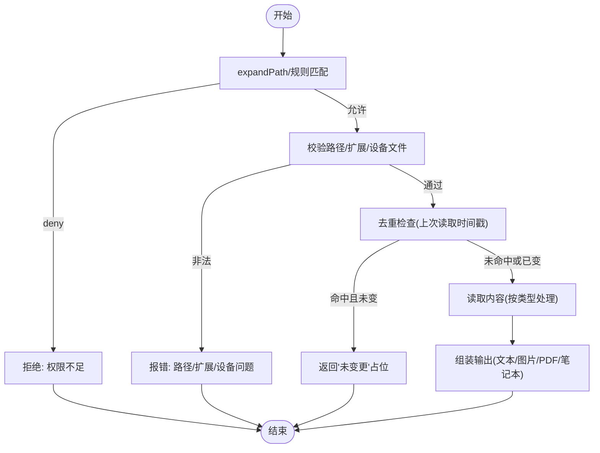
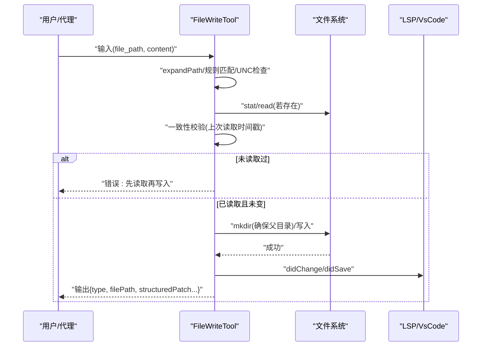
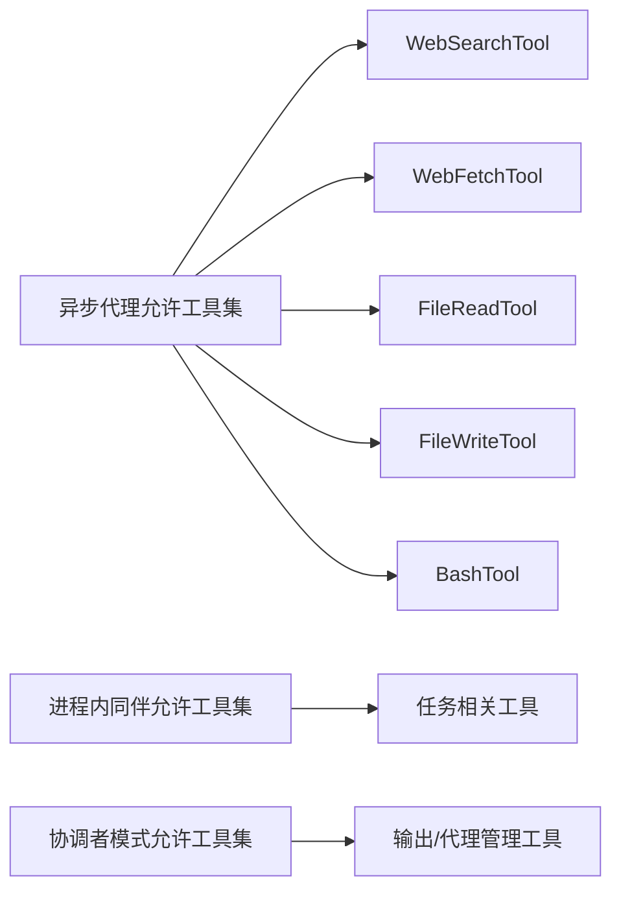

# 内置工具详解

<cite>
**本文引用的文件**
- [WebSearchTool.ts](file://src/tools/WebSearchTool/WebSearchTool.ts)
- [WebFetchTool.ts](file://src/tools/WebFetchTool/WebFetchTool.ts)
- [FileReadTool.ts](file://src/tools/FileReadTool/FileReadTool.ts)
- [FileWriteTool.ts](file://src/tools/FileWriteTool/FileWriteTool.ts)
- [tools.ts](file://src/constants/tools.ts)
- [prompt.ts（WebSearchTool）](file://src/tools/WebSearchTool/prompt.ts)
- [prompt.ts（WebFetchTool）](file://src/tools/WebFetchTool/prompt.ts)
- [prompt.ts（FileReadTool）](file://src/tools/FileReadTool/prompt.ts)
- [prompt.ts（FileWriteTool）](file://src/tools/FileWriteTool/prompt.ts)
- [UI.js（WebSearchTool）](file://src/tools/WebSearchTool/UI.js)
- [UI.js（WebFetchTool）](file://src/tools/WebFetchTool/UI.js)
- [UI.js（FileReadTool）](file://src/tools/FileReadTool/UI.js)
- [UI.js（FileWriteTool）](file://src/tools/FileWriteTool/UI.js)
- [limits.ts（FileReadTool）](file://src/tools/FileReadTool/limits.ts)
- [preapproved.ts（WebFetchTool）](file://src/tools/WebFetchTool/preapproved.ts)
- [utils.ts（WebFetchTool）](file://src/tools/WebFetchTool/utils.ts)
- [bashCommandHelpers.ts（BashTool）](file://src/tools/BashTool/bashCommandHelpers.ts)
- [bashSecurity.ts（BashTool）](file://src/tools/BashTool/bashSecurity.ts)
- [bashPermissions.ts（BashTool）](file://src/tools/BashTool/bashPermissions.ts)
- [modeValidation.ts（BashTool）](file://src/tools/BashTool/modeValidation.ts)
- [pathValidation.ts（BashTool）](file://src/tools/BashTool/pathValidation.ts)
- [sedValidation.ts（BashTool）](file://src/tools/BashTool/sedValidation.ts)
- [shouldUseSandbox.ts（BashTool）](file://src/tools/BashTool/shouldUseSandbox.ts)
- [toolName.ts（BashTool）](file://src/tools/BashTool/toolName.ts)
- [utils.ts（BashTool）](file://src/tools/BashTool/utils.ts)
- [commandSemantics.ts（BashTool）](file://src/tools/BashTool/commandSemantics.ts)
- [destructiveCommandWarning.ts（BashTool）](file://src/tools/BashTool/destructiveCommandWarning.ts)
- [commentLabel.ts（BashTool）](file://src/tools/BashTool/commentLabel.ts)
- [readOnlyValidation.ts（BashTool）](file://src/tools/BashTool/readOnlyValidation.ts)
</cite>

## 目录
1. [简介](#简介)
2. [项目结构与工具分类](#项目结构与工具分类)
3. [核心工具总览](#核心工具总览)
4. [架构概览](#架构概览)
5. [详细组件分析](#详细组件分析)
6. [依赖关系分析](#依赖关系分析)
7. [性能与适用场景](#性能与适用场景)
8. [故障排查指南](#故障排查指南)
9. [结论](#结论)
10. [附录：参数与权限速查](#附录参数与权限速查)

## 简介
本指南面向 Claude Code 用户与集成开发者，系统讲解内置工具的使用方法、参数配置、输入输出格式、错误处理、安全限制与权限要求，并结合代码实现给出最佳实践与性能建议。重点覆盖以下工具：
- WebSearchTool：网络搜索能力
- WebFetchTool：网页抓取与内容抽取
- FileReadTool：文件读取（文本/图片/PDF/笔记本）
- FileWriteTool：文件写入（原子落盘、增量变更可视化）
- BashTool：命令执行（安全沙箱、权限校验、破坏性警告）

## 项目结构与工具分类
- 工具统一通过构建器注册并暴露一致的生命周期钩子（描述、输入/输出模式、权限检查、调用流程、UI 渲染等）。
- 工具按职责分为三类：
  - 网络访问类：WebSearchTool、WebFetchTool
  - 文件系统类：FileReadTool、FileWriteTool
  - 命令执行类：BashTool

图表来源
- [WebSearchTool.ts:152-436](file://src/tools/WebSearchTool/WebSearchTool.ts#L152-L436)
- [WebFetchTool.ts:66-319](file://src/tools/WebFetchTool/WebFetchTool.ts#L66-L319)
- [FileReadTool.ts:337-800](file://src/tools/FileReadTool/FileReadTool.ts#L337-L800)
- [FileWriteTool.ts:94-435](file://src/tools/FileWriteTool/FileWriteTool.ts#L94-L435)
- [preapproved.ts（WebFetchTool）](file://src/tools/WebFetchTool/preapproved.ts)
- [tools.ts:55-88](file://src/constants/tools.ts#L55-L88)

章节来源
- [tools.ts:55-88](file://src/constants/tools.ts#L55-L88)

## 核心工具总览
- WebSearchTool：面向“当前信息检索”，支持限定域/排除域，流式进度回调，返回混合文本摘要与链接结果。
- WebFetchTool：面向“指定 URL 的内容抽取”，支持预批准主机、重定向检测、二进制内容落盘提示、可选提示后处理。
- FileReadTool：面向“文件读取”，支持偏移/行数/页范围读取，自动探测图片/PDF/笔记本，带去重与令牌上限控制。
- FileWriteTool：面向“文件写入”，原子落盘、写前一致性校验、增量 diff 可视化、通知 LSP/VsCode。
- BashTool：面向“命令执行”，多层安全校验（路径/模式/只读）、破坏性警告、沙箱启用策略。

章节来源
- [WebSearchTool.ts:152-436](file://src/tools/WebSearchTool/WebSearchTool.ts#L152-L436)
- [WebFetchTool.ts:66-319](file://src/tools/WebFetchTool/WebFetchTool.ts#L66-L319)
- [FileReadTool.ts:337-800](file://src/tools/FileReadTool/FileReadTool.ts#L337-L800)
- [FileWriteTool.ts:94-435](file://src/tools/FileWriteTool/FileWriteTool.ts#L94-L435)
- [tools.ts:55-88](file://src/constants/tools.ts#L55-L88)

## 架构概览
工具调用遵循统一模式：输入校验 → 权限决策 → 调用外部资源 → 流式进度回调 → 组装输出 → UI 展示。

图表来源
- [WebSearchTool.ts:209-222](file://src/tools/WebSearchTool/WebSearchTool.ts#L209-L222)
- [WebFetchTool.ts:104-180](file://src/tools/WebFetchTool/WebFetchTool.ts#L104-L180)
- [FileReadTool.ts:398-405](file://src/tools/FileReadTool/FileReadTool.ts#L398-L405)
- [FileWriteTool.ts:135-142](file://src/tools/FileWriteTool/FileWriteTool.ts#L135-L142)

## 详细组件分析

### WebSearchTool（网络搜索）
- 功能特性
  - 以流式方式执行网络搜索，支持限定/排除域名，最大使用次数限制。
  - 提供进度回调：查询更新、结果到达。
  - 输出包含查询、结果数组（文本摘要或搜索命中列表）、耗时。
- 输入参数
  - query: 关键词字符串（必填，最小长度约束）
  - allowed_domains: 仅允许的域名数组（互斥于 blocked_domains）
  - blocked_domains: 排除的域名数组（互斥于 allowed_domains）
- 输出格式
  - query: 执行的查询词
  - results: 数组，元素为字符串（总结）或对象（包含 title/url 列表）
  - durationSeconds: 总耗时（秒）
- 错误处理
  - 输入校验失败会返回错误码与消息；搜索错误块会记录并回传错误信息。
- 安全与权限
  - 启用条件受模型/提供商限制；权限检查返回“允许/拒绝/询问”三态。
- 最佳实践
  - 使用 allowed_domains/blocked_domains 精准收窄结果域。
  - 结合 onProgress 做交互式反馈。
- 适用场景
  - 需要“当前事实信息”的问答、竞品分析、技术趋势检索。

图表来源
- [WebSearchTool.ts:254-400](file://src/tools/WebSearchTool/WebSearchTool.ts#L254-L400)
- [prompt.ts（WebSearchTool）](file://src/tools/WebSearchTool/prompt.ts)
- [UI.js（WebSearchTool）](file://src/tools/WebSearchTool/UI.js)

章节来源
- [WebSearchTool.ts:25-69](file://src/tools/WebSearchTool/WebSearchTool.ts#L25-L69)
- [WebSearchTool.ts:235-253](file://src/tools/WebSearchTool/WebSearchTool.ts#L235-L253)
- [WebSearchTool.ts:254-400](file://src/tools/WebSearchTool/WebSearchTool.ts#L254-L400)
- [WebSearchTool.ts:401-435](file://src/tools/WebSearchTool/WebSearchTool.ts#L401-L435)
- [prompt.ts（WebSearchTool）](file://src/tools/WebSearchTool/prompt.ts)
- [UI.js（WebSearchTool）](file://src/tools/WebSearchTool/UI.js)

### WebFetchTool（网页抓取）
- 功能特性
  - 抓取 URL 内容，支持预批准主机、重定向检测、二进制内容落盘提示。
  - 可对 Markdown 应用提示进行二次抽取，或直接返回原始内容（在特定条件下）。
- 输入参数
  - url: 目标 URL（必填，URL 校验）
  - prompt: 对抓取内容应用的提示（必填）
- 输出格式
  - bytes: 字节数
  - code/codeText: HTTP 状态码与文本
  - result: 处理后的结果文本
  - durationMs: 耗时（毫秒）
  - url: 实际抓取的 URL
- 错误处理
  - 非法 URL 返回错误元数据；重定向到不同主机时返回重定向提示并建议改用新 URL。
- 安全与权限
  - 预批准主机直接放行；否则基于规则匹配 deny/ask/allow；明确提示不适用于认证/私有页面。
- 最佳实践
  - 优先使用预批准域名；避免抓取需要登录的内容。
  - 对 PDF 等二进制内容，关注落盘路径以便进一步分析。
- 适用场景
  - 抓取公开文档、API 文档、博客文章并进行摘要/提取。

图表来源
- [WebFetchTool.ts:191-204](file://src/tools/WebFetchTool/WebFetchTool.ts#L191-L204)
- [WebFetchTool.ts:208-299](file://src/tools/WebFetchTool/WebFetchTool.ts#L208-L299)
- [preapproved.ts（WebFetchTool）](file://src/tools/WebFetchTool/preapproved.ts)
- [utils.ts（WebFetchTool）](file://src/tools/WebFetchTool/utils.ts)

章节来源
- [WebFetchTool.ts:24-48](file://src/tools/WebFetchTool/WebFetchTool.ts#L24-L48)
- [WebFetchTool.ts:191-204](file://src/tools/WebFetchTool/WebFetchTool.ts#L191-L204)
- [WebFetchTool.ts:208-299](file://src/tools/WebFetchTool/WebFetchTool.ts#L208-L299)
- [prompt.ts（WebFetchTool）](file://src/tools/WebFetchTool/prompt.ts)
- [UI.js（WebFetchTool）](file://src/tools/WebFetchTool/UI.js)

### FileReadTool（文件读取）
- 功能特性
  - 支持文本、图片、PDF、Jupyter 笔记本等多种类型；可按行/页范围读取；自动探测并去重未变更内容。
  - 对大文件提供令牌上限估算与异常抛出；对图片进行尺寸与缩放处理；对 PDF 进行页范围解析与分页提取。
- 输入参数
  - file_path: 绝对路径（必填）
  - offset/limit: 行级范围（可选）
  - pages: PDF 页范围（如 "1-5,10"，可选）
- 输出格式
  - type: 'text' | 'image' | 'pdf' | 'parts' | 'notebook' | 'file_unchanged'
  - file: 包含对应类型的字段（如 filePath/content/lines/dimensions/base64 等）
- 错误处理
  - 路径不存在时提供相似文件与 CWD 建议；设备文件阻断；二进制扩展限制；PDF 页范围超限；令牌超限抛出专用异常。
- 安全与权限
  - 基于通配规则匹配读取权限；UNC 路径延迟 I/O；禁止读取特定设备文件。
- 最佳实践
  - 大文件优先使用 offset/limit 或 pages；开启技能目录发现以增强上下文。
- 适用场景
  - 日志/源码/配置文件/图片/PDF/笔记本的快速读取与上下文注入。

图表来源
- [FileReadTool.ts:418-495](file://src/tools/FileReadTool/FileReadTool.ts#L418-L495)
- [FileReadTool.ts:594-651](file://src/tools/FileReadTool/FileReadTool.ts#L594-L651)
- [limits.ts（FileReadTool）](file://src/tools/FileReadTool/limits.ts)

章节来源
- [FileReadTool.ts:227-246](file://src/tools/FileReadTool/FileReadTool.ts#L227-L246)
- [FileReadTool.ts:418-495](file://src/tools/FileReadTool/FileReadTool.ts#L418-L495)
- [FileReadTool.ts:594-651](file://src/tools/FileReadTool/FileReadTool.ts#L594-L651)
- [prompt.ts（FileReadTool）](file://src/tools/FileReadTool/prompt.ts)
- [UI.js（FileReadTool）](file://src/tools/FileReadTool/UI.js)

### FileWriteTool（文件写入）
- 功能特性
  - 原子写入：写前校验上次读取时间戳，防止并发修改导致的数据漂移；写后刷新 LSP/VsCode 状态；生成结构化 diff。
  - 支持动态技能目录发现与激活；对 CLAUDE.md 写入进行专项日志记录；远程环境可计算 Git diff。
- 输入参数
  - file_path: 绝对路径（必填）
  - content: 写入内容（必填）
- 输出格式
  - type: 'create' | 'update'
  - filePath/content/structuredPatch/originalFile/gitDiff(可选)
- 错误处理
  - 未读取过即写入：提示先读取；文件被意外修改：提示重新读取；UNC 路径跳过 I/O 防泄漏；团队内存含敏感信息时拒绝写入。
- 安全与权限
  - 基于通配规则匹配编辑权限；UNC 路径延迟 I/O；写前一致性校验。
- 最佳实践
  - 先读取再写入；小步提交；利用 diff 视图核对变更。
- 适用场景
  - 自动化脚本生成、配置文件更新、批量修复与注释。

图表来源
- [FileWriteTool.ts:153-222](file://src/tools/FileWriteTool/FileWriteTool.ts#L153-L222)
- [FileWriteTool.ts:223-417](file://src/tools/FileWriteTool/FileWriteTool.ts#L223-L417)

章节来源
- [FileWriteTool.ts:56-91](file://src/tools/FileWriteTool/FileWriteTool.ts#L56-L91)
- [FileWriteTool.ts:153-222](file://src/tools/FileWriteTool/FileWriteTool.ts#L153-L222)
- [FileWriteTool.ts:223-417](file://src/tools/FileWriteTool/FileWriteTool.ts#L223-L417)
- [prompt.ts（FileWriteTool）](file://src/tools/FileWriteTool/prompt.ts)
- [UI.js（FileWriteTool）](file://src/tools/FileWriteTool/UI.js)

### BashTool（命令执行）
- 功能特性
  - 多层安全与权限控制：路径合法性、模式匹配、只读限制、破坏性命令警告、沙箱启用策略。
  - 提供命令语义解析、注释标签、模式校验与路径校验等辅助能力。
- 输入参数
  - 由具体命令决定（例如 ls/cat/echo 等），统一通过工具定义的输入模式与校验逻辑。
- 输出格式
  - 标准命令输出（stdout/stderr）经工具封装后作为结果块返回。
- 错误处理
  - 路径/模式/只读/破坏性/沙箱策略等维度逐一拦截；必要时给出替代建议。
- 安全与权限
  - 严格路径白名单/黑名单；禁止危险路径；对可能破坏性操作发出警告；可启用沙箱隔离。
- 最佳实践
  - 优先使用只读命令；在沙箱内执行高风险命令；配合破坏性警告与注释标签提升可审计性。
- 适用场景
  - 项目探查、构建脚本辅助、日志查看、文件系统巡检。

章节来源
- [bashCommandHelpers.ts（BashTool）](file://src/tools/BashTool/bashCommandHelpers.ts)
- [bashSecurity.ts（BashTool）](file://src/tools/BashTool/bashSecurity.ts)
- [bashPermissions.ts（BashTool）](file://src/tools/BashTool/bashPermissions.ts)
- [modeValidation.ts（BashTool）](file://src/tools/BashTool/modeValidation.ts)
- [pathValidation.ts（BashTool）](file://src/tools/BashTool/pathValidation.ts)
- [sedValidation.ts（BashTool）](file://src/tools/BashTool/sedValidation.ts)
- [shouldUseSandbox.ts（BashTool）](file://src/tools/BashTool/shouldUseSandbox.ts)
- [toolName.ts（BashTool）](file://src/tools/BashTool/toolName.ts)
- [utils.ts（BashTool）](file://src/tools/BashTool/utils.ts)
- [commandSemantics.ts（BashTool）](file://src/tools/BashTool/commandSemantics.ts)
- [destructiveCommandWarning.ts（BashTool）](file://src/tools/BashTool/destructiveCommandWarning.ts)
- [commentLabel.ts（BashTool）](file://src/tools/BashTool/commentLabel.ts)
- [readOnlyValidation.ts（BashTool）](file://src/tools/BashTool/readOnlyValidation.ts)

## 依赖关系分析
- 工具允许集合
  - 异步代理允许工具集：包含文件读写、搜索、抓取、Grep/Glob、Shell 工具、技能工具等。
  - 进程内同伴工具集：任务管理、消息发送、计划任务等。
  - 协调者模式工具集：仅输出与代理管理相关工具。
- 工具间耦合
  - FileReadTool 与 FileWriteTool 在一致性校验上存在读写协同（写前需先读取）。
  - WebFetchTool 与 WebSearchTool 均依赖权限系统与 UI 渲染模块。
  - BashTool 与权限/沙箱/安全策略模块强耦合。

图表来源
- [tools.ts:55-88](file://src/constants/tools.ts#L55-L88)
- [tools.ts:107-112](file://src/constants/tools.ts#L107-L112)

章节来源
- [tools.ts:55-112](file://src/constants/tools.ts#L55-L112)

## 性能与适用场景
- WebSearchTool
  - 流式进度与多轮搜索，适合需要“实时信息”的场景；注意最大使用次数限制。
- WebFetchTool
  - 预批准主机可绕过权限弹窗；二进制内容落盘便于离线分析；对长文档建议先做提示抽取。
- FileReadTool
  - 去重机制减少重复传输；令牌上限保护避免超大文件拖垮对话；PDF/图片自动处理。
- FileWriteTool
  - 原子写入与 diff 可视化降低并发风险；LSP/VsCode 通知提升开发体验。
- BashTool
  - 沙箱与破坏性警告显著降低误操作风险；只读模式适合日常巡检。

[本节为通用性能讨论，无需列出具体文件来源]

## 故障排查指南
- WebSearchTool
  - 现象：无法启用/无结果
  - 排查：确认提供商与模型支持；检查 allowed_domains/blocked_domains 是否同时设置；查看权限状态。
- WebFetchTool
  - 现象：权限弹窗频繁/抓取失败
  - 排查：确认 URL 是否为认证/私有页面；检查预批准主机；留意重定向提示。
- FileReadTool
  - 现象：报错“文件不存在/路径非法”
  - 排查：使用绝对路径；检查权限规则；尝试相似文件名或 CWD 下建议路径。
- FileWriteTool
  - 现象：提示“请先读取再写入”或“文件已被意外修改”
  - 排查：先执行 FileReadTool；避免外部工具/编辑器并发修改；重新读取后再次写入。
- BashTool
  - 现象：命令被拒绝/沙箱报错
  - 排查：检查路径合法性与只读限制；确认破坏性命令警告；必要时启用沙箱。

章节来源
- [WebSearchTool.ts:235-253](file://src/tools/WebSearchTool/WebSearchTool.ts#L235-L253)
- [WebFetchTool.ts:104-180](file://src/tools/WebFetchTool/WebFetchTool.ts#L104-L180)
- [FileReadTool.ts:418-495](file://src/tools/FileReadTool/FileReadTool.ts#L418-L495)
- [FileWriteTool.ts:153-222](file://src/tools/FileWriteTool/FileWriteTool.ts#L153-L222)
- [bashSecurity.ts（BashTool）](file://src/tools/BashTool/bashSecurity.ts)
- [shouldUseSandbox.ts（BashTool）](file://src/tools/BashTool/shouldUseSandbox.ts)

## 结论
内置工具围绕“安全、可控、可观测”的原则设计：权限系统贯穿始终，网络与文件工具均提供细粒度的输入校验与错误反馈，命令执行工具则通过多层安全策略与沙箱保障。合理选择工具与参数、遵循最佳实践，可在保证安全的前提下高效完成信息检索、内容抽取与文件操作任务。

[本节为总结性内容，无需列出具体文件来源]

## 附录：参数与权限速查
- WebSearchTool
  - 输入：query（必填）、allowed_domains（可选，互斥）、blocked_domains（可选，互斥）
  - 输出：query、results[]（文本或搜索命中）、durationSeconds
  - 权限：checkPermissions 返回允许/拒绝/询问
- WebFetchTool
  - 输入：url（必填，URL 校验）、prompt（必填）
  - 输出：bytes、code、codeText、result、durationMs、url
  - 权限：预批准主机直通；否则按规则 deny/ask/allow
- FileReadTool
  - 输入：file_path（必填）、offset/limit（可选）、pages（PDF，可选）
  - 输出：type 与对应 file 字段
  - 权限：读取权限规则匹配
- FileWriteTool
  - 输入：file_path（必填，绝对路径）、content（必填）
  - 输出：type、filePath、content、structuredPatch、originalFile、gitDiff（可选）
  - 权限：编辑权限规则匹配
- BashTool
  - 输入：命令相关参数（由具体命令定义）
  - 输出：标准命令输出
  - 权限：路径/模式/只读/破坏性/沙箱策略

章节来源
- [WebSearchTool.ts:25-69](file://src/tools/WebSearchTool/WebSearchTool.ts#L25-L69)
- [WebFetchTool.ts:24-48](file://src/tools/WebFetchTool/WebFetchTool.ts#L24-L48)
- [FileReadTool.ts:227-246](file://src/tools/FileReadTool/FileReadTool.ts#L227-L246)
- [FileWriteTool.ts:56-91](file://src/tools/FileWriteTool/FileWriteTool.ts#L56-L91)
- [tools.ts:55-88](file://src/constants/tools.ts#L55-L88)