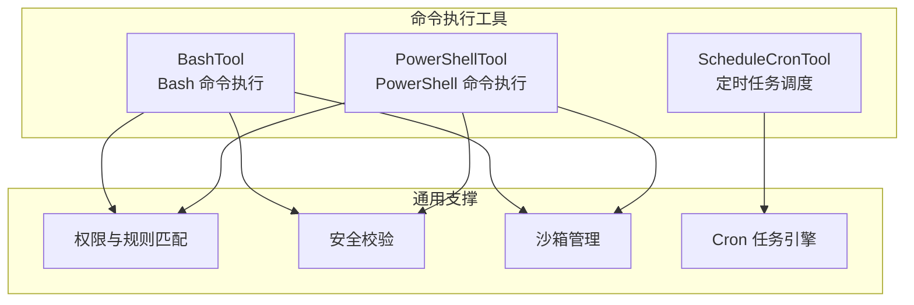
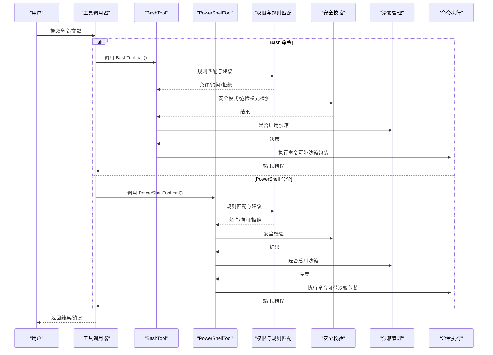
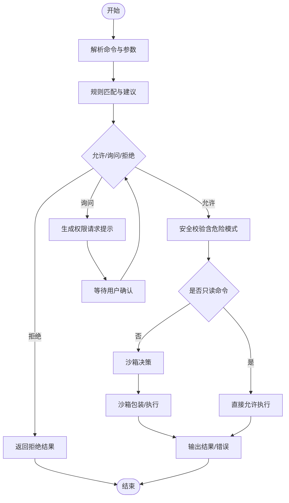
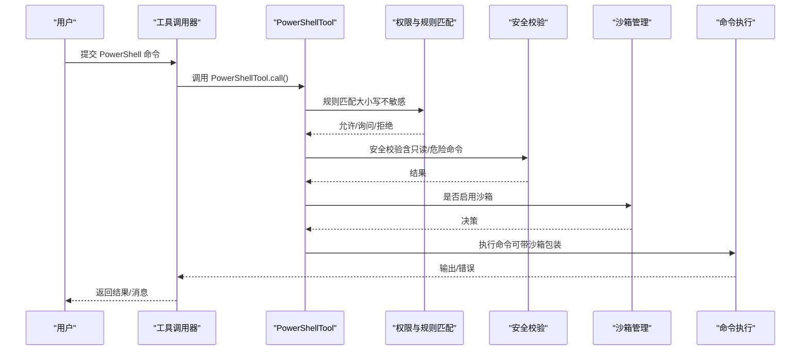
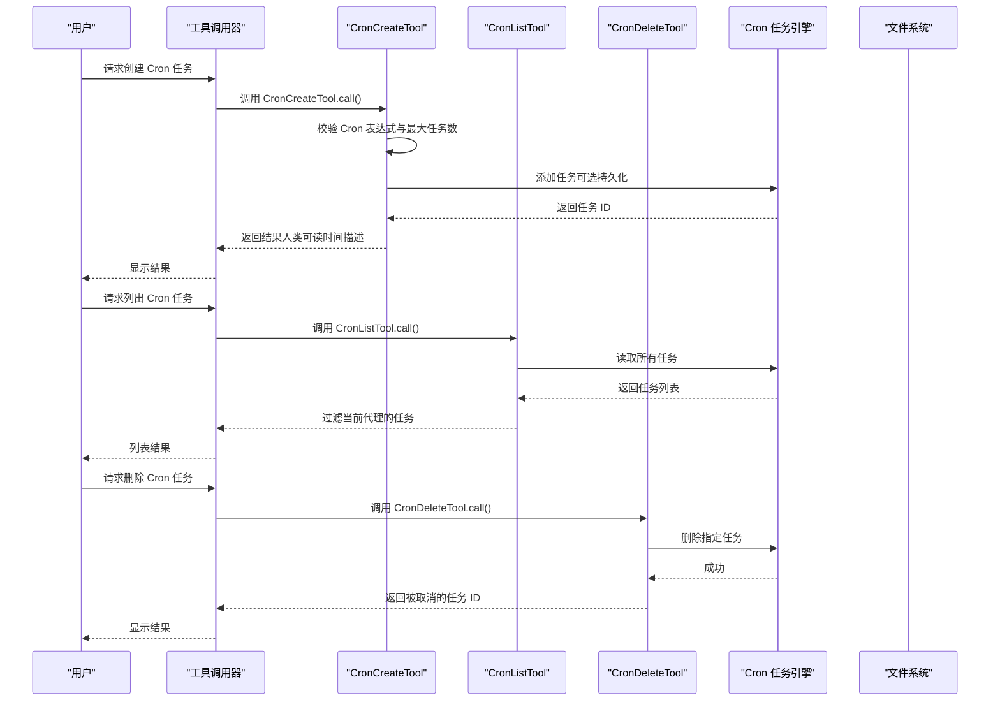
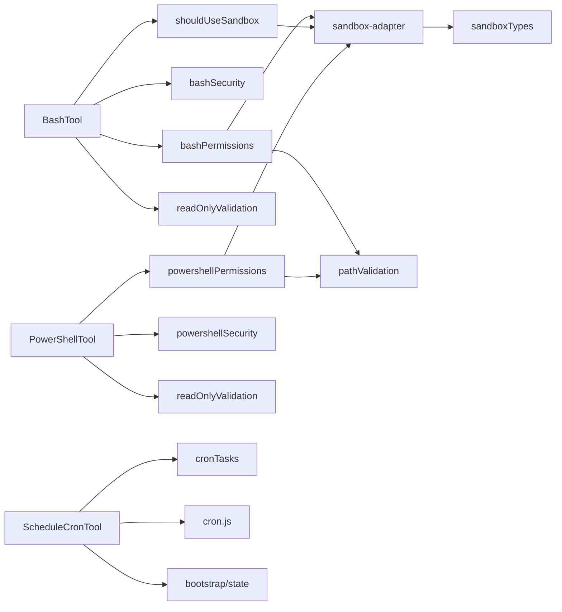

# 命令执行工具

<cite>
**本文引用的文件**
- [src/tools/BashTool/BashTool.ts](file://src/tools/BashTool/BashTool.ts)
- [src/tools/BashTool/bashPermissions.ts](file://src/tools/BashTool/bashPermissions.ts)
- [src/tools/BashTool/bashSecurity.ts](file://src/tools/BashTool/bashSecurity.ts)
- [src/tools/BashTool/shouldUseSandbox.ts](file://src/tools/BashTool/shouldUseSandbox.ts)
- [src/tools/BashTool/readOnlyValidation.ts](file://src/tools/BashTool/readOnlyValidation.ts)
- [src/tools/PowerShellTool/PowerShellTool.ts](file://src/tools/PowerShellTool/PowerShellTool.ts)
- [src/tools/PowerShellTool/powershellPermissions.ts](file://src/tools/PowerShellTool/powershellPermissions.ts)
- [src/tools/PowerShellTool/powershellSecurity.ts](file://src/tools/PowerShellTool/powershellSecurity.ts)
- [src/tools/PowerShellTool/readOnlyValidation.ts](file://src/tools/PowerShellTool/readOnlyValidation.ts)
- [src/tools/ScheduleCronTool/CronCreateTool.ts](file://src/tools/ScheduleCronTool/CronCreateTool.ts)
- [src/tools/ScheduleCronTool/CronListTool.ts](file://src/tools/ScheduleCronTool/CronListTool.ts)
- [src/tools/ScheduleCronTool/CronDeleteTool.ts](file://src/tools/ScheduleCronTool/CronDeleteTool.ts)
- [src/utils/sandbox/sandbox-adapter.ts](file://src/utils/sandbox/sandbox-adapter.ts)
- [src/entrypoints/sandboxTypes.ts](file://src/entrypoints/sandboxTypes.ts)
- [src/utils/permissions/pathValidation.ts](file://src/utils/permissions/pathValidation.ts)
- [src/utils/cronTasks.ts](file://src/utils/cronTasks.ts)
- [src/utils/cron.js](file://src/utils/cron.js)
- [src/utils/teammateContext.js](file://src/utils/teammateContext.js)
- [src/bootstrap/state.ts](file://src/bootstrap/state.ts)
</cite>

## 目录
1. [简介](#简介)
2. [项目结构](#项目结构)
3. [核心组件](#核心组件)
4. [架构总览](#架构总览)
5. [详细组件分析](#详细组件分析)
6. [依赖关系分析](#依赖关系分析)
7. [性能考量](#性能考量)
8. [故障排查指南](#故障排查指南)
9. [结论](#结论)
10. [附录](#附录)

## 简介
本指南围绕 Claude Code 的命令执行工具，系统讲解三类能力：
- BashTool：Bash 命令执行与安全策略
- PowerShellTool：PowerShell 命令支持与安全策略
- ScheduleCronTool：基于标准 Cron 表达式的定时任务调度（创建、列出、删除）

文档覆盖命令语法、参数传递、环境变量设置、权限控制、沙箱隔离、只读路径保护、输出处理、错误处理策略，并提供安全使用建议与性能优化技巧。

## 项目结构
命令执行工具位于 src/tools 下，分别对应 BashTool、PowerShellTool 与 ScheduleCronTool。每个工具均通过统一的工具基类构建，具备输入/输出模式校验、权限检查、提示词生成、结果渲染等通用能力；同时各自实现平台特定的安全策略与规则匹配逻辑。

图示来源
- [src/tools/BashTool/BashTool.ts](file://src/tools/BashTool/BashTool.ts)
- [src/tools/PowerShellTool/PowerShellTool.ts](file://src/tools/PowerShellTool/PowerShellTool.ts)
- [src/tools/ScheduleCronTool/CronCreateTool.ts](file://src/tools/ScheduleCronTool/CronCreateTool.ts)
- [src/tools/BashTool/bashPermissions.ts](file://src/tools/BashTool/bashPermissions.ts)
- [src/tools/BashTool/bashSecurity.ts](file://src/tools/BashTool/bashSecurity.ts)
- [src/tools/PowerShellTool/powershellPermissions.ts](file://src/tools/PowerShellTool/powershellPermissions.ts)
- [src/tools/PowerShellTool/powershellSecurity.ts](file://src/tools/PowerShellTool/powershellSecurity.ts)
- [src/utils/sandbox/sandbox-adapter.ts](file://src/utils/sandbox/sandbox-adapter.ts)
- [src/utils/cronTasks.ts](file://src/utils/cronTasks.ts)

章节来源
- [src/tools/BashTool/BashTool.ts](file://src/tools/BashTool/BashTool.ts)
- [src/tools/PowerShellTool/PowerShellTool.ts](file://src/tools/PowerShellTool/PowerShellTool.ts)
- [src/tools/ScheduleCronTool/CronCreateTool.ts](file://src/tools/ScheduleCronTool/CronCreateTool.ts)

## 核心组件
- BashTool：负责 Bash 命令解析、权限规则匹配、安全校验、只读路径保护、沙箱决策与执行包装。
- PowerShellTool：负责 PowerShell 命令解析、权限规则匹配、安全校验、只读路径保护与输出处理。
- ScheduleCronTool：提供 Cron 创建、列出、删除工具，封装 Cron 解析、任务持久化与调度状态管理。

章节来源
- [src/tools/BashTool/bashPermissions.ts](file://src/tools/BashTool/bashPermissions.ts)
- [src/tools/BashTool/bashSecurity.ts](file://src/tools/BashTool/bashSecurity.ts)
- [src/tools/PowerShellTool/powershellPermissions.ts](file://src/tools/PowerShellTool/powershellPermissions.ts)
- [src/tools/PowerShellTool/powershellSecurity.ts](file://src/tools/PowerShellTool/powershellSecurity.ts)
- [src/tools/ScheduleCronTool/CronCreateTool.ts](file://src/tools/ScheduleCronTool/CronCreateTool.ts)
- [src/tools/ScheduleCronTool/CronListTool.ts](file://src/tools/ScheduleCronTool/CronListTool.ts)
- [src/tools/ScheduleCronTool/CronDeleteTool.ts](file://src/tools/ScheduleCronTool/CronDeleteTool.ts)

## 架构总览
下图展示命令执行工具在权限、安全与沙箱之间的交互关系，以及 Bash 与 PowerShell 的差异化处理路径。

图示来源
- [src/tools/BashTool/BashTool.ts](file://src/tools/BashTool/BashTool.ts)
- [src/tools/PowerShellTool/PowerShellTool.ts](file://src/tools/PowerShellTool/PowerShellTool.ts)
- [src/tools/BashTool/bashPermissions.ts](file://src/tools/BashTool/bashPermissions.ts)
- [src/tools/BashTool/bashSecurity.ts](file://src/tools/BashTool/bashSecurity.ts)
- [src/tools/PowerShellTool/powershellPermissions.ts](file://src/tools/PowerShellTool/powershellPermissions.ts)
- [src/tools/PowerShellTool/powershellSecurity.ts](file://src/tools/PowerShellTool/powershellSecurity.ts)
- [src/utils/sandbox/sandbox-adapter.ts](file://src/utils/sandbox/sandbox-adapter.ts)

## 详细组件分析

### BashTool 组件分析
BashTool 负责 Bash 命令的输入解析、权限规则匹配、安全校验、只读路径保护、沙箱决策与执行包装。其关键流程如下：

图示来源
- [src/tools/BashTool/BashTool.ts](file://src/tools/BashTool/BashTool.ts)
- [src/tools/BashTool/bashPermissions.ts](file://src/tools/BashTool/bashPermissions.ts)
- [src/tools/BashTool/bashSecurity.ts](file://src/tools/BashTool/bashSecurity.ts)
- [src/tools/BashTool/shouldUseSandbox.ts](file://src/tools/BashTool/shouldUseSandbox.ts)
- [src/tools/BashTool/readOnlyValidation.ts](file://src/tools/BashTool/readOnlyValidation.ts)

章节来源
- [src/tools/BashTool/BashTool.ts](file://src/tools/BashTool/BashTool.ts)
- [src/tools/BashTool/bashPermissions.ts](file://src/tools/BashTool/bashPermissions.ts)
- [src/tools/BashTool/bashSecurity.ts](file://src/tools/BashTool/bashSecurity.ts)
- [src/tools/BashTool/shouldUseSandbox.ts](file://src/tools/BashTool/shouldUseSandbox.ts)
- [src/tools/BashTool/readOnlyValidation.ts](file://src/tools/BashTool/readOnlyValidation.ts)

要点说明
- 权限规则匹配：支持精确匹配与前缀匹配，自动建议规则，避免一次性保存过多规则导致噪声。
- 安全校验：识别命令替换、进程替换、Zsh 特性等高危模式，阻断潜在绕过。
- 只读路径保护：对 Git、只读命令进行快速判定，减少不必要的权限弹窗。
- 沙箱决策：根据策略与排除列表决定是否启用沙箱，支持“危险禁用沙箱”场景但受策略限制。

### PowerShellTool 组件分析
PowerShellTool 面向 Windows 环境，提供 PowerShell 命令的解析、权限规则匹配、安全校验与只读路径保护。其流程与 BashTool 类似，但针对 PowerShell 的语义与特性做了适配。

图示来源
- [src/tools/PowerShellTool/PowerShellTool.ts](file://src/tools/PowerShellTool/PowerShellTool.ts)
- [src/tools/PowerShellTool/powershellPermissions.ts](file://src/tools/PowerShellTool/powershellPermissions.ts)
- [src/tools/PowerShellTool/powershellSecurity.ts](file://src/tools/PowerShellTool/powershellSecurity.ts)
- [src/utils/sandbox/sandbox-adapter.ts](file://src/utils/sandbox/sandbox-adapter.ts)

章节来源
- [src/tools/PowerShellTool/PowerShellTool.ts](file://src/tools/PowerShellTool/PowerShellTool.ts)
- [src/tools/PowerShellTool/powershellPermissions.ts](file://src/tools/PowerShellTool/powershellPermissions.ts)
- [src/tools/PowerShellTool/powershellSecurity.ts](file://src/tools/PowerShellTool/powershellSecurity.ts)
- [src/tools/PowerShellTool/readOnlyValidation.ts](file://src/tools/PowerShellTool/readOnlyValidation.ts)

要点说明
- 规则匹配：大小写不敏感，支持模块限定命令名的规范化处理。
- 安全校验：识别危险 cmdlet 与重定向写入，结合只读命令快速放行。
- 只读路径保护：对 Git、只读命令进行快速判定，降低权限弹窗频率。
- 沙箱决策：遵循统一沙箱策略，支持受限场景下的“危险禁用沙箱”。

### ScheduleCronTool 组件分析
ScheduleCronTool 提供 Cron 任务的创建、列出与删除能力，基于标准 5 字段 Cron 表达式与本地时区解析，支持一次性与周期性任务，并可选择持久化到磁盘以跨会话存活。

图示来源
- [src/tools/ScheduleCronTool/CronCreateTool.ts](file://src/tools/ScheduleCronTool/CronCreateTool.ts)
- [src/tools/ScheduleCronTool/CronListTool.ts](file://src/tools/ScheduleCronTool/CronListTool.ts)
- [src/tools/ScheduleCronTool/CronDeleteTool.ts](file://src/tools/ScheduleCronTool/CronDeleteTool.ts)
- [src/utils/cronTasks.ts](file://src/utils/cronTasks.ts)
- [src/utils/cron.js](file://src/utils/cron.js)
- [src/bootstrap/state.ts](file://src/bootstrap/state.ts)

章节来源
- [src/tools/ScheduleCronTool/CronCreateTool.ts](file://src/tools/ScheduleCronTool/CronCreateTool.ts)
- [src/tools/ScheduleCronTool/CronListTool.ts](file://src/tools/ScheduleCronTool/CronListTool.ts)
- [src/tools/ScheduleCronTool/CronDeleteTool.ts](file://src/tools/ScheduleCronTool/CronDeleteTool.ts)
- [src/utils/cronTasks.ts](file://src/utils/cronTasks.ts)
- [src/utils/cron.js](file://src/utils/cron.js)
- [src/bootstrap/state.ts](file://src/bootstrap/state.ts)

要点说明
- 输入校验：严格校验 Cron 表达式格式与未来一年内是否有运行时间点；限制最大任务数量。
- 团队上下文：Teammate 任务仅能由创建者删除，避免越权操作。
- 持久化开关：受策略控制，支持跨会话存活与会话内临时任务两种模式。
- 调度启动：通过状态标志触发调度轮询，确保任务在当前会话中生效。

## 依赖关系分析
命令执行工具与通用支撑模块之间存在清晰的分层依赖：

图示来源
- [src/tools/BashTool/bashPermissions.ts](file://src/tools/BashTool/bashPermissions.ts)
- [src/tools/BashTool/bashSecurity.ts](file://src/tools/BashTool/bashSecurity.ts)
- [src/tools/BashTool/shouldUseSandbox.ts](file://src/tools/BashTool/shouldUseSandbox.ts)
- [src/tools/BashTool/readOnlyValidation.ts](file://src/tools/BashTool/readOnlyValidation.ts)
- [src/tools/PowerShellTool/powershellPermissions.ts](file://src/tools/PowerShellTool/powershellPermissions.ts)
- [src/tools/PowerShellTool/powershellSecurity.ts](file://src/tools/PowerShellTool/powershellSecurity.ts)
- [src/tools/PowerShellTool/readOnlyValidation.ts](file://src/tools/PowerShellTool/readOnlyValidation.ts)
- [src/utils/sandbox/sandbox-adapter.ts](file://src/utils/sandbox/sandbox-adapter.ts)
- [src/entrypoints/sandboxTypes.ts](file://src/entrypoints/sandboxTypes.ts)
- [src/utils/permissions/pathValidation.ts](file://src/utils/permissions/pathValidation.ts)
- [src/tools/ScheduleCronTool/CronCreateTool.ts](file://src/tools/ScheduleCronTool/CronCreateTool.ts)
- [src/utils/cronTasks.ts](file://src/utils/cronTasks.ts)
- [src/utils/cron.js](file://src/utils/cron.js)
- [src/bootstrap/state.ts](file://src/bootstrap/state.ts)

章节来源
- [src/utils/sandbox/sandbox-adapter.ts](file://src/utils/sandbox/sandbox-adapter.ts)
- [src/entrypoints/sandboxTypes.ts](file://src/entrypoints/sandboxTypes.ts)
- [src/utils/permissions/pathValidation.ts](file://src/utils/permissions/pathValidation.ts)
- [src/utils/cronTasks.ts](file://src/utils/cronTasks.ts)
- [src/utils/cron.js](file://src/utils/cron.js)
- [src/bootstrap/state.ts](file://src/bootstrap/state.ts)

## 性能考量
- BashTool
  - 子命令上限：复合命令拆分后子命令数量超过阈值时采用“询问”策略，避免长链路验证导致事件循环阻塞。
  - 规则建议上限：复合命令建议规则数量限制，降低噪音与配置负担。
  - 路径检查缓存：对沙箱配置路径进行解析缓存，减少重复系统调用。
- PowerShellTool
  - 大小写不敏感匹配：在保证安全的前提下，减少误判与重复匹配成本。
  - 只读命令快速通道：对只读命令与 Git 场景进行快速判定，减少权限弹窗与规则匹配开销。
- ScheduleCronTool
  - 最大任务数限制：防止任务爆炸导致调度与存储压力。
  - 会话内/持久化双模式：按需选择持久化，平衡资源占用与可用性。

章节来源
- [src/tools/BashTool/bashPermissions.ts](file://src/tools/BashTool/bashPermissions.ts)
- [src/tools/BashTool/bashSecurity.ts](file://src/tools/BashTool/bashSecurity.ts)
- [src/tools/PowerShellTool/powershellPermissions.ts](file://src/tools/PowerShellTool/powershellPermissions.ts)
- [src/tools/PowerShellTool/powershellSecurity.ts](file://src/tools/PowerShellTool/powershellSecurity.ts)
- [src/tools/ScheduleCronTool/CronCreateTool.ts](file://src/tools/ScheduleCronTool/CronCreateTool.ts)

## 故障排查指南
- BashTool
  - 命令被拒绝：检查是否存在 deny/ask 规则或危险模式；必要时添加允许规则或调整环境变量。
  - 权限请求过多：通过“不要再次询问”或添加规则减少弹窗；注意规则建议数量上限。
  - 沙箱未生效：确认沙箱策略与平台支持情况；在允许的情况下可尝试“危险禁用沙箱”。
- PowerShellTool
  - 规则不匹配：注意大小写不敏感与模块限定命令名的规范化；必要时使用前缀规则。
  - 只读路径保护：在沙箱启用且不在原始工作目录时，Git 命令需要额外权限确认。
- ScheduleCronTool
  - Cron 表达式无效：检查字段数量与时区表达；确认未来一年内有运行时间点。
  - 任务过多：清理旧任务或减少并发；注意最大任务数限制。
  - 团队上下文删除失败：确认任务归属；Teammate 任务仅能由创建者删除。

章节来源
- [src/tools/BashTool/bashPermissions.ts](file://src/tools/BashTool/bashPermissions.ts)
- [src/tools/BashTool/bashSecurity.ts](file://src/tools/BashTool/bashSecurity.ts)
- [src/tools/PowerShellTool/powershellPermissions.ts](file://src/tools/PowerShellTool/powershellPermissions.ts)
- [src/tools/PowerShellTool/powershellSecurity.ts](file://src/tools/PowerShellTool/powershellSecurity.ts)
- [src/tools/ScheduleCronTool/CronCreateTool.ts](file://src/tools/ScheduleCronTool/CronCreateTool.ts)
- [src/tools/ScheduleCronTool/CronListTool.ts](file://src/tools/ScheduleCronTool/CronListTool.ts)
- [src/tools/ScheduleCronTool/CronDeleteTool.ts](file://src/tools/ScheduleCronTool/CronDeleteTool.ts)

## 结论
BashTool、PowerShellTool 与 ScheduleCronTool 在统一的工具框架下，分别针对 Bash 与 PowerShell 的语法特性与 Windows 环境进行了深度适配。通过严格的权限规则匹配、安全校验、只读路径保护与可选沙箱隔离，实现了安全可控的命令执行体验。ScheduleCronTool 则提供了稳定可靠的定时任务调度能力，支持会话内与持久化两种模式，满足不同场景需求。

## 附录
- 命令语法与参数传递
  - BashTool：支持多子命令链、重定向、环境变量前缀（仅安全变量）、heredoc 等；规则建议优先使用前缀而非精确匹配。
  - PowerShellTool：大小写不敏感匹配，支持模块限定命令名；对危险 cmdlet 与重定向写入进行阻断。
  - ScheduleCronTool：标准 5 字段 Cron 表达式，支持一次性与周期性任务，可选择持久化。
- 环境变量设置
  - BashTool：仅允许安全环境变量前缀参与规则匹配；危险变量（如 PATH、LD_*）在 deny 规则中会被剥离。
  - PowerShellTool：大小写不敏感，模块限定命令名规范化处理。
- 错误处理策略
  - BashTool：复合命令超限采用“询问”策略；危险模式直接拒绝；只读命令快速放行。
  - PowerShellTool：规则不匹配时提供前缀建议；危险 cmdlet 直接拒绝；只读命令快速放行。
  - ScheduleCronTool：表达式校验失败、无运行时间点、任务过多、越权删除等均返回明确错误码与提示。

章节来源
- [src/tools/BashTool/bashPermissions.ts](file://src/tools/BashTool/bashPermissions.ts)
- [src/tools/BashTool/bashSecurity.ts](file://src/tools/BashTool/bashSecurity.ts)
- [src/tools/PowerShellTool/powershellPermissions.ts](file://src/tools/PowerShellTool/powershellPermissions.ts)
- [src/tools/PowerShellTool/powershellSecurity.ts](file://src/tools/PowerShellTool/powershellSecurity.ts)
- [src/tools/ScheduleCronTool/CronCreateTool.ts](file://src/tools/ScheduleCronTool/CronCreateTool.ts)
- [src/tools/ScheduleCronTool/CronListTool.ts](file://src/tools/ScheduleCronTool/CronListTool.ts)
- [src/tools/ScheduleCronTool/CronDeleteTool.ts](file://src/tools/ScheduleCronTool/CronDeleteTool.ts)