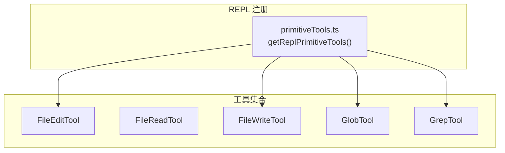
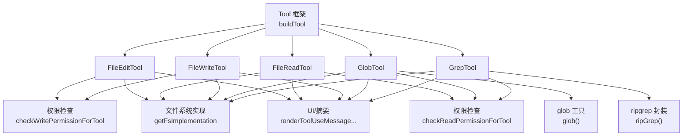
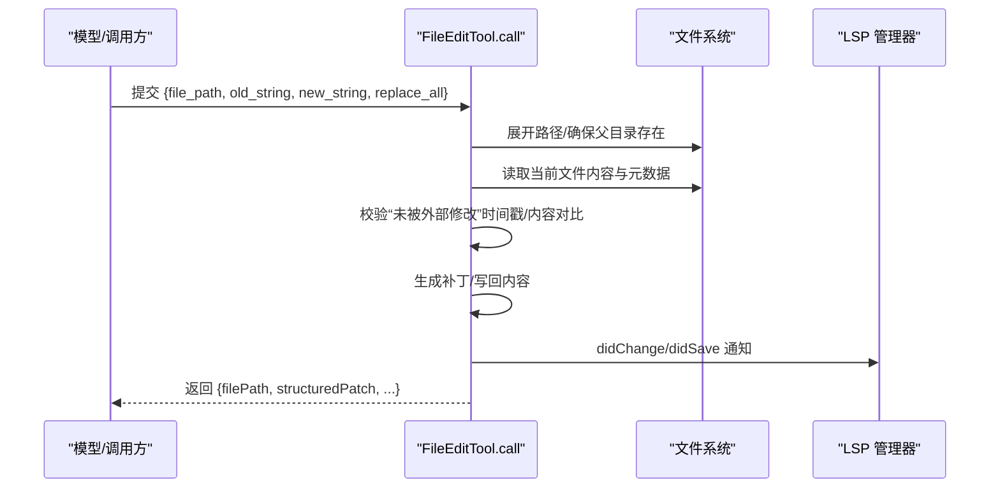
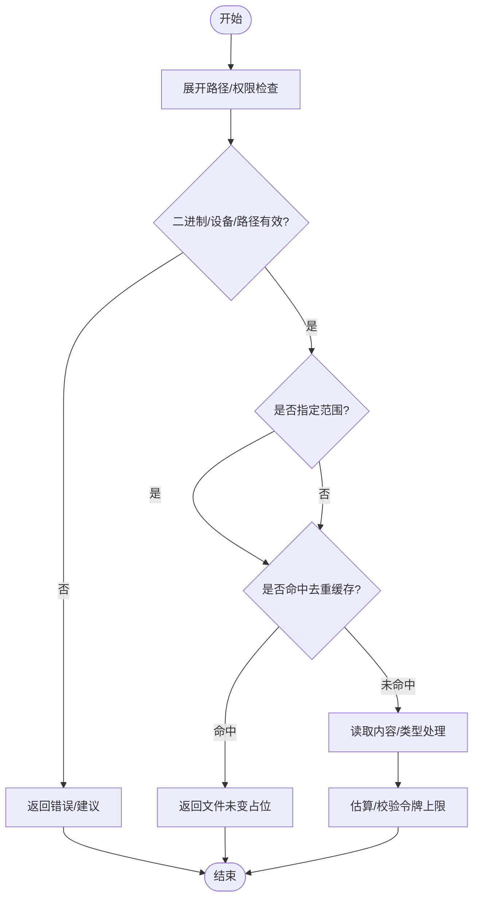
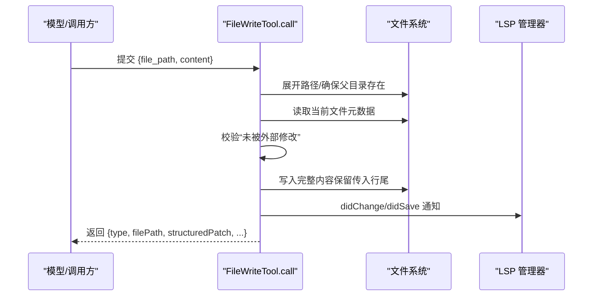
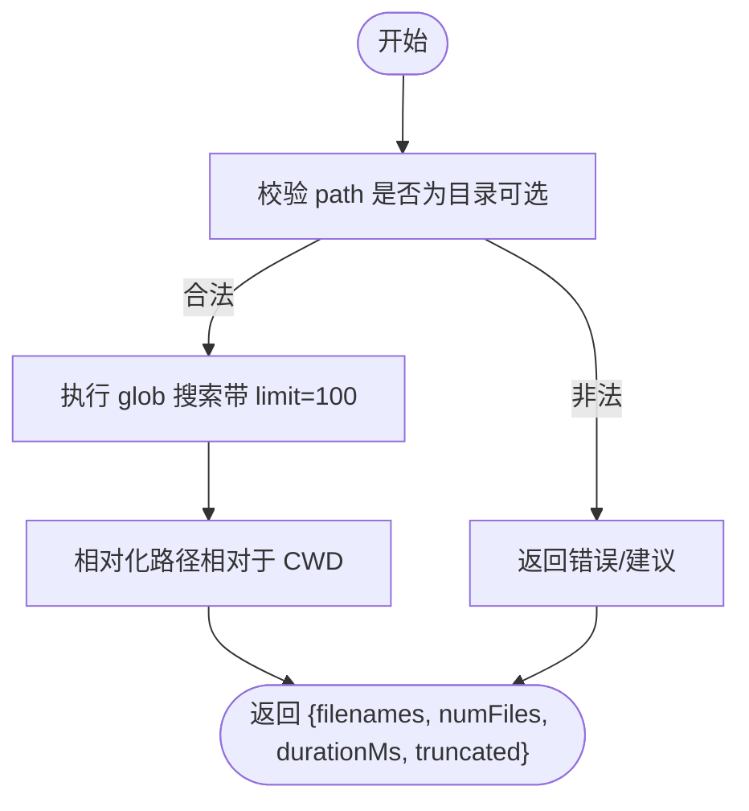
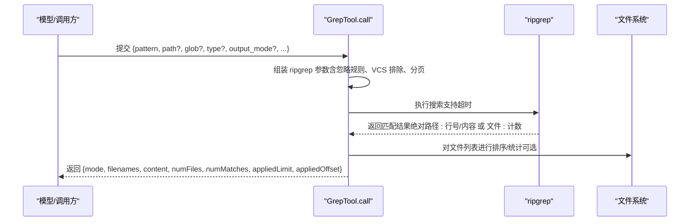
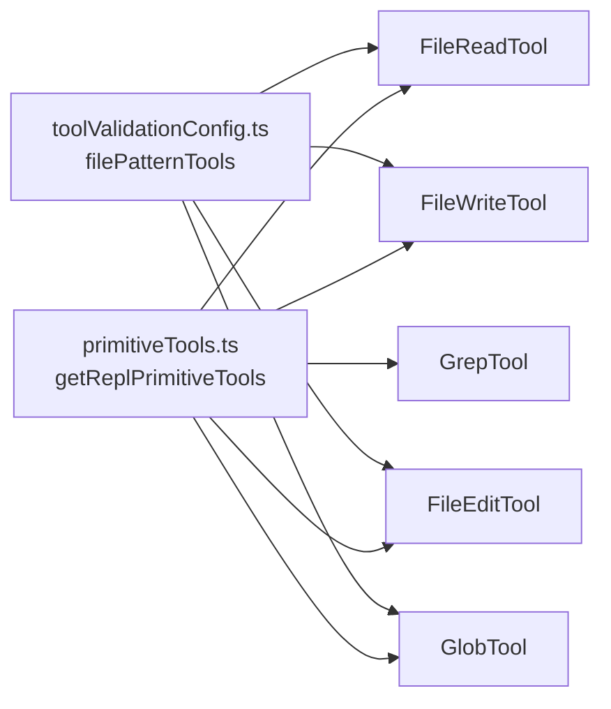

# 文件操作工具

<cite>
**本文引用的文件**
- [FileEditTool.ts](file://src/tools/FileEditTool/FileEditTool.ts)
- [types.ts（FileEditTool）](file://src/tools/FileEditTool/types.ts)
- [FileReadTool.ts](file://src/tools/FileReadTool/FileReadTool.ts)
- [FileWriteTool.ts](file://src/tools/FileWriteTool/FileWriteTool.ts)
- [GlobTool.ts](file://src/tools/GlobTool/GlobTool.ts)
- [GrepTool.ts](file://src/tools/GrepTool/GrepTool.ts)
- [primitiveTools.ts](file://src/tools/REPLTool/primitiveTools.ts)
- [toolValidationConfig.ts](file://src/utils/settings/toolValidationConfig.ts)
- [messages.ts](file://src/utils/messages.ts)
</cite>

## 目录
1. [简介](#简介)
2. [项目结构](#项目结构)
3. [核心组件](#核心组件)
4. [架构总览](#架构总览)
5. [详细组件分析](#详细组件分析)
6. [依赖关系分析](#依赖关系分析)
7. [性能考量](#性能考量)
8. [故障排查指南](#故障排查指南)
9. [结论](#结论)
10. [附录](#附录)

## 简介
本文件面向 Claude Code 的文件操作工具集，系统性梳理以下五类工具的能力边界与实现要点：
- FileEditTool：文件原地编辑（替换字符串），支持多处替换、行尾风格保留、变更补丁生成、与 LSP/Vim/VSCode 协同。
- FileReadTool：文件读取，支持文本、图片、PDF、Jupyter Notebook；具备范围读取、去重缓存、令牌上限控制、设备文件阻断等安全与性能特性。
- FileWriteTool：文件写入（覆盖/新建），与 FileEditTool 类似的原子性校验与 LSP/Vim/VSCode 协同。
- GlobTool：基于通配符的文件名匹配，返回相对路径列表，带结果截断提示。
- GrepTool：基于 ripgrep 的内容搜索，支持正则、上下文、大小写不敏感、类型过滤、计数模式、分页与忽略规则。

文档将从参数配置、使用方法、典型场景、路径处理、权限控制、安全限制、错误处理到最佳实践进行逐项说明，并辅以流程图与时序图帮助理解。

## 项目结构
文件操作工具位于 src/tools 下，分别对应各自的目录与 UI、提示词、类型定义等模块。REPL 模式下会显式注册这些基础工具，便于在虚拟机上下文中直接调用。

图表来源
- [primitiveTools.ts:28-39](file://src/tools/REPLTool/primitiveTools.ts#L28-L39)

章节来源
- [primitiveTools.ts:28-39](file://src/tools/REPLTool/primitiveTools.ts#L28-L39)

## 核心组件
- FileEditTool：负责“修改文件内容”的原子性写入，包含输入校验、权限检查、并发一致性保护、编码与行尾处理、变更补丁生成、LSP/Vim/VSCode 通知、历史备份与统计日志。
- FileReadTool：负责“读取文件内容”，支持多种媒体类型与格式，具备范围读取、去重缓存、令牌估算与上限控制、设备文件阻断、路径建议与错误友好提示。
- FileWriteTool：负责“覆盖/新建文件”，与 FileEditTool 类似的安全与一致性策略，但写入为全量替换。
- GlobTool：负责“按通配符匹配文件名”，返回相对路径列表，带截断提示。
- GrepTool：负责“按正则搜索文件内容”，支持上下文、大小写不敏感、类型过滤、计数模式、分页与忽略规则。

章节来源
- [FileEditTool.ts:86-595](file://src/tools/FileEditTool/FileEditTool.ts#L86-L595)
- [FileReadTool.ts:337-718](file://src/tools/FileReadTool/FileReadTool.ts#L337-L718)
- [FileWriteTool.ts:94-434](file://src/tools/FileWriteTool/FileWriteTool.ts#L94-L434)
- [GlobTool.ts:57-198](file://src/tools/GlobTool/GlobTool.ts#L57-L198)
- [GrepTool.ts:160-577](file://src/tools/GrepTool/GrepTool.ts#L160-L577)

## 架构总览
五类工具共享统一的工具框架（buildTool）、权限检查（filesystem 权限）、路径展开（expandPath）、相对路径转换（toRelativePath）、以及 UI 渲染与摘要输出。搜索工具（GlobTool、GrepTool）还复用 ripgrep 或自定义 glob 实现，并结合忽略规则与分页策略。

图表来源
- [FileEditTool.ts:125-132](file://src/tools/FileEditTool/FileEditTool.ts#L125-L132)
- [FileReadTool.ts:398-405](file://src/tools/FileReadTool/FileReadTool.ts#L398-L405)
- [FileWriteTool.ts:135-142](file://src/tools/FileWriteTool/FileWriteTool.ts#L135-L142)
- [GlobTool.ts:135-142](file://src/tools/GlobTool/GlobTool.ts#L135-L142)
- [GrepTool.ts:233-240](file://src/tools/GrepTool/GrepTool.ts#L233-L240)

## 详细组件分析

### FileEditTool 分析
- 功能概述
  - 原地编辑：在已读取文件的基础上，对旧字符串进行替换（单次或全部），生成结构化补丁，写回磁盘。
  - 安全与一致性：写前校验文件是否被外部修改；确保父目录存在；必要时记录历史备份；与 LSP/Vim/VSCode 同步变更。
  - 编码与行尾：自动检测 UTF-16/UTF-8 并规范化换行；写回时保留或统一行尾风格。
  - 输入校验：拒绝空旧字符串且文件已存在的场景；拒绝非目标文件类型（如 .ipynb）；拒绝过大文件；拒绝未读取即写的场景；拒绝 UNC 路径的直接 I/O（由权限检查接管）。
  - 输出：返回文件路径、原始/新字符串、原始文件内容、结构化补丁、用户是否修改过、是否全部替换、可选 gitDiff。

- 关键流程（时序）

图表来源
- [FileEditTool.ts:387-574](file://src/tools/FileEditTool/FileEditTool.ts#L387-L574)

- 参数与类型
  - 输入：file_path（绝对路径）、old_string、new_string、replace_all（布尔，默认 false）。
  - 输出：filePath、oldString、newString、originalFile、structuredPatch、userModified、replaceAll、gitDiff（可选）。
  - 参考类型定义：[types.ts（FileEditTool）:5-86](file://src/tools/FileEditTool/types.ts#L5-L86)

- 使用方法与场景
  - 场景一：修复一处拼写错误（replace_all=false，提供足够上下文唯一定位）。
  - 场景二：批量替换（replace_all=true）。
  - 场景三：与 FileReadTool 配合，先读取再编辑，避免“未读取即写”的报错。
  - 场景四：在笔记本文件中请改用 NotebookEditTool（.ipynb）。

- 路径处理
  - 统一使用 expandPath 规范化路径，Windows 与 POSIX 兼容。
  - 对于 UNC 路径（\\server\share 或 //server/share）跳过直接 I/O，交由权限检查处理，防止 NTLM 凭据泄露。

- 权限控制
  - 写权限检查：checkWritePermissionForTool。
  - 规则匹配：支持通配符模式匹配文件路径。
  - 团队内存文件：禁止写入包含敏感信息的内容。

- 安全限制
  - 大文件限制：最大 1GiB，避免 OOM。
  - 未读取即写：必须先通过 FileReadTool 读取，否则拒绝。
  - 修改冲突：若文件自上次读取后被外部修改，拒绝写入。
  - UNC 路径：仅做权限判定，不执行 I/O。
  - 笔记本文件：.ipynb 交由 NotebookEditTool 处理。

- 错误处理与提示
  - 文件不存在：提供相似文件与 CWD 建议。
  - 字符串未找到：明确提示未匹配。
  - 多处匹配但未开启 replace_all：提示开启或提供更精确上下文。
  - 设置文件校验：对特定设置文件进行语义校验，避免破坏配置。

- 最佳实践
  - 先读取再编辑，确保一致性。
  - 对大文件使用 replace_all 时谨慎，必要时分批处理。
  - 在笔记本文件中使用专用工具，避免破坏内核状态。
  - 使用相对路径或 CWD 相对路径，减少歧义。

章节来源
- [FileEditTool.ts:125-362](file://src/tools/FileEditTool/FileEditTool.ts#L125-L362)
- [FileEditTool.ts:387-574](file://src/tools/FileEditTool/FileEditTool.ts#L387-L574)
- [types.ts（FileEditTool）:5-86](file://src/tools/FileEditTool/types.ts#L5-L86)

### FileReadTool 分析
- 功能概述
  - 支持文本、图片、PDF、Jupyter Notebook 等多种媒体类型。
  - 范围读取：offset/limit 控制起始行与读取行数，避免一次性读取超大文件。
  - 去重缓存：若同一范围且文件未变化，返回“文件未变”占位，节省 token 与带宽。
  - 令牌上限：根据内容类型估算 token 数，超过阈值抛出异常。
  - 设备文件阻断：阻断 /dev/zero、/dev/random 等可能挂起或产生无限输出的设备路径。
  - macOS 截图兼容：针对 AM/PM 前空格字符差异提供替代路径尝试。
  - 输出映射：根据类型映射为文本、图像、PDF、拆分页、或“文件未变”。

- 关键流程（流程图）

图表来源
- [FileReadTool.ts:496-718](file://src/tools/FileReadTool/FileReadTool.ts#L496-L718)

- 参数与类型
  - 输入：file_path（绝对路径）、offset（起始行，非负整数）、limit（读取行数，正整数）、pages（PDF 页范围，如 "1-5"）。
  - 输出：discriminated union，包括 text、image、notebook、pdf、parts、file_unchanged。
  - 参考类型定义：[FileReadTool.ts:227-335](file://src/tools/FileReadTool/FileReadTool.ts#L227-L335)

- 使用方法与场景
  - 场景一：读取超大文件的局部内容（offset/limit）。
  - 场景二：读取 PDF 的指定页范围（pages）。
  - 场景三：读取图片或 Jupyter Notebook 并在 UI 中展示。
  - 场景四：重复请求同一范围且文件未变化时，利用去重缓存避免重复传输。

- 路径处理
  - 统一 expandPath 规范化路径，Windows 与 POSIX 兼容。
  - macOS 截图路径中 AM/PM 前空格兼容处理。

- 权限控制
  - 读权限检查：checkReadPermissionForTool。
  - 规则匹配：支持通配符模式匹配文件路径。
  - UNC 路径：仅做权限判定，不执行 I/O。

- 安全限制
  - 二进制文件：除 PDF、图片、SVG 外默认拒绝读取。
  - 设备文件：阻断无限输出或阻塞输入的设备路径。
  - 令牌上限：超过阈值抛出 MaxFileReadTokenExceededError。

- 错误处理与提示
  - 文件不存在：提供相似文件与 CWD 建议。
  - PDF 页范围无效：提示格式与最大页数限制。
  - 去重命中：返回“文件未变”占位，避免重复内容。

- 最佳实践
  - 大文件优先使用 offset/limit 分段读取。
  - PDF 读取使用 pages 指定范围，避免一次性读取过多页。
  - 避免读取设备文件与二进制文件（除受支持类型外）。

章节来源
- [FileReadTool.ts:418-495](file://src/tools/FileReadTool/FileReadTool.ts#L418-L495)
- [FileReadTool.ts:496-718](file://src/tools/FileReadTool/FileReadTool.ts#L496-L718)

### FileWriteTool 分析
- 功能概述
  - 覆盖/新建文件：以完整内容替换目标文件，写回时尊重传入的行尾风格。
  - 安全与一致性：写前校验文件是否被外部修改；确保父目录存在；必要时记录历史备份；与 LSP/Vim/VSCode 同步变更。
  - 输出：返回类型（create/update）、文件路径、写入内容、结构化补丁、原始文件内容（或 null）。

- 关键流程（时序）

图表来源
- [FileWriteTool.ts:223-417](file://src/tools/FileWriteTool/FileWriteTool.ts#L223-L417)

- 参数与类型
  - 输入：file_path（绝对路径）、content（字符串）。
  - 输出：type（create/update）、filePath、content、structuredPatch、originalFile、gitDiff（可选）。
  - 参考类型定义：[FileWriteTool.ts:56-89](file://src/tools/FileWriteTool/FileWriteTool.ts#L56-L89)

- 使用方法与场景
  - 场景一：新建文件（content 为新内容）。
  - 场景二：覆盖现有文件（content 为新内容）。
  - 场景三：与 FileReadTool 配合，先读取再写入，确保一致性。

- 路径处理
  - 统一使用 expandPath 规范化路径，Windows 与 POSIX 兼容。
  - 对于 UNC 路径（\\server\share 或 //server/share）跳过直接 I/O，交由权限检查处理。

- 权限控制
  - 写权限检查：checkWritePermissionForTool。
  - 规则匹配：支持通配符模式匹配文件路径。
  - 团队内存文件：禁止写入包含敏感信息的内容。

- 安全限制
  - 未读取即写：必须先通过 FileReadTool 读取，否则拒绝。
  - 修改冲突：若文件自上次读取后被外部修改，拒绝写入。
  - UNC 路径：仅做权限判定，不执行 I/O。

- 错误处理与提示
  - 文件不存在：允许新建。
  - 未读取即写：提示先读取。
  - 外部修改：提示重新读取。

- 最佳实践
  - 新建文件时明确内容与行尾风格。
  - 覆盖文件时确保内容完整，避免部分更新导致的不一致。
  - 与 FileReadTool 协作，保证一致性。

章节来源
- [FileWriteTool.ts:153-222](file://src/tools/FileWriteTool/FileWriteTool.ts#L153-L222)
- [FileWriteTool.ts:223-417](file://src/tools/FileWriteTool/FileWriteTool.ts#L223-L417)

### GlobTool 分析
- 功能概述
  - 基于通配符匹配文件名，返回匹配文件的相对路径列表。
  - 默认最多返回 100 个结果，超出时标记 truncated。
  - 支持指定搜索根目录（path），默认使用当前工作目录。
  - 提供提取搜索文本（extractSearchText）用于 UI 展示。

- 关键流程（流程图）

图表来源
- [GlobTool.ts:94-176](file://src/tools/GlobTool/GlobTool.ts#L94-L176)

- 参数与类型
  - 输入：pattern（通配符模式）、path（可选，目录）。
  - 输出：durationMs、numFiles、filenames（相对路径数组）、truncated（是否截断）。
  - 参考类型定义：[GlobTool.ts:26-55](file://src/tools/GlobTool/GlobTool.ts#L26-L55)

- 使用方法与场景
  - 场景一：列出某目录下所有 .ts 文件。
  - 场景二：在子目录中递归查找特定扩展名文件。
  - 场景三：与 GrepTool 结合，先用 GlobTool 精确限定路径，再用 GrepTool 搜索内容。

- 路径处理
  - 统一 expandPath 规范化路径，Windows 与 POSIX 兼容。
  - UNC 路径：仅做权限判定，不执行 I/O。

- 权限控制
  - 读权限检查：checkReadPermissionForTool。
  - 规则匹配：支持通配符模式匹配 pattern。

- 安全限制
  - UNC 路径：仅做权限判定，不执行 I/O。

- 错误处理与提示
  - 目录不存在：提供 CWD 建议与相似路径提示。
  - 非目录：提示路径不是目录。

- 最佳实践
  - 优先提供更具体的 path，减少结果规模。
  - 当结果被截断时，使用更精确的 pattern 或缩小搜索范围。

章节来源
- [GlobTool.ts:94-176](file://src/tools/GlobTool/GlobTool.ts#L94-L176)

### GrepTool 分析
- 功能概述
  - 基于 ripgrep 的内容搜索，支持正则、上下文、大小写不敏感、类型过滤、计数模式、分页与忽略规则。
  - 默认 head_limit=250，避免结果过大；offset 支持分页偏移。
  - 自动排除版本控制目录（.git/.svn 等）与插件孤儿版本目录，降低噪声。
  - 支持将绝对路径相对化，节省 token。

- 关键流程（时序）

图表来源
- [GrepTool.ts:310-576](file://src/tools/GrepTool/GrepTool.ts#L310-L576)

- 参数与类型
  - 输入：pattern（正则）、path（可选）、glob（可选）、type（可选）、output_mode（content/files_with_matches/count）、上下文参数（-B/-A/-C/context）、-n/-i、head_limit、offset、multiline。
  - 输出：mode、numFiles、filenames、content（可选）、numLines（可选）、numMatches（可选）、appliedLimit/appliedOffset。
  - 参考类型定义：[GrepTool.ts:33-158](file://src/tools/GrepTool/GrepTool.ts#L33-L158)

- 使用方法与场景
  - 场景一：查找包含特定函数签名的所有文件（files_with_matches）。
  - 场景二：查看匹配行及上下文（content + -C/-B/-A）。
  - 场景三：统计各文件匹配次数（count）。
  - 场景四：按语言类型过滤（type=js/py/rust 等）。

- 路径处理
  - 统一 expandPath 规范化路径，Windows 与 POSIX 兼容。
  - UNC 路径：仅做权限判定，不执行 I/O。

- 权限控制
  - 读权限检查：checkReadPermissionForTool。
  - 规则匹配：支持通配符模式匹配 pattern。
  - 忽略规则：合并工具权限上下文中的忽略模式，自动相对化处理。

- 安全限制
  - UNC 路径：仅做权限判定，不执行 I/O。
  - VCS 目录自动排除，减少噪声。
  - 行长度限制（max-columns=500），避免超长行污染输出。

- 错误处理与提示
  - 路径不存在：提供 CWD 建议与相似路径提示。
  - 搜索超时：ripgrep 抛出超时错误，上层捕获并传播。

- 最佳实践
  - 使用 head_limit 控制输出规模，必要时配合 offset 进行分页。
  - 优先使用 type 过滤标准类型，提高效率。
  - 在复杂正则前加 -e，避免被解释为命令行选项。

章节来源
- [GrepTool.ts:201-232](file://src/tools/GrepTool/GrepTool.ts#L201-L232)
- [GrepTool.ts:310-576](file://src/tools/GrepTool/GrepTool.ts#L310-L576)

## 依赖关系分析
- 工具注册与可见性
  - REPL 模式下通过 getReplPrimitiveTools 显式注册 FileReadTool、FileWriteTool、FileEditTool、GlobTool、GrepTool 等基础工具。
  - 在某些构建中，嵌入式搜索工具（find/grep）会替代独立工具，此时 UI 提示会相应调整。

- 工具验证配置
  - 工具输入校验配置中，Read/Write/Edit/Glob 等工具被识别为接受文件模式（*.ts、src/**）的工具，便于统一校验与建议。

图表来源
- [primitiveTools.ts:28-39](file://src/tools/REPLTool/primitiveTools.ts#L28-L39)
- [toolValidationConfig.ts:26-38](file://src/utils/settings/toolValidationConfig.ts#L26-L38)

章节来源
- [primitiveTools.ts:28-39](file://src/tools/REPLTool/primitiveTools.ts#L28-L39)
- [toolValidationConfig.ts:26-38](file://src/utils/settings/toolValidationConfig.ts#L26-L38)
- [messages.ts:3299-3314](file://src/utils/messages.ts#L3299-L3314)

## 性能考量
- 文件大小与内存
  - FileEditTool 对单文件大小设限（1GiB），避免 OOM。
  - FileReadTool 对内容进行令牌估算与上限控制，超限抛错，避免上下文溢出。
- 搜索性能
  - GrepTool 默认 head_limit=250，避免大结果集；支持 offset 分页。
  - 自动排除 VCS 目录与插件孤儿版本目录，减少扫描范围。
  - 行长度限制（max-columns=500），避免超长行影响性能与可读性。
- I/O 与并发
  - FileReadTool 支持去重缓存，命中时返回“文件未变”占位，避免重复传输。
  - FileEditTool/FileWriteTool 在写入前后进行一致性校验，尽量保持原子性，减少并发干扰。

## 故障排查指南
- 常见错误与对策
  - “文件不存在”：检查路径是否正确，参考 CWD 建议与相似文件提示。
  - “文件已被修改”：先重新读取文件，再进行编辑/覆盖。
  - “未读取即写”：先调用 FileReadTool 读取目标文件。
  - “UNC 路径导致 NTLM 凭据泄露”：此类路径仅做权限判定，不执行 I/O。
  - “二进制文件无法读取”：使用受支持的媒体类型工具（PDF/图片/Notebook）。
  - “搜索超时/无结果”：缩小 pattern 或 path，或增加 head_limit（谨慎使用）。
  - “结果被截断”：使用更精确的 pattern 或 path，或分页 offset 查询。

- 日志与诊断
  - 工具调用会记录文件操作事件与差异计算事件，便于审计与问题定位。
  - LSP/Vim/VSCode 同步变更，便于 IDE 端联动诊断。

章节来源
- [FileEditTool.ts:176-362](file://src/tools/FileEditTool/FileEditTool.ts#L176-L362)
- [FileReadTool.ts:468-494](file://src/tools/FileReadTool/FileReadTool.ts#L468-L494)
- [FileWriteTool.ts:179-222](file://src/tools/FileWriteTool/FileWriteTool.ts#L179-L222)
- [GlobTool.ts:100-134](file://src/tools/GlobTool/GlobTool.ts#L100-L134)
- [GrepTool.ts:207-232](file://src/tools/GrepTool/GrepTool.ts#L207-L232)

## 结论
上述五类工具构成了 Claude Code 的文件操作核心能力：从安全、一致性的读取与写入，到高效的文件名匹配与内容搜索。通过统一的工具框架、严格的权限与安全策略、以及完善的错误提示与去重优化，它们能够稳定支撑各类开发与检索场景。建议在实际使用中遵循“先读取再编辑/覆盖”的原则，并结合分页与忽略规则提升性能与准确性。

## 附录
- 工具名称与用途速查
  - FileEditTool：原地编辑文件内容，支持多处替换与补丁生成。
  - FileReadTool：读取文件内容，支持文本/图片/PDF/Notebook，范围读取与去重缓存。
  - FileWriteTool：覆盖/新建文件，写回时尊重传入行尾风格。
  - GlobTool：按通配符匹配文件名，返回相对路径列表。
  - GrepTool：按正则搜索文件内容，支持上下文、类型过滤、计数与分页。