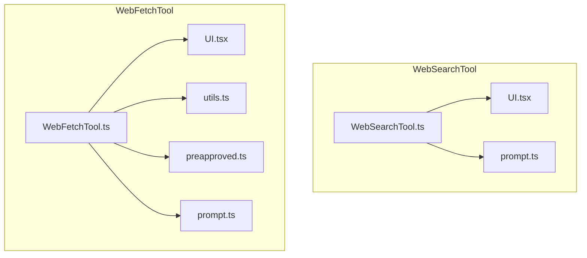
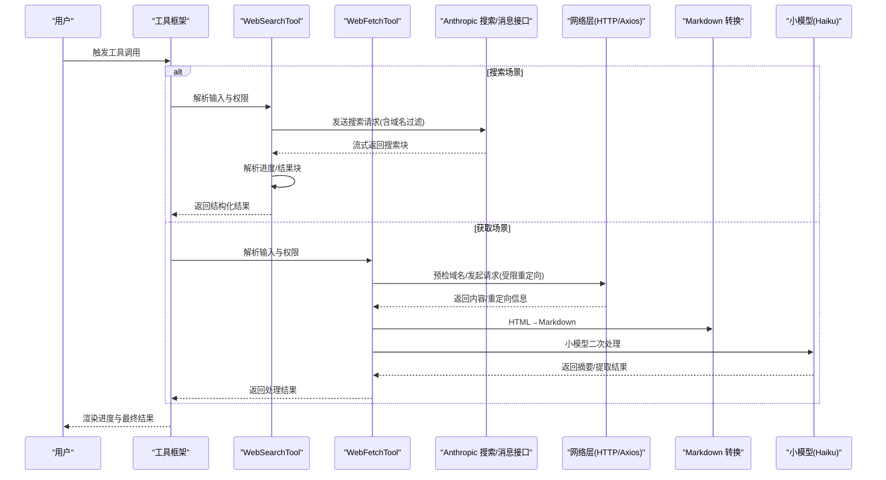
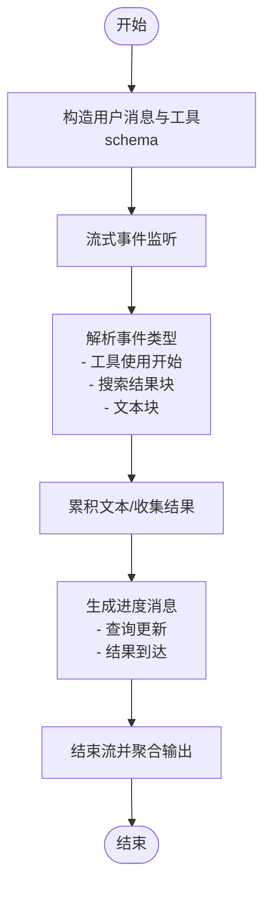
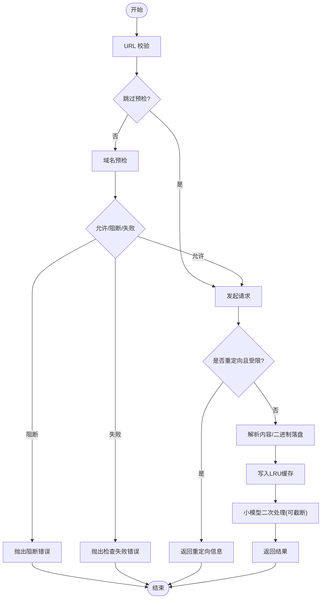
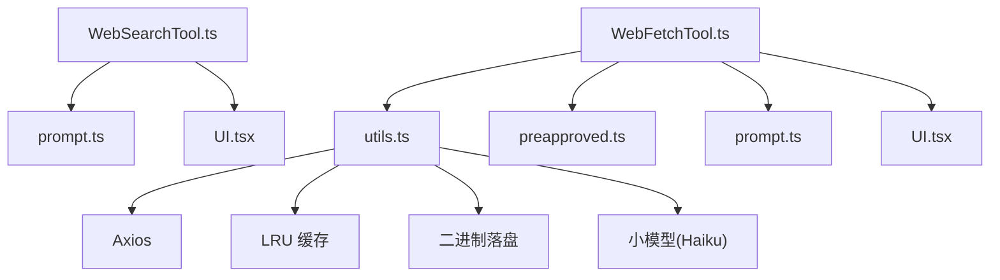

# 网络搜索工具

<cite>
**本文引用的文件**
- [WebSearchTool.ts](file://src/tools/WebSearchTool/WebSearchTool.ts)
- [UI.tsx](file://src/tools/WebSearchTool/UI.tsx)
- [prompt.ts](file://src/tools/WebSearchTool/prompt.ts)
- [WebFetchTool.ts](file://src/tools/WebFetchTool/WebFetchTool.ts)
- [UI.tsx](file://src/tools/WebFetchTool/UI.tsx)
- [utils.ts](file://src/tools/WebFetchTool/utils.ts)
- [preapproved.ts](file://src/tools/WebFetchTool/preapproved.ts)
- [prompt.ts](file://src/tools/WebFetchTool/prompt.ts)
</cite>

## 目录
1. [简介](#简介)
2. [项目结构](#项目结构)
3. [核心组件](#核心组件)
4. [架构总览](#架构总览)
5. [详细组件分析](#详细组件分析)
6. [依赖关系分析](#依赖关系分析)
7. [性能考量](#性能考量)
8. [故障排查指南](#故障排查指南)
9. [结论](#结论)
10. [附录](#附录)

## 简介
本文件面向 Claude Code 的网络搜索工具，系统性阐述两类工具的能力与实现：
- WebSearchTool：网页搜索工具，通过模型调用完成一次性的网络搜索，并将结果以结构化块返回，支持域名白名单/黑名单过滤、进度反馈与结果汇总渲染。
- WebFetchTool：网页内容获取与分析工具，负责从指定 URL 获取内容（自动升级 HTTP 到 HTTPS、安全重定向检查、二进制内容落盘）、HTML 转 Markdown、并使用小型快速模型对内容进行提示处理，输出摘要或按指令提取的信息。

文档覆盖搜索引擎集成方式、搜索算法与结果处理、URL 处理与内容解析、缓存策略、权限与安全控制、反爬虫与网络限制应对、以及数据隐私保护措施，并提供搜索优化建议与最佳实践。

## 项目结构
网络搜索工具位于 src/tools 目录下，分别由独立的工具定义、UI 渲染、提示词与辅助逻辑组成：
- WebSearchTool：工具定义、输入输出模式、流式进度解析、结果聚合与渲染。
- WebFetchTool：工具定义、权限校验、URL 校验与预检、HTTP 请求与重定向控制、内容解析与缓存、二次模型处理与提示词构造、UI 渲染与摘要展示。

**图表来源**
- [WebSearchTool.ts:1-436](file://src/tools/WebSearchTool/WebSearchTool.ts#L1-L436)
- [UI.tsx:1-101](file://src/tools/WebSearchTool/UI.tsx#L1-L101)
- [prompt.ts:1-35](file://src/tools/WebSearchTool/prompt.ts#L1-L35)
- [WebFetchTool.ts:1-319](file://src/tools/WebFetchTool/WebFetchTool.ts#L1-L319)
- [UI.tsx:1-72](file://src/tools/WebFetchTool/UI.tsx#L1-L72)
- [utils.ts:1-531](file://src/tools/WebFetchTool/utils.ts#L1-L531)
- [preapproved.ts:1-167](file://src/tools/WebFetchTool/preapproved.ts#L1-L167)
- [prompt.ts:1-47](file://src/tools/WebFetchTool/prompt.ts#L1-L47)

**章节来源**
- [WebSearchTool.ts:1-436](file://src/tools/WebSearchTool/WebSearchTool.ts#L1-L436)
- [WebFetchTool.ts:1-319](file://src/tools/WebFetchTool/WebFetchTool.ts#L1-L319)

## 核心组件
- WebSearchTool
  - 输入：查询文本、可选允许域名列表、可选阻止域名列表。
  - 输出：包含搜索命中标题与链接的结果数组、文本型评论、耗时统计。
  - 特性：单次 API 调用内完成搜索；流式事件解析；支持域名过滤；进度消息渲染；结果汇总与“来源”要求。
- WebFetchTool
  - 输入：URL、提示词。
  - 输出：响应状态码与文本、内容字节大小、处理后结果、耗时、原始 URL。
  - 特性：URL 预检与域名白名单豁免、HTTP→HTTPS 升级、受限重定向策略、LRU 缓存、二进制内容落盘、小模型二次处理、权限规则与用户提示。

**章节来源**
- [WebSearchTool.ts:25-69](file://src/tools/WebSearchTool/WebSearchTool.ts#L25-L69)
- [WebFetchTool.ts:24-48](file://src/tools/WebFetchTool/WebFetchTool.ts#L24-L48)

## 架构总览
WebSearchTool 与 WebFetchTool 均基于统一的工具框架构建，遵循输入/输出模式、权限检查、UI 渲染与进度反馈规范。二者在“网络访问—内容解析—模型处理—结果呈现”的主干流程上保持一致，但在具体实现细节（如搜索 API 集成、URL 安全策略、缓存与二次处理）上各有侧重。

**图表来源**
- [WebSearchTool.ts:254-400](file://src/tools/WebSearchTool/WebSearchTool.ts#L254-L400)
- [WebFetchTool.ts:208-299](file://src/tools/WebFetchTool/WebFetchTool.ts#L208-L299)
- [utils.ts:347-482](file://src/tools/WebFetchTool/utils.ts#L347-L482)

## 详细组件分析

### WebSearchTool 组件分析
- 搜索器集成
  - 使用工具模式与流式事件解析，从服务器返回的多块内容中识别“工具使用开始”“搜索结果块”“文本块”，并将其合并为统一输出结构。
  - 支持通过工具 schema 注入 allowed_domains/blocked_domains 参数，实现域名过滤。
- 搜索算法与结果处理
  - 结果块解析：将每个搜索结果块转换为标题与 URL 的结构化条目；错误块记录错误码并写入日志。
  - 文本块聚合：在不同块之间切换时，累积文本注释，最终形成“模型评论 + 链接列表”的混合输出。
- 进度与渲染
  - 通过流事件解析逐步更新“查询更新”“收到结果”两类进度消息，UI 层据此显示当前搜索状态与结果数量。
- 权限与可用性
  - 启用条件与模型支持：根据 API 提供方与模型名称动态启用；仅在特定环境与模型组合下可用。
  - 权限检查：返回“放行/询问/拒绝”三态决策，支持本地设置规则添加。

**图表来源**
- [WebSearchTool.ts:299-388](file://src/tools/WebSearchTool/WebSearchTool.ts#L299-L388)
- [UI.tsx:55-78](file://src/tools/WebSearchTool/UI.tsx#L55-L78)

**章节来源**
- [WebSearchTool.ts:76-84](file://src/tools/WebSearchTool/WebSearchTool.ts#L76-L84)
- [WebSearchTool.ts:86-150](file://src/tools/WebSearchTool/WebSearchTool.ts#L86-L150)
- [WebSearchTool.ts:254-400](file://src/tools/WebSearchTool/WebSearchTool.ts#L254-L400)
- [UI.tsx:1-101](file://src/tools/WebSearchTool/UI.tsx#L1-L101)

### WebFetchTool 组件分析
- URL 处理与安全策略
  - URL 校验：长度上限、协议字段不强制要求（内部会升级 http→https）、禁止携带用户名/密码、主机名需可公开解析。
  - 域名预检：通过外部接口查询是否允许抓取；支持跳过预检（企业网络限制场景）。
  - 重定向策略：严格限制为同源变更（仅允许添加/移除 www 或路径/查询参数变化），最多 10 跳，防止重定向环路。
- 内容获取与解析
  - HTTP 请求：超时 60 秒、最大内容 10MB、禁用自动跟随重定向、自定义 UA。
  - 内容解析：HTML→Markdown；二进制内容落地磁盘并记录路径与大小；缓存命中直接返回。
- 缓存策略
  - LRU 缓存：15 分钟 TTL、50MB 总大小；键为原始 URL；空内容按 1 字节计费；命中则直接返回。
  - 域名预检缓存：主机名键、5 分钟 TTL，避免重复预检。
- 二次处理与提示词
  - 对非预批准域名内容施加更严格的引用限制与措辞约束；对预批准域名放宽策略，便于技术文档引用。
  - 截断过长内容至 10 万字符，避免二次模型输入过长。
- 权限与 UI
  - 权限规则：支持“允许/询问/拒绝”三种行为，规则内容以域名维度匹配；预批准域名可直接放行。
  - UI：显示接收字节数、状态码与文本、可选详细内容；重定向时提示新的 URL 与状态。

**图表来源**
- [utils.ts:139-169](file://src/tools/WebFetchTool/utils.ts#L139-L169)
- [utils.ts:176-203](file://src/tools/WebFetchTool/utils.ts#L176-L203)
- [utils.ts:262-329](file://src/tools/WebFetchTool/utils.ts#L262-L329)
- [utils.ts:347-482](file://src/tools/WebFetchTool/utils.ts#L347-L482)
- [utils.ts:484-531](file://src/tools/WebFetchTool/utils.ts#L484-L531)
- [preapproved.ts:14-131](file://src/tools/WebFetchTool/preapproved.ts#L14-L131)

**章节来源**
- [WebFetchTool.ts:104-180](file://src/tools/WebFetchTool/WebFetchTool.ts#L104-L180)
- [WebFetchTool.ts:208-299](file://src/tools/WebFetchTool/WebFetchTool.ts#L208-L299)
- [utils.ts:50-83](file://src/tools/WebFetchTool/utils.ts#L50-L83)
- [utils.ts:347-482](file://src/tools/WebFetchTool/utils.ts#L347-L482)
- [UI.tsx:1-72](file://src/tools/WebFetchTool/UI.tsx#L1-L72)

## 依赖关系分析
- WebSearchTool
  - 依赖模型服务与流式 API，解析服务器返回的多块内容，组装为统一输出。
  - 依赖 UI 模块用于进度与结果渲染。
- WebFetchTool
  - 依赖 HTTP 客户端、LRU 缓存、二进制内容落盘、小模型服务、域名预检接口、权限规则与预批准域名集合。
  - 与工具框架共同实现权限决策、输入校验与 UI 渲染。

**图表来源**
- [WebSearchTool.ts:1-24](file://src/tools/WebSearchTool/WebSearchTool.ts#L1-L24)
- [WebFetchTool.ts:1-23](file://src/tools/WebFetchTool/WebFetchTool.ts#L1-L23)
- [utils.ts:1-17](file://src/tools/WebFetchTool/utils.ts#L1-L17)
- [preapproved.ts:1-13](file://src/tools/WebFetchTool/preapproved.ts#L1-L13)

**章节来源**
- [WebSearchTool.ts:1-24](file://src/tools/WebSearchTool/WebSearchTool.ts#L1-L24)
- [WebFetchTool.ts:1-23](file://src/tools/WebFetchTool/WebFetchTool.ts#L1-L23)

## 性能考量
- 流式搜索：WebSearchTool 采用流式事件解析，边到边处理，降低首屏延迟与内存占用。
- 缓存优化：WebFetchTool 使用 LRU 缓存（15 分钟 TTL、50MB 限额），显著减少重复请求与网络开销；域名预检缓存（5 分钟）避免重复跨域检查。
- 内容截断：对过长 Markdown 内容进行截断，避免二次模型输入超限。
- 资源限制：HTTP 请求设置超时、最大内容长度与重定向次数上限，防止资源滥用与卡顿。
- 模型选择：在特定特性开关下切换更小模型以提升交互速度。

[本节为通用性能讨论，无需列出具体文件来源]

## 故障排查指南
- 域名被阻断
  - 现象：抛出阻断错误或检查失败错误。
  - 排查：确认目标域名是否在预检接口允许列表；若企业网络限制，可考虑跳过预检或使用 MCP 工具替代。
  - 参考
    - [utils.ts:176-203](file://src/tools/WebFetchTool/utils.ts#L176-L203)
- 重定向导致内容不可达
  - 现象：返回重定向信息，提示使用新 URL。
  - 排查：确认重定向是否满足“同源变更”策略；按提示使用新 URL 重新请求。
  - 参考
    - [utils.ts:212-243](file://src/tools/WebFetchTool/utils.ts#L212-L243)
    - [WebFetchTool.ts:216-249](file://src/tools/WebFetchTool/WebFetchTool.ts#L216-L249)
- 权限未授予
  - 现象：工具请求权限，等待用户授权或自动拒绝。
  - 排查：在本地设置中添加针对域名的允许规则；或使用 MCP 工具替代。
  - 参考
    - [WebFetchTool.ts:104-180](file://src/tools/WebFetchTool/WebFetchTool.ts#L104-L180)
- 搜索无结果或错误
  - 现象：搜索结果为空或返回错误块。
  - 排查：检查查询语句、域名过滤条件；确认地区限制与模型可用性。
  - 参考
    - [WebSearchTool.ts:115-129](file://src/tools/WebSearchTool/WebSearchTool.ts#L115-L129)
    - [WebSearchTool.ts:186-193](file://src/tools/WebSearchTool/WebSearchTool.ts#L186-L193)

**章节来源**
- [utils.ts:176-203](file://src/tools/WebFetchTool/utils.ts#L176-L203)
- [utils.ts:212-243](file://src/tools/WebFetchTool/utils.ts#L212-L243)
- [WebFetchTool.ts:104-180](file://src/tools/WebFetchTool/WebFetchTool.ts#L104-L180)
- [WebSearchTool.ts:115-129](file://src/tools/WebSearchTool/WebSearchTool.ts#L115-L129)

## 结论
WebSearchTool 与 WebFetchTool 在 Claude Code 中分别承担“搜索发现”与“内容获取与分析”的关键职责。前者通过流式 API 实现高效搜索与结果聚合，后者通过严格的 URL 安全策略、缓存与二次处理保障内容质量与性能。两者均强调权限控制、用户体验与数据安全，适合在合规前提下满足多样化的网络信息需求。

[本节为总结性内容，无需列出具体文件来源]

## 附录

### 搜索参数配置与使用要点
- WebSearchTool
  - 查询字段：query（必填，最小长度 2）
  - 域名过滤：allowed_domains 与 blocked_domains 二选一
  - 输出字段：query、results（混合文本与搜索结果块）、durationSeconds
  - 可用性：根据 API 提供方与模型名称动态启用
  - 参考
    - [WebSearchTool.ts:25-37](file://src/tools/WebSearchTool/WebSearchTool.ts#L25-L37)
    - [WebSearchTool.ts:186-193](file://src/tools/WebSearchTool/WebSearchTool.ts#L186-L193)
- WebFetchTool
  - 输入字段：url（必须为有效 URL）、prompt（描述要提取的信息）
  - 输出字段：bytes、code、codeText、result、durationMs、url
  - 参考
    - [WebFetchTool.ts:24-48](file://src/tools/WebFetchTool/WebFetchTool.ts#L24-L48)

**章节来源**
- [WebSearchTool.ts:25-37](file://src/tools/WebSearchTool/WebSearchTool.ts#L25-L37)
- [WebFetchTool.ts:24-48](file://src/tools/WebFetchTool/WebFetchTool.ts#L24-L48)

### URL 处理与内容解析要点
- URL 校验与升级：长度限制、协议自动升级、禁止凭据、主机名可解析
- 重定向策略：同源变更、最多 10 跳、相对 URL 解析
- 内容解析：HTML→Markdown；二进制内容落盘；缓存命中直接返回
- 参考
  - [utils.ts:139-169](file://src/tools/WebFetchTool/utils.ts#L139-L169)
  - [utils.ts:212-243](file://src/tools/WebFetchTool/utils.ts#L212-L243)
  - [utils.ts:347-482](file://src/tools/WebFetchTool/utils.ts#L347-L482)

**章节来源**
- [utils.ts:139-169](file://src/tools/WebFetchTool/utils.ts#L139-L169)
- [utils.ts:212-243](file://src/tools/WebFetchTool/utils.ts#L212-L243)
- [utils.ts:347-482](file://src/tools/WebFetchTool/utils.ts#L347-L482)

### 缓存策略
- URL 缓存：LRU，15 分钟 TTL，50MB 总大小，空内容按 1 计费
- 域名预检缓存：主机名键，5 分钟 TTL
- 参考
  - [utils.ts:50-83](file://src/tools/WebFetchTool/utils.ts#L50-L83)

**章节来源**
- [utils.ts:50-83](file://src/tools/WebFetchTool/utils.ts#L50-L83)

### 反爬虫与网络限制应对
- 限制重定向：仅允许同源变更，防止开放重定向风险
- 超时与大小限制：60 秒超时、10MB 最大内容、10 跳上限
- 企业网络：检测代理 403 与特定头，抛出明确错误
- 参考
  - [utils.ts:114-125](file://src/tools/WebFetchTool/utils.ts#L114-L125)
  - [utils.ts:316-329](file://src/tools/WebFetchTool/utils.ts#L316-L329)

**章节来源**
- [utils.ts:114-125](file://src/tools/WebFetchTool/utils.ts#L114-L125)
- [utils.ts:316-329](file://src/tools/WebFetchTool/utils.ts#L316-L329)

### 数据隐私与合规
- 引用限制：对非预批准域名内容施加严格引用长度与措辞约束，避免过度复制
- 预批准域名：仅限 GET 请求，不继承沙箱网络限制，防止上传等高风险操作
- 二进制内容落盘：保留原始文件以便人工审阅
- 参考
  - [prompt.ts:23-46](file://src/tools/WebFetchTool/prompt.ts#L23-L46)
  - [preapproved.ts:1-13](file://src/tools/WebFetchTool/preapproved.ts#L1-L13)
  - [utils.ts:440-449](file://src/tools/WebFetchTool/utils.ts#L440-L449)

**章节来源**
- [prompt.ts:23-46](file://src/tools/WebFetchTool/prompt.ts#L23-L46)
- [preapproved.ts:1-13](file://src/tools/WebFetchTool/preapproved.ts#L1-L13)
- [utils.ts:440-449](file://src/tools/WebFetchTool/utils.ts#L440-L449)

### 搜索优化技巧
- 使用当前年份与月份进行近期信息检索，避免过时结果
- 合理使用域名过滤，缩小搜索范围，提高相关性
- 在 WebFetchTool 中提供明确的提取指令，提升二次处理准确性
- 参考
  - [prompt.ts:30-32](file://src/tools/WebSearchTool/prompt.ts#L30-L32)
  - [prompt.ts:23-46](file://src/tools/WebFetchTool/prompt.ts#L23-L46)

**章节来源**
- [prompt.ts:30-32](file://src/tools/WebSearchTool/prompt.ts#L30-L32)
- [prompt.ts:23-46](file://src/tools/WebFetchTool/prompt.ts#L23-L46)