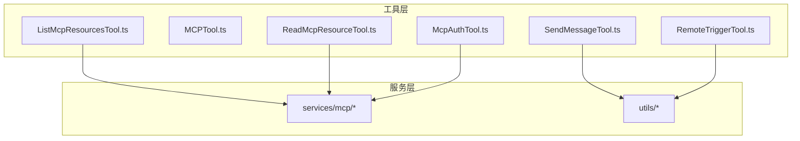
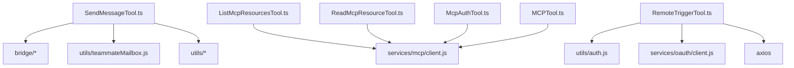
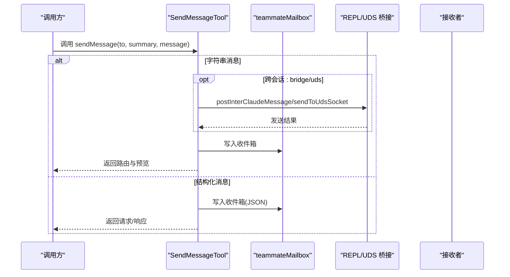
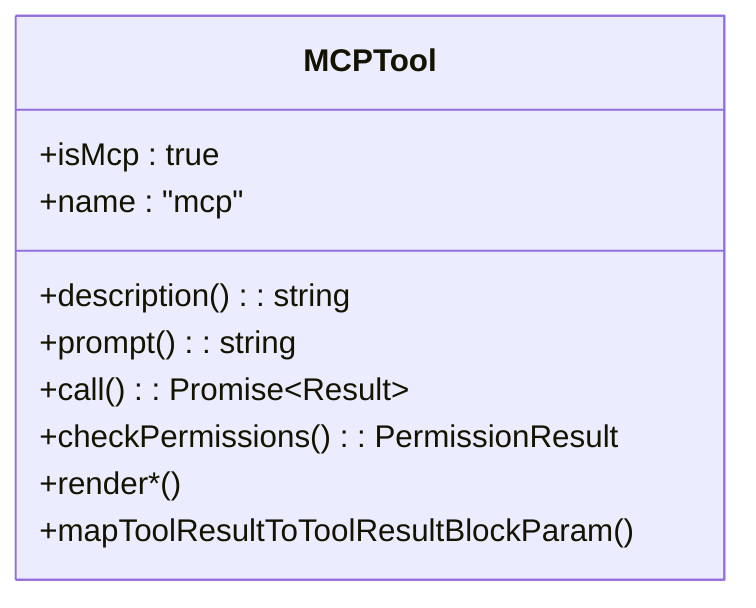
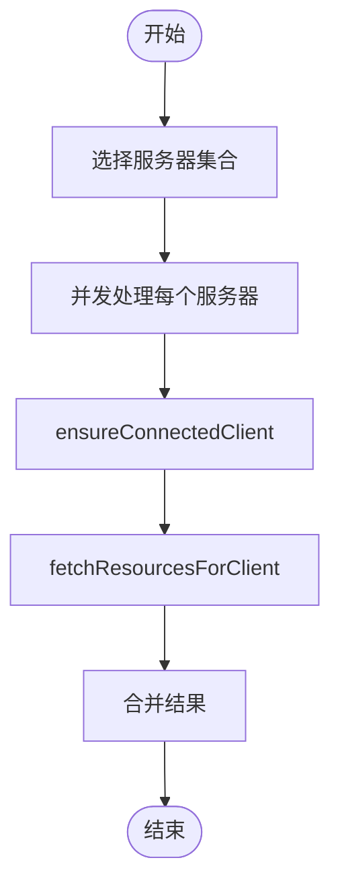
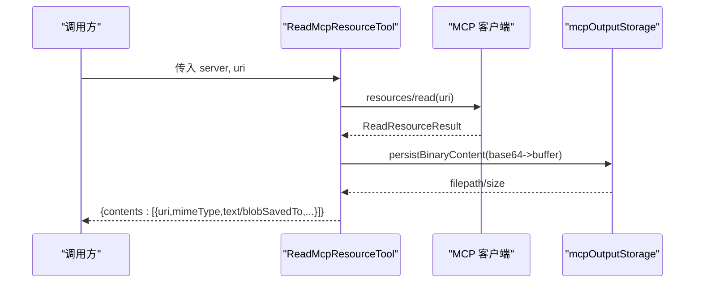
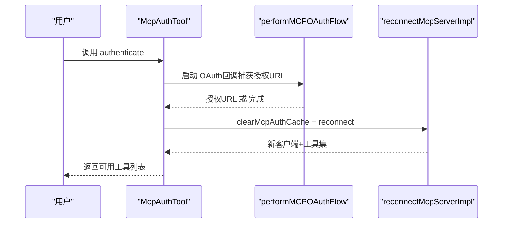
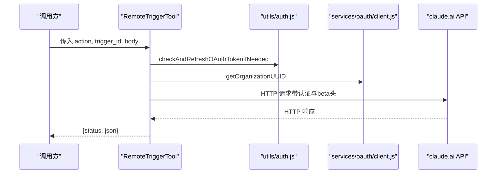
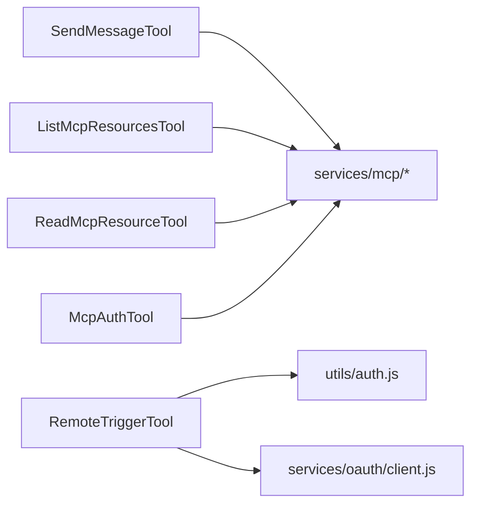

# 通信与集成工具

<cite>
**本文引用的文件**
- [SendMessageTool.ts](file://src/tools/SendMessageTool/SendMessageTool.ts)
- [constants.ts](file://src/tools/SendMessageTool/constants.ts)
- [prompt.ts](file://src/tools/SendMessageTool/prompt.ts)
- [MCPTool.ts](file://src/tools/MCPTool/MCPTool.ts)
- [ListMcpResourcesTool.ts](file://src/tools/ListMcpResourcesTool/ListMcpResourcesTool.ts)
- [ReadMcpResourceTool.ts](file://src/tools/ReadMcpResourceTool/ReadMcpResourceTool.ts)
- [McpAuthTool.ts](file://src/tools/McpAuthTool/McpAuthTool.ts)
- [RemoteTriggerTool.ts](file://src/tools/RemoteTriggerTool/RemoteTriggerTool.ts)
</cite>

## 目录
1. [简介](#简介)
2. [项目结构](#项目结构)
3. [核心组件](#核心组件)
4. [架构总览](#架构总览)
5. [详细组件分析](#详细组件分析)
6. [依赖关系分析](#依赖关系分析)
7. [性能考量](#性能考量)
8. [故障排查指南](#故障排查指南)
9. [结论](#结论)
10. [附录](#附录)

## 简介
本指南围绕 Claude Code 的通信与集成工具，系统性讲解以下能力：
- 消息发送：SendMessageTool 的消息路由、广播、跨会话投递（UDS/桥接）与团队协议交互（关机请求/审批、计划审批响应）
- 多协议通信：MCPTool 的通用 MCP 工具封装
- 资源管理：ListMcpResourcesTool 的资源枚举、ReadMcpResourceTool 的资源读取与二进制落盘
- 认证处理：McpAuthTool 的 OAuth 启动与自动回连替换真实工具
- 远程控制：RemoteTriggerTool 的远程触发器管理（列表、查询、创建、更新、运行）

文档覆盖通信协议、身份验证、资源管理与远程控制的实现要点，给出安全传输、错误重试与连接管理策略，并提供集成最佳实践与调试技巧。

## 项目结构
本指南聚焦 src/tools 下的通信与集成工具模块，以及与之密切相关的服务层与工具基类。整体采用“按工具分文件”的组织方式，每个工具独立定义输入输出模式、权限校验、调用流程与 UI 渲染。

图示来源
- [SendMessageTool.ts:1-918](file://src/tools/SendMessageTool/SendMessageTool.ts#L1-L918)
- [MCPTool.ts:1-78](file://src/tools/MCPTool/MCPTool.ts#L1-L78)
- [ListMcpResourcesTool.ts:1-124](file://src/tools/ListMcpResourcesTool/ListMcpResourcesTool.ts#L1-L124)
- [ReadMcpResourceTool.ts:1-159](file://src/tools/ReadMcpResourceTool/ReadMcpResourceTool.ts#L1-L159)
- [McpAuthTool.ts:1-216](file://src/tools/McpAuthTool/McpAuthTool.ts#L1-L216)
- [RemoteTriggerTool.ts:1-162](file://src/tools/RemoteTriggerTool/RemoteTriggerTool.ts#L1-L162)

章节来源
- [SendMessageTool.ts:1-918](file://src/tools/SendMessageTool/SendMessageTool.ts#L1-L918)
- [MCPTool.ts:1-78](file://src/tools/MCPTool/MCPTool.ts#L1-L78)
- [ListMcpResourcesTool.ts:1-124](file://src/tools/ListMcpResourcesTool/ListMcpResourcesTool.ts#L1-L124)
- [ReadMcpResourceTool.ts:1-159](file://src/tools/ReadMcpResourceTool/ReadMcpResourceTool.ts#L1-L159)
- [McpAuthTool.ts:1-216](file://src/tools/McpAuthTool/McpAuthTool.ts#L1-L216)
- [RemoteTriggerTool.ts:1-162](file://src/tools/RemoteTriggerTool/RemoteTriggerTool.ts#L1-L162)

## 核心组件
- SendMessageTool：负责同会话内消息路由、广播、跨会话投递（UDS/桥接）、团队协议交互（关机/计划审批）
- MCPTool：通用 MCP 工具包装，承载具体 MCP 客户端的动态行为
- ListMcpResourcesTool：列举已连接 MCP 服务器的资源清单
- ReadMcpResourceTool：读取指定资源，支持文本与二进制内容，二进制自动落盘并返回路径
- McpAuthTool：为未认证的 MCP 服务器生成“伪工具”，启动 OAuth 流程并在完成后自动替换为真实工具
- RemoteTriggerTool：通过 claude.ai API 管理远程触发器（列表、查询、创建、更新、运行）

章节来源
- [SendMessageTool.ts:520-918](file://src/tools/SendMessageTool/SendMessageTool.ts#L520-L918)
- [MCPTool.ts:27-78](file://src/tools/MCPTool/MCPTool.ts#L27-L78)
- [ListMcpResourcesTool.ts:40-124](file://src/tools/ListMcpResourcesTool/ListMcpResourcesTool.ts#L40-L124)
- [ReadMcpResourceTool.ts:49-159](file://src/tools/ReadMcpResourceTool/ReadMcpResourceTool.ts#L49-L159)
- [McpAuthTool.ts:49-216](file://src/tools/McpAuthTool/McpAuthTool.ts#L49-L216)
- [RemoteTriggerTool.ts:46-162](file://src/tools/RemoteTriggerTool/RemoteTriggerTool.ts#L46-L162)

## 架构总览
下图展示工具与服务层的交互关系，以及关键数据流与控制点。

图示来源
- [SendMessageTool.ts:1-918](file://src/tools/SendMessageTool/SendMessageTool.ts#L1-L918)
- [ListMcpResourcesTool.ts:1-124](file://src/tools/ListMcpResourcesTool/ListMcpResourcesTool.ts#L1-L124)
- [ReadMcpResourceTool.ts:1-159](file://src/tools/ReadMcpResourceTool/ReadMcpResourceTool.ts#L1-L159)
- [McpAuthTool.ts:1-216](file://src/tools/McpAuthTool/McpAuthTool.ts#L1-L216)
- [RemoteTriggerTool.ts:1-162](file://src/tools/RemoteTriggerTool/RemoteTriggerTool.ts#L1-L162)

## 详细组件分析

### SendMessageTool：消息发送与团队协议
- 功能概览
  - 支持向单个队友发送消息或广播给全体队友
  - 支持跨会话投递：UDS 本地套接字与桥接（Remote Control）会话
  - 团队协议：关机请求/响应、计划审批请求/响应
  - 自动恢复与排队：对停止/离线的子代理进行恢复或消息排队
- 输入输出与模式
  - 输入包含目标、摘要（字符串消息必填）、消息体（字符串或结构化协议）
  - 输出根据操作类型返回不同结构（消息、广播、请求、响应）
- 关键流程
  - 单播/广播写入邮箱后返回路由信息
  - 结构化消息路由到对应处理函数（关机/计划）
  - 跨会话投递：UDS 直连、桥接通过 REPL 桥接通道
  - 权限检查：跨机器桥接消息需要显式用户同意
- 错误与边界
  - 空目标、非法地址格式、摘要缺失、非字符串结构化消息等均被拒绝
  - 桥接不可用时禁止跨会话发送
  - 非团队领导不能发起计划审批

图示来源
- [SendMessageTool.ts:741-918](file://src/tools/SendMessageTool/SendMessageTool.ts#L741-L918)
- [prompt.ts:1-50](file://src/tools/SendMessageTool/prompt.ts#L1-L50)

章节来源
- [SendMessageTool.ts:1-918](file://src/tools/SendMessageTool/SendMessageTool.ts#L1-L918)
- [constants.ts:1-2](file://src/tools/SendMessageTool/constants.ts#L1-L2)
- [prompt.ts:1-50](file://src/tools/SendMessageTool/prompt.ts#L1-L50)

### MCPTool：多协议通信封装
- 功能概览
  - 作为通用 MCP 工具的“壳”，实际行为由具体 MCP 客户端在运行时注入
  - 提供统一的输入/输出模式、权限检查、UI 渲染与截断检测
- 设计要点
  - isMcp 标记与动态名称/描述/调用逻辑由客户端注入
  - 输出截断检测用于终端显示优化
  - 通过工具基类统一映射为标准工具结果块参数

图示来源
- [MCPTool.ts:27-78](file://src/tools/MCPTool/MCPTool.ts#L27-L78)

章节来源
- [MCPTool.ts:1-78](file://src/tools/MCPTool/MCPTool.ts#L1-L78)

### ListMcpResourcesTool：资源枚举
- 功能概览
  - 列举所有已连接 MCP 服务器的资源，支持按服务器过滤
  - 使用 LRU 缓存与预热，连接变化时自动失效
- 关键流程
  - 选择目标服务器集合（全部或指定）
  - 并发确保连接并拉取资源，失败不阻塞其他服务器
  - 扁平化合并结果并返回

图示来源
- [ListMcpResourcesTool.ts:66-101](file://src/tools/ListMcpResourcesTool/ListMcpResourcesTool.ts#L66-L101)

章节来源
- [ListMcpResourcesTool.ts:1-124](file://src/tools/ListMcpResourcesTool/ListMcpResourcesTool.ts#L1-L124)

### ReadMcpResourceTool：资源读取与二进制落盘
- 功能概览
  - 读取指定 URI 的资源，支持文本与二进制内容
  - 对二进制内容进行解码并保存到磁盘，返回可读路径与提示文本
- 关键流程
  - 校验服务器存在、已连接、具备 resources 能力
  - 通过客户端执行 resources/read 请求
  - 对 blob 字段进行持久化处理，替换为文件路径
  - 统一输出结构化内容数组

图示来源
- [ReadMcpResourceTool.ts:75-159](file://src/tools/ReadMcpResourceTool/ReadMcpResourceTool.ts#L75-L159)

章节来源
- [ReadMcpResourceTool.ts:1-159](file://src/tools/ReadMcpResourceTool/ReadMcpResourceTool.ts#L1-L159)

### McpAuthTool：认证处理与自动回连
- 功能概览
  - 为未认证的 MCP 服务器生成“伪工具”，调用后启动 OAuth 流程
  - 在后台完成授权后清理缓存并重新连接，自动替换为真实工具
- 关键流程
  - 仅对 HTTP/SSE 传输启用 OAuth；其他传输提示手动认证
  - 捕获授权 URL 或静默完成，返回用户指引
  - OAuth 成功后重建客户端与工具集，替换状态中的工具

图示来源
- [McpAuthTool.ts:85-216](file://src/tools/McpAuthTool/McpAuthTool.ts#L85-L216)

章节来源
- [McpAuthTool.ts:1-216](file://src/tools/McpAuthTool/McpAuthTool.ts#L1-L216)

### RemoteTriggerTool：远程触发机制
- 功能概览
  - 通过 claude.ai API 管理远程触发器：列出、查询、创建、更新、运行
  - 需要 claude.ai 登录态与组织 UUID，受策略限制启用
- 关键流程
  - 校验登录态与组织 UUID
  - 根据 action 组装 HTTP 请求（GET/POST），携带必要头信息
  - 设置超时与取消信号，返回状态码与 JSON 文本

图示来源
- [RemoteTriggerTool.ts:78-162](file://src/tools/RemoteTriggerTool/RemoteTriggerTool.ts#L78-L162)

章节来源
- [RemoteTriggerTool.ts:1-162](file://src/tools/RemoteTriggerTool/RemoteTriggerTool.ts#L1-L162)

## 依赖关系分析
- 工具与服务层耦合
  - SendMessageTool 依赖邮箱写入、REPL/UDS 桥接、遥测与调试工具
  - MCP 工具链依赖 services/mcp/* 客户端与能力检测
  - RemoteTriggerTool 依赖 OAuth 工具与组织上下文
- 松耦合设计
  - MCPTool 通过 isMcp 标记与动态注入实现与具体服务器解耦
  - ListMcpResourcesTool/ReadMcpResourceTool 通过 ensureConnectedClient 与缓存策略降低连接抖动影响

图示来源
- [SendMessageTool.ts:1-918](file://src/tools/SendMessageTool/SendMessageTool.ts#L1-L918)
- [ListMcpResourcesTool.ts:1-124](file://src/tools/ListMcpResourcesTool/ListMcpResourcesTool.ts#L1-L124)
- [ReadMcpResourceTool.ts:1-159](file://src/tools/ReadMcpResourceTool/ReadMcpResourceTool.ts#L1-L159)
- [McpAuthTool.ts:1-216](file://src/tools/McpAuthTool/McpAuthTool.ts#L1-L216)
- [RemoteTriggerTool.ts:1-162](file://src/tools/RemoteTriggerTool/RemoteTriggerTool.ts#L1-L162)

章节来源
- [SendMessageTool.ts:1-918](file://src/tools/SendMessageTool/SendMessageTool.ts#L1-L918)
- [ListMcpResourcesTool.ts:1-124](file://src/tools/ListMcpResourcesTool/ListMcpResourcesTool.ts#L1-L124)
- [ReadMcpResourceTool.ts:1-159](file://src/tools/ReadMcpResourceTool/ReadMcpResourceTool.ts#L1-L159)
- [McpAuthTool.ts:1-216](file://src/tools/McpAuthTool/McpAuthTool.ts#L1-L216)
- [RemoteTriggerTool.ts:1-162](file://src/tools/RemoteTriggerTool/RemoteTriggerTool.ts#L1-L162)

## 性能考量
- 并发与缓存
  - ListMcpResourcesTool 对服务器资源枚举使用并发处理与 LRU 缓存，避免重复拉取
- I/O 与内存
  - ReadMcpResourceTool 将大体量二进制内容落盘，减少上下文膨胀
- 超时与中断
  - RemoteTriggerTool 设置请求超时与取消信号，避免长时间阻塞
- UI 与截断
  - 工具输出统一进行行截断检测，保证终端渲染性能

## 故障排查指南
- 跨会话消息失败
  - 检查桥接是否激活与句柄是否存在；确认目标地址格式正确
  - 参考 SendMessageTool 的权限与校验逻辑定位问题
- MCP 资源为空
  - 确认服务器已连接且具备 resources 能力；检查缓存失效与重连
- 二进制资源无法读取
  - 检查 blob 解码与落盘目录权限；查看持久化返回的文件路径
- OAuth 认证无响应
  - 确认传输类型为 HTTP/SSE；若为静默授权，等待后台完成自动回连
- 远程触发器调用失败
  - 校验登录态与组织 UUID；检查 beta 头与超时设置

章节来源
- [SendMessageTool.ts:604-718](file://src/tools/SendMessageTool/SendMessageTool.ts#L604-L718)
- [ListMcpResourcesTool.ts:84-101](file://src/tools/ListMcpResourcesTool/ListMcpResourcesTool.ts#L84-L101)
- [ReadMcpResourceTool.ts:106-143](file://src/tools/ReadMcpResourceTool/ReadMcpResourceTool.ts#L106-L143)
- [McpAuthTool.ts:126-172](file://src/tools/McpAuthTool/McpAuthTool.ts#L126-L172)
- [RemoteTriggerTool.ts:135-150](file://src/tools/RemoteTriggerTool/RemoteTriggerTool.ts#L135-L150)

## 结论
上述工具共同构成了 Claude Code 的通信与集成基础设施：SendMessageTool 实现了团队内消息与协议交互；MCPTool 与资源工具链提供了标准化的 MCP 交互；McpAuthTool 保障了认证流程的自动化；RemoteTriggerTool 则打通了远程触发能力。通过合理的缓存、并发与错误处理策略，系统在易用性与稳定性之间取得平衡。

## 附录
- 集成最佳实践
  - 使用工具前先进行权限检查与输入校验
  - 对跨会话消息提供明确的摘要与预览
  - 对二进制资源优先落盘，避免上下文膨胀
  - 在 MCP 服务器变更时依赖自动回连与缓存失效
- 调试技巧
  - 利用工具的 UI 渲染与调试日志快速定位问题
  - 对远程触发器调用记录状态码与响应体，便于排错
  - 在桥接/UDS 不可用时，优先检查连接状态与地址格式