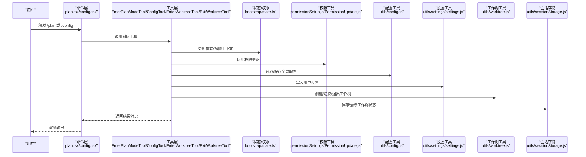
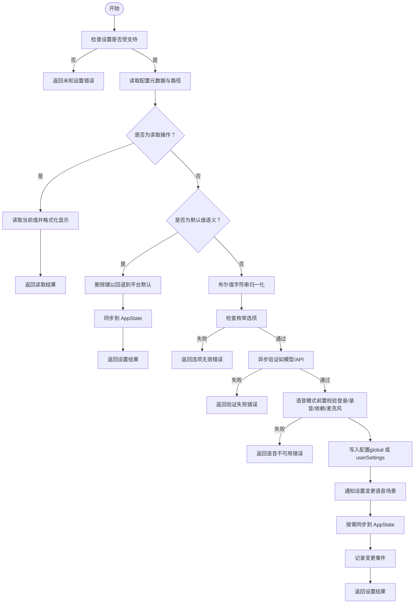
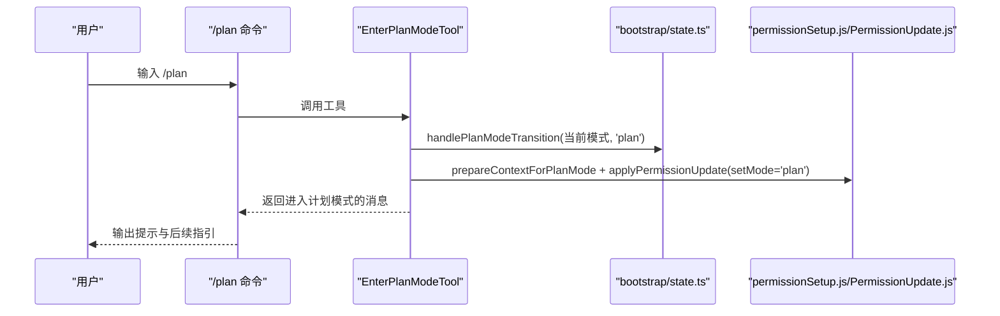
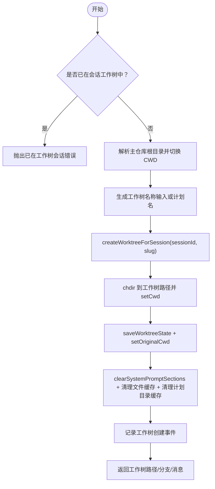
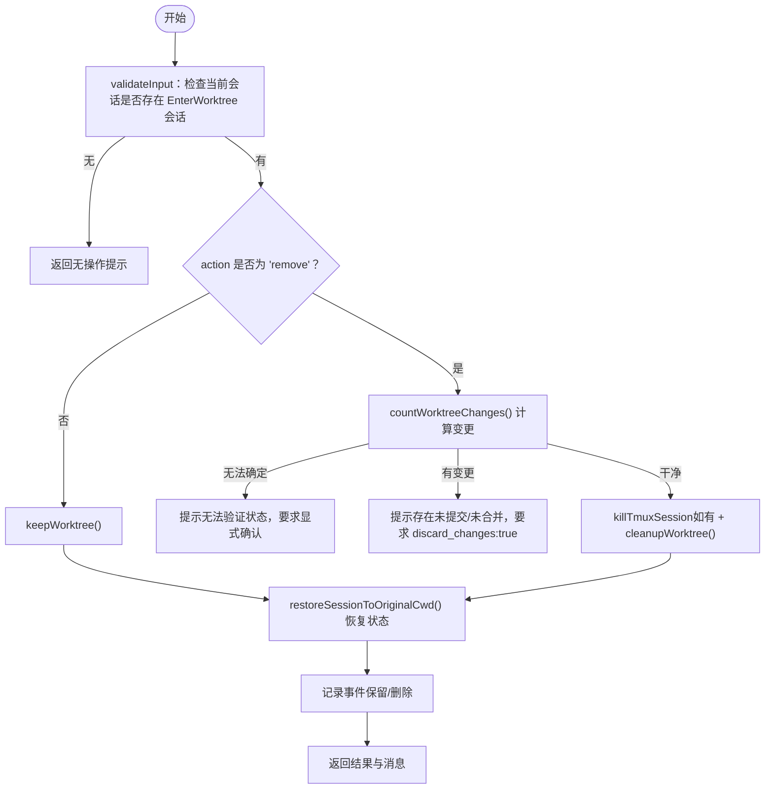
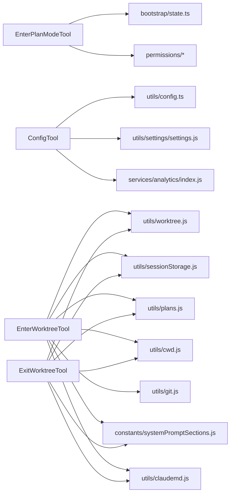

# 配置管理工具

<cite>
**本文引用的文件**
- [src/tools/ConfigTool/ConfigTool.ts](file://src/tools/ConfigTool/ConfigTool.ts)
- [src/tools/ConfigTool/UI.tsx](file://src/tools/ConfigTool/UI.tsx)
- [src/tools/ConfigTool/constants.ts](file://src/tools/ConfigTool/constants.ts)
- [src/tools/EnterPlanModeTool/EnterPlanModeTool.ts](file://src/tools/EnterPlanModeTool/EnterPlanModeTool.ts)
- [src/tools/EnterPlanModeTool/constants.ts](file://src/tools/EnterPlanModeTool/constants.ts)
- [src/tools/ExitWorktreeTool/ExitWorktreeTool.ts](file://src/tools/ExitWorktreeTool/ExitWorktreeTool.ts)
- [src/tools/EnterWorktreeTool/EnterWorktreeTool.ts](file://src/tools/EnterWorktreeTool/EnterWorktreeTool.ts)
- [src/commands/plan/plan.tsx](file://src/commands/plan/plan.tsx)
- [src/commands/config/config.tsx](file://src/commands/config/config.tsx)
- [src/bootstrap/state.ts](file://src/bootstrap/state.ts)
- [src/utils/config.ts](file://src/utils/config.ts)
- [src/utils/settings/settings.js](file://src/utils/settings/settings.js)
- [src/utils/worktree.js](file://src/utils/worktree.js)
- [src/utils/plans.js](file://src/utils/plans.js)
- [src/utils/permissions/permissionSetup.js](file://src/utils/permissions/permissionSetup.js)
- [src/utils/permissions/PermissionUpdate.js](file://src/utils/permissions/PermissionUpdate.js)
- [src/utils/Shell.js](file://src/utils/Shell.js)
- [src/services/analytics/index.js](file://src/services/analytics/index.js)
- [src/utils/errors.js](file://src/utils/errors.js)
- [src/utils/log.js](file://src/utils/log.js)
- [src/utils/cwd.js](file://src/utils/cwd.js)
- [src/utils/git.js](file://src/utils/git.js)
- [src/utils/sessionStorage.js](file://src/utils/sessionStorage.js)
- [src/constants/systemPromptSections.js](file://src/constants/systemPromptSections.js)
- [src/utils/claudemd.js](file://src/utils/claudemd.js)
- [src/utils/lazySchema.js](file://src/utils/lazySchema.js)
- [src/utils/slowOperations.js](file://src/utils/slowOperations.js)
- [src/utils/schemas/hooks.ts](file://src/utils/schemas/hooks.ts)
</cite>

## 目录
1. [简介](#简介)
2. [项目结构](#项目结构)
3. [核心组件](#核心组件)
4. [架构总览](#架构总览)
5. [详细组件分析](#详细组件分析)
6. [依赖关系分析](#依赖关系分析)
7. [性能考量](#性能考量)
8. [故障排除指南](#故障排除指南)
9. [结论](#结论)
10. [附录](#附录)

## 简介
本文件面向 Claude Code 的配置管理与工作环境控制能力，系统化梳理以下工具与命令的行为与交互：  
- 配置读取与写入：ConfigTool  
- 计划模式进入：EnterPlanModeTool（及命令层 /plan）  
- 工作树进入：EnterWorktreeTool  
- 工作树退出：ExitWorktreeTool  

重点覆盖配置项管理、模式切换机制、工作环境控制、配置验证与回滚策略、环境隔离与安全门禁，并提供最佳实践与故障排除建议。

## 项目结构
围绕“配置管理”与“工作环境控制”的关键模块分布如下：
- 工具层（src/tools）：ConfigTool、EnterPlanModeTool、EnterWorktreeTool、ExitWorktreeTool
- 命令层（src/commands）：/plan、/config
- 状态与权限（src/bootstrap、src/utils/permissions）
- 配置与设置（src/utils/config、src/utils/settings）
- 工作树与会话（src/utils/worktree、src/utils/sessionStorage）
- 日志与分析（src/services/analytics）

```mermaid
graph TB
subgraph "命令层"
CMD_PLAN["/plan 命令<br/>plan.tsx"]
CMD_CONFIG["/config 命令<br/>config.tsx"]
end
subgraph "工具层"
TOOL_CONFIG["ConfigTool<br/>ConfigTool.ts"]
TOOL_ENTER_PLAN["EnterPlanModeTool<br/>EnterPlanModeTool.ts"]
TOOL_ENTER_WT["EnterWorktreeTool<br/>EnterWorktreeTool.ts"]
TOOL_EXIT_WT["ExitWorktreeTool<br/>ExitWorktreeTool.ts"]
end
subgraph "状态与权限"
STATE["bootstrap/state.ts"]
PERM_SETUP["permissions/permissionSetup.js"]
PERM_UPDATE["permissions/PermissionUpdate.js"]
end
subgraph "配置与设置"
CFG_UTIL["utils/config.ts"]
SETTINGS_UTIL["utils/settings/settings.js"]
end
subgraph "工作树与会话"
WT_UTIL["utils/worktree.js"]
SS_UTIL["utils/sessionStorage.js"]
PLAN_UTIL["utils/plans.js"]
CWD_UTIL["utils/cwd.js"]
GIT_UTIL["utils/git.js"]
end
subgraph "其他"
SYS_SECT["constants/systemPromptSections.js"]
SLOW_OP["utils/slowOperations.js"]
ERR["utils/errors.js"]
LOG["utils/log.js"]
ANA["services/analytics/index.js"]
end
CMD_PLAN --> TOOL_ENTER_PLAN
CMD_PLAN --> STATE
CMD_PLAN --> PERM_SETUP
CMD_PLAN --> PERM_UPDATE
CMD_CONFIG --> TOOL_CONFIG
TOOL_CONFIG --> CFG_UTIL
TOOL_CONFIG --> SETTINGS_UTIL
TOOL_CONFIG --> ANA
TOOL_CONFIG --> ERR
TOOL_CONFIG --> LOG
TOOL_CONFIG --> SLOW_OP
TOOL_ENTER_WT --> WT_UTIL
TOOL_ENTER_WT --> PLAN_UTIL
TOOL_ENTER_WT --> CWD_UTIL
TOOL_ENTER_WT --> GIT_UTIL
TOOL_ENTER_WT --> SS_UTIL
TOOL_ENTER_WT --> SYS_SECT
TOOL_ENTER_WT --> ANA
TOOL_EXIT_WT --> WT_UTIL
TOOL_EXIT_WT --> SS_UTIL
TOOL_EXIT_WT --> SYS_SECT
TOOL_EXIT_WT --> CWD_UTIL
TOOL_EXIT_WT --> PLAN_UTIL
TOOL_EXIT_WT --> ANA
```

**图表来源**
- [src/commands/plan/plan.tsx:64-121](file://src/commands/plan/plan.tsx#L64-L121)
- [src/commands/config/config.tsx:4-6](file://src/commands/config/config.tsx#L4-L6)
- [src/tools/ConfigTool/ConfigTool.ts:67-434](file://src/tools/ConfigTool/ConfigTool.ts#L67-L434)
- [src/tools/EnterPlanModeTool/EnterPlanModeTool.ts:36-126](file://src/tools/EnterPlanModeTool/EnterPlanModeTool.ts#L36-L126)
- [src/tools/EnterWorktreeTool/EnterWorktreeTool.ts:52-127](file://src/tools/EnterWorktreeTool/EnterWorktreeTool.ts#L52-L127)
- [src/tools/ExitWorktreeTool/ExitWorktreeTool.ts:148-329](file://src/tools/ExitWorktreeTool/ExitWorktreeTool.ts#L148-L329)

**章节来源**
- [src/commands/plan/plan.tsx:64-121](file://src/commands/plan/plan.tsx#L64-L121)
- [src/commands/config/config.tsx:4-6](file://src/commands/config/config.tsx#L4-L6)
- [src/tools/ConfigTool/ConfigTool.ts:67-434](file://src/tools/ConfigTool/ConfigTool.ts#L67-L434)
- [src/tools/EnterPlanModeTool/EnterPlanModeTool.ts:36-126](file://src/tools/EnterPlanModeTool/EnterPlanModeTool.ts#L36-L126)
- [src/tools/EnterWorktreeTool/EnterWorktreeTool.ts:52-127](file://src/tools/EnterWorktreeTool/EnterWorktreeTool.ts#L52-L127)
- [src/tools/ExitWorktreeTool/ExitWorktreeTool.ts:148-329](file://src/tools/ExitWorktreeTool/ExitWorktreeTool.ts#L148-L329)

## 核心组件
- ConfigTool：统一的配置读取/写入入口，支持类型校验、选项约束、异步验证、平台特性开关、即时同步到应用状态等。
- EnterPlanModeTool：在当前会话中启用“计划模式”，更新权限上下文与模式，提供可选的交互式提示。
- EnterWorktreeTool：在当前会话中创建并切换到一个隔离的工作树（git 或钩子），变更进程目录、保存会话状态、清理缓存。
- ExitWorktreeTool：退出工作树会话，提供“保留/删除”两种动作，进行变更计数与安全校验，恢复会话原始状态。

**章节来源**
- [src/tools/ConfigTool/ConfigTool.ts:67-434](file://src/tools/ConfigTool/ConfigTool.ts#L67-L434)
- [src/tools/EnterPlanModeTool/EnterPlanModeTool.ts:36-126](file://src/tools/EnterPlanModeTool/EnterPlanModeTool.ts#L36-L126)
- [src/tools/EnterWorktreeTool/EnterWorktreeTool.ts:52-127](file://src/tools/EnterWorktreeTool/EnterWorktreeTool.ts#L52-L127)
- [src/tools/ExitWorktreeTool/ExitWorktreeTool.ts:148-329](file://src/tools/ExitWorktreeTool/ExitWorktreeTool.ts#L148-L329)

## 架构总览
下图展示从命令到工具再到底层配置与工作树系统的调用链路与数据流。

**图表来源**
- [src/commands/plan/plan.tsx:64-121](file://src/commands/plan/plan.tsx#L64-L121)
- [src/commands/config/config.tsx:4-6](file://src/commands/config/config.tsx#L4-L6)
- [src/tools/EnterPlanModeTool/EnterPlanModeTool.ts:77-102](file://src/tools/EnterPlanModeTool/EnterPlanModeTool.ts#L77-L102)
- [src/tools/ConfigTool/ConfigTool.ts:111-411](file://src/tools/ConfigTool/ConfigTool.ts#L111-L411)
- [src/tools/EnterWorktreeTool/EnterWorktreeTool.ts:77-119](file://src/tools/EnterWorktreeTool/EnterWorktreeTool.ts#L77-L119)
- [src/tools/ExitWorktreeTool/ExitWorktreeTool.ts:227-321](file://src/tools/ExitWorktreeTool/ExitWorktreeTool.ts#L227-L321)

## 详细组件分析

### ConfigTool：配置读取与写入
- 功能要点
  - 输入/输出模式：支持仅读取（value 未提供）或写入（value 提供），并返回成功/失败、前值/新值等信息。
  - 设置支持性检查：对不被支持的键返回错误；对特定特性开关（如语音）进行运行时门控。
  - 类型与选项校验：布尔值字符串自动转换；枚举选项严格匹配；必要时执行异步验证（如模型可用性）。
  - 平台特性与安全：对 voiceEnabled 等敏感设置进行多层前置校验（登录态、录音可用性、麦克风授权等）。
  - 写入路径：全局配置（global）与用户设置（userSettings）分别处理；必要时同步到 AppState 以即时生效。
  - 可观测性：记录变更事件，错误统一格式化。

- 关键流程（写入）

**图表来源**
- [src/tools/ConfigTool/ConfigTool.ts:111-411](file://src/tools/ConfigTool/ConfigTool.ts#L111-L411)

**章节来源**
- [src/tools/ConfigTool/ConfigTool.ts:67-434](file://src/tools/ConfigTool/ConfigTool.ts#L67-L434)
- [src/tools/ConfigTool/UI.tsx:6-37](file://src/tools/ConfigTool/UI.tsx#L6-L37)
- [src/utils/config.ts:1-200](file://src/utils/config.ts#L1-L200)
- [src/utils/settings/settings.js:1-200](file://src/utils/settings/settings.js#L1-L200)
- [src/services/analytics/index.js:1-200](file://src/services/analytics/index.js#L1-L200)
- [src/utils/errors.js:1-200](file://src/utils/errors.js#L1-L200)
- [src/utils/log.js:1-200](file://src/utils/log.js#L1-L200)
- [src/utils/slowOperations.js:1-200](file://src/utils/slowOperations.js#L1-L200)

### EnterPlanModeTool：计划模式进入
- 功能要点
  - 在当前会话中将模式切换至“计划模式”，更新权限上下文，确保不会在受限通道环境下形成无法退出的陷阱。
  - 提供可读性强的提示文本，指导用户在计划模式下的行为边界（只探索、不写文件）。
  - 支持计划模式 V2 的面试阶段提示逻辑。

- 关键流程

**图表来源**
- [src/commands/plan/plan.tsx:64-92](file://src/commands/plan/plan.tsx#L64-L92)
- [src/tools/EnterPlanModeTool/EnterPlanModeTool.ts:77-102](file://src/tools/EnterPlanModeTool/EnterPlanModeTool.ts#L77-L102)

**章节来源**
- [src/tools/EnterPlanModeTool/EnterPlanModeTool.ts:36-126](file://src/tools/EnterPlanModeTool/EnterPlanModeTool.ts#L36-L126)
- [src/commands/plan/plan.tsx:64-121](file://src/commands/plan/plan.tsx#L64-L121)
- [src/bootstrap/state.ts:1-200](file://src/bootstrap/state.ts#L1-L200)
- [src/utils/permissions/permissionSetup.js:1-200](file://src/utils/permissions/permissionSetup.js#L1-L200)
- [src/utils/permissions/PermissionUpdate.js:1-200](file://src/utils/permissions/PermissionUpdate.js#L1-L200)

### EnterWorktreeTool：工作树进入
- 功能要点
  - 将会话切换到一个隔离的工作树，支持自定义名称或基于计划生成随机名。
  - 进入前解析主仓库根目录，确保工作树创建在正确位置。
  - 切换进程目录、保存会话状态、清理与重建系统提示缓存、清除与重算计划目录缓存。
  - 记录工作树创建事件。

- 关键流程

**图表来源**
- [src/tools/EnterWorktreeTool/EnterWorktreeTool.ts:77-119](file://src/tools/EnterWorktreeTool/EnterWorktreeTool.ts#L77-L119)
- [src/utils/worktree.js:1-200](file://src/utils/worktree.js#L1-L200)
- [src/utils/plans.js:1-200](file://src/utils/plans.js#L1-L200)
- [src/utils/cwd.js:1-200](file://src/utils/cwd.js#L1-L200)
- [src/utils/git.js:1-200](file://src/utils/git.js#L1-L200)
- [src/utils/sessionStorage.js:1-200](file://src/utils/sessionStorage.js#L1-L200)
- [src/constants/systemPromptSections.js:1-200](file://src/constants/systemPromptSections.js#L1-L200)
- [src/utils/claudemd.js:1-200](file://src/utils/claudemd.js#L1-L200)

**章节来源**
- [src/tools/EnterWorktreeTool/EnterWorktreeTool.ts:52-127](file://src/tools/EnterWorktreeTool/EnterWorktreeTool.ts#L52-L127)

### ExitWorktreeTool：工作树退出
- 功能要点
  - 仅对当前会话创建的工作树执行退出，防止误操作外部或历史工作树。
  - 提供“保留/删除”两种动作，删除前进行变更计数与安全校验（未提交文件、未合并提交），必要时要求显式确认。
  - 执行后恢复会话到原始工作目录，必要时恢复项目根与钩子快照，清理缓存与工作树状态。
  - 记录保留/删除事件，统计丢弃的提交与文件数量。

- 关键流程

**图表来源**
- [src/tools/ExitWorktreeTool/ExitWorktreeTool.ts:174-321](file://src/tools/ExitWorktreeTool/ExitWorktreeTool.ts#L174-L321)
- [src/utils/worktree.js:1-200](file://src/utils/worktree.js#L1-L200)

**章节来源**
- [src/tools/ExitWorktreeTool/ExitWorktreeTool.ts:148-329](file://src/tools/ExitWorktreeTool/ExitWorktreeTool.ts#L148-L329)

## 依赖关系分析
- 工具与状态/权限
  - EnterPlanModeTool 依赖状态切换与权限上下文更新，确保模式切换与权限一致。
- 工具与配置
  - ConfigTool 依赖全局配置与用户设置写入，必要时同步到 AppState 以驱动 UI 即时变化。
- 工具与工作树
  - EnterWorktreeTool/ExitWorktreeTool 依赖工作树工具与会话存储，负责进程目录、项目根、钩子快照与缓存的维护。
- 工具与可观测性
  - 所有写入类工具均记录变更事件，便于审计与问题追踪。

**图表来源**
- [src/tools/EnterPlanModeTool/EnterPlanModeTool.ts:1-126](file://src/tools/EnterPlanModeTool/EnterPlanModeTool.ts#L1-L126)
- [src/tools/ConfigTool/ConfigTool.ts:1-434](file://src/tools/ConfigTool/ConfigTool.ts#L1-L434)
- [src/tools/EnterWorktreeTool/EnterWorktreeTool.ts:1-127](file://src/tools/EnterWorktreeTool/EnterWorktreeTool.ts#L1-L127)
- [src/tools/ExitWorktreeTool/ExitWorktreeTool.ts:1-329](file://src/tools/ExitWorktreeTool/ExitWorktreeTool.ts#L1-L329)

**章节来源**
- [src/tools/EnterPlanModeTool/EnterPlanModeTool.ts:1-126](file://src/tools/EnterPlanModeTool/EnterPlanModeTool.ts#L1-L126)
- [src/tools/ConfigTool/ConfigTool.ts:1-434](file://src/tools/ConfigTool/ConfigTool.ts#L1-L434)
- [src/tools/EnterWorktreeTool/EnterWorktreeTool.ts:1-127](file://src/tools/EnterWorktreeTool/EnterWorktreeTool.ts#L1-L127)
- [src/tools/ExitWorktreeTool/ExitWorktreeTool.ts:1-329](file://src/tools/ExitWorktreeTool/ExitWorktreeTool.ts#L1-L329)

## 性能考量
- 配置读取：ConfigTool 对于读取操作采用格式化显示与最小化计算，避免不必要的序列化开销。
- 配置写入：写入后按需同步到 AppState，减少重复渲染；对语音场景使用变更检测器触发缓存重算。
- 工作树：进入/退出时清理与重建缓存，避免陈旧上下文影响后续请求；对系统提示段落进行缓存失效与重算。
- 异步验证：模型可用性等验证在写入阶段异步执行，避免阻塞主线程；失败时快速返回错误。

[本节为通用性能讨论，无需列出具体文件来源]

## 故障排除指南
- 配置写入失败
  - 症状：返回“未知设置”、“值无效”、“验证失败”等错误。
  - 排查：确认设置键是否受支持；检查布尔值字符串是否为 true/false；核对枚举选项；若涉及模型，请确认可用性与鉴权状态。
  - 参考
    - [src/tools/ConfigTool/ConfigTool.ts:111-229](file://src/tools/ConfigTool/ConfigTool.ts#L111-L229)
    - [src/utils/errors.js:1-200](file://src/utils/errors.js#L1-L200)

- 语音模式不可用
  - 症状：设置 voiceEnabled 失败，提示需要登录、录音工具缺失或麦克风权限拒绝。
  - 排查：确认已登录；检查录音设备与依赖安装；在系统隐私设置中授予麦克风访问权限。
  - 参考
    - [src/tools/ConfigTool/ConfigTool.ts:231-308](file://src/tools/ConfigTool/ConfigTool.ts#L231-L308)

- 计划模式无法退出
  - 症状：在启用通道限制时无法退出计划模式。
  - 排查：确认是否处于受限通道模式；该场景下入口与出口均被禁用以避免模型进入但无法退出。
  - 参考
    - [src/tools/EnterPlanModeTool/EnterPlanModeTool.ts:56-67](file://src/tools/EnterPlanModeTool/EnterPlanModeTool.ts#L56-L67)

- 工作树进入失败
  - 症状：已在会话工作树中再次进入，或工作树名称不符合规范。
  - 排查：确认当前不在工作树会话中；检查名称是否符合规则（仅允许字母、数字、点、下划线、短横线，总长度不超过 64）。
  - 参考
    - [src/tools/EnterWorktreeTool/EnterWorktreeTool.ts:77-90](file://src/tools/EnterWorktreeTool/EnterWorktreeTool.ts#L77-L90)
    - [src/utils/worktree.js:1-200](file://src/utils/worktree.js#L1-L200)

- 工作树退出被拒绝
  - 症状：删除动作被拒绝，提示无法验证状态或存在未提交/未合并提交。
  - 排查：使用 keep 动作保留工作树；或在确认后传入 discard_changes:true；确保工作树状态可被 git 正确识别。
  - 参考
    - [src/tools/ExitWorktreeTool/ExitWorktreeTool.ts:174-224](file://src/tools/ExitWorktreeTool/ExitWorktreeTool.ts#L174-L224)
    - [src/utils/worktree.js:1-200](file://src/utils/worktree.js#L1-L200)

**章节来源**
- [src/tools/ConfigTool/ConfigTool.ts:111-308](file://src/tools/ConfigTool/ConfigTool.ts#L111-L308)
- [src/tools/EnterPlanModeTool/EnterPlanModeTool.ts:56-67](file://src/tools/EnterPlanModeTool/EnterPlanModeTool.ts#L56-L67)
- [src/tools/EnterWorktreeTool/EnterWorktreeTool.ts:77-90](file://src/tools/EnterWorktreeTool/EnterWorktreeTool.ts#L77-L90)
- [src/tools/ExitWorktreeTool/ExitWorktreeTool.ts:174-224](file://src/tools/ExitWorktreeTool/ExitWorktreeTool.ts#L174-L224)

## 结论
本文档系统化梳理了 Claude Code 的配置管理与工作环境控制能力，涵盖配置读写、计划模式切换与工作树隔离的完整生命周期。通过严格的输入校验、平台特性门控、安全校验与可观测性，确保变更可控、可追溯、可恢复。建议在复杂任务中优先使用计划模式进行探索与设计，在需要隔离实验或临时修改时使用工作树，并遵循“保留优先、删除谨慎”的退出策略。

[本节为总结性内容，无需列出具体文件来源]

## 附录

### 最佳实践
- 配置管理
  - 使用明确的枚举值与布尔值，避免歧义；对可能影响运行时行为的配置（如远程控制、模型）进行异步验证。
  - 对语音等特性，提前完成登录与设备准备，减少运行时失败概率。
- 计划模式
  - 在计划模式下专注探索与设计，避免过早写入文件；完成后使用退出工具进入执行阶段。
- 工作树
  - 进入前确认主仓库根路径；命名清晰且唯一；退出时优先选择保留，必要时再删除并显式确认。

[本节为通用建议，无需列出具体文件来源]