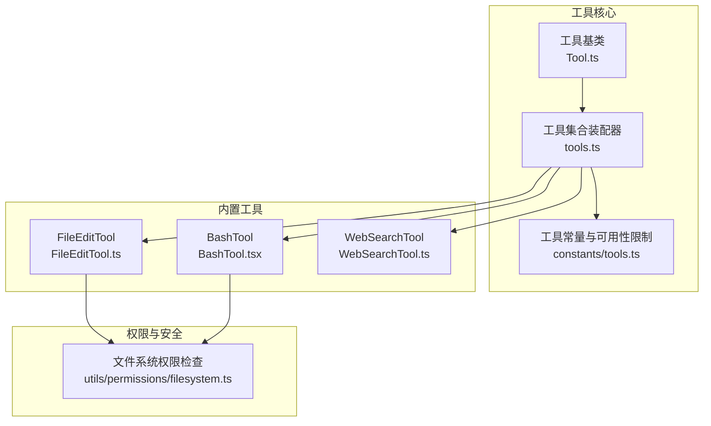
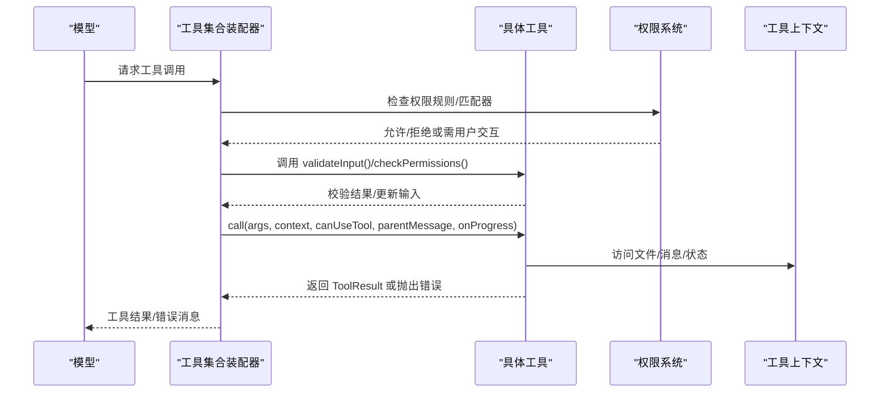
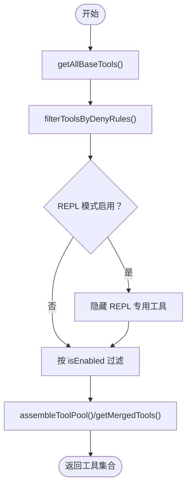
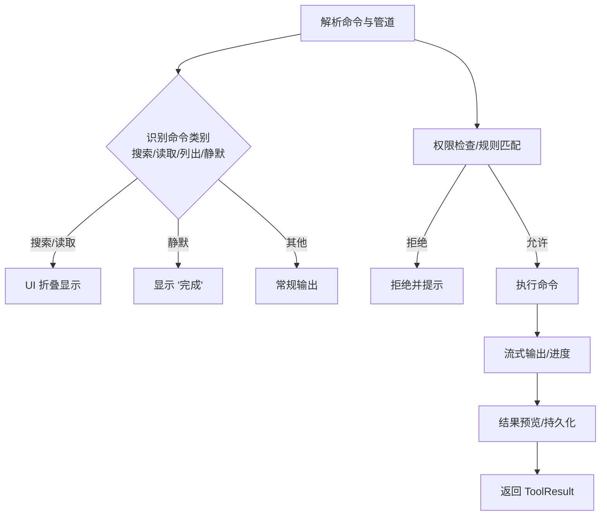
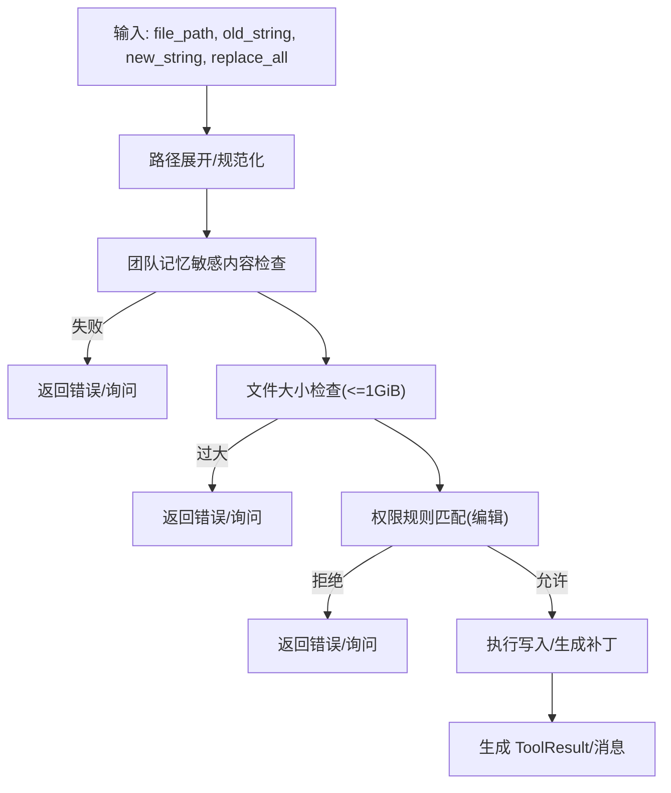
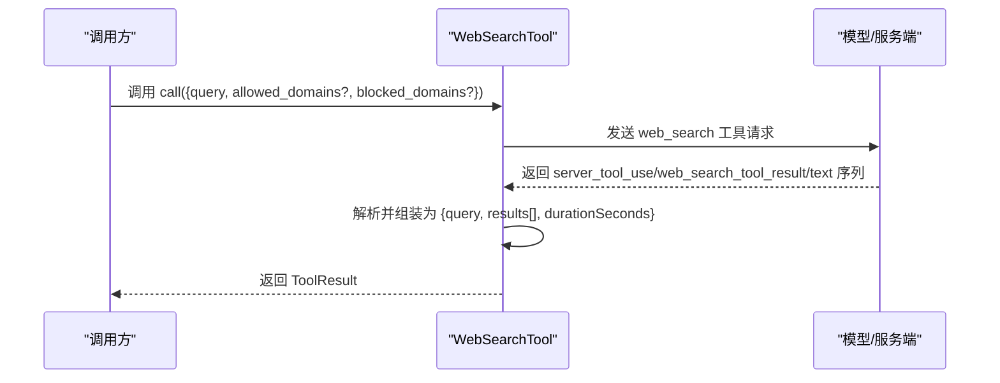
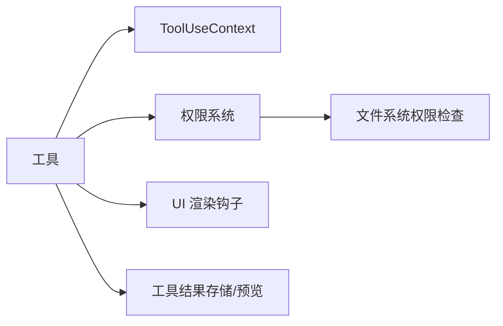

# 工具 API

<cite>
**本文引用的文件**
- [src/Tool.ts](file://src/Tool.ts)
- [src/tools.ts](file://src/tools.ts)
- [src/constants/tools.ts](file://src/constants/tools.ts)
- [src/tools/BashTool/BashTool.tsx](file://src/tools/BashTool/BashTool.tsx)
- [src/tools/FileEditTool/FileEditTool.ts](file://src/tools/FileEditTool/FileEditTool.ts)
- [src/tools/WebSearchTool/WebSearchTool.ts](file://src/tools/WebSearchTool/WebSearchTool.ts)
- [src/utils/permissions/filesystem.ts](file://src/utils/permissions/filesystem.ts)
</cite>

## 目录
1. [简介](#简介)
2. [项目结构](#项目结构)
3. [核心组件](#核心组件)
4. [架构总览](#架构总览)
5. [详细组件分析](#详细组件分析)
6. [依赖分析](#依赖分析)
7. [性能考虑](#性能考虑)
8. [故障排除指南](#故障排除指南)
9. [结论](#结论)
10. [附录](#附录)

## 简介
本文件系统性阐述 Claude Code 工具 API 的架构与接口规范，覆盖工具基类与继承体系、生命周期与执行流程、接口定义与参数校验、返回值与错误处理、内置工具（如 BashTool、FileEditTool、WebSearchTool）的使用方式、工具开发与注册、权限与安全检查、执行上下文与环境变量传递、输出格式化与结果存储、性能优化与并发控制等。文档同时提供 API 使用示例与故障排除建议，帮助开发者快速上手并安全高效地扩展工具生态。

## 项目结构
工具系统围绕统一的工具基类与工具集合装配器构建，内置工具通过条件特性开关与权限规则进行启用与过滤，并支持 MCP 工具动态注入与去重合并。权限系统对路径、工作目录、危险文件与模式进行严格校验，确保在交互与自动化场景下的安全性。



**图表来源**
- [src/Tool.ts:1-793](file://src/Tool.ts#L1-L793)
- [src/tools.ts:190-390](file://src/tools.ts#L190-L390)
- [src/constants/tools.ts:36-113](file://src/constants/tools.ts#L36-L113)
- [src/tools/BashTool/BashTool.tsx:1-200](file://src/tools/BashTool/BashTool.tsx#L1-L200)
- [src/tools/FileEditTool/FileEditTool.ts:86-200](file://src/tools/FileEditTool/FileEditTool.ts#L86-L200)
- [src/tools/WebSearchTool/WebSearchTool.ts:152-200](file://src/tools/WebSearchTool/WebSearchTool.ts#L152-L200)
- [src/utils/permissions/filesystem.ts:620-665](file://src/utils/permissions/filesystem.ts#L620-L665)

**章节来源**
- [src/Tool.ts:158-300](file://src/Tool.ts#L158-L300)
- [src/tools.ts:190-390](file://src/tools.ts#L190-L390)
- [src/constants/tools.ts:36-113](file://src/constants/tools.ts#L36-L113)

## 核心组件
- 工具基类与类型
  - 工具接口定义：包含名称、别名、输入/输出模式、能力声明（是否只读、是否破坏性、是否并发安全）、权限检查、描述生成、UI 渲染钩子、摘要与活动描述、自动分类输入、结果消息映射、搜索文本提取、进度渲染等。
  - 构建器 buildTool：为常用可选方法提供安全默认（如 isEnabled 默认启用、isConcurrencySafe 默认不安全、checkPermissions 默认放行），保证工具实现的一致性与最小化样板代码。
  - 工具上下文 ToolUseContext：承载命令列表、调试/详细模式、主循环模型、工具集、MCP 客户端与资源、会话状态、通知回调、消息流、文件读取限制、查询链追踪、提示请求回调、工具使用 ID、内容替换预算、系统提示缓存冻结等。
  - 结果与进度：ToolResult 封装数据与附加消息；ToolProgressData 与 Progress 提供统一的进度事件类型；工具可选择性渲染工具使用消息、结果消息、拒绝与错误 UI。
- 工具集合装配器
  - getAllBaseTools：按当前运行环境聚合所有内置工具，尊重特性开关与平台差异。
  - getTools/filterToolsByDenyRules：根据权限上下文过滤掉被显式禁止的工具，隐藏 REPL 专用工具，应用 isEnabled 过滤。
  - assembleToolPool/getMergedTools：将内置工具与 MCP 工具合并，保持内置工具前缀连续以稳定提示缓存键，去重时内置优先。
- 常量与可用性限制
  - ALL_AGENT_DISALLOWED_TOOLS、ASYNC_AGENT_ALLOWED_TOOLS、IN_PROCESS_TEAMMATE_ALLOWED_TOOLS、COORDINATOR_MODE_ALLOWED_TOOLS 等集合用于不同角色与模式下的工具可用性约束。

**章节来源**
- [src/Tool.ts:362-695](file://src/Tool.ts#L362-L695)
- [src/Tool.ts:783-792](file://src/Tool.ts#L783-L792)
- [src/Tool.ts:158-300](file://src/Tool.ts#L158-L300)
- [src/tools.ts:190-390](file://src/tools.ts#L190-L390)
- [src/constants/tools.ts:36-113](file://src/constants/tools.ts#L36-L113)

## 架构总览
工具调用从“工具选择与权限校验”开始，进入“输入校验与权限决策”，随后在“工具上下文”中执行，期间可产生“进度事件”与“中间消息”，最终产出“工具结果”。内置工具与 MCP 工具在装配阶段统一去重并排序，保证提示缓存稳定性。



**图表来源**
- [src/tools.ts:271-327](file://src/tools.ts#L271-L327)
- [src/Tool.ts:379-403](file://src/Tool.ts#L379-L403)
- [src/utils/permissions/filesystem.ts:620-665](file://src/utils/permissions/filesystem.ts#L620-L665)

## 详细组件分析

### 工具基类与继承体系
- 关键接口字段与方法
  - 名称与别名：name、aliases
  - 输入/输出模式：inputSchema、outputSchema、inputJSONSchema
  - 能力与行为：isEnabled、isConcurrencySafe、isReadOnly、isDestructive、interruptBehavior、isSearchOrReadCommand、isOpenWorld、requiresUserInteraction
  - 权限与校验：validateInput、checkPermissions、preparePermissionMatcher、getPath
  - 描述与展示：description、prompt、userFacingName、userFacingNameBackgroundColor、getToolUseSummary、getActivityDescription、toAutoClassifierInput
  - 结果与 UI：mapToolResultToToolResultBlockParam、renderToolUseMessage、renderToolResultMessage、renderToolUseProgressMessage、renderToolUseQueuedMessage、renderToolUseRejectedMessage、renderToolUseErrorMessage、renderGroupedToolUse
  - 上下文修改：contextModifier
- 构建器 buildTool
  - 为常用可选方法提供安全默认，避免遗漏导致的不可预期行为。
- 继承与扩展
  - 所有内置工具通过 buildTool 包裹导出，统一实现上述接口，便于在权限、UI、日志、统计等方面保持一致。

```mermaid
classDiagram
class Tool {
+name : string
+aliases? : string[]
+inputSchema
+outputSchema?
+isEnabled() : boolean
+isConcurrencySafe(input) : boolean
+isReadOnly(input) : boolean
+isDestructive?(input) : boolean
+interruptBehavior?() : "cancel"|"block"
+isSearchOrReadCommand?(input) : {isSearch,isRead,isList?}
+isOpenWorld?(input) : boolean
+requiresUserInteraction?() : boolean
+validateInput?(input, context) : Promise
+checkPermissions(input, context) : Promise
+preparePermissionMatcher?(input) : Promise
+getPath?(input) : string
+prompt(options) : Promise
+userFacingName(input?) : string
+userFacingNameBackgroundColor?(input?) : ThemeKey
+getToolUseSummary?(input?) : string|null
+getActivityDescription?(input?) : string|null
+toAutoClassifierInput(input)
+mapToolResultToToolResultBlockParam(content, toolUseID)
+renderToolUseMessage(input, options)
+renderToolResultMessage?(content, progress, options)
+renderToolUseProgressMessage?(progress, options)
+renderToolUseQueuedMessage?()
+renderToolUseRejectedMessage?(input, options)
+renderToolUseErrorMessage?(result, options)
+renderGroupedToolUse?(toolUses, options)
}
class BuildTool {
+buildTool(def) : Tool
}
Tool <.. BuildTool : "由构建器填充默认实现"
```

**图表来源**
- [src/Tool.ts:362-695](file://src/Tool.ts#L362-L695)
- [src/Tool.ts:783-792](file://src/Tool.ts#L783-L792)

**章节来源**
- [src/Tool.ts:362-695](file://src/Tool.ts#L362-L695)
- [src/Tool.ts:783-792](file://src/Tool.ts#L783-L792)

### 工具集合装配与权限过滤
- getAllBaseTools：按环境特性聚合内置工具，剔除冗余搜索工具（当嵌入工具可用时）。
- getTools：应用 deny 规则过滤、REPL 模式隐藏原始工具、按 isEnabled 过滤。
- assembleToolPool：内置工具前缀连续，避免缓存键抖动；MCP 工具按名称去重，内置优先。
- 常量限制：针对异步代理、进程内同伴、协调者模式分别给出允许/禁止清单，保障系统一致性。



**图表来源**
- [src/tools.ts:190-390](file://src/tools.ts#L190-L390)
- [src/constants/tools.ts:36-113](file://src/constants/tools.ts#L36-L113)

**章节来源**
- [src/tools.ts:190-390](file://src/tools.ts#L190-L390)
- [src/constants/tools.ts:36-113](file://src/constants/tools.ts#L36-L113)

### BashTool 执行流程与 UI 行为
- 命令解析与语义判定：拆分管道与操作符，识别搜索/读取/列出/静默命令，决定 UI 折叠与“无输出”提示。
- 权限与只读约束：基于规则匹配与沙箱策略，对危险命令与路径进行拦截或降级。
- 并发与中断：支持“取消/阻塞”两种中断行为；长任务显示进度；可后台执行并记录任务输出。
- 输出与结果：图像/文本/截断处理；结果预览与持久化；与文件历史与 LSP 集成。



**图表来源**
- [src/tools/BashTool/BashTool.tsx:95-172](file://src/tools/BashTool/BashTool.tsx#L95-L172)
- [src/tools/BashTool/BashTool.tsx:178-200](file://src/tools/BashTool/BashTool.tsx#L178-L200)

**章节来源**
- [src/tools/BashTool/BashTool.tsx:95-172](file://src/tools/BashTool/BashTool.tsx#L95-L172)
- [src/tools/BashTool/BashTool.tsx:178-200](file://src/tools/BashTool/BashTool.tsx#L178-L200)

### FileEditTool 参数校验与安全检查
- 输入校验：比较新旧字符串、路径展开、大小限制、UNC 路径跳过文件系统检查、权限规则匹配。
- 权限检查：基于工具权限上下文与文件系统规则，判断写入是否被允许；对危险文件与目录进行保护。
- 安全增强：检测可疑 Windows 路径模式（ADS、短名、长路径前缀、尾随空格点、设备名、三斜线等）；对 .claude 配置文件、计划文件、会话内存目录、临时目录等进行特殊保护。
- 结果与 UI：生成工具使用摘要、活动描述、结果消息与错误/拒绝 UI；与文件历史、LSP 诊断联动。



**图表来源**
- [src/tools/FileEditTool/FileEditTool.ts:137-200](file://src/tools/FileEditTool/FileEditTool.ts#L137-L200)
- [src/utils/permissions/filesystem.ts:620-665](file://src/utils/permissions/filesystem.ts#L620-L665)

**章节来源**
- [src/tools/FileEditTool/FileEditTool.ts:137-200](file://src/tools/FileEditTool/FileEditTool.ts#L137-L200)
- [src/utils/permissions/filesystem.ts:620-665](file://src/utils/permissions/filesystem.ts#L620-L665)

### WebSearchTool 接口与输出格式
- 输入模式：查询词、允许/阻止域名数组。
- 输出模式：工具使用 ID、搜索命中标题与链接数组、文本注释与模型总结、耗时秒数。
- 启用条件：根据模型提供商与模型版本决定是否启用。
- 结果组装：解析服务端工具块序列，拼接文本与搜索结果，形成统一输出结构。



**图表来源**
- [src/tools/WebSearchTool/WebSearchTool.ts:25-67](file://src/tools/WebSearchTool/WebSearchTool.ts#L25-L67)
- [src/tools/WebSearchTool/WebSearchTool.ts:76-150](file://src/tools/WebSearchTool/WebSearchTool.ts#L76-L150)

**章节来源**
- [src/tools/WebSearchTool/WebSearchTool.ts:25-67](file://src/tools/WebSearchTool/WebSearchTool.ts#L25-L67)
- [src/tools/WebSearchTool/WebSearchTool.ts:76-150](file://src/tools/WebSearchTool/WebSearchTool.ts#L76-L150)

## 依赖分析
- 工具到上下文：工具通过 ToolUseContext 获取命令、MCP 客户端、消息、文件状态、通知、会话 ID 等。
- 工具到权限：工具通过 checkPermissions 与 preparePermissionMatcher 与权限系统协作；FileEditTool 与 BashTool 分别调用文件系统权限模块。
- 工具到 UI：工具通过多种 render* 方法提供消息、进度、拒绝/错误 UI，支持简洁/详细模式与主题切换。
- 工具到结果存储：部分工具使用工具结果存储与预览机制，控制大结果的持久化与展示。



**图表来源**
- [src/Tool.ts:158-300](file://src/Tool.ts#L158-L300)
- [src/tools/FileEditTool/FileEditTool.ts:125-132](file://src/tools/FileEditTool/FileEditTool.ts#L125-L132)
- [src/tools/BashTool/BashTool.tsx:13-51](file://src/tools/BashTool/BashTool.tsx#L13-L51)

**章节来源**
- [src/Tool.ts:158-300](file://src/Tool.ts#L158-L300)
- [src/tools/FileEditTool/FileEditTool.ts:125-132](file://src/tools/FileEditTool/FileEditTool.ts#L125-L132)
- [src/tools/BashTool/BashTool.tsx:13-51](file://src/tools/BashTool/BashTool.tsx#L13-L51)

## 性能考虑
- 提示缓存稳定性：内置工具前缀连续、名称排序去重，避免 MCP 工具打乱顺序导致缓存键失效。
- 并发安全：isConcurrencySafe 明确工具是否可并发执行；BashTool 支持后台执行与阻塞预算控制。
- 大结果处理：工具可设置最大结果字符数，超过阈值时采用预览与磁盘持久化，避免内存溢出。
- UI 折叠与进度：对搜索/读取/列出命令进行折叠显示，减少转录体积；长任务显示进度提升感知。
- 文件大小与 I/O：FileEditTool 对超大文件进行限制与提示，BashTool 对图像输出进行尺寸调整与截断。

**章节来源**
- [src/tools.ts:345-367](file://src/tools.ts#L345-L367)
- [src/Tool.ts:466](file://src/Tool.ts#L466)
- [src/tools/BashTool/BashTool.tsx:54-57](file://src/tools/BashTool/BashTool.tsx#L54-L57)
- [src/tools/FileEditTool/FileEditTool.ts:79-84](file://src/tools/FileEditTool/FileEditTool.ts#L79-L84)

## 故障排除指南
- 权限相关
  - 拒绝原因：deny 规则匹配、危险文件/目录、UNC 路径、配置文件写入、路径遍历风险、可疑 Windows 路径模式。
  - 处理建议：检查工具权限上下文与规则；确认路径是否在工作目录范围内；避免编辑 .claude/*.json、.git、.vscode、.idea 等目录；必要时手动授权或调整规则。
- 输入校验
  - FileEditTool：old_string 与 new_string 相同会被拒绝；文件过大（>1GiB）需拆分或改用读取/搜索工具；UNC 路径跳过文件系统检查但需权限系统处理。
  - BashTool：命令解析失败时不会被识别为搜索/读取；静默命令成功时不显示输出；注意管道中非中性命令混合导致的折叠判定。
- 输出与存储
  - 大结果被持久化：检查工具结果目录与预览大小；必要时在 UI 中展开查看完整内容。
- 启用条件
  - WebSearchTool：仅在特定提供商与模型版本下启用；若不可用，请确认模型与提供商配置。

**章节来源**
- [src/utils/permissions/filesystem.ts:435-488](file://src/utils/permissions/filesystem.ts#L435-L488)
- [src/utils/permissions/filesystem.ts:537-602](file://src/utils/permissions/filesystem.ts#L537-L602)
- [src/tools/FileEditTool/FileEditTool.ts:137-200](file://src/tools/FileEditTool/FileEditTool.ts#L137-L200)
- [src/tools/WebSearchTool/WebSearchTool.ts:168-193](file://src/tools/WebSearchTool/WebSearchTool.ts#L168-L193)

## 结论
Claude Code 工具 API 以统一的工具基类为核心，结合严格的权限系统与灵活的装配器，实现了内置工具与 MCP 工具的无缝集成。通过明确的生命周期、参数校验、返回值与错误处理、UI 渲染与结果存储机制，开发者可以安全、高效地扩展工具生态。遵循本文档的开发与使用指南，可在保证安全的前提下最大化工具的可用性与性能。

## 附录

### 工具开发指南（实践要点）
- 定义工具
  - 使用 buildTool 包裹导出，至少提供 name、inputSchema、outputSchema、call、description、prompt 等核心方法；其余方法按需实现。
  - 若涉及文件路径，实现 getPath 与 preparePermissionMatcher；若需要权限决策，实现 checkPermissions 与 validateInput。
- 注册工具
  - 在工具集合中添加导出项；如需延迟加载，设置 shouldDefer；如需初始即可见，设置 alwaysLoad。
  - 如为 MCP 工具，确保 mcpInfo 正确；最终由 assembleToolPool 合并并去重。
- 权限与安全
  - 优先使用工具权限上下文与文件系统权限模块；对危险文件/目录、UNC 路径、可疑 Windows 路径模式进行严格检查。
  - 对写入操作实现只读/破坏性标记，必要时要求用户交互。
- 执行上下文与环境变量
  - 通过 ToolUseContext 访问命令、MCP 客户端、消息、文件状态、通知、会话 ID 等；避免直接依赖全局状态。
- 输出格式化与结果存储
  - 控制 maxResultSizeChars；必要时使用预览与持久化；实现 renderToolResultMessage 与 extractSearchText 以便转录索引与搜索。
- 并发与性能
  - 明确 isConcurrencySafe；对长任务显示进度；对大文件与大输出进行限制与分页展示。

**章节来源**
- [src/Tool.ts:362-695](file://src/Tool.ts#L362-L695)
- [src/tools.ts:190-390](file://src/tools.ts#L190-L390)
- [src/utils/permissions/filesystem.ts:620-665](file://src/utils/permissions/filesystem.ts#L620-L665)