# 工具执行上下文

<cite>
**本文档引用的文件**
- [Tool.ts](file://src/Tool.ts)
- [StreamingToolExecutor.ts](file://src/services/tools/StreamingToolExecutor.ts)
- [toolExecution.ts](file://src/services/tools/toolExecution.ts)
- [forkedAgent.ts](file://src/utils/forkedAgent.ts)
- [context.ts](file://src/context.ts)
- [context.ts](file://src/utils/context.ts)
- [hooks.ts](file://src/utils/hooks.ts)
- [Spinner.tsx](file://src/components/Spinner.tsx)
</cite>

## 目录
1. [简介](#简介)
2. [项目结构](#项目结构)
3. [核心组件](#核心组件)
4. [架构概览](#架构概览)
5. [详细组件分析](#详细组件分析)
6. [依赖关系分析](#依赖关系分析)
7. [性能考虑](#性能考虑)
8. [故障排除指南](#故障排除指南)
9. [结论](#结论)

## 简介

工具执行上下文系统是 Claude Code 中负责管理工具调用执行环境的核心机制。该系统通过 ToolUseContext 结构体提供统一的执行环境，包括状态管理、资源访问、进度报告和并发控制等功能。

本系统支持多种工具类型（内置工具、MCP 工具、技能工具等），提供了完整的工具执行生命周期管理，包括权限检查、输入验证、执行监控、结果处理和错误恢复等环节。

## 项目结构

工具执行上下文系统主要分布在以下模块中：

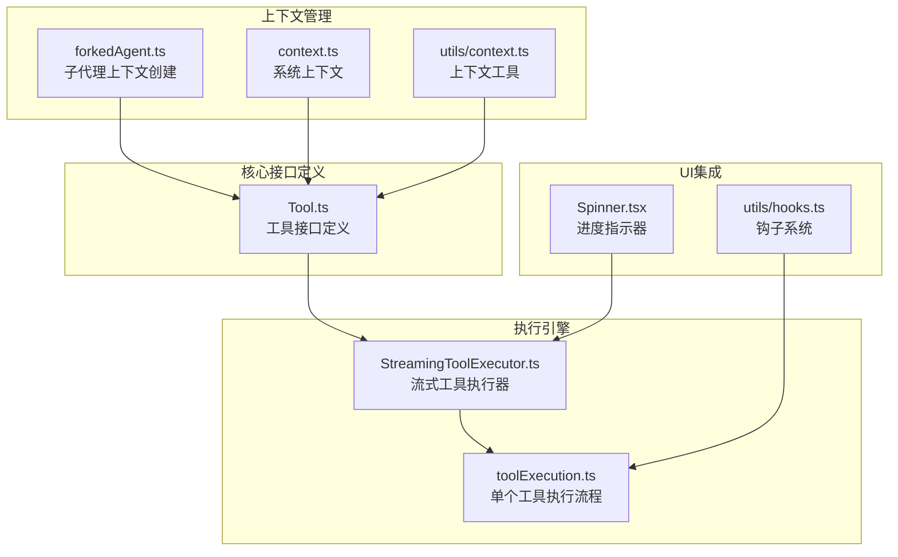

**图表来源**
- [Tool.ts:158-300](file://src/Tool.ts#L158-L300)
- [StreamingToolExecutor.ts:40-62](file://src/services/tools/StreamingToolExecutor.ts#L40-L62)
- [toolExecution.ts:337-490](file://src/services/tools/toolExecution.ts#L337-L490)

**章节来源**
- [Tool.ts:158-300](file://src/Tool.ts#L158-L300)
- [StreamingToolExecutor.ts:40-62](file://src/services/tools/StreamingToolExecutor.ts#L40-L62)

## 核心组件

### ToolUseContext 结构

ToolUseContext 是工具执行的核心上下文对象，包含了执行工具所需的所有环境信息：

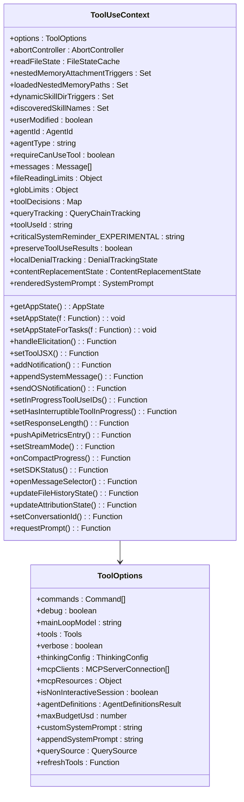

**图表来源**
- [Tool.ts:158-300](file://src/Tool.ts#L158-L300)

### 并发执行控制

系统实现了智能的并发控制机制，支持工具间的并发安全执行：

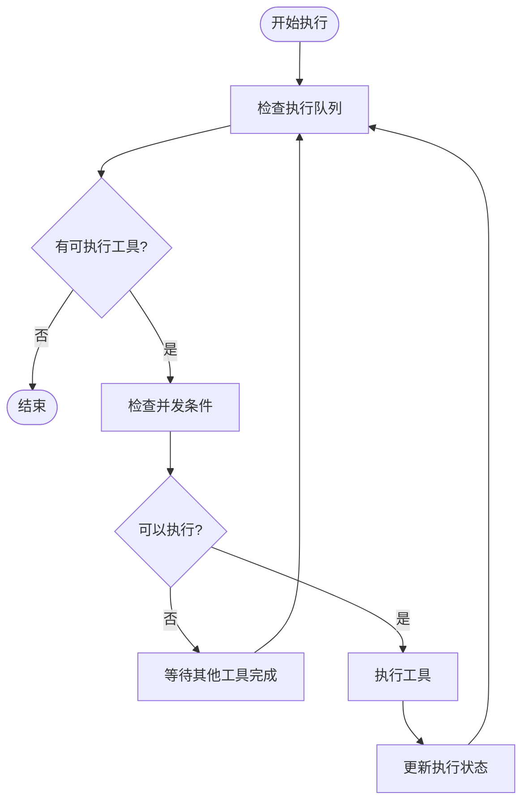

**图表来源**
- [StreamingToolExecutor.ts:129-151](file://src/services/tools/StreamingToolExecutor.ts#L129-L151)

**章节来源**
- [Tool.ts:158-300](file://src/Tool.ts#L158-L300)
- [StreamingToolExecutor.ts:129-151](file://src/services/tools/StreamingToolExecutor.ts#L129-L151)

## 架构概览

工具执行上下文系统采用分层架构设计，确保了良好的模块化和可扩展性：

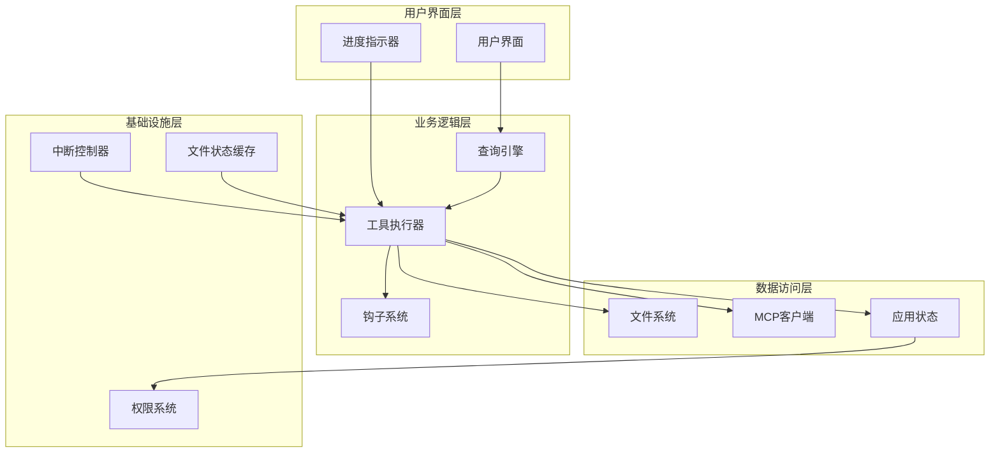

**图表来源**
- [toolExecution.ts:337-490](file://src/services/tools/toolExecution.ts#L337-L490)
- [StreamingToolExecutor.ts:40-62](file://src/services/tools/StreamingToolExecutor.ts#L40-L62)

## 详细组件分析

### 流式工具执行器

StreamingToolExecutor 负责管理多个工具的并发执行，提供了完整的执行生命周期控制：

#### 执行队列管理

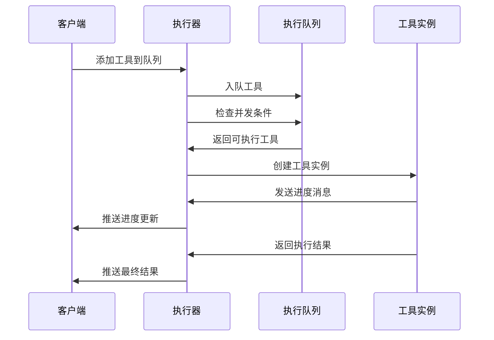

**图表来源**
- [StreamingToolExecutor.ts:76-124](file://src/services/tools/StreamingToolExecutor.ts#L76-L124)
- [StreamingToolExecutor.ts:265-405](file://src/services/tools/StreamingToolExecutor.ts#L265-L405)

#### 并发控制策略

系统实现了灵活的并发控制机制：

| 工具类型 | 并发能力 | 执行策略 |
|---------|---------|---------|
| 并发安全工具 | 支持并发 | 多工具并行执行 |
| 非并发工具 | 不支持并发 | 独占执行资源 |
| Bash工具 | 部分并发 | 子进程间相互影响 |
| 文件操作工具 | 不支持并发 | 原子性保护 |

**章节来源**
- [StreamingToolExecutor.ts:129-151](file://src/services/tools/StreamingToolExecutor.ts#L129-L151)
- [StreamingToolExecutor.ts:388-405](file://src/services/tools/StreamingToolExecutor.ts#L388-L405)

### 单个工具执行流程

toolExecution.ts 实现了单个工具的完整执行流程，包括权限检查、输入验证和结果处理：

#### 权限决策流程

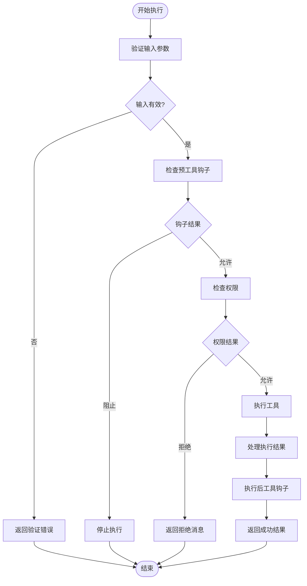

**图表来源**
- [toolExecution.ts:599-862](file://src/services/tools/toolExecution.ts#L599-L862)

#### 错误处理机制

系统提供了多层次的错误处理机制：

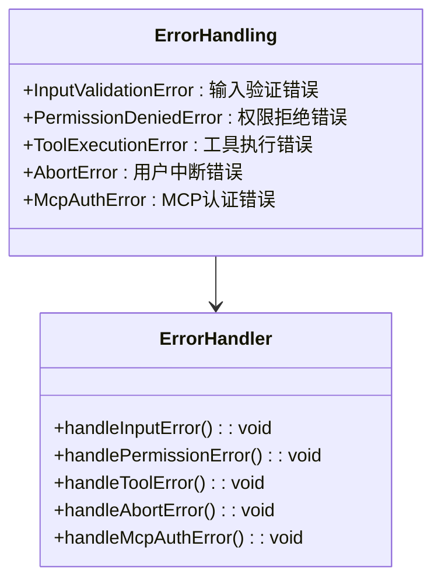

**图表来源**
- [toolExecution.ts:150-171](file://src/services/tools/toolExecution.ts#L150-L171)
- [toolExecution.ts:1631-1629](file://src/services/tools/toolExecution.ts#L1631-L1629)

**章节来源**
- [toolExecution.ts:599-862](file://src/services/tools/toolExecution.ts#L599-L862)
- [toolExecution.ts:150-171](file://src/services/tools/toolExecution.ts#L150-L171)

### 子代理上下文管理

forkedAgent.ts 提供了子代理的上下文创建和管理功能，确保异步代理的正确隔离：

#### 上下文隔离策略

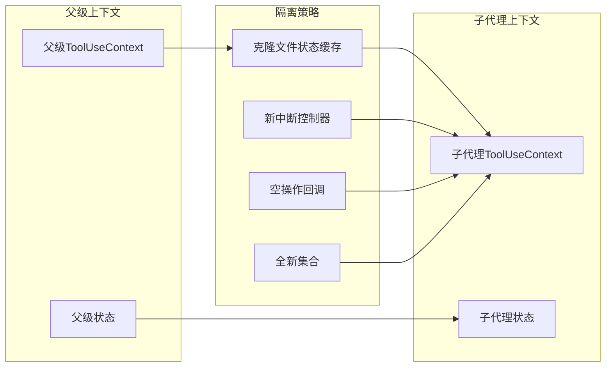

**图表来源**
- [forkedAgent.ts:345-462](file://src/utils/forkedAgent.ts#L345-L462)

**章节来源**
- [forkedAgent.ts:345-462](file://src/utils/forkedAgent.ts#L345-L462)

### 进度报告机制

系统实现了完整的进度报告机制，支持实时的UI更新：

#### 进度消息类型

| 进度类型 | 描述 | 使用场景 |
|---------|------|---------|
| 工具进度 | 工具执行的具体进度信息 | Bash工具、文件操作等 |
| 钩子进度 | 预/后工具钩子的执行进度 | 权限检查、内容过滤等 |
| 系统消息 | 系统级别的状态更新 | 内存文件注入、MCP连接等 |

**章节来源**
- [toolExecution.ts:521-556](file://src/services/tools/toolExecution.ts#L521-L556)
- [StreamingToolExecutor.ts:368-375](file://src/services/tools/StreamingToolExecutor.ts#L368-L375)

## 依赖关系分析

工具执行上下文系统具有清晰的依赖层次结构：

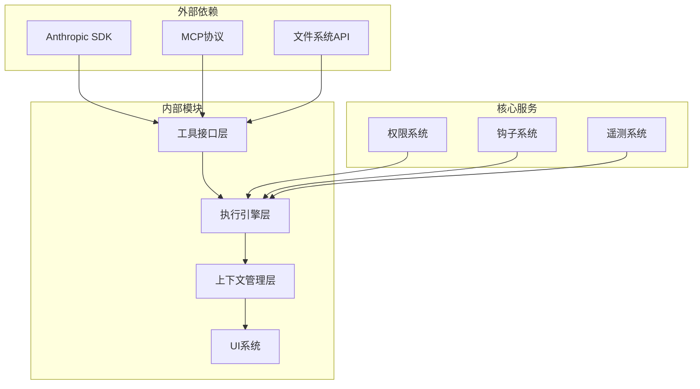

**图表来源**
- [Tool.ts:1-14](file://src/Tool.ts#L1-L14)
- [toolExecution.ts:1-125](file://src/services/tools/toolExecution.ts#L1-L125)

**章节来源**
- [Tool.ts:1-14](file://src/Tool.ts#L1-L14)
- [toolExecution.ts:1-125](file://src/services/tools/toolExecution.ts#L1-L125)

## 性能考虑

### 缓存策略

系统实现了多层缓存机制来提升性能：

1. **文件状态缓存**：避免重复的文件读取操作
2. **系统提示缓存**：缓存系统提示以减少计算开销
3. **工具结果缓存**：对大型工具结果进行持久化存储

### 并发优化

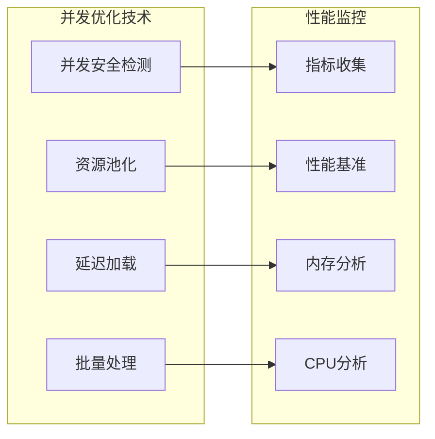

**图表来源**
- [StreamingToolExecutor.ts:129-135](file://src/services/tools/StreamingToolExecutor.ts#L129-L135)
- [context.ts:36-111](file://src/context.ts#L36-L111)

### 最佳实践建议

1. **合理设置并发限制**：根据系统资源合理配置并发工具数量
2. **使用适当的缓存策略**：对频繁访问的数据建立缓存
3. **优化文件访问模式**：批量处理文件操作以减少I/O开销
4. **监控资源使用情况**：定期检查内存和CPU使用情况

**章节来源**
- [StreamingToolExecutor.ts:129-135](file://src/services/tools/StreamingToolExecutor.ts#L129-L135)
- [context.ts:36-111](file://src/context.ts#L36-L111)

## 故障排除指南

### 常见问题诊断

#### 工具执行失败

当工具执行失败时，系统会记录详细的错误信息：

1. **输入验证失败**：检查工具输入参数格式是否正确
2. **权限拒绝**：确认用户权限设置和工具权限规则
3. **资源访问失败**：检查文件系统权限和网络连接
4. **超时错误**：调整超时设置或优化工具实现

#### 并发冲突问题

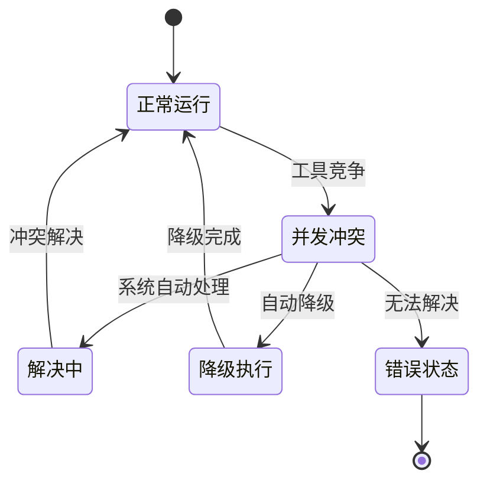

**图表来源**
- [StreamingToolExecutor.ts:210-241](file://src/services/tools/StreamingToolExecutor.ts#L210-L241)

### 调试技巧

1. **启用详细日志**：设置调试标志获取更详细的执行信息
2. **监控系统指标**：关注CPU、内存和磁盘I/O使用情况
3. **分析执行时间**：识别性能瓶颈和慢速工具
4. **检查资源限制**：验证文件描述符和进程数限制

**章节来源**
- [toolExecution.ts:469-490](file://src/services/tools/toolExecution.ts#L469-L490)
- [StreamingToolExecutor.ts:210-241](file://src/services/tools/StreamingToolExecutor.ts#L210-L241)

## 结论

工具执行上下文系统通过精心设计的架构和完善的机制，为 Claude Code 提供了强大而灵活的工具执行能力。系统的主要特点包括：

1. **完整的生命周期管理**：从输入验证到结果处理的全流程控制
2. **智能并发控制**：支持不同类型工具的并发执行策略
3. **丰富的上下文信息**：提供全面的执行环境和状态管理
4. **强大的错误处理**：多层次的错误捕获和恢复机制
5. **优秀的性能表现**：通过缓存和优化技术确保高效执行

该系统的设计充分考虑了实际使用场景的需求，在保证功能完整性的同时，也注重了性能和可维护性的平衡。通过遵循本文档提供的最佳实践和优化建议，开发者可以更好地利用这个系统来构建高质量的工具执行解决方案。