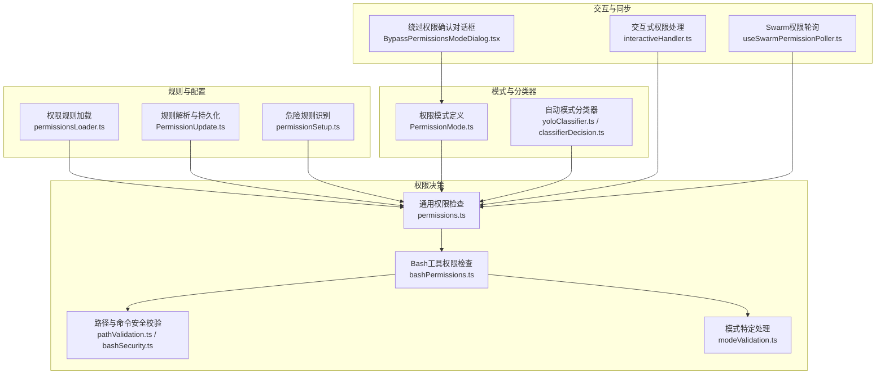
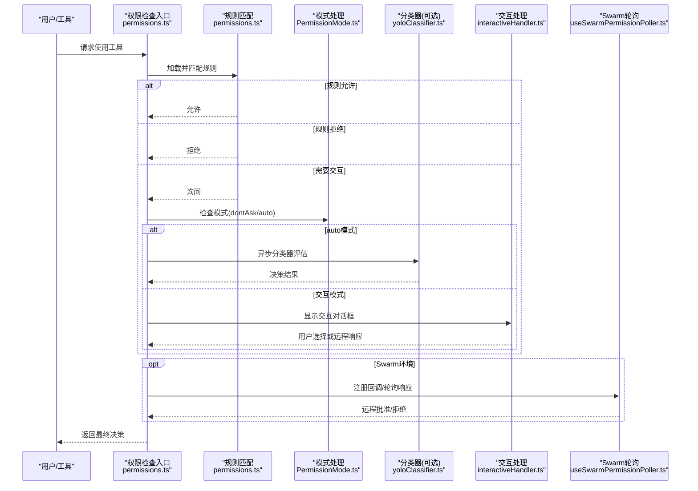
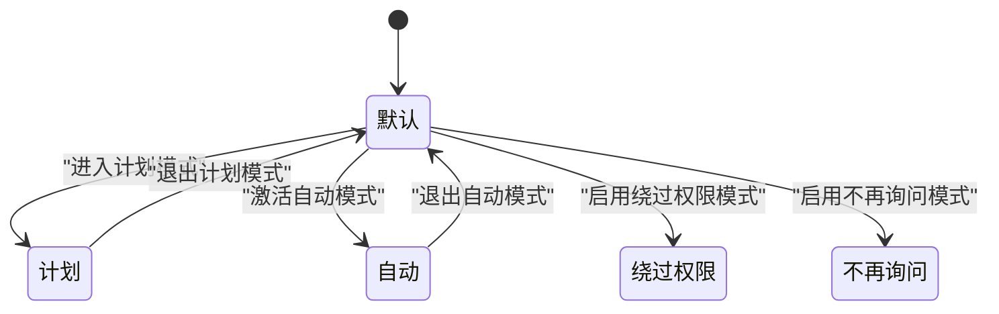
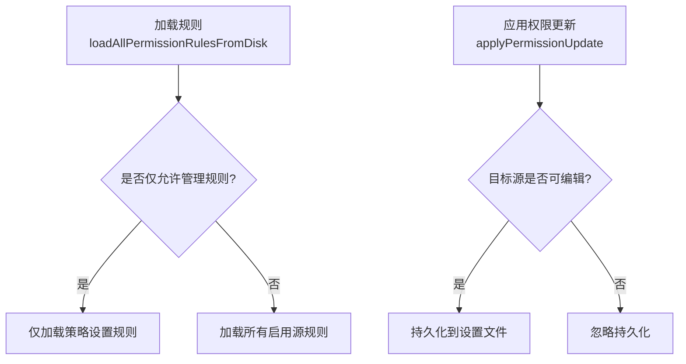
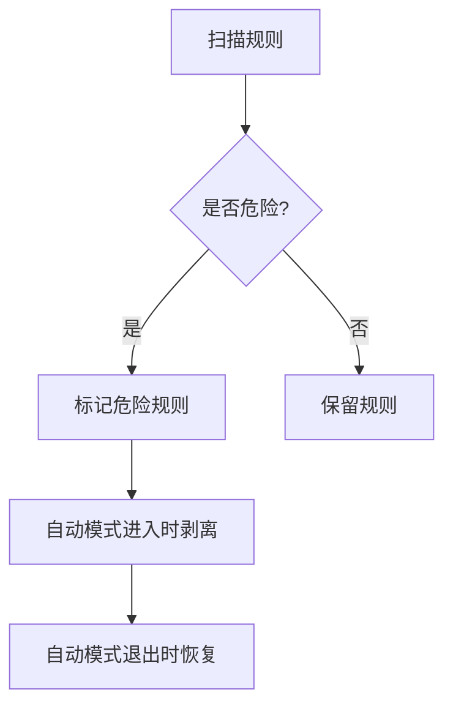
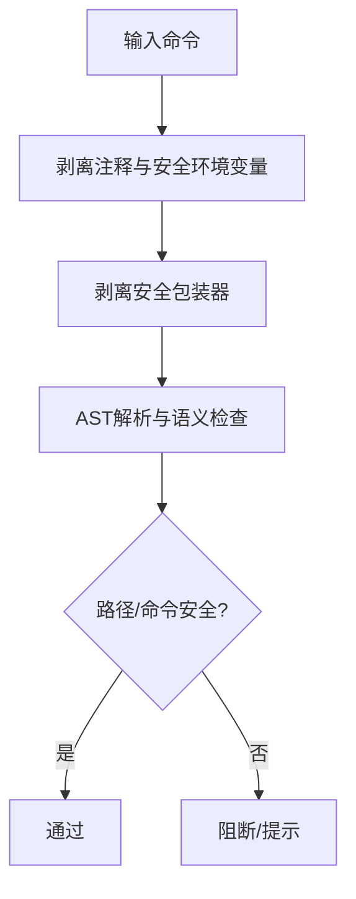
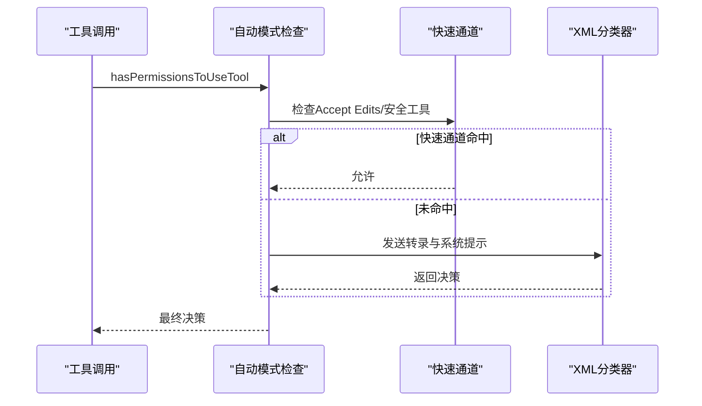
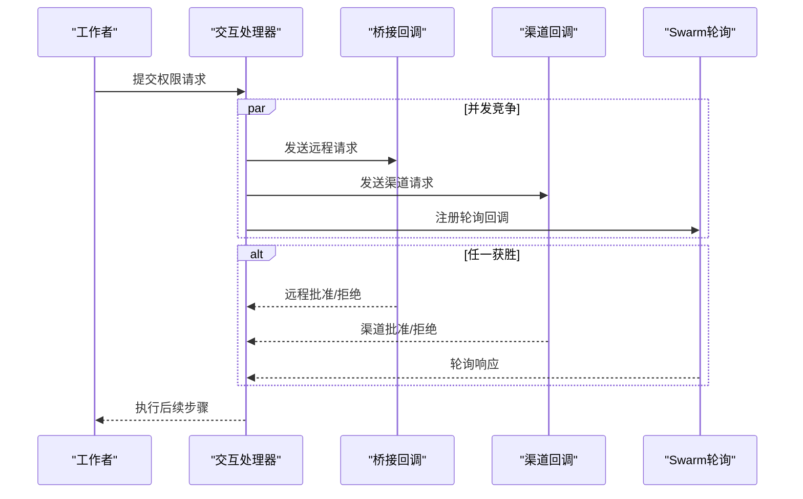
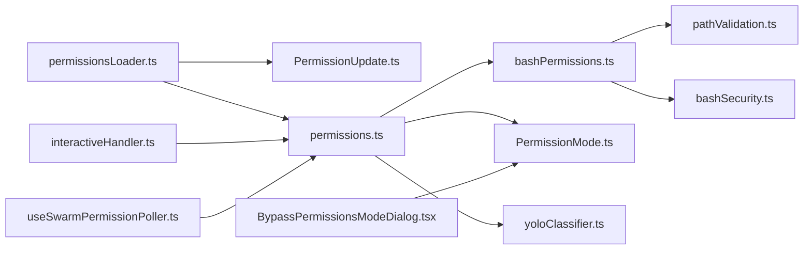

# 工具权限与安全

<cite>
**本文档引用的文件**
- [permissionSetup.ts](file://src/utils/permissions/permissionSetup.ts)
- [permissions.ts](file://src/utils/permissions/permissions.ts)
- [PermissionMode.ts](file://src/utils/permissions/PermissionMode.ts)
- [PermissionUpdate.ts](file://src/utils/permissions/PermissionUpdate.ts)
- [bashPermissions.ts](file://src/tools/BashTool/bashPermissions.ts)
- [bashSecurity.ts](file://src/tools/BashTool/bashSecurity.ts)
- [pathValidation.ts](file://src/tools/BashTool/pathValidation.ts)
- [modeValidation.ts](file://src/tools/BashTool/modeValidation.ts)
- [useSwarmPermissionPoller.ts](file://src/hooks/useSwarmPermissionPoller.ts)
- [dangerousPatterns.ts](file://src/utils/permissions/dangerousPatterns.ts)
- [yoloClassifier.ts](file://src/utils/permissions/yoloClassifier.ts)
- [classifierDecision.ts](file://src/utils/permissions/classifierDecision.ts)
- [permissionsLoader.ts](file://src/utils/permissions/permissionsLoader.ts)
- [BypassPermissionsModeDialog.tsx](file://src/components/BypassPermissionsModeDialog.tsx)
- [interactiveHandler.ts](file://src/hooks/toolPermission/handlers/interactiveHandler.ts)
- [permissions.ts（类型定义）](file://src/types/permissions.ts)
</cite>

## 目录
1. [简介](#简介)
2. [项目结构](#项目结构)
3. [核心组件](#核心组件)
4. [架构总览](#架构总览)
5. [详细组件分析](#详细组件分析)
6. [依赖关系分析](#依赖关系分析)
7. [性能考虑](#性能考虑)
8. [故障排除指南](#故障排除指南)
9. [结论](#结论)

## 简介
本文件系统性阐述工具权限与安全体系，覆盖以下主题：
- 权限检查全流程：自动模式、交互模式与绕过权限模式的差异与适用场景
- 权限规则配置：允许、拒绝、询问三种行为的使用策略与最佳实践
- 危险性评估标准：破坏性操作、文件系统访问与命令执行的安全考量
- 安全审计与日志：权限决策的可追溯性与审计要点
- 扩展与定制：如何扩展权限系统与自定义权限处理器
- 权限更新与持久化：规则变更的传播与回滚机制

## 项目结构
权限与安全系统由“规则解析与加载”、“权限决策引擎”、“模式控制与分类器”、“交互与提示”、“持久化与同步”等模块组成，形成从规则到执行的闭环。

**图表来源**
- [permissionsLoader.ts:120-133](file://src/utils/permissions/permissionsLoader.ts#L120-L133)
- [PermissionUpdate.ts:55-188](file://src/utils/permissions/PermissionUpdate.ts#L55-L188)
- [permissionSetup.ts:295-342](file://src/utils/permissions/permissionSetup.ts#L295-L342)
- [permissions.ts:473-800](file://src/utils/permissions/permissions.ts#L473-L800)
- [bashPermissions.ts:1-120](file://src/tools/BashTool/bashPermissions.ts#L1-L120)
- [pathValidation.ts:834-845](file://src/tools/BashTool/pathValidation.ts#L834-L845)
- [modeValidation.ts:72-90](file://src/tools/BashTool/modeValidation.ts#L72-L90)
- [PermissionMode.ts:42-91](file://src/utils/permissions/PermissionMode.ts#L42-L91)
- [yoloClassifier.ts:484-540](file://src/utils/permissions/yoloClassifier.ts#L484-L540)
- [classifierDecision.ts:56-94](file://src/utils/permissions/classifierDecision.ts#L56-L94)
- [interactiveHandler.ts:57-531](file://src/hooks/toolPermission/handlers/interactiveHandler.ts#L57-L531)
- [useSwarmPermissionPoller.ts:268-330](file://src/hooks/useSwarmPermissionPoller.ts#L268-L330)
- [BypassPermissionsModeDialog.tsx:12-87](file://src/components/BypassPermissionsModeDialog.tsx#L12-L87)

**章节来源**
- [permissionsLoader.ts:120-133](file://src/utils/permissions/permissionsLoader.ts#L120-L133)
- [PermissionUpdate.ts:55-188](file://src/utils/permissions/PermissionUpdate.ts#L55-L188)
- [permissionSetup.ts:295-342](file://src/utils/permissions/permissionSetup.ts#L295-L342)
- [permissions.ts:473-800](file://src/utils/permissions/permissions.ts#L473-L800)
- [bashPermissions.ts:1-120](file://src/tools/BashTool/bashPermissions.ts#L1-L120)
- [pathValidation.ts:834-845](file://src/tools/BashTool/pathValidation.ts#L834-L845)
- [modeValidation.ts:72-90](file://src/tools/BashTool/modeValidation.ts#L72-L90)
- [PermissionMode.ts:42-91](file://src/utils/permissions/PermissionMode.ts#L42-L91)
- [yoloClassifier.ts:484-540](file://src/utils/permissions/yoloClassifier.ts#L484-L540)
- [classifierDecision.ts:56-94](file://src/utils/permissions/classifierDecision.ts#L56-L94)
- [interactiveHandler.ts:57-531](file://src/hooks/toolPermission/handlers/interactiveHandler.ts#L57-L531)
- [useSwarmPermissionPoller.ts:268-330](file://src/hooks/useSwarmPermissionPoller.ts#L268-L330)
- [BypassPermissionsModeDialog.tsx:12-87](file://src/components/BypassPermissionsModeDialog.tsx#L12-L87)

## 核心组件
- 权限模式与状态
  - 模式定义与标题映射：default、plan、acceptEdits、bypassPermissions、dontAsk、auto
  - 模式切换与状态迁移：进入/退出计划模式、自动模式激活/恢复
- 权限规则与更新
  - 规则来源：用户设置、项目设置、本地设置、会话、命令行参数
  - 更新操作：添加、替换、移除规则；添加/移除额外工作目录；设置模式
  - 规则持久化：仅对可编辑源进行写入
- 危险规则识别
  - Bash/PowerShell危险前缀与通配符规则
  - 代理/子代理危险规则
  - 自动模式下危险规则剥离与恢复
- 权限决策引擎
  - 规则匹配：工具级匹配、内容级匹配、前缀/通配符匹配
  - 模式影响：dontAsk直接拒绝、auto模式分类器替代交互
  - 分类器决策：接受编辑快速通道、安全工具白名单、XML两阶段分类器
- Bash工具安全
  - 命令拆分与包装器剥离
  - 路径约束与只读/可写安全检查
  - 沙箱启用与排除命令
- 交互与远程同步
  - 交互式权限对话：桥接远程、渠道通知、钩子与分类器并发竞争
  - Swarm权限轮询：磁盘轮询、消息队列响应、回调注册与清理
- 绕过权限模式
  - 绕过权限确认对话框与风险提示
  - 禁用策略：组织策略与特性门禁

**章节来源**
- [PermissionMode.ts:42-91](file://src/utils/permissions/PermissionMode.ts#L42-L91)
- [permissions.ts:122-302](file://src/utils/permissions/permissions.ts#L122-L302)
- [PermissionUpdate.ts:55-188](file://src/utils/permissions/PermissionUpdate.ts#L55-L188)
- [permissionSetup.ts:295-579](file://src/utils/permissions/permissionSetup.ts#L295-L579)
- [bashPermissions.ts:1-120](file://src/tools/BashTool/bashPermissions.ts#L1-L120)
- [pathValidation.ts:834-845](file://src/tools/BashTool/pathValidation.ts#L834-L845)
- [modeValidation.ts:72-90](file://src/tools/BashTool/modeValidation.ts#L72-L90)
- [interactiveHandler.ts:57-531](file://src/hooks/toolPermission/handlers/interactiveHandler.ts#L57-L531)
- [useSwarmPermissionPoller.ts:268-330](file://src/hooks/useSwarmPermissionPoller.ts#L268-L330)
- [BypassPermissionsModeDialog.tsx:12-87](file://src/components/BypassPermissionsModeDialog.tsx#L12-L87)

## 架构总览
权限系统采用“规则驱动 + 模式控制 + 分类器辅助”的分层设计，确保在不同运行环境下（本地CLI、远程桥接、Swarm团队）保持一致的权限语义与安全边界。

**图表来源**
- [permissions.ts:473-800](file://src/utils/permissions/permissions.ts#L473-L800)
- [PermissionMode.ts:42-91](file://src/utils/permissions/PermissionMode.ts#L42-L91)
- [yoloClassifier.ts:688-702](file://src/utils/permissions/yoloClassifier.ts#L688-L702)
- [interactiveHandler.ts:57-531](file://src/hooks/toolPermission/handlers/interactiveHandler.ts#L57-L531)
- [useSwarmPermissionPoller.ts:268-330](file://src/hooks/useSwarmPermissionPoller.ts#L268-L330)

## 详细组件分析

### 权限模式与切换流程
- 模式定义与颜色/符号映射，区分外部可用模式与内部模式（如auto）
- 模式切换时的状态迁移：计划模式进入/退出、自动模式激活/恢复
- 自动模式的危险规则剥离与恢复，保证分类器前置评估

**图表来源**
- [PermissionMode.ts:42-91](file://src/utils/permissions/PermissionMode.ts#L42-L91)
- [permissionSetup.ts:597-646](file://src/utils/permissions/permissionSetup.ts#L597-L646)

**章节来源**
- [PermissionMode.ts:42-91](file://src/utils/permissions/PermissionMode.ts#L42-L91)
- [permissionSetup.ts:597-646](file://src/utils/permissions/permissionSetup.ts#L597-L646)

### 权限规则配置与持久化
- 规则来源与优先级：受管理设置限制时仅使用策略设置
- 规则行为：allow/deny/ask，支持工具级与内容级匹配
- 更新操作：添加/替换/移除规则、添加/移除额外工作目录、设置模式
- 持久化策略：仅对可编辑设置源（用户/项目/本地）写入

**图表来源**
- [permissionsLoader.ts:120-133](file://src/utils/permissions/permissionsLoader.ts#L120-L133)
- [PermissionUpdate.ts:55-188](file://src/utils/permissions/PermissionUpdate.ts#L55-L188)

**章节来源**
- [permissionsLoader.ts:120-133](file://src/utils/permissions/permissionsLoader.ts#L120-L133)
- [PermissionUpdate.ts:55-188](file://src/utils/permissions/PermissionUpdate.ts#L55-L188)

### 危险规则识别与自动模式保护
- Bash危险规则：通配符/解释器前缀/脚本运行器
- PowerShell危险规则：嵌套壳、字符串/脚本块执行、进程启动
- 代理/子代理危险规则：允许规则绕过分类器前置评估
- 自动模式保护：进入时剥离危险规则，退出时恢复

**图表来源**
- [permissionSetup.ts:295-342](file://src/utils/permissions/permissionSetup.ts#L295-L342)
- [permissionSetup.ts:510-579](file://src/utils/permissions/permissionSetup.ts#L510-L579)
- [dangerousPatterns.ts:44-81](file://src/utils/permissions/dangerousPatterns.ts#L44-L81)

**章节来源**
- [permissionSetup.ts:295-342](file://src/utils/permissions/permissionSetup.ts#L295-L342)
- [permissionSetup.ts:510-579](file://src/utils/permissions/permissionSetup.ts#L510-L579)
- [dangerousPatterns.ts:44-81](file://src/utils/permissions/dangerousPatterns.ts#L44-L81)

### Bash工具权限检查与安全校验
- 命令拆分与包装器剥离：避免timeout/nice/stdbuf/nohup等包装器绕过
- 路径约束与只读/可写安全检查：防止路径遍历与敏感目录访问
- 沙箱启用与排除命令：对高危命令启用沙箱或排除
- 模式特定处理：Accept Edits模式下的文件系统命令自动放行

**图表来源**
- [bashPermissions.ts:524-615](file://src/tools/BashTool/bashPermissions.ts#L524-L615)
- [pathValidation.ts:834-845](file://src/tools/BashTool/pathValidation.ts#L834-L845)
- [bashSecurity.ts:1603-1636](file://src/tools/BashTool/bashSecurity.ts#L1603-L1636)
- [modeValidation.ts:72-90](file://src/tools/BashTool/modeValidation.ts#L72-L90)

**章节来源**
- [bashPermissions.ts:524-615](file://src/tools/BashTool/bashPermissions.ts#L524-L615)
- [pathValidation.ts:834-845](file://src/tools/BashTool/pathValidation.ts#L834-L845)
- [bashSecurity.ts:1603-1636](file://src/tools/BashTool/bashSecurity.ts#L1603-L1636)
- [modeValidation.ts:72-90](file://src/tools/BashTool/modeValidation.ts#L72-L90)

### 自动模式分类器与快速通道
- 快速通道：Accept Edits模式（工作目录内文件编辑）、安全工具白名单
- 分类器：XML两阶段（fast/thinking/both），输出格式与思考配置
- 成本与统计：令牌用量、延迟、请求ID与消息ID追踪

**图表来源**
- [permissions.ts:600-686](file://src/utils/permissions/permissions.ts#L600-L686)
- [yoloClassifier.ts:711-802](file://src/utils/permissions/yoloClassifier.ts#L711-L802)
- [classifierDecision.ts:56-94](file://src/utils/permissions/classifierDecision.ts#L56-L94)

**章节来源**
- [permissions.ts:600-686](file://src/utils/permissions/permissions.ts#L600-L686)
- [yoloClassifier.ts:711-802](file://src/utils/permissions/yoloClassifier.ts#L711-L802)
- [classifierDecision.ts:56-94](file://src/utils/permissions/classifierDecision.ts#L56-L94)

### 交互式权限处理与远程同步
- 并发竞争：钩子、分类器、远程桥接、渠道通知、用户交互
- 回调注册与清理：请求ID映射、超时与错误处理
- Swarm轮询：磁盘轮询、消息队列响应、清理响应文件

**图表来源**
- [interactiveHandler.ts:234-298](file://src/hooks/toolPermission/handlers/interactiveHandler.ts#L234-L298)
- [interactiveHandler.ts:300-408](file://src/hooks/toolPermission/handlers/interactiveHandler.ts#L300-L408)
- [useSwarmPermissionPoller.ts:268-330](file://src/hooks/useSwarmPermissionPoller.ts#L268-L330)

**章节来源**
- [interactiveHandler.ts:234-298](file://src/hooks/toolPermission/handlers/interactiveHandler.ts#L234-L298)
- [interactiveHandler.ts:300-408](file://src/hooks/toolPermission/handlers/interactiveHandler.ts#L300-L408)
- [useSwarmPermissionPoller.ts:268-330](file://src/hooks/useSwarmPermissionPoller.ts#L268-L330)

### 绕过权限模式与风险提示
- 绕过权限模式对话框：明确风险与责任转移
- 禁用策略：组织策略与特性门禁
- 使用场景：沙箱容器/虚拟机且网络受限的受控环境

**章节来源**
- [BypassPermissionsModeDialog.tsx:12-87](file://src/components/BypassPermissionsModeDialog.tsx#L12-L87)
- [permissionSetup.ts:725-796](file://src/utils/permissions/permissionSetup.ts#L725-L796)

## 依赖关系分析
- 模块耦合
  - 权限规则与加载：permissionsLoader.ts与PermissionUpdate.ts紧密协作
  - 权限决策：permissions.ts依赖规则、模式、分类器与Bash工具安全模块
  - 交互与同步：interactiveHandler.ts与useSwarmPermissionPoller.ts独立但共享回调契约
- 外部依赖
  - 分类器：依赖模型服务与缓存控制
  - 设置系统：读取/写入设置文件，遵循可编辑源限制

**图表来源**
- [permissionsLoader.ts:120-133](file://src/utils/permissions/permissionsLoader.ts#L120-L133)
- [PermissionUpdate.ts:55-188](file://src/utils/permissions/PermissionUpdate.ts#L55-L188)
- [permissions.ts:473-800](file://src/utils/permissions/permissions.ts#L473-L800)
- [bashPermissions.ts:1-120](file://src/tools/BashTool/bashPermissions.ts#L1-L120)
- [pathValidation.ts:834-845](file://src/tools/BashTool/pathValidation.ts#L834-L845)
- [bashSecurity.ts:1603-1636](file://src/tools/BashTool/bashSecurity.ts#L1603-L1636)
- [PermissionMode.ts:42-91](file://src/utils/permissions/PermissionMode.ts#L42-L91)
- [yoloClassifier.ts:484-540](file://src/utils/permissions/yoloClassifier.ts#L484-L540)
- [interactiveHandler.ts:57-531](file://src/hooks/toolPermission/handlers/interactiveHandler.ts#L57-L531)
- [useSwarmPermissionPoller.ts:268-330](file://src/hooks/useSwarmPermissionPoller.ts#L268-L330)
- [BypassPermissionsModeDialog.tsx:12-87](file://src/components/BypassPermissionsModeDialog.tsx#L12-L87)

**章节来源**
- [permissionsLoader.ts:120-133](file://src/utils/permissions/permissionsLoader.ts#L120-L133)
- [PermissionUpdate.ts:55-188](file://src/utils/permissions/PermissionUpdate.ts#L55-L188)
- [permissions.ts:473-800](file://src/utils/permissions/permissions.ts#L473-L800)
- [bashPermissions.ts:1-120](file://src/tools/BashTool/bashPermissions.ts#L1-L120)
- [pathValidation.ts:834-845](file://src/tools/BashTool/pathValidation.ts#L834-L845)
- [bashSecurity.ts:1603-1636](file://src/tools/BashTool/bashSecurity.ts#L1603-L1636)
- [PermissionMode.ts:42-91](file://src/utils/permissions/PermissionMode.ts#L42-L91)
- [yoloClassifier.ts:484-540](file://src/utils/permissions/yoloClassifier.ts#L484-L540)
- [interactiveHandler.ts:57-531](file://src/hooks/toolPermission/handlers/interactiveHandler.ts#L57-L531)
- [useSwarmPermissionPoller.ts:268-330](file://src/hooks/useSwarmPermissionPoller.ts#L268-L330)
- [BypassPermissionsModeDialog.tsx:12-87](file://src/components/BypassPermissionsModeDialog.tsx#L12-L87)

## 性能考虑
- 规则匹配复杂度：工具级匹配O(Rules)，内容级匹配涉及前缀/通配符，建议合理拆分规则粒度
- Bash命令拆分上限：复合命令子句数量上限，超过阈值降级为“需要交互”
- 分类器成本：令牌用量与延迟统计，建议结合快速通道减少API调用
- 事件循环影响：复杂命令可能导致微任务链饥饿，应避免过长的复合命令

[本节为通用指导，不直接分析具体文件]

## 故障排除指南
- 分类器不可用/超时：检查网络与速率限制，查看错误提示与转录快照
- 权限规则未生效：确认规则来源与持久化目标（仅可编辑源），检查策略设置限制
- Swarm权限无响应：检查轮询间隔、回调注册与响应清理
- 绕过权限模式被禁用：检查组织策略与特性门禁

**章节来源**
- [yoloClassifier.ts:213-250](file://src/utils/permissions/yoloClassifier.ts#L213-L250)
- [permissionsLoader.ts:239-242](file://src/utils/permissions/permissionsLoader.ts#L239-L242)
- [useSwarmPermissionPoller.ts:268-330](file://src/hooks/useSwarmPermissionPoller.ts#L268-L330)
- [permissionSetup.ts:725-796](file://src/utils/permissions/permissionSetup.ts#L725-L796)

## 结论
该权限与安全系统通过“规则驱动 + 模式控制 + 分类器辅助”的分层设计，在保证安全性的同时提供了灵活的交互与自动化能力。建议在生产环境中：
- 严格限制危险规则，启用自动模式前剥离危险规则
- 合理使用“询问”规则，减少误判与过度授权
- 在Swarm与远程环境中使用桥接/渠道与轮询机制确保一致性
- 对绕过权限模式保持谨慎，仅在受控沙箱环境中启用

[本节为总结性内容，不直接分析具体文件]