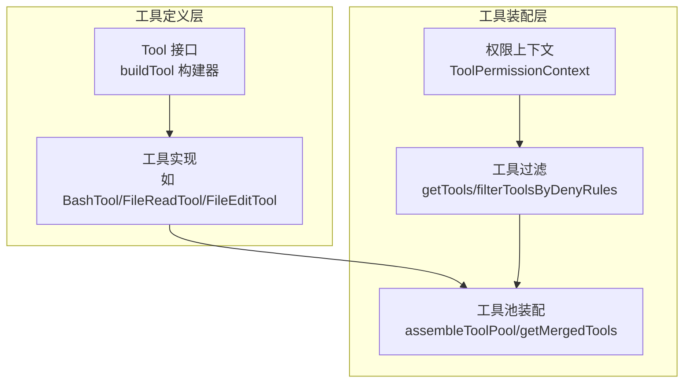
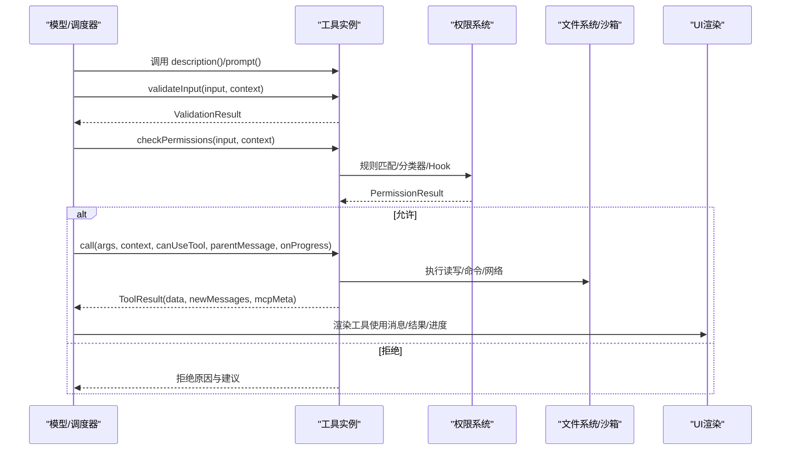
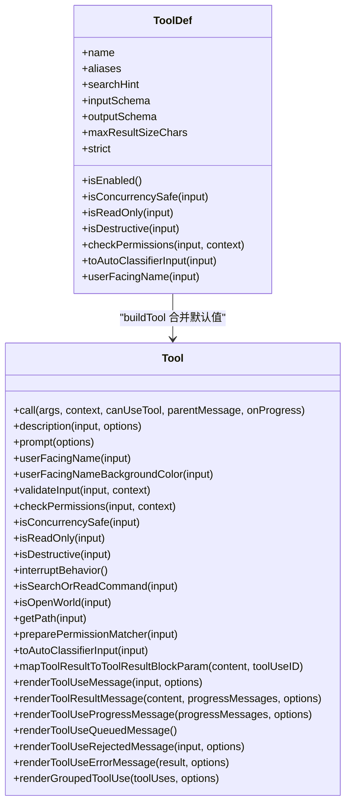
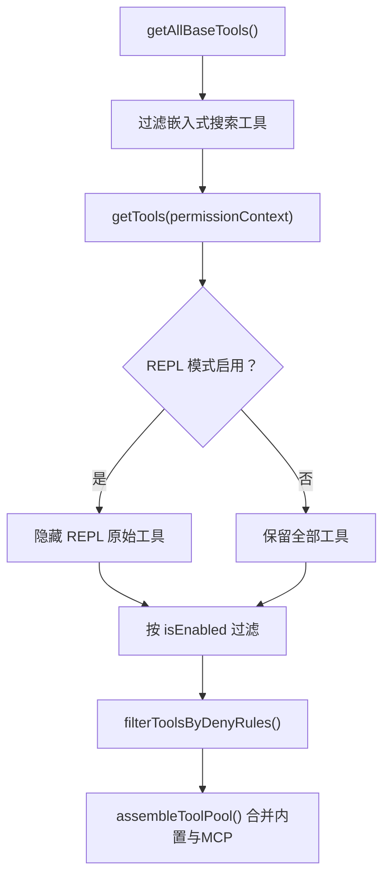
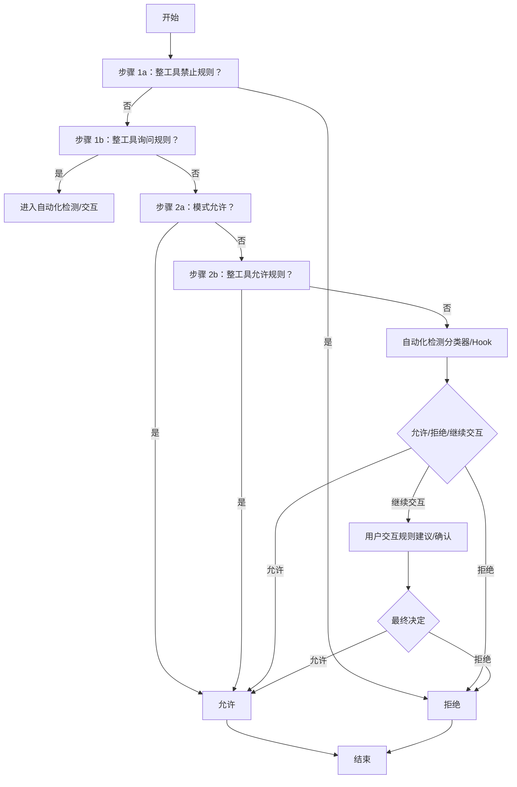
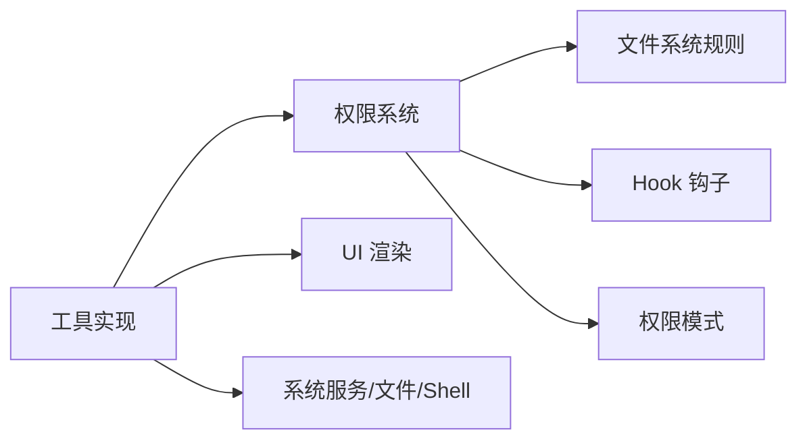

# 工具架构设计

<cite>
**本文引用的文件**
- [Tool.ts](file://src/Tool.ts)
- [tools.ts](file://src/tools.ts)
- [tools.ts（常量）](file://src/constants/tools.ts)
- [FileReadTool.ts](file://src/tools/FileReadTool/FileReadTool.ts)
- [FileEditTool.ts](file://src/tools/FileEditTool/FileEditTool.ts)
- [BashTool.tsx](file://src/tools/BashTool/BashTool.tsx)
- [permissions.ts](file://src/utils/permissions/permissions.ts)
- [filesystem.ts](file://src/utils/permissions/filesystem.ts)
- [structuredIO.ts](file://src/cli/structuredIO.ts)
- [getNextPermissionMode.ts](file://src/utils/permissions/getNextPermissionMode.ts)
</cite>

## 目录
1. [引言](#引言)
2. [项目结构](#项目结构)
3. [核心组件](#核心组件)
4. [架构总览](#架构总览)
5. [详细组件分析](#详细组件分析)
6. [依赖分析](#依赖分析)
7. [性能考虑](#性能考虑)
8. [故障排查指南](#故障排查指南)
9. [结论](#结论)
10. [附录](#附录)

## 引言
本文件系统性阐述 Claude Code 的工具架构设计，围绕 Tool 基类的接口规范、生命周期与状态控制、权限检查机制、输入验证与错误处理策略进行深入解析，并结合内置工具实现示例，帮助开发者在扩展或维护工具时遵循一致的设计原则与最佳实践。

## 项目结构
工具系统由“工具定义层”和“工具装配层”构成：
- 工具定义层：通过统一的 Tool 接口与 buildTool 构建器，定义工具的输入输出、行为特性、UI 渲染与权限规则等。
- 工具装配层：根据运行环境、权限上下文与特性开关，组装可用工具集合，并对 MCP 工具进行合并与去重。

图表来源
- [Tool.ts](file://src/Tool.ts)
- [tools.ts](file://src/tools.ts)

章节来源
- [Tool.ts:1-793](file://src/Tool.ts#L1-L793)
- [tools.ts:190-390](file://src/tools.ts#L190-L390)

## 核心组件
- Tool 接口与构建器
  - 定义工具的输入/输出模式、生命周期钩子、UI 渲染、权限与安全属性等。
  - 提供 buildTool 构建器，自动填充常用默认值，确保一致性与安全性。
- 工具集合与装配
  - getAllBaseTools 组装内置工具清单；getTools 过滤不可用工具；assembleToolPool 合并内置与 MCP 工具。
- 权限上下文与决策
  - ToolPermissionContext 描述当前权限模式与规则集；权限决策贯穿规则匹配、自动化检测、用户交互与模式切换。

章节来源
- [Tool.ts:362-792](file://src/Tool.ts#L362-L792)
- [tools.ts:190-390](file://src/tools.ts#L190-L390)
- [Tool.ts:123-148](file://src/Tool.ts#L123-L148)

## 架构总览
工具架构以 Tool 接口为核心，围绕以下关键点展开：
- 生命周期与状态控制：工具在调用前进行输入校验与权限检查，运行中可产生进度消息，结束后生成结果与 UI 片段。
- 执行流程：validateInput → checkPermissions → call → 渲染 UI/消息 → 记录统计与审计。
- 权限模型：规则驱动（allow/deny/ask）、自动化分类器、Hook 钩子、模式切换（bypass/auto/default/plan）。
- 并发与安全：isConcurrencySafe、isReadOnly、isDestructive、interruptBehavior 等属性用于约束工具行为。

图表来源
- [Tool.ts:379-503](file://src/Tool.ts#L379-L503)
- [permissions.ts:1060-1297](file://src/utils/permissions/permissions.ts#L1060-L1297)
- [BashTool.tsx:1-200](file://src/tools/BashTool/BashTool.tsx#L1-L200)

## 详细组件分析

### Tool 接口与构建器
- 关键职责
  - 输入/输出模式：inputSchema/outputSchema/zod 类型约束；支持 JSON Schema 输入（MCP 工具）。
  - 行为特性：isConcurrencySafe/isReadOnly/isDestructive/interruptBehavior/isSearchOrReadCommand/isOpenWorld 等。
  - 生命周期钩子：call/description/prompt/userFacingName/toAutoClassifierInput/mapToolResultToToolResultBlockParam 等。
  - UI 渲染：renderToolUseMessage/renderToolResultMessage/renderToolUseProgressMessage 等。
  - 权限与安全：checkPermissions/validateInput/preparePermissionMatcher/getPath 等。
- 默认策略（fail-closed）
  - 默认启用、默认非并发安全、默认非只读、默认非破坏性、默认允许但交由通用权限系统处理。
- 构建器 buildTool
  - 将部分实现与默认值合并，保证所有工具具备一致的最小能力集，避免遗漏关键逻辑。

图表来源
- [Tool.ts:362-792](file://src/Tool.ts#L362-L792)

章节来源
- [Tool.ts:362-792](file://src/Tool.ts#L362-L792)
- [Tool.ts:757-792](file://src/Tool.ts#L757-L792)

### 工具集合与装配
- getAllBaseTools：按平台/特性开关组装内置工具列表，剔除嵌入式搜索工具（当可用时）。
- getTools：应用权限规则过滤、REPL 模式隐藏原始工具、按 isEnabled 过滤。
- assembleToolPool：内置工具优先、MCP 工具补充、名称排序去重，保持提示缓存稳定性。
- getMergedTools：返回内置与 MCP 工具的完整集合（不进行去重）。

图表来源
- [tools.ts:190-390](file://src/tools.ts#L190-L390)

章节来源
- [tools.ts:190-390](file://src/tools.ts#L190-L390)

### 权限检查机制
- 权限上下文 ToolPermissionContext
  - 包含权限模式、额外工作目录、三类规则集（允许/禁止/询问）、是否可绕过权限模式等。
- 决策流程（简化）
  - 步骤 1a：整工具禁止规则 → 直接拒绝
  - 步骤 1b：整工具询问规则 → 进入交互或自动化检测
  - 步骤 2a：模式允许（bypassPermissions 或 plan 模式且可用）→ 直接允许
  - 步骤 2b：整工具允许规则 → 直接允许
  - 步骤 3：自动化检测（分类器/Hook）→ 允许/拒绝/继续交互
  - 步骤 4：用户交互 → 允许/拒绝/规则建议
- 工具级权限
  - 文件系统工具通过 filesystem.ts 中的规则匹配与危险路径/目录保护进行检查。
  - Bash 工具对命令进行解析、子命令权限检查与沙箱策略评估。

图表来源
- [permissions.ts:1060-1297](file://src/utils/permissions/permissions.ts#L1060-L1297)
- [filesystem.ts:1-200](file://src/utils/permissions/filesystem.ts#L1-L200)
- [BashTool.tsx:1-200](file://src/tools/BashTool/BashTool.tsx#L1-L200)

章节来源
- [permissions.ts:1060-1297](file://src/utils/permissions/permissions.ts#L1060-L1297)
- [filesystem.ts:1-200](file://src/utils/permissions/filesystem.ts#L1-L200)
- [BashTool.tsx:1-200](file://src/tools/BashTool/BashTool.tsx#L1-L200)

### 输入验证与错误处理
- 输入验证 validateInput
  - FileEditTool：检查旧新内容是否相同、路径是否被禁止、UNC 路径安全、文件大小上限等。
  - FileReadTool：设备文件阻断、路径规范化、会话文件类型识别、令牌/字节限制等。
- 错误处理策略
  - 明确的 ValidationResult 返回（result: true/false + 可选 message/errorCode），便于 UI 与权限系统区分“可修复/需交互/直接失败”。
  - 对于大文件/高风险路径采用“询问/拒绝/改进建议”的策略，避免 OOM 或安全风险。

章节来源
- [FileEditTool.ts:137-200](file://src/tools/FileEditTool/FileEditTool.ts#L137-L200)
- [FileReadTool.ts:117-128](file://src/tools/FileReadTool/FileReadTool.ts#L117-L128)

### 工具继承体系与实现要点
- 基类与实现
  - FileReadTool：强调只读、文件大小与令牌限制、图像/PDF 处理、设备路径阻断。
  - FileEditTool：强调写入权限、变更追踪、设置文件校验、路径规范化。
  - BashTool：强调命令解析、子命令权限、沙箱策略、静默命令识别、UI 折叠显示。
- 共同点
  - 均通过 buildTool 构建，复用 Tool 默认策略。
  - 均实现 checkPermissions 与 validateInput，并提供 UI 渲染与摘要信息。

章节来源
- [FileReadTool.ts:1-200](file://src/tools/FileReadTool/FileReadTool.ts#L1-L200)
- [FileEditTool.ts:86-200](file://src/tools/FileEditTool/FileEditTool.ts#L86-L200)
- [BashTool.tsx:1-200](file://src/tools/BashTool/BashTool.tsx#L1-L200)

### 配置选项与属性语义
- isReadOnly
  - 语义：该工具不会修改持久状态（如文件、远程资源）。用于 UI 提示与权限分类。
- isDestructive
  - 语义：该工具可能造成不可逆影响（删除、覆盖、发送）。用于高亮与更严格的安全检查。
- isConcurrencySafe
  - 语义：允许多实例并发执行而不互相干扰。用于调度与 UI 展示。
- interruptBehavior
  - 语义：运行中收到新消息时的行为（取消/阻塞）。用于避免竞态与中断。
- isSearchOrReadCommand
  - 语义：用于 UI 折叠显示，提升可读性。
- isOpenWorld
  - 语义：开放世界工具（如 Web 搜索/浏览），用于分类与展示。
- maxResultSizeChars
  - 语义：结果大小阈值，超过后落盘并返回预览，避免内存压力。
- strict
  - 语义：启用更严格的参数校验与指令遵循（受特性门控）。

章节来源
- [Tool.ts:402-472](file://src/Tool.ts#L402-L472)

### 权限模式与上下文管理
- 模式切换
  - 通过 getNextPermissionMode 与 transitionPermissionMode 实现模式循环与上下文更新。
- 上下文更新
  - structuredIO 在 Hook 决策后应用权限更新并同步到 AppState，确保后续工具调用使用最新规则。

章节来源
- [getNextPermissionMode.ts:81-101](file://src/utils/permissions/getNextPermissionMode.ts#L81-L101)
- [structuredIO.ts:808-859](file://src/cli/structuredIO.ts#L808-L859)

## 依赖分析
- 工具到权限
  - 工具通过 checkPermissions 与 validateInput 与权限系统耦合；FileEditTool/FileReadTool 使用 filesystem.ts 的规则匹配与危险路径保护。
- 工具到 UI
  - 工具提供多种渲染函数（使用消息、结果消息、进度消息、拒绝/错误 UI），由上层 UI 组件统一消费。
- 工具到系统
  - BashTool 依赖 Shell 执行、沙箱管理、任务系统；FileReadTool/FileEditTool 依赖文件系统与路径工具。

图表来源
- [Tool.ts:362-792](file://src/Tool.ts#L362-L792)
- [permissions.ts:1060-1297](file://src/utils/permissions/permissions.ts#L1060-L1297)
- [filesystem.ts:1-200](file://src/utils/permissions/filesystem.ts#L1-L200)

章节来源
- [Tool.ts:362-792](file://src/Tool.ts#L362-L792)
- [permissions.ts:1060-1297](file://src/utils/permissions/permissions.ts#L1060-L1297)
- [filesystem.ts:1-200](file://src/utils/permissions/filesystem.ts#L1-L200)

## 性能考虑
- 结果大小控制：maxResultSizeChars 与工具内部阈值（如 FileEditTool 的 1GiB）避免大对象导致内存压力。
- 并发安全：isConcurrencySafe 为 true 的工具可并行执行，减少等待时间；否则串行或互斥执行。
- UI 折叠：isSearchOrReadCommand 与 Bash 的折叠命令集减少冗长输出，提升交互效率。
- 缓存与排序：assembleToolPool 对内置与 MCP 工具分别排序并去重，维持提示缓存稳定性，降低重复计算成本。

## 故障排查指南
- 权限相关
  - 若工具被拒绝，检查 deny 规则与 ask 规则；确认当前权限模式（bypass/auto/default/plan）是否允许。
  - 使用 getNextPermissionMode 切换模式，观察是否仍被拒绝。
- 输入验证失败
  - 查看 validateInput 返回的错误码与消息，确认是否为路径问题、文件过大、内容无变化等。
- Bash 工具异常
  - 检查命令解析与子命令权限；确认沙箱策略与静默命令识别是否符合预期。
- UI 不显示结果
  - 确认工具实现了 renderToolResultMessage 并返回了有效节点；检查 isResultTruncated 与 verbose 模式。

章节来源
- [permissions.ts:1060-1297](file://src/utils/permissions/permissions.ts#L1060-L1297)
- [FileEditTool.ts:137-200](file://src/tools/FileEditTool/FileEditTool.ts#L137-L200)
- [BashTool.tsx:1-200](file://src/tools/BashTool/BashTool.tsx#L1-L200)

## 结论
Tool 接口与 buildTool 构建器提供了统一、安全、可扩展的工具抽象；权限系统以规则、自动化检测与交互为核心，兼顾易用性与安全性；工具实现遵循相同的生命周期与渲染契约，便于维护与演进。通过合理使用 isReadOnly/isDestructive/isConcurrencySafe 等属性与 validateInput/checkPermissions 等钩子，可在保证安全的前提下最大化工具的灵活性与用户体验。

## 附录
- 工具常量与可用性
  - ALL_AGENT_DISALLOWED_TOOLS/CUSTOM_AGENT_DISALLOWED_TOOLS/ASYNC_AGENT_ALLOWED_TOOLS/IN_PROCESS_TEAMMATE_ALLOWED_TOOLS/COORDINATOR_MODE_ALLOWED_TOOLS 等集合用于不同角色与模式下的工具可用性控制。

章节来源
- [tools.ts（常量）:36-113](file://src/constants/tools.ts#L36-L113)