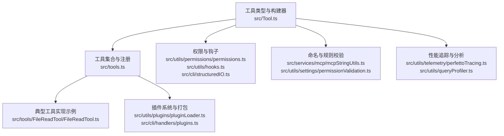
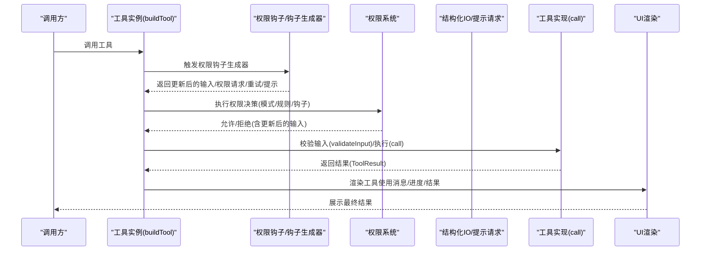
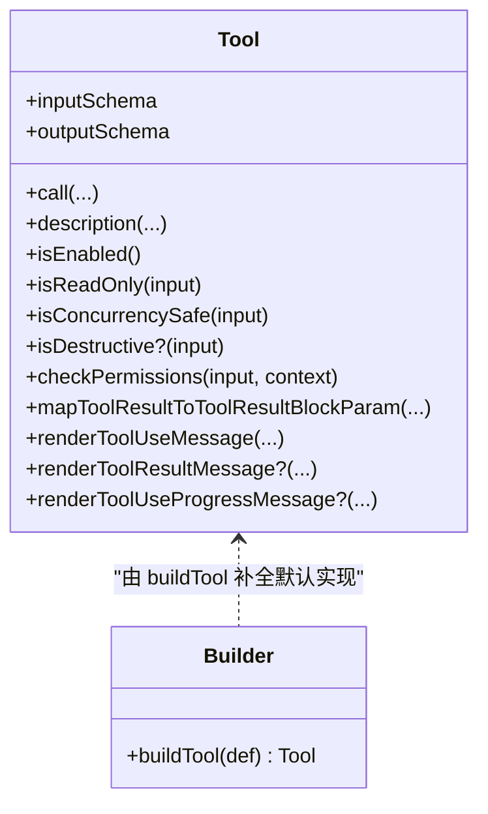
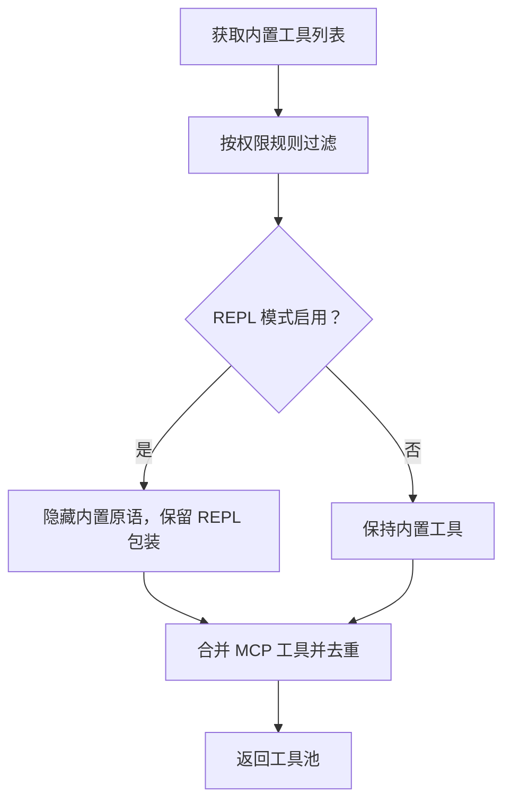
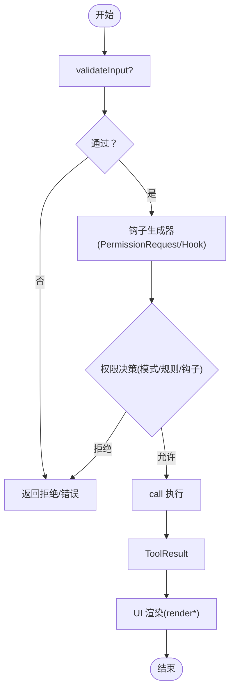
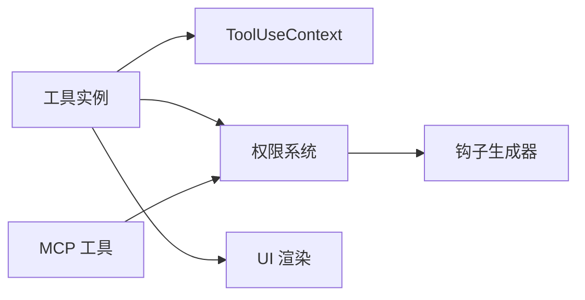

# 自定义工具开发

<cite>
**本文引用的文件**
- [src/Tool.ts](file://src/Tool.ts)
- [src/tools.ts](file://src/tools.ts)
- [src/tools/FileReadTool/FileReadTool.ts](file://src/tools/FileReadTool/FileReadTool.ts)
- [src/utils/permissions/permissions.ts](file://src/utils/permissions/permissions.ts)
- [src/cli/structuredIO.ts](file://src/cli/structuredIO.ts)
- [src/utils/hooks.ts](file://src/utils/hooks.ts)
- [src/utils/settings/permissionValidation.ts](file://src/utils/settings/permissionValidation.ts)
- [src/services/mcp/mcpStringUtils.ts](file://src/services/mcp/mcpStringUtils.ts)
- [src/utils/telemetry/perfettoTracing.ts](file://src/utils/telemetry/perfettoTracing.ts)
- [src/utils/queryProfiler.ts](file://src/utils/queryProfiler.ts)
- [src/utils/plugins/pluginLoader.ts](file://src/utils/plugins/pluginLoader.ts)
- [src/cli/handlers/plugins.ts](file://src/cli/handlers/plugins.ts)
</cite>

## 目录
1. [简介](#简介)
2. [项目结构](#项目结构)
3. [核心组件](#核心组件)
4. [架构总览](#架构总览)
5. [详细组件分析](#详细组件分析)
6. [依赖关系分析](#依赖关系分析)
7. [性能考量](#性能考量)
8. [故障排查指南](#故障排查指南)
9. [结论](#结论)
10. [附录](#附录)

## 简介
本指南面向希望在本项目中开发“自定义工具”的开发者，围绕以下目标展开：
- 使用 buildTool() 构建工具实例，明确必需接口与可选方法重写
- 理解工具生命周期：call() 实现、权限检查、输入校验、输出格式化
- 提供从简单只读工具到复杂交互式工具的完整开发示例路径
- 解释工具注册机制、命名规范与版本管理思路
- 给出测试策略、调试技巧与性能优化建议
- 说明工具打包发布与集成到插件系统的流程

## 项目结构
与工具开发直接相关的核心模块如下：
- 工具类型与构建器：src/Tool.ts
- 工具集合与注册：src/tools.ts
- 典型工具实现参考：src/tools/FileReadTool/FileReadTool.ts
- 权限与钩子：src/utils/permissions/permissions.ts、src/utils/hooks.ts、src/cli/structuredIO.ts
- 命名与规则校验（含 MCP）：src/services/mcp/mcpStringUtils.ts、src/utils/settings/permissionValidation.ts
- 性能追踪与分析：src/utils/telemetry/perfettoTracing.ts、src/utils/queryProfiler.ts
- 插件系统与工具打包：src/utils/plugins/pluginLoader.ts、src/cli/handlers/plugins.ts

**图表来源**
- [src/Tool.ts:1-793](file://src/Tool.ts#L1-L793)
- [src/tools.ts:1-390](file://src/tools.ts#L1-L390)
- [src/tools/FileReadTool/FileReadTool.ts:1-200](file://src/tools/FileReadTool/FileReadTool.ts#L1-L200)
- [src/utils/permissions/permissions.ts:1262-1297](file://src/utils/permissions/permissions.ts#L1262-L1297)
- [src/utils/hooks.ts:2870-2904](file://src/utils/hooks.ts#L2870-L2904)
- [src/cli/structuredIO.ts:808-859](file://src/cli/structuredIO.ts#L808-L859)
- [src/services/mcp/mcpStringUtils.ts:1-67](file://src/services/mcp/mcpStringUtils.ts#L1-L67)
- [src/utils/settings/permissionValidation.ts:111-144](file://src/utils/settings/permissionValidation.ts#L111-L144)
- [src/utils/telemetry/perfettoTracing.ts:696-763](file://src/utils/telemetry/perfettoTracing.ts#L696-L763)
- [src/utils/queryProfiler.ts:205-262](file://src/utils/queryProfiler.ts#L205-L262)
- [src/utils/plugins/pluginLoader.ts:864-977](file://src/utils/plugins/pluginLoader.ts#L864-L977)
- [src/cli/handlers/plugins.ts:73-107](file://src/cli/handlers/plugins.ts#L73-L107)

**章节来源**
- [src/Tool.ts:1-793](file://src/Tool.ts#L1-L793)
- [src/tools.ts:1-390](file://src/tools.ts#L1-L390)

## 核心组件
- 工具类型与构建器
  - Tool 接口定义了工具的完整能力边界，包括 call()、描述、输入/输出模式、权限、并发安全、只读/破坏性标记、用户界面渲染、进度与结果消息映射等。
  - buildTool(def) 将部分定义补全为完整工具对象，并注入默认行为（如 isEnabled/isReadOnly/isDestructive/checkPermissions 等），确保调用方无需处理空缺项。
- 工具集合与注册
  - getAllBaseTools()/getTools()/assembleToolPool()/getMergedTools() 提供工具装配与过滤的统一入口，支持内置工具与 MCP 工具合并、按权限规则过滤、按 REPL 模式隐藏或替换工具等。
- 典型工具实现参考
  - FileReadTool 展示了输入校验、权限检查、错误处理、结果渲染、UI 标签与摘要生成等完整实践。

**章节来源**
- [src/Tool.ts:362-792](file://src/Tool.ts#L362-L792)
- [src/tools.ts:189-390](file://src/tools.ts#L189-L390)
- [src/tools/FileReadTool/FileReadTool.ts:1-200](file://src/tools/FileReadTool/FileReadTool.ts#L1-L200)

## 架构总览
下图展示了工具从“被调用”到“完成”的关键流程，涵盖权限钩子、权限决策、输入校验、工具执行与结果渲染。

**图表来源**
- [src/Tool.ts:379-404](file://src/Tool.ts#L379-L404)
- [src/utils/hooks.ts:2870-2904](file://src/utils/hooks.ts#L2870-L2904)
- [src/utils/permissions/permissions.ts:1262-1297](file://src/utils/permissions/permissions.ts#L1262-L1297)
- [src/cli/structuredIO.ts:808-859](file://src/cli/structuredIO.ts#L808-L859)

## 详细组件分析

### 工具类型与构建器（Tool 与 buildTool）
- 必需接口
  - call(args, context, canUseTool, parentMessage, onProgress?)：工具执行主体，返回 ToolResult
  - description(...)：生成对模型可见的工具描述
  - inputSchema：输入 Zod 模式；可选 inputJSONSchema 用于 MCP 直接 JSON Schema
  - outputSchema：输出 Zod 模式（可选）
  - isEnabled()、isReadOnly(input)、isConcurrencySafe(input)、isDestructive?(input)：行为开关与安全属性
  - checkPermissions(input, context)：工具级权限判定
  - mapToolResultToToolResultBlockParam(content, toolUseID)：将工具输出映射为消息块参数
  - renderToolUseMessage(...)、renderToolResultMessage?(...)、renderToolUseProgressMessage?(...)：UI 渲染
- 可选方法重写
  - validateInput?(input, context)：输入校验
  - userFacingName(input?)、userFacingNameBackgroundColor?：显示名称与主题色
  - toAutoClassifierInput(input)：自动分类器输入
  - getToolUseSummary?(input?)、getActivityDescription?(input?)：摘要与活动描述
  - isSearchOrReadCommand?(input)、isOpenWorld?(input)：UI 折叠与开放世界标识
  - requiresUserInteraction?()、interruptBehavior?()：交互与中断行为
  - renderToolUseQueuedMessage?()、renderToolUseRejectedMessage?(...)、renderToolUseErrorMessage?(...)
- 默认行为
  - buildTool 注入默认值：默认启用、非并发安全、非只读、非破坏性、默认允许权限、空分类器输入、显示名为 name

**图表来源**
- [src/Tool.ts:362-792](file://src/Tool.ts#L362-L792)

**章节来源**
- [src/Tool.ts:362-792](file://src/Tool.ts#L362-L792)

### 工具注册与装配（工具池与 MCP 合并）
- 工具装配流程
  - getAllBaseTools()：聚合所有内置工具（按环境特性条件加载）
  - getTools(permissionContext)：按权限规则过滤内置工具，处理 REPL 模式隐藏与简单模式
  - assembleToolPool(permissionContext, mcpTools)：内置工具与 MCP 工具去重合并，保持内置前缀顺序以稳定缓存键
  - getMergedTools(permissionContext, mcpTools)：直接拼接（不强制去重）
- 命名与 MCP 规则
  - MCP 工具命名通过 mcp__server__tool 前缀，工具名匹配时区分内置与 MCP，避免误伤
  - 规则校验禁止 MCP 工具带括号模式，要求使用通配符形式

**图表来源**
- [src/tools.ts:189-390](file://src/tools.ts#L189-L390)
- [src/services/mcp/mcpStringUtils.ts:19-67](file://src/services/mcp/mcpStringUtils.ts#L19-L67)
- [src/utils/settings/permissionValidation.ts:111-144](file://src/utils/settings/permissionValidation.ts#L111-L144)

**章节来源**
- [src/tools.ts:189-390](file://src/tools.ts#L189-L390)
- [src/services/mcp/mcpStringUtils.ts:19-67](file://src/services/mcp/mcpStringUtils.ts#L19-L67)
- [src/utils/settings/permissionValidation.ts:111-144](file://src/utils/settings/permissionValidation.ts#L111-L144)

### 生命周期与权限检查（call 与权限钩子）
- 生命周期要点
  - 输入校验：validateInput? 在权限决策前进行
  - 权限决策：checkPermissions 与全局权限系统结合，支持模式（bypass/plan）、规则（alwaysAllow/alwaysDeny/alwaysAsk）、钩子（PermissionRequest/PermissionDenied/Elicitation）
  - 工具执行：call 中进行实际操作，支持 onProgress 回调
  - 结果映射与渲染：mapToolResultToToolResultBlockParam 与多种 render* 方法
- 钩子与提示
  - 钩子生成器会产出 updatedInput、permissionRequestResult、retry、elicitationResponse 等，驱动 UI 与权限流

**图表来源**
- [src/Tool.ts:489-503](file://src/Tool.ts#L489-L503)
- [src/utils/hooks.ts:2870-2904](file://src/utils/hooks.ts#L2870-L2904)
- [src/utils/permissions/permissions.ts:1262-1297](file://src/utils/permissions/permissions.ts#L1262-L1297)
- [src/cli/structuredIO.ts:808-859](file://src/cli/structuredIO.ts#L808-L859)

**章节来源**
- [src/Tool.ts:489-503](file://src/Tool.ts#L489-L503)
- [src/utils/hooks.ts:2870-2904](file://src/utils/hooks.ts#L2870-L2904)
- [src/utils/permissions/permissions.ts:1262-1297](file://src/utils/permissions/permissions.ts#L1262-L1297)
- [src/cli/structuredIO.ts:808-859](file://src/cli/structuredIO.ts#L808-L859)

### 输入验证与输出格式化（示例：FileReadTool）
- 输入验证
  - 对路径合法性、设备文件阻断、扩展名限制、范围参数等进行校验
- 权限检查
  - 基于文件系统规则与工具输入匹配，决定是否允许读取
- 输出格式化
  - 支持文本、图像、PDF 等多类型内容，按令牌上限截断与压缩
  - 提供 UI 摘要、标签与错误消息渲染

**章节来源**
- [src/tools/FileReadTool/FileReadTool.ts:1-200](file://src/tools/FileReadTool/FileReadTool.ts#L1-L200)

### 开发示例路径（从只读到交互式）
- 只读工具（最小实现）
  - 定义 name、inputSchema、call，必要时实现 description、userFacingName、mapToolResultToToolResultBlockParam
  - 若涉及文件路径，可实现 getPath? 并在 checkPermissions 中使用文件系统规则
- 复杂交互式工具
  - 实现 validateInput、requiresUserInteraction?、renderToolUseQueuedMessage、renderToolUseRejectedMessage、renderToolUseErrorMessage
  - 使用 onProgress 与 renderToolUseProgressMessage 提供实时反馈
  - 如需 MCP，使用 mcpInfo 与 buildMcpToolName/mcpInfoFromString 进行命名与匹配

**章节来源**
- [src/Tool.ts:362-792](file://src/Tool.ts#L362-L792)
- [src/services/mcp/mcpStringUtils.ts:19-67](file://src/services/mcp/mcpStringUtils.ts#L19-L67)

## 依赖关系分析
- 工具与上下文
  - ToolUseContext 提供命令、调试、模型、工具集、MCP 客户端、会话状态、通知、文件历史、归因等能力，贯穿工具执行全过程
- 工具与权限
  - 权限系统分层：模式（bypass/plan/default）、规则（alwaysAllow/alwaysDeny/alwaysAsk）、钩子（PermissionRequest/PermissionDenied/Elicitation）
  - MCP 工具通过前缀匹配与规则解析，避免与内置工具冲突
- 工具与 UI
  - 多种 render* 方法负责不同场景的消息与进度展示，支持简洁/详细/转录模式

**图表来源**
- [src/Tool.ts:158-300](file://src/Tool.ts#L158-L300)
- [src/utils/permissions/permissions.ts:1262-1297](file://src/utils/permissions/permissions.ts#L1262-L1297)
- [src/utils/hooks.ts:2870-2904](file://src/utils/hooks.ts#L2870-L2904)

**章节来源**
- [src/Tool.ts:158-300](file://src/Tool.ts#L158-L300)
- [src/utils/permissions/permissions.ts:1262-1297](file://src/utils/permissions/permissions.ts#L1262-L1297)
- [src/utils/hooks.ts:2870-2904](file://src/utils/hooks.ts#L2870-L2904)

## 性能考量
- 性能追踪
  - startToolPerfettoSpan/endToolPerfettoSpan 提供工具执行的开始/结束事件，记录成功、错误、结果令牌数与耗时
- 查询阶段分析
  - queryProfiler 提供查询各阶段耗时统计，便于定位工具执行阶段瓶颈
- 通用慢操作告警
  - slowOperations 提供慢操作检测与调用栈定位，辅助识别潜在性能问题

**章节来源**
- [src/utils/telemetry/perfettoTracing.ts:696-763](file://src/utils/telemetry/perfettoTracing.ts#L696-L763)
- [src/utils/queryProfiler.ts:205-262](file://src/utils/queryProfiler.ts#L205-L262)
- [src/utils/slowOperations.ts:46-67](file://src/utils/slowOperations.ts#L46-L67)

## 故障排查指南
- 权限相关
  - 检查权限模式（bypass/plan/default）与规则（alwaysAllow/alwaysDeny/alwaysAsk）
  - 钩子可能返回 updatedInput 或 permissionRequestResult，确认是否正确应用
- 输入校验
  - validateInput 的错误信息与错误码可用于快速定位问题
- MCP 工具
  - 确认命名格式（mcp__server__tool），避免括号模式与非法字符
- 插件与打包
  - 使用插件验证器检查清单与依赖
  - 缓存与清理：临时缓存命名、失败清理与错误日志

**章节来源**
- [src/utils/permissions/permissions.ts:1262-1297](file://src/utils/permissions/permissions.ts#L1262-L1297)
- [src/utils/hooks.ts:2870-2904](file://src/utils/hooks.ts#L2870-L2904)
- [src/utils/settings/permissionValidation.ts:111-144](file://src/utils/settings/permissionValidation.ts#L111-L144)
- [src/cli/handlers/plugins.ts:73-107](file://src/cli/handlers/plugins.ts#L73-L107)
- [src/utils/plugins/pluginLoader.ts:864-977](file://src/utils/plugins/pluginLoader.ts#L864-L977)

## 结论
通过 buildTool() 与 Tool 接口，开发者可以以最小成本实现安全、可观察、可交互的工具。配合权限系统、钩子与 UI 渲染，工具可在不同运行模式（REPL/非交互/插件）下稳定工作。建议在实现中优先完善输入校验、权限检查与 UI 渲染，并利用性能追踪与查询分析工具定位瓶颈。

## 附录

### 命名规范与版本管理
- 命名规范
  - 工具名首字母大写，避免空名
  - MCP 工具使用 mcp__server__tool 前缀，避免括号模式
- 版本管理
  - 本仓库未提供工具独立版本号字段；可通过 Git 提交与插件清单管理版本

**章节来源**
- [src/utils/settings/permissionValidation.ts:132-144](file://src/utils/settings/permissionValidation.ts#L132-L144)
- [src/services/mcp/mcpStringUtils.ts:19-67](file://src/services/mcp/mcpStringUtils.ts#L19-L67)

### 测试策略与调试技巧
- 测试策略
  - 使用 validateInput 与 checkPermissions 的组合覆盖边界条件
  - 利用 VCR 机制对消息与工具进行快照测试，减少环境差异
- 调试技巧
  - 使用 DevBar 慢操作告警定位慢路径
  - 在 REPL/打印模式下结合 structuredIO 的提示请求与拒绝/错误 UI

**章节来源**
- [src/utils/slowOperations.ts:46-67](file://src/utils/slowOperations.ts#L46-L67)
- [src/cli/structuredIO.ts:808-859](file://src/cli/structuredIO.ts#L808-L859)

### 打包发布与插件集成
- 插件缓存与安装
  - 支持本地、NPM、GitHub、URL、子目录等多种来源，失败自动清理
- 清单校验
  - 提供插件清单验证处理器，输出错误与警告列表

**章节来源**
- [src/utils/plugins/pluginLoader.ts:864-977](file://src/utils/plugins/pluginLoader.ts#L864-L977)
- [src/cli/handlers/plugins.ts:73-107](file://src/cli/handlers/plugins.ts#L73-L107)