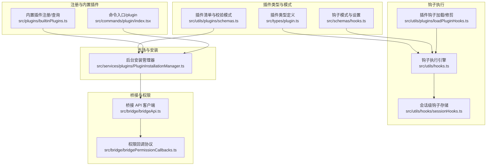
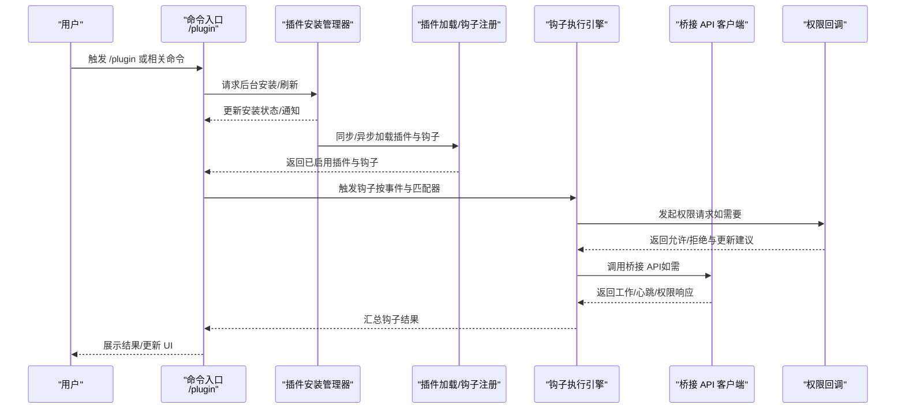
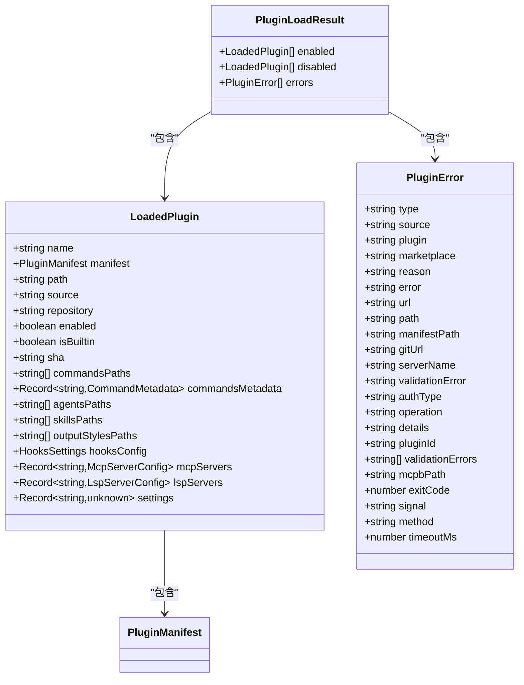
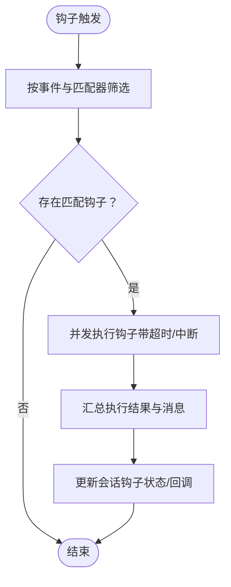
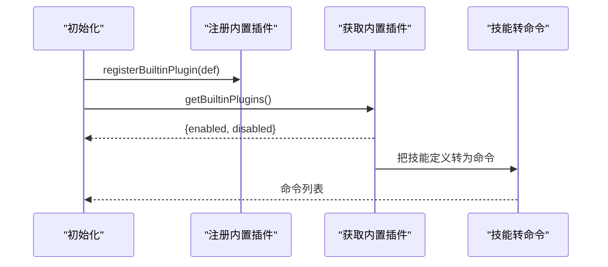
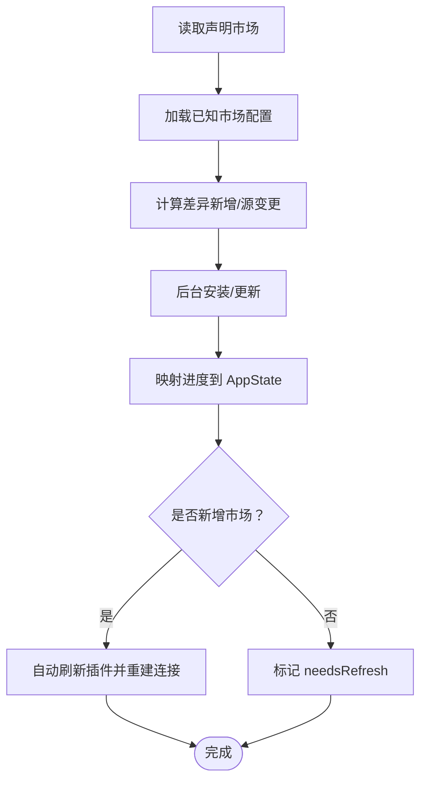
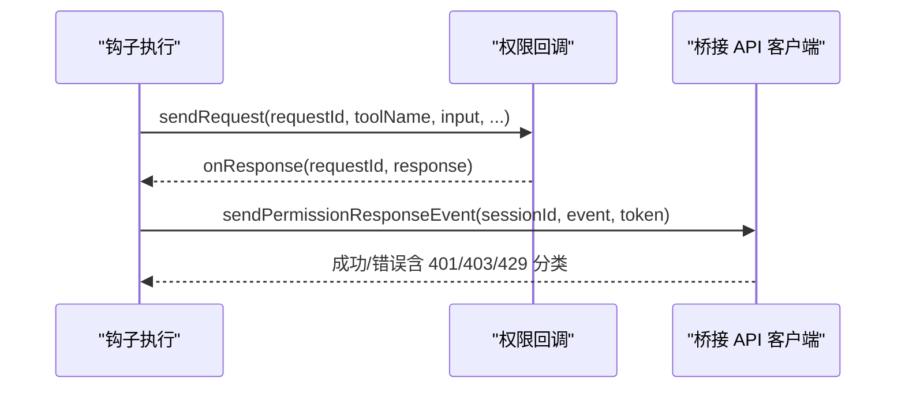
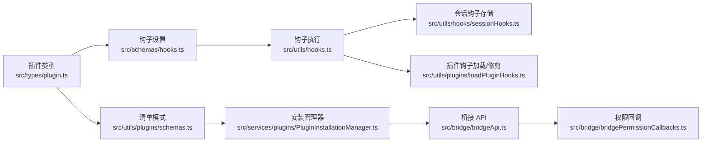

# 插件 API 参考

<cite>
**本文引用的文件**
- [src/types/plugin.ts](file://src/types/plugin.ts)
- [src/schemas/hooks.ts](file://src/schemas/hooks.ts)
- [src/plugins/builtinPlugins.ts](file://src/plugins/builtinPlugins.ts)
- [src/entrypoints/agentSdkTypes.ts](file://src/entrypoints/agentSdkTypes.ts)
- [src/utils/plugins/schemas.ts](file://src/utils/plugins/schemas.ts)
- [src/services/plugins/PluginInstallationManager.ts](file://src/services/plugins/PluginInstallationManager.ts)
- [src/bridge/bridgeApi.ts](file://src/bridge/bridgeApi.ts)
- [src/bridge/bridgePermissionCallbacks.ts](file://src/bridge/bridgePermissionCallbacks.ts)
- [src/commands/plugin/index.tsx](file://src/commands/plugin/index.tsx)
- [src/utils/hooks.ts](file://src/utils/hooks.ts)
- [src/utils/hooks/sessionHooks.ts](file://src/utils/hooks/sessionHooks.ts)
- [src/utils/plugins/loadPluginHooks.ts](file://src/utils/plugins/loadPluginHooks.ts)
</cite>

## 目录
1. [简介](#简介)
2. [项目结构](#项目结构)
3. [核心组件](#核心组件)
4. [架构总览](#架构总览)
5. [详细组件分析](#详细组件分析)
6. [依赖关系分析](#依赖关系分析)
7. [性能考量](#性能考量)
8. [故障排查指南](#故障排查指南)
9. [结论](#结论)
10. [附录](#附录)

## 简介
本参考文档面向 Claude Code 插件开发者与集成者，系统性梳理插件 SDK 接口、插件注册与管理、命令与工具扩展、钩子系统、事件与消息传递、配置与权限、以及错误处理与安全策略。文档以“可读性优先”的方式组织内容，既覆盖类型定义与接口签名，也提供流程图与时序图帮助理解端到端工作流。

## 项目结构
围绕插件能力的关键模块分布如下：
- 类型与模式：插件元数据、加载状态、错误类型；钩子与市场清单的校验模式
- 钩子系统：钩子类型、匹配器、执行引擎与会话级钩子存储
- 插件注册与内置插件：注册 API、内置插件映射与启用逻辑
- 市场与安装：后台安装、市场差异与刷新策略
- 桥接与远程控制：桥接 API 客户端、权限请求/响应回调
- 命令与工具：命令入口、工具定义与 SDK 工具构造器
- 权限与安全：权限回调协议、桥接 API 错误分类与过期检测

**图表来源**
- [src/types/plugin.ts:1-364](file://src/types/plugin.ts#L1-L364)
- [src/schemas/hooks.ts:1-223](file://src/schemas/hooks.ts#L1-L223)
- [src/utils/plugins/schemas.ts:1-800](file://src/utils/plugins/schemas.ts#L1-L800)
- [src/utils/hooks.ts:2142-2192](file://src/utils/hooks.ts#L2142-L2192)
- [src/utils/hooks/sessionHooks.ts:370-430](file://src/utils/hooks/sessionHooks.ts#L370-L430)
- [src/utils/plugins/loadPluginHooks.ts:159-215](file://src/utils/plugins/loadPluginHooks.ts#L159-L215)
- [src/plugins/builtinPlugins.ts:1-160](file://src/plugins/builtinPlugins.ts#L1-L160)
- [src/commands/plugin/index.tsx:1-11](file://src/commands/plugin/index.tsx#L1-L11)
- [src/services/plugins/PluginInstallationManager.ts:1-185](file://src/services/plugins/PluginInstallationManager.ts#L1-L185)
- [src/bridge/bridgeApi.ts:1-540](file://src/bridge/bridgeApi.ts#L1-L540)
- [src/bridge/bridgePermissionCallbacks.ts:1-44](file://src/bridge/bridgePermissionCallbacks.ts#L1-L44)

**章节来源**
- [src/types/plugin.ts:1-364](file://src/types/plugin.ts#L1-L364)
- [src/schemas/hooks.ts:1-223](file://src/schemas/hooks.ts#L1-L223)
- [src/utils/plugins/schemas.ts:1-800](file://src/utils/plugins/schemas.ts#L1-L800)
- [src/utils/hooks.ts:2142-2192](file://src/utils/hooks.ts#L2142-L2192)
- [src/utils/hooks/sessionHooks.ts:370-430](file://src/utils/hooks/sessionHooks.ts#L370-L430)
- [src/utils/plugins/loadPluginHooks.ts:159-215](file://src/utils/plugins/loadPluginHooks.ts#L159-L215)
- [src/plugins/builtinPlugins.ts:1-160](file://src/plugins/builtinPlugins.ts#L1-L160)
- [src/commands/plugin/index.tsx:1-11](file://src/commands/plugin/index.tsx#L1-L11)
- [src/services/plugins/PluginInstallationManager.ts:1-185](file://src/services/plugins/PluginInstallationManager.ts#L1-L185)
- [src/bridge/bridgeApi.ts:1-540](file://src/bridge/bridgeApi.ts#L1-L540)
- [src/bridge/bridgePermissionCallbacks.ts:1-44](file://src/bridge/bridgePermissionCallbacks.ts#L1-L44)

## 核心组件
- 插件类型与生命周期
  - 插件清单、加载结果、错误类型与消息映射
  - 内置插件注册与启用状态解析
- 钩子系统
  - 钩子类型（命令、提示词、HTTP、代理）
  - 匹配器与设置模式
  - 执行引擎与会话级钩子存储
- 市场与安装
  - 市场名称与来源校验
  - 后台安装与刷新策略
- 桥接与权限
  - 桥接 API 客户端与错误分类
  - 权限请求/响应回调协议

**章节来源**
- [src/types/plugin.ts:44-289](file://src/types/plugin.ts#L44-L289)
- [src/plugins/builtinPlugins.ts:28-102](file://src/plugins/builtinPlugins.ts#L28-L102)
- [src/schemas/hooks.ts:176-223](file://src/schemas/hooks.ts#L176-L223)
- [src/utils/hooks.ts:2142-2192](file://src/utils/hooks.ts#L2142-L2192)
- [src/utils/plugins/schemas.ts:216-246](file://src/utils/plugins/schemas.ts#L216-L246)
- [src/services/plugins/PluginInstallationManager.ts:60-185](file://src/services/plugins/PluginInstallationManager.ts#L60-L185)
- [src/bridge/bridgeApi.ts:141-451](file://src/bridge/bridgeApi.ts#L141-L451)
- [src/bridge/bridgePermissionCallbacks.ts:10-44](file://src/bridge/bridgePermissionCallbacks.ts#L10-L44)

## 架构总览
下图展示从用户命令到插件加载、钩子执行与桥接通信的端到端流程。

**图表来源**
- [src/commands/plugin/index.tsx:1-11](file://src/commands/plugin/index.tsx#L1-L11)
- [src/services/plugins/PluginInstallationManager.ts:60-185](file://src/services/plugins/PluginInstallationManager.ts#L60-L185)
- [src/utils/plugins/loadPluginHooks.ts:159-215](file://src/utils/plugins/loadPluginHooks.ts#L159-L215)
- [src/utils/hooks.ts:2142-2192](file://src/utils/hooks.ts#L2142-L2192)
- [src/bridge/bridgeApi.ts:141-451](file://src/bridge/bridgeApi.ts#L141-L451)
- [src/bridge/bridgePermissionCallbacks.ts:10-44](file://src/bridge/bridgePermissionCallbacks.ts#L10-L44)

## 详细组件分析

### 插件类型与错误模型
- 关键类型
  - 插件清单、加载状态、内置插件定义、插件配置仓库
  - 加载结果与错误类型（路径不存在、网络错误、清单解析/校验失败、市场受限、依赖未满足等）
- 错误消息映射
  - 统一的错误消息生成函数，便于日志与 UI 显示

**图表来源**
- [src/types/plugin.ts:48-70](file://src/types/plugin.ts#L48-L70)
- [src/types/plugin.ts:101-289](file://src/types/plugin.ts#L101-L289)
- [src/types/plugin.ts:285-289](file://src/types/plugin.ts#L285-L289)

**章节来源**
- [src/types/plugin.ts:44-289](file://src/types/plugin.ts#L44-L289)

### 钩子系统（类型、匹配器与执行）
- 钩子类型
  - 命令钩子：在指定 Shell 中执行命令，支持超时、一次性、异步与唤醒
  - 提示词钩子：通过 LLM 评估输入，支持超时与模型选择
  - HTTP 钩子：向远端发送 JSON，支持环境变量插值与白名单
  - 代理钩子：以代理方式验证输入，支持超时与模型选择
- 匹配器与设置
  - 每个事件可绑定多个匹配器，匹配器包含字符串模式与钩子列表
- 执行引擎
  - 并行执行匹配钩子，支持超时与中断信号
  - 会话级钩子存储与回调查找
  - 插件钩子加载/修剪，支持热重载与禁用插件后立即停止

**图表来源**
- [src/schemas/hooks.ts:176-223](file://src/schemas/hooks.ts#L176-L223)
- [src/utils/hooks.ts:2142-2192](file://src/utils/hooks.ts#L2142-L2192)
- [src/utils/hooks/sessionHooks.ts:370-430](file://src/utils/hooks/sessionHooks.ts#L370-L430)
- [src/utils/plugins/loadPluginHooks.ts:159-215](file://src/utils/plugins/loadPluginHooks.ts#L159-L215)

**章节来源**
- [src/schemas/hooks.ts:32-163](file://src/schemas/hooks.ts#L32-L163)
- [src/schemas/hooks.ts:176-223](file://src/schemas/hooks.ts#L176-L223)
- [src/utils/hooks.ts:2142-2192](file://src/utils/hooks.ts#L2142-L2192)
- [src/utils/hooks/sessionHooks.ts:370-430](file://src/utils/hooks/sessionHooks.ts#L370-L430)
- [src/utils/plugins/loadPluginHooks.ts:159-215](file://src/utils/plugins/loadPluginHooks.ts#L159-L215)

### 插件注册与内置插件
- 注册 API
  - 注册内置插件定义，支持可用性判断与默认启用状态
- 内置插件解析
  - 根据用户设置与默认值生成已启用/禁用插件列表
  - 将技能定义转换为命令对象，供 UI 与调用使用

**图表来源**
- [src/plugins/builtinPlugins.ts:28-102](file://src/plugins/builtinPlugins.ts#L28-L102)
- [src/plugins/builtinPlugins.ts:132-160](file://src/plugins/builtinPlugins.ts#L132-L160)

**章节来源**
- [src/plugins/builtinPlugins.ts:28-102](file://src/plugins/builtinPlugins.ts#L28-L102)
- [src/plugins/builtinPlugins.ts:132-160](file://src/plugins/builtinPlugins.ts#L132-L160)

### 市场与安装（后台安装、刷新与错误处理）
- 市场名称与来源校验
  - 保留名列表、同形攻击防护、来源组织校验
- 后台安装流程
  - 计算声明与已物化市场的差异，批量安装/更新
  - 进度映射到应用状态，新装后自动刷新插件，更新后提示手动刷新
  - 失败清理缓存并标记需要刷新

**图表来源**
- [src/services/plugins/PluginInstallationManager.ts:60-185](file://src/services/plugins/PluginInstallationManager.ts#L60-L185)
- [src/utils/plugins/schemas.ts:216-246](file://src/utils/plugins/schemas.ts#L216-L246)

**章节来源**
- [src/services/plugins/PluginInstallationManager.ts:60-185](file://src/services/plugins/PluginInstallationManager.ts#L60-L185)
- [src/utils/plugins/schemas.ts:216-246](file://src/utils/plugins/schemas.ts#L216-L246)

### 桥接 API 与权限回调
- 桥接 API 客户端
  - 支持注册环境、轮询工作、确认/停止工作、注销环境、归档会话、重连会话、心跳、发送权限响应事件
  - 统一的 OAuth 重试与错误分类（401/403/404/410/429 等），区分致命错误与可抑制 403
- 权限回调协议
  - 请求/响应结构与类型守卫，支持取消控制请求

**图表来源**
- [src/bridge/bridgeApi.ts:141-451](file://src/bridge/bridgeApi.ts#L141-L451)
- [src/bridge/bridgePermissionCallbacks.ts:10-44](file://src/bridge/bridgePermissionCallbacks.ts#L10-L44)

**章节来源**
- [src/bridge/bridgeApi.ts:141-451](file://src/bridge/bridgeApi.ts#L141-L451)
- [src/bridge/bridgePermissionCallbacks.ts:10-44](file://src/bridge/bridgePermissionCallbacks.ts#L10-L44)

### 命令与工具 API（SDK）
- SDK 入口类型导出与运行时类型
- 工具定义与 MCP 服务器创建
- 会话管理（创建/恢复/单次提示）、会话列表与信息读取、重命名/打标签、分叉会话
- 定时任务观察与错过任务通知构建
- 远程控制桥接（内部）

注意：SDK 方法当前为占位实现，实际行为由桥接层或宿主环境提供。

**章节来源**
- [src/entrypoints/agentSdkTypes.ts:73-123](file://src/entrypoints/agentSdkTypes.ts#L73-L123)
- [src/entrypoints/agentSdkTypes.ts:129-146](file://src/entrypoints/agentSdkTypes.ts#L129-L146)
- [src/entrypoints/agentSdkTypes.ts:178-273](file://src/entrypoints/agentSdkTypes.ts#L178-L273)
- [src/entrypoints/agentSdkTypes.ts:350-356](file://src/entrypoints/agentSdkTypes.ts#L350-L356)
- [src/entrypoints/agentSdkTypes.ts:439-443](file://src/entrypoints/agentSdkTypes.ts#L439-L443)

### 插件清单与配置模式
- 清单元数据（名称、版本、描述、作者、主页、仓库、许可证、关键词、依赖）
- 钩子配置（内联或外部文件、对象映射格式）
- 命令元数据（文件路径或内联内容二选一）
- MCP/LSP 服务器配置（路径、MCPB 文件、内联定义）
- 用户配置选项（类型、标题、描述、必填、默认、敏感、数值范围等）
- 通道声明（与 MCP 服务器绑定，提示用户配置）

**章节来源**
- [src/utils/plugins/schemas.ts:274-320](file://src/utils/plugins/schemas.ts#L274-L320)
- [src/utils/plugins/schemas.ts:328-340](file://src/utils/plugins/schemas.ts#L328-L340)
- [src/utils/plugins/schemas.ts:385-417](file://src/utils/plugins/schemas.ts#L385-L417)
- [src/utils/plugins/schemas.ts:537-572](file://src/utils/plugins/schemas.ts#L537-L572)
- [src/utils/plugins/schemas.ts:708-788](file://src/utils/plugins/schemas.ts#L708-L788)
- [src/utils/plugins/schemas.ts:587-654](file://src/utils/plugins/schemas.ts#L587-L654)
- [src/utils/plugins/schemas.ts:670-703](file://src/utils/plugins/schemas.ts#L670-L703)

## 依赖关系分析
- 类型与模式
  - 插件类型依赖钩子设置模式与 MCP/LSP 配置模式
- 钩子系统
  - 钩子执行依赖会话钩子存储与插件钩子加载/修剪
- 市场与安装
  - 安装管理器依赖市场差异与缓存清理，受清单模式约束
- 桥接与权限
  - 权限回调与桥接 API 客户端共同构成权限与消息传递闭环

**图表来源**
- [src/types/plugin.ts:1-364](file://src/types/plugin.ts#L1-L364)
- [src/schemas/hooks.ts:1-223](file://src/schemas/hooks.ts#L1-L223)
- [src/utils/plugins/schemas.ts:1-800](file://src/utils/plugins/schemas.ts#L1-L800)
- [src/utils/hooks.ts:2142-2192](file://src/utils/hooks.ts#L2142-L2192)
- [src/utils/hooks/sessionHooks.ts:370-430](file://src/utils/hooks/sessionHooks.ts#L370-L430)
- [src/utils/plugins/loadPluginHooks.ts:159-215](file://src/utils/plugins/loadPluginHooks.ts#L159-L215)
- [src/services/plugins/PluginInstallationManager.ts:1-185](file://src/services/plugins/PluginInstallationManager.ts#L1-185)
- [src/bridge/bridgeApi.ts:1-540](file://src/bridge/bridgeApi.ts#L1-L540)
- [src/bridge/bridgePermissionCallbacks.ts:1-44](file://src/bridge/bridgePermissionCallbacks.ts#L1-L44)

**章节来源**
- [src/types/plugin.ts:1-364](file://src/types/plugin.ts#L1-L364)
- [src/schemas/hooks.ts:1-223](file://src/schemas/hooks.ts#L1-L223)
- [src/utils/plugins/schemas.ts:1-800](file://src/utils/plugins/schemas.ts#L1-L800)
- [src/utils/hooks.ts:2142-2192](file://src/utils/hooks.ts#L2142-L2192)
- [src/utils/hooks/sessionHooks.ts:370-430](file://src/utils/hooks/sessionHooks.ts#L370-L430)
- [src/utils/plugins/loadPluginHooks.ts:159-215](file://src/utils/plugins/loadPluginHooks.ts#L159-L215)
- [src/services/plugins/PluginInstallationManager.ts:1-185](file://src/services/plugins/PluginInstallationManager.ts#L1-L185)
- [src/bridge/bridgeApi.ts:1-540](file://src/bridge/bridgeApi.ts#L1-L540)
- [src/bridge/bridgePermissionCallbacks.ts:1-44](file://src/bridge/bridgePermissionCallbacks.ts#L1-L44)

## 性能考量
- 钩子执行采用并发模式，结合超时与中断信号，避免阻塞主流程
- 插件后台安装与刷新尽量异步进行，减少启动时延
- 缓存与增量更新策略降低重复加载成本

[本节为通用指导，无需特定文件来源]

## 故障排查指南
- 常见错误类型与定位
  - 路径不存在、网络错误、清单解析/校验失败、市场受限、依赖未满足、LSP/MCP 启动/请求失败
- 错误消息映射
  - 使用统一的消息生成函数，便于日志与 UI 提示
- 桥接 API 错误分类
  - 401/403/404/410/429 分类处理，区分致命错误与可抑制 403
  - 会话/环境过期检测与提示

**章节来源**
- [src/types/plugin.ts:295-363](file://src/types/plugin.ts#L295-L363)
- [src/bridge/bridgeApi.ts:454-508](file://src/bridge/bridgeApi.ts#L454-L508)

## 结论
本文档从类型定义、钩子系统、市场与安装、桥接与权限等维度，全面呈现了 Claude Code 插件 API 的设计与实现要点。建议在开发插件时：
- 严格遵循清单与模式校验，确保插件可被正确加载与管理
- 合理设计钩子匹配器与超时策略，提升交互体验
- 利用后台安装与刷新机制，平滑处理插件变更
- 重视权限与安全，遵循桥接 API 的错误分类与过期检测

[本节为总结性内容，无需特定文件来源]

## 附录

### A. 插件注册 API（内置插件）
- 注册内置插件定义
  - 函数签名与用途参见：[registerBuiltinPlugin:28-32](file://src/plugins/builtinPlugins.ts#L28-L32)
- 获取内置插件定义
  - 函数签名与用途参见：[getBuiltinPluginDefinition:46-49](file://src/plugins/builtinPlugins.ts#L46-L49)
- 获取内置插件集合（按启用状态拆分）
  - 函数签名与用途参见：[getBuiltinPlugins:57-102](file://src/plugins/builtinPlugins.ts#L57-L102)
- 获取内置插件技能对应的命令
  - 函数签名与用途参见：[getBuiltinPluginSkillCommands:108-121](file://src/plugins/builtinPlugins.ts#L108-L121)

**章节来源**
- [src/plugins/builtinPlugins.ts:28-121](file://src/plugins/builtinPlugins.ts#L28-L121)

### B. 市场与安装 API
- 后台安装与刷新
  - 函数签名与用途参见：[performBackgroundPluginInstallations:60-185](file://src/services/plugins/PluginInstallationManager.ts#L60-L185)
- 市场名称与来源校验
  - 函数签名与用途参见：
    - [isBlockedOfficialName:87-101](file://src/utils/plugins/schemas.ts#L87-L101)
    - [validateOfficialNameSource:119-157](file://src/utils/plugins/schemas.ts#L119-L157)

**章节来源**
- [src/services/plugins/PluginInstallationManager.ts:60-185](file://src/services/plugins/PluginInstallationManager.ts#L60-L185)
- [src/utils/plugins/schemas.ts:87-157](file://src/utils/plugins/schemas.ts#L87-L157)

### C. 钩子 API
- 钩子命令与匹配器模式
  - 类型与用途参见：
    - [HookCommandSchema:176-189](file://src/schemas/hooks.ts#L176-L189)
    - [HookMatcherSchema:194-204](file://src/schemas/hooks.ts#L194-L204)
- 钩子执行与会话钩子存储
  - 执行入口参见：[钩子执行引擎:2142-2192](file://src/utils/hooks.ts#L2142-L2192)
  - 会话钩子存储参见：[会话钩子存储:370-430](file://src/utils/hooks/sessionHooks.ts#L370-L430)
  - 插件钩子加载/修剪参见：[插件钩子加载/修剪:159-215](file://src/utils/plugins/loadPluginHooks.ts#L159-L215)

**章节来源**
- [src/schemas/hooks.ts:176-204](file://src/schemas/hooks.ts#L176-L204)
- [src/utils/hooks.ts:2142-2192](file://src/utils/hooks.ts#L2142-L2192)
- [src/utils/hooks/sessionHooks.ts:370-430](file://src/utils/hooks/sessionHooks.ts#L370-L430)
- [src/utils/plugins/loadPluginHooks.ts:159-215](file://src/utils/plugins/loadPluginHooks.ts#L159-L215)

### D. 桥接与权限 API
- 桥接 API 客户端
  - 方法与用途参见：
    - [registerBridgeEnvironment:142-197](file://src/bridge/bridgeApi.ts#L142-L197)
    - [pollForWork:199-247](file://src/bridge/bridgeApi.ts#L199-L247)
    - [acknowledgeWork:249-271](file://src/bridge/bridgeApi.ts#L249-L271)
    - [stopWork:273-299](file://src/bridge/bridgeApi.ts#L273-L299)
    - [deregisterEnvironment:301-323](file://src/bridge/bridgeApi.ts#L301-L323)
    - [archiveSession:325-356](file://src/bridge/bridgeApi.ts#L325-L356)
    - [reconnectSession:358-385](file://src/bridge/bridgeApi.ts#L358-L385)
    - [heartbeatWork:387-417](file://src/bridge/bridgeApi.ts#L387-L417)
    - [sendPermissionResponseEvent:419-450](file://src/bridge/bridgeApi.ts#L419-L450)
- 权限回调协议
  - 类型与用途参见：
    - [BridgePermissionCallbacks:10-27](file://src/bridge/bridgePermissionCallbacks.ts#L10-L27)
    - [isBridgePermissionResponse:32-40](file://src/bridge/bridgePermissionCallbacks.ts#L32-L40)

**章节来源**
- [src/bridge/bridgeApi.ts:141-451](file://src/bridge/bridgeApi.ts#L141-L451)
- [src/bridge/bridgePermissionCallbacks.ts:10-40](file://src/bridge/bridgePermissionCallbacks.ts#L10-L40)

### E. 命令与工具 API（SDK）
- 工具定义与 MCP 服务器创建
  - 函数签名与用途参见：
    - [tool:73-88](file://src/entrypoints/agentSdkTypes.ts#L73-L88)
    - [createSdkMcpServer:103-107](file://src/entrypoints/agentSdkTypes.ts#L103-L107)
- 会话管理
  - 函数签名与用途参见：
    - [unstable_v2_createSession:129-133](file://src/entrypoints/agentSdkTypes.ts#L129-L133)
    - [unstable_v2_resumeSession:140-145](file://src/entrypoints/agentSdkTypes.ts#L140-L145)
    - [unstable_v2_prompt:160-165](file://src/entrypoints/agentSdkTypes.ts#L160-L165)
    - [getSessionMessages:178-183](file://src/entrypoints/agentSdkTypes.ts#L178-L183)
    - [listSessions:204-208](file://src/entrypoints/agentSdkTypes.ts#L204-L208)
    - [getSessionInfo:219-224](file://src/entrypoints/agentSdkTypes.ts#L219-L224)
    - [renameSession:232-238](file://src/entrypoints/agentSdkTypes.ts#L232-L238)
    - [tagSession:246-252](file://src/entrypoints/agentSdkTypes.ts#L246-L252)
    - [forkSession:268-273](file://src/entrypoints/agentSdkTypes.ts#L268-L273)
- 定时任务与远程控制（内部）
  - 函数签名与用途参见：
    - [watchScheduledTasks:350-356](file://src/entrypoints/agentSdkTypes.ts#L350-L356)
    - [buildMissedTaskNotification:363-365](file://src/entrypoints/agentSdkTypes.ts#L363-L365)
    - [connectRemoteControl:439-443](file://src/entrypoints/agentSdkTypes.ts#L439-L443)

**章节来源**
- [src/entrypoints/agentSdkTypes.ts:73-107](file://src/entrypoints/agentSdkTypes.ts#L73-L107)
- [src/entrypoints/agentSdkTypes.ts#L129-165:129-165](file://src/entrypoints/agentSdkTypes.ts#L129-L165)
- [src/entrypoints/agentSdkTypes.ts#L178-273:178-273](file://src/entrypoints/agentSdkTypes.ts#L178-L273)
- [src/entrypoints/agentSdkTypes.ts#L350-365:350-365](file://src/entrypoints/agentSdkTypes.ts#L350-L365)
- [src/entrypoints/agentSdkTypes.ts#L439-443:439-443](file://src/entrypoints/agentSdkTypes.ts#L439-L443)

### F. 插件配置 API
- 清单与模式
  - 元数据、钩子、命令、MCP/LSP、用户配置、通道声明等模式参见：
    - [PluginManifestMetadataSchema:274-320](file://src/utils/plugins/schemas.ts#L274-L320)
    - [PluginHooksSchema:328-340](file://src/utils/plugins/schemas.ts#L328-L340)
    - [CommandMetadataSchema:385-417](file://src/utils/plugins/schemas.ts#L385-L417)
    - [PluginManifestMcpServerSchema:543-572](file://src/utils/plugins/schemas.ts#L543-L572)
    - [LspServerConfigSchema:708-788](file://src/utils/plugins/schemas.ts#L708-L788)
    - [PluginManifestUserConfigSchema:632-654](file://src/utils/plugins/schemas.ts#L632-L654)
    - [PluginManifestChannelsSchema:670-703](file://src/utils/plugins/schemas.ts#L670-L703)
- 市场名称与来源校验
  - 参见：[isBlockedOfficialName:87-101](file://src/utils/plugins/schemas.ts#L87-L101)、[validateOfficialNameSource:119-157](file://src/utils/plugins/schemas.ts#L119-L157)

**章节来源**
- [src/utils/plugins/schemas.ts:274-320](file://src/utils/plugins/schemas.ts#L274-L320)
- [src/utils/plugins/schemas.ts:328-340](file://src/utils/plugins/schemas.ts#L328-L340)
- [src/utils/plugins/schemas.ts:385-417](file://src/utils/plugins/schemas.ts#L385-L417)
- [src/utils/plugins/schemas.ts:543-572](file://src/utils/plugins/schemas.ts#L543-L572)
- [src/utils/plugins/schemas.ts:708-788](file://src/utils/plugins/schemas.ts#L708-L788)
- [src/utils/plugins/schemas.ts:632-654](file://src/utils/plugins/schemas.ts#L632-L654)
- [src/utils/plugins/schemas.ts:670-703](file://src/utils/plugins/schemas.ts#L670-L703)
- [src/utils/plugins/schemas.ts:87-157](file://src/utils/plugins/schemas.ts#L87-L157)

### G. 权限 API、安全检查与访问控制
- 权限回调协议
  - 参见：[BridgePermissionCallbacks:10-27](file://src/bridge/bridgePermissionCallbacks.ts#L10-L27)
- 桥接 API 错误分类与过期检测
  - 参见：
    - [BridgeFatalError:56-66](file://src/bridge/bridgeApi.ts#L56-L66)
    - [isExpiredErrorType:502-508](file://src/bridge/bridgeApi.ts#L502-L508)
    - [isSuppressible403:516-524](file://src/bridge/bridgeApi.ts#L516-L524)
- 市场来源校验与保留名策略
  - 参见：[validateOfficialNameSource:119-157](file://src/utils/plugins/schemas.ts#L119-L157)

**章节来源**
- [src/bridge/bridgePermissionCallbacks.ts:10-27](file://src/bridge/bridgePermissionCallbacks.ts#L10-L27)
- [src/bridge/bridgeApi.ts:56-66](file://src/bridge/bridgeApi.ts#L56-L66)
- [src/bridge/bridgeApi.ts:502-524](file://src/bridge/bridgeApi.ts#L502-L524)
- [src/utils/plugins/schemas.ts:119-157](file://src/utils/plugins/schemas.ts#L119-L157)