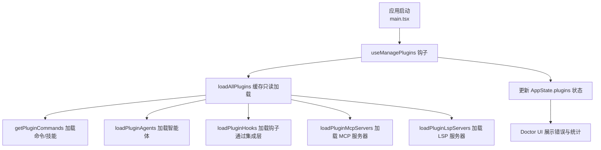
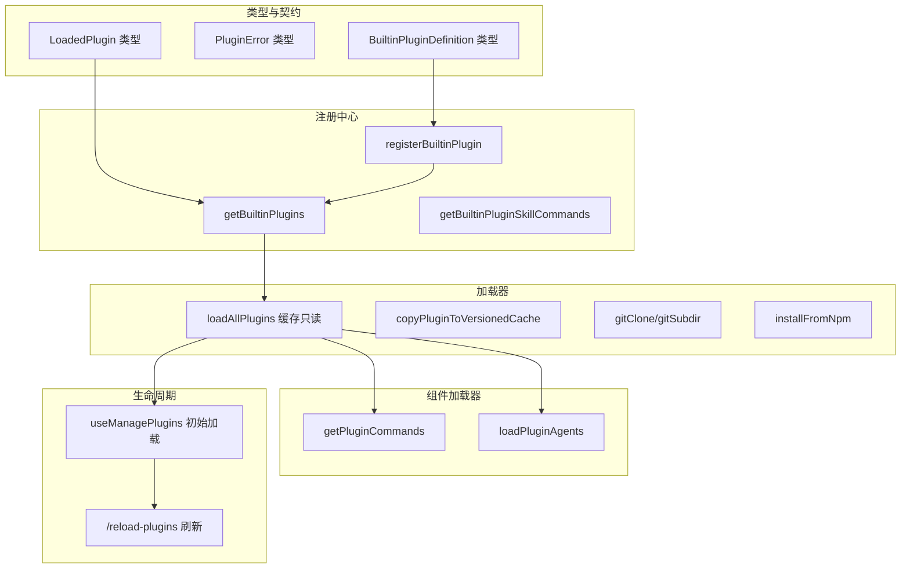
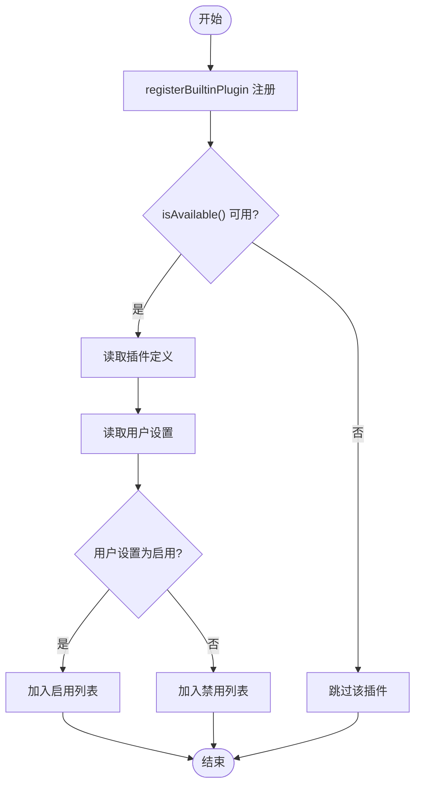
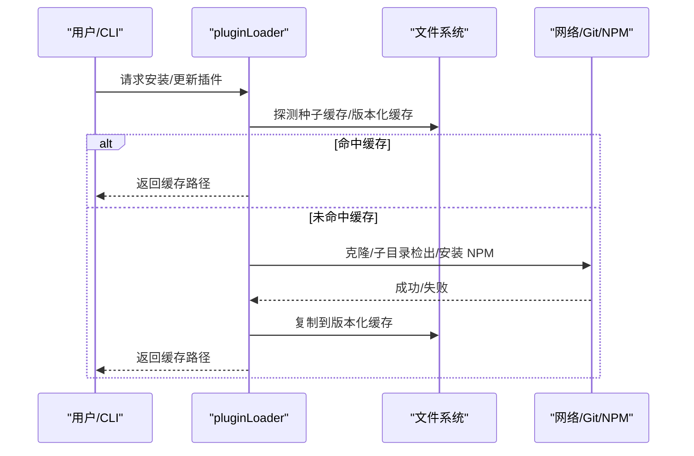
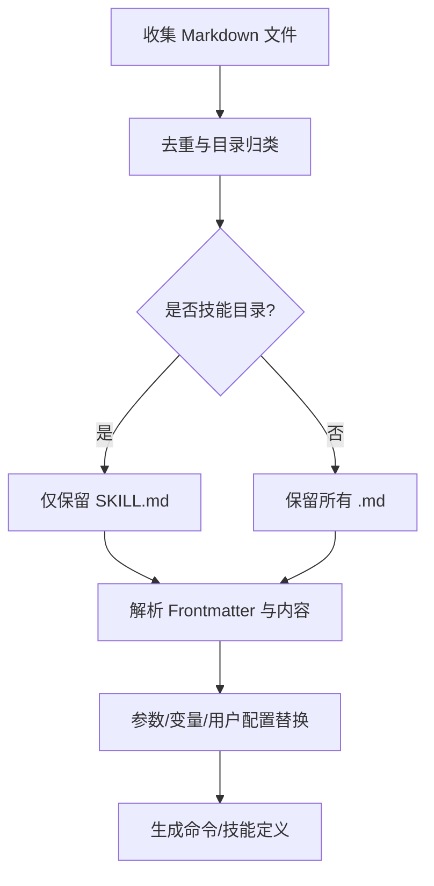
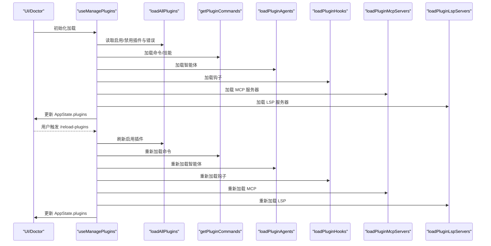
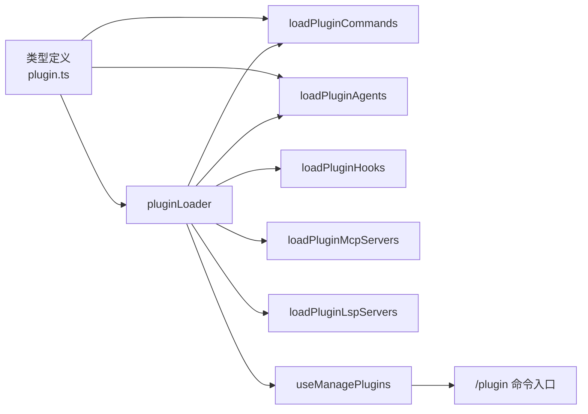

# 插件 API

<cite>
**本文引用的文件**
- [builtinPlugins.ts](file://src/plugins/builtinPlugins.ts)
- [plugin.ts（类型）](file://src/types/plugin.ts)
- [useManagePlugins.ts](file://src/hooks/useManagePlugins.ts)
- [pluginLoader.ts](file://src/utils/plugins/pluginLoader.ts)
- [loadPluginCommands.ts](file://src/utils/plugins/loadPluginCommands.ts)
- [loadPluginAgents.ts](file://src/utils/plugins/loadPluginAgents.ts)
- [index.tsx（命令入口）](file://src/commands/plugin/index.tsx)
</cite>

## 目录
1. [简介](#简介)
2. [项目结构](#项目结构)
3. [核心组件](#核心组件)
4. [架构总览](#架构总览)
5. [详细组件分析](#详细组件分析)
6. [依赖关系分析](#依赖关系分析)
7. [性能考量](#性能考量)
8. [故障排查指南](#故障排查指南)
9. [结论](#结论)
10. [附录：开发与发布最佳实践](#附录开发与发布最佳实践)

## 简介
本文件面向 Claude Code 插件开发者与维护者，系统化阐述插件 API 的架构设计、加载机制与生命周期管理；明确插件接口规范、SDK 接口定义、事件系统与钩子机制；给出从简单工具插件到复杂功能插件的完整实现路径；覆盖权限管理、安全沙箱、资源限制与性能监控；并提供插件市场、安装管理、版本兼容性与自动更新机制的说明，以及调试、测试与部署的最佳实践。

## 项目结构
围绕插件系统的关键目录与文件如下：
- 类型与契约：src/types/plugin.ts 定义插件清单、已加载插件、错误类型与加载结果等核心类型。
- 内置插件注册中心：src/plugins/builtinPlugins.ts 提供内置插件注册、启用/禁用状态解析与技能命令转换。
- 插件加载器：src/utils/plugins/pluginLoader.ts 负责发现、拉取、缓存、校验与版本化安装插件。
- 插件组件加载：src/utils/plugins/loadPluginCommands.ts、src/utils/plugins/loadPluginAgents.ts 分别负责命令/技能与智能体的解析与注入。
- 生命周期与状态同步：src/hooks/useManagePlugins.ts 在应用启动时加载插件，并在 UI 中暴露“重载”能力。
- 命令入口：src/commands/plugin/index.tsx 将“/plugin”命令与 UI 模块绑定，作为插件管理的统一入口。

图表来源
- [useManagePlugins.ts:1-305](file://src/hooks/useManagePlugins.ts#L1-L305)
- [pluginLoader.ts:1-800](file://src/utils/plugins/pluginLoader.ts#L1-L800)
- [loadPluginCommands.ts:1-800](file://src/utils/plugins/loadPluginCommands.ts#L1-L800)
- [loadPluginAgents.ts:1-349](file://src/utils/plugins/loadPluginAgents.ts#L1-L349)

章节来源
- [builtinPlugins.ts:1-160](file://src/plugins/builtinPlugins.ts#L1-L160)
- [plugin.ts（类型）:1-364](file://src/types/plugin.ts#L1-L364)
- [useManagePlugins.ts:1-305](file://src/hooks/useManagePlugins.ts#L1-L305)
- [pluginLoader.ts:1-800](file://src/utils/plugins/pluginLoader.ts#L1-L800)
- [loadPluginCommands.ts:1-800](file://src/utils/plugins/loadPluginCommands.ts#L1-L800)
- [loadPluginAgents.ts:1-349](file://src/utils/plugins/loadPluginAgents.ts#L1-L349)
- [index.tsx（命令入口）:1-11](file://src/commands/plugin/index.tsx#L1-L11)

## 核心组件
- 插件清单与已加载插件
  - 插件清单（Manifest）：包含名称、描述、版本等元数据。
  - 已加载插件（LoadedPlugin）：包含清单、源标识、仓库标识、启用状态、组件路径、钩子配置、MCP/LSP 服务器配置等。
- 错误模型（PluginError）
  - 采用判别联合类型，覆盖路径不存在、网络错误、清单解析/校验失败、市场不可用、MCP/LSP 配置无效或启动失败、策略阻断、依赖未满足、缓存缺失等场景。
- 内置插件注册中心
  - 注册内置插件、判断是否内置、按用户设置返回启用/禁用列表，并将内置技能转换为命令对象。
- 插件加载器
  - 支持从市场（含种子缓存）、本地目录、Git/GitHub 子目录、NPM 包等多种来源安装与缓存；支持版本化缓存、ZIP 缓存、浅克隆与稀疏检出以优化性能。
- 组件加载器
  - 命令/技能：基于 Markdown 文件与 Frontmatter 解析，支持参数替换、变量替换、会话 ID 注入、脚本执行等。
  - 智能体：解析系统提示词、工具集、记忆范围、隔离模式、最大轮次、努力等级等元信息。
- 生命周期与状态同步
  - 首次加载：全量加载插件、检测下架并卸载、标记违规插件、加载命令/智能体/钩子/MCP/LSP 并更新 AppState。
  - 后续刷新：通过“/reload-plugins”触发刷新，确保命令、代理、钩子、MCP/LSP 一致生效。

章节来源
- [plugin.ts（类型）:48-70](file://src/types/plugin.ts#L48-L70)
- [plugin.ts（类型）:101-284](file://src/types/plugin.ts#L101-L284)
- [builtinPlugins.ts:18-35](file://src/plugins/builtinPlugins.ts#L18-L35)
- [builtinPlugins.ts:57-102](file://src/plugins/builtinPlugins.ts#L57-L102)
- [pluginLoader.ts:10-33](file://src/utils/plugins/pluginLoader.ts#L10-L33)
- [loadPluginCommands.ts:218-412](file://src/utils/plugins/loadPluginCommands.ts#L218-L412)
- [loadPluginAgents.ts:65-229](file://src/utils/plugins/loadPluginAgents.ts#L65-L229)
- [useManagePlugins.ts:51-180](file://src/hooks/useManagePlugins.ts#L51-L180)

## 架构总览
插件系统由“类型契约—注册中心—加载器—组件加载器—生命周期钩子—命令入口”构成，形成清晰的分层与职责边界。

图表来源
- [plugin.ts（类型）:48-70](file://src/types/plugin.ts#L48-L70)
- [plugin.ts（类型）:101-284](file://src/types/plugin.ts#L101-L284)
- [builtinPlugins.ts:28-50](file://src/plugins/builtinPlugins.ts#L28-L50)
- [builtinPlugins.ts:57-121](file://src/plugins/builtinPlugins.ts#L57-L121)
- [pluginLoader.ts:365-465](file://src/utils/plugins/pluginLoader.ts#L365-L465)
- [pluginLoader.ts:534-640](file://src/utils/plugins/pluginLoader.ts#L534-L640)
- [pluginLoader.ts:718-800](file://src/utils/plugins/pluginLoader.ts#L718-L800)
- [loadPluginCommands.ts:414-677](file://src/utils/plugins/loadPluginCommands.ts#L414-L677)
- [loadPluginAgents.ts:231-343](file://src/utils/plugins/loadPluginAgents.ts#L231-L343)
- [useManagePlugins.ts:51-180](file://src/hooks/useManagePlugins.ts#L51-L180)

## 详细组件分析

### 组件 A：内置插件注册中心
- 职责
  - 注册内置插件定义，按可用性过滤，结合用户设置返回启用/禁用列表。
  - 将内置技能转换为命令对象，便于统一注入到命令系统。
- 关键点
  - 内置插件 ID 使用后缀“@builtin”区分于市场插件。
  - 默认启用优先级：用户设置 > 插件默认 > true。
  - 内置技能命令的 source 字段使用“bundled”，以便与可切换的内置插件区分。
- 复杂度
  - 注册表为 Map，查询与遍历均为 O(1)/O(n)。
  - 技能转命令过程涉及 Frontmatter 解析与工具集映射。

图表来源
- [builtinPlugins.ts:28-102](file://src/plugins/builtinPlugins.ts#L28-L102)

章节来源
- [builtinPlugins.ts:18-35](file://src/plugins/builtinPlugins.ts#L18-L35)
- [builtinPlugins.ts:57-102](file://src/plugins/builtinPlugins.ts#L57-L102)
- [builtinPlugins.ts:132-160](file://src/plugins/builtinPlugins.ts#L132-L160)

### 组件 B：插件加载器（多源安装与缓存）
- 职责
  - 发现与安装插件：支持市场、本地目录、Git/GitHub 子目录、NPM 包。
  - 版本化缓存与 ZIP 缓存：提升重复安装与跨设备复用效率。
  - 种子缓存探测：在多级种子目录中命中已有版本缓存。
  - 错误分类与遥测：对克隆、拉取、解析、校验失败进行细粒度错误建模。
- 关键点
  - Git 浅克隆与稀疏检出：大幅降低大仓库子目录下载体积。
  - NPM 包安装：使用全局缓存避免重复安装。
  - 路径与符号链接处理：复制时保留相对链接结构，避免循环与破坏。
- 性能
  - 浅克隆 + 稀疏检出显著减少网络与磁盘 IO。
  - 版本化缓存与 ZIP 缓存减少重复下载与解压。

图表来源
- [pluginLoader.ts:195-238](file://src/utils/plugins/pluginLoader.ts#L195-L238)
- [pluginLoader.ts:365-465](file://src/utils/plugins/pluginLoader.ts#L365-L465)
- [pluginLoader.ts:534-640](file://src/utils/plugins/pluginLoader.ts#L534-L640)
- [pluginLoader.ts:718-800](file://src/utils/plugins/pluginLoader.ts#L718-L800)
- [pluginLoader.ts:492-524](file://src/utils/plugins/pluginLoader.ts#L492-L524)

章节来源
- [pluginLoader.ts:10-33](file://src/utils/plugins/pluginLoader.ts#L10-L33)
- [pluginLoader.ts:126-188](file://src/utils/plugins/pluginLoader.ts#L126-L188)
- [pluginLoader.ts:195-238](file://src/utils/plugins/pluginLoader.ts#L195-L238)
- [pluginLoader.ts:365-465](file://src/utils/plugins/pluginLoader.ts#L365-L465)
- [pluginLoader.ts:534-640](file://src/utils/plugins/pluginLoader.ts#L534-L640)
- [pluginLoader.ts:718-800](file://src/utils/plugins/pluginLoader.ts#L718-L800)
- [pluginLoader.ts:492-524](file://src/utils/plugins/pluginLoader.ts#L492-L524)

### 组件 C：命令/技能与智能体加载器
- 命令/技能加载（Markdown + Frontmatter）
  - 支持默认 commands 目录与自定义路径；支持单文件与目录扫描；支持对象映射格式的元数据覆盖。
  - 参数替换、变量替换（如插件根目录、会话 ID）、用户配置注入、脚本执行等。
- 智能体加载
  - 支持工具集、技能、颜色、模型、记忆范围、隔离模式、最大轮次、努力等级等元信息解析。
  - 对插件智能体禁止在 Frontmatter 中声明权限模式、钩子与 MCP 服务器，以控制信任边界。
- 复杂度
  - 命令/技能加载：按插件并行处理，单插件内去重与路径校验。
  - 智能体加载：同上，额外注入记忆系统提示词。

图表来源
- [loadPluginCommands.ts:102-167](file://src/utils/plugins/loadPluginCommands.ts#L102-L167)
- [loadPluginCommands.ts:190-213](file://src/utils/plugins/loadPluginCommands.ts#L190-L213)
- [loadPluginCommands.ts:218-412](file://src/utils/plugins/loadPluginCommands.ts#L218-L412)
- [loadPluginAgents.ts:37-63](file://src/utils/plugins/loadPluginAgents.ts#L37-L63)
- [loadPluginAgents.ts:65-229](file://src/utils/plugins/loadPluginAgents.ts#L65-L229)

章节来源
- [loadPluginCommands.ts:102-167](file://src/utils/plugins/loadPluginCommands.ts#L102-L167)
- [loadPluginCommands.ts:190-213](file://src/utils/plugins/loadPluginCommands.ts#L190-L213)
- [loadPluginCommands.ts:218-412](file://src/utils/plugins/loadPluginCommands.ts#L218-L412)
- [loadPluginAgents.ts:37-63](file://src/utils/plugins/loadPluginAgents.ts#L37-L63)
- [loadPluginAgents.ts:65-229](file://src/utils/plugins/loadPluginAgents.ts#L65-L229)

### 组件 D：生命周期与状态同步（useManagePlugins）
- 首次加载
  - 调用 loadAllPlugins 获取启用/禁用插件与错误集合。
  - 分别加载命令、智能体、钩子、MCP/LSP，并统计组件数量。
  - 更新 AppState.plugins，合并现有 LSP 错误与新错误，避免重复。
- 后续刷新
  - 通过“/reload-plugins”触发刷新，确保命令、代理、钩子、MCP/LSP 一致生效。
- 通知与遥测
  - 若插件变更，提示用户运行“/reload-plugins”。
  - 记录加载指标并上报。

图表来源
- [useManagePlugins.ts:51-180](file://src/hooks/useManagePlugins.ts#L51-L180)
- [useManagePlugins.ts:269-285](file://src/hooks/useManagePlugins.ts#L269-L285)

章节来源
- [useManagePlugins.ts:51-180](file://src/hooks/useManagePlugins.ts#L51-L180)
- [useManagePlugins.ts:269-285](file://src/hooks/useManagePlugins.ts#L269-L285)

### 组件 E：命令入口（/plugin）
- 将“/plugin”命令与前端 JSX 模块绑定，提供插件管理界面入口。
- 该命令为本地 JSX 命令，立即加载模块。

章节来源
- [index.tsx（命令入口）:1-11](file://src/commands/plugin/index.tsx#L1-L11)

## 依赖关系分析
- 组件耦合
  - useManagePlugins 依赖 pluginLoader、loadPluginCommands、loadPluginAgents、loadPluginHooks、loadPluginMcpServers、loadPluginLspServers 与 AppState。
  - loadPluginCommands 与 loadPluginAgents 依赖 pluginLoader 的缓存只读结果，避免重复安装与加载。
  - builtinPlugins 与 pluginLoader 协作，内置插件被纳入统一的 LoadedPlugin 结构。
- 外部依赖
  - Git、NPM、文件系统操作、网络请求（用于市场与下载）。
- 循环依赖
  - 当前结构以“类型—加载器—组件加载器—生命周期—命令入口”单向依赖为主，未见明显循环。

图表来源
- [plugin.ts（类型）:1-364](file://src/types/plugin.ts#L1-L364)
- [pluginLoader.ts:1-800](file://src/utils/plugins/pluginLoader.ts#L1-L800)
- [loadPluginCommands.ts:1-800](file://src/utils/plugins/loadPluginCommands.ts#L1-L800)
- [loadPluginAgents.ts:1-349](file://src/utils/plugins/loadPluginAgents.ts#L1-L349)
- [useManagePlugins.ts:1-305](file://src/hooks/useManagePlugins.ts#L1-L305)
- [index.tsx（命令入口）:1-11](file://src/commands/plugin/index.tsx#L1-L11)

章节来源
- [plugin.ts（类型）:1-364](file://src/types/plugin.ts#L1-L364)
- [pluginLoader.ts:1-800](file://src/utils/plugins/pluginLoader.ts#L1-L800)
- [loadPluginCommands.ts:1-800](file://src/utils/plugins/loadPluginCommands.ts#L1-L800)
- [loadPluginAgents.ts:1-349](file://src/utils/plugins/loadPluginAgents.ts#L1-L349)
- [useManagePlugins.ts:1-305](file://src/hooks/useManagePlugins.ts#L1-L305)
- [index.tsx（命令入口）:1-11](file://src/commands/plugin/index.tsx#L1-L11)

## 性能考量
- 缓存与压缩
  - 版本化缓存与 ZIP 缓存显著减少重复下载与解压开销。
- 网络与 IO 优化
  - Git 浅克隆 + 稀疏检出；NPM 包使用全局缓存。
- 并发与去重
  - 插件间并行加载，单插件内文件路径去重，避免重复解析。
- 运行期指标
  - useManagePlugins 输出启用插件数、命令数、智能体数、钩子数、MCP/LSP 数量等指标，便于性能观测。

章节来源
- [pluginLoader.ts:126-188](file://src/utils/plugins/pluginLoader.ts#L126-L188)
- [pluginLoader.ts:534-640](file://src/utils/plugins/pluginLoader.ts#L534-L640)
- [pluginLoader.ts:718-800](file://src/utils/plugins/pluginLoader.ts#L718-L800)
- [useManagePlugins.ts:186-222](file://src/hooks/useManagePlugins.ts#L186-L222)

## 故障排查指南
- 常见错误类型
  - 路径不存在、Git 认证失败、网络错误、清单解析/校验失败、市场不可用、MCP/LSP 配置无效或启动失败、策略阻断、依赖未满足、缓存缺失等。
- 错误展示与定位
  - getPluginErrorMessage 提供人类可读的错误消息，便于 Doctor UI 展示与日志记录。
- 处理建议
  - 缓存缺失：运行“/plugins”刷新缓存。
  - 市场策略阻断：检查企业策略与允许/阻断清单。
  - 依赖未满足：启用所需依赖或移除依赖声明。
  - LSP/MCP 启动失败：检查配置、端口占用与进程崩溃原因。

章节来源
- [plugin.ts（类型）:295-363](file://src/types/plugin.ts#L295-L363)
- [useManagePlugins.ts:75-109](file://src/hooks/useManagePlugins.ts#L75-L109)

## 结论
Claude Code 插件 API 通过清晰的类型契约、内置插件注册中心、多源安装与版本化缓存的加载器、以及命令/智能体组件加载器，构建了高可扩展、高性能且安全可控的插件生态。生命周期管理通过 useManagePlugins 与“/reload-plugins”命令实现，确保插件变更的一致性与可观测性。配合完善的错误模型与遥测，开发者可以快速定位问题并优化插件性能与稳定性。

## 附录：开发与发布最佳实践

### 项目结构与配置
- 插件目录结构建议
  - plugin.json（可选）：插件清单，包含名称、描述、版本、组件路径等。
  - commands/：Markdown 命令与技能文件，Frontmatter 定义行为。
  - agents/：智能体系统提示词与元信息。
  - hooks/：钩子配置（如需）。
- 清单字段与 Frontmatter
  - 清单：name、description、version、commandsPaths、agentsPaths、hooksConfig、mcpServers、lspServers、userConfig 等。
  - Frontmatter：description、allowed-tools、argument-hint、when_to_use、model、effort、user-invocable、shell、memory、isolation、maxTurns、disallowedTools 等。

章节来源
- [plugin.ts（类型）:48-70](file://src/types/plugin.ts#L48-L70)
- [loadPluginCommands.ts:218-412](file://src/utils/plugins/loadPluginCommands.ts#L218-L412)
- [loadPluginAgents.ts:65-229](file://src/utils/plugins/loadPluginAgents.ts#L65-L229)

### 依赖管理与打包发布
- 依赖管理
  - 使用插件清单声明依赖；若依赖未启用或未找到，加载器会报告“依赖未满足”错误。
- 打包与分发
  - 支持从市场、本地目录、Git/GitHub 子目录、NPM 包安装；推荐使用版本化缓存与 ZIP 缓存提升分发效率。
- 版本兼容性
  - 使用 semver 或 Git SHA 作为版本；加载器支持版本化缓存路径与种子缓存探测。

章节来源
- [plugin.ts（类型）:101-284](file://src/types/plugin.ts#L101-L284)
- [pluginLoader.ts:139-177](file://src/utils/plugins/pluginLoader.ts#L139-L177)
- [pluginLoader.ts:195-238](file://src/utils/plugins/pluginLoader.ts#L195-L238)

### 权限管理、安全沙箱与资源限制
- 权限与信任边界
  - 插件智能体禁止在 Frontmatter 中声明权限模式、钩子与 MCP 服务器，防止越权。
  - 插件钩子与 MCP/LSP 在安装时声明，运行时受用户授权与策略控制。
- 安全沙箱
  - 插件内容在受控环境中解析与执行；敏感变量替换为占位符，避免泄露。
- 资源限制
  - 智能体支持 effort、maxTurns 等限制；LSP/MCP 启动失败与超时有明确错误类型。

章节来源
- [loadPluginAgents.ts:153-168](file://src/utils/plugins/loadPluginAgents.ts#L153-L168)
- [loadPluginCommands.ts:348-354](file://src/utils/plugins/loadPluginCommands.ts#L348-L354)
- [plugin.ts（类型）:101-284](file://src/types/plugin.ts#L101-L284)

### 插件市场、安装与自动更新
- 市场与策略
  - 支持严格已知市场与阻断清单；策略阻断时提供明确错误类型与提示。
- 安装与更新
  - 支持从市场、本地、Git、NPM 安装；首次安装后进入版本化缓存；后续通过“/plugins”刷新缓存。
- 自动更新
  - 通过版本化缓存与种子缓存实现高效复用；具体自动更新策略以产品策略为准。

章节来源
- [pluginLoader.ts:92-103](file://src/utils/plugins/pluginLoader.ts#L92-L103)
- [pluginLoader.ts:94-98](file://src/utils/plugins/pluginLoader.ts#L94-L98)
- [plugin.ts（类型）:101-284](file://src/types/plugin.ts#L101-L284)

### 调试、测试与部署
- 调试
  - 使用 Doctor UI 查看插件错误与统计；查看日志与遥测指标。
- 测试
  - 使用缓存只读加载（loadAllPluginsCacheOnly）与组件加载器的 memoized 缓存，加速测试。
- 部署
  - 优先使用 ZIP 缓存与版本化缓存；在 CI/CD 中预热种子缓存以提升首次加载速度。

章节来源
- [useManagePlugins.ts:269-285](file://src/hooks/useManagePlugins.ts#L269-L285)
- [loadPluginCommands.ts:414-420](file://src/utils/plugins/loadPluginCommands.ts#L414-L420)
- [loadPluginAgents.ts:231-237](file://src/utils/plugins/loadPluginAgents.ts#L231-L237)