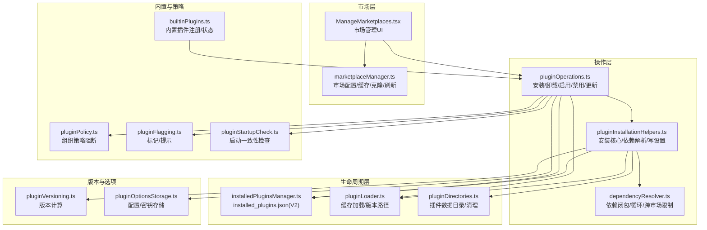
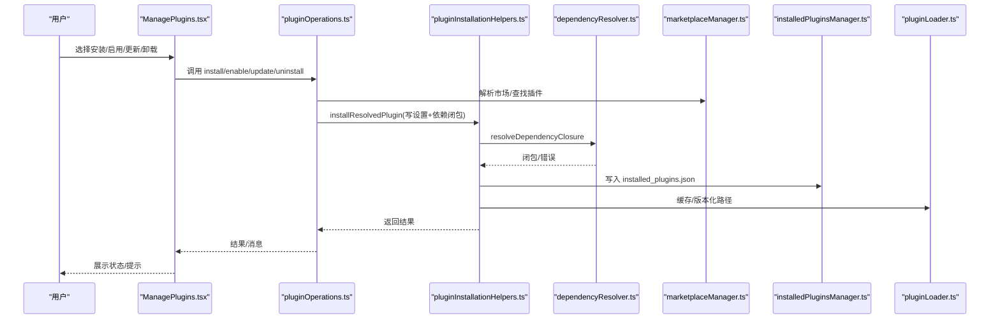
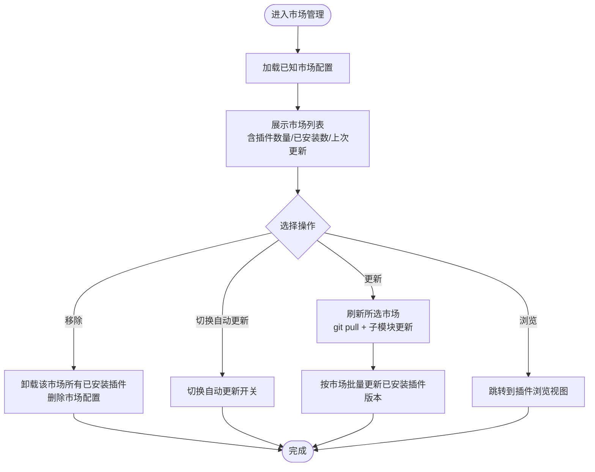
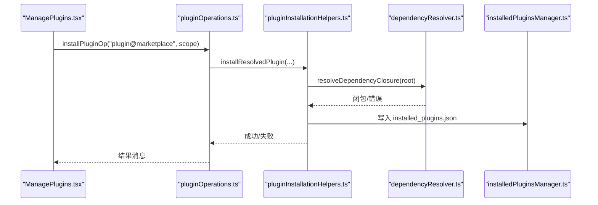
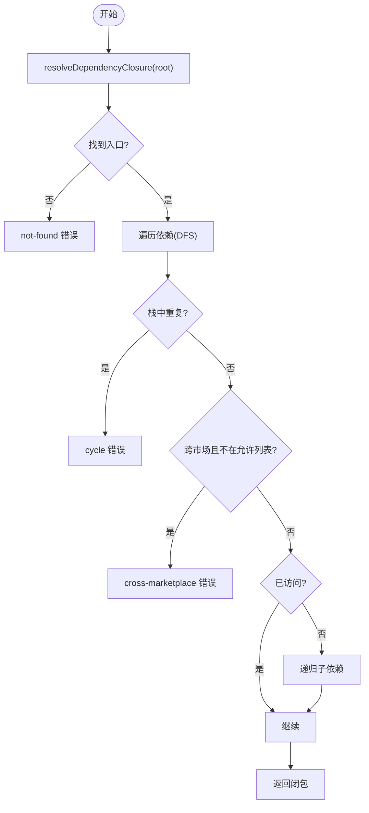
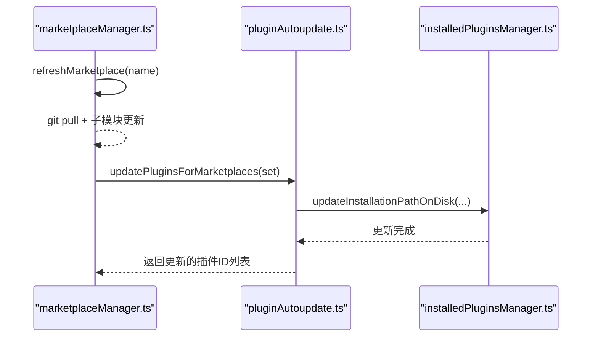
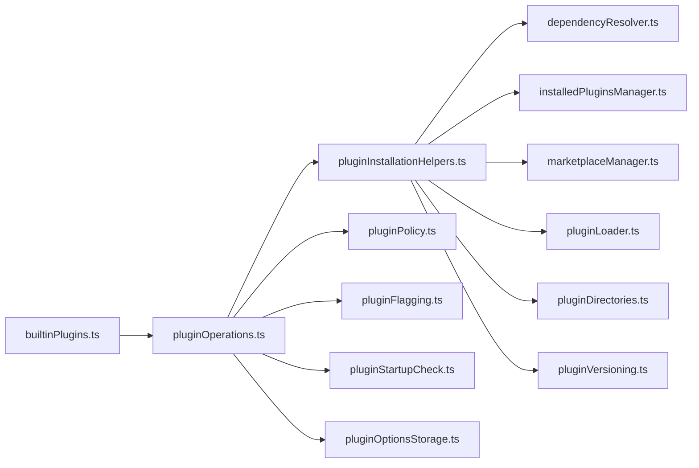

# 插件市场与管理

<cite>
**本文引用的文件**   
- [builtinPlugins.ts](file://src/plugins/builtinPlugins.ts)
- [ManagePlugins.tsx](file://src/commands/plugin/ManagePlugins.tsx)
- [pluginOperations.ts](file://src/services/plugins/pluginOperations.ts)
- [dependencyResolver.ts](file://src/utils/plugins/dependencyResolver.ts)
- [marketplaceManager.ts](file://src/utils/plugins/marketplaceManager.ts)
- [pluginInstallationHelpers.ts](file://src/utils/plugins/pluginInstallationHelpers.ts)
- [installedPluginsManager.ts](file://src/utils/plugins/installedPluginsManager.ts)
- [ManageMarketplaces.tsx](file://src/commands/plugin/ManageMarketplaces.tsx)
- [pluginPolicy.ts](file://src/utils/plugins/pluginPolicy.ts)
- [pluginAutoupdate.ts](file://src/utils/plugins/pluginAutoupdate.ts)
- [pluginDirectories.ts](file://src/utils/plugins/pluginDirectories.ts)
- [pluginLoader.ts](file://src/utils/plugins/pluginLoader.ts)
- [pluginVersioning.ts](file://src/utils/plugins/pluginVersioning.ts)
- [pluginOptionsStorage.ts](file://src/utils/plugins/pluginOptionsStorage.ts)
- [pluginFlagging.ts](file://src/utils/plugins/pluginFlagging.ts)
- [pluginIdentifier.ts](file://src/utils/plugins/pluginIdentifier.ts)
- [pluginStartupCheck.ts](file://src/utils/plugins/pluginStartupCheck.ts)
- [pluginDirectories.ts](file://src/utils/plugins/pluginDirectories.ts)
- [pluginLoader.ts](file://src/utils/plugins/pluginLoader.ts)
- [pluginVersioning.ts](file://src/utils/plugins/pluginVersioning.ts)
- [pluginOptionsStorage.ts](file://src/utils/plugins/pluginOptionsStorage.ts)
- [pluginFlagging.ts](file://src/utils/plugins/pluginFlagging.ts)
- [pluginIdentifier.ts](file://src/utils/plugins/pluginIdentifier.ts)
- [pluginStartupCheck.ts](file://src/utils/plugins/pluginStartupCheck.ts)
</cite>

## 目录
1. [简介](#简介)
2. [项目结构](#项目结构)
3. [核心组件](#核心组件)
4. [架构总览](#架构总览)
5. [详细组件分析](#详细组件分析)
6. [依赖关系分析](#依赖关系分析)
7. [性能考虑](#性能考虑)
8. [故障排查指南](#故障排查指南)
9. [结论](#结论)
10. [附录](#附录)

## 简介
本文件面向 Claude Code 插件生态，系统化阐述插件市场与管理的设计与实现，覆盖官方市场、第三方市场与私有市场的统一管理；插件安装、卸载、启用/禁用、更新的全流程；版本管理、依赖解析与冲突处理；自动更新机制（检测、下载、安装）；评分与评论管理（概念性说明）；审核与安全策略；备份、恢复与迁移；以及插件市场 API 的使用与集成建议。

## 项目结构
围绕插件市场的关键模块分布如下：
- 市场管理：marketplaceManager 负责已知市场的配置、缓存、克隆/拉取、自动更新与来源校验；ManageMarketplaces 提供交互式管理界面。
- 插件操作：pluginOperations 提供安装/卸载/启用/禁用/更新等核心操作；pluginInstallationHelpers 统一封装安装流程与依赖解析；dependencyResolver 实现依赖闭包计算与加载时验证。
- 插件生命周期：installedPluginsManager 维护 installed_plugins.json（V2 格式），支持多作用域记录与迁移；pluginLoader 负责从缓存加载插件；pluginDirectories 管理插件数据目录。
- 内置插件：builtinPlugins 提供“内置”能力注册与展示，区别于“捆绑技能”，可被用户启用/禁用。
- 安全与策略：pluginPolicy 提供组织级策略阻断；pluginFlagging 支持标记与提示；pluginStartupCheck 在启动时进行一致性检查。
- 版本与选项：pluginVersioning 计算版本号；pluginOptionsStorage 存储插件配置与密钥；pluginAutoupdate 提供按市场批量更新逻辑。

图示来源
- [marketplaceManager.ts:1-200](file://src/utils/plugins/marketplaceManager.ts#L1-L200)
- [ManageMarketplaces.tsx:1-200](file://src/commands/plugin/ManageMarketplaces.tsx#L1-L200)
- [pluginOperations.ts:1-200](file://src/services/plugins/pluginOperations.ts#L1-L200)
- [pluginInstallationHelpers.ts:340-481](file://src/utils/plugins/pluginInstallationHelpers.ts#L340-L481)
- [dependencyResolver.ts:95-159](file://src/utils/plugins/dependencyResolver.ts#L95-L159)
- [installedPluginsManager.ts:360-420](file://src/utils/plugins/installedPluginsManager.ts#L360-L420)
- [pluginLoader.ts](file://src/utils/plugins/pluginLoader.ts)
- [pluginDirectories.ts](file://src/utils/plugins/pluginDirectories.ts)
- [builtinPlugins.ts:1-120](file://src/plugins/builtinPlugins.ts#L1-L120)
- [pluginPolicy.ts:1-20](file://src/utils/plugins/pluginPolicy.ts#L1-L20)
- [pluginFlagging.ts](file://src/utils/plugins/pluginFlagging.ts)
- [pluginStartupCheck.ts](file://src/utils/plugins/pluginStartupCheck.ts)
- [pluginVersioning.ts](file://src/utils/plugins/pluginVersioning.ts)
- [pluginOptionsStorage.ts](file://src/utils/plugins/pluginOptionsStorage.ts)

章节来源
- [marketplaceManager.ts:1-200](file://src/utils/plugins/marketplaceManager.ts#L1-L200)
- [ManageMarketplaces.tsx:1-200](file://src/commands/plugin/ManageMarketplaces.tsx#L1-L200)
- [pluginOperations.ts:1-200](file://src/services/plugins/pluginOperations.ts#L1-L200)
- [pluginInstallationHelpers.ts:340-481](file://src/utils/plugins/pluginInstallationHelpers.ts#L340-L481)
- [dependencyResolver.ts:95-159](file://src/utils/plugins/dependencyResolver.ts#L95-L159)
- [installedPluginsManager.ts:360-420](file://src/utils/plugins/installedPluginsManager.ts#L360-L420)
- [builtinPlugins.ts:1-120](file://src/plugins/builtinPlugins.ts#L1-L120)
- [pluginPolicy.ts:1-20](file://src/utils/plugins/pluginPolicy.ts#L1-L20)
- [pluginFlagging.ts](file://src/utils/plugins/pluginFlagging.ts)
- [pluginStartupCheck.ts](file://src/utils/plugins/pluginStartupCheck.ts)
- [pluginVersioning.ts](file://src/utils/plugins/pluginVersioning.ts)
- [pluginOptionsStorage.ts](file://src/utils/plugins/pluginOptionsStorage.ts)

## 核心组件
- 市场管理器（marketplaceManager）
  - 统一管理 known_marketplaces.json，支持 URL/GitHub/npm/本地目录等来源；缓存市场清单；提供克隆/刷新；自动更新策略；来源白名单/黑名单与策略校验。
- 插件操作（pluginOperations）
  - 提供 install/uninstall/enable/disable/update 等纯函数接口，不直接写控制台或退出进程；支持作用域（user/project/local/managed）与策略阻断；返回标准化结果对象。
- 安装辅助（pluginInstallationHelpers）
  - 将依赖解析与设置写入合并到一次事务中；缓存插件至版本化路径；记录 installed_plugins.json；处理本地源路径校验与 zip 缓存。
- 依赖解析（dependencyResolver）
  - DFS 依赖闭包，循环检测，跨市场依赖默认禁止；加载时固定点验证，缺失或未启用的依赖会降级（demote）。
- 已安装插件管理（installedPluginsManager）
  - V2 单文件格式 installed_plugins.json，支持多作用域记录；迁移逻辑；与 enabledPlugins 同步；清理孤儿版本。
- 内置插件（builtinPlugins）
  - 注册内置插件，区分 @builtin 源；在 UI 中以“内置”分组展示；用户可启用/禁用并持久化到设置。
- 安全与策略（pluginPolicy、pluginFlagging、pluginStartupCheck）
  - 组织策略阻断；插件标记与提示；启动时一致性检查与降级。
- 生命周期与版本（pluginLoader、pluginDirectories、pluginVersioning、pluginOptionsStorage）
  - 缓存加载与版本化路径；数据目录管理；版本号计算；配置与密钥存储。

章节来源
- [marketplaceManager.ts:264-350](file://src/utils/plugins/marketplaceManager.ts#L264-L350)
- [pluginOperations.ts:321-418](file://src/services/plugins/pluginOperations.ts#L321-L418)
- [pluginInstallationHelpers.ts:348-481](file://src/utils/plugins/pluginInstallationHelpers.ts#L348-L481)
- [dependencyResolver.ts:95-159](file://src/utils/plugins/dependencyResolver.ts#L95-L159)
- [installedPluginsManager.ts:360-420](file://src/utils/plugins/installedPluginsManager.ts#L360-L420)
- [builtinPlugins.ts:21-102](file://src/plugins/builtinPlugins.ts#L21-L102)
- [pluginPolicy.ts:17-20](file://src/utils/plugins/pluginPolicy.ts#L17-L20)
- [pluginFlagging.ts](file://src/utils/plugins/pluginFlagging.ts)
- [pluginStartupCheck.ts](file://src/utils/plugins/pluginStartupCheck.ts)
- [pluginLoader.ts](file://src/utils/plugins/pluginLoader.ts)
- [pluginDirectories.ts](file://src/utils/plugins/pluginDirectories.ts)
- [pluginVersioning.ts](file://src/utils/plugins/pluginVersioning.ts)
- [pluginOptionsStorage.ts](file://src/utils/plugins/pluginOptionsStorage.ts)

## 架构总览
下图展示从用户触发到插件生效的关键调用链路与数据流：

图示来源
- [ManagePlugins.tsx:397-500](file://src/commands/plugin/ManagePlugins.tsx#L397-L500)
- [pluginOperations.ts:321-418](file://src/services/plugins/pluginOperations.ts#L321-L418)
- [pluginInstallationHelpers.ts:348-481](file://src/utils/plugins/pluginInstallationHelpers.ts#L348-L481)
- [dependencyResolver.ts:95-159](file://src/utils/plugins/dependencyResolver.ts#L95-L159)
- [marketplaceManager.ts:342-359](file://src/utils/plugins/marketplaceManager.ts#L342-L359)
- [installedPluginsManager.ts:360-420](file://src/utils/plugins/installedPluginsManager.ts#L360-L420)
- [pluginLoader.ts](file://src/utils/plugins/pluginLoader.ts)

## 详细组件分析

### 市场管理与 UI
- 已知市场配置
  - known_marketplaces.json 记录每个市场的来源、安装位置、最后更新时间与自动更新开关；支持从种子目录注册只读市场条目。
- 市场刷新与自动更新
  - 支持对单个市场执行 git 拉取/子模块更新；失败时增强错误信息（超时、主机密钥变更、认证失败、网络问题）；可按市场开启/关闭自动更新。
- UI 流程
  - ManageMarketplaces 提供添加、浏览、更新、移除、切换自动更新等交互；批量应用变更后刷新状态并提示结果。

图示来源
- [ManageMarketplaces.tsx:184-341](file://src/commands/plugin/ManageMarketplaces.tsx#L184-L341)
- [marketplaceManager.ts:528-644](file://src/utils/plugins/marketplaceManager.ts#L528-L644)
- [pluginAutoupdate.ts](file://src/utils/plugins/pluginAutoupdate.ts)

章节来源
- [marketplaceManager.ts:264-350](file://src/utils/plugins/marketplaceManager.ts#L264-L350)
- [ManageMarketplaces.tsx:1-200](file://src/commands/plugin/ManageMarketplaces.tsx#L1-L200)
- [pluginAutoupdate.ts](file://src/utils/plugins/pluginAutoupdate.ts)

### 插件安装与启用/禁用
- 安装流程
  - 解析目标市场与插件条目；若为本地源需提供安装位置；解析依赖闭包（DFS，循环检测，跨市场默认禁止）；一次性写入 enabledPlugins 设置；缓存插件到版本化路径；清理缓存。
- 启用/禁用
  - 启用：写入对应作用域设置；内置插件强制走 user 作用域；支持跨作用域提示与覆盖；禁用前收集反向依赖警告。
- 卸载
  - 根据 installed_plugins.json 查找实际安装位置；删除设置键；清理缓存；必要时删除数据目录与配置；提示反向依赖风险。

图示来源
- [pluginOperations.ts:321-418](file://src/services/plugins/pluginOperations.ts#L321-L418)
- [pluginInstallationHelpers.ts:348-481](file://src/utils/plugins/pluginInstallationHelpers.ts#L348-L481)
- [dependencyResolver.ts:95-159](file://src/utils/plugins/dependencyResolver.ts#L95-L159)
- [installedPluginsManager.ts:360-420](file://src/utils/plugins/installedPluginsManager.ts#L360-L420)

章节来源
- [pluginOperations.ts:321-418](file://src/services/plugins/pluginOperations.ts#L321-L418)
- [pluginOperations.ts:427-558](file://src/services/plugins/pluginOperations.ts#L427-L558)
- [pluginOperations.ts:573-747](file://src/services/plugins/pluginOperations.ts#L573-L747)
- [pluginInstallationHelpers.ts:348-481](file://src/utils/plugins/pluginInstallationHelpers.ts#L348-L481)

### 依赖解析与冲突处理
- 依赖闭包
  - 从根开始 DFS 遍历，跳过已启用依赖（避免意外写设置）；默认禁止跨市场依赖；允许通过根市场 allowlist 放行；检测环依赖。
- 加载时验证
  - 对已启用插件逐项验证其 manifest 依赖是否在已启用集合内；不满足则降级（demote），固定点迭代直到稳定；记录错误以便诊断。
- 反向依赖提示
  - 卸载/禁用前扫描依赖该插件的其他插件，生成“被以下插件依赖”的警告。

图示来源
- [dependencyResolver.ts:95-159](file://src/utils/plugins/dependencyResolver.ts#L95-L159)

章节来源
- [dependencyResolver.ts:95-159](file://src/utils/plugins/dependencyResolver.ts#L95-L159)
- [dependencyResolver.ts:177-234](file://src/utils/plugins/dependencyResolver.ts#L177-L234)
- [dependencyResolver.ts:244-263](file://src/utils/plugins/dependencyResolver.ts#L244-L263)

### 版本管理与缓存
- 版本计算
  - 基于 manifest 版本、git 提交 SHA、缓存路径等综合计算；确保同一版本唯一标识。
- 缓存与迁移
  - 插件缓存到 ~/.claude/plugins/cache/<marketplace>/<plugin>/<version>/；支持目录/ZIP 缓存模式；installed_plugins.json 采用 V2 格式，支持多作用域记录；启动时进行 V1/V2 迁移。
- 数据目录
  - 插件运行期数据目录与缓存分离；卸载时可选择删除数据目录。

章节来源
- [pluginVersioning.ts](file://src/utils/plugins/pluginVersioning.ts)
- [pluginInstallationHelpers.ts:128-226](file://src/utils/plugins/pluginInstallationHelpers.ts#L128-L226)
- [installedPluginsManager.ts:115-136](file://src/utils/plugins/installedPluginsManager.ts#L115-L136)
- [installedPluginsManager.ts:360-420](file://src/utils/plugins/installedPluginsManager.ts#L360-L420)
- [pluginDirectories.ts](file://src/utils/plugins/pluginDirectories.ts)

### 自动更新机制
- 市场自动更新
  - 支持为每个市场单独开启/关闭自动更新；刷新时执行 git 拉取与子模块更新；失败时提供增强错误信息。
- 插件自动更新
  - 刷新市场后，按市场批量更新已安装插件的 installed_plugins.json 记录，确保与新版本一致；支持全局跳过自动更新配置。
- 后台清理
  - 更新后清理旧版本孤儿目录，避免磁盘膨胀。

图示来源
- [marketplaceManager.ts:528-644](file://src/utils/plugins/marketplaceManager.ts#L528-L644)
- [ManageMarketplaces.tsx:246-250](file://src/commands/plugin/ManageMarketplaces.tsx#L246-L250)
- [pluginAutoupdate.ts](file://src/utils/plugins/pluginAutoupdate.ts)

章节来源
- [marketplaceManager.ts:528-644](file://src/utils/plugins/marketplaceManager.ts#L528-L644)
- [ManageMarketplaces.tsx:246-250](file://src/commands/plugin/ManageMarketplaces.tsx#L246-L250)
- [pluginAutoupdate.ts](file://src/utils/plugins/pluginAutoupdate.ts)

### 审核、安全与内容过滤
- 组织策略阻断
  - 通过 managed-settings.json 对特定插件进行强制禁用；安装/启用前均进行策略检查。
- 跨市场依赖限制
  - 默认禁止跨市场自动安装依赖，防止从不受信任来源拉取；根市场允许白名单放行。
- 标记与提示
  - 插件被标记（如下架）时在 UI 中提示；支持标记状态跟踪与清理。
- 启动一致性检查
  - 加载时固定点验证依赖，缺失或未启用的依赖会被降级，保证运行时稳定性。

章节来源
- [pluginPolicy.ts:17-20](file://src/utils/plugins/pluginPolicy.ts#L17-L20)
- [pluginOperations.ts:650-658](file://src/services/plugins/pluginOperations.ts#L650-L658)
- [pluginInstallationHelpers.ts:398-427](file://src/utils/plugins/pluginInstallationHelpers.ts#L398-L427)
- [dependencyResolver.ts:118-132](file://src/utils/plugins/dependencyResolver.ts#L118-L132)
- [pluginFlagging.ts](file://src/utils/plugins/pluginFlagging.ts)
- [pluginStartupCheck.ts](file://src/utils/plugins/pluginStartupCheck.ts)

### 备份、恢复与迁移
- 备份
  - settings.json（enabledPlugins）、installed_plugins.json（V2）、插件数据目录与 zip 缓存均可视为备份对象。
- 恢复
  - 重建 installed_plugins.json 与缓存映射；恢复 settings.json 中的 enabledPlugins；必要时重新缓存插件。
- 迁移
  - V1/V2 文件格式迁移；清理遗留缓存目录；保持 schema 版本演进。

章节来源
- [installedPluginsManager.ts:115-136](file://src/utils/plugins/installedPluginsManager.ts#L115-L136)
- [installedPluginsManager.ts:360-420](file://src/utils/plugins/installedPluginsManager.ts#L360-L420)
- [pluginDirectories.ts](file://src/utils/plugins/pluginDirectories.ts)

### 插件市场 API 使用指南与集成方案
- 市场配置 API
  - known_marketplaces.json：记录市场来源、安装位置、最后更新时间、自动更新开关；支持从种子目录注册只读条目。
  - marketplaceManager 提供加载/保存配置、注册种子市场、刷新市场、移除来源等能力。
- 插件操作 API
  - installPluginOp/enablePluginOp/disablePluginOp/uninstallPluginOp/updatePluginOp：纯函数接口，返回标准化结果；支持作用域与策略阻断；依赖解析与安装核心封装在 installResolvedPlugin。
- 依赖解析 API
  - resolveDependencyClosure/verifyAndDemote/findReverseDependents：用于安装前闭包计算与加载时验证。
- 生命周期 API
  - installedPluginsManager：读写 installed_plugins.json（V2），支持迁移与同步。
- 集成建议
  - CLI 与 UI 共用上述纯函数；UI 仅负责交互与展示，不直接写设置或缓存；错误与结果通过返回值与日志传递。

章节来源
- [marketplaceManager.ts:264-350](file://src/utils/plugins/marketplaceManager.ts#L264-L350)
- [pluginOperations.ts:321-418](file://src/services/plugins/pluginOperations.ts#L321-L418)
- [pluginInstallationHelpers.ts:348-481](file://src/utils/plugins/pluginInstallationHelpers.ts#L348-L481)
- [dependencyResolver.ts:95-159](file://src/utils/plugins/dependencyResolver.ts#L95-L159)
- [installedPluginsManager.ts:360-420](file://src/utils/plugins/installedPluginsManager.ts#L360-L420)

## 依赖关系分析

图示来源
- [pluginOperations.ts:1-100](file://src/services/plugins/pluginOperations.ts#L1-L100)
- [pluginInstallationHelpers.ts:1-60](file://src/utils/plugins/pluginInstallationHelpers.ts#L1-L60)
- [dependencyResolver.ts:1-30](file://src/utils/plugins/dependencyResolver.ts#L1-L30)
- [installedPluginsManager.ts:1-40](file://src/utils/plugins/installedPluginsManager.ts#L1-L40)
- [marketplaceManager.ts:1-40](file://src/utils/plugins/marketplaceManager.ts#L1-L40)
- [pluginLoader.ts](file://src/utils/plugins/pluginLoader.ts)
- [pluginDirectories.ts](file://src/utils/plugins/pluginDirectories.ts)
- [builtinPlugins.ts:1-20](file://src/plugins/builtinPlugins.ts#L1-L20)
- [pluginPolicy.ts:1-10](file://src/utils/plugins/pluginPolicy.ts#L1-L10)
- [pluginFlagging.ts](file://src/utils/plugins/pluginFlagging.ts)
- [pluginStartupCheck.ts](file://src/utils/plugins/pluginStartupCheck.ts)
- [pluginVersioning.ts](file://src/utils/plugins/pluginVersioning.ts)
- [pluginOptionsStorage.ts](file://src/utils/plugins/pluginOptionsStorage.ts)

章节来源
- [pluginOperations.ts:1-100](file://src/services/plugins/pluginOperations.ts#L1-L100)
- [pluginInstallationHelpers.ts:1-60](file://src/utils/plugins/pluginInstallationHelpers.ts#L1-L60)
- [dependencyResolver.ts:1-30](file://src/utils/plugins/dependencyResolver.ts#L1-L30)
- [installedPluginsManager.ts:1-40](file://src/utils/plugins/installedPluginsManager.ts#L1-L40)
- [marketplaceManager.ts:1-40](file://src/utils/plugins/marketplaceManager.ts#L1-L40)
- [pluginLoader.ts](file://src/utils/plugins/pluginLoader.ts)
- [pluginDirectories.ts](file://src/utils/plugins/pluginDirectories.ts)
- [builtinPlugins.ts:1-20](file://src/plugins/builtinPlugins.ts#L1-L20)
- [pluginPolicy.ts:1-10](file://src/utils/plugins/pluginPolicy.ts#L1-L10)
- [pluginFlagging.ts](file://src/utils/plugins/pluginFlagging.ts)
- [pluginStartupCheck.ts](file://src/utils/plugins/pluginStartupCheck.ts)
- [pluginVersioning.ts](file://src/utils/plugins/pluginVersioning.ts)
- [pluginOptionsStorage.ts](file://src/utils/plugins/pluginOptionsStorage.ts)

## 性能考虑
- 缓存与懒加载
  - 市场清单与插件清单采用缓存；插件加载命中缓存时快速返回；版本化路径避免重复下载。
- 批量操作
  - UI 支持批量应用市场更新/移除；后台清理孤儿版本，减少磁盘占用。
- 依赖解析优化
  - DFS 闭包仅对未启用依赖进行递归，避免重复写设置；跨市场默认禁止降低风险同时提升性能。
- Git 操作
  - 超时可配置；SSH 主机密钥验证失败时提供明确修复指引；子模块更新非致命，避免阻塞主流程。

## 故障排查指南
- 安装失败
  - 依赖循环/缺失：根据 formatResolutionError 提示定位；检查跨市场依赖白名单；确认目标市场已添加。
  - 策略阻断：检查 managed-settings.json 是否对插件或依赖进行了强制禁用。
  - 本地源无安装位置：本地源必须提供安装位置，否则无法缓存。
- 卸载失败
  - 插件未安装在指定作用域：根据 getPluginInstallationFromV2 提示使用正确作用域；项目作用域共享设置需通过 local 覆盖。
- 启用/禁用无效
  - 跨作用域覆盖：明确使用更高优先级作用域写入；查看当前生效状态与 merged settings。
- 市场更新失败
  - SSH 主机密钥变更/认证失败/网络超时：根据增强错误信息逐一排查；必要时改用 HTTPS 或修复 SSH 配置。
- 运行期异常
  - 依赖未满足：verifyAndDemote 会降级受影响插件；查看错误列表与反向依赖提示。

章节来源
- [pluginOperations.ts:382-409](file://src/services/plugins/pluginOperations.ts#L382-L409)
- [pluginOperations.ts:481-502](file://src/services/plugins/pluginOperations.ts#L481-L502)
- [pluginOperations.ts:684-688](file://src/services/plugins/pluginOperations.ts#L684-L688)
- [pluginInstallationHelpers.ts:304-327](file://src/utils/plugins/pluginInstallationHelpers.ts#L304-L327)
- [marketplaceManager.ts:649-709](file://src/utils/plugins/marketplaceManager.ts#L649-L709)
- [dependencyResolver.ts:177-234](file://src/utils/plugins/dependencyResolver.ts#L177-L234)

## 结论
本插件市场与管理方案以“设置声明意图 + 缓存材料化 + 依赖闭包约束 + 策略与安全前置”的方式，实现了对官方、第三方与私有市场的统一治理。安装/卸载/启用/禁用/更新流程清晰、可审计；依赖解析与加载时验证保障了运行稳定性；自动更新与版本化缓存提升了用户体验；策略阻断与标记机制强化了企业级合规与安全。配套的备份/恢复/迁移能力与 API 设计便于扩展与集成。

## 附录
- 关键术语
  - 作用域：user/project/local/managed；其中 managed 由 managed-settings.json 控制，不可通过 UI/CLI 直接安装/启用。
  - 闭包：依赖闭包，包含根插件与其所有未启用的传递依赖。
  - 反向依赖：依赖某插件的其他插件集合。
- 常见场景
  - 添加第三方市场：通过 UI 或配置文件注册来源；刷新后即可浏览与安装。
  - 禁用受策略阻断插件：需联系管理员调整 managed-settings.json。
  - 本地开发插件：使用本地源并在 UI 中选择安装位置；注意跨市场依赖默认禁止。