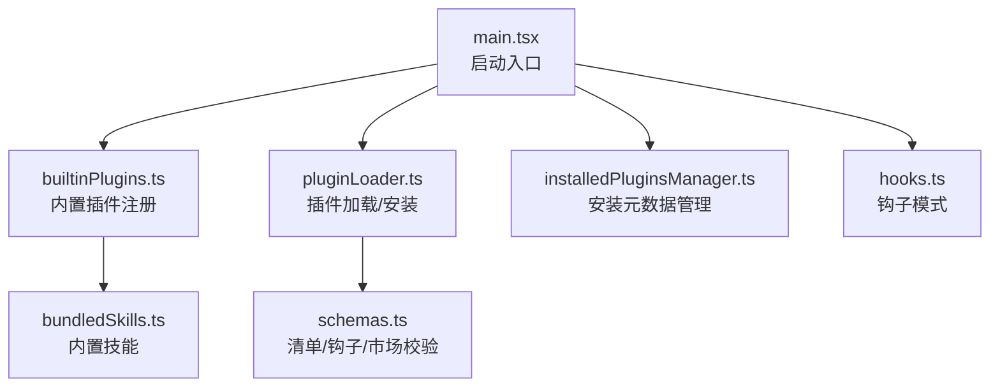
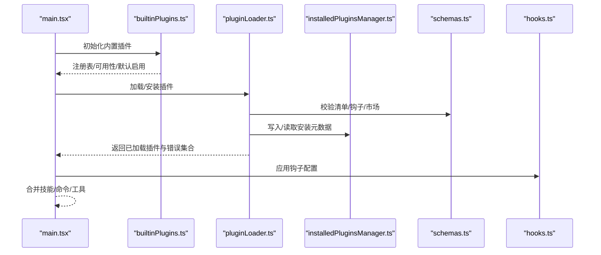
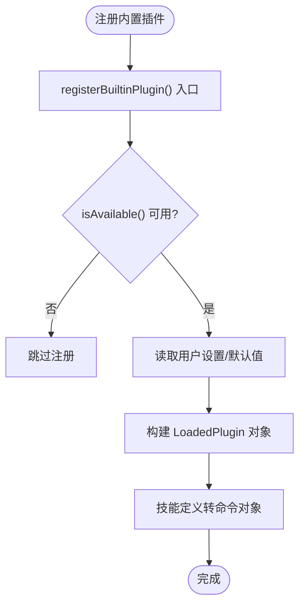
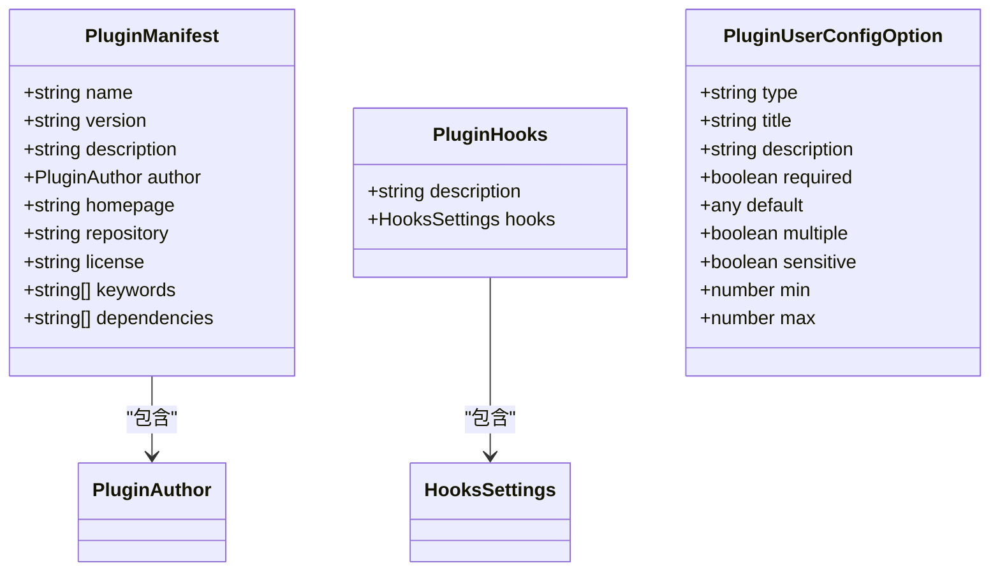
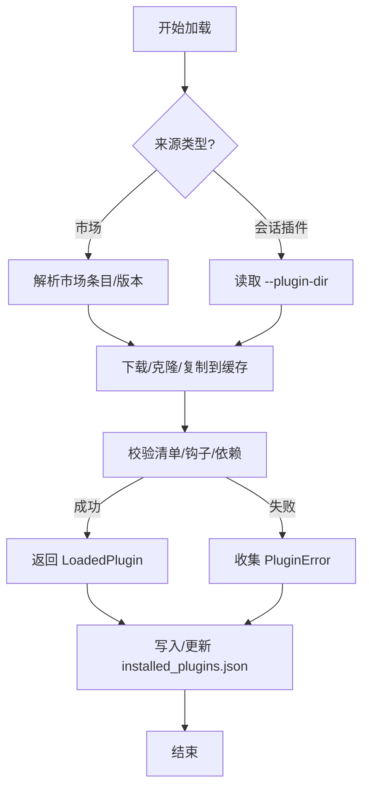
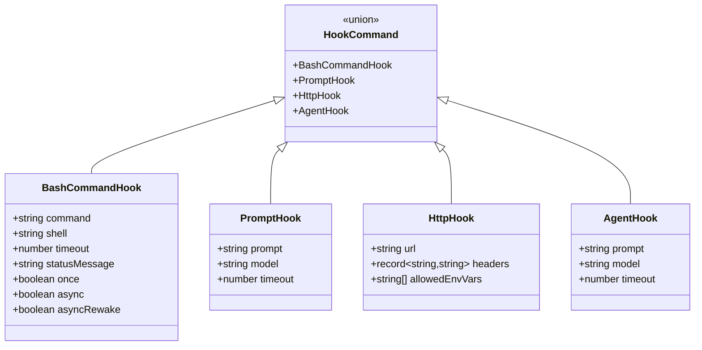
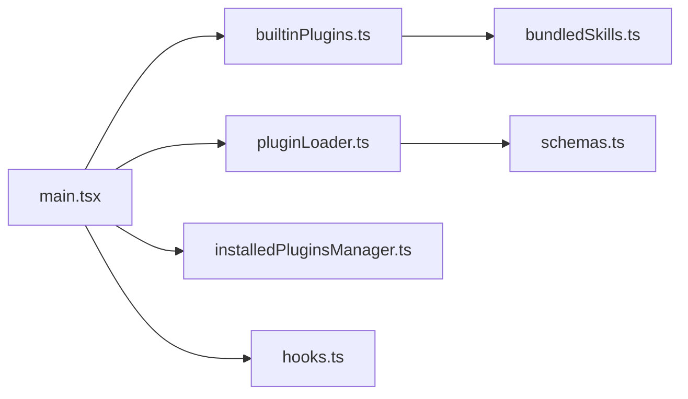

# 插件开发指南

<cite>
**本文引用的文件**
- [package.json](file://package.json)
- [README.md](file://README.md)
- [builtinPlugins.ts](file://src/plugins/builtinPlugins.ts)
- [plugin.ts](file://src/types/plugin.ts)
- [schemas.ts](file://src/utils/plugins/schemas.ts)
- [bundledSkills.ts](file://src/skills/bundledSkills.ts)
- [index.ts](file://src/plugins/bundled/index.ts)
- [pluginLoader.ts](file://src/utils/plugins/pluginLoader.ts)
- [installedPluginsManager.ts](file://src/utils/plugins/installedPluginsManager.ts)
- [hooks.ts](file://src/schemas/hooks.ts)
- [main.tsx](file://src/main.tsx)
</cite>

## 目录
1. [简介](#简介)
2. [项目结构](#项目结构)
3. [核心组件](#核心组件)
4. [架构总览](#架构总览)
5. [详细组件分析](#详细组件分析)
6. [依赖关系分析](#依赖关系分析)
7. [性能考虑](#性能考虑)
8. [故障排查指南](#故障排查指南)
9. [结论](#结论)
10. [附录](#附录)

## 简介
本指南面向 Claude Code 插件开发者，基于仓库中已实现的插件系统与类型定义，提供从项目结构、配置文件、依赖管理到开发、调试、测试、打包与发布的完整实践路径。文档重点覆盖：
- 插件注册与加载机制（内置插件与市场插件）
- 插件清单与模式校验（plugin.json、hooks.json、manifest）
- 命令、技能、工具、钩子等扩展点
- 插件安装、缓存、版本化与更新策略
- 错误处理与可观测性
- 性能优化与内存管理建议

## 项目结构
该仓库为 Claude Code 的 CLI 源码提取版本，插件系统位于以下关键目录：
- 插件注册与内置插件：src/plugins
- 插件类型与错误模型：src/types/plugin.ts
- 插件清单与模式校验：src/utils/plugins/schemas.ts
- 内置技能：src/skills/bundledSkills.ts
- 插件加载器与安装管理：src/utils/plugins/pluginLoader.ts、src/utils/plugins/installedPluginsManager.ts
- 钩子模式定义：src/schemas/hooks.ts
- 启动入口与初始化：src/main.tsx

图表来源
- [main.tsx](file://src/main.tsx)
- [builtinPlugins.ts](file://src/plugins/builtinPlugins.ts)
- [pluginLoader.ts](file://src/utils/plugins/pluginLoader.ts)
- [installedPluginsManager.ts](file://src/utils/plugins/installedPluginsManager.ts)
- [schemas.ts](file://src/utils/plugins/schemas.ts)
- [bundledSkills.ts](file://src/skills/bundledSkills.ts)
- [hooks.ts](file://src/schemas/hooks.ts)

章节来源
- [README.md](file://README.md)
- [package.json](file://package.json)

## 核心组件
- 插件类型与错误模型：定义 LoadedPlugin、PluginManifest、PluginError 等核心类型，提供统一的错误分类与消息映射。
- 插件清单与模式校验：通过 Zod 定义 plugin.json、hooks.json、市场源、用户配置等结构，确保插件元数据与行为可验证。
- 内置插件注册：提供注册表、可用性判断、启用状态合并与命令转换逻辑。
- 插件加载器：支持从市场、本地目录、git 子目录、NPM 等来源安装与缓存插件；提供版本化缓存与种子缓存探测。
- 安装元数据管理：维护 installed_plugins.json，记录安装范围、版本、时间戳与路径，并区分会话内内存态与磁盘持久态。
- 钩子系统：定义命令、提示词、HTTP、代理四种钩子类型及匹配器，支持条件执行、超时、一次性与异步唤醒等特性。

章节来源
- [plugin.ts](file://src/types/plugin.ts)
- [schemas.ts](file://src/utils/plugins/schemas.ts)
- [builtinPlugins.ts](file://src/plugins/builtinPlugins.ts)
- [pluginLoader.ts](file://src/utils/plugins/pluginLoader.ts)
- [installedPluginsManager.ts](file://src/utils/plugins/installedPluginsManager.ts)
- [hooks.ts](file://src/schemas/hooks.ts)

## 架构总览
下图展示插件系统在启动阶段的关键交互：主程序初始化、内置插件注册、插件加载与安装、钩子与技能注入、以及错误收集与日志。

图表来源
- [main.tsx](file://src/main.tsx)
- [builtinPlugins.ts](file://src/plugins/builtinPlugins.ts)
- [pluginLoader.ts](file://src/utils/plugins/pluginLoader.ts)
- [installedPluginsManager.ts](file://src/utils/plugins/installedPluginsManager.ts)
- [schemas.ts](file://src/utils/plugins/schemas.ts)
- [hooks.ts](file://src/schemas/hooks.ts)

## 详细组件分析

### 内置插件注册与命令转换
- 注册表：以 Map 存储插件定义，提供注册、查询、可用性过滤与启用状态合并。
- 命令转换：将技能定义转换为命令对象，保留技能的上下文、钩子、工具限制等属性。
- 用户开关：结合设置持久化内置插件的启用状态。

图表来源
- [builtinPlugins.ts](file://src/plugins/builtinPlugins.ts)

章节来源
- [builtinPlugins.ts](file://src/plugins/builtinPlugins.ts)
- [bundledSkills.ts](file://src/skills/bundledSkills.ts)

### 插件清单与模式校验
- 清单字段：名称、版本、描述、作者、主页、仓库、许可证、关键词、依赖等。
- 钩子配置：支持 hooks.json 或清单内嵌，允许外部文件或内联定义。
- 市场源校验：保留名、来源组织、非 ASCII 名称、自动更新策略等。
- 用户配置：声明可配置项（字符串/数字/布尔/目录/文件），支持敏感信息安全存储。
- LSP/MCP 服务器：提供严格模式校验与通道声明（assistant-mode）。

图表来源
- [schemas.ts](file://src/utils/plugins/schemas.ts)
- [plugin.ts](file://src/types/plugin.ts)

章节来源
- [schemas.ts](file://src/utils/plugins/schemas.ts)
- [plugin.ts](file://src/types/plugin.ts)

### 插件加载器与安装管理
- 来源优先级：市场插件 > 会话插件（--plugin-dir）。
- 缓存策略：版本化缓存目录、ZIP 缓存、种子缓存探测、回退到旧版缓存。
- 安装方式：git 仓库、git 子目录（partial clone + sparse-checkout）、NPM 包、本地目录复制。
- 错误收集：统一 PluginError 类型，按场景细分（路径不存在、网络错误、清单解析/校验失败、市场不可用、MCP/LSP 配置无效等）。

图表来源
- [pluginLoader.ts](file://src/utils/plugins/pluginLoader.ts)
- [installedPluginsManager.ts](file://src/utils/plugins/installedPluginsManager.ts)
- [plugin.ts](file://src/types/plugin.ts)

章节来源
- [pluginLoader.ts](file://src/utils/plugins/pluginLoader.ts)
- [installedPluginsManager.ts](file://src/utils/plugins/installedPluginsManager.ts)
- [plugin.ts](file://src/types/plugin.ts)

### 钩子系统与扩展点
- 钩子类型：命令（shell）、提示词（LLM）、HTTP、代理（agentic）。
- 匹配器：按事件与匹配规则分发钩子，支持条件执行（if）、超时、一次性、异步唤醒。
- 环境变量：HTTP 头部支持受控环境变量插值，避免任意变量泄露。

图表来源
- [hooks.ts](file://src/schemas/hooks.ts)

章节来源
- [hooks.ts](file://src/schemas/hooks.ts)

### 内置技能与命令扩展
- 内置技能：编译期注册，支持首次调用时抽取参考文件到磁盘，统一 prompt 生成。
- 技能到命令：将技能定义转换为命令对象，保留工具限制、钩子、上下文等属性。

章节来源
- [bundledSkills.ts](file://src/skills/bundledSkills.ts)

## 依赖关系分析
- 启动入口依赖：main.tsx 在启动早期初始化内置插件、加载技能、解析设置、预取资源，并在后续阶段加载插件与钩子。
- 插件系统耦合：pluginLoader 依赖 installedPluginsManager 进行安装元数据持久化；两者共同依赖 schemas 校验清单与配置。
- 钩子系统：hooks.ts 作为共享模式定义，被 settings/types 与 plugins/schemas 引用，避免循环依赖。

图表来源
- [main.tsx](file://src/main.tsx)
- [builtinPlugins.ts](file://src/plugins/builtinPlugins.ts)
- [pluginLoader.ts](file://src/utils/plugins/pluginLoader.ts)
- [installedPluginsManager.ts](file://src/utils/plugins/installedPluginsManager.ts)
- [schemas.ts](file://src/utils/plugins/schemas.ts)
- [bundledSkills.ts](file://src/skills/bundledSkills.ts)
- [hooks.ts](file://src/schemas/hooks.ts)

章节来源
- [main.tsx](file://src/main.tsx)

## 性能考虑
- 缓存与压缩：版本化缓存目录与 ZIP 缓存减少重复下载与解压开销；种子缓存优先命中，避免网络请求。
- 部分克隆与稀疏检出：git 子目录安装采用 partial clone + sparse-checkout，显著降低大仓库下载量。
- 资源预取：在非阻塞场景下进行用户上下文、提示、模型能力等预取，避免阻塞首帧渲染。
- 文件系统操作：批量写入与去重（如按父目录分组写入）降低 IO 次数。
- 内存与并发：对昂贵操作使用懒加载与缓存（如模式 schema、插件路径解析），避免重复计算。

## 故障排查指南
- 常见错误类型：路径不存在、Git 认证失败/超时、网络错误、清单解析/校验失败、市场不可用/策略阻止、MCP/LSP 配置无效/崩溃/超时、依赖未满足、插件缓存缺失等。
- 错误消息映射：通过 getPluginErrorMessage 将具体错误类型映射为用户可读提示，便于诊断与引导修复。
- 日志与遥测：加载器与市场访问均记录遥测，便于定位网络/权限/配置问题。
- 诊断步骤建议：
  - 检查插件清单字段是否符合 schemas 校验。
  - 确认市场源与来源组织是否合法（保留名、来源校验）。
  - 查看缓存路径是否存在内容，必要时清理缓存后重试。
  - 使用 --debug 或调试模式运行，观察钩子执行与超时情况。

章节来源
- [plugin.ts](file://src/types/plugin.ts)
- [pluginLoader.ts](file://src/utils/plugins/pluginLoader.ts)

## 结论
本指南基于现有代码库梳理了 Claude Code 插件系统的架构与实现要点，覆盖从注册、清单校验、加载安装、钩子扩展到错误处理与性能优化的全链路实践。开发者可据此快速搭建从简单工具插件到复杂多功能插件的开发与发布流程，并在实际项目中遵循版本化、可验证与可观测的原则。

## 附录

### 开发环境搭建与调试
- 运行时要求：Node.js 版本需满足 package.json 中 engines 字段。
- 启动入口：main.tsx 提供启动流程与初始化逻辑，可在调试模式下观察加载与钩子行为。
- 调试技巧：利用 getPluginErrorMessage 输出错误详情；通过缓存路径与 ZIP 缓存加速迭代；必要时临时关闭自动更新以稳定复现问题。

章节来源
- [package.json](file://package.json)
- [main.tsx](file://src/main.tsx)

### 测试策略
- 单元测试：针对 schemas 校验、路径解析、拷贝与缓存逻辑进行断言。
- 集成测试：模拟插件安装（git、git-subdir、NPM、本地目录）、钩子执行、依赖解析与冲突处理。
- 回归测试：内置插件注册与命令转换、安装元数据迁移与一致性检查。

### 打包、签名与发布
- 打包：仓库为 CLI 源码提取版本，官方发布包包含源映射以便反编译与阅读。实际打包流程以官方发布为准。
- 签名与安全：保留名与来源校验用于防止第三方冒用官方名称；敏感配置项支持安全存储。
- 发布：通过市场源（GitHub/自建）或 NPM 包形式分发，配合 installed_plugins.json 管理安装与版本。

章节来源
- [schemas.ts](file://src/utils/plugins/schemas.ts)
- [README.md](file://README.md)

### 版本管理、兼容性与升级
- 版本化缓存：按 marketplace/plugin/version 组织缓存，支持 ZIP 缓存与种子缓存。
- 升级策略：支持 semver 与 Git SHA 版本；后台更新仅修改磁盘状态，会话内内存态保持稳定，支持“待更新”检测与提示。
- 兼容性：内置插件与技能通过用户设置控制启用/禁用；钩子与清单字段变更需向前兼容或提供迁移。

章节来源
- [pluginLoader.ts](file://src/utils/plugins/pluginLoader.ts)
- [installedPluginsManager.ts](file://src/utils/plugins/installedPluginsManager.ts)