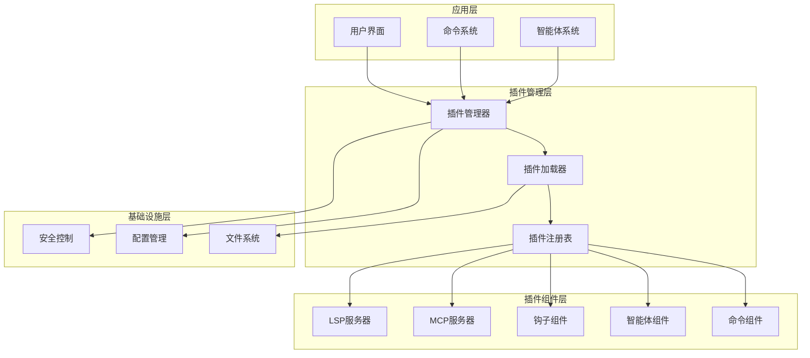
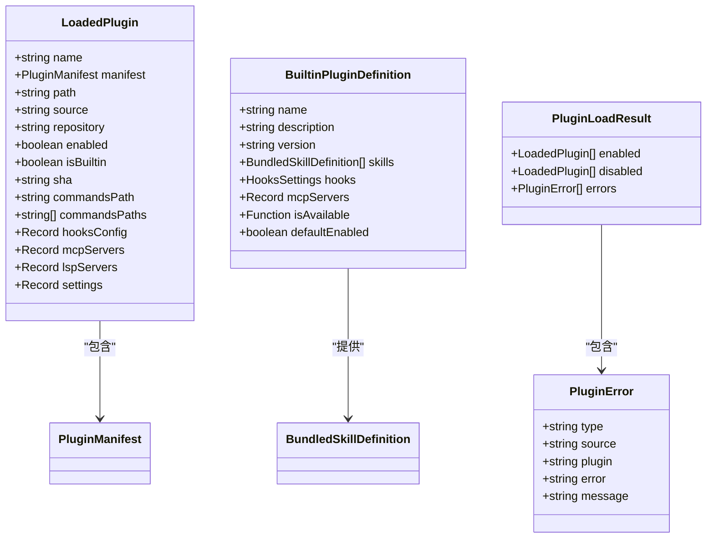
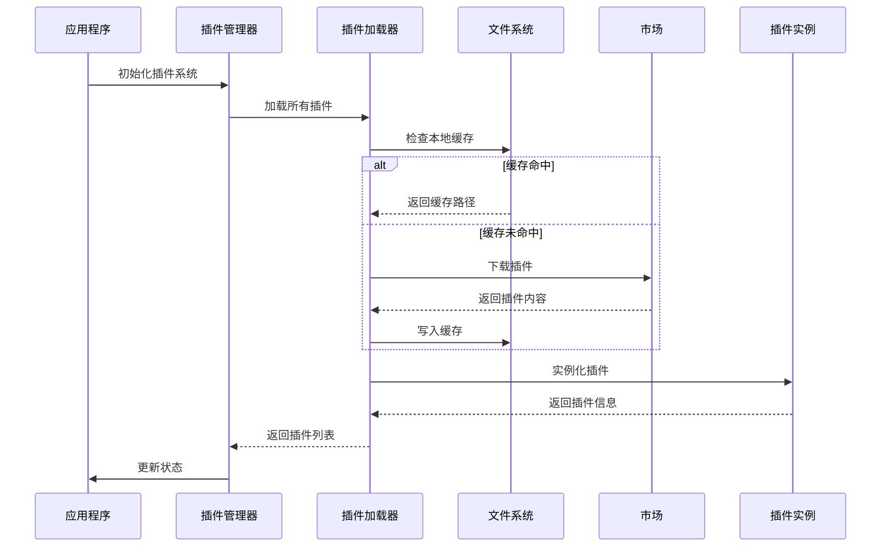
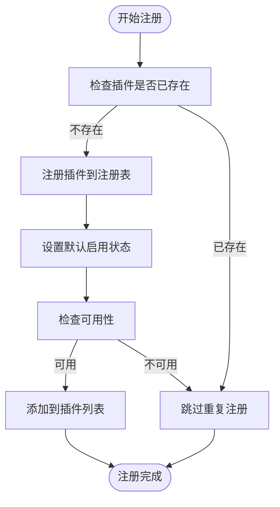
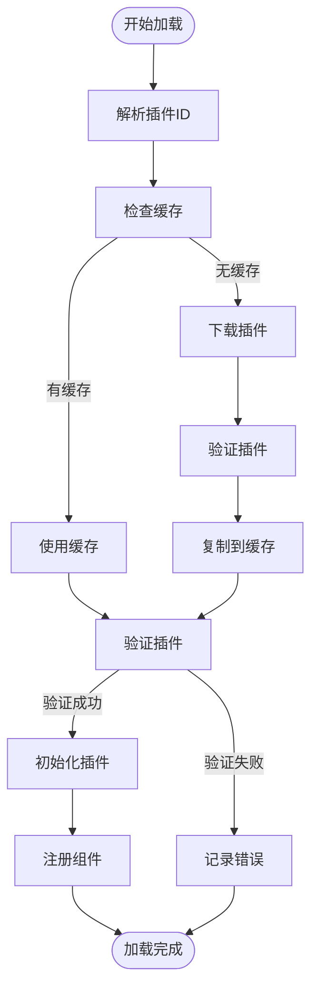
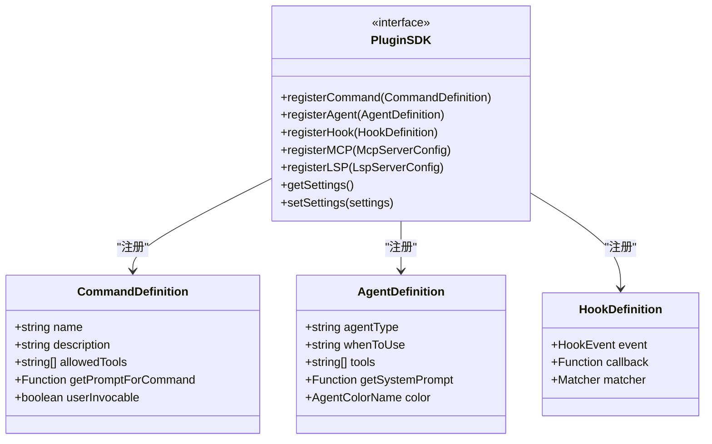
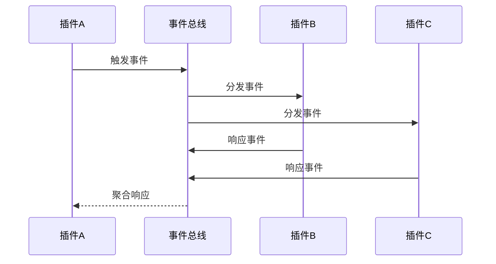
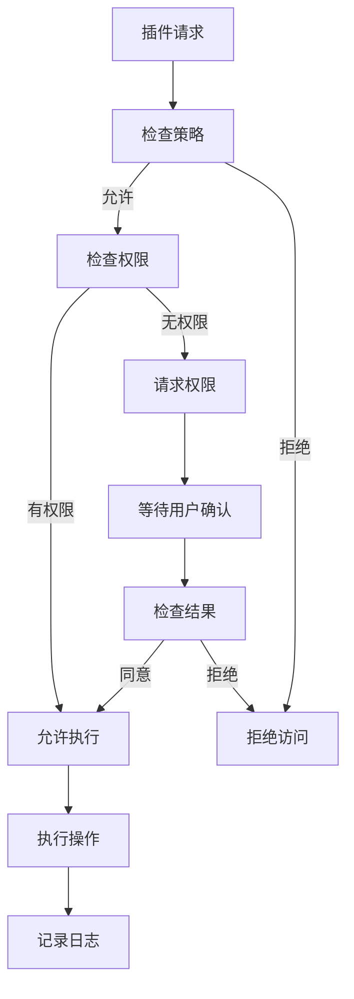
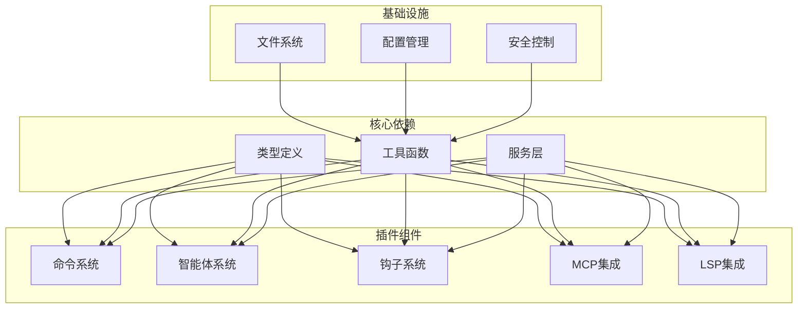

# 插件架构设计

<cite>
**本文档引用的文件**
- [builtinPlugins.ts](file://src/plugins/builtinPlugins.ts)
- [plugin.ts](file://src/types/plugin.ts)
- [useManagePlugins.ts](file://src/hooks/useManagePlugins.ts)
- [pluginLoader.ts](file://src/utils/plugins/pluginLoader.ts)
- [loadPluginCommands.ts](file://src/utils/plugins/loadPluginCommands.ts)
- [loadPluginAgents.ts](file://src/utils/plugins/loadPluginAgents.ts)
- [loadPluginHooks.ts](file://src/utils/plugins/loadPluginHooks.ts)
- [mcpPluginIntegration.ts](file://src/utils/plugins/mcpPluginIntegration.ts)
- [lspPluginIntegration.ts](file://src/utils/plugins/lspPluginIntegration.ts)
- [pluginIdentifier.ts](file://src/utils/plugins/pluginIdentifier.ts)
- [pluginDirectories.ts](file://src/utils/plugins/pluginDirectories.ts)
- [index.tsx](file://src/commands/plugin/index.tsx)
</cite>

## 目录
1. [引言](#引言)
2. [项目结构](#项目结构)
3. [核心组件](#核心组件)
4. [架构概览](#架构概览)
5. [详细组件分析](#详细组件分析)
6. [依赖关系分析](#依赖关系分析)
7. [性能考虑](#性能考虑)
8. [故障排除指南](#故障排除指南)
9. [结论](#结论)

## 引言

Claude Code 插件系统是一个高度模块化和可扩展的架构，支持内置插件和外部插件的统一管理。该系统提供了完整的插件生命周期管理、依赖注入、沙箱隔离和安全控制机制。

插件系统的核心目标是：
- 提供统一的插件接口规范和 SDK 设计
- 支持插件的动态加载和卸载
- 实现插件间的通信机制和事件总线
- 建立完善的权限控制和安全模型
- 提供灵活的配置管理和环境变量处理

## 项目结构

插件系统采用分层架构设计，主要分为以下几个层次：

**图表来源**
- [useManagePlugins.ts:1-305](file://src/hooks/useManagePlugins.ts#L1-L305)
- [pluginLoader.ts:1-800](file://src/utils/plugins/pluginLoader.ts#L1-L800)

**章节来源**
- [useManagePlugins.ts:1-305](file://src/hooks/useManagePlugins.ts#L1-L305)
- [pluginLoader.ts:1-800](file://src/utils/plugins/pluginLoader.ts#L1-L800)

## 核心组件

### 插件类型定义

插件系统定义了多种插件类型，每种类型都有特定的功能和用途：

**图表来源**
- [plugin.ts:48-70](file://src/types/plugin.ts#L48-L70)
- [plugin.ts:18-35](file://src/types/plugin.ts#L18-L35)
- [plugin.ts:101-100](file://src/types/plugin.ts#L101-L100)

### 插件分类系统

插件系统支持两种主要的插件分类：

1. **内置插件 (Builtin Plugins)**：随 CLI 一起提供的插件，用户可以启用或禁用
2. **外部插件 (External Plugins)**：从市场下载的第三方插件

**章节来源**
- [builtinPlugins.ts:1-160](file://src/plugins/builtinPlugins.ts#L1-L160)
- [plugin.ts:18-35](file://src/types/plugin.ts#L18-L35)

## 架构概览

插件系统采用模块化的架构设计，实现了松耦合和高内聚的组件分离：

**图表来源**
- [useManagePlugins.ts:51-266](file://src/hooks/useManagePlugins.ts#L51-L266)
- [pluginLoader.ts:365-465](file://src/utils/plugins/pluginLoader.ts#L365-L465)

### 插件生命周期管理

插件系统实现了完整的生命周期管理，包括：

1. **发现阶段**：扫描可用插件源
2. **加载阶段**：验证和加载插件
3. **初始化阶段**：注册插件组件
4. **运行阶段**：执行插件功能
5. **卸载阶段**：清理插件资源

**章节来源**
- [useManagePlugins.ts:51-266](file://src/hooks/useManagePlugins.ts#L51-L266)
- [pluginLoader.ts:1-800](file://src/utils/plugins/pluginLoader.ts#L1-L800)

## 详细组件分析

### 插件注册与发现机制

#### 内置插件注册

内置插件通过专门的注册表进行管理：

**图表来源**
- [builtinPlugins.ts:28-32](file://src/plugins/builtinPlugins.ts#L28-L32)
- [builtinPlugins.ts:65-102](file://src/plugins/builtinPlugins.ts#L65-L102)

#### 外部插件发现

外部插件通过以下方式发现：

1. **市场发现**：从配置的市场中查找插件
2. **目录扫描**：扫描本地插件目录
3. **种子缓存**：使用预置的种子缓存

**章节来源**
- [builtinPlugins.ts:1-160](file://src/plugins/builtinPlugins.ts#L1-L160)
- [pluginLoader.ts:195-238](file://src/utils/plugins/pluginLoader.ts#L195-L238)

### 插件加载与初始化

#### 插件加载流程

**图表来源**
- [pluginLoader.ts:266-287](file://src/utils/plugins/pluginLoader.ts#L266-L287)
- [pluginLoader.ts:467-524](file://src/utils/plugins/pluginLoader.ts#L467-L524)

#### 组件初始化

插件系统支持多种组件类型的初始化：

**章节来源**
- [pluginLoader.ts:1-800](file://src/utils/plugins/pluginLoader.ts#L1-L800)
- [loadPluginCommands.ts:414-677](file://src/utils/plugins/loadPluginCommands.ts#L414-L677)

### 插件接口规范与 SDK 设计

#### 插件接口定义

插件系统定义了统一的接口规范：

**图表来源**
- [loadPluginCommands.ts:300-402](file://src/utils/plugins/loadPluginCommands.ts#L300-L402)
- [loadPluginAgents.ts:199-222](file://src/utils/plugins/loadPluginAgents.ts#L199-L222)

#### 插件配置管理

插件配置管理系统提供了灵活的配置存储和管理：

**章节来源**
- [plugin.ts:44-70](file://src/types/plugin.ts#L44-L70)
- [pluginDirectories.ts:98-123](file://src/utils/plugins/pluginDirectories.ts#L98-L123)

### 插件间通信机制

#### 钩子系统设计

插件系统实现了基于事件驱动的钩子机制：

**图表来源**
- [loadPluginHooks.ts:91-157](file://src/utils/plugins/loadPluginHooks.ts#L91-L157)

#### 事件总线实现

插件系统使用事件总线模式实现松耦合通信：

**章节来源**
- [loadPluginHooks.ts:1-288](file://src/utils/plugins/loadPluginHooks.ts#L1-L288)

### 安全模型与沙箱隔离

#### 权限控制系统

插件系统实现了多层权限控制：

**图表来源**
- [loadPluginHooks.ts:179-207](file://src/utils/plugins/loadPluginHooks.ts#L179-L207)

#### 环境变量处理

插件系统提供了安全的环境变量处理机制：

**章节来源**
- [mcpPluginIntegration.ts:465-582](file://src/utils/plugins/mcpPluginIntegration.ts#L465-L582)
- [lspPluginIntegration.ts:229-292](file://src/utils/plugins/lspPluginIntegration.ts#L229-L292)

## 依赖关系分析

### 组件耦合度分析

插件系统通过依赖注入和接口抽象实现了低耦合设计：

**图表来源**
- [plugin.ts:1-364](file://src/types/plugin.ts#L1-L364)
- [pluginLoader.ts:35-122](file://src/utils/plugins/pluginLoader.ts#L35-L122)

### 错误处理与恢复

插件系统实现了完善的错误处理机制：

**章节来源**
- [plugin.ts:101-284](file://src/types/plugin.ts#L101-L284)
- [useManagePlugins.ts:223-266](file://src/hooks/useManagePlugins.ts#L223-L266)

## 性能考虑

### 缓存策略

插件系统采用了多层次的缓存策略：

1. **版本化缓存**：按插件版本存储
2. **种子缓存**：预置的只读缓存层
3. **内存缓存**：进程内缓存
4. **ZIP缓存**：压缩格式缓存

### 并行处理

插件系统支持并行加载和处理多个插件：

**章节来源**
- [pluginLoader.ts:195-238](file://src/utils/plugins/pluginLoader.ts#L195-L238)
- [loadPluginCommands.ts:432-672](file://src/utils/plugins/loadPluginCommands.ts#L432-L672)

## 故障排除指南

### 常见问题诊断

插件系统提供了详细的错误报告和诊断功能：

#### 插件加载错误

| 错误类型 | 描述 | 解决方案 |
|---------|------|----------|
| path-not-found | 插件路径不存在 | 检查插件安装路径 |
| git-auth-failed | Git认证失败 | 检查凭据配置 |
| manifest-parse-error | 清单文件解析失败 | 验证JSON格式 |
| plugin-not-found | 插件未找到 | 检查市场连接 |

#### 性能问题

**章节来源**
- [plugin.ts:295-363](file://src/types/plugin.ts#L295-L363)
- [useManagePlugins.ts:182-184](file://src/hooks/useManagePlugins.ts#L182-L184)

### 调试工具

插件系统提供了多种调试工具：

1. **日志记录**：详细的插件加载日志
2. **错误报告**：结构化的错误信息
3. **性能监控**：插件加载时间统计
4. **状态检查**：插件状态实时监控

## 结论

Claude Code 插件架构设计体现了现代插件系统的最佳实践，具有以下特点：

1. **模块化设计**：清晰的分层架构和职责分离
2. **安全性**：多层权限控制和沙箱隔离
3. **可扩展性**：灵活的接口规范和组件系统
4. **性能优化**：高效的缓存策略和并行处理
5. **易用性**：直观的API和完善的错误处理

该架构为插件生态系统的长期发展奠定了坚实的基础，支持从简单的命令插件到复杂的AI智能体插件的各种应用场景。