# 类型定义参考

<cite>
**本文引用的文件**
- [src/types/command.ts](file://src/types/command.ts)
- [src/types/hooks.ts](file://src/types/hooks.ts)
- [src/types/ids.ts](file://src/types/ids.ts)
- [src/types/logs.ts](file://src/types/logs.ts)
- [src/types/permissions.ts](file://src/types/permissions.ts)
- [src/types/plugin.ts](file://src/types/plugin.ts)
- [src/types/textInputTypes.ts](file://src/types/textInputTypes.ts)
- [src/bridge/types.ts](file://src/bridge/types.ts)
</cite>

## 目录
1. [简介](#简介)
2. [项目结构](#项目结构)
3. [核心组件](#核心组件)
4. [架构总览](#架构总览)
5. [详细组件分析](#详细组件分析)
6. [依赖关系分析](#依赖关系分析)
7. [性能考量](#性能考量)
8. [故障排查指南](#故障排查指南)
9. [结论](#结论)
10. [附录](#附录)

## 简介
本参考文档聚焦于 Claude Code 的 TypeScript 类型系统与接口定义，覆盖状态类型、配置类型、工具类型与命令类型；解释生成的类型（事件类型、API 响应类型、配置模式）；总结类型安全实践、类型推导与类型断言的正确用法；提供类型扩展指南（新增类型、修改现有类型、维护向后兼容）；涵盖常量类型、枚举类型与联合类型的使用场景；并给出类型文档生成、类型检查与类型安全测试的方法建议。

## 项目结构
本项目在 src/types 下集中管理核心类型，围绕“命令”“钩子”“权限”“插件”“输入文本”“日志”“标识符”等维度组织类型定义，并通过 src/bridge/types.ts 提供桥接层相关协议与配置类型。这些类型共同构成系统的类型安全边界，支撑命令执行、权限决策、会话日志、插件生态与远程控制等能力。

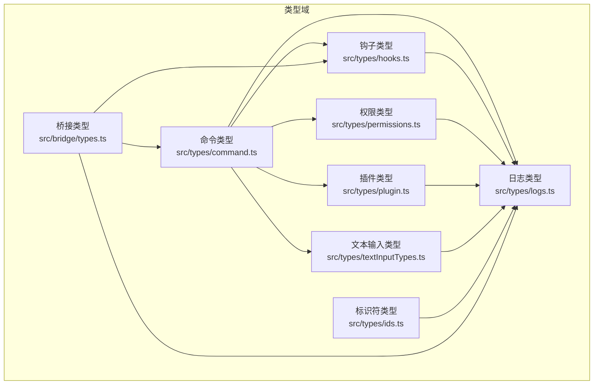

图表来源
- [src/types/command.ts:1-217](file://src/types/command.ts#L1-L217)
- [src/types/hooks.ts:1-291](file://src/types/hooks.ts#L1-L291)
- [src/types/permissions.ts:1-442](file://src/types/permissions.ts#L1-L442)
- [src/types/plugin.ts:1-364](file://src/types/plugin.ts#L1-L364)
- [src/types/textInputTypes.ts:1-388](file://src/types/textInputTypes.ts#L1-L388)
- [src/types/logs.ts:1-331](file://src/types/logs.ts#L1-L331)
- [src/types/ids.ts:1-45](file://src/types/ids.ts#L1-L45)
- [src/bridge/types.ts:1-263](file://src/bridge/types.ts#L1-L263)

章节来源
- [src/types/command.ts:1-217](file://src/types/command.ts#L1-L217)
- [src/types/hooks.ts:1-291](file://src/types/hooks.ts#L1-L291)
- [src/types/permissions.ts:1-442](file://src/types/permissions.ts#L1-L442)
- [src/types/plugin.ts:1-364](file://src/types/plugin.ts#L1-L364)
- [src/types/textInputTypes.ts:1-388](file://src/types/textInputTypes.ts#L1-L388)
- [src/types/logs.ts:1-331](file://src/types/logs.ts#L1-L331)
- [src/types/ids.ts:1-45](file://src/types/ids.ts#L1-L45)
- [src/bridge/types.ts:1-263](file://src/bridge/types.ts#L1-L263)

## 核心组件
- 命令类型：定义命令基元、提示型命令、本地命令与本地 JSX 命令的结构与生命周期回调，支持懒加载与上下文注入。
- 钩子类型：定义钩子事件、同步/异步响应、回调钩子、权限请求与结果聚合等类型，配合 Zod 模式进行运行时校验与编译期类型对齐。
- 权限类型：定义权限模式、行为、规则、更新与决策结果等，支持自动分类器、工作目录扩展与多源策略。
- 插件类型：定义内置插件、已加载插件、插件仓库、错误类型与加载结果，提供类型安全的错误处理与消息化输出。
- 文本输入类型：定义输入组件属性、Vim 模式、队列优先级、粘贴内容与队列命令等，统一输入到消息的转换语义。
- 日志类型：定义会话日志、转录条目、标题/标签/代理名/颜色/设置消息、PR 链接、工作树状态、内容替换、归档/快照等，支撑会话恢复与审计。
- 标识符类型：通过品牌类型区分会话 ID 与代理 ID，提供安全的类型断言与格式校验函数。
- 桥接类型：定义环境工作协议、会话活动、桥接配置、客户端 API 接口与会话句柄，支撑远程控制与会话生命周期管理。

章节来源
- [src/types/command.ts:16-217](file://src/types/command.ts#L16-L217)
- [src/types/hooks.ts:22-291](file://src/types/hooks.ts#L22-L291)
- [src/types/permissions.ts:16-442](file://src/types/permissions.ts#L16-L442)
- [src/types/plugin.ts:18-364](file://src/types/plugin.ts#L18-L364)
- [src/types/textInputTypes.ts:12-388](file://src/types/textInputTypes.ts#L12-L388)
- [src/types/logs.ts:8-331](file://src/types/logs.ts#L8-L331)
- [src/types/ids.ts:6-45](file://src/types/ids.ts#L6-L45)
- [src/bridge/types.ts:18-263](file://src/bridge/types.ts#L18-L263)

## 架构总览
下图展示类型域之间的交互关系：命令类型依赖权限、插件与日志；钩子类型贯穿权限与日志；文本输入类型连接命令与日志；桥接类型为远程控制提供协议与配置。

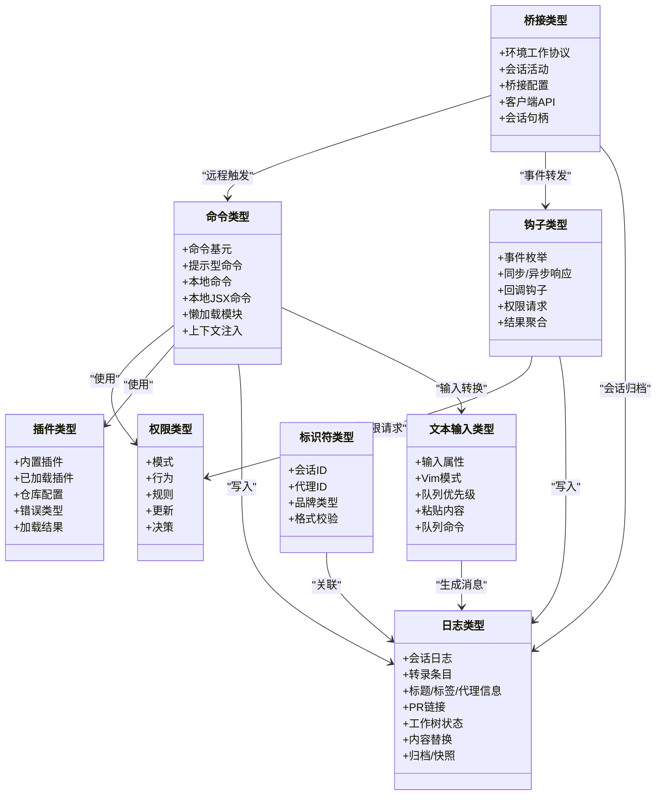

图表来源
- [src/types/command.ts:16-217](file://src/types/command.ts#L16-L217)
- [src/types/hooks.ts:22-291](file://src/types/hooks.ts#L22-L291)
- [src/types/permissions.ts:16-442](file://src/types/permissions.ts#L16-L442)
- [src/types/plugin.ts:18-364](file://src/types/plugin.ts#L18-L364)
- [src/types/textInputTypes.ts:12-388](file://src/types/textInputTypes.ts#L12-L388)
- [src/types/logs.ts:8-331](file://src/types/logs.ts#L8-L331)
- [src/types/ids.ts:6-45](file://src/types/ids.ts#L6-L45)
- [src/bridge/types.ts:18-263](file://src/bridge/types.ts#L18-L263)

## 详细组件分析

### 命令类型（Command）
- 关键点
  - 命令基元 CommandBase：包含名称、别名、描述、可用性、启用状态、隐藏标记、来源、版本、是否可由模型调用、是否用户可调用、是否敏感参数等。
  - 提示型命令 PromptCommand：支持进度消息、内容长度、允许工具、模型、来源、插件信息、非交互禁用、钩子设置、技能根目录、执行上下文（内联/分叉）、代理类型、努力值、路径过滤、动态生成提示内容块。
  - 本地命令 LocalCommand：支持非交互、懒加载模块返回 call。
  - 本地 JSX 命令 LocalJSXCommand：支持懒加载、回调 onDone、上下文合并 ToolUseContext 与 LocalJSXCommandContext（含主题、IDE 安装状态、动态 MCP 配置、恢复入口等）。
  - 结果类型 LocalCommandResult：文本、紧凑结果、跳过。
  - 结果显示 CommandResultDisplay：skip/system/user。
  - 可见名与启用判断辅助函数。
- 典型流程（命令执行）
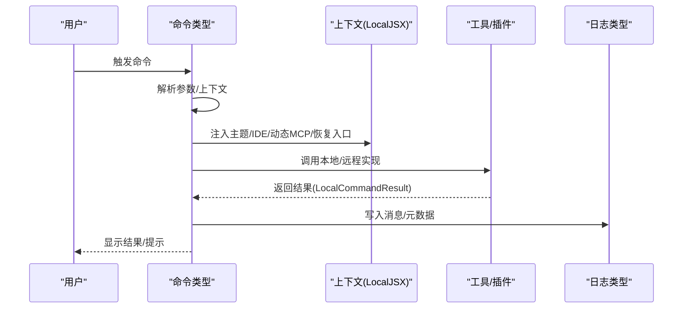

图表来源
- [src/types/command.ts:16-217](file://src/types/command.ts#L16-L217)
- [src/types/logs.ts:8-53](file://src/types/logs.ts#L8-L53)

章节来源
- [src/types/command.ts:16-217](file://src/types/command.ts#L16-L217)
- [src/types/logs.ts:8-53](file://src/types/logs.ts#L8-L53)

### 钩子类型（Hooks）
- 关键点
  - 事件枚举与类型守卫：isHookEvent、isSyncHookJSONOutput、isAsyncHookJSONOutput。
  - 同步响应模式 syncHookResponseSchema：包含 continue、suppressOutput、stopReason、decision、reason、systemMessage、hookSpecificOutput 等字段，其中 hookSpecificOutput 使用联合类型区分不同事件（如 PreToolUse、UserPromptSubmit、SessionStart、Setup、SubagentStart、PostToolUse、PostToolUseFailure、PermissionDenied、Notification、PermissionRequest、Elicitation、ElicitationResult、CwdChanged、FileChanged、WorktreeCreate）。
  - 异步响应模式：async 字段为 true。
  - Zod 模式与编译期类型对齐：Assert<IsEqual<SchemaHookJSONOutput, HookJSONOutput>>。
  - 回调钩子 HookCallback：包含回调签名、超时、内部标记。
  - 结果聚合：HookResult 与 AggregatedHookResult，支持阻塞错误、权限行为、额外上下文、更新输入/输出等。
- 典型流程（权限请求）
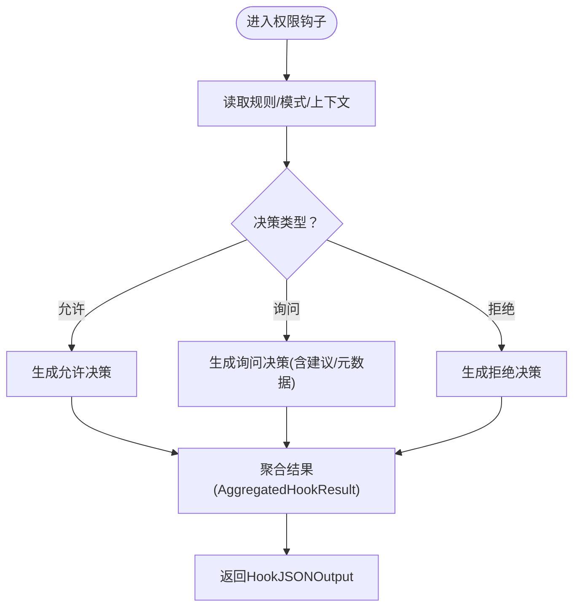

图表来源
- [src/types/hooks.ts:22-291](file://src/types/hooks.ts#L22-L291)
- [src/types/permissions.ts:16-442](file://src/types/permissions.ts#L16-L442)

章节来源
- [src/types/hooks.ts:22-291](file://src/types/hooks.ts#L22-L291)
- [src/types/permissions.ts:16-442](file://src/types/permissions.ts#L16-L442)

### 权限类型（Permissions）
- 关键点
  - 外部/内部权限模式：EXTERNAL_PERMISSION_MODES、INTERNAL_PERMISSION_MODES、PERMISSION_MODES。
  - 权限行为：allow/deny/ask/passthrough。
  - 权限规则：来源（用户设置/项目设置/本地设置/标志/策略/命令/会话）、行为、值（工具名+可选内容）。
  - 权限更新：添加/替换/移除规则、设置模式、增删目录。
  - 决策结果：允许（可携带更新输入/内容块）、询问（可携带建议/元数据/异步分类器）、拒绝。
  - 分类器：YoloClassifierResult，包含阶段、令牌用量、持续时间、请求 ID/消息 ID 等。
  - 工具权限上下文：模式、附加工作目录、各来源规则集合、旁路权限可用性等。
- 典型流程（权限决策）
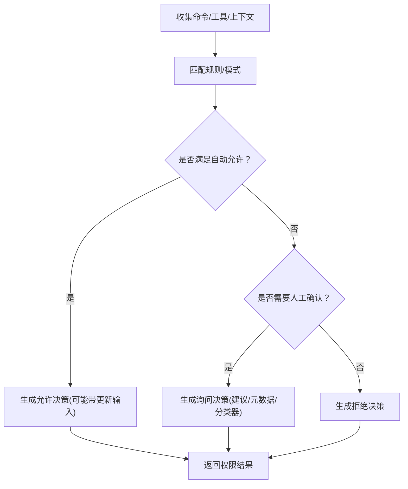

图表来源
- [src/types/permissions.ts:16-442](file://src/types/permissions.ts#L16-L442)

章节来源
- [src/types/permissions.ts:16-442](file://src/types/permissions.ts#L16-L442)

### 插件类型（Plugin）
- 关键点
  - 内置插件：名称、描述、版本、技能、钩子、MCP 服务器、可用性、默认启用。
  - 已加载插件：路径、来源、仓库、命令/代理/技能/输出样式路径、钩子配置、MCP/LSP 服务器、设置。
  - 插件错误：路径不存在、Git 认证失败、网络错误、清单解析/验证失败、市场不可用、MCP/LSP 配置无效/启动失败、请求超时/失败、策略限制、依赖未满足、缓存缺失、通用错误等。
  - 加载结果：启用/禁用列表与错误列表。
  - 错误消息化：统一的错误消息生成函数。
- 典型流程（插件加载）
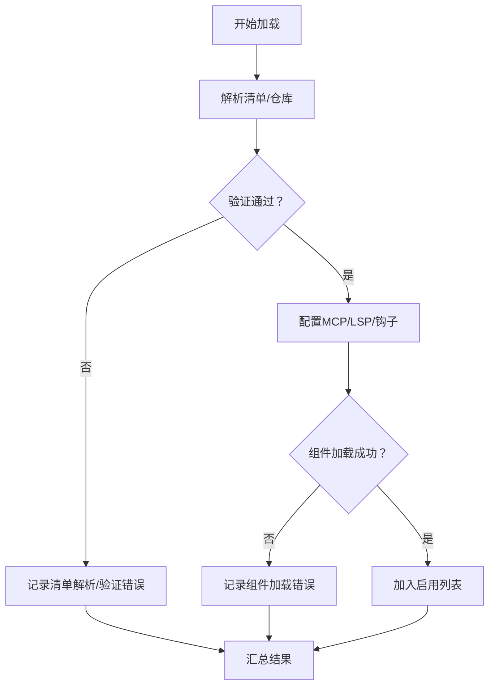

图表来源
- [src/types/plugin.ts:18-364](file://src/types/plugin.ts#L18-L364)

章节来源
- [src/types/plugin.ts:18-364](file://src/types/plugin.ts#L18-L364)

### 文本输入类型（TextInputTypes）
- 关键点
  - 基础输入属性：占位符、多行、焦点、掩码、光标、高亮粘贴、历史导航、提交/退出回调、列数/最大可见行、图像粘贴、大文本粘贴、输入过滤等。
  - Vim 输入：初始模式、模式变更回调。
  - 输入状态：光标偏移、行/列、视窗字符偏移、粘贴状态。
  - 输入模式：bash/prompt/orphaned-permission/task-notification；可编辑模式排除通知类。
  - 队列优先级：now/next/later；不同模式对应中断/中转/回合末处理语义。
  - 队列命令：值（字符串或内容块数组）、模式、优先级、UUID、孤儿权限、粘贴内容、跳过斜杠命令、桥接来源、meta 标记、来源、工作负载标签、代理 ID。
  - 图像粘贴有效性与 ID 提取。
- 典型流程（输入到消息）
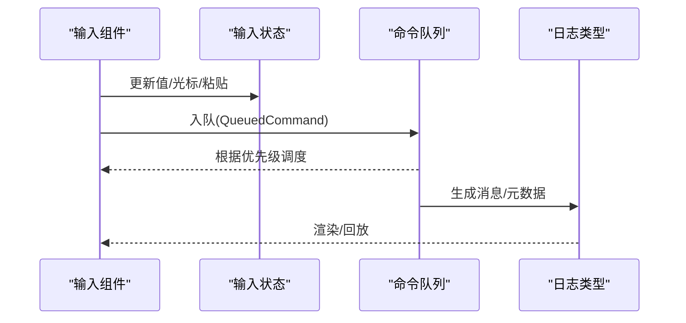

图表来源
- [src/types/textInputTypes.ts:12-388](file://src/types/textInputTypes.ts#L12-L388)
- [src/types/logs.ts:8-53](file://src/types/logs.ts#L8-L53)

章节来源
- [src/types/textInputTypes.ts:12-388](file://src/types/textInputTypes.ts#L12-L388)
- [src/types/logs.ts:8-53](file://src/types/logs.ts#L8-L53)

### 日志类型（Logs）
- 关键点
  - 序列化消息：包含工作目录、用户类型、入口点、会话 ID、时间戳、版本、Git 分支/Slug 等。
  - 日志选项：日期、消息数组、全路径、数值、创建/修改时间、首条提示、消息数量、文件大小、侧链标记、轻量日志、团队/代理信息、PR 链接、模式、工作树会话、内容替换、上下文折叠提交/快照、文件历史/归属快照等。
  - 特殊消息：摘要、自定义标题、AI 标题、最后提示、任务摘要、标签、代理名/颜色/设置、PR 链接、模式、工作树状态、内容替换、文件历史快照、归属快照、队列操作、推测接受、上下文折叠提交/快照。
  - 聚合排序：按修改时间倒序，若相等则按创建时间倒序。
- 典型流程（日志持久化与恢复）
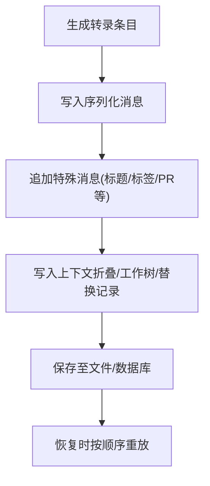

图表来源
- [src/types/logs.ts:8-331](file://src/types/logs.ts#L8-L331)

章节来源
- [src/types/logs.ts:8-331](file://src/types/logs.ts#L8-L331)

### 标识符类型（IDs）
- 关键点
  - 品牌类型：SessionId、AgentId，防止混用。
  - 安全断言：asSessionId/asAgentId。
  - 格式校验：toAgentId，匹配代理 ID 正则。
- 典型流程（ID 校验与断言）
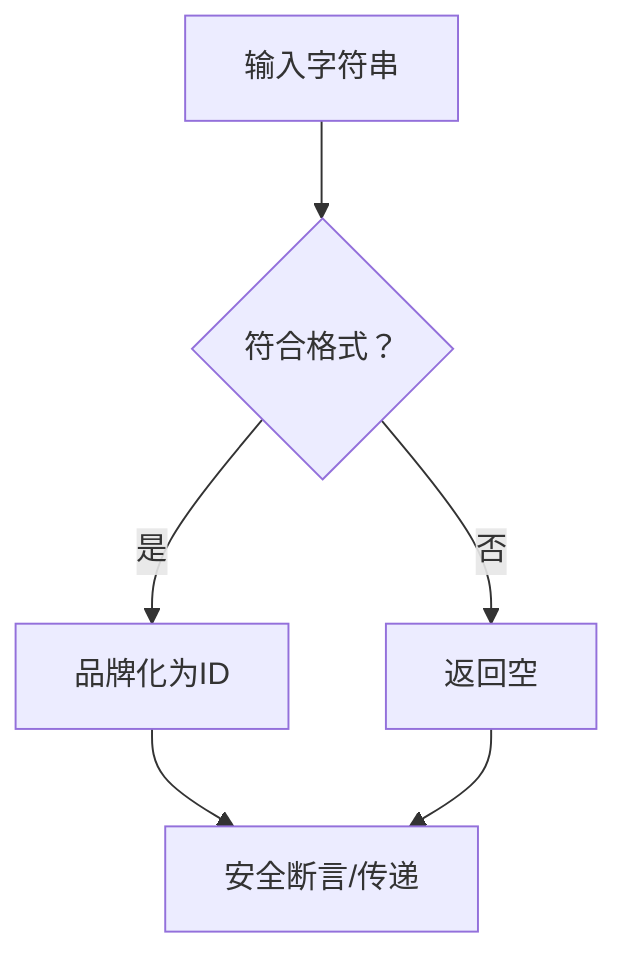

图表来源
- [src/types/ids.ts:6-45](file://src/types/ids.ts#L6-L45)

章节来源
- [src/types/ids.ts:6-45](file://src/types/ids.ts#L6-L45)

### 桥接类型（Bridge）
- 关键点
  - 协议类型：工作数据、工作响应、工作密钥（包含版本、会话入口令牌、API 基址、来源、认证、环境变量、代码会话开关等）。
  - 会话状态：完成/失败/中断。
  - 会话活动：工具开始/文本/结果/错误，附带摘要与时间戳。
  - 会话选择：单会话/工作树/同目录。
  - 工人类型：claude_code/claude_code_assistant。
  - 桥接配置：目录、机器名、分支、Git 仓库、最大会话数、Spawn 模式、详细日志、沙箱、桥接 ID、工人类型、环境 ID、复用环境 ID、API 基址、会话入口 URL、调试文件、会话超时。
  - 客户端 API：注册环境、轮询工作、确认工作、停止工作、注销环境、发送权限响应事件、归档会话、重连会话、心跳、更新访问令牌。
  - 会话句柄：会话 ID、完成 Promise、终止/强制终止、活动列表、当前活动、访问令牌、最后 STDERR、写入标准输入、更新访问令牌。
  - 会话生成器：spawn。
  - 桥接日志器：横幅打印、会话开始/完成/失败、状态更新、调试日志路径、附加状态、失败状态、QR 切换、会话计数/模式显示、会话添加/活动更新/标题设置/移除、强制刷新。
- 典型流程（桥接工作流）
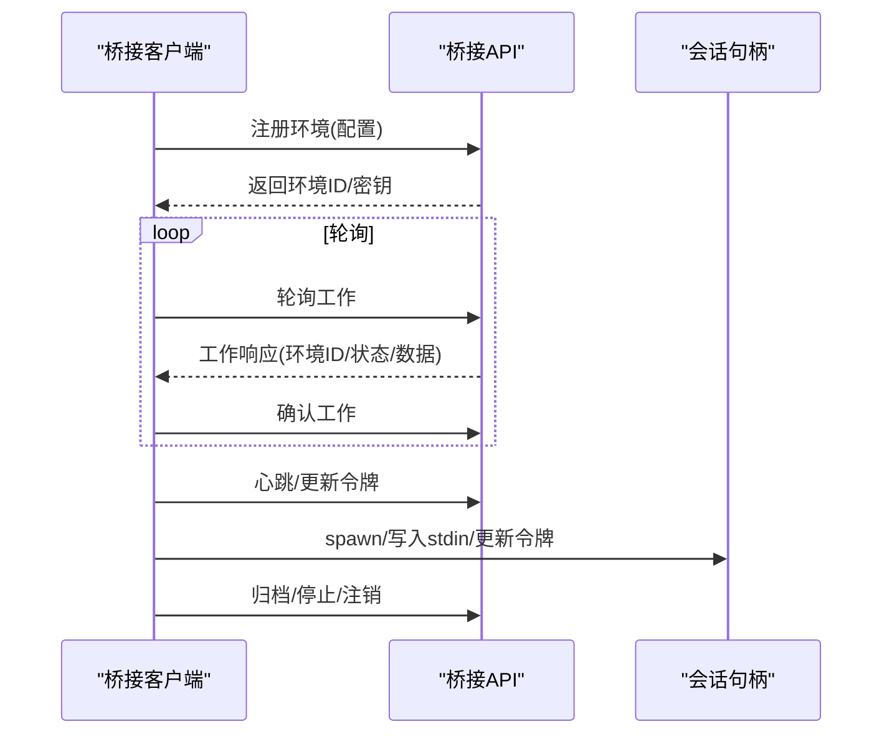

图表来源
- [src/bridge/types.ts:18-263](file://src/bridge/types.ts#L18-L263)

章节来源
- [src/bridge/types.ts:18-263](file://src/bridge/types.ts#L18-L263)

## 依赖关系分析
- 命令类型依赖权限（权限决策）、插件（插件信息/钩子）、日志（消息写入）、文本输入（输入转换）。
- 钩子类型依赖权限（权限请求）、日志（消息写入）。
- 文本输入类型依赖日志（消息生成）。
- 标识符类型被日志与桥接使用以确保会话/代理唯一性。
- 桥接类型为命令与钩子提供远程控制与会话生命周期支撑。

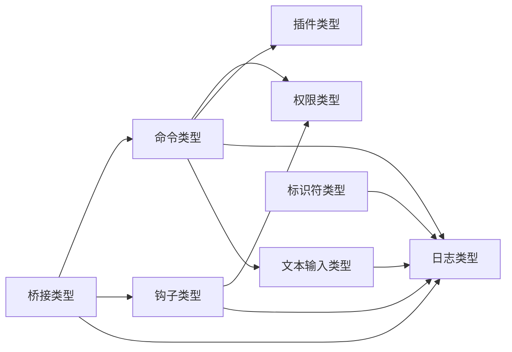

图表来源
- [src/types/command.ts:16-217](file://src/types/command.ts#L16-L217)
- [src/types/hooks.ts:22-291](file://src/types/hooks.ts#L22-L291)
- [src/types/permissions.ts:16-442](file://src/types/permissions.ts#L16-L442)
- [src/types/plugin.ts:18-364](file://src/types/plugin.ts#L18-L364)
- [src/types/textInputTypes.ts:12-388](file://src/types/textInputTypes.ts#L12-L388)
- [src/types/logs.ts:8-331](file://src/types/logs.ts#L8-L331)
- [src/types/ids.ts:6-45](file://src/types/ids.ts#L6-L45)
- [src/bridge/types.ts:18-263](file://src/bridge/types.ts#L18-L263)

章节来源
- [src/types/command.ts:16-217](file://src/types/command.ts#L16-L217)
- [src/types/hooks.ts:22-291](file://src/types/hooks.ts#L22-L291)
- [src/types/permissions.ts:16-442](file://src/types/permissions.ts#L16-L442)
- [src/types/plugin.ts:18-364](file://src/types/plugin.ts#L18-L364)
- [src/types/textInputTypes.ts:12-388](file://src/types/textInputTypes.ts#L12-L388)
- [src/types/logs.ts:8-331](file://src/types/logs.ts#L8-L331)
- [src/types/ids.ts:6-45](file://src/types/ids.ts#L6-L45)
- [src/bridge/types.ts:18-263](file://src/bridge/types.ts#L18-L263)

## 性能考量
- 懒加载命令与钩子：通过懒加载模块延迟重型依赖加载，降低启动开销。
- 品牌类型与格式校验：避免运行时类型错误导致的回退与重试，减少无效调用。
- 队列优先级：合理使用 now/next/later 控制调度，避免不必要的中断与等待。
- 日志聚合：批量写入与快照机制减少频繁 IO，提升恢复效率。
- 分类器异步评估：允许在用户响应前进行自动审批，缩短决策路径。
- 桥接心跳与会话复用：通过会话令牌与心跳延长租约，减少重新建立连接的开销。

## 故障排查指南
- 类型不匹配
  - 使用 Zod 模式与编译期类型对齐，确保 Schema 与 HookJSONOutput 一致。
  - 通过类型守卫（如 isSyncHookJSONOutput/isAsyncHookJSONOutput）在运行时分流处理。
- 权限问题
  - 检查权限模式与规则来源，确认是否命中自动允许/询问/拒绝路径。
  - 利用分类器结果与阶段信息定位超长提示或 API 错误。
- 插件错误
  - 使用统一错误消息生成函数快速定位问题类型（路径不存在、Git 认证失败、网络错误、清单解析/验证失败、市场不可用、MCP/LSP 配置无效/启动失败、请求超时/失败、策略限制、依赖未满足、缓存缺失、通用错误）。
- 输入异常
  - 校验图像粘贴有效性与 ID 提取，避免空内容导致 API 拒绝。
  - 检查队列命令的来源与代理 ID，确保隔离与路由正确。
- 日志恢复
  - 确保上下文折叠提交/快照与工作树状态正确写入与读取，避免恢复偏差。

章节来源
- [src/types/hooks.ts:182-193](file://src/types/hooks.ts#L182-L193)
- [src/types/permissions.ts:330-397](file://src/types/permissions.ts#L330-L397)
- [src/types/plugin.ts:295-363](file://src/types/plugin.ts#L295-L363)
- [src/types/textInputTypes.ts:367-382](file://src/types/textInputTypes.ts#L367-L382)
- [src/types/logs.ts:255-295](file://src/types/logs.ts#L255-L295)

## 结论
本项目的类型系统围绕命令、钩子、权限、插件、输入文本、日志与标识符构建了强类型边界，结合桥接协议实现了远程控制与会话生命周期管理。通过品牌类型、Zod 模式、联合类型与类型守卫，系统在保证类型安全的同时兼顾了灵活性与可扩展性。遵循本文提供的最佳实践与扩展指南，可在保持向后兼容的前提下持续演进类型体系。

## 附录
- 类型安全实践
  - 使用品牌类型区分相似字符串（如 SessionId/AgentId）。
  - 通过 Zod 模式进行运行时校验，并与编译期类型对齐。
  - 使用类型守卫在运行时安全地缩小联合类型范围。
  - 采用只读与深度不可变近似（在纯类型文件中）以避免意外修改。
- 类型推导与断言
  - 优先使用推导而非手动断言；仅在必要时使用 as 进行最小范围断言。
  - 对外部输入（如插件错误消息）使用类型守卫与模式匹配。
- 类型扩展指南
  - 新增类型：先定义接口/联合类型，再补充默认值与校验逻辑。
  - 修改现有类型：保持向后兼容，提供迁移路径与过渡期策略。
  - 维护向后兼容：避免删除/重命名字段；新增字段设为可选并提供默认值。
- 常量类型、枚举与联合
  - 使用字面量联合表达有限取值（如 QueuePriority、PromptInputMode），提升可读性与安全性。
  - 使用 const 全局常量（如 EXTERNAL_PERMISSION_MODES/INTERNAL_PERMISSION_MODES）统一来源。
- 类型文档生成、类型检查与类型安全测试
  - 文档生成：利用 IDE/TS 工具生成类型签名与注释文档。
  - 类型检查：开启严格模式与 noImplicitAny，定期运行 tsc。
  - 类型安全测试：编写针对关键类型组合的单元测试，覆盖边界条件与错误路径。