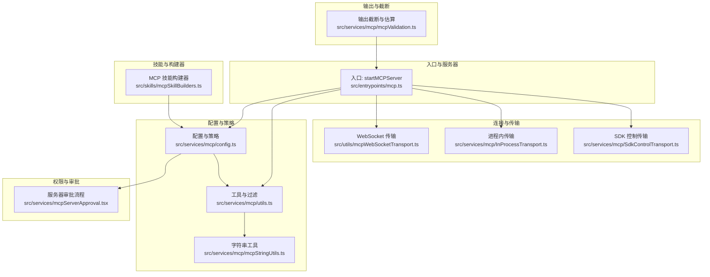
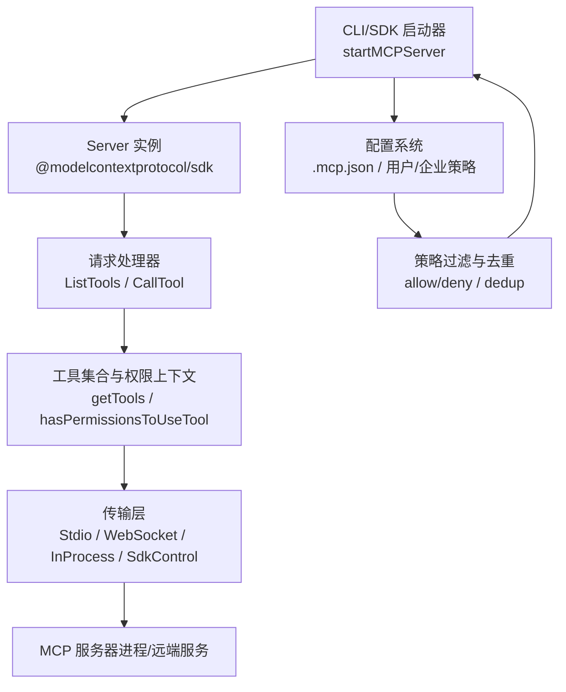
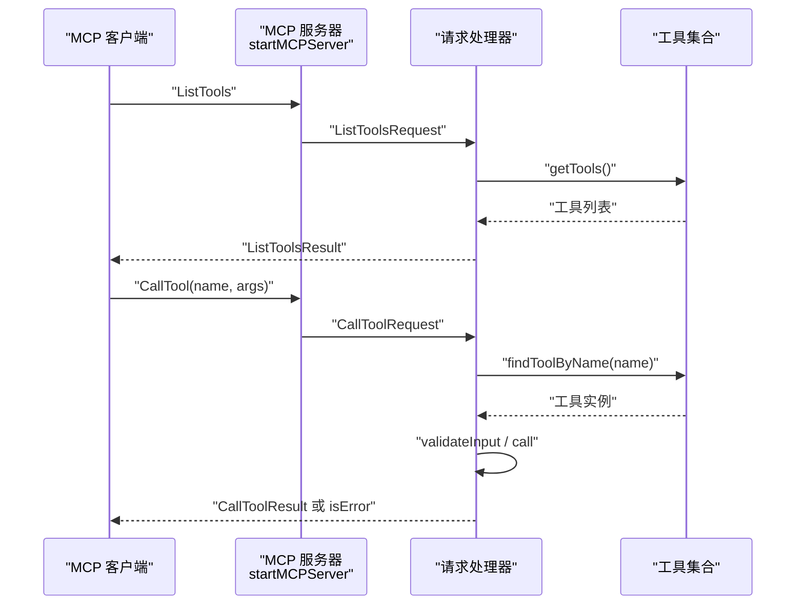
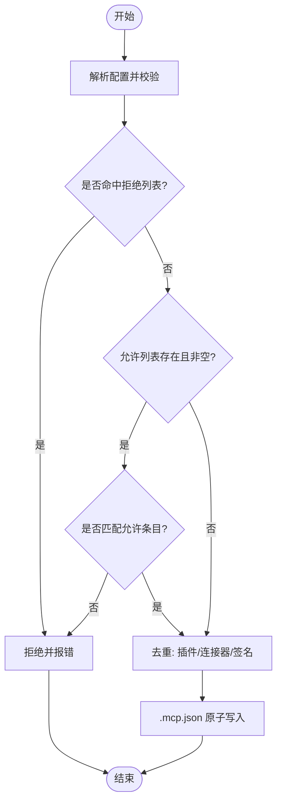
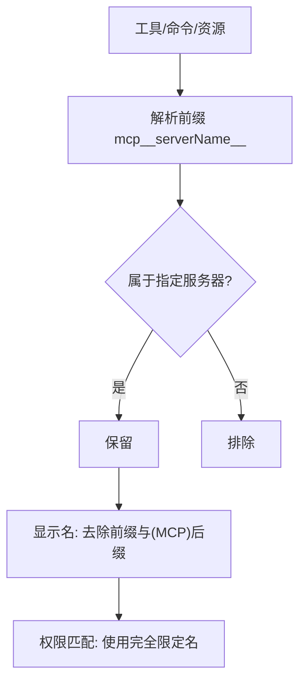
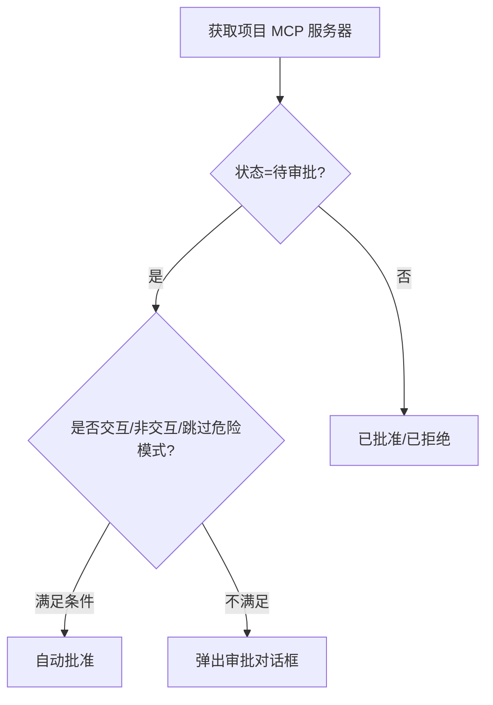
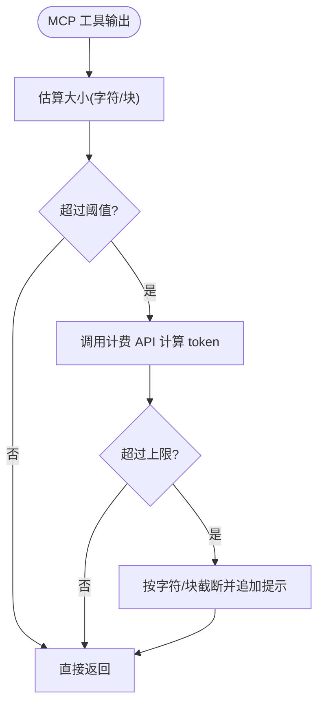
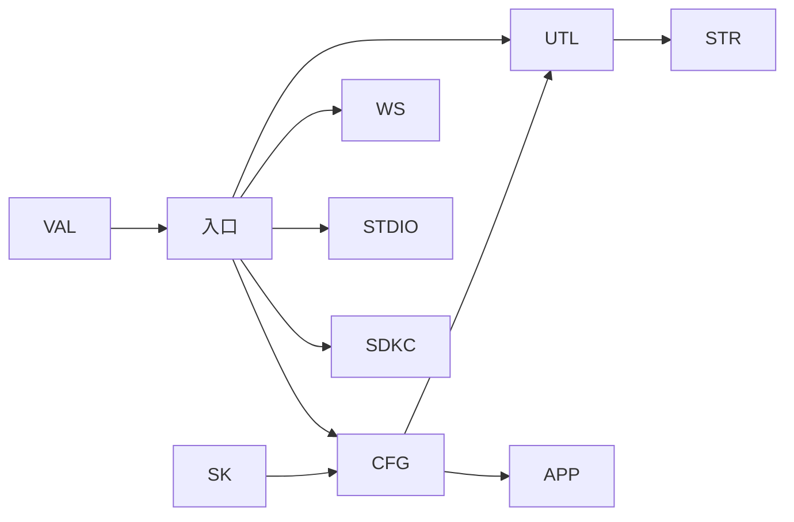

# MCP 协议概念

<cite>
**本文引用的文件**
- [src/entrypoints/mcp.ts](file://src/entrypoints/mcp.ts)
- [src/commands/mcp/mcp.tsx](file://src/commands/mcp/mcp.tsx)
- [src/services/mcp/config.ts](file://src/services/mcp/config.ts)
- [src/services/mcp/utils.ts](file://src/services/mcp/utils.ts)
- [src/services/mcp/mcpStringUtils.ts](file://src/services/mcp/mcpStringUtils.ts)
- [src/services/mcpServerApproval.tsx](file://src/services/mcpServerApproval.tsx)
- [src/services/mcp/mcpValidation.ts](file://src/services/mcp/mcpValidation.ts)
- [src/utils/mcpWebSocketTransport.ts](file://src/utils/mcpWebSocketTransport.ts)
- [src/services/mcp/InProcessTransport.ts](file://src/services/mcp/InProcessTransport.ts)
- [src/services/mcp/SdkControlTransport.ts](file://src/services/mcp/SdkControlTransport.ts)
- [src/skills/mcpSkillBuilders.ts](file://src/skills/mcpSkillBuilders.ts)
</cite>

## 目录
1. [引言](#引言)
2. [项目结构](#项目结构)
3. [核心组件](#核心组件)
4. [架构总览](#架构总览)
5. [详细组件分析](#详细组件分析)
6. [依赖关系分析](#依赖关系分析)
7. [性能考量](#性能考量)
8. [故障排查指南](#故障排查指南)
9. [结论](#结论)
10. [附录](#附录)

## 引言
本文件系统性阐述 Model Context Protocol（MCP）在 Claude Code 中的概念、设计与实现。MCP 是一个标准化协议，用于在 AI 助手与外部工具/资源之间建立可发现、可调用、可授权的交互通道。在 Claude Code 中，MCP 通过统一的服务器配置、命名空间、权限与传输抽象，将本地命令行工具、远程服务（HTTP/WebSocket）、以及插件生态无缝整合到同一工具调用体系中，从而显著扩展 AI 助手的能力边界。

## 项目结构
围绕 MCP 的关键模块分布如下：
- 入口与服务器：提供 MCP 服务器进程入口，暴露工具清单与调用能力
- 配置与策略：管理 .mcp.json、用户/项目/企业级配置，策略过滤与去重
- 工具与命令：对 MCP 工具进行命名规范化、显示名解析、过滤与归属判定
- 连接与传输：支持 stdio、HTTP、WebSocket、以及进程内/控制通道等传输
- 权限与审批：项目级 MCP 服务器的批准流程与状态管理
- 技能与构建器：MCP 技能发现与加载的注册机制
- 输出与截断：MCP 工具输出的大小估算与安全截断



**图表来源**
- [src/entrypoints/mcp.ts:35-196](file://src/entrypoints/mcp.ts#L35-L196)
- [src/services/mcp/config.ts:1-800](file://src/services/mcp/config.ts#L1-L800)
- [src/services/mcp/utils.ts:1-576](file://src/services/mcp/utils.ts#L1-L576)
- [src/services/mcp/mcpStringUtils.ts:1-107](file://src/services/mcp/mcpStringUtils.ts#L1-L107)
- [src/services/mcpServerApproval.tsx:1-41](file://src/services/mcpServerApproval.tsx#L1-L41)
- [src/utils/mcpWebSocketTransport.ts:1-201](file://src/utils/mcpWebSocketTransport.ts#L1-L201)
- [src/services/mcp/InProcessTransport.ts:1-63](file://src/services/mcp/InProcessTransport.ts#L1-L63)
- [src/services/mcp/SdkControlTransport.ts:39-86](file://src/services/mcp/SdkControlTransport.ts#L39-L86)
- [src/skills/mcpSkillBuilders.ts:1-45](file://src/skills/mcpSkillBuilders.ts#L1-L45)
- [src/services/mcp/mcpValidation.ts:1-209](file://src/services/mcp/mcpValidation.ts#L1-L209)

**章节来源**
- [src/entrypoints/mcp.ts:35-196](file://src/entrypoints/mcp.ts#L35-L196)
- [src/services/mcp/config.ts:1-800](file://src/services/mcp/config.ts#L1-L800)
- [src/services/mcp/utils.ts:1-576](file://src/services/mcp/utils.ts#L1-L576)
- [src/services/mcp/mcpStringUtils.ts:1-107](file://src/services/mcp/mcpStringUtils.ts#L1-L107)
- [src/services/mcpServerApproval.tsx:1-41](file://src/services/mcpServerApproval.tsx#L1-L41)
- [src/utils/mcpWebSocketTransport.ts:1-201](file://src/utils/mcpWebSocketTransport.ts#L1-L201)
- [src/services/mcp/InProcessTransport.ts:1-63](file://src/services/mcp/InProcessTransport.ts#L1-L63)
- [src/services/mcp/SdkControlTransport.ts:39-86](file://src/services/mcp/SdkControlTransport.ts#L39-L86)
- [src/skills/mcpSkillBuilders.ts:1-45](file://src/skills/mcpSkillBuilders.ts#L1-L45)
- [src/services/mcp/mcpValidation.ts:1-209](file://src/services/mcp/mcpValidation.ts#L1-L209)

## 核心组件
- MCP 服务器入口：负责初始化 Server、注册 ListTools 与 CallTool 请求处理器、绑定传输层并启动监听
- 配置与策略：解析与合并多源配置，执行企业策略（允许/拒绝），去重插件与连接器来源，写入 .mcp.json
- 工具与命令过滤：按服务器前缀过滤工具/命令/资源；判断 MCP 工具/命令归属；计算配置哈希以检测变更
- 字符串与显示名：解析 mcp 命名空间、生成前缀、提取显示名、权限匹配名
- 连接与传输：WebSocket 传输适配、进程内传输对偶、CLI 侧 SDK 控制传输桥接
- 权限与审批：项目级 MCP 服务器的状态（已批准/已拒绝/待审批）与弹窗处理
- 技能与构建器：MCP 技能构建器注册，避免循环依赖
- 输出与截断：估算 MCP 输出大小，必要时截断并附加提示信息

**章节来源**
- [src/entrypoints/mcp.ts:35-196](file://src/entrypoints/mcp.ts#L35-L196)
- [src/services/mcp/config.ts:1-800](file://src/services/mcp/config.ts#L1-L800)
- [src/services/mcp/utils.ts:1-576](file://src/services/mcp/utils.ts#L1-L576)
- [src/services/mcp/mcpStringUtils.ts:1-107](file://src/services/mcp/mcpStringUtils.ts#L1-L107)
- [src/utils/mcpWebSocketTransport.ts:1-201](file://src/utils/mcpWebSocketTransport.ts#L1-L201)
- [src/services/mcp/InProcessTransport.ts:1-63](file://src/services/mcp/InProcessTransport.ts#L1-L63)
- [src/services/mcp/SdkControlTransport.ts:39-86](file://src/services/mcp/SdkControlTransport.ts#L39-L86)
- [src/services/mcpServerApproval.tsx:1-41](file://src/services/mcpServerApproval.tsx#L1-L41)
- [src/skills/mcpSkillBuilders.ts:1-45](file://src/skills/mcpSkillBuilders.ts#L1-L45)
- [src/services/mcp/mcpValidation.ts:1-209](file://src/services/mcp/mcpValidation.ts#L1-L209)

## 架构总览
MCP 在 Claude Code 中采用“统一入口 + 多源配置 + 多传输适配”的架构：
- 统一入口：CLI 或 SDK 进程启动 MCP 服务器，暴露标准工具接口
- 多源配置：支持项目级 .mcp.json、用户全局配置、企业托管配置、动态注入与 claude.ai 连接器
- 传输抽象：支持 stdio（子进程）、HTTP/SSE、WebSocket；同时提供进程内与 SDK 控制桥接
- 安全与策略：基于名称/命令/URL 的允许/拒绝策略，去重与变更检测，项目级审批弹窗
- 能力扩展：通过 MCP 工具/命令/资源与技能构建器，持续扩展 AI 助手能力



**图表来源**
- [src/entrypoints/mcp.ts:35-196](file://src/entrypoints/mcp.ts#L35-L196)
- [src/services/mcp/config.ts:1-800](file://src/services/mcp/config.ts#L1-L800)
- [src/utils/mcpWebSocketTransport.ts:1-201](file://src/utils/mcpWebSocketTransport.ts#L1-L201)
- [src/services/mcp/InProcessTransport.ts:1-63](file://src/services/mcp/InProcessTransport.ts#L1-L63)
- [src/services/mcp/SdkControlTransport.ts:39-86](file://src/services/mcp/SdkControlTransport.ts#L39-L86)

## 详细组件分析

### 组件 A：MCP 服务器入口与消息处理
- 初始化 Server 并声明 capabilities（此处为 tools）
- 注册 ListTools：收集内置工具，转换输入/输出 Schema，生成描述
- 注册 CallTool：根据名称查找工具，构造工具使用上下文，执行校验与调用，返回文本内容或错误标记
- 传输层：StdioServerTransport 启动后与客户端建立连接



**图表来源**
- [src/entrypoints/mcp.ts:59-188](file://src/entrypoints/mcp.ts#L59-L188)

**章节来源**
- [src/entrypoints/mcp.ts:35-196](file://src/entrypoints/mcp.ts#L35-L196)

### 组件 B：配置与策略（含企业策略、去重与写入）
- 写入 .mcp.json：原子写入、保留权限、失败清理
- 去重策略：插件服务器与手动/连接器服务器基于签名去重，优先级明确
- 企业策略：允许/拒绝列表，支持名称、命令数组、URL 模式匹配
- 策略应用：add/remove 时即时校验，过滤时按策略返回被阻止的服务器名



**图表来源**
- [src/services/mcp/config.ts:618-761](file://src/services/mcp/config.ts#L618-L761)

**章节来源**
- [src/services/mcp/config.ts:1-800](file://src/services/mcp/config.ts#L1-L800)

### 组件 C：工具与命令过滤、显示名与权限匹配
- 命名空间：mcp__serverName__toolName 前缀规范化与解析
- 过滤：按服务器前缀过滤工具/命令/资源，排除特定服务器
- 显示名：去除前缀与 (MCP) 后缀，提取用户可见名称
- 权限匹配：MCP 工具使用完全限定名进行规则匹配，避免与内置工具冲突



**图表来源**
- [src/services/mcp/utils.ts:39-94](file://src/services/mcp/utils.ts#L39-L94)
- [src/services/mcp/mcpStringUtils.ts:19-106](file://src/services/mcp/mcpStringUtils.ts#L19-L106)

**章节来源**
- [src/services/mcp/utils.ts:1-576](file://src/services/mcp/utils.ts#L1-L576)
- [src/services/mcp/mcpStringUtils.ts:1-107](file://src/services/mcp/mcpStringUtils.ts#L1-L107)

### 组件 D：传输层（WebSocket、进程内、SDK 控制）
- WebSocketTransport：封装原生 WebSocket/ws，事件监听、错误与关闭清理、发送序列化
- InProcessTransport：进程内成对传输，消息异步投递，关闭双向通知
- SdkControlClientTransport：CLI 侧通过回调桥接 SDK 进程，发送消息并回传响应

```mermaid
classDiagram
class WebSocketTransport {
+start()
+send(message)
+close()
-onBunMessage()
-onNodeMessage()
-handleError()
-handleCloseCleanup()
}
class InProcessTransport {
+start()
+send(message)
+close()
-_setPeer(peer)
}
class SdkControlClientTransport {
+start()
+send(message)
+close()
}
WebSocketTransport ..> "@modelcontextprotocol/sdk/shared/transport.js"
InProcessTransport ..> "@modelcontextprotocol/sdk/shared/transport.js"
SdkControlClientTransport ..> "@modelcontextprotocol/sdk/shared/transport.js"
```

**图表来源**
- [src/utils/mcpWebSocketTransport.ts:22-201](file://src/utils/mcpWebSocketTransport.ts#L22-L201)
- [src/services/mcp/InProcessTransport.ts:11-63](file://src/services/mcp/InProcessTransport.ts#L11-L63)
- [src/services/mcp/SdkControlTransport.ts:60-86](file://src/services/mcp/SdkControlTransport.ts#L60-L86)

**章节来源**
- [src/utils/mcpWebSocketTransport.ts:1-201](file://src/utils/mcpWebSocketTransport.ts#L1-L201)
- [src/services/mcp/InProcessTransport.ts:1-63](file://src/services/mcp/InProcessTransport.ts#L1-L63)
- [src/services/mcp/SdkControlTransport.ts:39-86](file://src/services/mcp/SdkControlTransport.ts#L39-L86)

### 组件 E：权限与审批（项目级 MCP 服务器）
- 状态判定：根据设置与模式（交互/非交互、危险模式跳过）决定已批准/已拒绝/待审批
- 弹窗处理：单个/多个服务器的审批对话框渲染与完成回调



**图表来源**
- [src/services/mcpServerApproval.tsx:15-40](file://src/services/mcpServerApproval.tsx#L15-L40)
- [src/services/mcp/utils.ts:351-406](file://src/services/mcp/utils.ts#L351-L406)

**章节来源**
- [src/services/mcpServerApproval.tsx:1-41](file://src/services/mcpServerApproval.tsx#L1-L41)
- [src/services/mcp/utils.ts:351-406](file://src/services/mcp/utils.ts#L351-L406)

### 组件 F：技能与构建器（MCP 技能发现）
- 注册机制：在模块初始化时注册构建器，避免循环依赖
- 获取：未注册时报错，确保加载顺序正确

**章节来源**
- [src/skills/mcpSkillBuilders.ts:1-45](file://src/skills/mcpSkillBuilders.ts#L1-L45)

### 组件 G：输出与截断（MCP 工具结果）
- 估算：基于字符数粗估 token 数，快速判断是否需要进一步计费 API
- 截断：字符串直接裁剪；内容块按文本/图片分治，图片尝试压缩以节省空间
- 提示：追加截断提示文本，指导用户使用分页/过滤工具



**图表来源**
- [src/services/mcp/mcpValidation.ts:151-209](file://src/services/mcp/mcpValidation.ts#L151-L209)

**章节来源**
- [src/services/mcp/mcpValidation.ts:1-209](file://src/services/mcp/mcpValidation.ts#L1-L209)

## 依赖关系分析
- 组件耦合
  - 入口依赖配置与工具集合，传输层解耦于具体实现
  - 工具过滤依赖字符串工具与配置系统
  - 审批流程依赖设置与渲染框架
  - 技能构建器作为类型级叶子模块，避免循环
- 外部依赖
  - @modelcontextprotocol/sdk：Server、Transport、JSON-RPC 类型
  - ws：Node 环境下的 WebSocket 实现
  - lodash-es：去重与映射工具
- 可能的循环
  - 技能构建器通过注册避免与加载模块形成环



**图表来源**
- [src/entrypoints/mcp.ts:35-196](file://src/entrypoints/mcp.ts#L35-L196)
- [src/services/mcp/config.ts:1-800](file://src/services/mcp/config.ts#L1-L800)
- [src/services/mcp/utils.ts:1-576](file://src/services/mcp/utils.ts#L1-L576)
- [src/services/mcp/mcpStringUtils.ts:1-107](file://src/services/mcp/mcpStringUtils.ts#L1-L107)
- [src/services/mcpServerApproval.tsx:1-41](file://src/services/mcpServerApproval.tsx#L1-L41)
- [src/utils/mcpWebSocketTransport.ts:1-201](file://src/utils/mcpWebSocketTransport.ts#L1-L201)
- [src/services/mcp/InProcessTransport.ts:1-63](file://src/services/mcp/InProcessTransport.ts#L1-L63)
- [src/services/mcp/SdkControlTransport.ts:39-86](file://src/services/mcp/SdkControlTransport.ts#L39-L86)
- [src/skills/mcpSkillBuilders.ts:1-45](file://src/skills/mcpSkillBuilders.ts#L1-L45)
- [src/services/mcp/mcpValidation.ts:1-209](file://src/services/mcp/mcpValidation.ts#L1-L209)

**章节来源**
- [src/entrypoints/mcp.ts:35-196](file://src/entrypoints/mcp.ts#L35-L196)
- [src/services/mcp/config.ts:1-800](file://src/services/mcp/config.ts#L1-L800)
- [src/services/mcp/utils.ts:1-576](file://src/services/mcp/utils.ts#L1-L576)
- [src/services/mcp/mcpStringUtils.ts:1-107](file://src/services/mcp/mcpStringUtils.ts#L1-L107)
- [src/services/mcpServerApproval.tsx:1-41](file://src/services/mcpServerApproval.tsx#L1-L41)
- [src/utils/mcpWebSocketTransport.ts:1-201](file://src/utils/mcpWebSocketTransport.ts#L1-L201)
- [src/services/mcp/InProcessTransport.ts:1-63](file://src/services/mcp/InProcessTransport.ts#L1-L63)
- [src/services/mcp/SdkControlTransport.ts:39-86](file://src/services/mcp/SdkControlTransport.ts#L39-L86)
- [src/skills/mcpSkillBuilders.ts:1-45](file://src/skills/mcpSkillBuilders.ts#L1-L45)
- [src/services/mcp/mcpValidation.ts:1-209](file://src/services/mcp/mcpValidation.ts#L1-L209)

## 性能考量
- 传输层
  - WebSocket 传输在 Bun 与 Node 下分别处理事件与错误，避免阻塞主线程
  - 进程内传输使用微任务异步投递，降低同步调用栈深度风险
- 工具枚举与 Schema
  - ListTools 对输出 Schema 做根级对象约束与联合类型规避，减少无效工具暴露
- 配置写入
  - .mcp.json 原子写入（临时文件 + 原子重命名），减少竞态与损坏
- 输出截断
  - 先以字符数粗估，再按需调用计费 API，平衡准确性与开销

[本节为通用性能讨论，无需特定文件分析]

## 故障排查指南
- 无法连接 MCP 服务器
  - 检查传输层状态与 readyState，确认 start/close 生命周期
  - 查看错误日志与事件监听清理情况
- 工具不可见或调用失败
  - 核对工具命名前缀与规范化，确认过滤逻辑
  - 检查 CallTool 输入校验与权限
- 配置未生效
  - 确认策略过滤（允许/拒绝）与去重结果
  - 检查 .mcp.json 写入是否成功与权限保留
- 输出过大被截断
  - 调整 MAX_MCP_OUTPUT_TOKENS 或使用分页/过滤工具
  - 关注截断提示文本，评估是否需要降采样（如图片压缩）

**章节来源**
- [src/utils/mcpWebSocketTransport.ts:142-201](file://src/utils/mcpWebSocketTransport.ts#L142-L201)
- [src/services/mcp/InProcessTransport.ts:24-48](file://src/services/mcp/InProcessTransport.ts#L24-L48)
- [src/services/mcp/utils.ts:157-169](file://src/services/mcp/utils.ts#L157-L169)
- [src/services/mcp/config.ts:88-131](file://src/services/mcp/config.ts#L88-L131)
- [src/services/mcp/mcpValidation.ts:151-209](file://src/services/mcp/mcpValidation.ts#L151-L209)

## 结论
MCP 在 Claude Code 中通过统一的入口、多源配置、策略与传输抽象，实现了对本地工具、远程服务与插件生态的标准化接入。它不仅扩展了 AI 助手的能力边界，还提供了严格的权限控制、项目级审批与安全输出截断机制，确保在开放生态下保持可控与稳定。未来可在协议标准化、版本演进与跨平台一致性方面持续完善。

[本节为总结性内容，无需特定文件分析]

## 附录
- 命令入口（前端）：/mcp 命令菜单，支持启用/禁用、重连与设置跳转
- 版本与能力：服务器元数据包含 name/version，capabilities 为 tools
- 数据模型要点
  - 工具命名：mcp__serverName__toolName
  - 显示名：去除前缀与 (MCP) 后缀
  - 输出：文本块或混合内容，支持截断与压缩

**章节来源**
- [src/commands/mcp/mcp.tsx:63-84](file://src/commands/mcp/mcp.tsx#L63-L84)
- [src/entrypoints/mcp.ts:47-57](file://src/entrypoints/mcp.ts#L47-L57)
- [src/services/mcp/mcpStringUtils.ts:75-106](file://src/services/mcp/mcpStringUtils.ts#L75-L106)