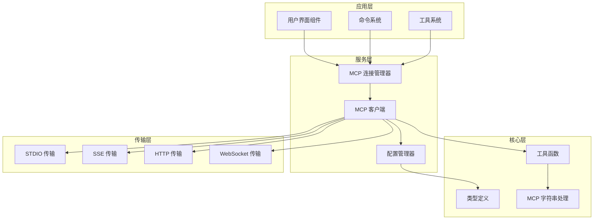
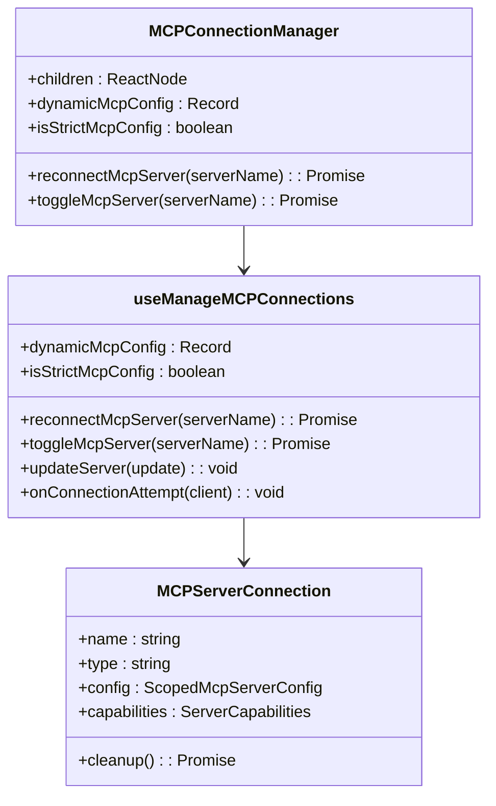
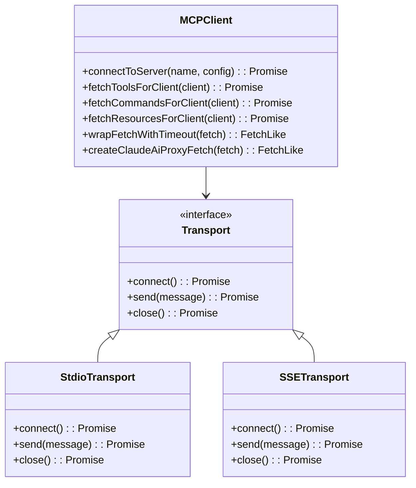
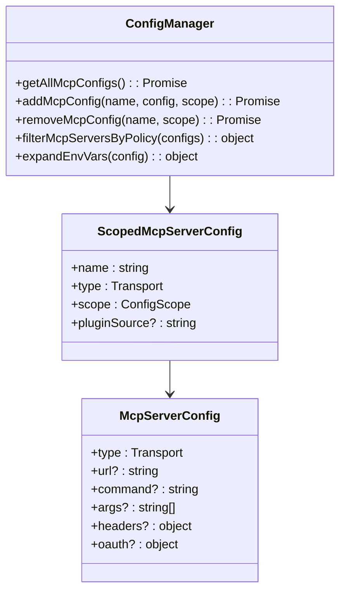
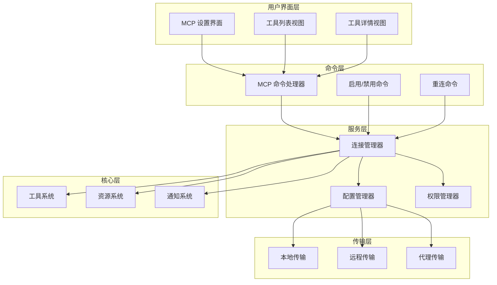
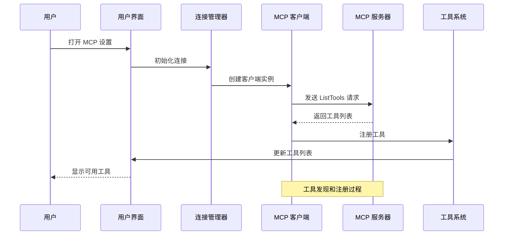
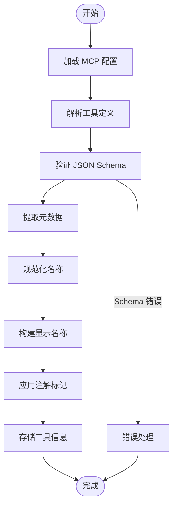
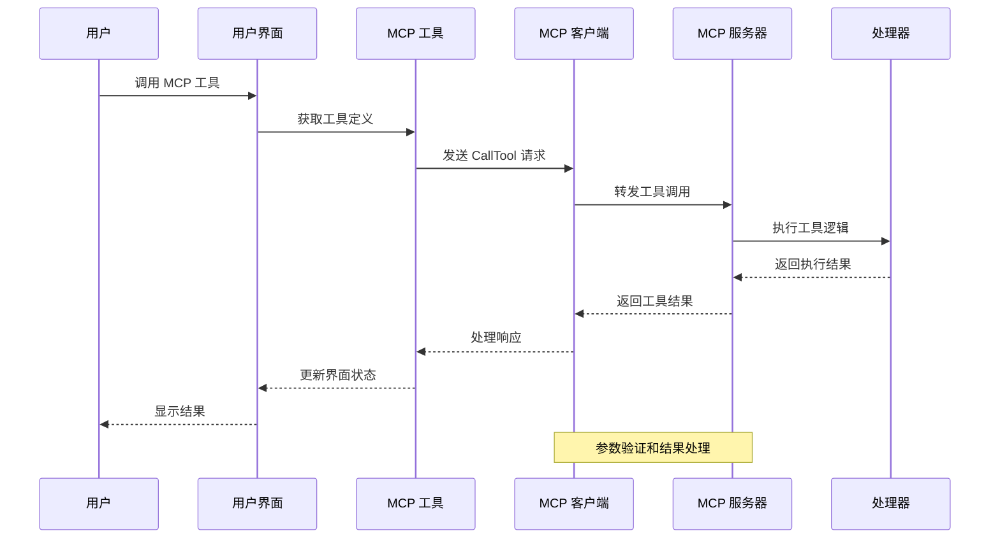
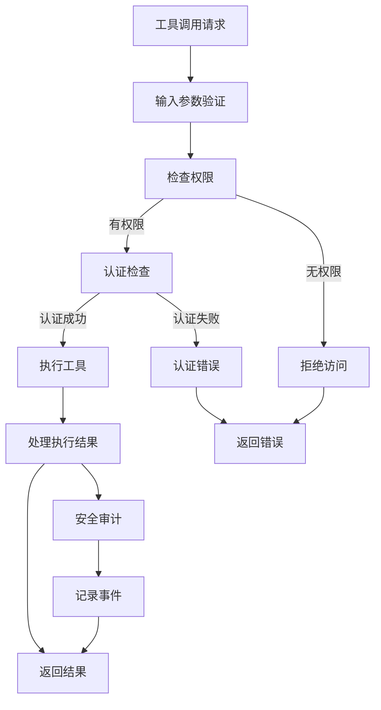

# MCP 工具集成

<cite>
**本文档引用的文件**
- [src/entrypoints/mcp.ts](file://src/entrypoints/mcp.ts)
- [src/services/mcp/client.ts](file://src/services/mcp/client.ts)
- [src/services/mcp/types.ts](file://src/services/mcp/types.ts)
- [src/services/mcp/utils.ts](file://src/services/mcp/utils.ts)
- [src/services/mcp/mcpStringUtils.ts](file://src/services/mcp/mcpStringUtils.ts)
- [src/services/mcp/config.ts](file://src/services/mcp/config.ts)
- [src/services/mcp/useManageMCPConnections.ts](file://src/services/mcp/useManageMCPConnections.ts)
- [src/services/mcp/MCPConnectionManager.tsx](file://src/services/mcp/MCPConnectionManager.tsx)
- [src/tools/MCPTool/MCPTool.ts](file://src/tools/MCPTool/MCPTool.ts)
- [src/components/mcp/MCPSettings.tsx](file://src/components/mcp/MCPSettings.tsx)
- [src/components/mcp/MCPToolListView.tsx](file://src/components/mcp/MCPToolListView.tsx)
- [src/commands/mcp/index.ts](file://src/commands/mcp/index.ts)
- [src/commands/mcp/mcp.tsx](file://src/commands/mcp/mcp.tsx)
</cite>

## 目录
1. [简介](#简介)
2. [项目结构](#项目结构)
3. [核心组件](#核心组件)
4. [架构概览](#架构概览)
5. [详细组件分析](#详细组件分析)
6. [依赖关系分析](#依赖关系分析)
7. [性能考虑](#性能考虑)
8. [故障排除指南](#故障排除指南)
9. [结论](#结论)

## 简介

MCP（Model Context Protocol）工具集成功能是 Claude Code 的核心扩展机制，允许开发者通过 MCP 协议将外部工具和服务无缝集成到 Claude Code 中。该系统支持多种传输协议（STDIO、SSE、HTTP、WebSocket），提供了完整的工具发现、注册、权限控制和安全验证机制。

MCP 工具集成功能的核心价值在于：
- **统一的工具接口**：通过标准化的 MCP 协议，统一管理各种外部工具
- **灵活的传输支持**：支持本地进程、远程服务等多种连接方式
- **强大的权限控制**：内置企业级权限管理和安全验证机制
- **丰富的工具生态**：支持从简单的命令行工具到复杂的 AI 代理服务

## 项目结构

MCP 工具集成系统采用模块化设计，主要分为以下几个核心层次：



**图表来源**
- [src/services/mcp/MCPConnectionManager.tsx:37-72](file://src/services/mcp/MCPConnectionManager.tsx#L37-L72)
- [src/services/mcp/client.ts:1-100](file://src/services/mcp/client.ts#L1-L100)
- [src/services/mcp/types.ts:1-50](file://src/services/mcp/types.ts#L1-L50)

**章节来源**
- [src/services/mcp/MCPConnectionManager.tsx:37-72](file://src/services/mcp/MCPConnectionManager.tsx#L37-L72)
- [src/services/mcp/client.ts:1-100](file://src/services/mcp/client.ts#L1-L100)
- [src/services/mcp/types.ts:1-50](file://src/services/mcp/types.ts#L1-L50)

## 核心组件

### MCP 连接管理器

MCP 连接管理器是整个系统的中枢，负责协调所有 MCP 服务器的连接和通信。



**图表来源**
- [src/services/mcp/MCPConnectionManager.tsx:31-72](file://src/services/mcp/MCPConnectionManager.tsx#L31-L72)
- [src/services/mcp/useManageMCPConnections.ts:143-146](file://src/services/mcp/useManageMCPConnections.ts#L143-L146)

### MCP 客户端

MCP 客户端负责与远程 MCP 服务器进行实际的通信交互。



**图表来源**
- [src/services/mcp/client.ts:595-620](file://src/services/mcp/client.ts#L595-L620)
- [src/services/mcp/client.ts:784-800](file://src/services/mcp/client.ts#L784-L800)

### 配置管理系统

配置管理系统负责管理 MCP 服务器的各种配置信息和策略。



**图表来源**
- [src/services/mcp/config.ts:625-761](file://src/services/mcp/config.ts#L625-L761)
- [src/services/mcp/types.ts:163-178](file://src/services/mcp/types.ts#L163-L178)

**章节来源**
- [src/services/mcp/MCPConnectionManager.tsx:37-72](file://src/services/mcp/MCPConnectionManager.tsx#L37-L72)
- [src/services/mcp/client.ts:1-100](file://src/services/mcp/client.ts#L1-L100)
- [src/services/mcp/config.ts:625-761](file://src/services/mcp/config.ts#L625-L761)

## 架构概览

MCP 工具集成系统采用分层架构设计，确保了良好的可扩展性和维护性。



**图表来源**
- [src/commands/mcp/mcp.tsx:63-84](file://src/commands/mcp/mcp.tsx#L63-L84)
- [src/services/mcp/useManageMCPConnections.ts:143-146](file://src/services/mcp/useManageMCPConnections.ts#L143-L146)

## 详细组件分析

### 工具发现和注册流程

MCP 工具的发现和注册是一个自动化的过程，系统会自动扫描并注册可用的工具。



**图表来源**
- [src/services/mcp/client.ts:595-620](file://src/services/mcp/client.ts#L595-L620)
- [src/services/mcp/useManageMCPConnections.ts:310-323](file://src/services/mcp/useManageMCPConnections.ts#L310-L323)

### 工具元数据获取和展示

MCP 工具的元数据管理确保了工具信息的准确性和一致性。



**图表来源**
- [src/entrypoints/mcp.ts:59-96](file://src/entrypoints/mcp.ts#L59-L96)
- [src/services/mcp/mcpStringUtils.ts:75-106](file://src/services/mcp/mcpStringUtils.ts#L75-L106)

### 工具调用机制

MCP 工具的调用机制提供了完整的参数传递和结果处理流程。



**图表来源**
- [src/entrypoints/mcp.ts:99-187](file://src/entrypoints/mcp.ts#L99-L187)
- [src/services/mcp/client.ts:1-100](file://src/services/mcp/client.ts#L1-L100)

### 权限控制和安全验证

MCP 系统实现了多层次的安全验证和权限控制机制。



**图表来源**
- [src/services/mcp/client.ts:146-186](file://src/services/mcp/client.ts#L146-L186)
- [src/services/mcp/utils.ts:351-406](file://src/services/mcp/utils.ts#L351-L406)

**章节来源**
- [src/entrypoints/mcp.ts:59-187](file://src/entrypoints/mcp.ts#L59-L187)
- [src/services/mcp/client.ts:146-186](file://src/services/mcp/client.ts#L146-L186)
- [src/services/mcp/utils.ts:351-406](file://src/services/mcp/utils.ts#L351-L406)

## 依赖关系分析

MCP 工具集成系统具有清晰的依赖关系和模块化设计。

```mermaid
graph TB
subgraph "外部依赖"
SDK[@modelcontextprotocol/sdk]
Zod[zod]
Lodash[lodash-es]
React[react]
end
subgraph "内部模块"
EntryPoints[入口点]
Services[服务层]
Components[组件层]
Tools[工具层]
Utils[工具函数]
end
subgraph "核心功能"
Connection[连接管理]
Discovery[工具发现]
Permission[权限控制]
Transport[传输层]
end
EntryPoints --> Services
Services --> Components
Services --> Tools
Services --> Utils
Tools --> Utils
Components --> Utils
Services --> SDK
Services --> Zod
Services --> Lodash
Components --> React
Services --> Connection
Services --> Discovery
Services --> Permission
Services --> Transport
```

**图表来源**
- [src/entrypoints/mcp.ts:1-29](file://src/entrypoints/mcp.ts#L1-L29)
- [src/services/mcp/client.ts:1-42](file://src/services/mcp/client.ts#L1-L42)

**章节来源**
- [src/entrypoints/mcp.ts:1-29](file://src/entrypoints/mcp.ts#L1-L29)
- [src/services/mcp/client.ts:1-42](file://src/services/mcp/client.ts#L1-L42)

## 性能考虑

MCP 工具集成系统在设计时充分考虑了性能优化：

### 缓存策略
- **工具列表缓存**：使用内存缓存避免重复查询
- **认证令牌缓存**：减少频繁的认证请求
- **配置文件缓存**：优化配置读取性能

### 并发处理
- **批量连接**：支持多服务器并发连接
- **异步操作**：非阻塞的工具调用
- **连接池管理**：复用连接减少资源消耗

### 内存管理
- **LRU 缓存**：限制内存使用量
- **垃圾回收**：及时清理不再使用的资源
- **流式处理**：大文件和大数据的流式传输

## 故障排除指南

### 常见问题和解决方案

#### 连接问题
1. **服务器无法连接**
   - 检查网络连接和防火墙设置
   - 验证服务器 URL 和端口配置
   - 确认认证凭据正确性

2. **认证失败**
   - 检查 OAuth 配置
   - 验证访问令牌有效性
   - 确认权限范围设置

#### 工具调用问题
1. **工具执行失败**
   - 检查工具参数格式
   - 验证工具依赖环境
   - 查看服务器日志

2. **超时错误**
   - 增加超时时间配置
   - 检查服务器性能
   - 优化网络连接

#### 权限问题
1. **访问被拒绝**
   - 检查企业策略配置
   - 验证用户权限设置
   - 确认工具白名单

**章节来源**
- [src/services/mcp/client.ts:193-206](file://src/services/mcp/client.ts#L193-L206)
- [src/services/mcp/config.ts:625-761](file://src/services/mcp/config.ts#L625-L761)

## 结论

MCP 工具集成功能为 Claude Code 提供了一个强大而灵活的扩展平台。通过标准化的 MCP 协议和完善的架构设计，系统实现了：

- **统一的工具管理**：通过标准化接口管理各种外部工具
- **灵活的部署选项**：支持本地和远程工具部署
- **强大的安全机制**：多层次的权限控制和安全验证
- **优秀的用户体验**：直观的界面和流畅的操作体验

该系统的设计充分考虑了可扩展性、性能和安全性，在保证功能完整性的同时，也为未来的功能扩展奠定了坚实的基础。对于开发者而言，MCP 工具集成为他们提供了一个标准化的工具发布和集成平台；对于用户而言，则获得了一个功能丰富、安全可靠的工具生态系统。

随着 MCP 协议的不断发展和完善，预计该工具集成功能将在未来发挥更加重要的作用，为 Claude Code 生态系统带来更多的可能性和创新。