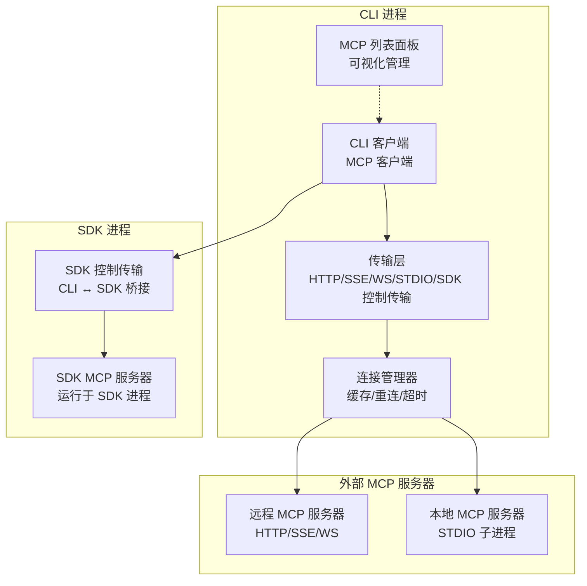
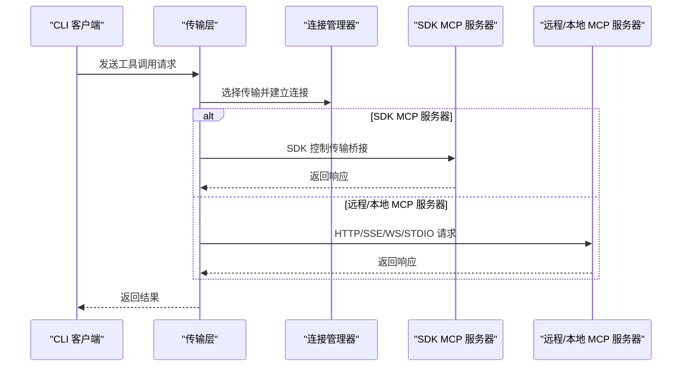
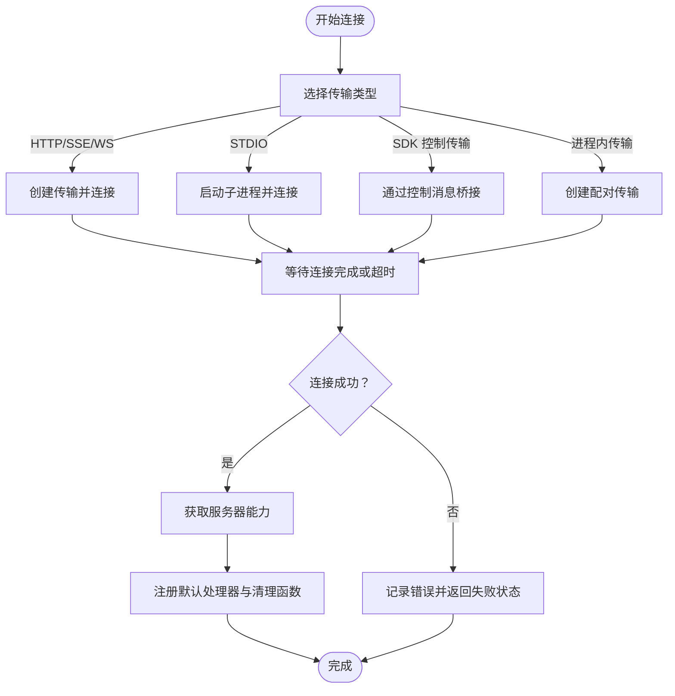
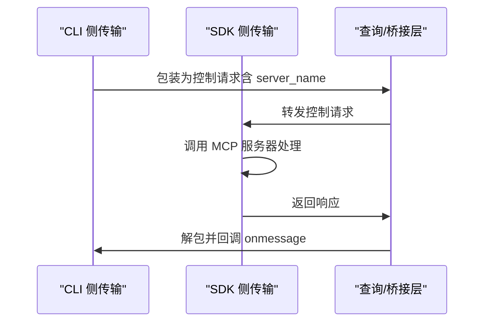
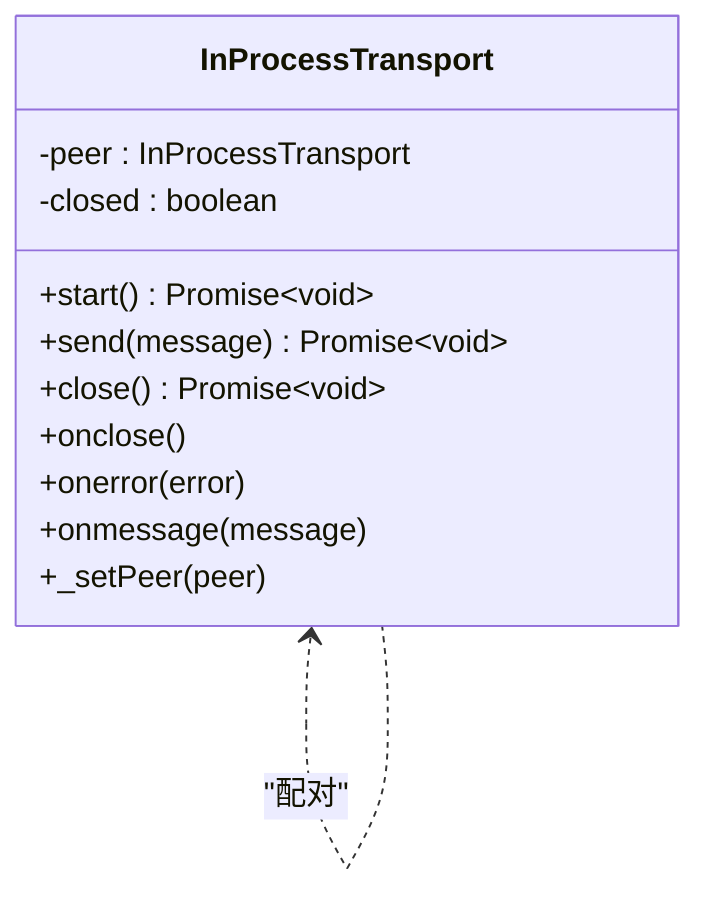
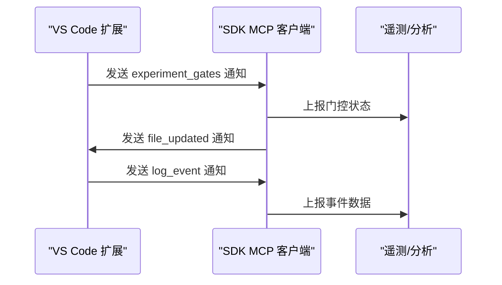
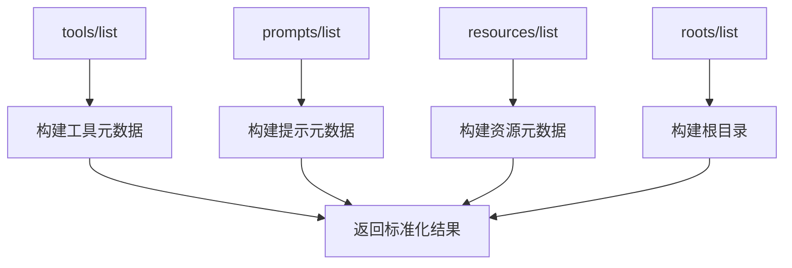
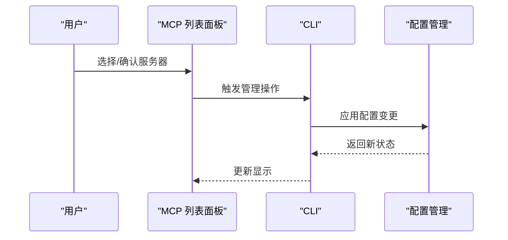
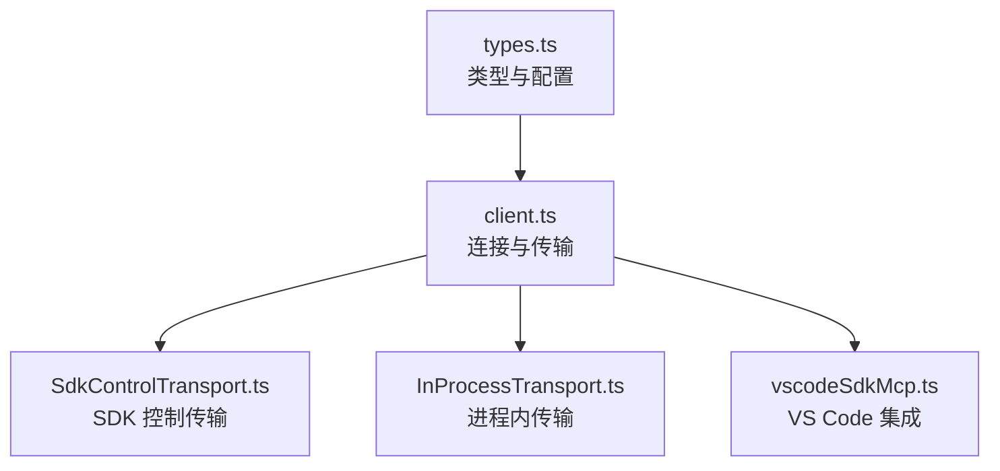

# MCP 开发指南

<cite>
**本文档引用的文件**
- [src/services/mcp/client.ts](file://src/services/mcp/client.ts)
- [src/services/mcp/types.ts](file://src/services/mcp/types.ts)
- [src/services/mcp/config.ts](file://src/services/mcp/config.ts)
- [src/services/mcp/SdkControlTransport.ts](file://src/services/mcp/SdkControlTransport.ts)
- [src/services/mcp/InProcessTransport.ts](file://src/services/mcp/InProcessTransport.ts)
- [src/services/mcp/vscodeSdkMcp.ts](file://src/services/mcp/vscodeSdkMcp.ts)
- [src/entrypoints/mcp.ts](file://src/entrypoints/mcp.ts)
- [src/components/mcp/MCPListPanel.tsx](file://src/components/mcp/MCPListPanel.tsx)
- [src/commands/mcp/index.ts](file://src/commands/mcp/index.ts)
- [src/cli/print.ts](file://src/cli/print.ts)
</cite>

## 目录
1. [简介](#简介)
2. [项目结构](#项目结构)
3. [核心组件](#核心组件)
4. [架构总览](#架构总览)
5. [详细组件分析](#详细组件分析)
6. [依赖关系分析](#依赖关系分析)
7. [性能考虑](#性能考虑)
8. [故障排除指南](#故障排除指南)
9. [结论](#结论)
10. [附录](#附录)

## 简介
本指南面向希望在 Claude Code 生态中开发和集成 MCP（Model Context Protocol）服务器的开发者。内容涵盖从基础概念到完整实现的全过程，包括 MCP SDK 的使用方法、多种传输方式（控制传输、进程内传输、标准 IO 传输等）的实现细节、MCP 协议标准接口与消息格式、与 VS Code 的集成方案、测试与调试技巧以及部署指南。文档同时提供可操作的开发示例与最佳实践建议。

## 项目结构
该仓库中的 MCP 相关代码主要分布在以下模块：
- 服务端与客户端：负责连接、认证、工具调用、资源管理、错误处理与重连策略
- 传输层：支持多种传输方式（HTTP/SSE、WebSocket、STDIO、SDK 控制传输、进程内传输）
- 配置与类型：定义 MCP 服务器配置、能力与连接状态类型
- VS Code 集成：通过通知机制与 VS Code 扩展进行双向通信
- 命令行与 UI：提供 MCP 服务器管理界面与命令入口

**图表来源**
- [src/services/mcp/client.ts:866-961](file://src/services/mcp/client.ts#L866-L961)
- [src/services/mcp/SdkControlTransport.ts:60-95](file://src/services/mcp/SdkControlTransport.ts#L60-L95)
- [src/services/mcp/InProcessTransport.ts:57-63](file://src/services/mcp/InProcessTransport.ts#L57-L63)
- [src/components/mcp/MCPListPanel.tsx:92-186](file://src/components/mcp/MCPListPanel.tsx#L92-L186)

**章节来源**
- [src/services/mcp/client.ts:866-961](file://src/services/mcp/client.ts#L866-L961)
- [src/services/mcp/SdkControlTransport.ts:60-95](file://src/services/mcp/SdkControlTransport.ts#L60-L95)
- [src/services/mcp/InProcessTransport.ts:57-63](file://src/services/mcp/InProcessTransport.ts#L57-L63)
- [src/components/mcp/MCPListPanel.tsx:92-186](file://src/components/mcp/MCPListPanel.tsx#L92-L186)

## 核心组件
- 连接与传输管理：统一的连接工厂、传输选择逻辑、错误处理与重连策略
- SDK 控制传输桥：用于 CLI 与 SDK 进程间的消息桥接
- 进程内传输对：用于在同一进程中运行客户端与服务器
- 配置与类型系统：标准化的服务器配置、能力声明与连接状态
- VS Code 集成：通过通知机制实现文件更新与实验门控同步
- 命令行与 UI：提供 MCP 服务器的可视化管理与交互入口

**章节来源**
- [src/services/mcp/client.ts:866-961](file://src/services/mcp/client.ts#L866-L961)
- [src/services/mcp/types.ts:1-259](file://src/services/mcp/types.ts#L1-L259)
- [src/services/mcp/SdkControlTransport.ts:60-95](file://src/services/mcp/SdkControlTransport.ts#L60-L95)
- [src/services/mcp/InProcessTransport.ts:11-49](file://src/services/mcp/InProcessTransport.ts#L11-L49)
- [src/services/mcp/vscodeSdkMcp.ts:39-59](file://src/services/mcp/vscodeSdkMcp.ts#L39-L59)

## 架构总览
下图展示了 MCP 客户端与不同类型的 MCP 服务器之间的交互路径，包括 SDK 控制传输与进程内传输的桥接机制。

**图表来源**
- [src/services/mcp/client.ts:866-961](file://src/services/mcp/client.ts#L866-L961)
- [src/services/mcp/SdkControlTransport.ts:60-95](file://src/services/mcp/SdkControlTransport.ts#L60-L95)
- [src/services/mcp/InProcessTransport.ts:57-63](file://src/services/mcp/InProcessTransport.ts#L57-L63)

## 详细组件分析

### 传输层与连接管理
- 传输类型支持：HTTP/Streamable HTTP、SSE、WebSocket、STDIO、SDK 控制传输、进程内传输
- 连接超时与重试：统一的连接超时控制、终端错误检测与自动重连
- 认证与代理：OAuth 令牌注入、代理配置、步进式认证检测
- 错误分类与日志：详细的错误分类、调试日志与遥测事件

**图表来源**
- [src/services/mcp/client.ts:866-961](file://src/services/mcp/client.ts#L866-L961)
- [src/services/mcp/client.ts:1020-1080](file://src/services/mcp/client.ts#L1020-L1080)
- [src/services/mcp/client.ts:1216-1402](file://src/services/mcp/client.ts#L1216-L1402)

**章节来源**
- [src/services/mcp/client.ts:866-961](file://src/services/mcp/client.ts#L866-L961)
- [src/services/mcp/client.ts:1020-1080](file://src/services/mcp/client.ts#L1020-L1080)
- [src/services/mcp/client.ts:1216-1402](file://src/services/mcp/client.ts#L1216-L1402)

### SDK 控制传输桥
- 双向桥接：CLI 侧与 SDK 侧分别实现传输适配器，通过控制消息进行桥接
- 多服务器支持：同一进程中可同时运行多个 SDK MCP 服务器
- 消息 ID 保持：确保请求与响应的关联性

**图表来源**
- [src/services/mcp/SdkControlTransport.ts:60-95](file://src/services/mcp/SdkControlTransport.ts#L60-L95)
- [src/services/mcp/SdkControlTransport.ts:109-136](file://src/services/mcp/SdkControlTransport.ts#L109-L136)

**章节来源**
- [src/services/mcp/SdkControlTransport.ts:60-95](file://src/services/mcp/SdkControlTransport.ts#L60-L95)
- [src/services/mcp/SdkControlTransport.ts:109-136](file://src/services/mcp/SdkControlTransport.ts#L109-L136)

### 进程内传输对
- 同进程通信：无需子进程，直接通过内存传输对传递消息
- 异步投递：使用微任务避免同步调用栈过深
- 双向关闭：任一侧关闭会联动另一侧关闭

**图表来源**
- [src/services/mcp/InProcessTransport.ts:11-49](file://src/services/mcp/InProcessTransport.ts#L11-L49)

**章节来源**
- [src/services/mcp/InProcessTransport.ts:11-49](file://src/services/mcp/InProcessTransport.ts#L11-L49)

### VS Code 集成
- 通知机制：通过通知实现文件更新与实验门控同步
- 双向通信：支持从 VS Code 接收日志事件并上报遥测

**图表来源**
- [src/services/mcp/vscodeSdkMcp.ts:64-112](file://src/services/mcp/vscodeSdkMcp.ts#L64-L112)

**章节来源**
- [src/services/mcp/vscodeSdkMcp.ts:39-59](file://src/services/mcp/vscodeSdkMcp.ts#L39-L59)
- [src/services/mcp/vscodeSdkMcp.ts:64-112](file://src/services/mcp/vscodeSdkMcp.ts#L64-L112)

### MCP 服务器标准接口与协议
- 工具与提示：支持 tools/list、prompts/list 等标准方法
- 资源管理：支持 resources/list 与订阅能力
- 根目录：提供根目录列表以支持文件系统相关工具
- 结果处理：统一的结果转换与大输出处理策略

**图表来源**
- [src/services/mcp/client.ts:1743-1998](file://src/services/mcp/client.ts#L1743-L1998)
- [src/services/mcp/client.ts:2000-2031](file://src/services/mcp/client.ts#L2000-L2031)
- [src/services/mcp/client.ts:2033-2107](file://src/services/mcp/client.ts#L2033-L2107)
- [src/services/mcp/client.ts:1009-1018](file://src/services/mcp/client.ts#L1009-L1018)

**章节来源**
- [src/services/mcp/client.ts:1743-1998](file://src/services/mcp/client.ts#L1743-L1998)
- [src/services/mcp/client.ts:2000-2031](file://src/services/mcp/client.ts#L2000-L2031)
- [src/services/mcp/client.ts:2033-2107](file://src/services/mcp/client.ts#L2033-L2107)
- [src/services/mcp/client.ts:1009-1018](file://src/services/mcp/client.ts#L1009-L1018)

### MCP 服务器管理与 UI
- 可视化管理：MCP 列表面板展示服务器状态、作用域与配置来源
- 动态更新：支持动态添加、移除与替换 MCP 服务器配置
- 命令入口：提供 /mcp 命令进行服务器管理

**图表来源**
- [src/components/mcp/MCPListPanel.tsx:92-186](file://src/components/mcp/MCPListPanel.tsx#L92-L186)
- [src/commands/mcp/index.ts:3-12](file://src/commands/mcp/index.ts#L3-L12)
- [src/cli/print.ts:5446-5479](file://src/cli/print.ts#L5446-L5479)

**章节来源**
- [src/components/mcp/MCPListPanel.tsx:92-186](file://src/components/mcp/MCPListPanel.tsx#L92-L186)
- [src/commands/mcp/index.ts:3-12](file://src/commands/mcp/index.ts#L3-L12)
- [src/cli/print.ts:5446-5479](file://src/cli/print.ts#L5446-L5479)

## 依赖关系分析
- 类型与配置：MCP 类型定义与配置模式由 types.ts 统一管理
- 连接与传输：client.ts 作为统一入口，根据配置选择具体传输实现
- SDK 桥接：SdkControlTransport 提供 CLI 与 SDK 间的桥接
- 进程内通信：InProcessTransport 支持同进程通信
- VS Code 集成：vscodeSdkMcp.ts 实现通知与遥测

**图表来源**
- [src/services/mcp/types.ts:1-259](file://src/services/mcp/types.ts#L1-L259)
- [src/services/mcp/client.ts:866-961](file://src/services/mcp/client.ts#L866-L961)
- [src/services/mcp/SdkControlTransport.ts:60-95](file://src/services/mcp/SdkControlTransport.ts#L60-L95)
- [src/services/mcp/InProcessTransport.ts:57-63](file://src/services/mcp/InProcessTransport.ts#L57-L63)
- [src/services/mcp/vscodeSdkMcp.ts:64-112](file://src/services/mcp/vscodeSdkMcp.ts#L64-L112)

**章节来源**
- [src/services/mcp/types.ts:1-259](file://src/services/mcp/types.ts#L1-L259)
- [src/services/mcp/client.ts:866-961](file://src/services/mcp/client.ts#L866-L961)
- [src/services/mcp/SdkControlTransport.ts:60-95](file://src/services/mcp/SdkControlTransport.ts#L60-L95)
- [src/services/mcp/InProcessTransport.ts:57-63](file://src/services/mcp/InProcessTransport.ts#L57-L63)
- [src/services/mcp/vscodeSdkMcp.ts:64-112](file://src/services/mcp/vscodeSdkMcp.ts#L64-L112)

## 性能考虑
- 并发连接：本地服务器与远程服务器采用不同的并发策略，避免资源争用
- 缓存与去重：连接缓存、工具/资源/命令缓存，减少重复网络开销
- 大输出处理：超过阈值的内容自动落盘并返回指引，避免内存膨胀
- 超时与重试：统一的连接与工具调用超时策略，防止阻塞

[本节为通用指导，不直接分析具体文件]

## 故障排除指南
- 连接超时：检查网络、代理与服务器可达性；查看连接超时日志
- 认证失败：确认 OAuth 令牌有效与刷新流程；检查代理与步进式认证
- 终端错误：识别 ECONNRESET、ETIMEDOUT 等错误并触发自动重连
- 工具调用失败：捕获 McpError 并区分 -32000（连接关闭）、-32001（会话不存在）等
- 大输出问题：启用大输出文件功能或调整内容截断策略

**章节来源**
- [src/services/mcp/client.ts:1020-1080](file://src/services/mcp/client.ts#L1020-L1080)
- [src/services/mcp/client.ts:1313-1365](file://src/services/mcp/client.ts#L1313-L1365)
- [src/services/mcp/client.ts:3194-3199](file://src/services/mcp/client.ts#L3194-L3199)

## 结论
本指南提供了从概念到实现的完整 MCP 开发路径，覆盖了传输层设计、SDK 桥接、进程内通信、VS Code 集成、配置与类型系统、以及测试与部署的最佳实践。通过遵循这些指导，开发者可以高效地在 Claude Code 生态中构建稳定、可扩展的 MCP 服务器，并与 VS Code 等工具实现无缝协作。

[本节为总结性内容，不直接分析具体文件]

## 附录

### MCP 服务器开发步骤
- 定义配置与类型：参考 types.ts 中的配置模式与类型定义
- 实现传输：根据需求选择 HTTP/SSE/WS/STDIO/SDK 控制传输或进程内传输
- 连接与认证：在 client.ts 的连接工厂中实现传输选择与认证逻辑
- 实现标准接口：提供 tools/list、prompts/list、resources/list 等标准方法
- 处理结果与大输出：使用统一的结果处理与大输出落盘策略
- 集成 VS Code：通过通知机制实现文件更新与实验门控同步
- 测试与调试：利用 CLI 的 MCP 列表面板与日志系统进行调试
- 部署与运维：配置企业策略、允许/拒绝列表与动态服务器管理

**章节来源**
- [src/services/mcp/types.ts:1-259](file://src/services/mcp/types.ts#L1-L259)
- [src/services/mcp/client.ts:866-961](file://src/services/mcp/client.ts#L866-L961)
- [src/services/mcp/SdkControlTransport.ts:60-95](file://src/services/mcp/SdkControlTransport.ts#L60-L95)
- [src/services/mcp/InProcessTransport.ts:57-63](file://src/services/mcp/InProcessTransport.ts#L57-L63)
- [src/services/mcp/vscodeSdkMcp.ts:64-112](file://src/services/mcp/vscodeSdkMcp.ts#L64-L112)
- [src/components/mcp/MCPListPanel.tsx:92-186](file://src/components/mcp/MCPListPanel.tsx#L92-L186)