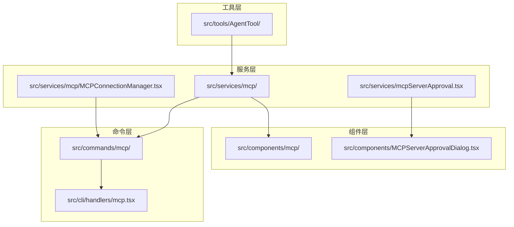
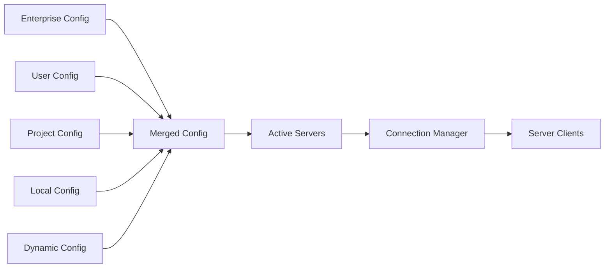
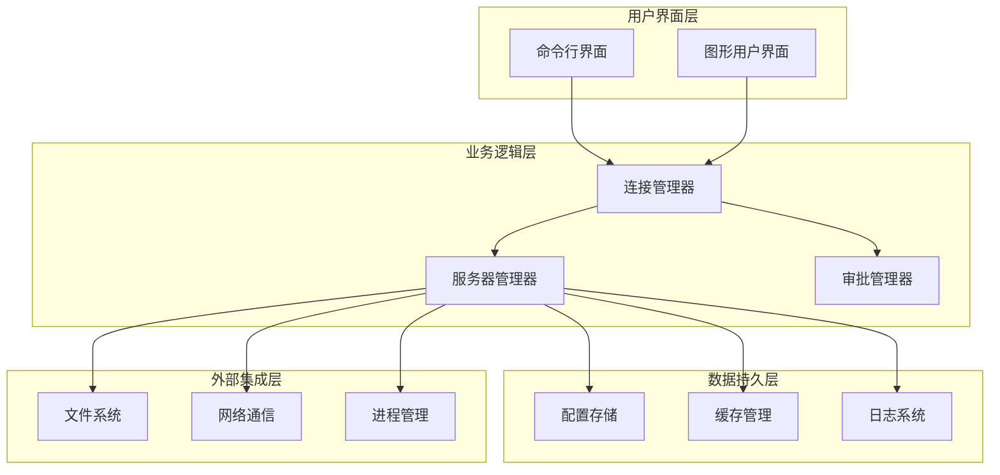
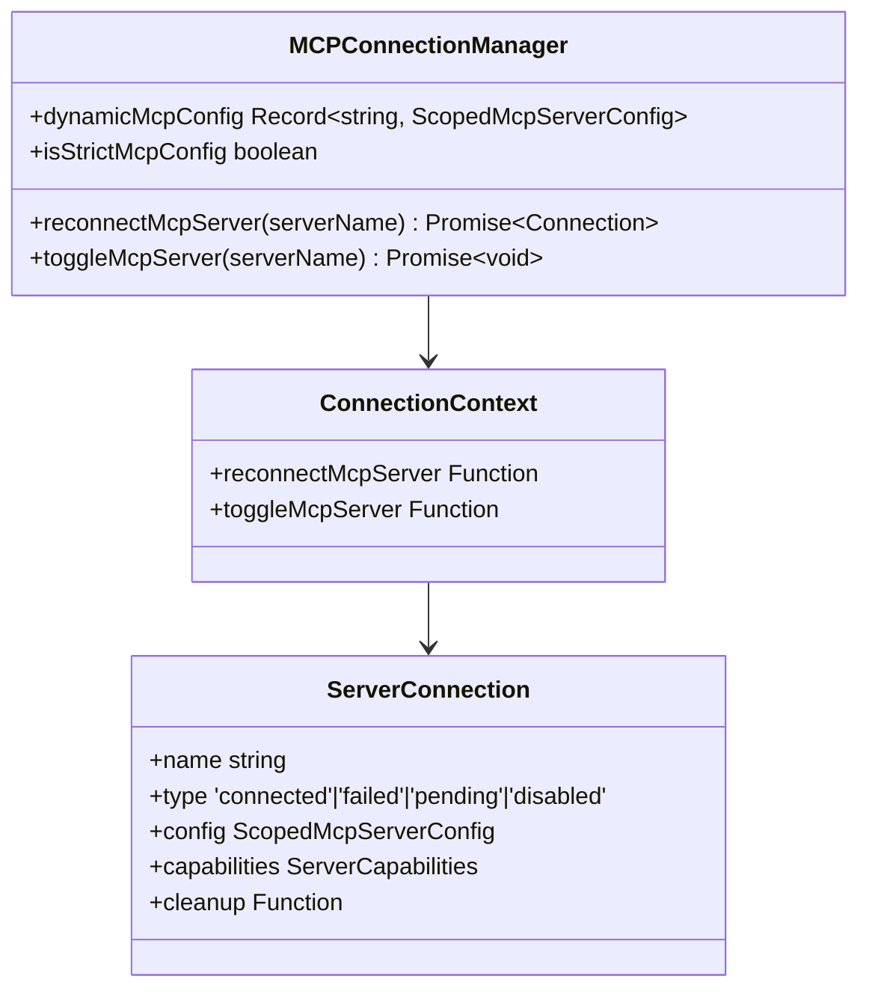
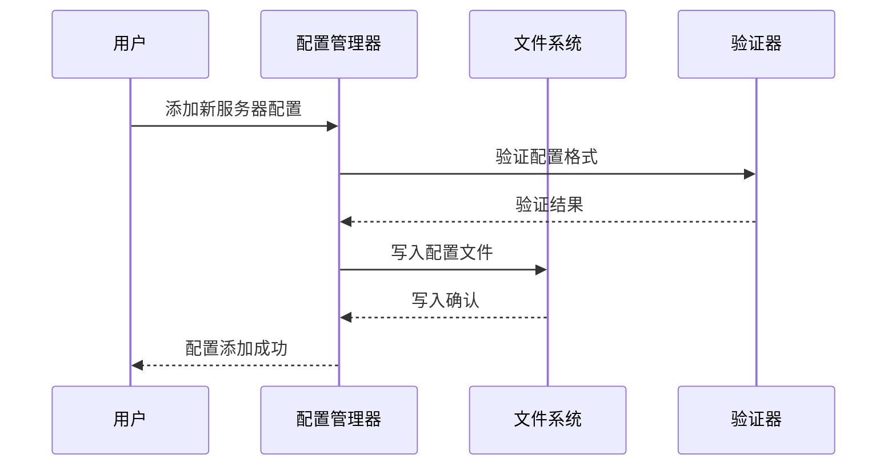
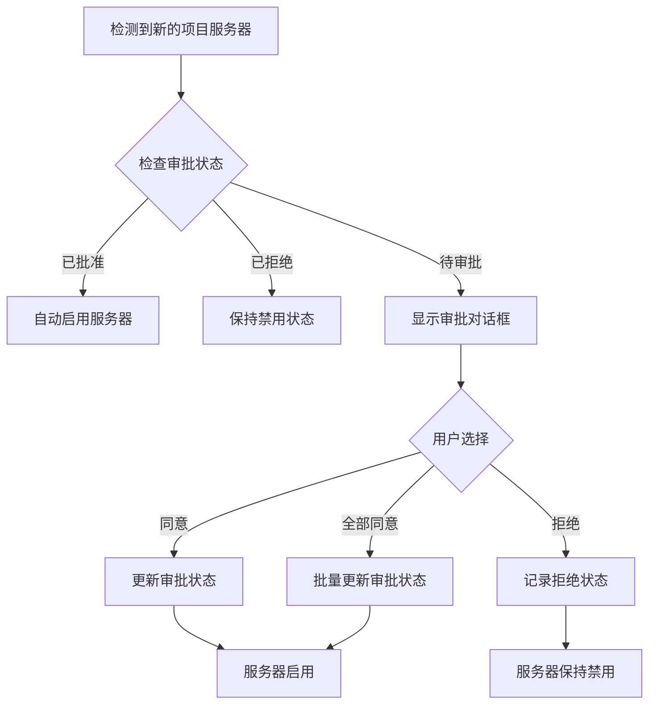
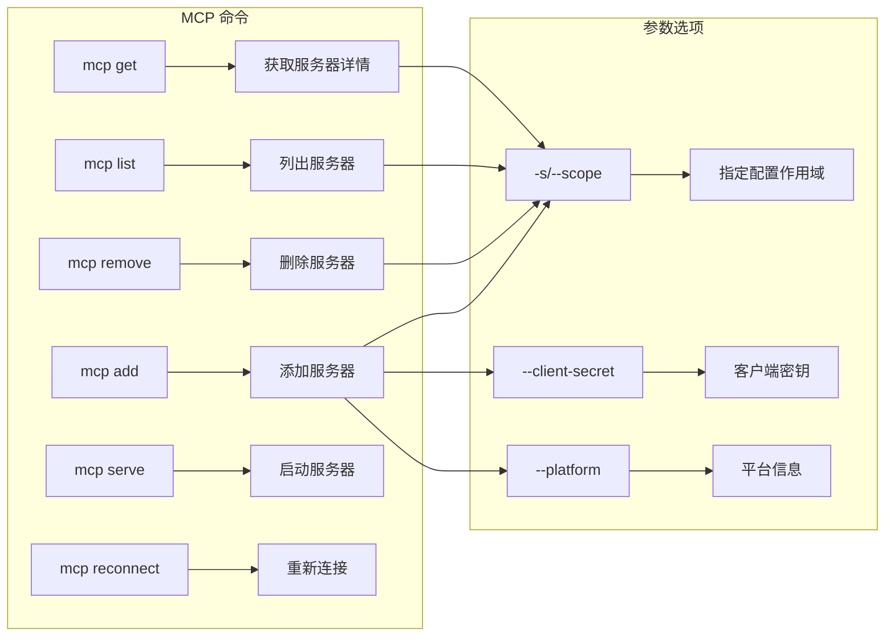
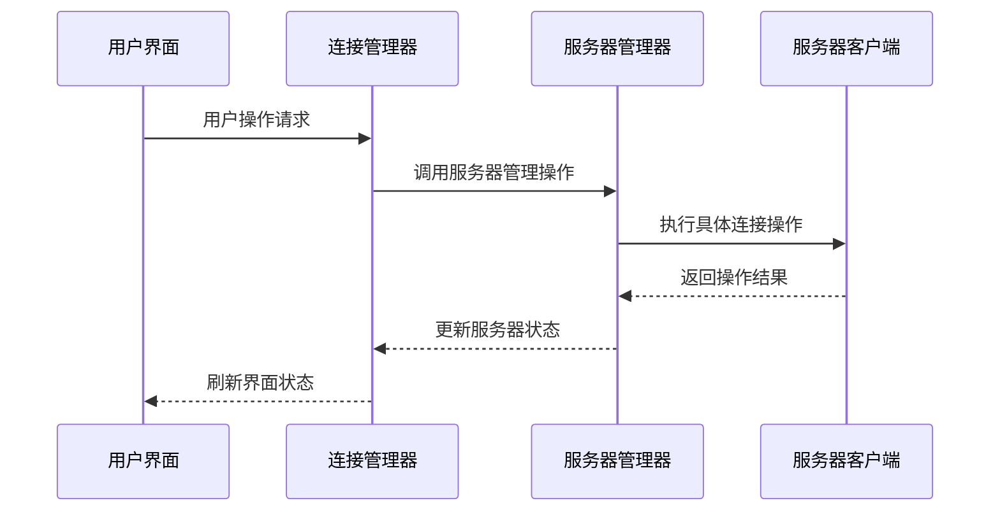
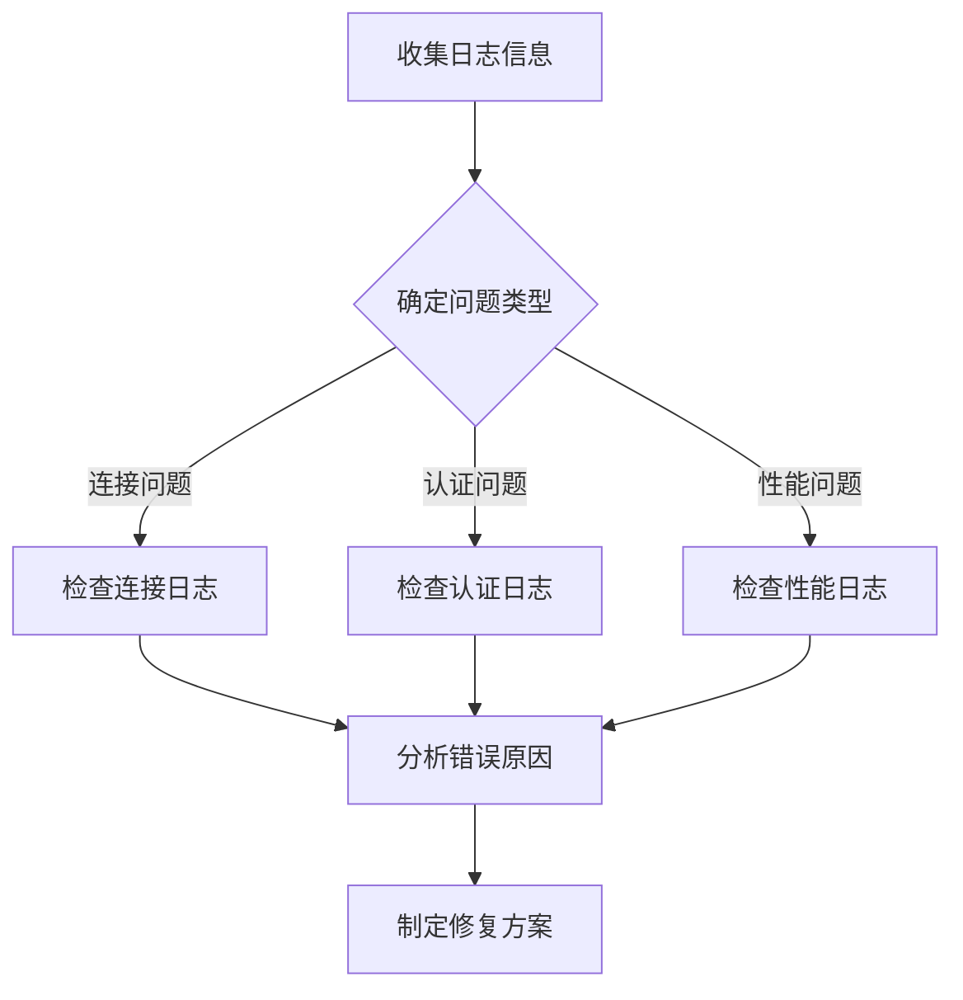

# MCP 服务器管理

<cite>
**本文档引用的文件**
- [src/services/mcp/config.ts](file://src/services/mcp/config.ts)
- [src/services/mcp/utils.ts](file://src/services/mcp/utils.ts)
- [src/services/mcp/types.ts](file://src/services/mcp/types.ts)
- [src/services/mcp/MCPConnectionManager.tsx](file://src/services/mcp/MCPConnectionManager.tsx)
- [src/services/mcpServerApproval.tsx](file://src/services/mcpServerApproval.tsx)
- [src/components/MCPServerApprovalDialog.tsx](file://src/components/MCPServerApprovalDialog.tsx)
- [src/components/mcp/index.ts](file://src/components/mcp/index.ts)
- [src/commands/mcp/mcp.tsx](file://src/commands/mcp/mcp.tsx)
- [src/cli/handlers/mcp.tsx](file://src/cli/handlers/mcp.tsx)
- [src/tools/AgentTool/AgentTool.tsx](file://src/tools/AgentTool/AgentTool.tsx)
</cite>

## 目录
1. [简介](#简介)
2. [项目结构](#项目结构)
3. [核心组件](#核心组件)
4. [架构概览](#架构概览)
5. [详细组件分析](#详细组件分析)
6. [依赖关系分析](#依赖关系分析)
7. [性能考虑](#性能考虑)
8. [故障排除指南](#故障排除指南)
9. [结论](#结论)

## 简介

MCP（Model Context Protocol）服务器管理是 Claude Code 平台的核心功能之一，负责管理系统中各种类型的 MCP 服务器连接。该系统支持本地服务器、远程服务器和 VS Code 服务器等多种连接模式，提供了完整的服务器生命周期管理、配置管理和故障恢复机制。

本系统通过统一的配置管理、连接状态监控和自动重连机制，确保 MCP 服务器的稳定运行和高效管理。用户可以通过图形界面或命令行方式管理 MCP 服务器，系统会自动处理服务器发现、配置验证和连接维护等复杂任务。

## 项目结构

MCP 服务器管理功能主要分布在以下目录结构中：



**图表来源**
- [src/services/mcp/config.ts:1-800](file://src/services/mcp/config.ts#L1-L800)
- [src/services/mcpServerApproval.tsx:1-41](file://src/services/mcpServerApproval.tsx#L1-L41)
- [src/components/mcp/index.ts:1-10](file://src/components/mcp/index.ts#L1-L10)

**章节来源**
- [src/services/mcp/config.ts:1-800](file://src/services/mcp/config.ts#L1-L800)
- [src/services/mcp/utils.ts:1-576](file://src/services/mcp/utils.ts#L1-L576)

## 核心组件

### MCP 服务器类型分类

系统支持多种 MCP 服务器类型，每种类型都有其特定的用途和特点：

#### 本地服务器 (Local Servers)
- **定义**: 通过本地进程启动的 MCP 服务器
- **配置**: 使用 `stdio` 传输类型，指定可执行文件路径和参数
- **特点**: 安全性高，性能好，适合本地开发环境
- **配置示例**: 
  ```json
  {
    "type": "stdio",
    "command": "/usr/bin/my-mcp-server",
    "args": ["--port", "8080"],
    "env": {"NODE_ENV": "production"}
  }
  ```

#### 远程服务器 (Remote Servers)
- **定义**: 通过网络访问的 MCP 服务器
- **配置**: 支持 `sse`、`http` 和 `ws` 传输类型
- **特点**: 可以跨网络访问，支持认证和授权
- **配置示例**:
  ```json
  {
    "type": "http",
    "url": "https://api.example.com/mcp",
    "headers": {"Authorization": "Bearer token"},
    "oauth": {
      "clientId": "my-client-id",
      "callbackPort": 8081
    }
  }
  ```

#### VS Code 服务器 (VS Code Servers)
- **定义**: 针对 VS Code IDE 的专用 MCP 服务器
- **配置**: 使用 `sse-ide` 或 `ws-ide` 传输类型
- **特点**: 与 VS Code 编辑器深度集成，提供 IDE 特定功能
- **配置示例**:
  ```json
  {
    "type": "sse-ide",
    "url": "wss://vscode.example.com/mcp",
    "ideName": "Visual Studio Code",
    "ideRunningInWindows": false
  }
  ```

### 配置管理架构

系统采用分层配置管理架构，支持多源配置合并：



**图表来源**
- [src/services/mcp/config.ts:883-881](file://src/services/mcp/config.ts#L883-L881)
- [src/services/mcp/utils.ts:258-280](file://src/services/mcp/utils.ts#L258-L280)

**章节来源**
- [src/services/mcp/types.ts:23-135](file://src/services/mcp/types.ts#L23-L135)
- [src/services/mcp/config.ts:618-761](file://src/services/mcp/config.ts#L618-L761)

## 架构概览

MCP 服务器管理系统的整体架构采用模块化设计，各组件职责明确，通过清晰的接口进行交互：



**图表来源**
- [src/services/mcp/MCPConnectionManager.tsx:37-72](file://src/services/mcp/MCPConnectionManager.tsx#L37-L72)
- [src/services/mcpServerApproval.tsx:15-40](file://src/services/mcpServerApproval.tsx#L15-L40)

## 详细组件分析

### 连接管理器 (MCPConnectionManager)

连接管理器是 MCP 服务器管理的核心组件，负责协调所有服务器连接操作：



**图表来源**
- [src/services/mcp/MCPConnectionManager.tsx:7-30](file://src/services/mcp/MCPConnectionManager.tsx#L7-L30)

#### 连接状态管理

系统支持五种连接状态，每种状态都有特定的处理逻辑：

| 状态类型 | 描述 | 处理逻辑 |
|---------|------|----------|
| connected | 连接成功 | 提供完整服务功能 |
| failed | 连接失败 | 触发错误处理和重连机制 |
| pending | 正在连接 | 显示连接进度和状态 |
| needs-auth | 需要认证 | 引导用户完成认证流程 |
| disabled | 已禁用 | 不参与连接管理 |

**章节来源**
- [src/services/mcp/types.ts:180-227](file://src/services/mcp/types.ts#L180-L227)
- [src/services/mcp/MCPConnectionManager.tsx:1-73](file://src/services/mcp/MCPConnectionManager.tsx#L1-L73)

### 配置管理器 (ConfigManager)

配置管理器负责 MCP 服务器配置的存储、验证和检索：



**图表来源**
- [src/services/mcp/config.ts:625-761](file://src/services/mcp/config.ts#L625-L761)

#### 配置作用域管理

系统支持多种配置作用域，每种作用域有不同的优先级和影响范围：

| 作用域类型 | 描述 | 优先级 | 影响范围 |
|-----------|------|--------|----------|
| enterprise | 企业级配置 | 最高 | 全组织 |
| user | 用户级配置 | 高 | 当前用户 |
| project | 项目级配置 | 中 | 当前项目 |
| local | 本地配置 | 低 | 当前项目私有 |
| dynamic | 动态配置 | 最低 | 当前会话 |

**章节来源**
- [src/services/mcp/utils.ts:258-299](file://src/services/mcp/utils.ts#L258-L299)
- [src/services/mcp/config.ts:83-131](file://src/services/mcp/config.ts#L83-L131)

### 审批管理器 (ApprovalManager)

审批管理器负责处理项目级 MCP 服务器的用户审批流程：



**图表来源**
- [src/services/mcpServerApproval.tsx:15-40](file://src/services/mcpServerApproval.tsx#L15-L40)
- [src/components/MCPServerApprovalDialog.tsx:19-55](file://src/components/MCPServerApprovalDialog.tsx#L19-L55)

**章节来源**
- [src/services/mcpServerApproval.tsx:1-41](file://src/services/mcpServerApproval.tsx#L1-L41)
- [src/components/MCPServerApprovalDialog.tsx:1-115](file://src/components/MCPServerApprovalDialog.tsx#L1-L115)

### 命令行管理接口

系统提供完整的命令行接口用于 MCP 服务器管理：



**图表来源**
- [src/cli/handlers/mcp.tsx:73-141](file://src/cli/handlers/mcp.tsx#L73-L141)
- [src/cli/handlers/mcp.tsx:143-190](file://src/cli/handlers/mcp.tsx#L143-L190)

**章节来源**
- [src/commands/mcp/mcp.tsx:63-84](file://src/commands/mcp/mcp.tsx#L63-L84)
- [src/cli/handlers/mcp.tsx:1-362](file://src/cli/handlers/mcp.tsx#L1-L362)

## 依赖关系分析

MCP 服务器管理系统具有清晰的依赖层次结构，各组件之间的耦合度较低，便于维护和扩展：

```mermaid
graph TB
subgraph "核心依赖"
A[Zod Schema] --> B[配置验证]
C[React Context] --> D[状态管理]
E[Lodash Utils] --> F[工具函数]
end
subgraph "系统依赖"
G[文件系统] --> H[配置存储]
I[网络请求] --> J[远程服务器]
K[进程管理] --> L[本地服务器]
end
subgraph "第三方库"
M[@modelcontextprotocol/sdk] --> N[MCP 协议实现]
O[p-map] --> P[并发处理]
Q[fs/promises] --> R[文件操作]
end
B --> G
D --> C
F --> E
H --> M
J --> M
L --> M
```

**图表来源**
- [src/services/mcp/config.ts:1-57](file://src/services/mcp/config.ts#L1-L57)
- [src/services/mcp/utils.ts:1-30](file://src/services/mcp/utils.ts#L1-L30)

### 组件间交互模式

系统采用事件驱动和回调相结合的交互模式：



**图表来源**
- [src/services/mcp/MCPConnectionManager.tsx:45-48](file://src/services/mcp/MCPConnectionManager.tsx#L45-L48)

**章节来源**
- [src/services/mcp/config.ts:1-800](file://src/services/mcp/config.ts#L1-L800)
- [src/services/mcp/utils.ts:1-576](file://src/services/mcp/utils.ts#L1-L576)

## 性能考虑

### 连接池管理

系统实现了智能的连接池管理机制，优化服务器连接性能：

- **并发连接限制**: 通过 `getMcpServerConnectionBatchSize()` 控制同时连接的数量
- **连接复用**: 支持多个 MCP 服务器共享底层连接资源
- **资源清理**: 自动清理闲置连接，释放系统资源

### 缓存策略

系统采用多层次缓存策略提高响应速度：

- **配置缓存**: 缓存解析后的 MCP 配置，避免重复解析
- **能力缓存**: 缓存服务器能力信息，减少握手开销
- **工具缓存**: 缓存工具列表和元数据，加速工具发现

### 内存管理

系统实施严格的内存管理策略：

- **垃圾回收**: 定期清理无用的服务器连接对象
- **内存监控**: 实时监控内存使用情况，防止内存泄漏
- **资源限制**: 设置最大连接数和内存使用上限

## 故障排除指南

### 常见问题诊断

#### 服务器连接失败

**症状**: 服务器状态显示为 `failed`

**诊断步骤**:
1. 检查服务器配置是否正确
2. 验证网络连接状态
3. 查看服务器日志输出
4. 确认认证信息有效

**解决方案**:
- 重新配置服务器连接参数
- 检查防火墙设置
- 更新认证凭据
- 联系服务器管理员

#### 认证失败

**症状**: 服务器状态显示为 `needs-auth`

**诊断步骤**:
1. 验证 OAuth 配置
2. 检查客户端密钥
3. 确认回调端口可用
4. 验证服务器支持的认证方式

**解决方案**:
- 重新配置 OAuth 设置
- 生成新的客户端密钥
- 更改回调端口
- 更新服务器认证配置

#### 性能问题

**症状**: 服务器响应缓慢或超时

**诊断步骤**:
1. 检查服务器负载情况
2. 分析网络延迟
3. 监控系统资源使用
4. 评估连接池配置

**解决方案**:
- 增加服务器资源
- 优化网络配置
- 调整连接池大小
- 实施连接复用策略

### 日志分析

系统提供详细的日志记录功能，帮助诊断问题：



**图表来源**
- [src/services/mcp/config.ts:40-43](file://src/services/mcp/config.ts#L40-L43)

**章节来源**
- [src/services/mcp/config.ts:1-800](file://src/services/mcp/config.ts#L1-L800)
- [src/tools/AgentTool/AgentTool.tsx:385-392](file://src/tools/AgentTool/AgentTool.tsx#L385-L392)

## 结论

MCP 服务器管理系统是一个功能完善、架构清晰的现代化服务器管理解决方案。系统通过模块化设计、智能配置管理和完善的故障恢复机制，为用户提供了可靠的 MCP 服务器管理体验。

### 主要优势

1. **多类型支持**: 支持本地、远程和 IDE 专用服务器
2. **灵活配置**: 多层次配置管理，满足不同使用场景
3. **智能管理**: 自动化的服务器发现、配置和连接管理
4. **安全可靠**: 完善的认证机制和权限控制
5. **易于使用**: 提供丰富的命令行和图形界面操作

### 发展方向

未来可以进一步优化的方向包括：
- 增强服务器健康监测功能
- 扩展更多传输协议支持
- 优化大规模服务器管理性能
- 增加更多自动化运维功能

该系统为 Claude Code 平台的 MCP 功能提供了坚实的技术基础，为用户提供了强大而易用的服务器管理能力。