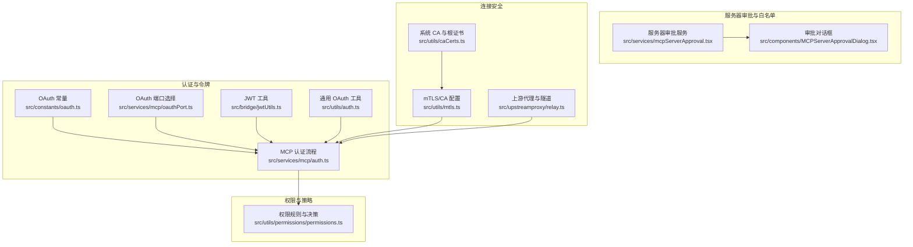
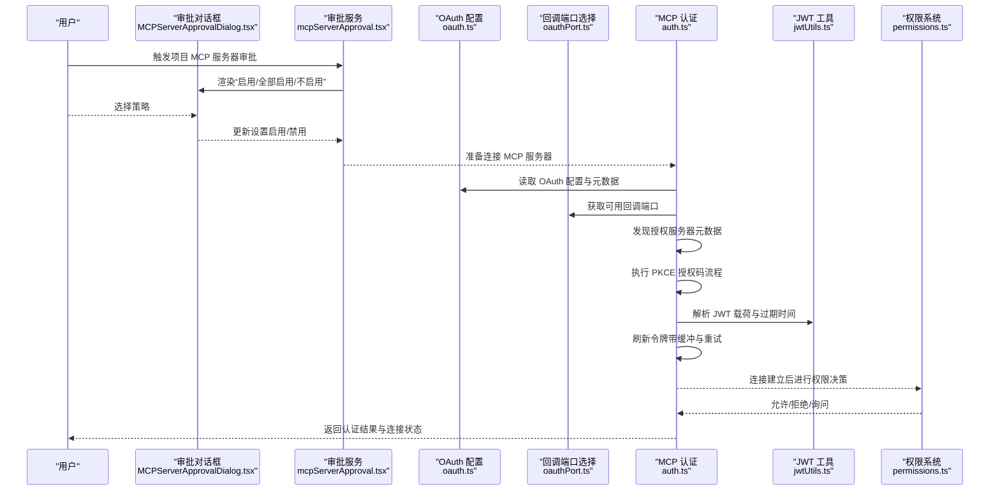
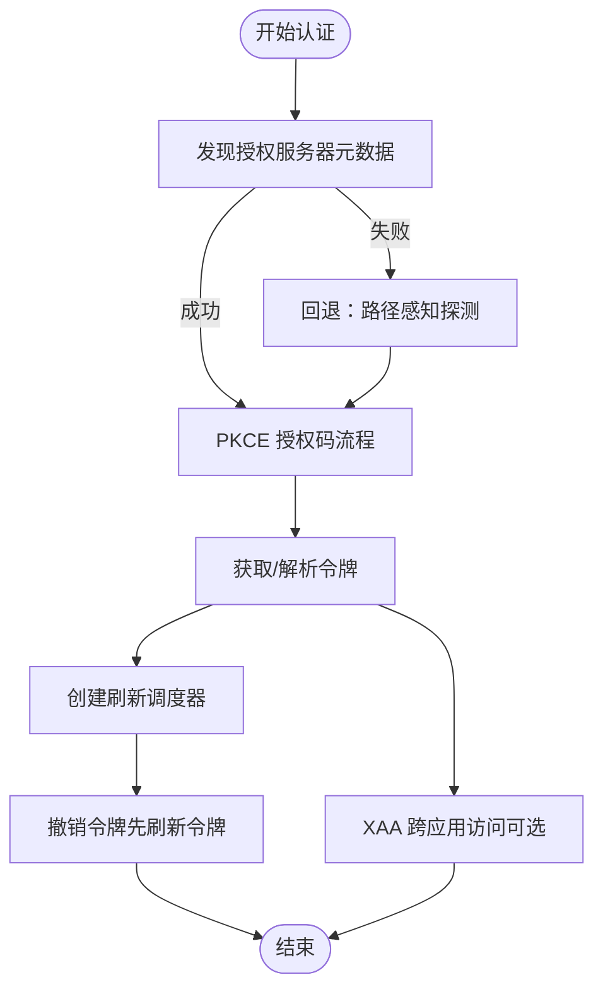
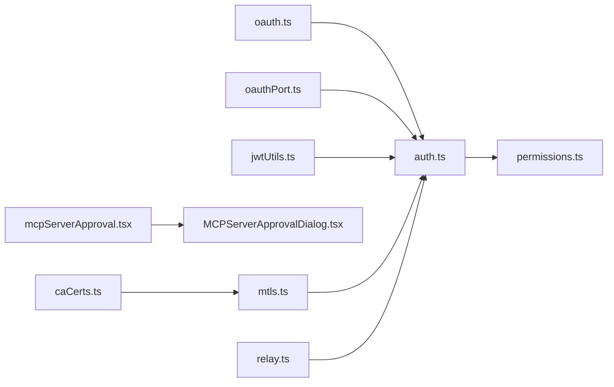

# MCP 认证与安全

<cite>
**本文引用的文件**
- [jwtUtils.ts](file://src/bridge/jwtUtils.ts)
- [oauth.ts](file://src/constants/oauth.ts)
- [oauthPort.ts](file://src/services/mcp/oauthPort.ts)
- [auth.ts](file://src/services/mcp/auth.ts)
- [mcpServerApproval.tsx](file://src/services/mcpServerApproval.tsx)
- [MCPServerApprovalDialog.tsx](file://src/components/MCPServerApprovalDialog.tsx)
- [permissions.ts](file://src/utils/permissions/permissions.ts)
- [mtls.ts](file://src/utils/mtls.ts)
- [caCerts.ts](file://src/utils/caCerts.ts)
- [relay.ts](file://src/upstreamproxy/relay.ts)
- [auth.ts（通用）](file://src/utils/auth.ts)
</cite>

## 目录
1. [简介](#简介)
2. [项目结构](#项目结构)
3. [核心组件](#核心组件)
4. [架构总览](#架构总览)
5. [详细组件分析](#详细组件分析)
6. [依赖关系分析](#依赖关系分析)
7. [性能考量](#性能考量)
8. [故障排除指南](#故障排除指南)
9. [结论](#结论)
10. [附录](#附录)

## 简介
本文件聚焦 Claude Code 中 MCP（Model Context Protocol）的认证与安全机制，覆盖以下主题：
- MCP 协议中的认证方式：OAuth 2.0/OIDC、令牌刷新与撤销、客户端元数据与动态注册
- MCP 服务器访问控制与权限管理：项目级服务器审批、频道白名单与权限策略
- MCP 连接安全：TLS/SSL、mTLS、证书链与代理隧道
- 与 Claude Code 现有安全体系的集成：OAuth 配置、令牌存储、跨应用访问（XAA）
- 安全最佳实践与风险防范：参数脱敏、超时与重试、端口选择与可用性检测
- 安全配置示例与故障排除

## 项目结构
围绕 MCP 认证与安全的关键目录与文件：
- 认证与令牌管理：src/services/mcp/auth.ts、src/bridge/jwtUtils.ts、src/constants/oauth.ts、src/services/mcp/oauthPort.ts
- 服务器审批与白名单：src/services/mcpServerApproval.tsx、src/components/MCPServerApprovalDialog.tsx
- 权限与策略：src/utils/permissions/permissions.ts
- 连接安全：src/utils/mtls.ts、src/utils/caCerts.ts、src/upstreamproxy/relay.ts
- 通用 OAuth/令牌工具：src/utils/auth.ts

图表来源
- [oauth.ts:186-235](file://src/constants/oauth.ts#L186-L235)
- [oauthPort.ts:15-79](file://src/services/mcp/oauthPort.ts#L15-L79)
- [auth.ts:256-311](file://src/services/mcp/auth.ts#L256-L311)
- [jwtUtils.ts:72-256](file://src/bridge/jwtUtils.ts#L72-L256)
- [mcpServerApproval.tsx:15-40](file://src/services/mcpServerApproval.tsx#L15-L40)
- [MCPServerApprovalDialog.tsx:18-115](file://src/components/MCPServerApprovalDialog.tsx#L18-L115)
- [permissions.ts:122-302](file://src/utils/permissions/permissions.ts#L122-L302)
- [mtls.ts:97-179](file://src/utils/mtls.ts#L97-L179)
- [caCerts.ts:51-84](file://src/utils/caCerts.ts#L51-L84)
- [relay.ts:291-331](file://src/upstreamproxy/relay.ts#L291-L331)

章节来源
- [oauth.ts:186-235](file://src/constants/oauth.ts#L186-L235)
- [oauthPort.ts:15-79](file://src/services/mcp/oauthPort.ts#L15-L79)
- [auth.ts:256-311](file://src/services/mcp/auth.ts#L256-L311)
- [jwtUtils.ts:72-256](file://src/bridge/jwtUtils.ts#L72-L256)
- [mcpServerApproval.tsx:15-40](file://src/services/mcpServerApproval.tsx#L15-L40)
- [MCPServerApprovalDialog.tsx:18-115](file://src/components/MCPServerApprovalDialog.tsx#L18-L115)
- [permissions.ts:122-302](file://src/utils/permissions/permissions.ts#L122-L302)
- [mtls.ts:97-179](file://src/utils/mtls.ts#L97-L179)
- [caCerts.ts:51-84](file://src/utils/caCerts.ts#L51-L84)
- [relay.ts:291-331](file://src/upstreamproxy/relay.ts#L291-L331)

## 核心组件
- OAuth 与 OIDC 配置：集中于 OAuth 常量模块，支持多环境（prod/staging/local/custom），定义授权端点、令牌端点、客户端元数据文档 URL、MCP 代理路径等。
- OAuth 回调端口选择：随机端口探测与回退策略，避免冲突并提升安全性。
- MCP 认证流程：发现授权服务器元数据、执行 PKCE 授权码流程、令牌刷新与撤销、XAA 跨应用访问。
- JWT 工具：解码载荷与过期时间、令牌刷新调度器、失败重试与生成计数器。
- 服务器审批与白名单：项目级 MCP 服务器首次出现时弹窗审批，支持“全部启用”或“仅本次”。
- 权限与策略：基于规则的工具使用许可，支持允许/拒绝/询问三类行为，以及分类器自动模式。
- 连接安全：mTLS 客户端证书与 CA 证书注入、系统 CA 与根证书加载、HTTPS 与 WebSocket TLS 选项、代理隧道处理。

章节来源
- [oauth.ts:33-115](file://src/constants/oauth.ts#L33-L115)
- [oauthPort.ts:36-79](file://src/services/mcp/oauthPort.ts#L36-L79)
- [auth.ts:256-311](file://src/services/mcp/auth.ts#L256-L311)
- [jwtUtils.ts:72-256](file://src/bridge/jwtUtils.ts#L72-L256)
- [mcpServerApproval.tsx:15-40](file://src/services/mcpServerApproval.tsx#L15-L40)
- [MCPServerApprovalDialog.tsx:18-115](file://src/components/MCPServerApprovalDialog.tsx#L18-L115)
- [permissions.ts:122-302](file://src/utils/permissions/permissions.ts#L122-L302)
- [mtls.ts:97-179](file://src/utils/mtls.ts#L97-L179)
- [caCerts.ts:51-84](file://src/utils/caCerts.ts#L51-L84)
- [relay.ts:291-331](file://src/upstreamproxy/relay.ts#L291-L331)

## 架构总览
下图展示 MCP 认证与安全的整体交互：从 OAuth 配置到令牌获取、刷新与撤销，再到服务器审批与权限决策，以及连接层的安全加固。

图表来源
- [mcpServerApproval.tsx:15-40](file://src/services/mcpServerApproval.tsx#L15-L40)
- [MCPServerApprovalDialog.tsx:18-115](file://src/components/MCPServerApprovalDialog.tsx#L18-L115)
- [oauth.ts:186-235](file://src/constants/oauth.ts#L186-L235)
- [oauthPort.ts:36-79](file://src/services/mcp/oauthPort.ts#L36-L79)
- [auth.ts:256-311](file://src/services/mcp/auth.ts#L256-L311)
- [jwtUtils.ts:72-256](file://src/bridge/jwtUtils.ts#L72-L256)
- [permissions.ts:122-302](file://src/utils/permissions/permissions.ts#L122-L302)

## 详细组件分析

### OAuth 与 OIDC 配置（src/constants/oauth.ts）
- 多环境配置：生产、预发布、本地与自定义 OAuth 端点，支持通过环境变量切换。
- 客户端元数据文档：MCP OAuth 使用 CIMD/SEP-991 的客户端元数据文档 URL，避免动态客户端注册。
- MCP 代理路径：统一的 MCP 代理 URL 与路径模板，便于路由与访问控制。
- OAuth 作用域：区分 Console 与 Claude.ai 的作用域集合，合并为 ALL_OAUTH_SCOPES。

章节来源
- [oauth.ts:18-31](file://src/constants/oauth.ts#L18-L31)
- [oauth.ts:33-115](file://src/constants/oauth.ts#L33-L115)
- [oauth.ts:186-235](file://src/constants/oauth.ts#L186-L235)

### OAuth 回调端口选择（src/services/mcp/oauthPort.ts）
- 动态端口范围：Windows 保留高位段，其他平台使用 49152–65535；随机选择以降低可预测性。
- 回退策略：若随机探测失败，尝试固定回退端口。
- 回调 URI 构建：基于端口与固定路径 /callback，满足 RFC 8252 的环回地址匹配。

章节来源
- [oauthPort.ts:8-30](file://src/services/mcp/oauthPort.ts#L8-L30)
- [oauthPort.ts:36-79](file://src/services/mcp/oauthPort.ts#L36-L79)

### MCP 认证流程（src/services/mcp/auth.ts）
- 元数据发现：优先使用配置的 authServerMetadataUrl（必须 HTTPS），否则按 RFC 9728 → RFC 8414 探测。
- 授权与令牌：执行 PKCE 授权码流程，使用超时信号与错误体归一化处理非标准错误响应。
- 令牌刷新与撤销：提供刷新调度器与撤销接口，先撤销刷新令牌再撤销访问令牌，兼容非 RFC 7009 服务器。
- XAA 跨应用访问：复用 IdP 的 id_token，执行 RFC 8693/JWT Bearer 交换，保存至与常规 OAuth 相同的存储槽位。

图表来源
- [auth.ts:256-311](file://src/services/mcp/auth.ts#L256-L311)
- [auth.ts:381-459](file://src/services/mcp/auth.ts#L381-L459)
- [auth.ts:664-800](file://src/services/mcp/auth.ts#L664-L800)

章节来源
- [auth.ts:256-311](file://src/services/mcp/auth.ts#L256-L311)
- [auth.ts:381-459](file://src/services/mcp/auth.ts#L381-L459)
- [auth.ts:664-800](file://src/services/mcp/auth.ts#L664-L800)

### JWT 工具（src/bridge/jwtUtils.ts）
- JWT 载荷解码：剥离前缀、Base64URL 解码、JSON 解析，返回未知类型或空值。
- 过期时间提取：从 exp 声明中解析 Unix 秒时间戳。
- 刷新调度器：基于过期时间提前刷新（默认 5 分钟缓冲）、失败重试上限、生成计数器防竞态。
- 后续刷新：在无 JWT 明文时仍可按 expires_in 调度，防止长会话断连。

章节来源
- [jwtUtils.ts:21-49](file://src/bridge/jwtUtils.ts#L21-L49)
- [jwtUtils.ts:72-256](file://src/bridge/jwtUtils.ts#L72-L256)

### 服务器审批与白名单（src/services/mcpServerApproval.tsx 与 src/components/MCPServerApprovalDialog.tsx）
- 批量审批：对项目内待定服务器一次性弹窗，支持“全部启用”或“仅本次”。
- 设置更新：根据用户选择更新启用/禁用列表，并记录分析事件。
- 对话框交互：提供三个选项并记录用户选择，确保最小权限原则下的信任建立。

章节来源
- [mcpServerApproval.tsx:15-40](file://src/services/mcpServerApproval.tsx#L15-L40)
- [MCPServerApprovalDialog.tsx:18-115](file://src/components/MCPServerApprovalDialog.tsx#L18-L115)

### 权限与策略（src/utils/permissions/permissions.ts）
- 规则来源：支持多种规则来源（设置源、命令行、会话等），统一构建允许/拒绝/询问规则集。
- MCP 工具匹配：支持按服务器名的通配符匹配，避免与内置工具名称冲突。
- 自动模式：结合分类器与快速路径（如 acceptEdits、安全工具白名单）减少交互，同时保留交互模式。
- 拒绝追踪：记录连续拒绝次数与总次数，影响自动模式决策。

章节来源
- [permissions.ts:122-302](file://src/utils/permissions/permissions.ts#L122-L302)
- [permissions.ts:473-800](file://src/utils/permissions/permissions.ts#L473-L800)

### 连接安全（src/utils/mtls.ts、src/utils/caCerts.ts、src/upstreamproxy/relay.ts）
- mTLS 与 CA 注入：按需创建 HTTPS Agent 或 undici Dispatcher，支持客户端证书、私钥与 CA 证书链。
- 系统 CA 与根证书：优先使用系统 CA，若不可用则回退到内置根证书；支持通过运行时参数启用系统 CA。
- WebSocket TLS：为 WebSocket 提供 TLS 选项，结合 mTLS 与 CA 证书。
- 代理隧道：处理 CONNECT 请求头终止、方法限制与头部校验，确保代理通道安全。

章节来源
- [mtls.ts:97-179](file://src/utils/mtls.ts#L97-L179)
- [caCerts.ts:51-84](file://src/utils/caCerts.ts#L51-L84)
- [relay.ts:291-331](file://src/upstreamproxy/relay.ts#L291-L331)

### 与 Claude Code 现有安全体系的集成（src/utils/auth.ts）
- 令牌来源与缓存：支持环境变量、文件描述符、macOS Keychain 等多种来源，避免在未建立信任前执行任意代码。
- OAuth 存储：仅在确认为 Claude.ai 且具备刷新令牌与过期时间时才持久化，推理令牌跳过保存。
- 自定义 API Key 审批：对自定义 API Key 进行批准检查，避免未经审批的凭据生效。

章节来源
- [auth.ts（通用）:168-191](file://src/utils/auth.ts#L168-L191)
- [auth.ts（通用）:1194-1207](file://src/utils/auth.ts#L1194-L1207)

## 依赖关系分析
- OAuth 配置被 MCP 认证流程直接依赖，用于发现授权服务器与构造令牌请求。
- OAuth 回调端口选择为授权流程提供安全的本地回调环境。
- JWT 工具为桥接层与 REPL 桥提供令牌刷新与过期处理能力。
- 服务器审批服务与对话框共同构成项目级 MCP 服务器的信任边界。
- 权限系统在连接建立后对工具使用进行二次决策，形成纵深防御。
- mTLS/CA 与代理隧道为底层传输提供加密与完整性保障。

图表来源
- [oauth.ts:186-235](file://src/constants/oauth.ts#L186-L235)
- [oauthPort.ts:36-79](file://src/services/mcp/oauthPort.ts#L36-L79)
- [auth.ts:256-311](file://src/services/mcp/auth.ts#L256-L311)
- [jwtUtils.ts:72-256](file://src/bridge/jwtUtils.ts#L72-L256)
- [mcpServerApproval.tsx:15-40](file://src/services/mcpServerApproval.tsx#L15-L40)
- [MCPServerApprovalDialog.tsx:18-115](file://src/components/MCPServerApprovalDialog.tsx#L18-L115)
- [permissions.ts:122-302](file://src/utils/permissions/permissions.ts#L122-L302)
- [mtls.ts:97-179](file://src/utils/mtls.ts#L97-L179)
- [caCerts.ts:51-84](file://src/utils/caCerts.ts#L51-L84)
- [relay.ts:291-331](file://src/upstreamproxy/relay.ts#L291-L331)

## 性能考量
- 令牌刷新缓冲：默认 5 分钟缓冲，避免临界点频繁刷新；长会话设置 30 分钟后续刷新，平衡稳定性与安全性。
- 失败重试上限：连续失败超过阈值后停止重试，防止雪崩；失败计数随生成计数器清零，避免竞态。
- 端口探测上限：随机探测最多尝试 100 次，避免长时间阻塞；失败回退到固定端口。
- mTLS 按需加载：仅在配置存在时创建 undici Agent，减少包体积与初始化开销。
- 代理隧道：严格校验 CONNECT 请求与方法，避免资源滥用与攻击面扩大。

## 故障排除指南
- OAuth 回调端口不可用
  - 现象：无法监听本地端口导致授权失败。
  - 处理：检查端口占用，使用环境变量指定固定端口；若随机探测失败，系统将回退到固定端口。
  - 参考
    - [oauthPort.ts:36-79](file://src/services/mcp/oauthPort.ts#L36-L79)
- 元数据发现失败
  - 现象：授权服务器元数据不可达或格式异常。
  - 处理：确认 authServerMetadataUrl 使用 HTTPS；若未配置，检查服务器是否实现 RFC 9728/8414；必要时回退路径感知探测。
  - 参考
    - [auth.ts:256-311](file://src/services/mcp/auth.ts#L256-L311)
- 令牌刷新失败
  - 现象：刷新接口返回无效授权或网络错误。
  - 处理：检查客户端凭据与授权范围；查看失败计数与重试日志；确认服务器支持的认证方式（Basic/Post）。
  - 参考
    - [jwtUtils.ts:165-230](file://src/bridge/jwtUtils.ts#L165-L230)
- 服务器撤销失败
  - 现象：撤销端点不存在或认证失败。
  - 处理：确认服务器支持 RFC 7009；若非标准实现，系统会尝试 Bearer 认证回退；仍失败则记录日志但不中断流程。
  - 参考
    - [auth.ts:381-459](file://src/services/mcp/auth.ts#L381-L459)
- 代理隧道问题
  - 现象：CONNECT 请求格式错误或方法不被允许。
  - 处理：确保客户端发送完整头部并以 CRLF 结尾；检查方法是否为 CONNECT；限制最大头部长度。
  - 参考
    - [relay.ts:291-331](file://src/upstreamproxy/relay.ts#L291-L331)
- 权限决策异常
  - 现象：自动模式分类器不可用或误判。
  - 处理：检查分类器可用性与缓存；必要时切换到交互模式；审查规则来源与内容。
  - 参考
    - [permissions.ts:473-800](file://src/utils/permissions/permissions.ts#L473-L800)

## 结论
Claude Code 在 MCP 认证与安全方面形成了“信任建立 + 令牌管理 + 访问控制 + 连接加密”的完整闭环：
- 通过 OAuth/OIDC 与元数据发现建立可信的授权链；
- 使用 JWT 工具与刷新调度器保障长期会话的连续性；
- 以服务器审批与权限系统实现最小权限与可审计的访问控制；
- 通过 mTLS/CA 与代理隧道强化传输层安全；
- 与现有 OAuth/令牌体系无缝集成，确保凭据安全与合规。

## 附录
- 安全配置建议
  - 强制使用 HTTPS 的 authServerMetadataUrl 与 MCP 代理路径。
  - 启用令牌撤销（先撤销刷新令牌），并在失败时记录并告警。
  - 为 OAuth 回调端口设置随机范围并启用回退端口。
  - 在受控环境中启用 mTLS 并注入企业 CA 证书。
  - 对项目级 MCP 服务器采用“首次出现即审批”的白名单策略。
- 风险与缓解
  - 非标准 OAuth 实现：通过归一化错误体与回退认证方式增强兼容性。
  - 令牌泄露风险：严格脱敏日志参数，避免在日志中暴露敏感查询参数。
  - 代理滥用：严格校验 CONNECT 请求与方法，限制最大头部长度。
  - 自动模式误判：结合快速路径与分类器，必要时降级为交互模式。