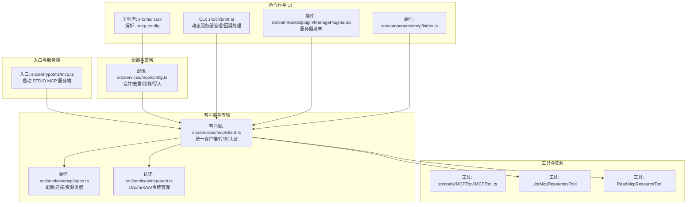
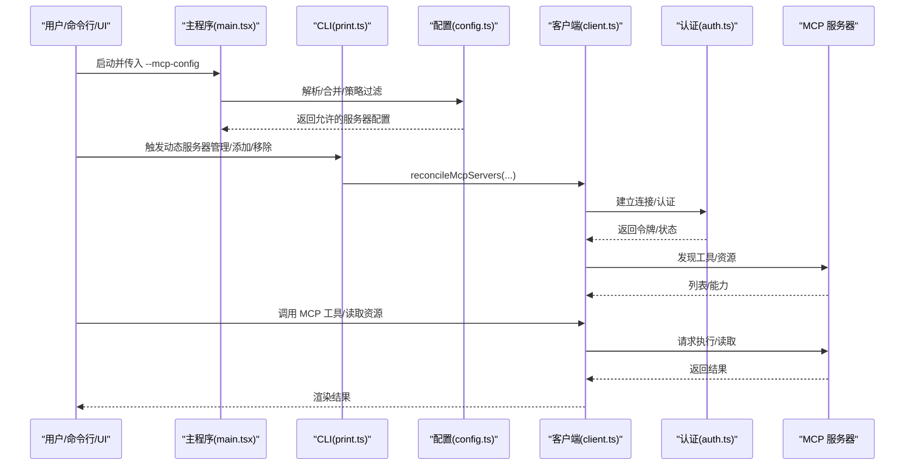
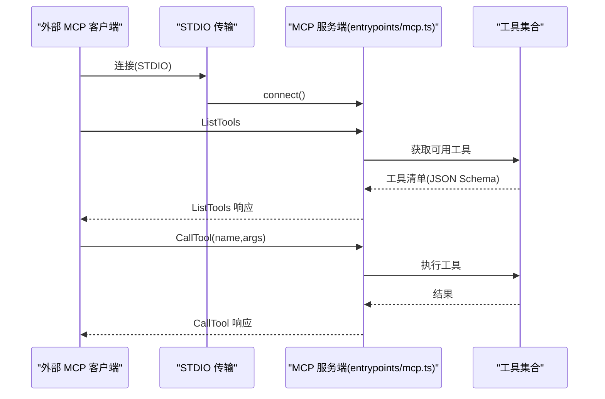
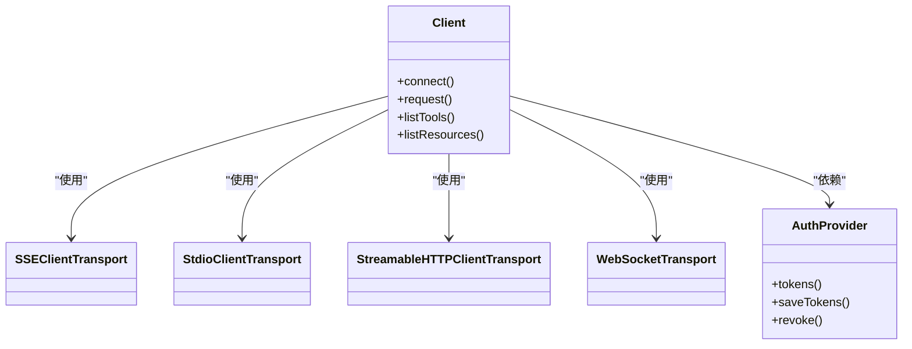
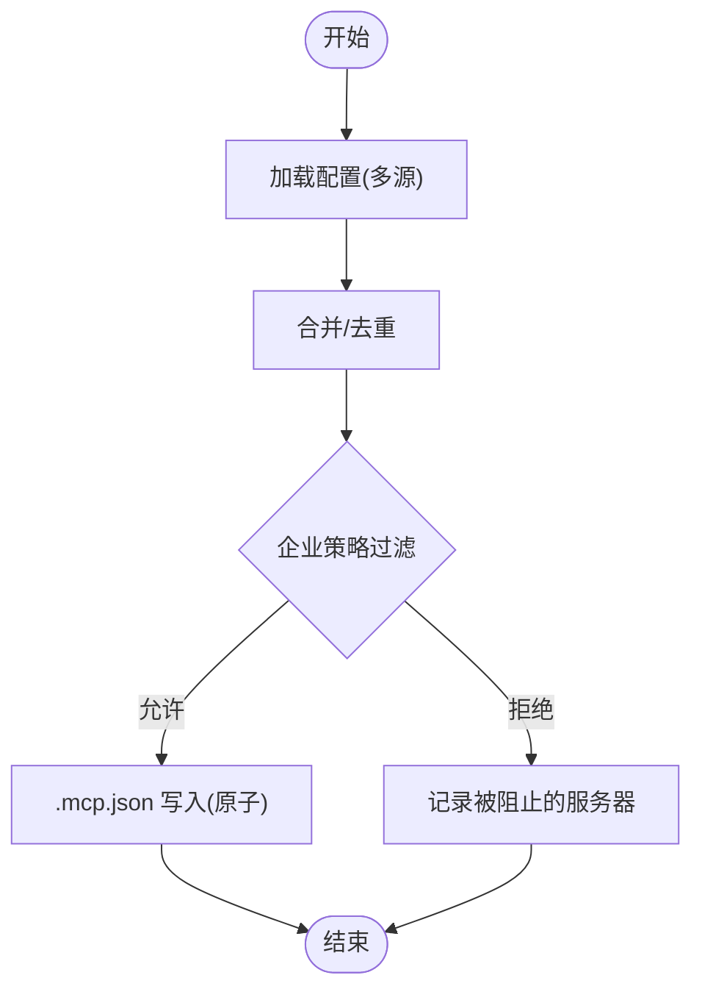
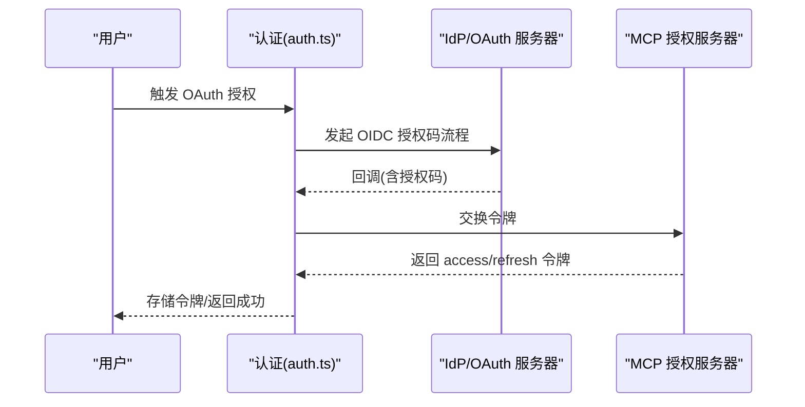
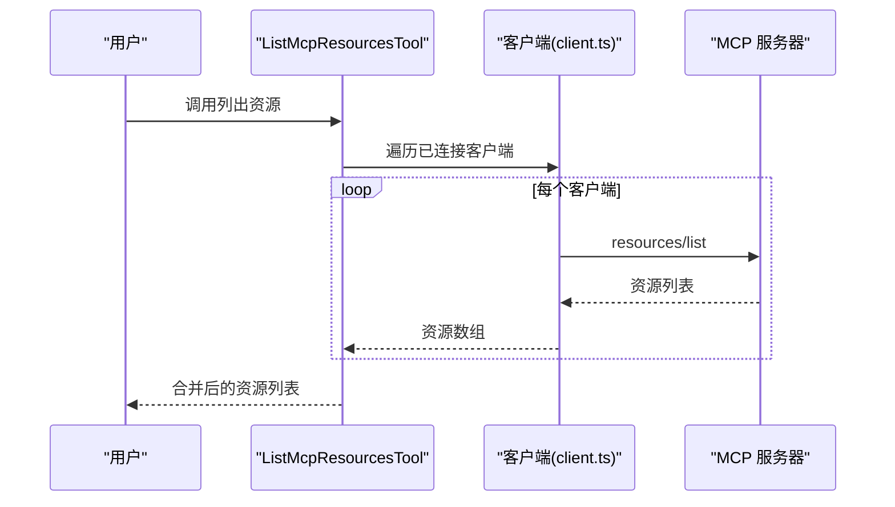
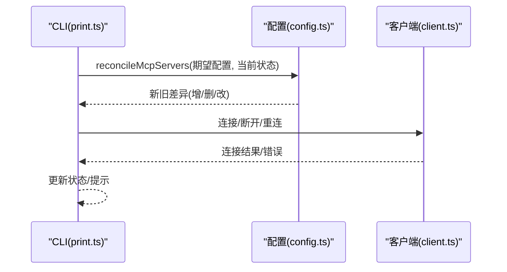
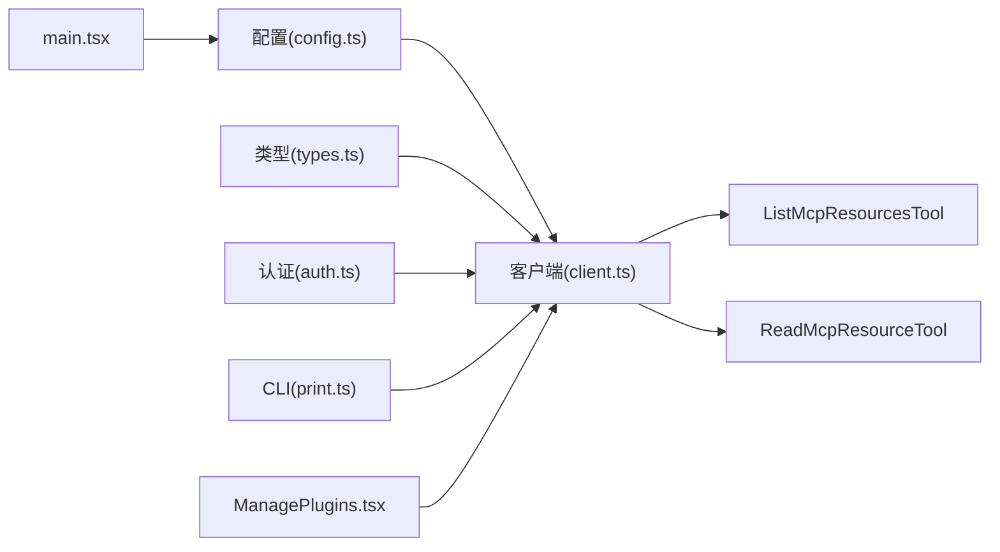

# MCP 集成

<cite>
**本文引用的文件**
- [src/entrypoints/mcp.ts](file://src/entrypoints/mcp.ts)
- [src/services/mcp/types.ts](file://src/services/mcp/types.ts)
- [src/services/mcp/client.ts](file://src/services/mcp/client.ts)
- [src/services/mcp/config.ts](file://src/services/mcp/config.ts)
- [src/services/mcp/auth.ts](file://src/services/mcp/auth.ts)
- [src/tools/MCPTool/MCPTool.ts](file://src/tools/MCPTool/MCPTool.ts)
- [src/tools/ListMcpResourcesTool/ListMcpResourcesTool.ts](file://src/tools/ListMcpResourcesTool/ListMcpResourcesTool.ts)
- [src/tools/ReadMcpResourceTool/ReadMcpResourceTool.ts](file://src/tools/ReadMcpResourceTool/ReadMcpResourceTool.ts)
- [src/tools/McpAuthTool/McpAuthTool.ts](file://src/tools/McpAuthTool/McpAuthTool.ts)
- [src/cli/print.ts](file://src/cli/print.ts)
- [src/main.tsx](file://src/main.tsx)
- [src/commands/plugin/ManagePlugins.tsx](file://src/commands/plugin/ManagePlugins.tsx)
- [src/components/mcp/index.ts](file://src/components/mcp/index.ts)
</cite>

## 目录
1. [简介](#简介)
2. [项目结构](#项目结构)
3. [核心组件](#核心组件)
4. [架构总览](#架构总览)
5. [详细组件分析](#详细组件分析)
6. [依赖分析](#依赖分析)
7. [性能考量](#性能考量)
8. [故障排查指南](#故障排查指南)
9. [结论](#结论)
10. [附录：开发与配置示例](#附录开发与配置示例)

## 简介
本文件系统性阐述 Claude Code 对 MCP（Model Context Protocol）的集成方案与实现细节。MCP 是一个开放协议，允许外部“服务器”以标准化方式向模型提供上下文、工具与资源。在 Claude Code 中，MCP 主要用于：
- 将本地或远程 MCP 服务器接入到 Claude Code 的工具与资源体系中
- 通过统一的客户端抽象支持多种传输（STDIO、HTTP、SSE、WebSocket、IDE 内部通道等）
- 提供认证与授权流程（OAuth、跨应用访问 XAA、令牌刷新与撤销）
- 通过工具封装暴露 MCP 工具与资源给用户与自动化流程

本文件覆盖 MCP 协议概念、在 Claude Code 中的应用场景、服务器配置与管理、工具与资源发现与使用、认证与授权、安全与最佳实践、以及如何开发自定义 MCP 服务器等内容。

## 项目结构
围绕 MCP 的相关代码主要分布在以下模块：
- 入口与服务端适配：MCP 作为服务端运行时（例如通过 STDIO 暴露工具）
- 客户端与传输：统一的 MCP 客户端、认证器与多种传输实现
- 配置与策略：服务器配置解析、合并、去重、企业策略（允许/拒绝列表）
- 工具与资源：将 MCP 工具与资源映射为 Claude Code 工具，支持列出与读取资源
- 命令行与 UI：动态服务器管理、OAuth 流程、插件菜单等

图示来源
- [src/entrypoints/mcp.ts:35-196](file://src/entrypoints/mcp.ts#L35-L196)
- [src/services/mcp/client.ts:1-800](file://src/services/mcp/client.ts#L1-L800)
- [src/services/mcp/types.ts:1-259](file://src/services/mcp/types.ts#L1-L259)
- [src/services/mcp/config.ts:1-800](file://src/services/mcp/config.ts#L1-L800)
- [src/services/mcp/auth.ts:1-800](file://src/services/mcp/auth.ts#L1-L800)
- [src/tools/MCPTool/MCPTool.ts:1-78](file://src/tools/MCPTool/MCPTool.ts#L1-L78)
- [src/tools/ListMcpResourcesTool/ListMcpResourcesTool.ts:1-124](file://src/tools/ListMcpResourcesTool/ListMcpResourcesTool.ts#L1-L124)
- [src/tools/ReadMcpResourceTool/ReadMcpResourceTool.ts:1-159](file://src/tools/ReadMcpResourceTool/ReadMcpResourceTool.ts#L1-L159)
- [src/cli/print.ts:5446-5479](file://src/cli/print.ts#L5446-L5479)
- [src/main.tsx:1413-1422](file://src/main.tsx#L1413-L1422)
- [src/commands/plugin/ManagePlugins.tsx:1972-2002](file://src/commands/plugin/ManagePlugins.tsx#L1972-L2002)
- [src/components/mcp/index.ts:1-10](file://src/components/mcp/index.ts#L1-L10)

章节来源
- [src/entrypoints/mcp.ts:35-196](file://src/entrypoints/mcp.ts#L35-L196)
- [src/services/mcp/types.ts:1-259](file://src/services/mcp/types.ts#L1-L259)
- [src/services/mcp/client.ts:1-800](file://src/services/mcp/client.ts#L1-L800)
- [src/services/mcp/config.ts:1-800](file://src/services/mcp/config.ts#L1-L800)
- [src/services/mcp/auth.ts:1-800](file://src/services/mcp/auth.ts#L1-L800)
- [src/tools/MCPTool/MCPTool.ts:1-78](file://src/tools/MCPTool/MCPTool.ts#L1-L78)
- [src/tools/ListMcpResourcesTool/ListMcpResourcesTool.ts:1-124](file://src/tools/ListMcpResourcesTool/ListMcpResourcesTool.ts#L1-L124)
- [src/tools/ReadMcpResourceTool/ReadMcpResourceTool.ts:1-159](file://src/tools/ReadMcpResourceTool/ReadMcpResourceTool.ts#L1-L159)
- [src/cli/print.ts:5446-5479](file://src/cli/print.ts#L5446-L5479)
- [src/main.tsx:1413-1422](file://src/main.tsx#L1413-L1422)
- [src/commands/plugin/ManagePlugins.tsx:1972-2002](file://src/commands/plugin/ManagePlugins.tsx#L1972-L2002)
- [src/components/mcp/index.ts:1-10](file://src/components/mcp/index.ts#L1-L10)

## 核心组件
- MCP 服务端入口（STDIO）：将 Claude Code 内置工具暴露为 MCP 工具，供外部 MCP 客户端调用
- MCP 客户端：统一抽象不同传输（STDIO、HTTP、SSE、WebSocket、IDE 内部通道），负责连接、认证、工具与资源发现、请求转发与结果处理
- 类型与配置：定义服务器配置、连接状态、资源类型；提供配置合并、去重、企业策略过滤、写入 .mcp.json 等能力
- 认证与授权：OAuth 发现、授权码/PKCE、令牌刷新与撤销；XAA（跨应用访问）；令牌缓存与失效处理
- 工具与资源：将 MCP 工具映射为 Claude Code 工具；提供列出与读取 MCP 资源的能力
- 动态服务器管理：CLI 与 UI 支持添加/移除/更新 MCP 服务器，处理配置变更与连接状态

章节来源
- [src/entrypoints/mcp.ts:35-196](file://src/entrypoints/mcp.ts#L35-L196)
- [src/services/mcp/client.ts:1-800](file://src/services/mcp/client.ts#L1-L800)
- [src/services/mcp/types.ts:1-259](file://src/services/mcp/types.ts#L1-L259)
- [src/services/mcp/config.ts:1-800](file://src/services/mcp/config.ts#L1-L800)
- [src/services/mcp/auth.ts:1-800](file://src/services/mcp/auth.ts#L1-L800)
- [src/tools/MCPTool/MCPTool.ts:1-78](file://src/tools/MCPTool/MCPTool.ts#L1-L78)
- [src/tools/ListMcpResourcesTool/ListMcpResourcesTool.ts:1-124](file://src/tools/ListMcpResourcesTool/ListMcpResourcesTool.ts#L1-L124)
- [src/tools/ReadMcpResourceTool/ReadMcpResourceTool.ts:1-159](file://src/tools/ReadMcpResourceTool/ReadMcpResourceTool.ts#L1-L159)
- [src/cli/print.ts:5446-5479](file://src/cli/print.ts#L5446-L5479)

## 架构总览
下图展示了 MCP 在 Claude Code 中的整体交互：从配置加载、连接建立、认证与授权、工具与资源发现，到工具调用与资源读取。

图示来源
- [src/main.tsx:1413-1422](file://src/main.tsx#L1413-L1422)
- [src/cli/print.ts:5446-5479](file://src/cli/print.ts#L5446-L5479)
- [src/services/mcp/config.ts:1-800](file://src/services/mcp/config.ts#L1-L800)
- [src/services/mcp/client.ts:1-800](file://src/services/mcp/client.ts#L1-L800)
- [src/services/mcp/auth.ts:1-800](file://src/services/mcp/auth.ts#L1-L800)

## 详细组件分析

### 组件一：MCP 服务端入口（STDIO）
- 作用：以 STDIO 传输启动 MCP 服务端，将 Claude Code 的工具暴露为 MCP 工具，供外部 MCP 客户端调用
- 关键点：
  - 初始化 Server 并注册 ListTools/C净Tool 请求处理器
  - 将工具输入/输出模式转换为 MCP 所需的 JSON Schema
  - 通过工具权限上下文与消息环境执行工具调用
  - 连接后通过 STDIO 传输与客户端通信

图示来源
- [src/entrypoints/mcp.ts:35-196](file://src/entrypoints/mcp.ts#L35-L196)

章节来源
- [src/entrypoints/mcp.ts:35-196](file://src/entrypoints/mcp.ts#L35-L196)

### 组件二：MCP 客户端与传输
- 作用：统一管理 MCP 服务器连接、认证、工具与资源发现、请求转发与结果处理
- 关键点：
  - 支持多种传输：STDIO、HTTP(SSE/Streamable HTTP)、WebSocket、IDE 内部通道
  - 连接状态抽象：connected/failed/needs-auth/pending/disabled
  - 认证：OAuth 授权码/PKCE、令牌刷新、撤销；XAA（跨应用访问）
  - 工具与资源：工具列表、工具调用、资源列表、资源读取
  - 错误处理：会话过期检测、超时包装、批量连接与回退策略

图示来源
- [src/services/mcp/client.ts:1-800](file://src/services/mcp/client.ts#L1-L800)
- [src/services/mcp/types.ts:179-227](file://src/services/mcp/types.ts#L179-L227)
- [src/services/mcp/auth.ts:1-800](file://src/services/mcp/auth.ts#L1-L800)

章节来源
- [src/services/mcp/client.ts:1-800](file://src/services/mcp/client.ts#L1-L800)
- [src/services/mcp/types.ts:179-227](file://src/services/mcp/types.ts#L179-L227)
- [src/services/mcp/auth.ts:1-800](file://src/services/mcp/auth.ts#L1-L800)

### 组件三：配置与策略
- 作用：解析与合并多源 MCP 配置，执行去重与企业策略过滤，支持写入 .mcp.json
- 关键点：
  - 配置来源与范围：local/user/project/dynamic/enterprise/claudeai
  - 去重策略：基于命令/URL 的签名匹配，避免重复连接
  - 企业策略：允许/拒绝列表，支持名称、命令、URL 模式匹配
  - 写入 .mcp.json：原子写入、保留权限、清理临时文件

图示来源
- [src/services/mcp/config.ts:1-800](file://src/services/mcp/config.ts#L1-L800)

章节来源
- [src/services/mcp/config.ts:1-800](file://src/services/mcp/config.ts#L1-L800)

### 组件四：认证与授权
- 作用：提供 OAuth 发现、授权码/PKCE、令牌刷新与撤销；支持 XAA（跨应用访问）
- 关键点：
  - OAuth 发现：RFC 9728/RFC 8414 自动发现授权服务器元数据
  - 授权流程：state/nonce/redirect_uri/回调端口管理；敏感参数日志脱敏
  - 令牌管理：存储键值生成、缓存 TTL、撤销（先刷新令牌再访问令牌）
  - XAA：一次 IdP 登录复用到多个 MCP 服务器，按 IdP 与 AS 分离密钥存储
  - 失败与重试：分析失败原因并上报事件，支持重试与降级

图示来源
- [src/services/mcp/auth.ts:1-800](file://src/services/mcp/auth.ts#L1-L800)

章节来源
- [src/services/mcp/auth.ts:1-800](file://src/services/mcp/auth.ts#L1-L800)

### 组件五：工具与资源
- MCP 工具（MCPTool）：作为占位符工具，运行时动态替换为具体 MCP 工具名与参数，具备渲染与截断处理
- 列出资源（ListMcpResourcesTool）：遍历已连接的 MCP 服务器，拉取资源清单，聚合返回
- 读取资源（ReadMcpResourceTool）：按服务器与 URI 读取资源，自动处理文本与二进制内容持久化

图示来源
- [src/tools/ListMcpResourcesTool/ListMcpResourcesTool.ts:1-124](file://src/tools/ListMcpResourcesTool/ListMcpResourcesTool.ts#L1-L124)
- [src/tools/ReadMcpResourceTool/ReadMcpResourceTool.ts:1-159](file://src/tools/ReadMcpResourceTool/ReadMcpResourceTool.ts#L1-L159)
- [src/tools/MCPTool/MCPTool.ts:1-78](file://src/tools/MCPTool/MCPTool.ts#L1-L78)

章节来源
- [src/tools/MCPTool/MCPTool.ts:1-78](file://src/tools/MCPTool/MCPTool.ts#L1-L78)
- [src/tools/ListMcpResourcesTool/ListMcpResourcesTool.ts:1-124](file://src/tools/ListMcpResourcesTool/ListMcpResourcesTool.ts#L1-L124)
- [src/tools/ReadMcpResourceTool/ReadMcpResourceTool.ts:1-159](file://src/tools/ReadMcpResourceTool/ReadMcpResourceTool.ts#L1-L159)

### 组件六：动态服务器管理与 UI
- 动态服务器管理（CLI）：根据期望状态与当前状态对比，增删改服务器配置，处理连接与错误
- 插件菜单：根据传输类型显示对应的服务器菜单（STDIO/SSE/HTTP/WS/SDK）
- OAuth 回调：在 CLI 场景下等待授权回调或直接返回授权 URL

图示来源
- [src/cli/print.ts:5446-5479](file://src/cli/print.ts#L5446-L5479)
- [src/services/mcp/config.ts:1-800](file://src/services/mcp/config.ts#L1-L800)
- [src/services/mcp/client.ts:1-800](file://src/services/mcp/client.ts#L1-L800)
- [src/commands/plugin/ManagePlugins.tsx:1972-2002](file://src/commands/plugin/ManagePlugins.tsx#L1972-L2002)

章节来源
- [src/cli/print.ts:5446-5479](file://src/cli/print.ts#L5446-L5479)
- [src/commands/plugin/ManagePlugins.tsx:1972-2002](file://src/commands/plugin/ManagePlugins.tsx#L1972-L2002)

## 依赖分析
- 组件耦合与内聚
  - 客户端对传输层与认证层高度内聚，通过抽象接口屏蔽底层差异
  - 工具与资源模块依赖客户端提供的连接与能力探测
  - 配置模块为客户端与 UI 提供统一的服务器清单与策略
- 外部依赖与集成点
  - MCP SDK（客户端/服务端）、OAuth 客户端、HTTP/SSE/WebSocket 传输
  - 企业策略与托管配置（.mcp.json、全局/项目配置）
- 潜在循环依赖
  - 客户端与认证模块相互协作，但通过接口与工厂函数避免直接循环
  - 工具模块仅通过客户端接口调用，不反向依赖客户端内部实现

图示来源
- [src/services/mcp/config.ts:1-800](file://src/services/mcp/config.ts#L1-L800)
- [src/services/mcp/client.ts:1-800](file://src/services/mcp/client.ts#L1-L800)
- [src/services/mcp/types.ts:1-259](file://src/services/mcp/types.ts#L1-L259)
- [src/services/mcp/auth.ts:1-800](file://src/services/mcp/auth.ts#L1-L800)
- [src/tools/ListMcpResourcesTool/ListMcpResourcesTool.ts:1-124](file://src/tools/ListMcpResourcesTool/ListMcpResourcesTool.ts#L1-L124)
- [src/tools/ReadMcpResourceTool/ReadMcpResourceTool.ts:1-159](file://src/tools/ReadMcpResourceTool/ReadMcpResourceTool.ts#L1-L159)
- [src/cli/print.ts:5446-5479](file://src/cli/print.ts#L5446-L5479)
- [src/main.tsx:1413-1422](file://src/main.tsx#L1413-L1422)
- [src/commands/plugin/ManagePlugins.tsx:1972-2002](file://src/commands/plugin/ManagePlugins.tsx#L1972-L2002)

章节来源
- [src/services/mcp/config.ts:1-800](file://src/services/mcp/config.ts#L1-L800)
- [src/services/mcp/client.ts:1-800](file://src/services/mcp/client.ts#L1-L800)
- [src/services/mcp/types.ts:1-259](file://src/services/mcp/types.ts#L1-L259)
- [src/services/mcp/auth.ts:1-800](file://src/services/mcp/auth.ts#L1-L800)
- [src/tools/ListMcpResourcesTool/ListMcpResourcesTool.ts:1-124](file://src/tools/ListMcpResourcesTool/ListMcpResourcesTool.ts#L1-L124)
- [src/tools/ReadMcpResourceTool/ReadMcpResourceTool.ts:1-159](file://src/tools/ReadMcpResourceTool/ReadMcpResourceTool.ts#L1-L159)
- [src/cli/print.ts:5446-5479](file://src/cli/print.ts#L5446-L5479)
- [src/main.tsx:1413-1422](file://src/main.tsx#L1413-L1422)
- [src/commands/plugin/ManagePlugins.tsx:1972-2002](file://src/commands/plugin/ManagePlugins.tsx#L1972-L2002)

## 性能考量
- 连接与并发
  - 批量连接大小可配置，远端服务器默认批大小较高，本地/STDIO 较小
  - 连接超时与请求超时分离，避免单次信号过期导致后续请求失败
- 缓存与去重
  - 资源列表与工具列表采用 LRU 缓存，连接关闭或资源变更时失效
  - 基于命令/URL 签名的去重，减少重复连接与资源扫描
- 输出与内存
  - 工具输出截断与二进制内容落盘，避免大对象直接进入上下文
  - STDIO 服务端使用 LRU 缓存文件状态，限制内存增长

[本节为通用指导，无需特定文件来源]

## 故障排查指南
- 连接失败/认证需要
  - 检查服务器是否在企业策略允许范围内；查看“需要认证”状态并触发 OAuth
  - 查看 CLI 或 UI 中的连接状态与错误信息，必要时清除认证缓存
- 会话过期
  - 若出现“会话未找到”错误，客户端会抛出会话过期异常；重新获取连接并重试
- OAuth 失败
  - 校验回调端口可用性、state/nonce 匹配、授权服务器元数据发现
  - 对非标准错误码进行归一化处理，确保令牌失效逻辑正确
- 资源读取异常
  - 确认服务器具备资源能力；检查 URI 是否有效；二进制资源会自动落盘并返回路径

章节来源
- [src/services/mcp/client.ts:193-206](file://src/services/mcp/client.ts#L193-L206)
- [src/services/mcp/auth.ts:108-125](file://src/services/mcp/auth.ts#L108-L125)
- [src/tools/ReadMcpResourceTool/ReadMcpResourceTool.ts:75-92](file://src/tools/ReadMcpResourceTool/ReadMcpResourceTool.ts#L75-L92)

## 结论
Claude Code 对 MCP 的集成以“统一客户端 + 多传输 + 企业策略 + 完整认证链路”为核心设计，既满足本地 STDIO 服务端场景，也覆盖远程 HTTP/SSE/WebSocket 等多种传输。通过工具与资源的映射、动态服务器管理与 UI 支持，用户可以灵活地将外部 MCP 服务器纳入工作流。在安全方面，OAuth 自动发现、令牌撤销与 XAA 支持提供了完善的授权与审计能力。

[本节为总结，无需特定文件来源]

## 附录：开发与配置示例

### MCP 协议与应用场景
- 协议概念：MCP 定义了服务器与客户端之间的标准化通信方式，支持工具、提示词、资源等能力
- 应用场景：在 Claude Code 中，MCP 可用于扩展工具集、引入外部知识库资源、对接 IDE/平台能力等

[本节为概念说明，无需特定文件来源]

### MCP 服务器配置与管理
- 配置来源与范围：local/user/project/dynamic/enterprise/claudeai
- 添加/移除服务器：通过命令行或 UI，支持写入 .mcp.json 或更新全局/项目配置
- 企业策略：允许/拒绝列表，支持名称、命令、URL 模式匹配；手动配置优先于插件/连接器

章节来源
- [src/services/mcp/config.ts:625-761](file://src/services/mcp/config.ts#L625-L761)
- [src/services/mcp/config.ts:769-813](file://src/services/mcp/config.ts#L769-L813)
- [src/services/mcp/config.ts:417-508](file://src/services/mcp/config.ts#L417-L508)

### MCP 工具的发现与使用
- 工具发现：客户端连接后调用工具列表接口，结合权限上下文与消息环境
- 工具调用：将 MCP 工具映射为 Claude Code 工具，支持渲染与截断处理
- 示例：通过 MCPTool 工具占位，运行时替换为具体工具名与参数

章节来源
- [src/entrypoints/mcp.ts:59-96](file://src/entrypoints/mcp.ts#L59-L96)
- [src/tools/MCPTool/MCPTool.ts:27-77](file://src/tools/MCPTool/MCPTool.ts#L27-L77)

### MCP 资源的管理与访问控制
- 资源发现：客户端调用资源列表接口，支持按服务器过滤
- 资源读取：按 URI 读取资源，自动处理文本与二进制内容持久化
- 访问控制：企业策略可限制资源可见性；资源能力由服务器声明

章节来源
- [src/tools/ListMcpResourcesTool/ListMcpResourcesTool.ts:66-101](file://src/tools/ListMcpResourcesTool/ListMcpResourcesTool.ts#L66-L101)
- [src/tools/ReadMcpResourceTool/ReadMcpResourceTool.ts:75-101](file://src/tools/ReadMcpResourceTool/ReadMcpResourceTool.ts#L75-L101)

### MCP 认证与授权机制
- OAuth：自动发现授权服务器元数据，支持授权码/PKCE、令牌刷新与撤销
- XAA：跨应用访问，一次 IdP 登录复用到多个 MCP 服务器
- 安全考虑：敏感参数日志脱敏、令牌撤销、会话过期检测、重试与降级

章节来源
- [src/services/mcp/auth.ts:256-311](file://src/services/mcp/auth.ts#L256-L311)
- [src/services/mcp/auth.ts:664-800](file://src/services/mcp/auth.ts#L664-L800)
- [src/services/mcp/client.ts:340-361](file://src/services/mcp/client.ts#L340-L361)

### MCP 服务器开发指南
- 选择传输：STDIO（本地进程）、HTTP/SSE/WebSocket（远程）
- 实现能力：工具、提示词、资源等能力接口
- 集成测试：通过 Claude Code 的 MCP 客户端连接验证能力与认证流程

章节来源
- [src/services/mcp/types.ts:28-135](file://src/services/mcp/types.ts#L28-L135)
- [src/entrypoints/mcp.ts:35-196](file://src/entrypoints/mcp.ts#L35-L196)

### MCP 与现有工具系统的集成关系
- 工具映射：MCP 工具通过 MCPTool 占位，运行时注入具体工具名与参数
- 资源映射：MCP 资源通过 ListMcpResourcesTool/ReadMcpResourceTool 暴露
- 权限与消息：工具调用与资源读取共享 Claude Code 的权限与消息环境

章节来源
- [src/tools/MCPTool/MCPTool.ts:27-77](file://src/tools/MCPTool/MCPTool.ts#L27-L77)
- [src/tools/ListMcpResourcesTool/ListMcpResourcesTool.ts:66-101](file://src/tools/ListMcpResourcesTool/ListMcpResourcesTool.ts#L66-L101)
- [src/tools/ReadMcpResourceTool/ReadMcpResourceTool.ts:75-101](file://src/tools/ReadMcpResourceTool/ReadMcpResourceTool.ts#L75-L101)

### 实际使用示例与配置案例
- 本地 STDIO 服务器：通过命令与参数启动，自动发现并连接
- 远程 HTTP/SSE 服务器：配置 URL 与可选头部，支持 OAuth 与 XAA
- 动态服务器管理：CLI 与 UI 支持增删改服务器，自动处理连接状态与错误

章节来源
- [src/services/mcp/types.ts:28-135](file://src/services/mcp/types.ts#L28-L135)
- [src/cli/print.ts:5446-5479](file://src/cli/print.ts#L5446-L5479)
- [src/commands/plugin/ManagePlugins.tsx:1972-2002](file://src/commands/plugin/ManagePlugins.tsx#L1972-L2002)