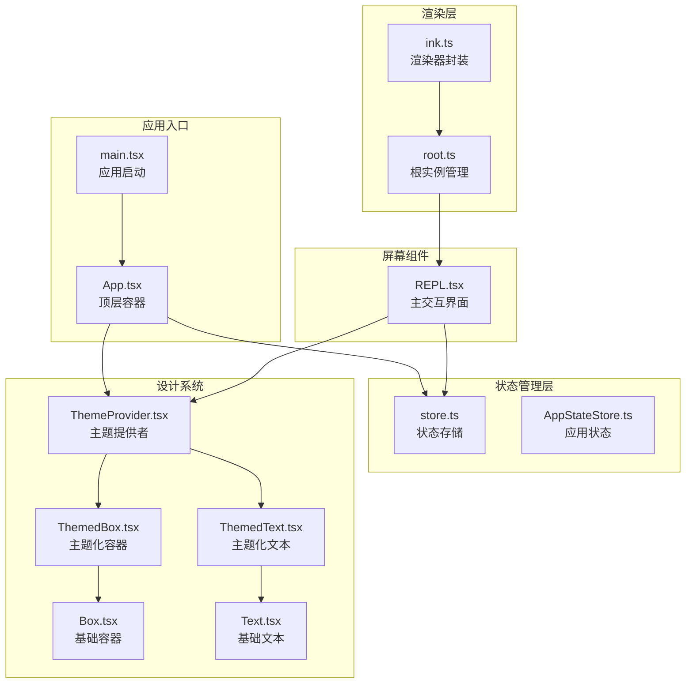
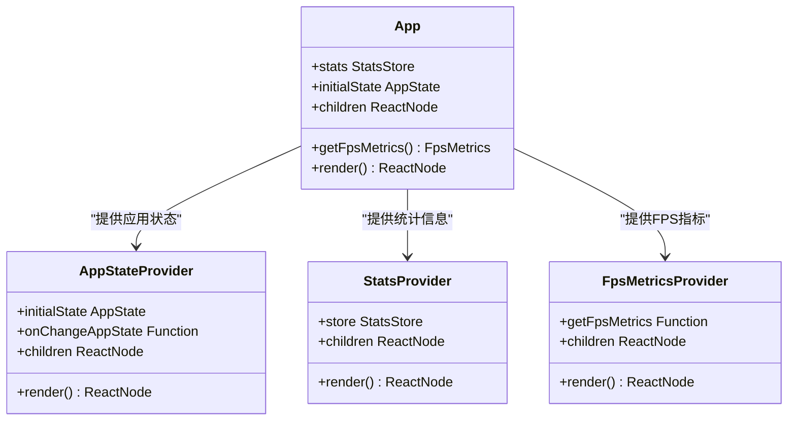
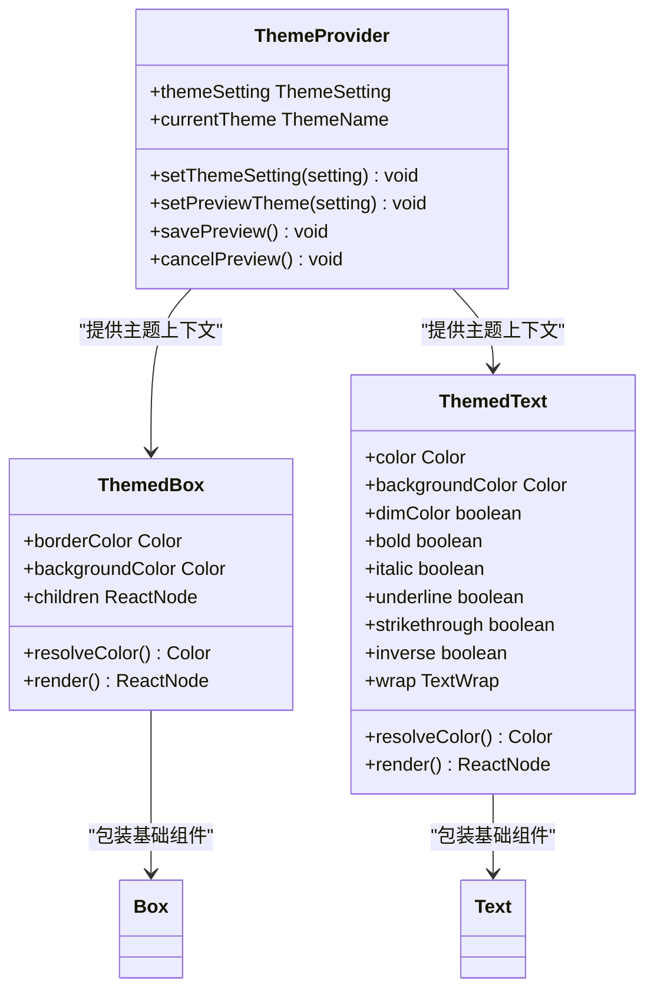
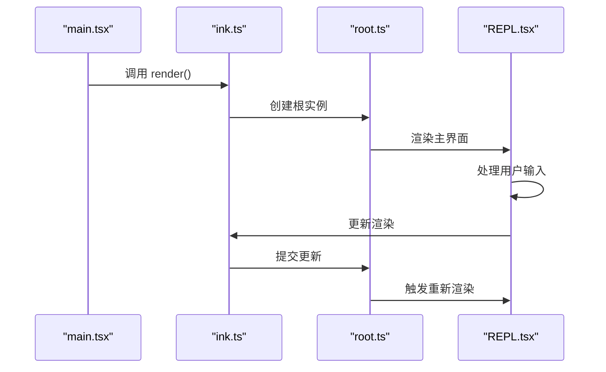
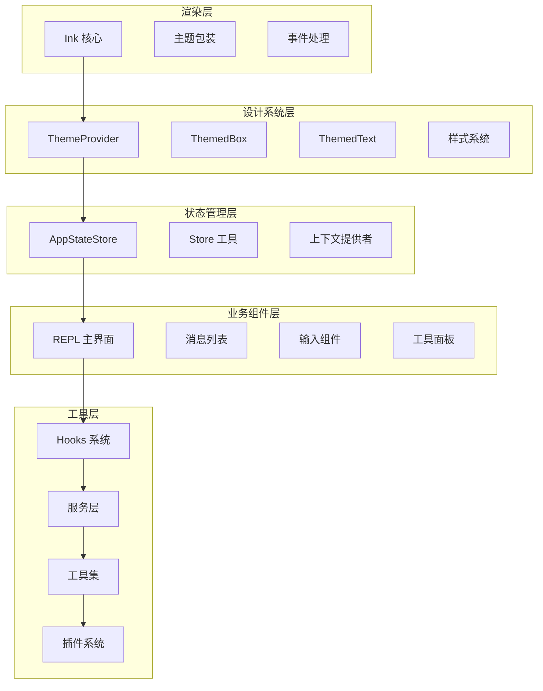
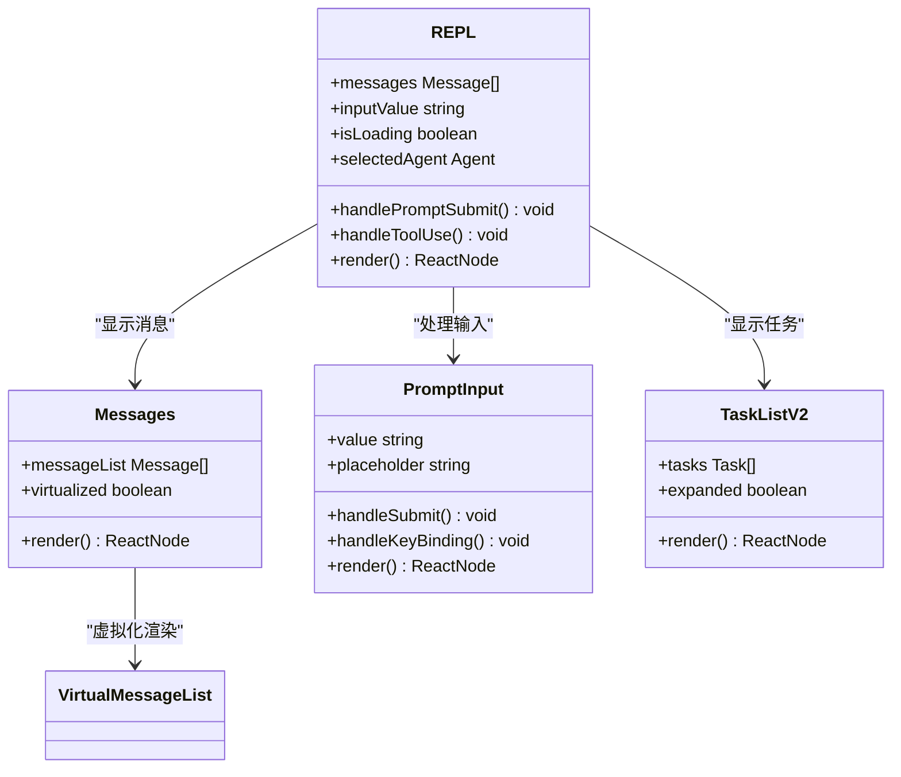
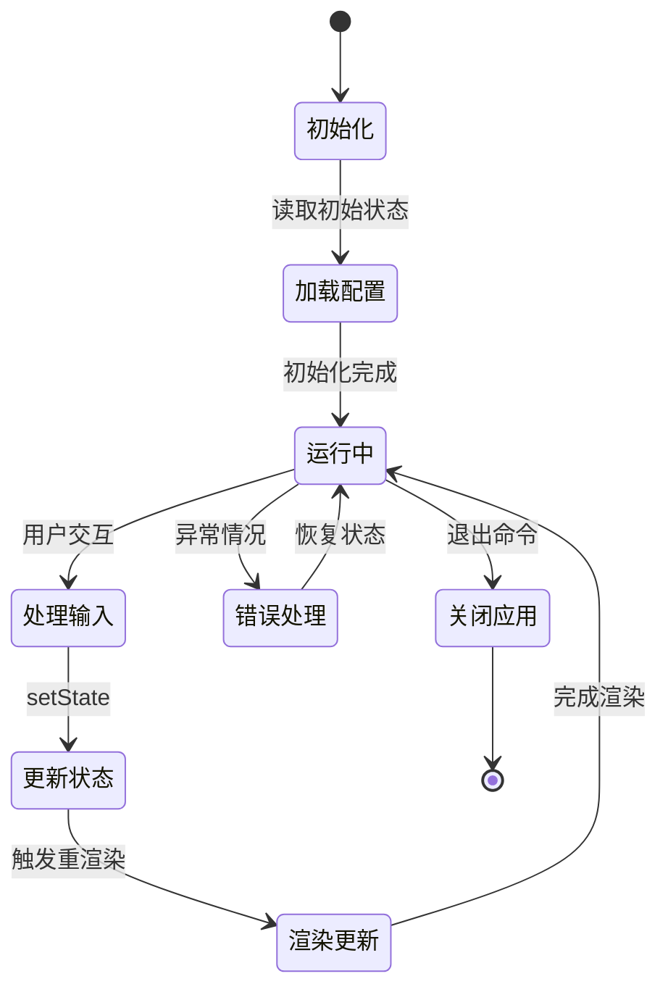
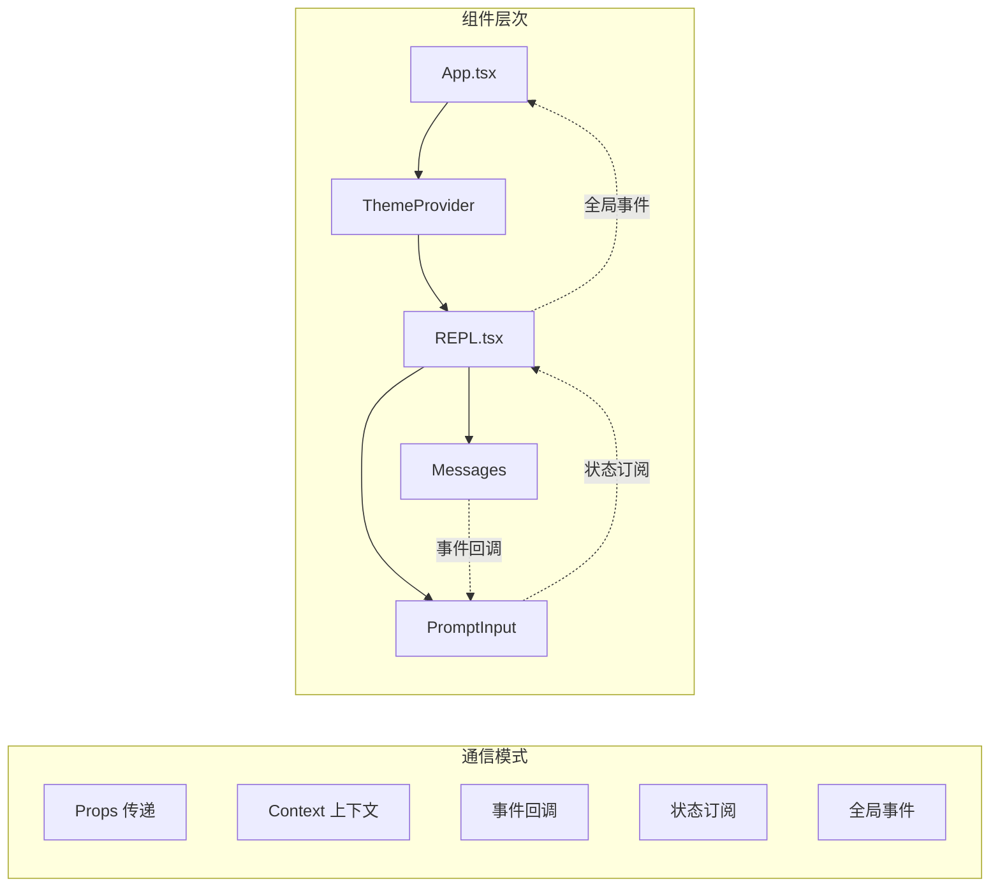
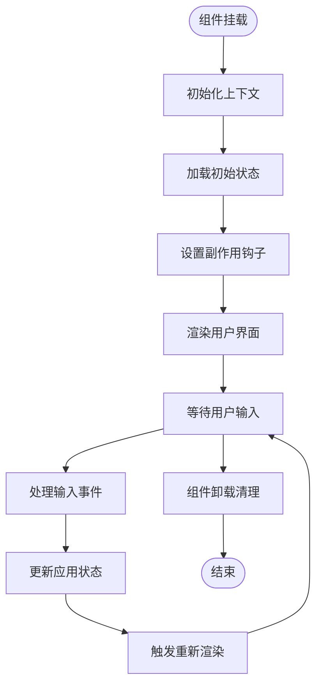

# React 组件架构

<cite>
**本文档引用的文件**
- [App.tsx](file://src/components/App.tsx)
- [main.tsx](file://src/main.tsx)
- [ink.ts](file://src/ink.ts)
- [AppStateStore.ts](file://src/state/AppStateStore.ts)
- [store.ts](file://src/state/store.ts)
- [root.ts](file://src/ink/root.ts)
- [ThemeProvider.tsx](file://src/components/design-system/ThemeProvider.tsx)
- [ThemedBox.tsx](file://src/components/design-system/ThemedBox.tsx)
- [ThemedText.tsx](file://src/components/design-system/ThemedText.tsx)
- [Box.tsx](file://src/ink/components/Box.tsx)
- [Text.tsx](file://src/ink/components/Text.tsx)
- [REPL.tsx](file://src/screens/REPL.tsx)
- [package.json](file://package.json)
- [README.md](file://README.md)
</cite>

## 目录
1. [简介](#简介)
2. [项目结构](#项目结构)
3. [核心组件](#核心组件)
4. [架构总览](#架构总览)
5. [详细组件分析](#详细组件分析)
6. [依赖关系分析](#依赖关系分析)
7. [性能考量](#性能考量)
8. [故障排除指南](#故障排除指南)
9. [结论](#结论)
10. [附录](#附录)

## 简介
本项目是一个基于 React + Ink 的终端 UI 应用，采用模块化架构设计，通过自定义的 Ink 渲染器与主题系统，为终端环境提供响应式的交互界面。该架构以组件为中心，结合状态管理、上下文提供者和设计系统，实现了高度可扩展且跨平台兼容的终端应用。

## 项目结构
项目采用按功能域划分的目录组织方式，核心模块包括：
- components：UI 组件库，包含基础组件和设计系统组件
- state：全局状态管理，提供应用状态存储和订阅机制
- ink：终端渲染框架封装，提供主题包装和渲染入口
- screens：应用屏幕组件，如 REPL 交互界面
- hooks：自定义 React Hooks，处理终端交互和状态逻辑
- services：业务服务层，处理工具、插件、MCP 等功能
- utils：通用工具函数，支持主题、格式化、权限等

**图表来源**
- [main.tsx:1-800](file://src/main.tsx#L1-L800)
- [App.tsx:1-56](file://src/components/App.tsx#L1-L56)
- [ink.ts:1-86](file://src/ink.ts#L1-L86)
- [root.ts:1-185](file://src/ink/root.ts#L1-L185)

**章节来源**
- [README.md:95-120](file://README.md#L95-L120)
- [package.json:1-34](file://package.json#L1-L34)

## 核心组件
本节深入分析关键组件及其职责和实现原理。

### App.tsx - 顶层应用容器
App.tsx 是整个应用的顶层容器组件，负责提供全局上下文和状态管理：

**图表来源**
- [App.tsx:19-55](file://src/components/App.tsx#L19-L55)

App.tsx 的主要特性：
- **上下文聚合**：同时提供应用状态、统计信息和 FPS 指标上下文
- **性能优化**：使用记忆化避免不必要的重渲染
- **类型安全**：完整的 TypeScript 类型定义确保类型安全

**章节来源**
- [App.tsx:1-56](file://src/components/App.tsx#L1-L56)

### 设计系统组件
设计系统是终端 UI 的核心抽象层，提供一致的主题和样式体验：

**图表来源**
- [ThemeProvider.tsx:43-116](file://src/components/design-system/ThemeProvider.tsx#L43-L116)
- [ThemedBox.tsx:56-154](file://src/components/design-system/ThemedBox.tsx#L56-L154)
- [ThemedText.tsx:80-123](file://src/components/design-system/ThemedText.tsx#L80-L123)

设计系统的实现特点：
- **主题解析**：支持主题键值和原始颜色值的混合使用
- **自动适配**：根据系统主题动态切换明暗模式
- **性能优化**：使用记忆化避免重复的颜色解析

**章节来源**
- [ThemeProvider.tsx:1-170](file://src/components/design-system/ThemeProvider.tsx#L1-L170)
- [ThemedBox.tsx:1-156](file://src/components/design-system/ThemedBox.tsx#L1-L156)
- [ThemedText.tsx:1-124](file://src/components/design-system/ThemedText.tsx#L1-L124)

### Ink 渲染系统
Ink 渲染系统是终端 UI 的基础设施，提供了 React 到终端的桥接能力：

**图表来源**
- [ink.ts:18-31](file://src/ink.ts#L18-L31)
- [root.ts:129-157](file://src/ink/root.ts#L129-L157)

**章节来源**
- [ink.ts:1-86](file://src/ink.ts#L1-L86)
- [root.ts:1-185](file://src/ink/root.ts#L1-L185)

## 架构总览
本项目的整体架构采用分层设计，从底层到上层依次为：渲染层、设计系统层、状态管理层、业务组件层。

**图表来源**
- [main.tsx:585-800](file://src/main.tsx#L585-L800)
- [AppStateStore.ts:89-452](file://src/state/AppStateStore.ts#L89-L452)

## 详细组件分析

### REPL 主界面组件分析
REPL.tsx 是应用的核心交互界面，集成了多种功能模块：

**图表来源**
- [REPL.tsx:1-200](file://src/screens/REPL.tsx#L1-L200)

REPL 组件的关键特性：
- **虚拟化渲染**：使用虚拟滚动处理大量消息的高效渲染
- **多模态输入**：支持文本、快捷键、语音等多种输入方式
- **实时更新**：集成流式响应处理，支持工具调用和进度反馈
- **状态同步**：与全局状态保持同步，确保数据一致性

**章节来源**
- [REPL.tsx:1-200](file://src/screens/REPL.tsx#L1-L200)

### 状态管理系统
状态管理采用集中式存储与局部状态相结合的模式：

**图表来源**
- [store.ts:10-34](file://src/state/store.ts#L10-L34)
- [AppStateStore.ts:456-570](file://src/state/AppStateStore.ts#L456-L570)

**章节来源**
- [store.ts:1-35](file://src/state/store.ts#L1-L35)
- [AppStateStore.ts:1-570](file://src/state/AppStateStore.ts#L1-L570)

## 依赖关系分析

### 组件间通信模式
项目采用多种组件通信模式，确保模块间的松耦合：

**图表来源**
- [App.tsx:19-55](file://src/components/App.tsx#L19-L55)
- [ThemeProvider.tsx:43-116](file://src/components/design-system/ThemeProvider.tsx#L43-L116)
- [REPL.tsx:1-200](file://src/screens/REPL.tsx#L1-L200)

### 组件生命周期管理
组件生命周期采用现代 React 模式，结合 Ink 的特殊需求：

**图表来源**
- [REPL.tsx:1-200](file://src/screens/REPL.tsx#L1-L200)
- [ThemeProvider.tsx:64-80](file://src/components/design-system/ThemeProvider.tsx#L64-L80)

**章节来源**
- [REPL.tsx:1-200](file://src/screens/REPL.tsx#L1-L200)
- [ThemeProvider.tsx:1-170](file://src/components/design-system/ThemeProvider.tsx#L1-L170)

## 性能考量
项目在多个层面实施了性能优化策略：

### 渲染优化
- **记忆化组件**：大量使用 React 记忆化避免不必要的重渲染
- **虚拟化列表**：消息列表采用虚拟滚动技术处理大数据量
- **增量更新**：只更新发生变化的部分，减少全量重绘

### 内存管理
- **状态压缩**：使用深度不可变数据结构减少内存占用
- **缓存策略**：实现多级缓存机制，平衡内存和性能
- **垃圾回收**：及时清理不再使用的资源和监听器

### 启动性能
- **异步初始化**：将非关键初始化操作延迟到首次渲染后执行
- **预取机制**：提前加载可能需要的数据和资源
- **模块分割**：按需加载功能模块，减少初始包大小

## 故障排除指南
常见问题及解决方案：

### 渲染问题
- **症状**：界面不更新或显示异常
- **原因**：状态未正确更新或渲染循环错误
- **解决**：检查状态更新逻辑，确保使用正确的 setState 方法

### 主题问题
- **症状**：主题切换无效或显示错误
- **原因**：主题上下文未正确提供或解析失败
- **解决**：验证 ThemeProvider 包装，检查主题键值有效性

### 输入处理问题
- **症状**：键盘输入无响应或处理异常
- **原因**：事件处理器绑定错误或焦点管理问题
- **解决**：检查 useInput 钩子使用，验证焦点状态

**章节来源**
- [REPL.tsx:1-200](file://src/screens/REPL.tsx#L1-L200)
- [ThemeProvider.tsx:1-170](file://src/components/design-system/ThemeProvider.tsx#L1-L170)

## 结论
本项目成功构建了一个基于 React + Ink 的现代化终端 UI 架构。通过精心设计的分层架构、强大的设计系统和高效的渲染机制，实现了在终端环境中的高质量用户体验。架构的主要优势包括：

- **模块化设计**：清晰的层次结构便于维护和扩展
- **主题系统**：灵活的样式抽象支持多种主题和自定义
- **性能优化**：多层面的优化策略确保流畅的用户体验
- **跨平台兼容**：针对不同终端环境的适配和优化

该架构为类似项目提供了良好的参考模板，展示了如何在受限的终端环境中实现复杂的交互界面。

## 附录

### 最佳实践建议
1. **组件设计**：遵循单一职责原则，保持组件简洁
2. **状态管理**：合理划分全局状态和本地状态
3. **性能监控**：建立完善的性能监控和优化机制
4. **错误处理**：实现健壮的错误边界和恢复机制
5. **测试覆盖**：建立全面的单元测试和集成测试

### 代码示例路径
- [App.tsx:19-55](file://src/components/App.tsx#L19-L55) - 顶层容器实现
- [ThemeProvider.tsx:43-116](file://src/components/design-system/ThemeProvider.tsx#L43-L116) - 主题提供者
- [ThemedBox.tsx:56-154](file://src/components/design-system/ThemedBox.tsx#L56-L154) - 主题化容器组件
- [REPL.tsx:1-200](file://src/screens/REPL.tsx#L1-L200) - 主交互界面