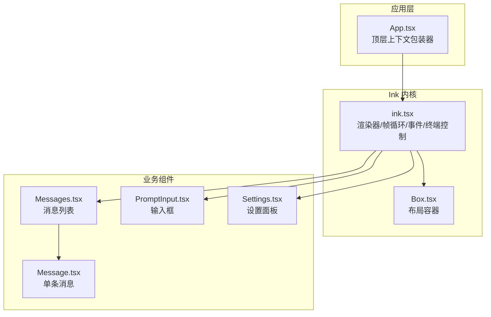
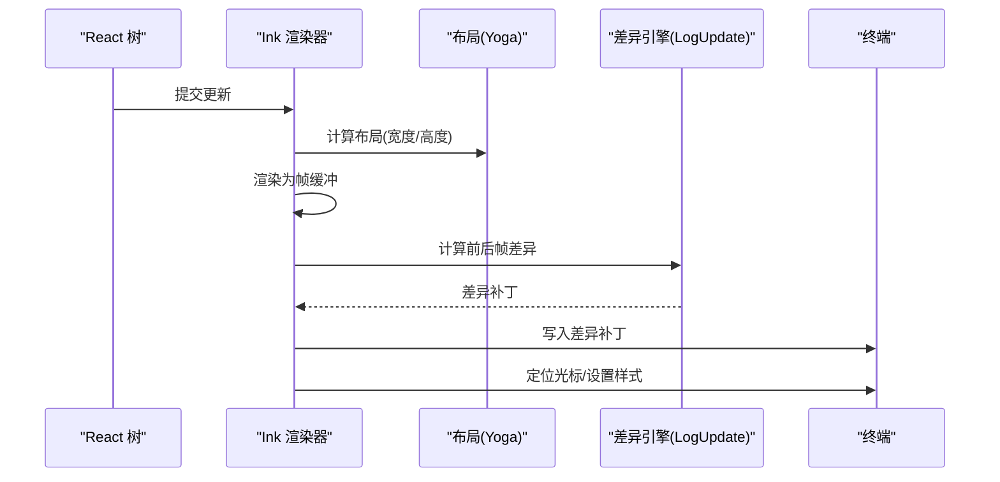
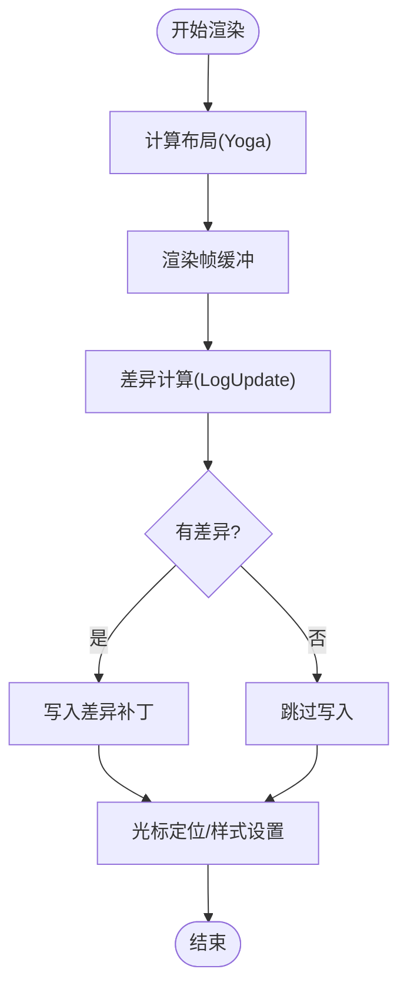
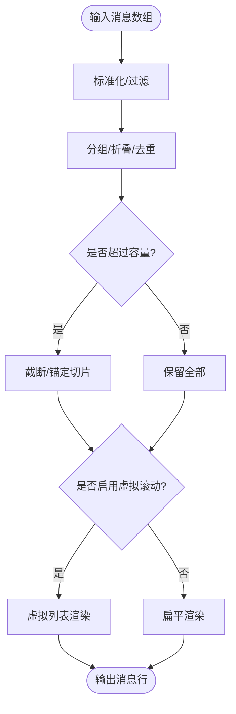
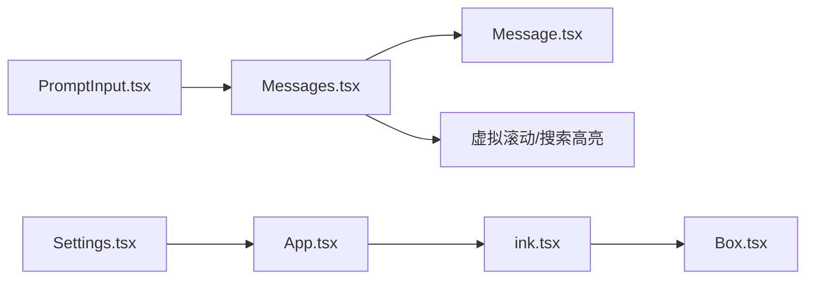

# UI 组件

<cite>
**本文引用的文件**
- [src/components/App.tsx](file://src/components/App.tsx)
- [src/ink/ink.tsx](file://src/ink/ink.tsx)
- [src/ink/components/Box.tsx](file://src/ink/components/Box.tsx)
- [src/components/Messages.tsx](file://src/components/Messages.tsx)
- [src/components/Message.tsx](file://src/components/Message.tsx)
- [src/components/PromptInput/PromptInput.tsx](file://src/components/PromptInput/PromptInput.tsx)
- [src/components/Settings/Settings.tsx](file://src/components/Settings/Settings.tsx)
</cite>

## 目录
1. [简介](#简介)
2. [项目结构](#项目结构)
3. [核心组件](#核心组件)
4. [架构总览](#架构总览)
5. [组件详解](#组件详解)
6. [依赖关系分析](#依赖关系分析)
7. [性能考量](#性能考量)
8. [故障排查指南](#故障排查指南)
9. [结论](#结论)
10. [附录](#附录)

## 简介
本文件系统化梳理 Claude Code 的 UI 组件体系，重点围绕基于 React + Ink 的终端 UI 架构展开，解释组件层次与渲染机制，覆盖消息显示、输入、设置等核心 UI 组件，并深入解析 Ink 框架在终端环境中的实现细节（如布局、帧渲染、光标与选择、事件分发等）。同时提供自定义组件开发指南、样式与主题支持说明、组件间数据传递与状态管理策略，以及常见使用示例与交互模式。

## 项目结构
- 应用入口与顶层上下文
  - 应用顶层包装器提供 FPS、统计与应用状态上下文，作为所有会话交互的根容器。
- Ink 渲染内核
  - Ink 负责将 React 树渲染到终端，包含帧缓冲、差异计算、光标定位、选择与超链接处理、Alt 屏幕切换、事件派发等能力。
- UI 组件层
  - 基于 Ink 的 Box、Text 等基础布局与文本组件，构建消息列表、输入框、设置面板等业务 UI。
- 业务组件
  - 消息显示组件（Messages、Message）、输入组件（PromptInput）、设置组件（Settings）等。

**图表来源**
- [src/components/App.tsx](file://src/components/App.tsx)
- [src/ink/ink.tsx](file://src/ink/ink.tsx)
- [src/ink/components/Box.tsx](file://src/ink/components/Box.tsx)
- [src/components/Messages.tsx](file://src/components/Messages.tsx)
- [src/components/Message.tsx](file://src/components/Message.tsx)
- [src/components/PromptInput/PromptInput.tsx](file://src/components/PromptInput/PromptInput.tsx)
- [src/components/Settings/Settings.tsx](file://src/components/Settings/Settings.tsx)

**章节来源**
- [src/components/App.tsx](file://src/components/App.tsx)
- [src/ink/ink.tsx](file://src/ink/ink.tsx)
- [src/ink/components/Box.tsx](file://src/ink/components/Box.tsx)
- [src/components/Messages.tsx](file://src/components/Messages.tsx)
- [src/components/Message.tsx](file://src/components/Message.tsx)
- [src/components/PromptInput/PromptInput.tsx](file://src/components/PromptInput/PromptInput.tsx)
- [src/components/Settings/Settings.tsx](file://src/components/Settings/Settings.tsx)

## 核心组件
- App.tsx：顶层上下文包装器，注入 FPS、统计与应用状态，向下提供给整个组件树。
- ink.tsx：Ink 渲染器，负责 React 树到终端的渲染、帧循环、差异优化、光标与选择、Alt 屏幕、事件派发、终端模式恢复等。
- Box.tsx：Ink 基础布局容器，提供 Flex 布局、焦点、点击与键盘事件等能力。
- Messages.tsx：消息列表组件，负责消息归并、折叠、截断、虚拟滚动、搜索高亮、位置高亮、转录模式等。
- Message.tsx：单条消息渲染器，按消息类型分派到具体子组件（文本、工具调用、系统消息等），并支持“思考”内容的隐藏/显示控制。
- PromptInput.tsx：用户输入组件，集成历史搜索、提示、语音指示、脚本队列、底部栏等。
- Settings.tsx：设置面板组件，承载配置项与状态展示。

**章节来源**
- [src/components/App.tsx](file://src/components/App.tsx)
- [src/ink/ink.tsx](file://src/ink/ink.tsx)
- [src/ink/components/Box.tsx](file://src/ink/components/Box.tsx)
- [src/components/Messages.tsx](file://src/components/Messages.tsx)
- [src/components/Message.tsx](file://src/components/Message.tsx)
- [src/components/PromptInput/PromptInput.tsx](file://src/components/PromptInput/PromptInput.tsx)
- [src/components/Settings/Settings.tsx](file://src/components/Settings/Settings.tsx)

## 架构总览
Ink 将 React 的渲染管线适配到终端输出，通过以下关键机制实现高效、稳定的终端 UI：
- 帧缓冲与差异渲染：维护前后两帧屏幕缓冲，计算最小差异并写入终端，避免全量重绘。
- Yoga 布局：在渲染前计算节点布局尺寸，确保终端行列约束下的正确排版。
- 光标与选择：支持声明式光标定位、文本选择、复制、搜索高亮与位置高亮。
- 事件系统：键盘事件、鼠标事件（Alt 屏幕内）通过 FocusManager 与事件分发器传递到 React 组件。
- Alt 屏幕：支持进入/退出 Alt 屏幕，配合终端模式恢复与自愈逻辑。

**图表来源**
- [src/ink/ink.tsx](file://src/ink/ink.tsx)

**章节来源**
- [src/ink/ink.tsx](file://src/ink/ink.tsx)

## 组件详解

### App.tsx：顶层上下文包装器
- 职责
  - 注入 FPS 指标、统计上下文与应用状态，向下提供给子树。
- 关键点
  - 使用 React 上下文提供者包裹子树，保证全局可访问性。
  - 通过 onChange 回调与状态变更机制，驱动子树响应式更新。

**章节来源**
- [src/components/App.tsx](file://src/components/App.tsx)

### Ink 渲染器（ink.tsx）
- 职责
  - 将 React 树渲染到终端，管理帧缓冲、布局、差异、光标、选择、超链接、Alt 屏幕、事件与终端模式。
- 关键机制
  - 帧循环与节流：通过调度器在固定帧间隔内触发渲染，避免过度刷新。
  - 帧缓冲与差异：前后帧对比，仅输出变化区域，显著降低写入成本。
  - 光标声明：允许组件声明期望的物理光标位置，便于输入法与可访问性。
  - 选择与搜索：支持文本选择、复制、搜索高亮与位置高亮。
  - Alt 屏幕：进入/退出 Alt 屏幕，自动修复模式与缓冲区。
  - 事件派发：键盘事件与鼠标事件在 Alt 屏幕内可用，通过 FocusManager 分发。
  - 终端模式恢复：进程退出时清理终端模式，防止序列泄漏。

**图表来源**
- [src/ink/ink.tsx](file://src/ink/ink.tsx)

**章节来源**
- [src/ink/ink.tsx](file://src/ink/ink.tsx)

### Box.tsx：基础布局容器
- 职责
  - 提供类似浏览器 flex 的布局能力，支持 margin/padding/gap、溢出控制、焦点、点击与键盘事件。
- 关键点
  - 支持 tabIndex、autoFocus、onClick、onFocus/onBlur、onKeyDown 等事件。
  - 在 Ink 中作为 DOMElement 的容器，参与事件冒泡与焦点管理。

**章节来源**
- [src/ink/components/Box.tsx](file://src/ink/components/Box.tsx)

### Messages.tsx：消息列表
- 职责
  - 负责消息的归并、折叠、截断、虚拟滚动、转录模式、搜索高亮、位置高亮、未见分隔线等。
- 关键机制
  - 预处理与分组：对消息进行去重、合并、折叠、查找组等处理，减少渲染开销。
  - 截断与容量控制：在非虚拟滚动路径下限制最大渲染数量，避免内存与写入压力。
  - 虚拟滚动：在全屏模式下启用虚拟滚动，按需渲染可见区域。
  - 搜索与高亮：支持查询字符串高亮与位置高亮，结合滚动偏移稳定定位。
  - 思考内容控制：根据转录模式与“最后思考块”控制“思考”内容的显示/隐藏。
  - 进度与工具：与工具使用进度、终端进度条联动。

**图表来源**
- [src/components/Messages.tsx](file://src/components/Messages.tsx)

**章节来源**
- [src/components/Messages.tsx](file://src/components/Messages.tsx)

### Message.tsx：单条消息
- 职责
  - 根据消息类型（用户、助手、附件、系统、工具调用等）分派到对应子组件，支持“思考”内容的条件渲染与隐藏。
- 关键点
  - 对“思考”内容的可见性控制，避免频繁重渲染。
  - 对“最新 Bash 输出”的自动展开支持。
  - 静态渲染开关，用于终端尺寸变化时的快速重渲染。

**章节来源**
- [src/components/Message.tsx](file://src/components/Message.tsx)

### PromptInput.tsx：输入组件
- 职责
  - 用户输入入口，集成历史搜索、提示、语音指示、脚本队列、底部栏等功能。
- 关键点
  - 输入状态与快捷键绑定，支持多模式输入与脚本化操作。
  - 与消息列表联动，支持转录模式与工具使用反馈。

**章节来源**
- [src/components/PromptInput/PromptInput.tsx](file://src/components/PromptInput/PromptInput.tsx)

### Settings.tsx：设置组件
- 职责
  - 设置面板，承载配置项与状态展示，与应用状态上下文联动。
- 关键点
  - 与 App.tsx 的状态提供者配合，实现设置项的读取与更新。

**章节来源**
- [src/components/Settings/Settings.tsx](file://src/components/Settings/Settings.tsx)

## 依赖关系分析
- 组件耦合
  - Messages 依赖 Message 子组件与工具/系统消息类型；与虚拟滚动、搜索高亮、转录模式等模块强关联。
  - PromptInput 与消息列表存在交互（转录模式、工具使用反馈）。
  - Settings 与 App 状态上下文耦合，读取/写入配置。
- 外部依赖
  - Ink 渲染器依赖 Yoga 布局、终端控制序列、事件派发器等。
  - 组件通过上下文与钩子（如 useTerminalSize、useShortcutDisplay 等）与 Ink 能力解耦。

**图表来源**
- [src/components/Messages.tsx](file://src/components/Messages.tsx)
- [src/components/Message.tsx](file://src/components/Message.tsx)
- [src/components/PromptInput/PromptInput.tsx](file://src/components/PromptInput/PromptInput.tsx)
- [src/components/Settings/Settings.tsx](file://src/components/Settings/Settings.tsx)
- [src/components/App.tsx](file://src/components/App.tsx)
- [src/ink/ink.tsx](file://src/ink/ink.tsx)
- [src/ink/components/Box.tsx](file://src/ink/components/Box.tsx)

**章节来源**
- [src/components/Messages.tsx](file://src/components/Messages.tsx)
- [src/components/Message.tsx](file://src/components/Message.tsx)
- [src/components/PromptInput/PromptInput.tsx](file://src/components/PromptInput/PromptInput.tsx)
- [src/components/Settings/Settings.tsx](file://src/components/Settings/Settings.tsx)
- [src/components/App.tsx](file://src/components/App.tsx)
- [src/ink/ink.tsx](file://src/ink/ink.tsx)
- [src/ink/components/Box.tsx](file://src/ink/components/Box.tsx)

## 性能考量
- 帧渲染优化
  - 差异渲染：仅输出变化区域，减少写入与闪烁。
  - 帧节流：固定帧间隔渲染，避免高频更新导致的抖动。
  - 池化复用：字符与超链接池定期重置，避免无界增长。
- 渲染路径优化
  - 虚拟滚动：在全屏模式下启用，按需渲染可见区域，显著降低内存占用与写入成本。
  - 容量控制：在非虚拟滚动路径下限制最大渲染数量，避免长会话导致的内存与写入压力。
- 布局与测量
  - Yoga 布局在提交阶段计算，确保布局数据在 useLayoutEffect 中可用，避免闪烁。
- 选择与高亮
  - 选择与搜索高亮强制全帧损伤，确保覆盖 overlay 写入的单元格，避免残留。

[本节为通用指导，无需列出具体文件来源]

## 故障排查指南
- 终端模式异常
  - 现象：终端模式未正确恢复，出现序列泄漏或光标错位。
  - 排查：确认 Ink 在卸载时执行了终端模式恢复序列；检查 Alt 屏幕状态与 SIGCONT/SIGWINCH 处理。
- 光标定位问题
  - 现象：输入法预编辑或屏幕阅读器跟随错误。
  - 排查：确认组件已声明光标位置；检查 displayCursor 与 cursorDeclaration 的一致性。
- 选择/复制异常
  - 现象：选择后复制为空或高亮不消失。
  - 排查：确认 hasSelection 状态与通知回调；检查 selection 状态更新与 damage 标记。
- 搜索高亮不生效
  - 现象：查询字符串未高亮或高亮位置不正确。
  - 排查：确认 setSearchHighlight 调用与查询字符串；检查 scanElementSubtree 返回的位置与 rowOffset。
- Alt 屏幕卡顿/错位
  - 现象：进入/退出 Alt 屏幕后内容错位或滚动异常。
  - 排查：确认 resetFramesForAltScreen 与 reenterAltScreen 的调用；检查 viewport 高度与 cursor.y 一致性。

**章节来源**
- [src/ink/ink.tsx](file://src/ink/ink.tsx)

## 结论
Claude Code 的 UI 采用 React + Ink 的架构，在终端环境中实现了高性能、可交互的界面。通过帧缓冲与差异渲染、Yoga 布局、声明式光标与选择、事件系统与 Alt 屏幕管理，Ink 为上层组件提供了稳定一致的渲染与交互基座。消息列表、输入与设置等组件在此基础上完成业务功能，兼顾性能与可维护性。开发者可遵循现有模式扩展新组件，同时注意与 Ink 能力的解耦与上下文的合理使用。

[本节为总结性内容，无需列出具体文件来源]

## 附录

### 自定义组件开发指南
- 布局与事件
  - 使用 Box 作为布局容器，合理设置 flexDirection、gap、overflow 等属性。
  - 通过 tabIndex、autoFocus、onClick、onKeyDown 等事件接入 Ink 的焦点与事件系统。
- 与 Ink 能力解耦
  - 优先通过上下文与钩子（如 useTerminalSize、useShortcutDisplay）获取运行时信息，避免直接依赖 Ink 内部 API。
- 性能建议
  - 避免不必要的重渲染，使用 React.memo 或 useMemo/useCallback。
  - 在长列表场景中考虑虚拟化或容量控制。
- 主题与样式
  - 使用 Ink 的样式系统与颜色解析，确保在不同终端环境下一致呈现。
- 交互与无障碍
  - 正确处理键盘与鼠标事件，提供清晰的焦点指示与可访问性支持。

[本节为通用指导，无需列出具体文件来源]

### 组件间数据传递与状态管理
- 上下文与 Provider
  - App.tsx 提供应用状态与统计上下文，子树通过 useContext 获取。
- 组件间通信
  - 通过 props 向下传递数据；通过回调向上汇报状态变更。
  - 在需要跨层级共享的状态（如选择、搜索）中，利用 Ink 的全局状态与订阅机制。

**章节来源**
- [src/components/App.tsx](file://src/components/App.tsx)
- [src/ink/ink.tsx](file://src/ink/ink.tsx)