# 专用工具组件

<cite>
**本文档引用的文件**
- [tasks.ts](file://src/utils/tasks.ts)
- [types.ts](file://src/utils/memory/types.ts)
- [AgentsList.tsx](file://src/components/agents/AgentsList.tsx)
- [TeamsDialog.tsx](file://src/components/teams/TeamsDialog.tsx)
- [TaskListV2.tsx](file://src/components/TaskListV2.tsx)
- [AgentDetail.tsx](file://src/components/agents/AgentDetail.tsx)
- [AgentEditor.tsx](file://src/components/agents/AgentEditor.tsx)
- [TeamStatus.tsx](file://src/components/teams/TeamStatus.tsx)
- [AgentTool](file://src/tools/AgentTool/)
- [TaskCreateTool](file://src/tools/TaskCreateTool/)
- [TaskListTool](file://src/tools/TaskListTool/)
- [TaskUpdateTool](file://src/tools/TaskUpdateTool/)
- [TaskGetTool](file://src/tools/TaskGetTool/)
- [TaskStopTool](file://src/tools/TaskStopTool/)
- [TeamCreateTool](file://src/tools/TeamCreateTool/)
- [TeamDeleteTool](file://src/tools/TeamDeleteTool/)
- [TeamDeleteTool](file://src/tools/TeamDeleteTool/)
- [AgentTool](file://src/tools/AgentTool/)
- [AgentDetailDialog.tsx](file://src/components/tasks/AsyncAgentDetailDialog.tsx)
- [InProcessTeammateDetailDialog.tsx](file://src/components/tasks/InProcessTeammateDetailDialog.tsx)
- [RemoteSessionDetailDialog.tsx](file://src/components/tasks/RemoteSessionDetailDialog.tsx)
- [ShellDetailDialog.tsx](file://src/components/tasks/ShellDetailDialog.tsx)
- [taskStatusUtils.tsx](file://src/components/tasks/taskStatusUtils.tsx)
- [LocalAgentTask.tsx](file://src/tasks/LocalAgentTask/LocalAgentTask.tsx)
- [LocalShellTask.tsx](file://src/tasks/LocalShellTask/LocalShellTask.tsx)
- [RemoteAgentTask.tsx](file://src/tasks/RemoteAgentTask/RemoteAgentTask.tsx)
- [InProcessTeammateTask.tsx](file://src/tasks/InProcessTeammateTask/InProcessTeammateTask.tsx)
- [LocalMainSessionTask.ts](file://src/tasks/LocalMainSessionTask.ts)
- [stopTask.ts](file://src/tasks/stopTask.ts)
- [pillLabel.ts](file://src/tasks/pillLabel.ts)
- [teamHelpers.ts](file://src/utils/swarm/teamHelpers.ts)
- [teammateMailbox.ts](file://src/utils/teammateMailbox.ts)
- [teamDiscovery.ts](file://src/utils/teamDiscovery.ts)
- [teammateContext.ts](file://src/utils/teammateContext.ts)
- [teammate.ts](file://src/utils/teammate.ts)
- [envUtils.ts](file://src/utils/envUtils.ts)
- [lockfile.ts](file://src/utils/lockfile.ts)
- [slowOperations.ts](file://src/utils/slowOperations.ts)
- [debug.ts](file://src/utils/debug.ts)
- [errors.ts](file://src/utils/errors.ts)
- [AppState.tsx](file://src/state/AppState.tsx)
- [AppStateStore.ts](file://src/state/AppStateStore.ts)
- [store.ts](file://src/state/store.ts)
- [selectors.ts](file://src/state/selectors.ts)
- [onChangeAppState.ts](file://src/state/onChangeAppState.ts)
- [teammateViewHelpers.ts](file://src/state/teammateViewHelpers.ts)
- [bootstrap/state.ts](file://src/bootstrap/state.ts)
- [inbox.tsx](file://src/context/mailbox.tsx)
- [modalContext.tsx](file://src/context/modalContext.tsx)
- [overlayContext.tsx](file://src/context/overlayContext.tsx)
- [notifications.tsx](file://src/context/notifications.tsx)
- [stats.tsx](file://src/context/stats.tsx)
- [voice.tsx](file://src/context/voice.tsx)
- [useAfterFirstRender.ts](file://src/hooks/useAfterFirstRender.ts)
- [useBackgroundTaskNavigation.ts](file://src/hooks/useBackgroundTaskNavigation.ts)
- [useBlink.ts](file://src/hooks/useBlink.ts)
- [useCancelRequest.ts](file://src/hooks/useCancelRequest.ts)
- [useClipboardImageHint.ts](file://src/hooks/useClipboardImageHint.ts)
- [useCommandKeybindings.tsx](file://src/hooks/useCommandKeybindings.tsx)
- [useCommandQueue.ts](file://src/hooks/useCommandQueue.ts)
- [useCopyOnSelect.ts](file://src/hooks/useCopyOnSelect.ts)
- [useDeferredHookMessages.ts](file://src/hooks/useDeferredHookMessages.ts)
- [useDirectConnect.ts](file://src/hooks/useDirectConnect.ts)
- [useDoublePress.ts](file://src/hooks/useDoublePress.ts)
- [useDynamicConfig.ts](file://src/hooks/useDynamicConfig.ts)
- [useExitOnCtrlCD.ts](file://src/hooks/useExitOnCtrlCD.ts)
- [useExitOnCtrlCDWithKeybindings.ts](file://src/hooks/useExitOnCtrlCDWithKeybindings.ts)
- [useFileHistorySnapshotInit.ts](file://src/hooks/useFileHistorySnapshotInit.ts)
- [useGlobalKeybindings.tsx](file://src/hooks/useGlobalKeybindings.tsx)
- [useIDEIntegration.tsx](file://src/hooks/useIDEIntegration.tsx)
- [useIdeAtMentioned.ts](file://src/hooks/useIdeAtMentioned.ts)
- [useIdeConnectionStatus.ts](file://src/hooks/useIdeConnectionStatus.ts)
- [useIdeLogging.ts](file://src/hooks/useIdeLogging.ts)
- [useIdeSelection.ts](file://src/hooks/useIdeSelection.ts)
- [useInboxPoller.ts](file://src/hooks/useInboxPoller.ts)
- [useInputBuffer.ts](file://src/hooks/useInputBuffer.ts)
- [useIssueFlagBanner.ts](file://src/hooks/useIssueFlagBanner.ts)
- [useLogMessages.ts](file://src/hooks/useLogMessages.ts)
- [useMailboxBridge.ts](file://src/hooks/useMailboxBridge.ts)
- [useMainLoopModel.ts](file://src/hooks/useMainLoopModel.ts)
- [useManagePlugins.ts](file://src/hooks/useManagePlugins.ts)
- [useMemoryUsage.ts](file://src/hooks/useMemoryUsage.ts)
- [useMergedClients.ts](file://src/hooks/useMergedClients.ts)
- [useMergedCommands.ts](file://src/hooks/useMergedCommands.ts)
- [useMergedTools.ts](file://src/hooks/useMergedTools.ts)
- [useMinDisplayTime.ts](file://src/hooks/useMinDisplayTime.ts)
- [useNotifyAfterTimeout.ts](file://src/hooks/useNotifyAfterTimeout.ts)
- [useQueueProcessor.ts](file://src/hooks/useQueueProcessor.ts)
- [useRemoteSession.ts](file://src/hooks/useRemoteSession.ts)
- [useReplBridge.tsx](file://src/hooks/useReplBridge.tsx)
- [useSSHSession.ts](file://src/hooks/useSSHSession.ts)
- [useScheduledTasks.ts](file://src/hooks/useScheduledTasks.ts)
- [useSearchInput.ts](file://src/hooks/useSearchInput.ts)
- [useSessionBackgrounding.ts](file://src/hooks/useSessionBackgrounding.ts)
- [useSettings.ts](file://src/hooks/useSettings.ts)
- [useSettingsChange.ts](file://src/hooks/useSettingsChange.ts)
- [useSkillsChange.ts](file://src/hooks/useSkillsChange.ts)
- [useSwarmInitialization.ts](file://src/hooks/useSwarmInitialization.ts)
- [useSwarmPermissionPoller.ts](file://src/hooks/useSwarmPermissionPoller.ts)
- [useTaskListWatcher.ts](file://src/hooks/useTaskListWatcher.ts)
- [useTasksV2.ts](file://src/hooks/useTasksV2.ts)
- [useTeammateViewAutoExit.ts](file://src/hooks/useTeammateViewAutoExit.ts)
- [useTeleportResume.tsx](file://src/hooks/useTeleportResume.tsx)
- [useTerminalSize.ts](file://src/hooks/useTerminalSize.ts)
- [useTextInput.ts](file://src/hooks/useTextInput.ts)
- [useTimeout.ts](file://src/hooks/useTimeout.ts)
- [useTurnDiffs.ts](file://src/hooks/useTurnDiffs.ts)
- [useTypeahead.tsx](file://src/hooks/useTypeahead.tsx)
- [useUpdateNotification.ts](file://src/hooks/useUpdateNotification.ts)
- [useVimInput.ts](file://src/hooks/useVimInput.ts)
- [useVirtualScroll.ts](file://src/hooks/useVirtualScroll.ts)
- [useVoice.ts](file://src/hooks/useVoice.ts)
- [useVoiceEnabled.ts](file://src/hooks/useVoiceEnabled.ts)
- [useVoiceIntegration.tsx](file://src/hooks/useVoiceIntegration.tsx)
</cite>

## 目录
1. [简介](#简介)
2. [项目结构](#项目结构)
3. [核心组件](#核心组件)
4. [架构概览](#架构概览)
5. [详细组件分析](#详细组件分析)
6. [依赖关系分析](#依赖关系分析)
7. [性能考虑](#性能考虑)
8. [故障排除指南](#故障排除指南)
9. [结论](#结论)
10. [附录](#附录)

## 简介

Claude Code 项目提供了完整的专用工具组件生态系统，专为 AI 协作开发而设计。该系统包含任务管理、团队协作、内存管理和代理管理等核心功能模块，通过统一的架构实现了高度可扩展的工具链。

本项目的核心价值在于：
- **一体化协作平台**：提供从任务分配到执行监控的完整生命周期管理
- **智能代理系统**：支持多代理协作和权限管理
- **实时状态同步**：确保团队成员间的实时信息共享
- **灵活的任务调度**：支持复杂任务依赖和并发控制
- **强大的内存管理**：提供多维度的记忆存储和检索能力

## 项目结构

项目采用模块化架构设计，主要分为以下几个核心层次：

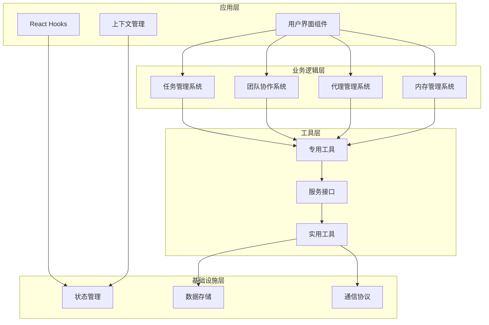

**图表来源**
- [tasks.ts:1-863](file://src/utils/tasks.ts#L1-L863)
- [TeamsDialog.tsx:1-715](file://src/components/teams/TeamsDialog.tsx#L1-L715)
- [AgentsList.tsx:1-440](file://src/components/agents/AgentsList.tsx#L1-L440)

**章节来源**
- [tasks.ts:1-863](file://src/utils/tasks.ts#L1-L863)
- [TeamsDialog.tsx:1-715](file://src/components/teams/TeamsDialog.tsx#L1-L715)
- [AgentsList.tsx:1-440](file://src/components/agents/AgentsList.tsx#L1-L440)

## 核心组件

### 任务管理系统

任务管理系统是 Claude Code 的核心功能之一，提供了完整的任务生命周期管理能力。

#### 核心特性
- **分布式锁机制**：使用文件锁确保并发安全的任务操作
- **智能任务分配**：基于代理状态和任务依赖的自动分配策略
- **状态跟踪**：实时监控任务执行状态和进度
- **依赖管理**：支持复杂的任务依赖关系和阻塞检测

#### 数据模型

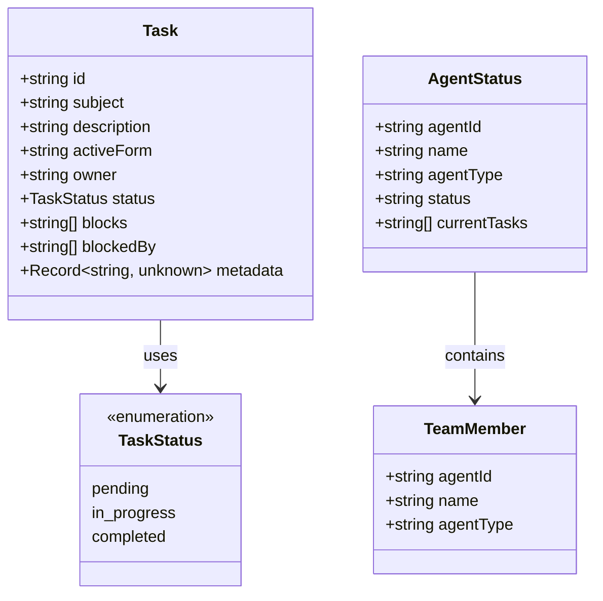

**图表来源**
- [tasks.ts:69-89](file://src/utils/tasks.ts#L69-L89)
- [tasks.ts:696-712](file://src/utils/tasks.ts#L696-L712)

**章节来源**
- [tasks.ts:69-89](file://src/utils/tasks.ts#L69-L89)
- [tasks.ts:696-712](file://src/utils/tasks.ts#L696-L712)

### 团队协作系统

团队协作系统提供了多代理环境下的协同工作能力，支持实时状态同步和权限管理。

#### 主要功能
- **实时状态监控**：跟踪团队成员的在线状态和工作负载
- **权限管理模式**：支持多种权限模式的动态切换
- **远程会话管理**：支持跨设备和跨平台的协作
- **可视化界面**：提供直观的团队状态展示

#### 状态管理

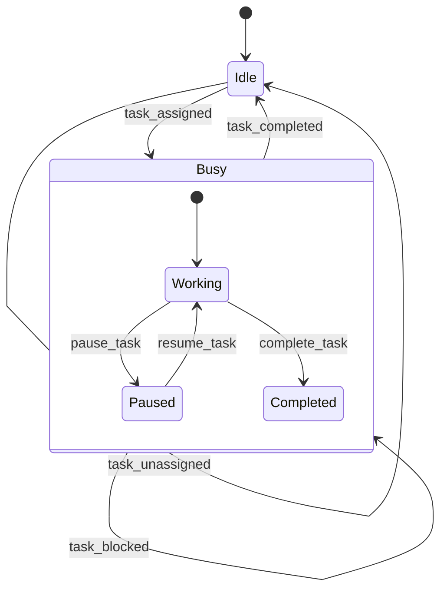

**图表来源**
- [tasks.ts:703-798](file://src/utils/tasks.ts#L703-L798)
- [TeamsDialog.tsx:676-714](file://src/components/teams/TeamsDialog.tsx#L676-L714)

**章节来源**
- [tasks.ts:703-798](file://src/utils/tasks.ts#L703-L798)
- [TeamsDialog.tsx:676-714](file://src/components/teams/TeamsDialog.tsx#L676-L714)

### 代理管理系统

代理管理系统负责管理 AI 代理的创建、配置和生命周期。

#### 组件架构

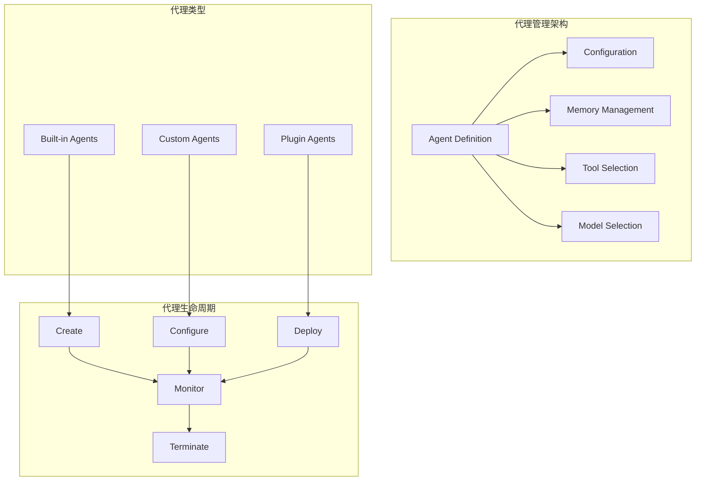

**图表来源**
- [AgentsList.tsx:14-31](file://src/components/agents/AgentsList.tsx#L14-L31)
- [AgentDetail.tsx](file://src/components/agents/AgentDetail.tsx)
- [AgentEditor.tsx](file://src/components/agents/AgentEditor.tsx)

**章节来源**
- [AgentsList.tsx:14-31](file://src/components/agents/AgentsList.tsx#L14-L31)
- [AgentDetail.tsx](file://src/components/agents/AgentDetail.tsx)
- [AgentEditor.tsx](file://src/components/agents/AgentEditor.tsx)

### 内存管理系统

内存管理系统提供了多维度的记忆存储和检索能力，支持不同类型的内存数据。

#### 内存类型

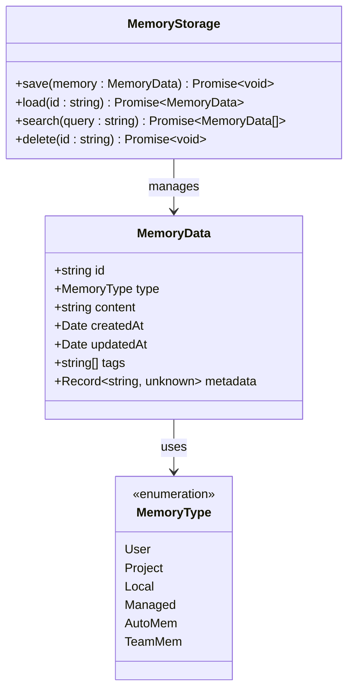

**图表来源**
- [types.ts:3-12](file://src/utils/memory/types.ts#L3-L12)

**章节来源**
- [types.ts:3-12](file://src/utils/memory/types.ts#L3-L12)

## 架构概览

### 整体架构设计

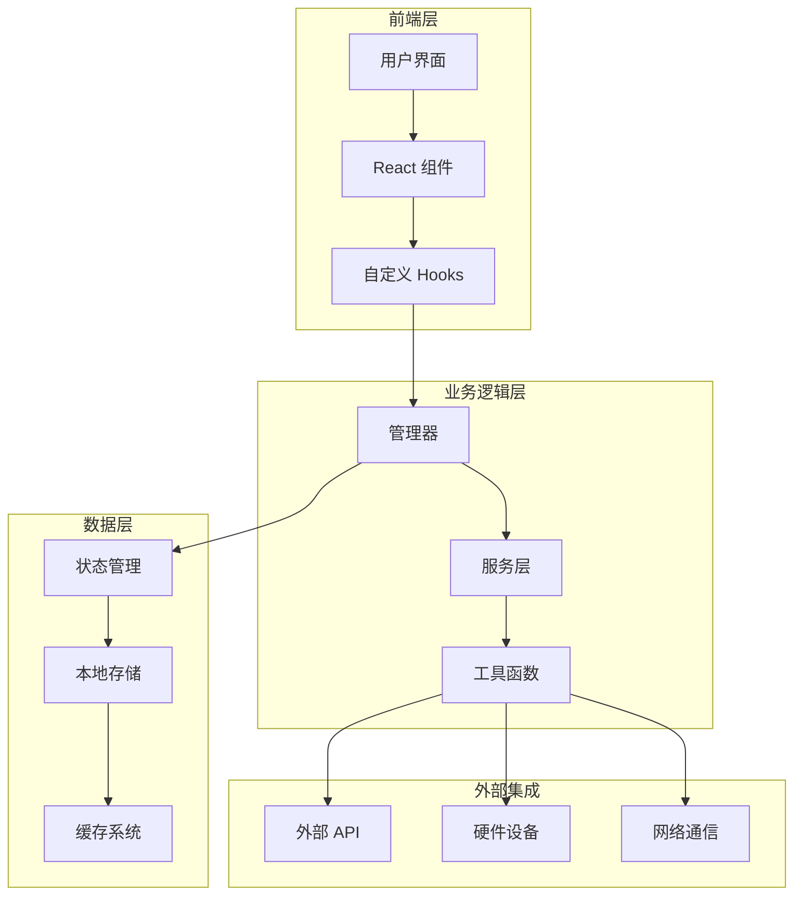

**图表来源**
- [AppState.tsx](file://src/state/AppState.tsx)
- [store.ts](file://src/state/store.ts)
- [AppStateStore.ts](file://src/state/AppStateStore.ts)

### 数据流架构

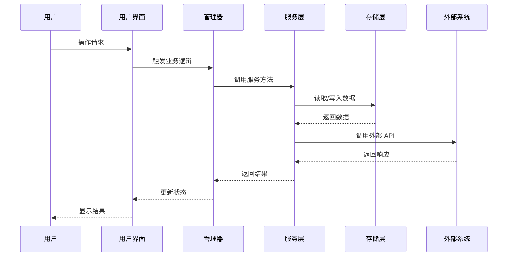

**图表来源**
- [tasks.ts:284-308](file://src/utils/tasks.ts#L284-L308)
- [TeamsDialog.tsx:547-604](file://src/components/teams/TeamsDialog.tsx#L547-L604)

## 详细组件分析

### 任务管理组件

#### 核心功能实现

任务管理组件提供了完整的任务生命周期管理，包括创建、更新、删除和查询操作。

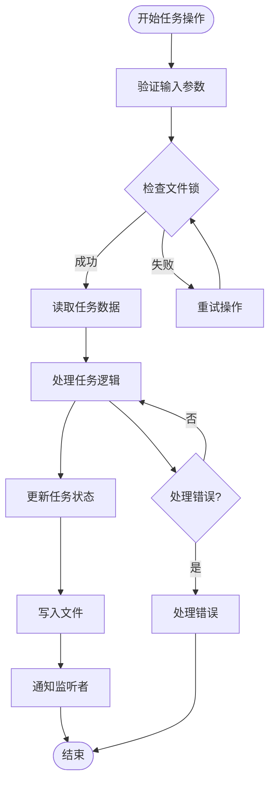

**图表来源**
- [tasks.ts:284-308](file://src/utils/tasks.ts#L284-L308)
- [tasks.ts:370-391](file://src/utils/tasks.ts#L370-L391)

#### 关键实现细节

1. **并发控制**：使用文件锁确保多个进程间的任务操作安全
2. **状态验证**：通过 Zod 模式验证确保数据完整性
3. **原子操作**：所有任务操作都是原子性的，保证数据一致性
4. **错误处理**：完善的错误捕获和日志记录机制

**章节来源**
- [tasks.ts:284-308](file://src/utils/tasks.ts#L284-L308)
- [tasks.ts:370-391](file://src/utils/tasks.ts#L370-L391)
- [tasks.ts:102-108](file://src/utils/tasks.ts#L102-L108)

### 团队协作组件

#### 实时状态同步

团队协作组件实现了多代理环境下的实时状态同步机制。

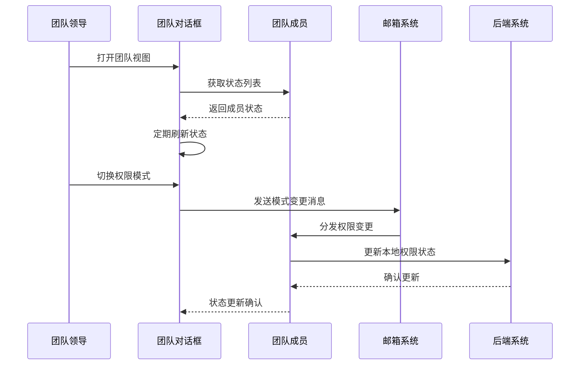

**图表来源**
- [TeamsDialog.tsx:95-113](file://src/components/teams/TeamsDialog.tsx#L95-L113)
- [TeamsDialog.tsx:641-674](file://src/components/teams/TeamsDialog.tsx#L641-L674)

#### 权限管理模式

团队协作系统支持多种权限模式的动态切换：

| 模式名称 | 描述 | 使用场景 |
|---------|------|----------|
| 默认模式 | 基础权限设置 | 日常开发任务 |
| 严格模式 | 限制性权限 | 敏感数据操作 |
| 放宽模式 | 宽松权限 | 开发调试阶段 |
| 自定义模式 | 用户自定义权限 | 特殊项目需求 |

**章节来源**
- [TeamsDialog.tsx:95-113](file://src/components/teams/TeamsDialog.tsx#L95-L113)
- [TeamsDialog.tsx:641-674](file://src/components/teams/TeamsDialog.tsx#L641-L674)

### 代理管理组件

#### 代理生命周期管理

代理管理组件提供了完整的代理生命周期管理功能。

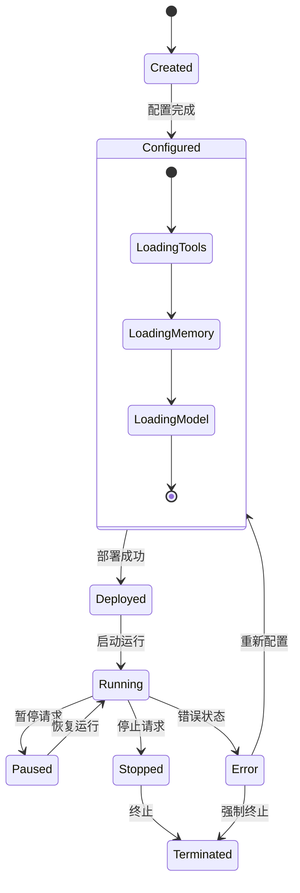

**图表来源**
- [AgentDetail.tsx](file://src/components/agents/AgentDetail.tsx)
- [AgentEditor.tsx](file://src/components/agents/AgentEditor.tsx)

#### 代理配置管理

代理配置系统支持多种配置方式：

1. **内置代理**：系统预定义的标准代理
2. **自定义代理**：用户创建的专用代理
3. **插件代理**：通过插件系统扩展的代理
4. **模板代理**：基于模板快速创建的代理

**章节来源**
- [AgentDetail.tsx](file://src/components/agents/AgentDetail.tsx)
- [AgentEditor.tsx](file://src/components/agents/AgentEditor.tsx)

### 内存管理组件

#### 多维度内存存储

内存管理组件提供了多种内存类型的存储和管理能力。

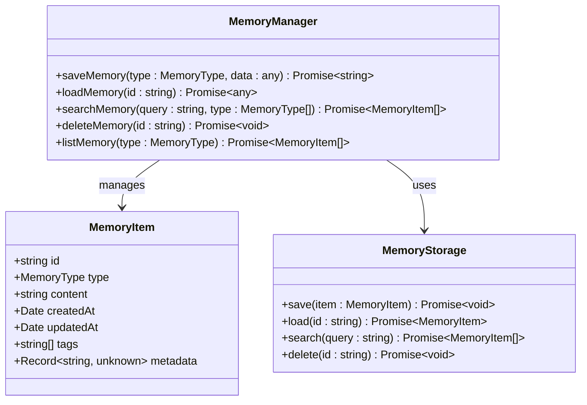

**图表来源**
- [types.ts:1-13](file://src/utils/memory/types.ts#L1-L13)

#### 内存类型详解

| 内存类型 | 作用域 | 生命周期 | 使用场景 |
|---------|--------|----------|----------|
| User | 用户级 | 持久化 | 用户个人偏好和设置 |
| Project | 项目级 | 项目存在期间 | 项目特定的上下文信息 |
| Local | 本地级 | 会话期间 | 临时的本地数据 |
| Managed | 管理级 | 系统管理 | 平台级别的管理数据 |
| AutoMem | 自动级 | 智能管理 | 自动化的记忆数据 |
| TeamMem | 团队级 | 团队存在期间 | 团队协作的共享记忆 |

**章节来源**
- [types.ts:1-13](file://src/utils/memory/types.ts#L1-L13)

## 依赖关系分析

### 组件间依赖关系

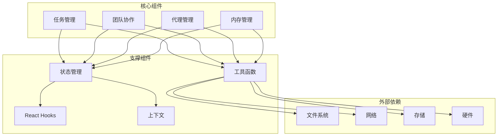

**图表来源**
- [tasks.ts:1-18](file://src/utils/tasks.ts#L1-L18)
- [TeamsDialog.tsx:1-31](file://src/components/teams/TeamsDialog.tsx#L1-L31)

### 数据依赖链

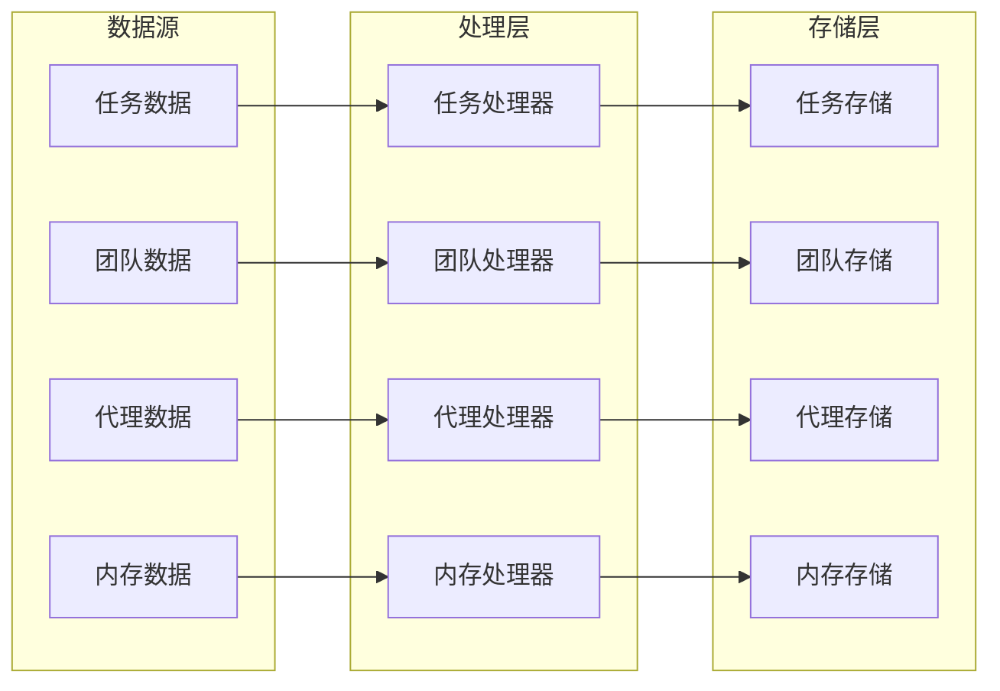

**图表来源**
- [tasks.ts:221-241](file://src/utils/tasks.ts#L221-L241)
- [teamHelpers.ts](file://src/utils/swarm/teamHelpers.ts)

**章节来源**
- [tasks.ts:221-241](file://src/utils/tasks.ts#L221-L241)
- [teamHelpers.ts](file://src/utils/swarm/teamHelpers.ts)

## 性能考虑

### 并发处理优化

系统采用了多种并发处理优化策略：

1. **文件锁机制**：使用 proper-lockfile 库确保文件操作的原子性
2. **异步操作**：所有 I/O 操作都采用异步方式，避免阻塞主线程
3. **缓存策略**：实现多层次缓存减少重复计算
4. **批量操作**：支持批量任务处理提高效率

### 内存管理

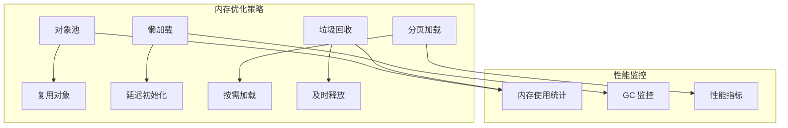

### 网络通信优化

系统在网络通信方面采用了以下优化策略：

1. **连接池管理**：复用网络连接减少建立成本
2. **请求合并**：将多个小请求合并为大请求
3. **增量更新**：只传输变化的数据
4. **压缩传输**：对传输数据进行压缩

## 故障排除指南

### 常见问题及解决方案

#### 任务操作失败

**问题症状**：任务创建或更新失败，出现锁冲突错误

**可能原因**：
1. 文件锁竞争导致的操作失败
2. 数据格式验证失败
3. 权限不足导致的文件访问错误

**解决步骤**：
1. 检查是否有其他进程正在操作相同任务
2. 验证任务数据格式是否符合要求
3. 确认有足够的文件系统权限

**章节来源**
- [tasks.ts:596-611](file://src/utils/tasks.ts#L596-L611)
- [tasks.ts:333-350](file://src/utils/tasks.ts#L333-L350)

#### 团队状态不同步

**问题症状**：团队成员状态显示不一致

**可能原因**：
1. 邮箱系统通信异常
2. 权限模式切换未正确传播
3. 网络连接不稳定

**解决步骤**：
1. 检查邮箱系统连接状态
2. 验证权限模式切换消息是否正确发送
3. 确认网络连接稳定性

**章节来源**
- [TeamsDialog.tsx:641-674](file://src/components/teams/TeamsDialog.tsx#L641-L674)
- [teammateMailbox.ts](file://src/utils/teammateMailbox.ts)

#### 代理启动失败

**问题症状**：代理无法正常启动或频繁重启

**可能原因**：
1. 配置文件损坏
2. 所需工具缺失
3. 内存资源不足

**解决步骤**：
1. 检查代理配置文件的完整性
2. 验证所需工具的可用性
3. 监控系统内存使用情况

### 调试工具和技巧

#### 日志分析

系统提供了丰富的日志记录功能，可以通过以下方式分析问题：

1. **调试日志**：启用详细调试信息查看内部执行流程
2. **错误追踪**：查看错误堆栈信息定位问题根源
3. **性能分析**：监控系统性能指标识别瓶颈

#### 状态检查

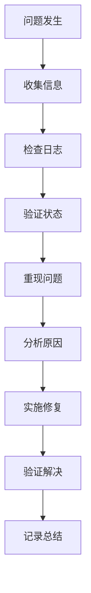

## 结论

Claude Code 的专用工具组件系统展现了现代 AI 协作平台的设计理念和技术实现。通过模块化架构、完善的并发控制和灵活的扩展机制，该系统为开发者提供了强大而易用的工具链。

### 主要优势

1. **架构清晰**：模块化设计便于维护和扩展
2. **性能优异**：多层优化确保高效运行
3. **功能完整**：覆盖了协作开发的各个方面
4. **易于使用**：直观的用户界面和交互设计
5. **高度可扩展**：支持插件和自定义扩展

### 技术亮点

- **并发安全**：通过文件锁和原子操作确保数据一致性
- **实时同步**：基于邮箱系统的实时通信机制
- **智能调度**：基于状态的智能任务分配算法
- **多维内存**：支持多种类型的记忆存储和检索

### 未来发展方向

1. **AI 集成增强**：进一步提升 AI 代理的智能化水平
2. **性能优化**：持续优化系统性能和资源利用率
3. **生态扩展**：构建更丰富的插件和工具生态系统
4. **用户体验**：不断改进用户界面和交互体验

## 附录

### 配置选项

#### 全局配置

| 配置项 | 类型 | 默认值 | 描述 |
|--------|------|--------|------|
| CLAUDE_CODE_ENABLE_TASKS | boolean | 自动检测 | 启用任务管理功能 |
| CLAUDE_CODE_TASK_LIST_ID | string | 自动生成 | 指定任务列表标识符 |
| CLAUDE_CODE_TEAM_NAME | string | 空 | 指定团队名称 |
| CLAUDE_CODE_ENABLE_MEMORY | boolean | true | 启用内存管理功能 |

#### 任务配置

| 配置项 | 类型 | 默认值 | 描述 |
|--------|------|--------|------|
| task_lock_retries | number | 30 | 文件锁重试次数 |
| task_lock_min_timeout | number | 5 | 最小超时时间(ms) |
| task_lock_max_timeout | number | 100 | 最大超时时间(ms) |
| task_cleanup_threshold | number | 1000 | 任务清理阈值 |

### 扩展机制

#### 工具扩展

系统支持通过插件机制扩展新的工具功能：

1. **工具注册**：通过工具注册表添加新工具
2. **权限控制**：为新工具配置适当的权限级别
3. **UI 集成**：自动在相关界面中集成新工具

#### 组件扩展

```typescript
// 示例：自定义工具扩展
interface CustomTool {
  id: string;
  name: string;
  description: string;
  execute: (params: any) => Promise<any>;
  validate: (params: any) => boolean;
}

// 注册自定义工具
export function registerCustomTool(tool: CustomTool) {
  // 工具注册逻辑
}
```

#### 配置扩展

系统支持通过配置文件扩展功能：

1. **用户配置**：用户自定义的个性化设置
2. **团队配置**：团队范围的共享配置
3. **项目配置**：项目特定的配置选项

### 集成指南

#### API 集成

系统提供了完整的 API 接口用于第三方集成：

```typescript
// 任务管理 API
interface TaskAPI {
  createTask(taskData: TaskData): Promise<string>;
  updateTask(taskId: string, updates: Partial<TaskData>): Promise<TaskData>;
  deleteTask(taskId: string): Promise<boolean>;
  listTasks(filter?: TaskFilter): Promise<TaskData[]>;
  claimTask(taskId: string, agentId: string): Promise<ClaimResult>;
}

// 团队协作 API
interface TeamAPI {
  createTeam(teamData: TeamData): Promise<string>;
  addMember(teamId: string, memberId: string): Promise<void>;
  removeMember(teamId: string, memberId: string): Promise<void>;
  getTeamStatus(teamId: string): Promise<TeamStatus>;
}
```

#### SDK 使用

系统提供了多种编程语言的 SDK 用于集成：

1. **JavaScript/TypeScript SDK**：适用于前端和 Node.js 应用
2. **Python SDK**：适用于 Python 生态系统
3. **REST API**：通用的 HTTP 接口支持

#### 最佳实践

1. **错误处理**：始终处理可能的异常情况
2. **资源管理**：及时释放占用的资源
3. **性能监控**：监控系统性能指标
4. **安全考虑**：确保数据传输和存储的安全性