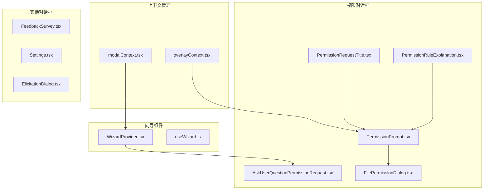
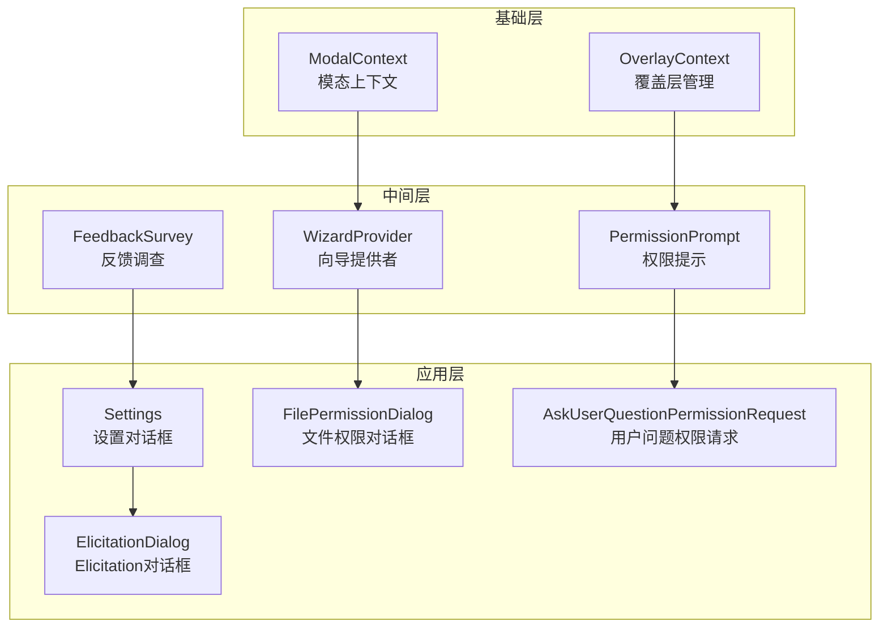
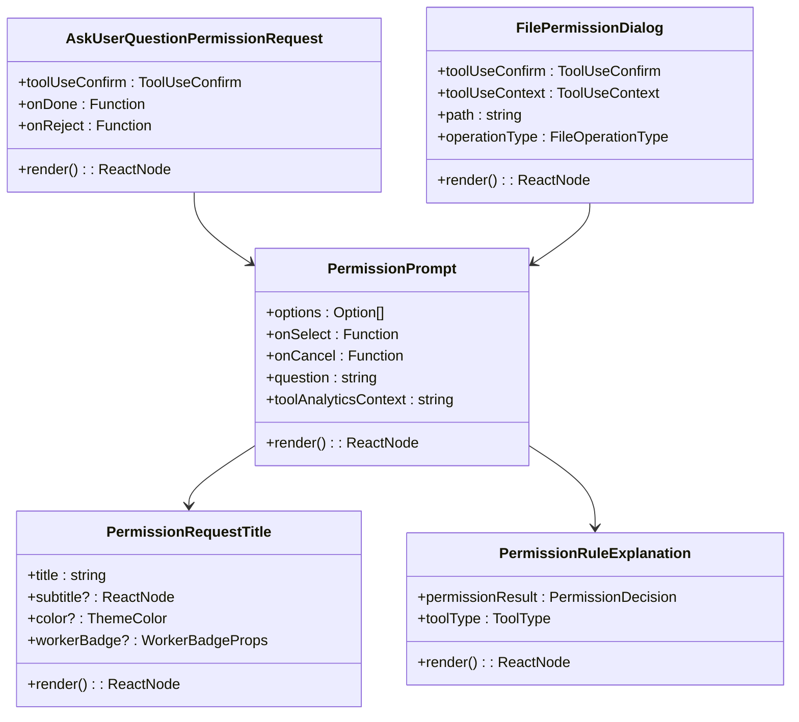
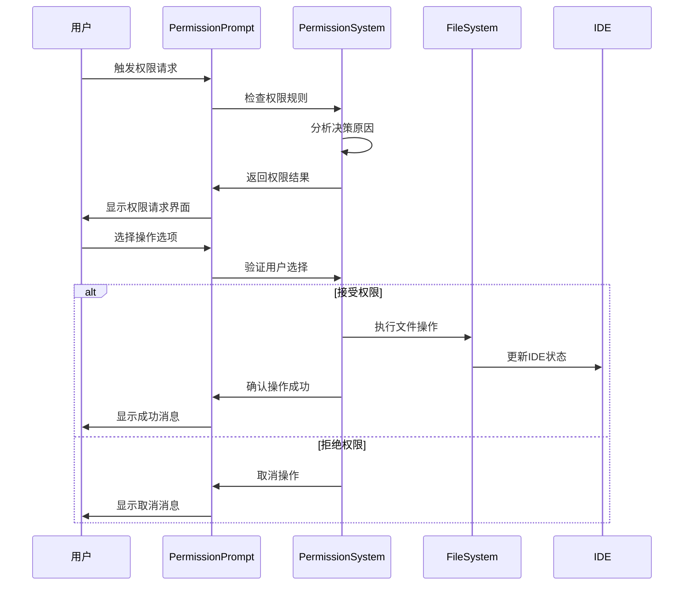
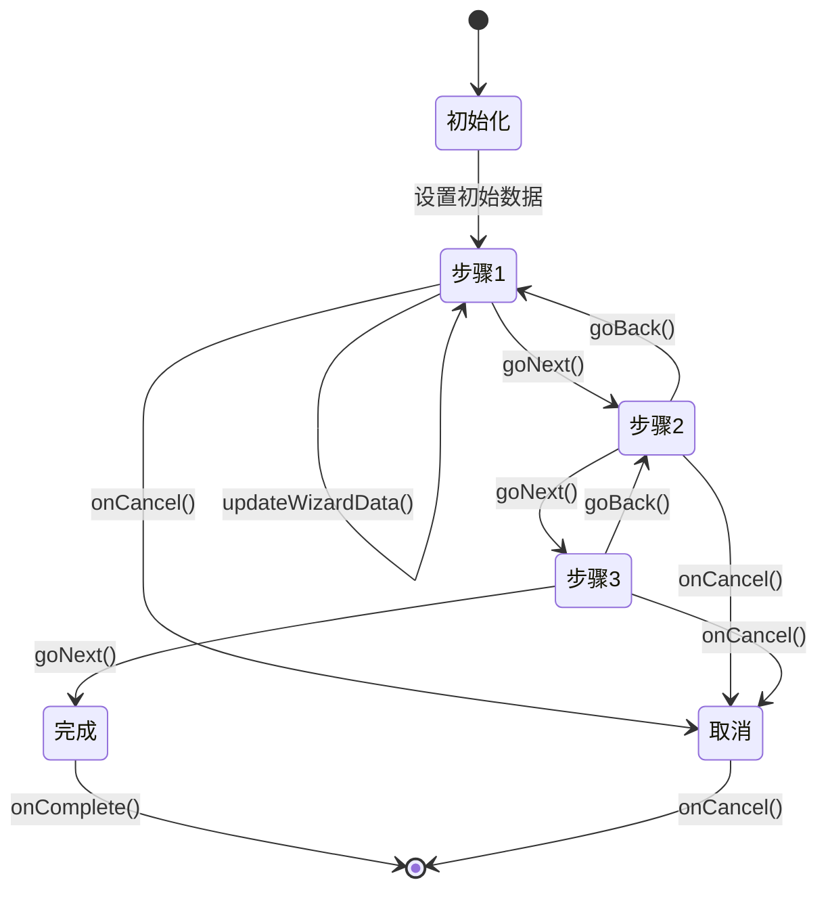
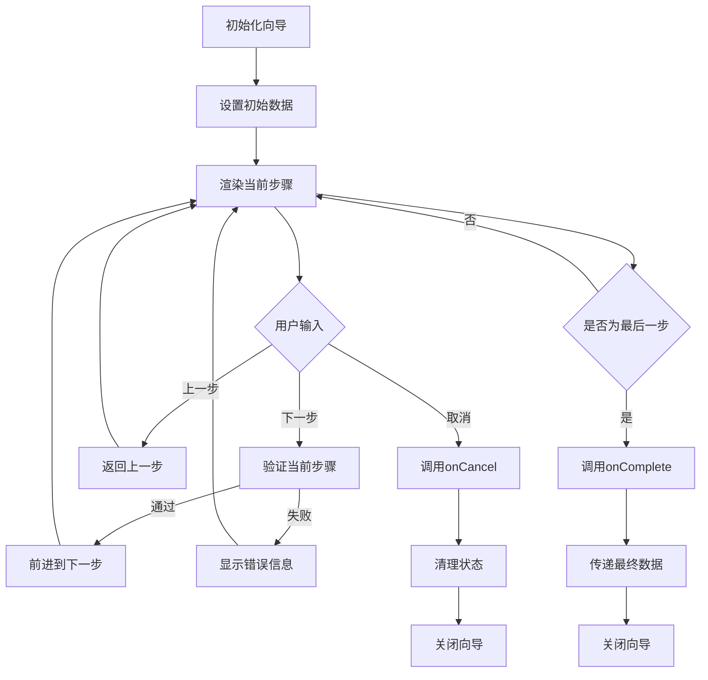
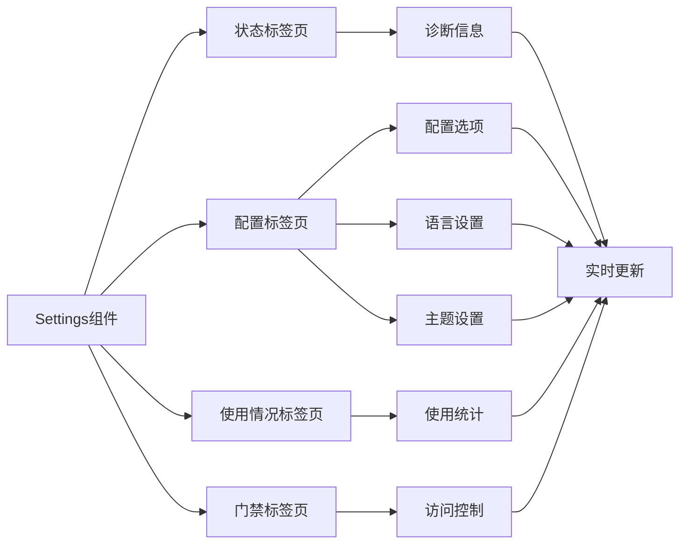
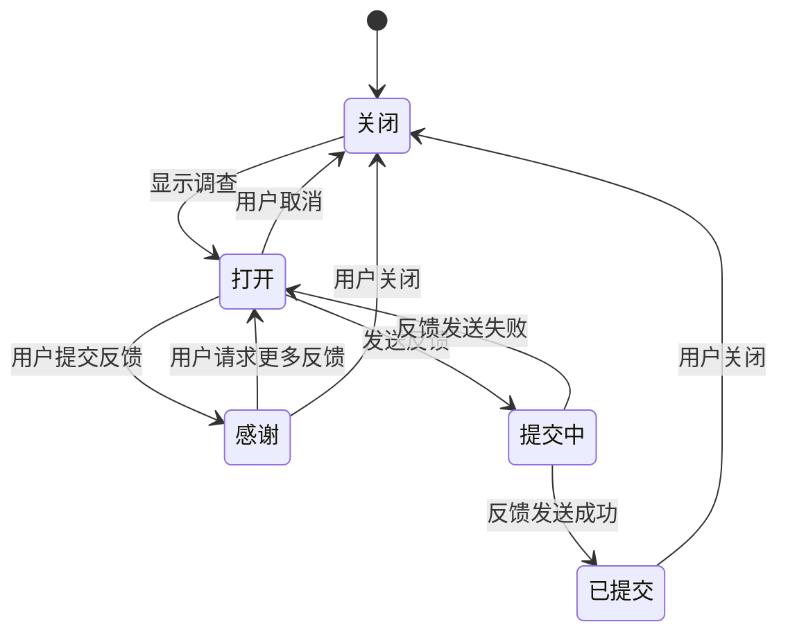
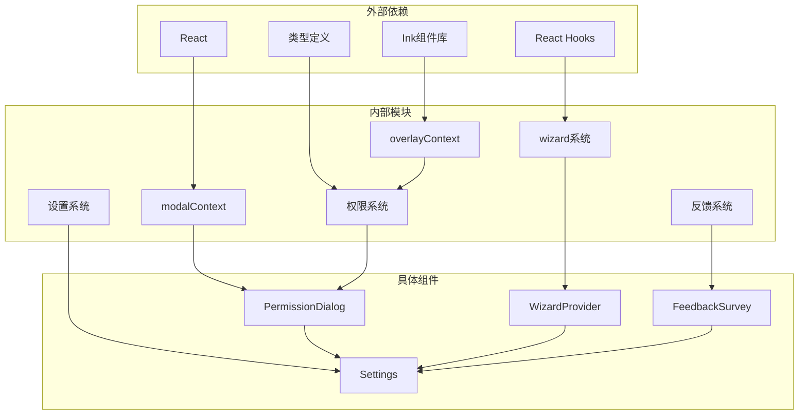

# 对话框与模态组件

<cite>
**本文档引用的文件**
- [modalContext.tsx](file://src/context/modalContext.tsx)
- [overlayContext.tsx](file://src/context/overlayContext.tsx)
- [WizardProvider.tsx](file://src/components/wizard/WizardProvider.tsx)
- [useWizard.ts](file://src/components/wizard/useWizard.ts)
- [PermissionPrompt.tsx](file://src/components/permissions/PermissionPrompt.tsx)
- [PermissionRequestTitle.tsx](file://src/components/permissions/PermissionRequestTitle.tsx)
- [PermissionRuleExplanation.tsx](file://src/components/permissions/PermissionRuleExplanation.tsx)
- [AskUserQuestionPermissionRequest.tsx](file://src/components/permissions/AskUserQuestionPermissionRequest/AskUserQuestionPermissionRequest.tsx)
- [FilePermissionDialog.tsx](file://src/components/permissions/FilePermissionDialog/FilePermissionDialog.tsx)
- [FeedbackSurvey.tsx](file://src/components/FeedbackSurvey/FeedbackSurvey.tsx)
- [Settings.tsx](file://src/components/Settings/Settings.tsx)
- [ElicitationDialog.tsx](file://src/components/mcp/ElicitationDialog.tsx)
</cite>

## 目录
1. [简介](#简介)
2. [项目结构](#项目结构)
3. [核心组件](#核心组件)
4. [架构概览](#架构概览)
5. [详细组件分析](#详细组件分析)
6. [依赖关系分析](#依赖关系分析)
7. [性能考虑](#性能考虑)
8. [故障排除指南](#故障排除指南)
9. [结论](#结论)

## 简介

Claude Code 项目中的对话框与模态组件系统提供了完整的用户交互界面，涵盖了从简单的确认对话框到复杂的多步骤向导的各种场景。该系统基于 React 和 Ink 组件库构建，支持键盘导航、焦点管理和响应式布局。

本系统的核心特性包括：
- 模态上下文管理（ModalContext）
- 覆盖层注册机制（OverlayContext）
- 向导组件系统（WizardProvider）
- 权限请求对话框
- 反馈调查组件
- 设置对话框
- 文件权限对话框

## 项目结构

对话框与模态组件系统主要分布在以下目录结构中：



**图表来源**
- [modalContext.tsx:1-58](file://src/context/modalContext.tsx#L1-L58)
- [overlayContext.tsx:1-151](file://src/context/overlayContext.tsx#L1-L151)
- [WizardProvider.tsx:1-212](file://src/components/wizard/WizardProvider.tsx#L1-L212)

**章节来源**
- [modalContext.tsx:1-58](file://src/context/modalContext.tsx#L1-L58)
- [overlayContext.tsx:1-151](file://src/context/overlayContext.tsx#L1-L151)

## 核心组件

### 模态上下文系统

模态上下文系统是整个对话框系统的基础，提供了在全屏布局中渲染模态内容的能力。

**主要功能：**
- 提供模态区域的尺寸信息
- 管理模态滚动行为
- 处理模态内的焦点管理

### 覆盖层管理系统

覆盖层系统用于协调多个模态对话框之间的交互，确保键盘事件正确传递。

**核心特性：**
- 自动注册和注销覆盖层
- 管理覆盖层的激活状态
- 协调 ESC 键处理

### 向导组件系统

向导组件提供了多步骤的复杂对话框支持，具有状态保持和进度跟踪功能。

**关键功能：**
- 步骤导航控制
- 数据状态管理
- 进度指示器
- 历史记录管理

**章节来源**
- [WizardProvider.tsx:1-212](file://src/components/wizard/WizardProvider.tsx#L1-L212)
- [useWizard.ts:1-13](file://src/components/wizard/useWizard.ts#L1-L13)

## 架构概览

对话框系统的整体架构采用分层设计，从底层的上下文管理到上层的具体对话框组件：



**图表来源**
- [WizardProvider.tsx:1-212](file://src/components/wizard/WizardProvider.tsx#L1-L212)
- [PermissionPrompt.tsx:1-100](file://src/components/permissions/PermissionPrompt.tsx#L1-L100)
- [Settings.tsx:1-137](file://src/components/Settings/Settings.tsx#L1-L137)

## 详细组件分析

### 权限请求对话框系统

权限请求对话框系统是 Claude Code 中最复杂的对话框组件之一，提供了多种权限检查和用户确认的场景。

#### 核心组件结构



**图表来源**
- [PermissionPrompt.tsx:1-100](file://src/components/permissions/PermissionPrompt.tsx#L1-L100)
- [PermissionRequestTitle.tsx:1-66](file://src/components/permissions/PermissionRequestTitle.tsx#L1-L66)
- [PermissionRuleExplanation.tsx:1-121](file://src/components/permissions/PermissionRuleExplanation.tsx#L1-L121)
- [AskUserQuestionPermissionRequest.tsx:1-200](file://src/components/permissions/AskUserQuestionPermissionRequest/AskUserQuestionPermissionRequest.tsx#L1-L200)
- [FilePermissionDialog.tsx:1-200](file://src/components/permissions/FilePermissionDialog/FilePermissionDialog.tsx#L1-L200)

#### 权限请求工作流程



**图表来源**
- [PermissionPrompt.tsx:45-100](file://src/components/permissions/PermissionPrompt.tsx#L45-L100)
- [AskUserQuestionPermissionRequest.tsx:250-420](file://src/components/permissions/AskUserQuestionPermissionRequest/AskUserQuestionPermissionRequest.tsx#L250-L420)

**章节来源**
- [PermissionPrompt.tsx:1-100](file://src/components/permissions/PermissionPrompt.tsx#L1-L100)
- [PermissionRequestTitle.tsx:1-66](file://src/components/permissions/PermissionRequestTitle.tsx#L1-L66)
- [PermissionRuleExplanation.tsx:1-121](file://src/components/permissions/PermissionRuleExplanation.tsx#L1-L121)
- [AskUserQuestionPermissionRequest.tsx:1-200](file://src/components/permissions/AskUserQuestionPermissionRequest/AskUserQuestionPermissionRequest.tsx#L1-L200)
- [FilePermissionDialog.tsx:1-200](file://src/components/permissions/FilePermissionDialog/FilePermissionDialog.tsx#L1-L200)

### 向导组件系统

向导组件系统提供了复杂的多步骤交互能力，支持数据收集、验证和确认流程。

#### 向导状态管理



**图表来源**
- [WizardProvider.tsx:30-137](file://src/components/wizard/WizardProvider.tsx#L30-L137)

#### 向导数据流



**图表来源**
- [WizardProvider.tsx:110-150](file://src/components/wizard/WizardProvider.tsx#L110-L150)

**章节来源**
- [WizardProvider.tsx:1-212](file://src/components/wizard/WizardProvider.tsx#L1-L212)
- [useWizard.ts:1-13](file://src/components/wizard/useWizard.ts#L1-L13)

### 设置对话框系统

设置对话框提供了应用程序配置的集中管理界面，支持标签页导航和实时配置更新。

#### 设置对话框架构



**图表来源**
- [Settings.tsx:1-137](file://src/components/Settings/Settings.tsx#L1-L137)

**章节来源**
- [Settings.tsx:1-137](file://src/components/Settings/Settings.tsx#L1-L137)

### 反馈调查组件

反馈调查组件提供了用户反馈收集的完整流程，支持评分、文本输入和后续行动。

#### 反馈调查状态转换



**图表来源**
- [FeedbackSurvey.tsx:1-174](file://src/components/FeedbackSurvey/FeedbackSurvey.tsx#L1-L174)

**章节来源**
- [FeedbackSurvey.tsx:1-174](file://src/components/FeedbackSurvey/FeedbackSurvey.tsx#L1-L174)

## 依赖关系分析

对话框系统的依赖关系呈现清晰的层次结构：



**图表来源**
- [modalContext.tsx:1-58](file://src/context/modalContext.tsx#L1-L58)
- [overlayContext.tsx:1-151](file://src/context/overlayContext.tsx#L1-L151)

**章节来源**
- [modalContext.tsx:1-58](file://src/context/modalContext.tsx#L1-L58)
- [overlayContext.tsx:1-151](file://src/context/overlayContext.tsx#L1-L151)

## 性能考虑

### 渲染优化策略

1. **记忆化缓存**
   - 使用 `useMemo` 缓存昂贵的计算结果
   - 使用 `useCallback` 优化回调函数引用
   - 避免不必要的重新渲染

2. **条件渲染**
   - 模态对话框仅在需要时渲染
   - 条件加载大型组件内容
   - 懒加载非关键功能

3. **虚拟化支持**
   - 长列表使用虚拟化技术
   - 滚动区域优化
   - 内存使用控制

### 焦点管理优化

1. **自动焦点转移**
   - 对话框打开时自动聚焦第一个可交互元素
   - ESC 键处理优先级管理
   - Tab 键循环导航

2. **键盘导航**
   - 支持快捷键绑定
   - 键盘可达性优化
   - 屏幕阅读器支持

## 故障排除指南

### 常见问题及解决方案

#### 模态对话框无法关闭

**症状：** 用户点击确认或取消按钮后对话框仍然显示

**可能原因：**
1. `onDone` 回调未正确调用
2. 父组件状态未更新
3. 键盘事件监听器冲突

**解决方法：**
```typescript
// 确保正确调用 onDone
const handleConfirm = () => {
  // 执行必要的清理工作
  cleanup();
  // 必须调用 onDone
  onDone();
};

// 检查父组件状态更新
useEffect(() => {
  if (dialogVisible) {
    // 设置焦点到第一个元素
    setFocusToFirstElement();
  }
}, [dialogVisible]);
```

#### 焦点丢失问题

**症状：** 对话框内焦点在用户操作时丢失

**解决方法：**
1. 使用 `useRef` 获取焦点元素引用
2. 在 `useEffect` 中设置焦点
3. 监听 DOM 变化更新焦点

#### 键盘事件冲突

**症状：** ESC 键或其他快捷键在对话框中不工作

**解决方法：**
```typescript
// 使用 OverlayContext 管理键盘事件
useEffect(() => {
  const handleKeyDown = (event: KeyboardEvent) => {
    if (isOverlayActive()) {
      // 仅在覆盖层激活时处理事件
      event.stopPropagation();
    }
  };
  
  window.addEventListener('keydown', handleKeyDown);
  return () => window.removeEventListener('keydown', handleKeyDown);
}, []);
```

**章节来源**
- [overlayContext.tsx:1-151](file://src/context/overlayContext.tsx#L1-L151)
- [ElicitationDialog.tsx:468-488](file://src/components/mcp/ElicitationDialog.tsx#L468-L488)

## 结论

Claude Code 的对话框与模态组件系统展现了现代前端对话框设计的最佳实践。系统通过清晰的分层架构、完善的上下文管理和灵活的状态控制，为用户提供了流畅的交互体验。

**主要优势：**
1. **模块化设计** - 各组件职责明确，易于维护和扩展
2. **状态管理** - 完善的数据流控制和状态同步机制
3. **用户体验** - 优秀的键盘导航和焦点管理
4. **可访问性** - 良好的屏幕阅读器支持和键盘可达性
5. **性能优化** - 合理的记忆化和条件渲染策略

**未来改进方向：**
1. 增加更多的动画效果和过渡效果
2. 扩展主题定制能力
3. 改进移动端适配
4. 增强无障碍功能支持
5. 添加国际化支持

该系统为类似的应用程序提供了优秀的参考模板，展示了如何构建既功能丰富又易于使用的对话框组件系统。