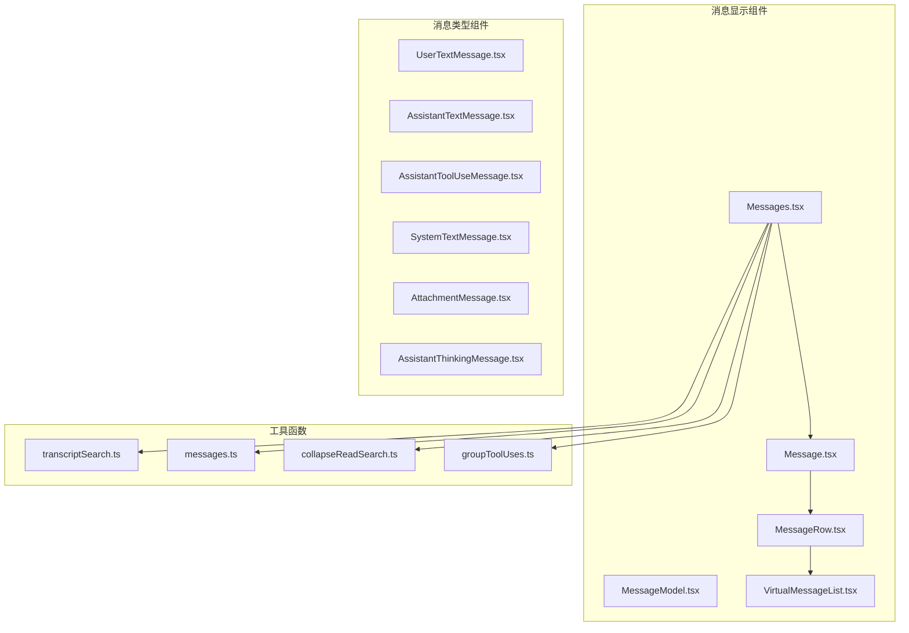
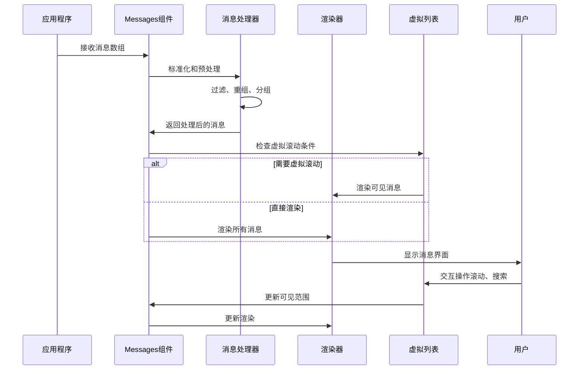
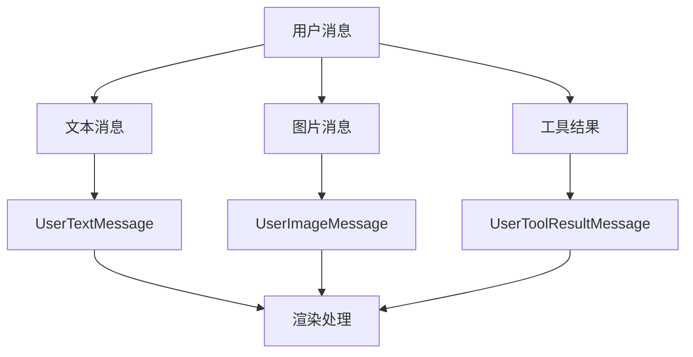
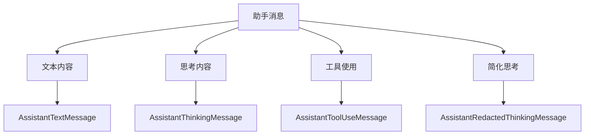
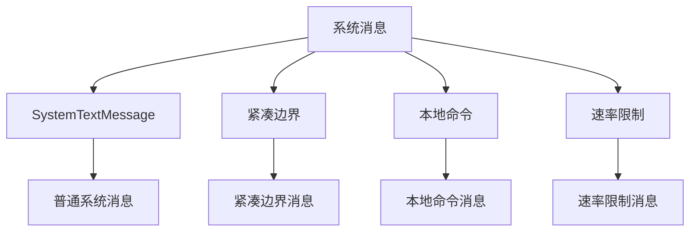
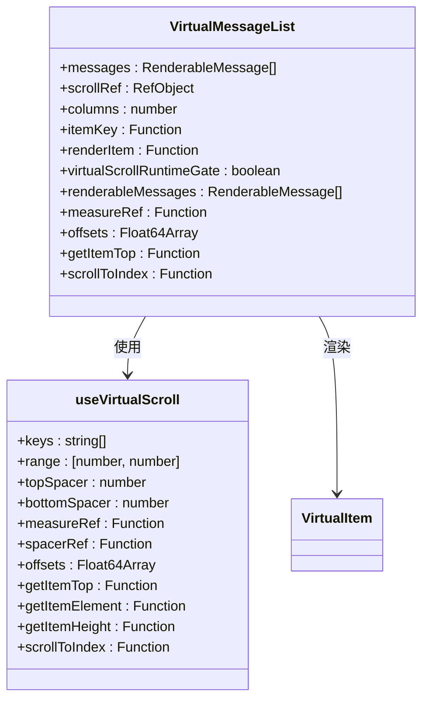
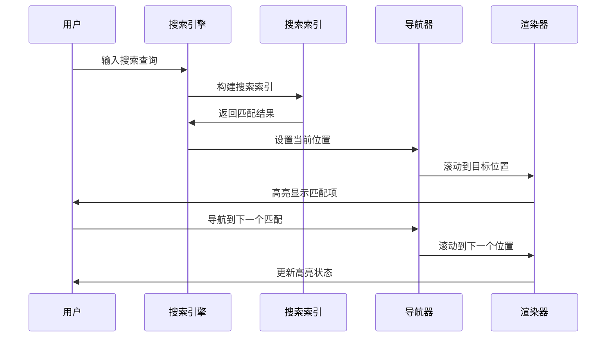
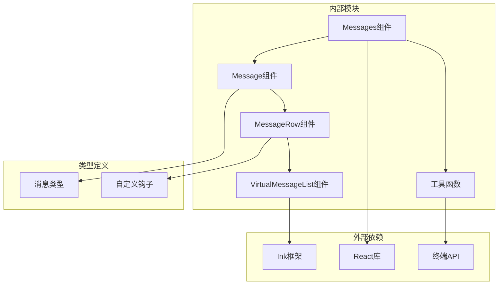

# 消息显示组件

<cite>
**本文档引用的文件**
- [Messages.tsx](file://src/components/Messages.tsx)
- [Message.tsx](file://src/components/Message.tsx)
- [MessageRow.tsx](file://src/components/MessageRow.tsx)
- [MessageModel.tsx](file://src/components/MessageModel.tsx)
- [VirtualMessageList.tsx](file://src/components/VirtualMessageList.tsx)
- [Markdown.tsx](file://src/components/Markdown.tsx)
- [HighlightedCode.tsx](file://src/components/HighlightedCode.tsx)
- [messageActions.tsx](file://src/components/messageActions.tsx)
- [FullscreenLayout.tsx](file://src/components/FullscreenLayout.tsx)
- [useVirtualScroll.ts](file://src/hooks/useVirtualScroll.ts)
- [transcriptSearch.ts](file://src/utils/transcriptSearch.ts)
- [messages.ts](file://src/utils/messages.ts)
- [collapseReadSearch.ts](file://src/utils/collapseReadSearch.ts)
- [groupToolUses.ts](file://src/utils/groupToolUses.ts)
- [message.ts](file://src/types/message.ts)
</cite>

## 目录
1. [简介](#简介)
2. [项目结构](#项目结构)
3. [核心组件](#核心组件)
4. [架构概览](#架构概览)
5. [详细组件分析](#详细组件分析)
6. [依赖关系分析](#依赖关系分析)
7. [性能考虑](#性能考虑)
8. [故障排除指南](#故障排除指南)
9. [结论](#结论)

## 简介

Claude Code 的消息显示组件系统是一个高度优化的终端消息渲染框架，专门设计用于在命令行环境中高效显示各种类型的消息内容。该系统支持用户消息、助手消息、工具使用消息、系统消息等多种消息类型，并提供了丰富的交互功能，包括虚拟滚动、搜索导航、粘性提示跟踪等。

该组件系统采用模块化设计，通过精心的性能优化确保在大量消息场景下的流畅体验，同时保持代码的可维护性和扩展性。

## 项目结构

消息显示组件系统主要位于 `src/components/` 目录下，核心文件包括：

**图表来源**
- [Messages.tsx:1-834](file://src/components/Messages.tsx#L1-L834)
- [Message.tsx:1-627](file://src/components/Message.tsx#L1-L627)
- [MessageRow.tsx:1-383](file://src/components/MessageRow.tsx#L1-L383)

**章节来源**
- [Messages.tsx:1-834](file://src/components/Messages.tsx#L1-L834)
- [Message.tsx:1-627](file://src/components/Message.tsx#L1-L627)
- [MessageRow.tsx:1-383](file://src/components/MessageRow.tsx#L1-L383)

## 核心组件

### Messages 组件

Messages 组件是整个消息显示系统的核心，负责消息的预处理、过滤和渲染控制。它实现了以下关键功能：

- **消息预处理**：对原始消息进行标准化、重组、分组和折叠
- **条件渲染**：根据环境变量和模式选择合适的渲染路径
- **性能优化**：实现安全的消息数量限制和虚拟滚动控制
- **状态管理**：管理展开状态、搜索状态和光标导航

### Message 组件

Message 组件负责将标准化的消息转换为具体的 UI 组件。它支持多种消息类型：

- 用户消息（文本、图片、工具结果）
- 助手消息（文本、思考、工具调用）
- 系统消息（文本、边界标记）
- 附件消息
- 分组工具使用消息

### MessageRow 组件

MessageRow 组件处理单个消息行的渲染，包括元数据显示、动画控制和静态渲染优化。

### VirtualMessageList 组件

VirtualMessageList 组件实现了高性能的虚拟滚动，支持：

- 惰性加载可见消息
- 高度缓存和测量
- 搜索导航和定位
- 粘性提示跟踪

**章节来源**
- [Messages.tsx:341-778](file://src/components/Messages.tsx#L341-L778)
- [Message.tsx:58-355](file://src/components/Message.tsx#L58-L355)
- [MessageRow.tsx:93-287](file://src/components/MessageRow.tsx#L93-L287)
- [VirtualMessageList.tsx:289-800](file://src/components/VirtualMessageList.tsx#L289-L800)

## 架构概览

**图表来源**
- [Messages.tsx:461-701](file://src/components/Messages.tsx#L461-L701)
- [VirtualMessageList.tsx:325-336](file://src/components/VirtualMessageList.tsx#L325-L336)

系统采用分层架构设计，从上到下分别为：

1. **应用层**：接收和传递消息数据
2. **处理层**：消息标准化、过滤和重组
3. **渲染层**：根据条件选择渲染策略
4. **虚拟层**：高性能滚动和可视区域管理

**章节来源**
- [Messages.tsx:461-701](file://src/components/Messages.tsx#L461-L701)
- [VirtualMessageList.tsx:325-336](file://src/components/VirtualMessageList.tsx#L325-L336)

## 详细组件分析

### 消息类型处理

系统支持多种消息类型，每种类型都有专门的渲染组件：

#### 用户消息处理
用户消息包括文本输入、图片上传和工具结果反馈：

**图表来源**
- [Message.tsx:356-431](file://src/components/Message.tsx#L356-L431)

#### 助手消息处理
助手消息涵盖文本回复、思考过程和工具调用：

**图表来源**
- [Message.tsx:433-589](file://src/components/Message.tsx#L433-L589)

#### 系统消息处理
系统消息用于显示系统状态和通知信息：

**图表来源**
- [Message.tsx:231-318](file://src/components/Message.tsx#L231-L318)

**章节来源**
- [Message.tsx:356-589](file://src/components/Message.tsx#L356-L589)

### 虚拟滚动实现

虚拟滚动是系统性能优化的关键组件：

**图表来源**
- [VirtualMessageList.tsx:289-336](file://src/components/VirtualMessageList.tsx#L289-L336)
- [useVirtualScroll.ts](file://src/hooks/useVirtualScroll.ts)

虚拟滚动的核心特性包括：

- **惰性加载**：只渲染可视区域内的消息
- **高度缓存**：避免重复计算消息高度
- **智能滚动**：精确控制滚动位置和偏移量
- **性能监控**：实时跟踪渲染性能指标

**章节来源**
- [VirtualMessageList.tsx:289-800](file://src/components/VirtualMessageList.tsx#L289-L800)

### 搜索和导航功能

系统提供了强大的搜索和导航功能：

**图表来源**
- [VirtualMessageList.tsx:702-796](file://src/components/VirtualMessageList.tsx#L702-L796)

搜索功能的主要特点：

- **实时索引**：动态构建和更新搜索索引
- **精确匹配**：支持大小写不敏感的文本搜索
- **导航控制**：提供前进后退的导航功能
- **视觉反馈**：高亮显示匹配的文本位置

**章节来源**
- [VirtualMessageList.tsx:702-796](file://src/components/VirtualMessageList.tsx#L702-L796)

### 性能优化策略

系统采用了多层次的性能优化策略：

#### 内存管理
- **消息数量限制**：默认限制为200条消息，防止内存泄漏
- **增量键数组**：避免每次渲染都重建完整键数组
- **WeakMap缓存**：使用弱引用缓存提高垃圾回收效率

#### 渲染优化
- **React.memo缓存**：避免不必要的组件重新渲染
- **静态渲染**：对于已完成的消息使用静态渲染
- **OffscreenFreeze**：冻结离屏元素以减少重绘

#### 计算优化
- **延迟计算**：将昂贵的操作推迟到需要时执行
- **增量更新**：只更新发生变化的部分
- **缓存策略**：合理使用缓存减少重复计算

**章节来源**
- [Messages.tsx:314-340](file://src/components/Messages.tsx#L314-L340)
- [MessageRow.tsx:342-382](file://src/components/MessageRow.tsx#L342-L382)

## 依赖关系分析

**图表来源**
- [Messages.tsx:1-50](file://src/components/Messages.tsx#L1-L50)
- [Message.tsx:1-20](file://src/components/Message.tsx#L1-L20)

系统的主要依赖关系：

- **Ink框架**：提供终端渲染能力
- **React生态**：利用React的组件模型和生命周期
- **终端API**：与底层终端环境交互
- **工具函数**：提供消息处理和转换功能

**章节来源**
- [Messages.tsx:1-50](file://src/components/Messages.tsx#L1-L50)
- [Message.tsx:1-20](file://src/components/Message.tsx#L1-L20)

## 性能考虑

### 渲染性能优化

系统在多个层面实现了性能优化：

#### 虚拟滚动性能
- **可视区域渲染**：只渲染当前可视区域内的消息
- **高度缓存**：避免重复计算消息高度
- **智能滚动**：精确控制滚动位置，减少重排

#### 内存使用优化
- **消息数量限制**：默认限制200条消息
- **增量更新**：避免全量重新渲染
- **缓存策略**：合理使用缓存减少内存占用

#### 计算复杂度
- **时间复杂度**：O(n)消息处理，其中n为消息数量
- **空间复杂度**：O(k)内存使用，其中k为可视区域内消息数

### 可扩展性设计

系统具有良好的可扩展性：

- **插件架构**：支持新的消息类型和渲染组件
- **配置选项**：允许调整性能参数和行为
- **接口抽象**：清晰的接口定义便于扩展

## 故障排除指南

### 常见问题和解决方案

#### 消息渲染异常
**症状**：消息显示不正确或出现空白
**解决方案**：
1. 检查消息数据格式是否正确
2. 验证消息类型映射是否完整
3. 确认渲染组件是否正确导入

#### 性能问题
**症状**：滚动卡顿或内存使用过高
**解决方案**：
1. 启用虚拟滚动功能
2. 检查消息数量限制设置
3. 优化消息内容复杂度

#### 搜索功能失效
**症状**：搜索无法找到匹配项
**解决方案**：
1. 验证搜索索引是否正确构建
2. 检查搜索查询格式
3. 确认消息文本提取逻辑

**章节来源**
- [VirtualMessageList.tsx:528-605](file://src/components/VirtualMessageList.tsx#L528-L605)

### 调试技巧

#### 开发者工具
- 使用React DevTools检查组件树
- 监控内存使用情况
- 分析渲染性能指标

#### 日志记录
- 启用调试日志输出
- 跟踪消息处理流程
- 监控性能关键指标

## 结论

Claude Code 的消息显示组件系统是一个设计精良、性能优异的消息渲染框架。它通过模块化的架构设计、多层次的性能优化和丰富的交互功能，为用户提供了流畅的消息显示体验。

系统的主要优势包括：

1. **高性能**：通过虚拟滚动和缓存策略实现高效的渲染
2. **可扩展**：模块化设计支持新功能的添加
3. **用户体验**：提供丰富的交互功能和直观的界面
4. **可靠性**：完善的错误处理和性能监控机制

该系统为类似的消息显示需求提供了一个优秀的参考实现，其设计理念和优化策略值得其他项目借鉴。