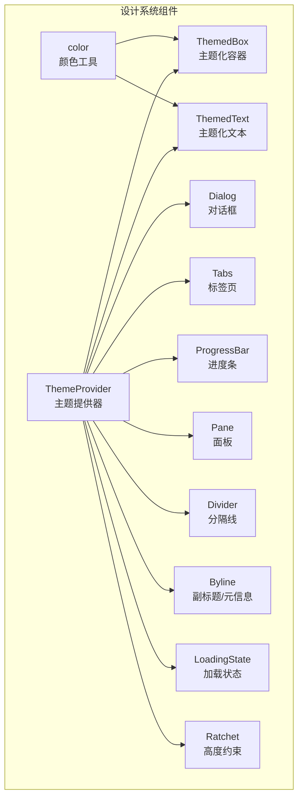
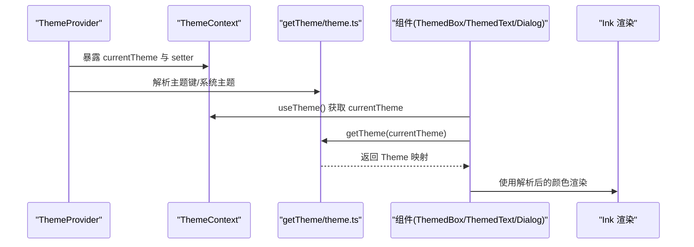
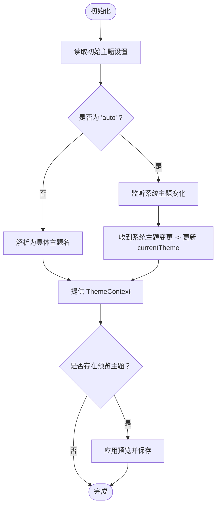
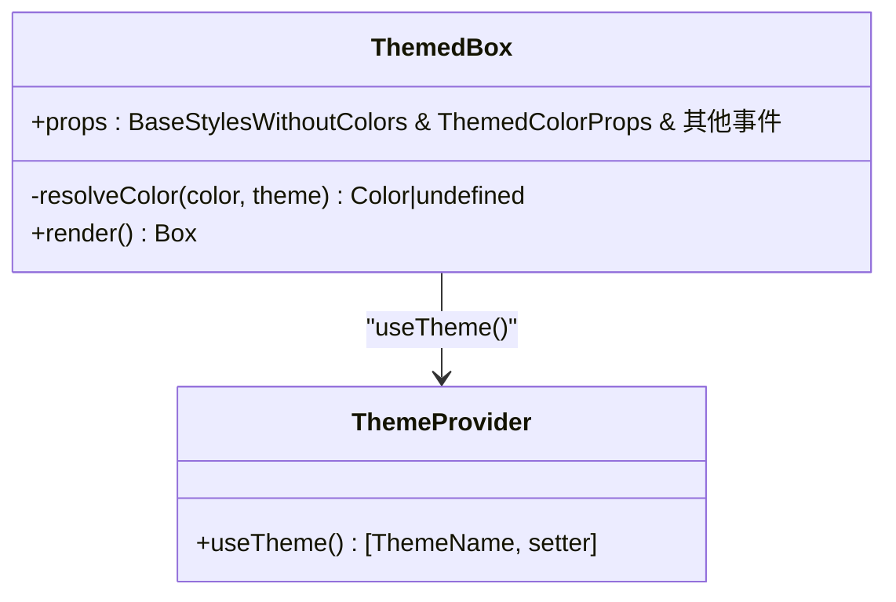
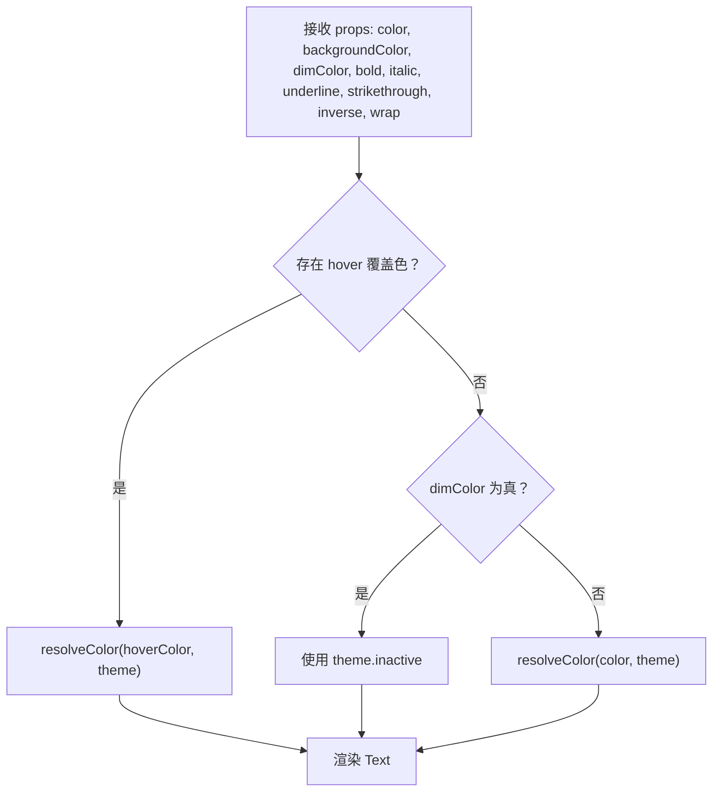
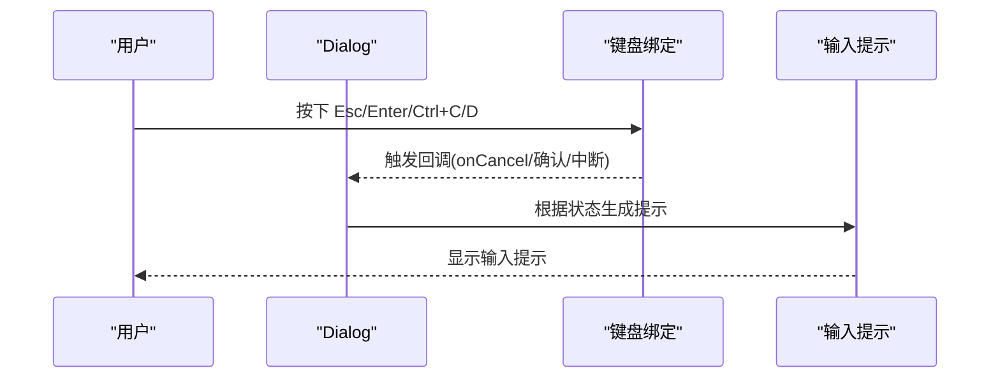
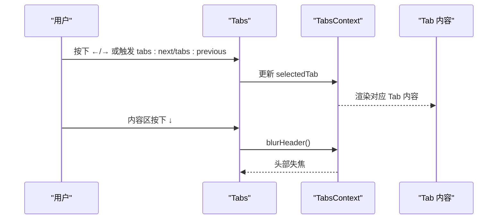
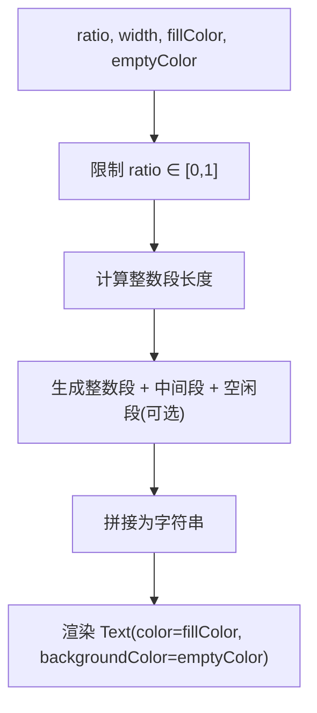
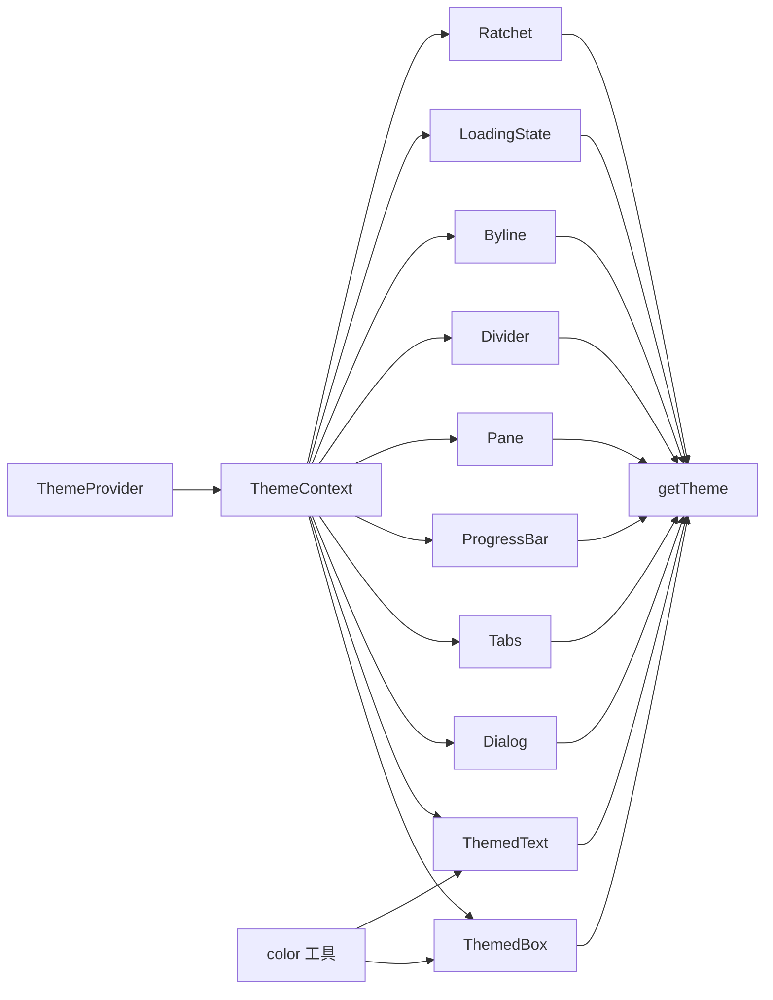

# 设计系统组件

<cite>
**本文档引用的文件**
- [ThemeProvider.tsx](file://src/components/design-system/ThemeProvider.tsx)
- [Dialog.tsx](file://src/components/design-system/Dialog.tsx)
- [Tabs.tsx](file://src/components/design-system/Tabs.tsx)
- [ProgressBar.tsx](file://src/components/design-system/ProgressBar.tsx)
- [ThemedBox.tsx](file://src/components/design-system/ThemedBox.tsx)
- [ThemedText.tsx](file://src/components/design-system/ThemedText.tsx)
- [color.ts](file://src/components/design-system/color.ts)
- [theme.ts](file://src/utils/theme.ts)
- [LoadingState.tsx](file://src/components/design-system/LoadingState.tsx)
- [Pane.tsx](file://src/components/design-system/Pane.tsx)
- [Divider.tsx](file://src/components/design-system/Divider.tsx)
- [Byline.tsx](file://src/components/design-system/Byline.tsx)
- [Ratchet.tsx](file://src/components/design-system/Ratchet.tsx)
</cite>

## 目录
1. [简介](#简介)
2. [项目结构](#项目结构)
3. [核心组件](#核心组件)
4. [架构总览](#架构总览)
5. [详细组件分析](#详细组件分析)
6. [依赖关系分析](#依赖关系分析)
7. [性能考虑](#性能考虑)
8. [故障排除指南](#故障排除指南)
9. [结论](#结论)
10. [附录](#附录)

## 简介
本文件系统化梳理 Claude Code 的设计系统组件，重点覆盖基础对话框、标签页、进度条、主题提供器等核心 UI 组件的设计理念与实现方式。文档从架构、数据流、样式系统、主题支持、颜色方案、响应式布局、加载动画、徽标与 UI 基础元素使用规范、可访问性与国际化适配、性能优化等方面进行深入解析，并提供使用指南与最佳实践。

## 项目结构
设计系统组件集中位于 `src/components/design-system` 目录，围绕 Ink 终端渲染框架构建，通过主题系统统一管理颜色与样式，提供一致的视觉与交互体验。

图表来源
- [ThemeProvider.tsx:1-170](file://src/components/design-system/ThemeProvider.tsx#L1-L170)
- [ThemedBox.tsx:1-156](file://src/components/design-system/ThemedBox.tsx#L1-L156)
- [ThemedText.tsx:1-124](file://src/components/design-system/ThemedText.tsx#L1-L124)
- [Dialog.tsx:1-138](file://src/components/design-system/Dialog.tsx#L1-L138)
- [Tabs.tsx:1-340](file://src/components/design-system/Tabs.tsx#L1-L340)
- [ProgressBar.tsx:1-86](file://src/components/design-system/ProgressBar.tsx#L1-L86)
- [Pane.tsx:1-77](file://src/components/design-system/Pane.tsx#L1-L77)
- [Divider.tsx:1-149](file://src/components/design-system/Divider.tsx#L1-L149)
- [Byline.tsx:1-77](file://src/components/design-system/Byline.tsx#L1-L77)
- [LoadingState.tsx:1-94](file://src/components/design-system/LoadingState.tsx#L1-L94)
- [Ratchet.tsx:1-80](file://src/components/design-system/Ratchet.tsx#L1-L80)
- [color.ts:1-31](file://src/components/design-system/color.ts#L1-L31)

章节来源
- [ThemeProvider.tsx:1-170](file://src/components/design-system/ThemeProvider.tsx#L1-L170)
- [theme.ts:1-640](file://src/utils/theme.ts#L1-L640)

## 核心组件
- 主题提供器（ThemeProvider）：负责主题设置的存储、预览、自动切换与上下文暴露，支持系统主题监听与即时刷新。
- 主题化容器（ThemedBox）：在 Ink Box 基础上增强主题色解析能力，支持边框与背景色的主题键映射。
- 主题化文本（ThemedText）：在 Ink Text 基础上增强主题色解析与样式组合，支持 hover 覆盖色、反色等语义化样式。
- 对话框（Dialog）：终端内标准对话框，内置确认/取消快捷键绑定与输入提示，支持颜色与边框控制。
- 标签页（Tabs）：多标签页导航，支持键盘导航、内容区域固定高度、模态滚动等高级行为。
- 进度条（ProgressBar）：基于块字符的终端进度条，支持填充/空闲颜色与宽度控制。
- 面板（Pane）：带顶部彩色分隔线的面板容器，用于命令页面布局。
- 分隔线（Divider）：水平分隔线，支持标题居中、颜色与宽度控制。
- 副标题（Byline）：以“·”连接的元信息片段，自动过滤无效子节点。
- 加载状态（LoadingState）：带旋转指示器与消息的异步加载组件。
- 高度约束（Ratchet）：根据终端尺寸动态计算最小高度，避免布局抖动。
- 颜色工具（color）：主题感知的颜色函数，支持主题键与原生颜色值解析。

章节来源
- [ThemeProvider.tsx:1-170](file://src/components/design-system/ThemeProvider.tsx#L1-L170)
- [ThemedBox.tsx:1-156](file://src/components/design-system/ThemedBox.tsx#L1-L156)
- [ThemedText.tsx:1-124](file://src/components/design-system/ThemedText.tsx#L1-L124)
- [Dialog.tsx:1-138](file://src/components/design-system/Dialog.tsx#L1-L138)
- [Tabs.tsx:1-340](file://src/components/design-system/Tabs.tsx#L1-L340)
- [ProgressBar.tsx:1-86](file://src/components/design-system/ProgressBar.tsx#L1-L86)
- [Pane.tsx:1-77](file://src/components/design-system/Pane.tsx#L1-L77)
- [Divider.tsx:1-149](file://src/components/design-system/Divider.tsx#L1-L149)
- [Byline.tsx:1-77](file://src/components/design-system/Byline.tsx#L1-L77)
- [LoadingState.tsx:1-94](file://src/components/design-system/LoadingState.tsx#L1-L94)
- [Ratchet.tsx:1-80](file://src/components/design-system/Ratchet.tsx#L1-L80)
- [color.ts:1-31](file://src/components/design-system/color.ts#L1-L31)

## 架构总览
设计系统采用“主题上下文 + 主题键到颜色值映射”的架构，所有组件通过统一的 `useTheme` 获取当前主题名，并由 `getTheme` 解析为具体颜色值。组件内部对颜色键进行解析，确保在不同主题下保持一致的视觉语义。

图表来源
- [ThemeProvider.tsx:43-116](file://src/components/design-system/ThemeProvider.tsx#L43-L116)
- [theme.ts:598-613](file://src/utils/theme.ts#L598-L613)
- [ThemedBox.tsx:56-154](file://src/components/design-system/ThemedBox.tsx#L56-L154)
- [ThemedText.tsx:80-123](file://src/components/design-system/ThemedText.tsx#L80-L123)

## 详细组件分析

### 主题提供器（ThemeProvider）
- 功能要点
  - 支持用户主题设置（含 'auto' 自动模式），并可在预览模式下临时切换。
  - 当处于 'auto' 时，监听系统主题变化并实时更新。
  - 提供 `useTheme`、`useThemeSetting`、`usePreviewTheme` 三类钩子，分别返回解析后的主题名、原始设置与预览控制。
- 关键实现
  - 使用 `useStdin` 的查询器监听系统主题；通过 `getGlobalConfig/saveGlobalConfig` 与持久化配置交互。
  - 在 'auto' 切换时重置系统主题缓存，避免 OSC 轮询闪烁。
- 性能与稳定性
  - 条件引入系统主题监听，外部构建下会被死代码消除，避免额外开销。
  - 使用 useMemo 缓存上下文值，减少不必要的重渲染。

图表来源
- [ThemeProvider.tsx:43-116](file://src/components/design-system/ThemeProvider.tsx#L43-L116)

章节来源
- [ThemeProvider.tsx:1-170](file://src/components/design-system/ThemeProvider.tsx#L1-L170)
- [theme.ts:91-109](file://src/utils/theme.ts#L91-L109)

### 主题化容器（ThemedBox）
- 设计理念
  - 在 Ink Box 基础上扩展主题键到颜色值的解析，支持边框四向与背景色的主题化。
  - 通过 `resolveColor` 判断传入颜色是主题键还是原生颜色值，保证兼容性。
- 使用规范
  - 边框与背景色属性均支持主题键或原生颜色字符串。
  - 与 Ink 事件系统兼容，透传点击/焦点/键盘事件。
- 性能优化
  - 对颜色解析结果进行缓存，避免重复计算。

图表来源
- [ThemedBox.tsx:24-154](file://src/components/design-system/ThemedBox.tsx#L24-L154)
- [ThemeProvider.tsx:122-146](file://src/components/design-system/ThemeProvider.tsx#L122-L146)

章节来源
- [ThemedBox.tsx:1-156](file://src/components/design-system/ThemedBox.tsx#L1-L156)

### 主题化文本（ThemedText）
- 设计理念
  - 支持主题键与原生颜色混合，提供 hover 覆盖色上下文，优先级高于 dimColor。
  - 与 Ink 文本样式完全兼容，支持粗体、斜体、下划线、删除线、反色与文本换行策略。
- 使用规范
  - `color` 可接受主题键或原生颜色；`backgroundColor` 仅接受主题键。
  - `dimColor` 会回退到主题的 inactive 色，且与粗体兼容。
- 性能优化
  - 对解析后的颜色与样式进行缓存，减少重复渲染。

图表来源
- [ThemedText.tsx:80-123](file://src/components/design-system/ThemedText.tsx#L80-L123)

章节来源
- [ThemedText.tsx:1-124](file://src/components/design-system/ThemedText.tsx#L1-L124)

### 对话框（Dialog）
- 设计理念
  - 提供标准的确认/取消与中断交互，内置快捷键绑定与输入提示。
  - 支持自定义颜色、隐藏边框、隐藏输入提示与自定义输入提示内容。
- 行为特性
  - 内置 Ctrl+C/D 中断处理与 Esc/确认键绑定。
  - 输入提示根据退出状态动态显示“再次按下退出”提示。
- 可访问性
  - 键盘导航明确，提示文案清晰，适合全键盘操作。

图表来源
- [Dialog.tsx:30-138](file://src/components/design-system/Dialog.tsx#L30-L138)

章节来源
- [Dialog.tsx:1-138](file://src/components/design-system/Dialog.tsx#L1-L138)

### 标签页（Tabs）
- 设计理念
  - 多标签页导航，支持键盘左右切换、从内容区切换至头部等高级行为。
  - 支持固定内容高度、全宽布局、横幅展示与禁用导航等场景。
- 关键机制
  - TabsContext 提供选中标签 ID、宽度与头部聚焦状态。
  - 通过 `useTabHeaderFocus` 实现头部聚焦与内容区交互的协作。
- 响应式与布局
  - 根据终端宽度与标题/标签宽度计算剩余空间，支持全宽填充与间距留白。

图表来源
- [Tabs.tsx:66-242](file://src/components/design-system/Tabs.tsx#L66-L242)

章节来源
- [Tabs.tsx:1-340](file://src/components/design-system/Tabs.tsx#L1-L340)

### 进度条（ProgressBar）
- 设计理念
  - 基于块字符集绘制细粒度进度条，支持填充色与空闲色。
  - 宽度与比例参数化，适配不同终端宽度。
- 实现细节
  - 将比例映射为整数段与中间段，拼接形成完整条形。
  - 对段数组进行缓存，避免重复拼接。

图表来源
- [ProgressBar.tsx:27-85](file://src/components/design-system/ProgressBar.tsx#L27-L85)

章节来源
- [ProgressBar.tsx:1-86](file://src/components/design-system/ProgressBar.tsx#L1-L86)

### 面板（Pane）
- 设计理念
  - 顶部带彩色分隔线的面板容器，常用于命令页面布局。
  - 在模态场景下跳过分隔线，直接使用内边距布局。
- 使用建议
  - 子级 Dialog 若为子菜单，建议开启 `hideBorder` 以保持面板单一分隔线。

章节来源
- [Pane.tsx:1-77](file://src/components/design-system/Pane.tsx#L1-L77)

### 分隔线（Divider）
- 设计理念
  - 水平分隔线，支持标题居中、颜色与字符自定义、宽度与内边距控制。
- 实现要点
  - 根据终端宽度或指定宽度计算两侧分隔符长度，标题居中显示。
  - 支持 ANSI 样式标题。

章节来源
- [Divider.tsx:1-149](file://src/components/design-system/Divider.tsx#L1-L149)

### 副标题（Byline）
- 设计理念
  - 以“·”连接多个元信息片段，自动过滤无效子节点，仅渲染有效元素间的分隔符。
- 使用场景
  - 快捷键提示、时间戳、字数统计等元信息串联。

章节来源
- [Byline.tsx:1-77](file://src/components/design-system/Byline.tsx#L1-L77)

### 加载状态（LoadingState）
- 设计理念
  - 异步加载场景的标准组件，包含旋转指示器与消息文本，支持加粗与弱化显示。
- 使用建议
  - 结合 `subtitle` 展示更详细的加载说明。

章节来源
- [LoadingState.tsx:1-94](file://src/components/design-system/LoadingState.tsx#L1-L94)

### 高度约束（Ratchet）
- 设计理念
  - 根据终端尺寸与内容测量动态设置最小高度，避免布局抖动。
  - 支持“始终锁定”与“离屏时锁定”两种模式。
- 实现要点
  - 使用 `useTerminalSize` 与 `measureElement` 计算内容高度并限制最大值。

章节来源
- [Ratchet.tsx:1-80](file://src/components/design-system/Ratchet.tsx#L1-L80)

## 依赖关系分析
- 主题系统
  - 组件通过 `useTheme` 获取主题名，再由 `getTheme` 解析为颜色映射。
  - 颜色工具 `color` 提供主题键到颜色值的解析与 Ink 渲染桥接。
- 终端环境
  - 大量组件依赖 Ink 的 Box/Text 与事件系统，以及终端尺寸与视口钩子。
- 主题类型与名称
  - `THEME_NAMES`、`THEME_SETTINGS` 定义可用主题集合与设置项，确保类型安全。

图表来源
- [ThemeProvider.tsx:1-170](file://src/components/design-system/ThemeProvider.tsx#L1-L170)
- [theme.ts:1-640](file://src/utils/theme.ts#L1-L640)
- [color.ts:1-31](file://src/components/design-system/color.ts#L1-L31)

章节来源
- [theme.ts:91-109](file://src/utils/theme.ts#L91-L109)

## 性能考虑
- 渲染缓存
  - 多数组件使用 React 编译器的缓存标记与 useMemo，避免重复计算与渲染。
- 主题解析
  - 主题解析与颜色解析结果缓存，减少重复映射。
- 死代码消除
  - 系统主题监听功能通过条件引入，在外部构建中被移除，降低包体积。
- 布局稳定
  - Ratchet 通过测量与最小高度约束，避免内容高度变化导致的布局抖动。

## 故障排除指南
- 主题未生效
  - 检查是否在 ThemeProvider 包裹范围内使用组件。
  - 确认 `useTheme()` 是否正确获取 currentTheme。
- 自动主题不更新
  - 确认 feature('AUTO_THEME') 开启且 useStdin 查询器可用。
  - 检查系统主题监听是否被正确初始化与清理。
- 颜色显示异常
  - 确认传入颜色是否为合法主题键或原生颜色字符串。
  - 检查 `getTheme` 返回的映射是否包含对应键。
- 键盘快捷键冲突
  - 在嵌入输入框场景，将 Dialog 的 `isCancelActive` 设置为 false，避免拦截输入。
- 布局抖动
  - 使用 Ratchet 或固定内容高度，避免内容高度突变。

章节来源
- [ThemeProvider.tsx:64-80](file://src/components/design-system/ThemeProvider.tsx#L64-L80)
- [Dialog.tsx:20-29](file://src/components/design-system/Dialog.tsx#L20-L29)
- [Ratchet.tsx:38-58](file://src/components/design-system/Ratchet.tsx#L38-L58)

## 结论
Claude Code 的设计系统以主题上下文为核心，结合 Ink 终端渲染能力，提供了高一致性、可扩展且性能友好的 UI 组件体系。通过主题键到颜色值的映射、严格的键盘交互与输入提示、以及针对终端环境的布局与测量策略，组件在复杂交互与多主题场景下仍能保持稳定与易用。

## 附录
- 使用指南与最佳实践
  - 统一在应用根部包裹 ThemeProvider，确保全局主题一致性。
  - 优先使用主题键而非硬编码颜色，便于维护与扩展。
  - 在需要全宽布局的场景使用 Tabs 的 `useFullWidth` 与 `contentHeight` 控制布局稳定性。
  - 对于异步加载场景，使用 LoadingState 并提供清晰的副标题说明。
  - 在模态场景中，子级 Dialog 启用 `hideBorder` 以维持面板边框的完整性。
  - 对于需要系统主题联动的场景，启用 'auto' 主题并确保系统主题监听可用。
- 可访问性与国际化
  - 键盘交互明确，提示文案清晰，适合全键盘操作。
  - 文本样式与颜色对比度遵循主题规范，满足不同主题下的可读性需求。
- 性能优化清单
  - 合理使用 memo 缓存与 useMemo，避免重复计算。
  - 在外部构建中确保系统主题监听被死代码消除。
  - 使用 Ratchet 固定高度，减少布局重排。
  - 避免在高频渲染路径中进行昂贵的颜色解析。