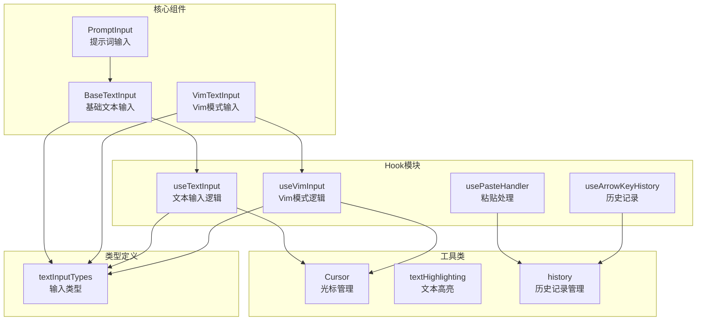
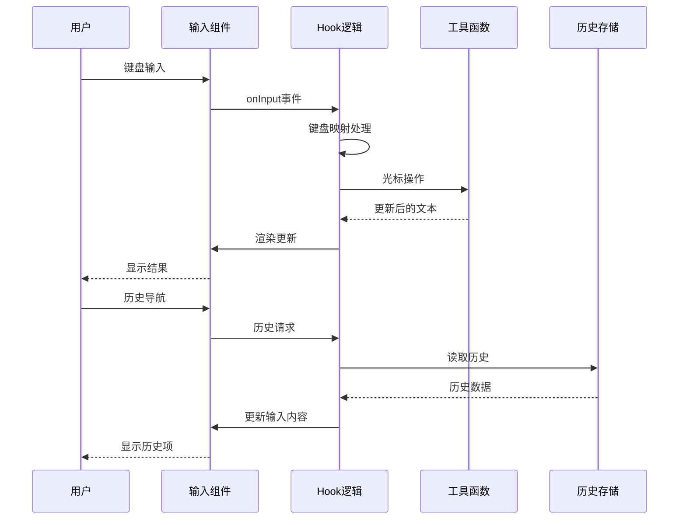
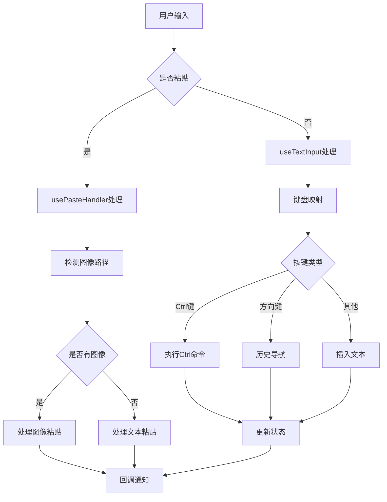
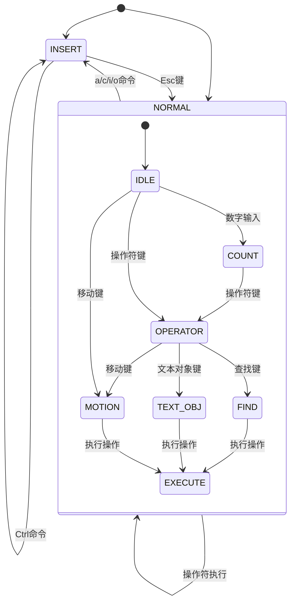
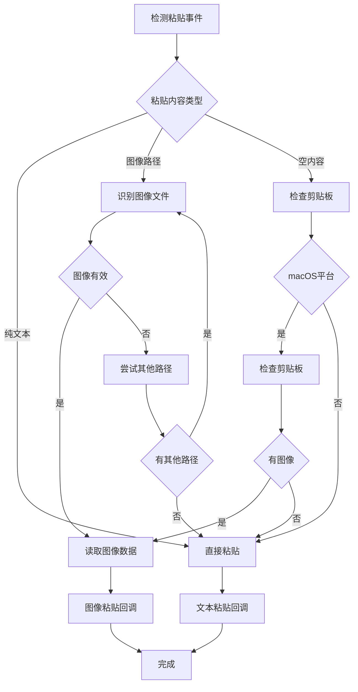
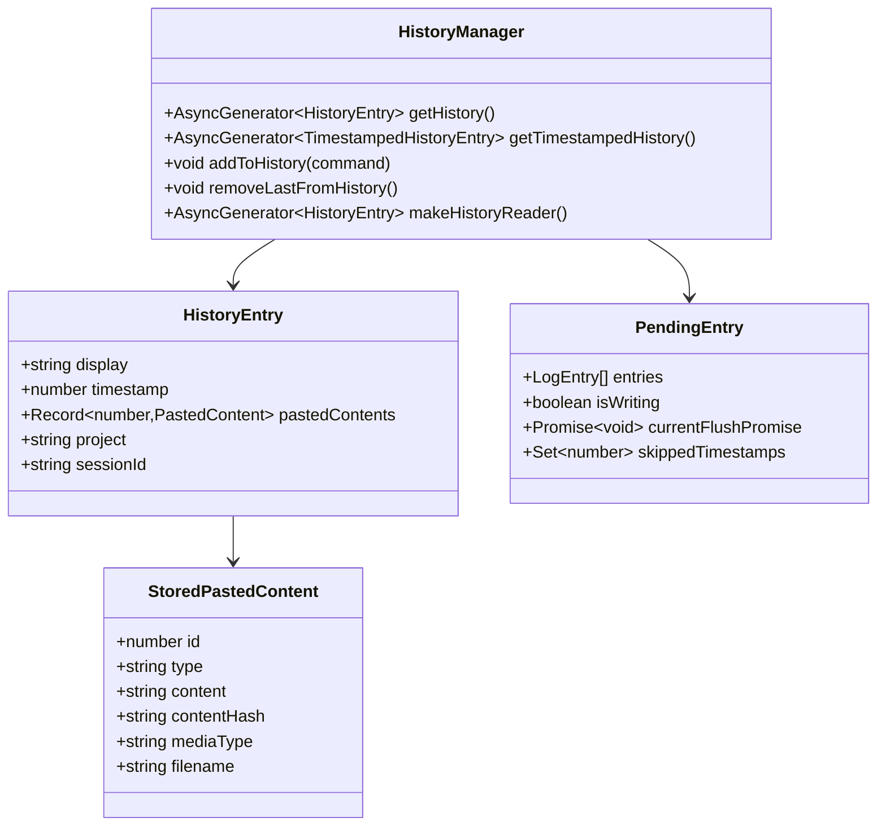
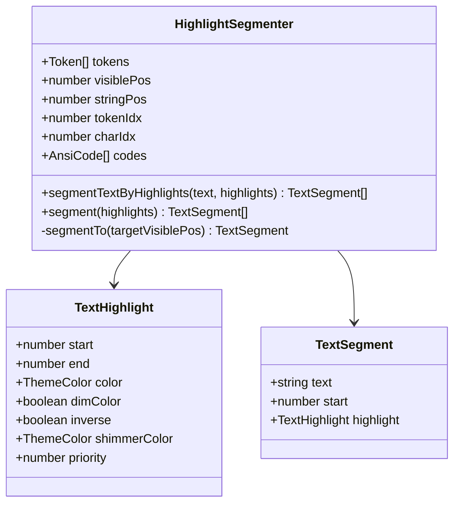
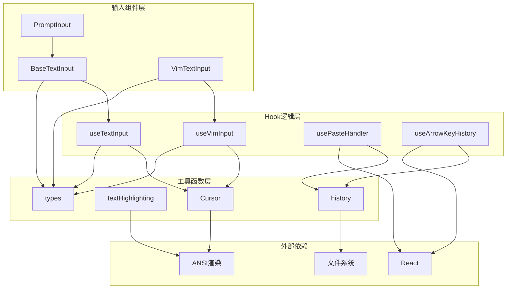

# 输入与交互组件

<cite>
**本文档引用的文件**
- [BaseTextInput.tsx](file://src/components/BaseTextInput.tsx)
- [VimTextInput.tsx](file://src/components/VimTextInput.tsx)
- [useTextInput.ts](file://src/hooks/useTextInput.ts)
- [useVimInput.ts](file://src/hooks/useVimInput.ts)
- [usePasteHandler.ts](file://src/hooks/usePasteHandler.ts)
- [useArrowKeyHistory.tsx](file://src/hooks/useArrowKeyHistory.tsx)
- [history.ts](file://src/history.ts)
- [textInputTypes.ts](file://src/types/textInputTypes.ts)
- [Cursor.ts](file://src/utils/Cursor.ts)
- [ShimmeredInput.tsx](file://src/components/PromptInput/ShimmeredInput.tsx)
- [textHighlighting.ts](file://src/utils/textHighlighting.ts)
</cite>

## 目录
1. [简介](#简介)
2. [项目结构](#项目结构)
3. [核心组件](#核心组件)
4. [架构概览](#架构概览)
5. [详细组件分析](#详细组件分析)
6. [依赖关系分析](#依赖关系分析)
7. [性能考虑](#性能考虑)
8. [故障排除指南](#故障排除指南)
9. [结论](#结论)

## 简介

Claude Code 的输入与交互组件系统是一个高度模块化的文本输入框架，提供了丰富的编辑功能和用户体验优化。该系统的核心是 PromptInput 组件及其变体，支持多种输入模式、键盘快捷键、自动完成、历史记录管理、粘贴处理等功能。

系统采用分层架构设计，通过 Hook 模式提供可复用的功能模块，组件之间通过清晰的接口进行通信。整个系统支持 Vim 模式输入、语音输入集成、可访问性支持等高级特性。

## 项目结构

输入与交互组件系统主要分布在以下目录中：

**图表来源**
- [BaseTextInput.tsx:1-136](file://src/components/BaseTextInput.tsx#L1-L136)
- [VimTextInput.tsx:1-140](file://src/components/VimTextInput.tsx#L1-L140)
- [useTextInput.ts:1-530](file://src/hooks/useTextInput.ts#L1-L530)
- [useVimInput.ts:1-317](file://src/hooks/useVimInput.ts#L1-L317)

**章节来源**
- [BaseTextInput.tsx:1-136](file://src/components/BaseTextInput.tsx#L1-L136)
- [VimTextInput.tsx:1-140](file://src/components/VimTextInput.tsx#L1-L140)
- [useTextInput.ts:1-530](file://src/hooks/useTextInput.ts#L1-L530)

## 核心组件

### 基础文本输入组件 (BaseTextInput)

BaseTextInput 是所有输入组件的基础，提供了核心的文本渲染和输入处理功能：

- **文本渲染**: 支持 ANSI 颜色代码渲染、光标显示、占位符文本
- **输入处理**: 处理键盘事件、粘贴事件、光标移动
- **高亮显示**: 支持文本高亮、闪烁效果
- **焦点管理**: 管理终端焦点状态和光标可见性

### Vim 文本输入组件 (VimTextInput)

VimTextInput 提供了完整的 Vim 编辑器模式支持：

- **双模式支持**: INSERT 和 NORMAL 模式切换
- **命令解析**: 解析 Vim 命令序列和操作符
- **状态管理**: 维护 Vim 状态机和持久化状态
- **操作执行**: 执行 Vim 操作如删除、复制、粘贴等

### 输入钩子系统

系统使用 Hook 模式提供可复用的功能：

- **useTextInput**: 核心文本输入逻辑，包括键盘映射、历史导航
- **useVimInput**: Vim 模式专用逻辑，包括状态机转换
- **usePasteHandler**: 粘贴处理和图像识别
- **useArrowKeyHistory**: 方向键历史记录导航

**章节来源**
- [BaseTextInput.tsx:22-135](file://src/components/BaseTextInput.tsx#L22-L135)
- [VimTextInput.tsx:13-135](file://src/components/VimTextInput.tsx#L13-L135)
- [useTextInput.ts:73-529](file://src/hooks/useTextInput.ts#L73-L529)
- [useVimInput.ts:34-316](file://src/hooks/useVimInput.ts#L34-L316)

## 架构概览

输入系统采用分层架构，从底层到上层依次为：

**图表来源**
- [useTextInput.ts:431-501](file://src/hooks/useTextInput.ts#L431-L501)
- [useArrowKeyHistory.tsx:124-182](file://src/hooks/useArrowKeyHistory.tsx#L124-L182)
- [history.ts:190-217](file://src/history.ts#L190-L217)

系统的核心特点是：

1. **模块化设计**: 每个功能都封装在独立的模块中
2. **Hook 模式**: 使用 React Hooks 提供可复用的逻辑
3. **异步处理**: 历史记录和粘贴处理都是异步的
4. **状态管理**: 通过 React 状态和自定义 Hook 管理复杂状态

## 详细组件分析

### 文本输入处理流程

**图表来源**
- [usePasteHandler.ts:214-278](file://src/hooks/usePasteHandler.ts#L214-L278)
- [useTextInput.ts:318-413](file://src/hooks/useTextInput.ts#L318-L413)

### Vim 模式状态机

Vim 模式的实现采用了完整的状态机设计：

**图表来源**
- [useVimInput.ts:175-295](file://src/hooks/useVimInput.ts#L175-L295)
- [types.ts:49-76](file://src/vim/types.ts#L49-L76)

### 粘贴处理机制

系统实现了智能的粘贴处理，支持多种粘贴场景：

**图表来源**
- [usePasteHandler.ts:118-194](file://src/hooks/usePasteHandler.ts#L118-L194)
- [usePasteHandler.ts:245-250](file://src/hooks/usePasteHandler.ts#L245-L250)

**章节来源**
- [usePasteHandler.ts:30-285](file://src/hooks/usePasteHandler.ts#L30-L285)
- [useVimInput.ts:175-295](file://src/hooks/useVimInput.ts#L175-L295)
- [useTextInput.ts:431-501](file://src/hooks/useTextInput.ts#L431-L501)

### 历史记录管理系统

历史记录系统提供了高效的历史数据管理和检索功能：

**图表来源**
- [history.ts:151-180](file://src/history.ts#L151-L180)
- [history.ts:219-225](file://src/history.ts#L219-L225)
- [history.ts:281-289](file://src/history.ts#L281-L289)

**章节来源**
- [history.ts:190-217](file://src/history.ts#L190-L217)
- [history.ts:355-434](file://src/history.ts#L355-L434)

### 文本高亮系统

系统提供了强大的文本高亮功能，支持复杂的样式组合：

**图表来源**
- [textHighlighting.ts:11-25](file://src/utils/textHighlighting.ts#L11-L25)
- [textHighlighting.ts:62-94](file://src/utils/textHighlighting.ts#L62-L94)

**章节来源**
- [textHighlighting.ts:27-60](file://src/utils/textHighlighting.ts#L27-L60)
- [ShimmeredInput.tsx:15-139](file://src/components/PromptInput/ShimmeredInput.tsx#L15-L139)

## 依赖关系分析

输入系统各组件之间的依赖关系如下：

**图表来源**
- [BaseTextInput.tsx:1-136](file://src/components/BaseTextInput.tsx#L1-L136)
- [useTextInput.ts:1-530](file://src/hooks/useTextInput.ts#L1-L530)
- [useVimInput.ts:1-317](file://src/hooks/useVimInput.ts#L1-L317)

**章节来源**
- [textInputTypes.ts:1-388](file://src/types/textInputTypes.ts#L1-L388)
- [Cursor.ts:1-800](file://src/utils/Cursor.ts#L1-L800)

## 性能考虑

输入系统在设计时充分考虑了性能优化：

### 内存管理
- **虚拟滚动**: 通过视口窗口化减少渲染开销
- **增量更新**: 只更新变化的部分文本
- **缓存策略**: 历史记录分块加载，避免频繁磁盘访问

### 异步处理
- **批量写入**: 历史记录采用批量写入策略
- **防抖处理**: 粘贴检测使用防抖机制
- **并发控制**: 历史记录加载采用并发控制

### 渲染优化
- **条件渲染**: 只在需要时渲染高亮效果
- **懒加载**: 图像内容按需加载
- **动画优化**: 使用硬件加速的动画效果

## 故障排除指南

### 常见问题及解决方案

**问题1: 粘贴功能异常**
- 检查终端是否支持括号粘贴模式
- 验证剪贴板权限设置
- 确认图像文件路径有效性

**问题2: Vim 模式切换问题**
- 确认 Esc 键映射正确
- 检查模式状态同步
- 验证操作符解析逻辑

**问题3: 历史记录不显示**
- 检查历史文件权限
- 验证项目根目录配置
- 确认会话标识符一致性

**问题4: 性能问题**
- 检查文本长度限制
- 验证高亮效果数量
- 优化渲染频率

**章节来源**
- [usePasteHandler.ts:57-61](file://src/hooks/usePasteHandler.ts#L57-L61)
- [useVimInput.ts:49-59](file://src/hooks/useVimInput.ts#L49-L59)
- [history.ts:411-434](file://src/history.ts#L411-L434)

## 结论

Claude Code 的输入与交互组件系统展现了现代前端架构的最佳实践。通过模块化设计、Hook 模式和状态机实现，系统提供了强大而灵活的文本输入能力。

系统的主要优势包括：

1. **高度模块化**: 功能分离明确，易于维护和扩展
2. **性能优化**: 采用多种优化策略确保流畅体验
3. **可访问性**: 支持多种输入模式和辅助功能
4. **可定制性**: 通过 Hook 和配置选项提供灵活的定制能力

未来可以考虑的改进方向：
- 进一步优化大文本处理性能
- 增强语音输入集成
- 扩展快捷键自定义功能
- 改进跨平台兼容性